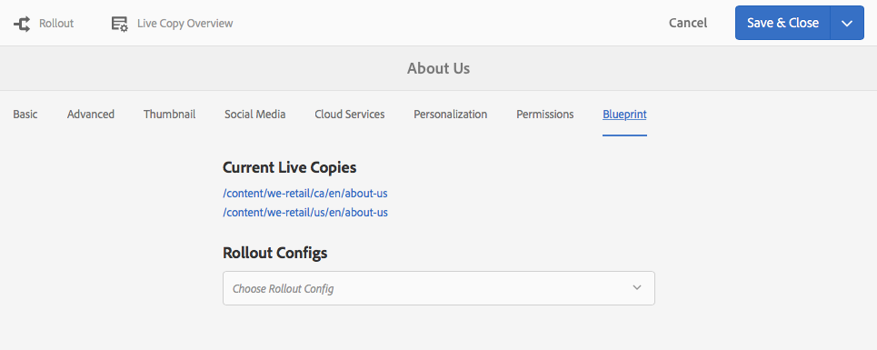

# Console de Visão Geral do Live Copy{#live-copy-overview-console}

O **Live Copy Overview** permite que você:

* Visualização/gerenciamento da herança em um site:

   * Visualização da árvore de blueprint e da estrutura de live copy correspondente, juntamente com o status de herança
   * Alterar o status da herança; por exemplo, suspender, retomar
   * Propriedades de blueprint e live copy da visualização

* Executar ações de implantação

## Abrindo a visão geral da Live Copy {#opening-the-live-copy-overview}

Você pode abrir a Visão geral da Live Copy em:

* [Painel de referências laterais de uma página de blueprint (console Sites)](#opening-live-copy-overview-references-for-a-blueprint-page)
* [Propriedades de uma página de blueprint](#opening-live-copy-overview-properties-of-a-blueprint-page)

### Abrindo a visão geral da Live Copy - Referências para uma página do Blueprint {#opening-live-copy-overview-references-for-a-blueprint-page}

O **Live Copy Overview** pode ser aberto a partir do painel lateral **Referências** do console **Sites**:

1. No console **Sites**, [navegue até a página de blueprint e selecione-a](/help/sites-authoring/basic-handling.md#viewing-and-selecting-resources).
1. Abra o painel **[Referências](/help/sites-authoring/basic-handling.md#references)** e selecione **Live Copies**.

   

   >[!NOTE]
   >
   >Você também pode abrir Referências primeiro e depois selecionar o blueprint.

1. Selecione **Visão geral da Live Copy** para mostrar e usar a visão geral de todas as cópias online relacionadas ao blueprint selecionado.
1. Use **Close** para sair e retornar ao console **Sites**.

### Abrindo a visão geral do Live Copy - Propriedades de uma página do Blueprint {#opening-live-copy-overview-properties-of-a-blueprint-page}

**Visão geral do Live Copy** pode ser aberta ao exibir propriedades de uma página de blueprint:

1. Abra **Propriedades** para a página de blueprint apropriada.
1. Abra a guia **Blueprint** - a opção **Visão geral da Live Copy** será exibida na barra de ferramentas superior:

   

1. Selecione **Visão geral do Live Copy** para mostrar e usar a visão geral de todas as cópias online relacionadas ao blueprint atual.

   >[!NOTE]
   >
   >Para obter mais detalhes, consulte também o artigo da Base de conhecimento [Mensagem de status do Livecopy - Atualizado/Verde/Em Sincronização](https://helpx.adobe.com/experience-manager/kb/livecopy-status-message---up-to-date-green-in-sync.html).

1. Use **Close** para sair e retornar ao console **Sites**.

## Uso da visão geral da Live Copy {#using-the-live-copy-overview}

O **Live Copy Overview** também pode ser usado para executar ações na live copy:

1. Abra a **Visão geral da Live Copy**.
1. Selecione a página de blueprint ou live copy necessária - a barra de ferramentas será atualizada para mostrar as ações disponíveis. As [ações](/help/sites-administering/msm.md#terms-used) disponíveis dependem de você selecionar uma página [blueprint](#actions-for-a-blueprint-page) ou [live copy](#actions-for-a-live-copy-page):

### Ações para uma página do Blueprint {#actions-for-a-blueprint-page}

Quando você seleciona uma página de blueprint, as seguintes ações estão disponíveis:

* Editar

   * Abra a página do blueprint para edição.

* [Implantação](/help/sites-administering/msm.md#rollout-and-synchronize)

   * Execute uma implementação para enviar as alterações da origem para a live copy.

### Ações para uma página de Live Copy {#actions-for-a-live-copy-page}

Quando você seleciona uma página de live copy, as seguintes ações estão disponíveis:

* Editar

   * Abra a página de cópia online para edição.

* [Status do relacionamento](#relationship-status)

   * Informações de visualização sobre o status e a herança.

* [Sincronizar](/help/sites-administering/msm.md#rollout-and-synchronize)

   * Sincronize uma live copy para extrair as alterações da origem para a live copy.

* [Redefinir](/help/sites-administering/msm-livecopy.md#resetting-a-live-copy-page)

   * Redefina uma página de cópia ao vivo para remover todos os cancelamentos de herança e retornar a página ao mesmo estado que a página de origem.

* [Suspender](/help/sites-administering/msm.md#suspending-and-cancelling-inheritance-and-synchronization)

   * Desativa temporariamente a relação ao vivo entre uma live copy e sua página de blueprint.

* [Retomar](/help/sites-administering/msm-livecopy.md#resuming-inheritance-for-a-page)

   * A opção Retomar permite que você reinstale uma relação suspensa.

* [Destacar](/help/sites-administering/msm.md#detaching-a-live-copy)

   * Remove permanentemente a relação ao vivo entre uma live copy e sua página de blueprint.

## Status do relacionamento {#relationship-status}

O console **Relationship Status** tem duas guias que fornecem uma variedade de funcionalidades:

* [Informações sobre o status do relacionamento](#relationship-status-information)
* [Informações da Live Copy](#live-copy-information)

### Informações sobre o status do relacionamento {#relationship-status-information}

Esta guia fornece informações detalhadas sobre o status da relação entre o blueprint e a live copy:

### Informações da Live Copy {#live-copy-information}

Esta guia permite que você visualização e edite a configuração da live copy:

