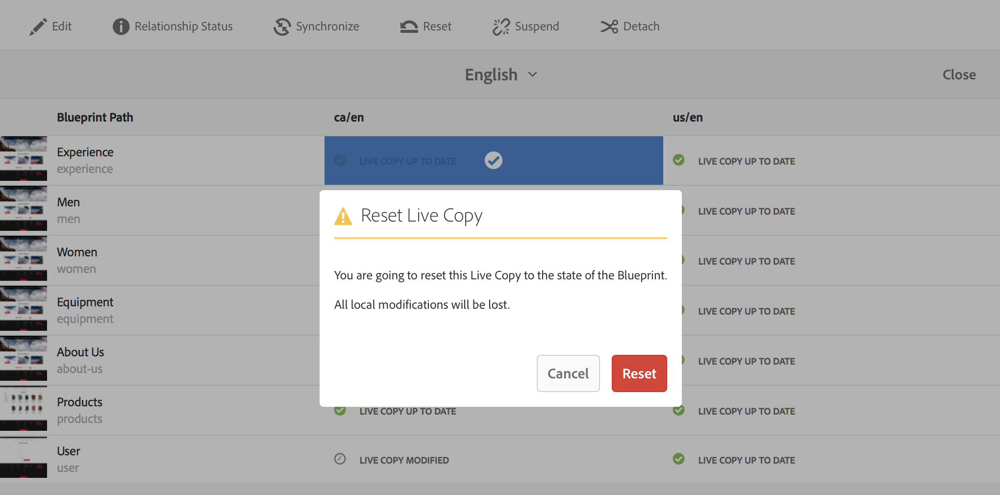

# Criando e Sincronizando Live Copies{#creating-and-synchronizing-live-copies}

Você pode criar uma live copy a partir de uma página ou configuração do blueprint, em seguida, pode gerenciar a herança e a sincronização.

## Gerenciando configurações do Blueprint {#managing-blueprint-configurations}

Uma configuração de blueprint identifica um site existente que você deseja usar como origem de uma ou mais páginas de Live Copy.

>[!NOTE]
>
>As configurações do Blueprint permitem que você envie alterações de conteúdo para cópias ativas. Consulte [Live Copies - Origem, Blueprints e configurações do Blueprint](/help/sites-administering/msm.md#source-blueprints-and-blueprint-configurations).

Ao criar uma configuração do blueprint, você seleciona um modelo que define a estrutura interna do blueprint. O modelo de blueprint padrão assume que o site de origem tem as seguintes características:

* O site tem uma página raiz.
* As páginas secundárias imediatas da raiz são ramificações de idioma do site. Ao criar uma live copy, os idiomas são apresentados como conteúdo opcional a ser incluído na cópia.
* A raiz de cada ramificação de idioma tem uma ou mais páginas secundárias. Ao criar uma live copy, as páginas secundárias são apresentadas como capítulos que podem ser incluídos na live copy.

>[!NOTE]
>
>Uma estrutura diferente requer outro modelo de blueprint.

Após criar a configuração do blueprint, configure as seguintes propriedades:

* **Nome**: O nome da configuração do blueprint.
* **Caminho** de origem: O caminho da página raiz do site que você está usando como fonte (blueprint).
* **Descrição**. (Opcional) Uma descrição da configuração do blueprint. A descrição é exibida na lista de configurações do blueprint para escolher ao criar um site.

Quando sua configuração do blueprint é usada, você pode associá-la a uma configuração de implementação que determina como as cópias em tempo real da origem/blueprint são sincronizadas. Consulte [Especificando as Configurações de Implantação para Usar](/help/sites-administering/msm-sync.md#specifying-the-rollout-configurations-to-use).

### Criação de uma configuração do Blueprint {#creating-a-blueprint-configuration}

Para criar uma configuração do blueprint:

1.  Navegue até o menu  **** Ferramentas e selecione o  **** menu Sites.
1. Selecione **Blueprints** para abrir o console **Configurações do Blueprint**:

   

1. Selecione **Criar**.
1. Selecione o modelo do blueprint e **Next** para continuar.
1. Selecione a página de origem a ser usada como blueprint; em seguida **Próximo** para continuar.
1. Defina:

   * **Título**: título obrigatório para o blueprint
   * **Descrição**: uma descrição opcional para fornecer mais detalhes.

1. **** Criar criará a configuração do blueprint com base em sua especificação.

### Editar ou excluir uma configuração do Blueprint {#editing-or-deleting-a-blueprint-configuration}

Você pode editar ou excluir uma configuração de blueprint existente:

1.  Navegue até o menu  **** Ferramentas e selecione o  **** menu Sites.
1. Selecione **Blueprints** para abrir o console **Configurações do Blueprint**:

   

1. Selecione a configuração necessária do blueprint; as ações apropriadas ficarão disponíveis na barra de ferramentas:

   * **Propriedades**; é possível usar essa opção para exibir e editar as propriedades da configuração.
   * **Excluir**

## Criação de uma Live Copy {#creating-a-live-copy}

### Criação de uma Live Copy de uma Página {#creating-a-live-copy-of-a-page}

Você pode criar uma live copy de qualquer página ou ramificação. Ao criar a Live Copy, você pode especificar as configurações de implementação a serem usadas para sincronizar o conteúdo:

* As configurações de implementação selecionadas se aplicam à página de Live Copy e suas páginas filhas.
* Se você não especificar nenhuma configuração de implementação, o MSM determinará quais configurações de implementação usar. Consulte [Especificando a Configuração de Implantação a Ser Usada](/help/sites-administering/msm-sync.md#specifying-the-rollout-configurations-to-use).

Você pode criar uma live copy de qualquer página:

* Páginas referenciadas por uma [configuração do blueprint](#creating-a-blueprint-configuration).
* E páginas que não têm conexão com uma configuração.
* AEM também oferece suporte à criação de uma live copy dentro das páginas de outra live copy.

A única diferença é que a disponibilidade do comando **Rollout** nas páginas de origem/blueprint depende de se a origem é referenciada por uma configuração de blueprint:

* Se você criar a live copy a partir de uma página de origem que **é** referenciada em uma configuração de blueprint, o comando Rollout estará disponível na(s) página(s) de origem/blueprint.
* Se você criar a live copy a partir de uma página de origem que **não é** referenciada em uma configuração de blueprint, o comando Implantação não estará disponível na(s) página(s) de origem/blueprint.

Para criar uma live copy:

1. No console **Sites** selecione **Criar**, em seguida **Live Copy**.

   

1. Selecione a página de origem e clique ou toque em **Próximo**. Por exemplo:

   

1. Especifique o caminho de destino da live copy (abra a pasta/página principal da live copy) e clique ou toque em **Next**.

   

   >[!NOTE]
   >
   >O caminho de destino não pode estar dentro do caminho de origem.

1. Informe:

   * um **Título** para a página.
   * um **Nome**, que é usado no URL.

   

1. Use a caixa de seleção **Excluir subpáginas**:

   * Selecionado: criar uma live copy da página selecionada somente (live copy superficial)
   * Não Selecionado: criar uma live copy que inclua todos os descendentes da página selecionada (deep live copy)

1. (Opcional) Para especificar uma ou mais configurações de implementação a serem usadas para a livecopy, use a lista suspensa **Configurações de implementação** para selecioná-las; as configurações selecionadas serão exibidas sob o seletor suspenso.
1. Clique ou toque em **Criar**. Uma mensagem de confirmação será exibida; aqui, você pode selecionar **Open** ou **Concluído**.

### Criando uma Live Copy de um Site a partir de uma Configuração do Blueprint {#creating-a-live-copy-of-a-site-from-a-blueprint-configuration}

Crie uma live copy usando uma configuração do blueprint para criar um site com base no conteúdo do blueprint (fonte). Ao criar uma live copy a partir de uma configuração do blueprint, você seleciona uma ou mais ramificações de idioma da origem do blueprint a serem copiadas e, em seguida, seleciona os capítulos a serem copiados das ramificações de idioma. Consulte [Criação de uma Configuração do Blueprint](/help/sites-administering/msm-livecopy.md#creating-a-blueprint-configuration).

Se você omitir algumas ramificações ou capítulos de idioma da live copy, poderá adicioná-los posteriormente; consulte [Criação de uma Live Copy em uma Live Copy (Configuração do Blueprint)](#creating-a-live-copy-inside-a-live-copy-blueprint-configuration).

>[!CAUTION]
>
>Quando a fonte do blueprint contém links e referências que direcionam um parágrafo em uma ramificação diferente, os destinos não são atualizados nas páginas de Live Copy, mas permanecem apontados para o destino original.

Ao criar o site, forneça valores para as seguintes propriedades:

* **Idiomas** iniciais: As ramificações de idioma da origem do blueprint a serem incluídas na live copy.
* **Capítulos** iniciais: As páginas filhas das ramificações de linguagem do blueprint a serem incluídas na live copy.
* **Caminho** de destino: O local da página raiz do site de live copy.
* **Título**: O título da página raiz do site de live copy.
* **Nome**: (Opcional) O nome do nó JCR que armazena a página raiz da live copy. O valor padrão é baseado no título.
* **Proprietário** do Site: (Opcional)
* **Live Copy**: Selecione essa opção para estabelecer uma relação ativa com o site de origem. Se você não selecionar essa opção, uma cópia do blueprint será criada, mas não será sincronizada subsequentemente com a origem.
* **Configurações** de implantação: (Opcional) Selecione uma ou mais configurações de implementação a serem usadas para sincronizar a live copy. Por padrão, as configurações de implementação são herdadas do blueprint; consulte [Especificando as Configurações de Implantação para Usar](/help/sites-administering/msm-sync.md#specifying-the-rollout-configurations-to-use) para obter mais detalhes.

Para criar uma live copy de um site a partir de uma configuração do blueprint:

1. No console **Sites**, selecione **Criar** e **Site** no seletor suspenso.
1. Selecione a configuração do blueprint a ser usada como a fonte da live copy e continue com **Next**:

   

1. Use o seletor **Idiomas iniciais** para especificar os idiomas do site do blueprint a serem usados na live copy.

   Todos os idiomas disponíveis são selecionados por padrão. Para remover um idioma, clique ou toque no **X** que aparece ao lado do idioma.

   Por exemplo:

   

1. Use o menu suspenso **Capítulos iniciais** para selecionar as seções do blueprint a serem incluídas na live copy. Novamente, todos os capítulos disponíveis são incluídos por padrão, mas podem ser removidos.
1. Forneça valores para as propriedades restantes e selecione **Create**. Na caixa de diálogo de confirmação, selecione **Concluído** para retornar ao console **Sites** ou **Abrir Site** para abrir a página raiz do site.

### Criação de uma Live Copy dentro de uma Live Copy (Configuração do Blueprint) {#creating-a-live-copy-inside-a-live-copy-blueprint-configuration}

Ao criar uma live copy dentro da live copy existente (criada usando uma configuração de blueprint), você pode inserir qualquer cópia de idioma ou capítulos que não foram incluídos quando a live copy foi originalmente criada.

## Monitoramento da Live Copy {#monitoring-your-live-copy}

### Ver o status de uma Live Copy {#seeing-the-status-of-a-live-copy}

As propriedades de uma página de Live Copy mostram as seguintes informações sobre a live copy:

* **Fonte**: A página de origem da página de Live Copy.
* **Status**: O status de sincronização da live copy. O status inclui se a live copy está atualizada com a origem e quando a última sincronização ocorreu e quem executou a sincronização.
* **Configuração**:

   * Se a página ainda está sujeita à herança da live copy.
   * Se a configuração é herdada da página principal.
   * Todas as configurações de implementação que a Live Copy usa.

Para exibir as propriedades:

1. No console **Sites**, selecione a página de Live Copy e abra as propriedades.
1. Selecione a guia **Live Copy**.

   Por exemplo:

   

   >[!NOTE]
   >
   >Para obter mais detalhes, consulte também o artigo da Base de conhecimento [Mensagem de status Livecopy - Atualizada/Verde/Em Sincronização](https://helpx.adobe.com/experience-manager/kb/livecopy-status-message---up-to-date-green-in-sync.html).

### Ver as Live Copies de uma Página do Blueprint {#seeing-the-live-copies-of-a-blueprint-page}

As páginas do blueprint (referenciadas em uma configuração do blueprint) fornecem uma lista das páginas de Live Copy que usam a página atual (blueprint) como fonte. Use essa lista para rastrear as cópias em tempo real. A lista é exibida na guia **Blueprint** das [propriedades da página](/help/sites-authoring/editing-page-properties.md).

## Sincronização da Live Copy {#synchronizing-your-live-copy}

### Implantação de um blueprint {#rolling-out-a-blueprint}

Implemente uma página de blueprint para enviar alterações de conteúdo para cópias ativas. Uma ação **Rollout** executa as configurações de implementação que usam o acionador [Na implantação](/help/sites-administering/msm-sync.md#rollout-triggers).

>[!NOTE]
>
>Conflitos podem ocorrer se novas páginas com o mesmo nome de página forem criadas na ramificação do blueprint e em uma ramificação de live copy dependente.
>
>Esses [conflitos precisam ser tratados e resolvidos na implantação](/help/sites-administering/msm-rollout-conflicts.md).

#### Implantação de um blueprint nas propriedades da página {#rolling-out-a-blueprint-from-page-properties}

1. No console **Sites**, selecione a página no blueprint e abra as propriedades.
1. Abra a guia **Blueprint.**
1. Selecione **Implantação**.

   

1. Especifique as páginas e quaisquer subpáginas e, em seguida, confirme com a marca de seleção:

   

1. Especifique se o trabalho de implementação deve ser executado imediatamente (**Now**) ou em outra data/hora (**Later**).

   

As implantações são processadas como trabalhos assíncronos e podem ser verificadas no painel [**Status de trabalhos assíncronos**](asynchronous-jobs.md#monitor-the-status-of-asynchronous-operations) em **Navegação global** -> **Ferramentas** -> **Operações** -> **Trabalhos**

>[!NOTE]
>
>O processamento assíncrono da implantação requer AEM 6.5.3.0 ou superior. Em versões anteriores, as páginas eram processadas imediatamente e de forma síncrona.

#### Implantar um blueprint no painel de referência {#roll-out-a-blueprint-from-the-reference-rail}

1. No console **Sites**, selecione a página no blueprint e abra o painel **[Referências](/help/sites-authoring/basic-handling.md#references)** (na barra de ferramentas).
1. Selecione a opção **Blueprint** na lista para mostrar os blueprints associados a esta página.
1. Selecione o blueprint necessário na lista.
1. Clique ou toque em **Implantação**.
1. Você receberá uma solicitação para confirmar os detalhes da implantação:

   * **Escopo da implantação**:

      Especifique se o escopo é apenas para a página selecionada ou deve incluir subpáginas.

   * **Programação**:

      Especifique se o trabalho de implementação deve ser executado imediatamente (**Now**) ou em uma data/hora posterior (**Mais Tarde**).

      

1. Depois de confirmar esses detalhes, selecione **Rollout** para executar a ação.

As implantações são processadas como trabalhos assíncronos e podem ser verificadas no painel [**Status de trabalhos assíncronos**](asynchronous-jobs.md#monitor-the-status-of-asynchronous-operations) em **Navegação global** -> **Ferramentas** -> **Operações** -> **Trabalhos**

>[!NOTE]
>
>O processamento assíncrono da implantação requer AEM 6.5.3.0 ou superior. Em versões anteriores, as páginas eram processadas imediatamente e de forma síncrona, a menos que a opção **Background rollout** tivesse sido marcada.

#### Implantar um blueprint na visão geral da Live Copy {#roll-out-a-blueprint-from-the-live-copy-overview}

A ação [Implantação também está disponível na Visão geral da Live Copy](/help/sites-administering/msm-livecopy-overview.md#using-the-live-copy-overview), quando uma página do Blueprint é selecionada.

1. Abra o [Visão geral da Live Copy](/help/sites-administering/msm-livecopy-overview.md#using-the-live-copy-overview) e selecione uma Página do Blueprint.
1. Selecione **Implantação** na barra de ferramentas.
1. Especifique as páginas e quaisquer subpáginas e, em seguida, confirme com a marca de seleção:

   

1. Especifique se o trabalho de implementação deve ser executado imediatamente (**Now**) ou em outra data/hora (**Later**).

   

As implantações são processadas como trabalhos assíncronos e podem ser verificadas no painel [**Status de trabalhos assíncronos**](asynchronous-jobs.md#monitor-the-status-of-asynchronous-operations) em **Navegação global** -> **Ferramentas** -> **Operações** -> **Trabalhos**

>[!NOTE]
>
>O processamento assíncrono da implantação requer AEM 6.5.3.0 ou superior. Em versões anteriores, as páginas eram processadas imediatamente e de forma síncrona.

### Sincronização de uma Live Copy {#synchronizing-a-live-copy}

Sincronize uma página de Live Copy para extrair alterações de conteúdo da origem para a Live Copy.

#### Sincronizar uma Live Copy das propriedades da página {#synchronize-a-live-copy-from-page-properties}

Sincronize uma live copy para extrair as alterações da origem para a live copy.

>[!NOTE]
>
>A sincronização executa as configurações de implementação que usam o acionador [Na implantação](/help/sites-administering/msm-sync.md#rollout-triggers).

1. No console **Sites**, selecione a página de Live Copy e abra as propriedades.
1. Abra a guia **Live Copy**.
1. Clique ou toque em **Sincronizar**.

   

   A confirmação será solicitada, use **Sync** para continuar.

#### Sincronizar uma Live Copy da visão geral da Live Copy {#synchronize-a-live-copy-from-the-live-copy-overview}

A ação [Sincronizar também está disponível na Visão geral da Live Copy](/help/sites-administering/msm-livecopy-overview.md#using-the-live-copy-overview), quando uma página de Live Copy é selecionada.

1. Abra o [Visão geral da Live Copy](/help/sites-administering/msm-livecopy-overview.md#using-the-live-copy-overview) e selecione uma Página da Live Copy.
1. Selecione **Sincronizar** na barra de ferramentas.
1. Confirme a ação **Rollout** na caixa de diálogo depois de especificar se deseja incluir:

   * **Páginas e subpáginas**
   * **Somente página**

   

## Alterar conteúdo da Live Copy {#changing-live-copy-content}

Para alterar o conteúdo da live copy, você pode:

* Adicionar parágrafos à página.
* Atualize o conteúdo existente quebrando a herança da live copy de qualquer página ou componente.

>[!NOTE]
>
>Se você criar manualmente uma nova página na live copy, ela será local para a live copy, o que significa que ela não tem uma página de origem correspondente para anexar.
>
>A prática recomendada para criar uma página local que faça parte do relacionamento seria criá-la na origem e realizar uma implantação (profunda). Isso criará a página localmente como cópias ativas.

>[!NOTE]
>
>Conflitos podem ocorrer se novas páginas com o mesmo nome de página forem criadas na ramificação do blueprint e em uma ramificação de live copy dependente.
>
>Esses [conflitos precisam ser tratados e resolvidos na implantação](/help/sites-administering/msm-rollout-conflicts.md).

### Adicionar componentes a uma página de Live Copy {#adding-components-to-a-live-copy-page}

Adicione componentes a uma página de Live Copy a qualquer momento. O status de herança da live copy e de seu sistema de parágrafo não controla sua capacidade de adicionar componentes.

Quando a página de Live Copy é sincronizada com a página de origem, os componentes adicionados permanecem inalterados. Consulte também [Alteração da ordem dos componentes em uma página de Live Copy](#changing-the-order-of-components-on-a-live-copy-page).

>[!NOTE]
>
>As alterações feitas localmente em um componente marcado como um contêiner não serão substituídas pelo conteúdo do blueprint em uma implementação. Consulte [Práticas recomendadas do MSM](/help/sites-administering/msm-best-practices.md#components-and-container-synchronization) para obter mais informações.

### Suspensão da herança de uma página {#suspending-inheritance-for-a-page}

Quando você cria uma live copy, a configuração da live copy é salva na página raiz das páginas copiadas. Todas as páginas filhas da página raiz herdam as configurações da live copy. Os componentes nas páginas de livecopy também herdam a configuração da live copy.

Você pode suspender a herança da live copy de uma página de live copy para poder alterar as propriedades e os componentes da página. Quando você suspende a herança, as propriedades e os componentes da página não são mais sincronizados com a fonte.

>[!NOTE]
>
>Você também pode [desconectar uma live copy](#detaching-a-live-copy) de seu blueprint para remover todas as conexões. A ação Desanexar é permanente e não reversível.

>[!NOTE]
>
>Se o componente estiver marcado como um contêiner, as ações de cancelamento e suspensão não se aplicam aos componentes filhos. Consulte também [Práticas recomendadas do MSM](/help/sites-administering/msm-best-practices.md#components-and-container-synchronization) para obter mais informações.

#### Suspensão da herança das propriedades da página {#suspending-inheritance-from-page-properties}

Para suspender a herança em uma página:

1. Abra as propriedades da página de Live Copy usando o comando **Exibir propriedades** do console **Sites** ou usando **Informações da página** na barra de ferramentas da página.
1. Clique ou toque na guia **Live Copy**.
1. Selecione **Suspender** na barra de ferramentas. Em seguida, é possível selecionar:

   * **Suspender**: somente página atual
   * **Suspender com filhos**: página atual junto com qualquer página secundária

1. Selecione **Suspender** na caixa de diálogo de confirmação.

#### Suspensão da herança da visão geral da Live Copy {#suspending-inheritance-from-the-live-copy-overview}

A ação [Suspender também está disponível na Visão geral da Live Copy](/help/sites-administering/msm-livecopy-overview.md#using-the-live-copy-overview), quando uma página de Live Copy é selecionada.

1. Abra o [Visão geral da Live Copy](/help/sites-administering/msm-livecopy-overview.md#using-the-live-copy-overview) e selecione uma Página da Live Copy.
1. Selecione **Suspender** na barra de ferramentas.
1. Selecione a opção apropriada de:

   * **Suspender**
   * **Suspender com secundários**

   

1. Confirme a ação **Suspender** na caixa de diálogo **Suspender Live Copy**:

   

### Retomando herança de uma Página {#resuming-inheritance-for-a-page}

Suspender a herança da live copy de uma página é uma ação temporária. Uma vez suspensa, a ação **Resume** fica disponível, permitindo que você reinstale a relação ativa.

Quando você reativa a herança, a página não é sincronizada automaticamente com a fonte. Você pode solicitar uma sincronização, se necessário:

* Na caixa de diálogo **Retomar**/**Reverter**; por exemplo:

   

* Em um estágio posterior, selecionando manualmente a ação de sincronização.

>[!CAUTION]
>
>Quando você reativa a herança, a página não é sincronizada automaticamente com a fonte. Você pode solicitar manualmente uma sincronização, se necessário; no momento da retomada ou posteriormente.

#### Retomando a herança das propriedades da página {#resuming-inheritance-from-page-properties}

Depois de [suspenso](#suspending-inheritance-from-page-properties) a ação **Retomar** torna-se na barra de ferramentas das propriedades da página:

Quando selecionada, a caixa de diálogo será exibida. É possível selecionar uma sincronização, se necessário, e confirmar a ação.

#### Retomar uma página de Live Copy da visão geral da Live Copy {#resume-a-live-copy-page-from-the-live-copy-overview}

A ação [Retomar também está disponível na Visão geral da Live Copy](/help/sites-administering/msm-livecopy-overview.md#using-the-live-copy-overview), quando uma página de Live Copy é selecionada.

1. Abra o [Visão geral da Live Copy](/help/sites-administering/msm-livecopy-overview.md#using-the-live-copy-overview) e selecione uma Página da Live Copy que foi suspensa; será exibida como **INHERANÇA CANCELADA**.
1. Selecione **Retomar** na barra de ferramentas.
1. Indique se deseja sincronizar a página após reverter a herança e, em seguida, confirme a ação **Resume** na caixa de diálogo **Resume Live Copy**.

### Alterando a profundidade da herança (superficial/profunda) {#changing-inheritance-depth-shallow-deep}

Em uma live copy existente, é possível alterar a profundidade de uma página; ou seja, se as páginas filhas estão incluídas.

* Alternando para uma live copy superficial:

   * Terá efeito imediato e não será reversível.

      * As páginas filhas são explicitamente desanexadas da live copy. Não é possível manter outras modificações em crianças se estas forem anuladas.

      * Remove qualquer descendente `LiveRelationships` mesmo se houver `LiveCopies` aninhado.

* Alternância para uma live copy profunda:

   * As páginas secundárias permanecem intocadas.
   * Para ver o efeito do switch, é possível fazer uma implantação, qualquer modificação de conteúdo é aplicada de acordo com a configuração de implantação.

* Alternar para uma live copy superficial e, em seguida, voltar para o deep:

   * Todos os filhos da (antiga) cópia dinâmica superficial são tratados como se tivessem sido criados manualmente e, portanto, são movidos para fora usando `[oldname]_msm_moved name`.

Para especificar ou alterar a profundidade:

1. Abra as propriedades da página de Live Copy usando o comando **Exibir propriedades** do console **Sites** ou usando **Informações da página** na barra de ferramentas da página.
1. Clique ou toque na guia **Live Copy**.
1. Na seção **Configuration**, defina ou desmarque a opção **Herança da Live Copy**, dependendo se as páginas filhas estão incluídas:

   * marcado - uma live copy profunda (as páginas secundárias estão incluídas)
   * clear - uma live copy superficial (as páginas secundárias são excluídas)

   >[!CAUTION]
   >
   >A alternância para uma live copy superficial terá efeito imediato e não será reversível.
   >
   >Consulte [Live Copies - Composição](/help/sites-administering/msm.md#live-copies-composition) para obter mais informações.

1. Clique ou toque em **Salvar** para continuar suas atualizações.

### Cancelando herança de um componente {#cancelling-inheritance-for-a-component}

Cancele a herança da live copy de um componente para que ele não seja mais sincronizado com o componente de origem. Você pode ativar a herança em um ponto posterior, se necessário.

>[!NOTE]
>
>Se o componente estiver marcado como um contêiner, as ações de cancelamento e suspensão não se aplicam aos componentes filhos. Consulte também [Práticas recomendadas do MSM](/help/sites-administering/msm-best-practices.md#components-and-container-synchronization) para obter mais informações.

>[!NOTE]
>
>Quando você reativa a herança, o componente não é sincronizado automaticamente com a origem. Você pode solicitar manualmente uma sincronização, se necessário.

Cancelar herança para alterar o conteúdo do componente ou excluir o componente:

1. Clique ou toque no componente para o qual deseja cancelar a herança.

   

1. Na barra de ferramentas do componente, clique ou toque no ícone **Cancelar herança**.

   

1. Na caixa de diálogo Cancelar herança, confirme a ação com **Sim**.

   A barra de ferramentas do componente é atualizada para incluir todos os comandos de edição (apropriados).

### Reativar herança de um componente {#re-enabling-inheritance-for-a-component}

Para ativar a herança de um componente, clique ou toque no ícone **Reativar herança** na barra de ferramentas do componente.

### Alteração da ordem dos componentes em uma página de Live Copy {#changing-the-order-of-components-on-a-live-copy-page}

Se uma live copy contiver componentes que fazem parte de um sistema de parágrafo, a herança desse sistema de parágrafo adere às seguintes regras:

* A ordem dos componentes em um sistema de parágrafo herdado pode ser modificada, mesmo com herança estabelecida.
* Na implantação, a ordem dos componentes será restaurada a partir do blueprint. se novos componentes tiverem sido adicionados à live copy antes da implantação, eles serão reorganizados junto com os componentes acima dos quais foram adicionados.
* Se a herança do sistema de parágrafo for cancelada, a ordem dos componentes não será restaurada na implantação e permanecerá como está na Live Copy.

>[!NOTE]
>
>Ao reverter uma herança cancelada em um sistema de parágrafo, a ordem dos componentes **não será restaurada automaticamente** a partir do blueprint. Você pode solicitar manualmente uma sincronização, se necessário.

Use o procedimento a seguir para cancelar a herança do sistema de parágrafo.

1. Abra a página de Live Copy.
1. Arraste um componente existente para um novo local na página.
1. Na caixa de diálogo **Cancelar herança**, confirme a ação com **Sim**.

### Substituição das propriedades de uma página de Live Copy {#overriding-properties-of-a-live-copy-page}

As propriedades de página de uma página de Live Copy são herdadas (e não editáveis) da página de origem por padrão.

Você pode cancelar a herança de uma propriedade quando precisar alterar o valor da propriedade para a live copy. Um ícone de link indica que a herança está ativada para a propriedade.

Ao cancelar a herança, você pode alterar o valor da propriedade. Um ícone de link quebrado indica que a herança foi cancelada.

Posteriormente, você pode reativar a herança de uma propriedade, se necessário.

>[!NOTE]
>
>Quando você reativa a herança, a propriedade da página de Live Copy não é sincronizada automaticamente com a propriedade de origem. Você pode solicitar manualmente uma sincronização, se necessário.

1. Abra as propriedades da página de Live Copy usando a opção **Exibir propriedades** do console **Sites** ou o ícone **Informações da página** na barra de ferramentas da página.
1. Para cancelar a herança de uma propriedade, clique ou toque no ícone de link exibido à direita da propriedade.

   

1. Na caixa de diálogo de confirmação **Cancelar herança**, clique ou toque em **Sim**.

### Reverter propriedades de uma página de Live Copy {#revert-properties-of-a-live-copy-page}

Para habilitar a herança de uma propriedade, clique ou toque no ícone **Reverter herança** que aparece ao lado da propriedade.

### Redefinir uma página de Live Copy {#resetting-a-live-copy-page}

Redefinir uma página de Live Copy para:

* Remova todos os cancelamentos de herança e
* Retorne a página ao mesmo estado que a página de origem.

A redefinição afeta as alterações feitas nas propriedades da página, no sistema de parágrafo e nos componentes.

#### Redefinir uma página de Live Copy a partir das propriedades da página {#reset-a-live-copy-page-from-the-page-properties}

1. No console **Sites**, selecione a página de Live Copy e selecione **Exibir Propriedades**.
1. Abra a guia **Live Copy**.
1. Selecione **Redefinir** na barra de ferramentas.

   

1. Na caixa de diálogo **Redefinir Live Copy**, confirme com **Redefinir**.

#### Redefinir uma página de Live Copy a partir da visão geral da Live Copy {#reset-a-live-copy-page-from-the-live-copy-overview}

A ação [Redefinir também está disponível na Visão geral da Live Copy](/help/sites-administering/msm-livecopy-overview.md#using-the-live-copy-overview), quando uma página de Live Copy é selecionada.

1. Abra o [Visão geral da Live Copy](/help/sites-administering/msm-livecopy-overview.md#using-the-live-copy-overview) e selecione uma Página da Live Copy.
1. Selecione **Redefinir** na barra de ferramentas.
1. Confirme a ação **Redefinir** na caixa de diálogo **Redefinir Live Copy**:

   

## Comparação de uma página de Live Copy com uma página do Blueprint {#comparing-a-live-copy-page-with-a-blueprint-page}

Para rastrear as alterações feitas, é possível exibir a página do blueprint em **Referências** e compará-la com a página de Live Copy:

1. No console **Sites**, [navegue até uma página de blueprint ou live copy e selecione-a](/help/sites-authoring/basic-handling.md#viewing-and-selecting-resources).
1. Abra o painel **[Referências](/help/sites-authoring/basic-handling.md#references)** e selecione:

   * **Blueprint**  (quando uma página de Live Copy é selecionada)
   * **Live Copies**  (quando uma página do blueprint é selecionada)

1. Selecione sua live copy específica e, em seguida:

   * **Comparar ao Blueprint**  (quando uma página de Live Copy é selecionada)
   * **Comparar com Live Copy**  (quando uma página do blueprint é selecionada)

   Por exemplo:

   

1. As duas páginas (live copy e blueprint) serão abertas lado a lado.

   Para obter informações completas sobre como usar esse recurso, consulte [Diferencial de página](/help/sites-authoring/page-diff.md).

## Desanexando uma Live Copy {#detaching-a-live-copy}

Desanexar remove permanentemente a relação ativa entre uma live copy e sua página de origem/blueprint. Todas as propriedades relevantes ao MSM são removidas da live copy e as páginas de live copy se tornam uma cópia independente.

>[!CAUTION]
>
>Não é possível restabelecer a relação ativa após desanexar a live copy.
>
>Para remover o relacionamento ao vivo com a opção de, posteriormente, reinstalá-lo, você pode [cancelar a herança da live copy](#suspending-inheritance-for-a-page) para a página.

Há implicações em onde na árvore você usa **Desanexar**:

* **Desanexar em uma página raiz de uma LiveCopy**

   Quando essa operação é executada na página raiz de uma live copy, ela remove o relacionamento em tempo real entre todas as páginas do blueprint e sua live copy.

   Outras alterações nas páginas no blueprint (como estava) **não** afetarão a livecopy (como estava).

* **Desanexar em uma subpágina de uma LiveCopy**

   Quando esta operação é executada em uma subpágina (ou ramificação) dentro de uma live copy:

   * a relação ao vivo é removida para essa subpágina (ou ramificação)
   * e as (sub)páginas na ramificação da live copy são tratadas como se tivessem sido criadas manualmente.

   *No entanto*, as subpáginas ainda estão sujeitas ao relacionamento em tempo real da ramificação pai, portanto, uma nova implantação das páginas do blueprint será:

   1. Renomeie as páginas desconectadas:

      * Isso ocorre porque o MSM as considera páginas criadas manualmente que causam um conflito, pois elas têm o mesmo nome das páginas de cópia dinâmica que estão tentando criar.
   1. Crie uma nova página (livecopy) com o nome original, contendo as alterações da implantação.

   >[!NOTE]
   >
   >Consulte [Conflitos de implementação MSM](/help/sites-administering/msm-rollout-conflicts.md) para obter detalhes sobre tais situações.

### Desanexar uma página de Live Copy das Propriedades da Página {#detach-a-live-copy-page-from-the-page-properties}

Para desanexar uma live copy:

1. No console **Sites**, selecione a página de Live Copy e clique ou toque em **Exibir Propriedades**.
1. Abra a guia **Live Copy**.
1. Na barra de ferramentas, selecione **Desanexar**.

   

1. Uma caixa de diálogo de confirmação será exibida, selecione **Desanexar** para concluir a ação.

### Desanexar uma página de Live Copy da visão geral da Live Copy {#detach-a-live-copy-page-from-the-live-copy-overview}

A ação [Desanexar também está disponível na Visão geral da Live Copy](/help/sites-administering/msm-livecopy-overview.md#using-the-live-copy-overview), quando uma página de Live Copy é selecionada.

1. Abra o [Visão geral da Live Copy](/help/sites-administering/msm-livecopy-overview.md#using-the-live-copy-overview) e selecione uma Página da Live Copy.
1. Selecione **Desanexar** na barra de ferramentas.
1. Confirme a ação **Desanexar** na caixa de diálogo **Desanexar Live Copy**:

   
