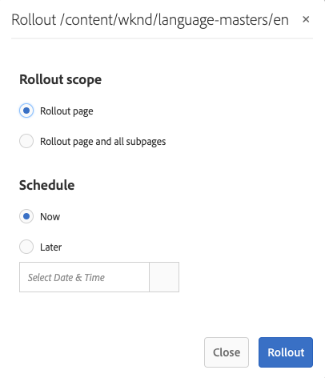

# Criando e Sincronizando Live Copies{#creating-and-synchronizing-live-copies}

Você pode criar uma live copy a partir de uma configuração de página ou blueprint e, em seguida, gerenciar a herança e a sincronização.

## Gerenciando configurações do Blueprint {#managing-blueprint-configurations}

Uma configuração de blueprint identifica um site existente que você deseja usar como a origem para uma ou mais páginas de live copy.

>[!NOTE]
>
>As configurações do Blueprint permitem que você envie alterações de conteúdo para cópias online. Consulte Cópias [ao vivo - Fonte, Blueprints e Configurações](/help/sites-administering/msm.md#source-blueprints-and-blueprint-configurations)do Blueprint.

Ao criar uma configuração de blueprint, você seleciona um modelo que define a estrutura interna do blueprint. O modelo padrão de blueprint supõe que o site de origem tenha as seguintes características:

* O site tem uma página raiz.
* As páginas secundárias imediatas da raiz são ramificações de idioma do site. Ao criar uma cópia ao vivo, os idiomas são apresentados como conteúdo opcional a ser incluído na cópia.
* A raiz de cada ramificação de idioma tem uma ou mais páginas secundárias. Ao criar uma live copy, as páginas secundárias são apresentadas como capítulos que podem ser incluídos na live copy.

>[!NOTE]
>
>Uma estrutura diferente requer outro modelo de blueprint.

Depois de criar a configuração do blueprint, configure as seguintes propriedades:

* **Nome**: O nome da configuração do blueprint.
* **Caminho** de origem: O caminho da página raiz do site que você está usando como fonte (blueprint).
* **Descrição**. (Opcional) Uma descrição da configuração do blueprint. A descrição é exibida na lista de configurações do blueprint para escolher ao criar um site.

Quando a configuração do blueprint é usada, você pode associá-la a uma configuração de implementação que determina como as cópias ativas da origem/blueprint são sincronizadas. See [Specifying the Rollout Configurations To Use](/help/sites-administering/msm-sync.md#specifying-the-rollout-configurations-to-use).

### Criando uma configuração do Blueprint {#creating-a-blueprint-configuration}

Para criar uma configuração de blueprint:

1. [Navegue](/help/sites-authoring/basic-handling.md#global-navigation) até o menu **Ferramentas** e selecione o menu **Sites** .
1. Selecione **Blueprints** para abrir o console Configurações **do** Blueprint:

   

1. Selecione **Criar**.
1. Selecione o modelo de blueprint e, em seguida, **Avançar** para continuar.
1. Selecione a página de origem a ser usada como o blueprint; em seguida, **Avançar** para continuar.
1. Definir:

   * **Título**: título obrigatório para o plano
   * **Descrição**: uma descrição opcional para fornecer mais detalhes.

1. **Criar** criará a configuração blueprint com base na sua especificação.

### Edição ou exclusão de uma configuração do Blueprint {#editing-or-deleting-a-blueprint-configuration}

Você pode editar ou excluir uma configuração de blueprint existente:

1. [Navegue](/help/sites-authoring/basic-handling.md#global-navigation) até o menu **Ferramentas** e selecione o menu **Sites** .
1. Selecione **Blueprints** para abrir o console Configurações **do** Blueprint:

   

1. Selecione a configuração necessária do blueprint - as ações apropriadas estarão disponíveis na barra de ferramentas:

   * **Propriedades**; é possível usar essa opção para visualização e, em seguida, editar as propriedades da configuração.
   * **Excluir**

   

## Criação de uma Live Copy {#creating-a-live-copy}

### Criação de uma Live Copy para uma página {#creating-a-live-copy-of-a-page}

Você pode criar uma cópia ao vivo de qualquer página ou ramificação. Ao criar a live copy, você pode especificar as configurações de implantação a serem usadas para sincronizar o conteúdo:

* As configurações de roll-out selecionadas se aplicam à página de live copy e às páginas secundárias.
* Se você não especificar nenhuma configuração de implantação, o MSM determinará quais configurações de implantação usar. Consulte [Especificação da configuração de implantação a ser usada](/help/sites-administering/msm-sync.md#specifying-the-rollout-configurations-to-use).

Você pode criar uma cópia ao vivo de qualquer página:

* Páginas referenciadas por uma configuração blueprint.
* E páginas que não têm conexão com uma configuração.
* O AEM também oferece suporte à criação de uma live copy dentro das páginas de outra live copy.

A única diferença é que a disponibilidade do comando **Rollout** nas páginas de origem/blueprint depende de se a origem é referenciada por uma configuração de blueprint:

* Se você criar a live copy a partir de uma página de origem que **é** referenciada em uma configuração de blueprint, o comando Rollout estará disponível nas páginas de origem/blueprint.
* Se você criar a live copy a partir de uma página de origem que não **** é referenciada em uma configuração de blueprint, o comando Rollout não estará disponível nas páginas de origem/blueprint.

Para criar uma live copy:

1. No console **Sites** , selecione **Criar** e, em seguida, **Live Copy**.

   

1. Selecione a página de origem e clique ou toque em **Avançar**. Por exemplo:

   

1. Especifique o caminho de destino da live copy (abra a pasta/página pai da live copy) e clique ou toque em **Avançar**.

   

   >[!NOTE]
   >
   >O caminho de destino não pode estar dentro do caminho de origem.

1. Digite:

   * um **Título** para a página.
   * um **Nome**, que é usado no URL.

   

1. Use a caixa de seleção **Excluir subpáginas** :

   * Selecionado: criar uma cópia ao vivo somente da página selecionada (cópia ao vivo superficial)
   * Não Selecionado: criar uma live copy que inclua todos os descendentes da página selecionada (deep live copy)

1. (Opcional) Para especificar uma ou mais configurações de implantação a serem usadas para a live-copy, use a lista suspensa Configurações de **implantação** para selecioná-las; as configurações selecionadas serão exibidas abaixo do seletor suspenso.
1. Clique ou toque em **Criar**. Uma mensagem de confirmação será exibida; aqui, você pode selecionar **Abrir** ou **Concluído**.

### Criando uma Live Copy de um site a partir de uma configuração do Blueprint {#creating-a-live-copy-of-a-site-from-a-blueprint-configuration}

Crie uma cópia ao vivo usando uma configuração de blueprint para criar um site com base no conteúdo do blueprint (fonte). Ao criar uma cópia ao vivo de uma configuração de blueprint, você seleciona uma ou mais ramificações de idioma da fonte de blueprint a ser copiada e, em seguida, seleciona os capítulos a serem copiados das ramificações de idioma. Consulte [Criação de uma configuração](/help/sites-administering/msm-livecopy.md#creating-a-blueprint-configuration)do Blueprint.

Se você omitir algumas ramificações de idiomas ou capítulos da live copy, poderá adicioná-los posteriormente; consulte [Criar uma Live Copy dentro de uma Live Copy (Configuração do Blueprint)](#creating-a-live-copy-inside-a-live-copy-blueprint-configuration).

>[!CAUTION]
>
>Quando a fonte do blueprint contém links e referências que público alvo um parágrafo em uma ramificação diferente, os públicos alvos não são atualizados nas páginas de live copy, mas permanecem apontados para o destino original.

Ao criar o site, forneça valores para as seguintes propriedades:

* **Idiomas** iniciais: As ramificações de idioma da fonte de blueprint a ser incluída na live copy.
* **Capítulos** iniciais: As páginas secundárias do idioma blueprint ramificam para incluir na live copy.
* **Caminho** de destino: O local da página raiz do site de live copy.
* **Título**: O título da página raiz do site de live copy.
* **Nome**: (Opcional) O nome do nó JCR que armazena a página raiz da live copy. O valor padrão é baseado no título.
* **Proprietário** do Site: (Opcional)
* **Live Copy**: Selecione essa opção para estabelecer uma relação ativa com o site de origem. Se você não selecionar essa opção, uma cópia do blueprint será criada, mas não será sincronizada subsequentemente com a fonte.
* **Configurações de implantação**: (Opcional) Selecione uma ou mais configurações de implantação a serem usadas para sincronizar a live copy. Por padrão, as configurações de implantação são herdadas do blueprint; consulte [Especificação das configurações de implantação a serem usadas](/help/sites-administering/msm-sync.md#specifying-the-rollout-configurations-to-use) para obter mais detalhes.

Para criar uma cópia ao vivo de um site a partir de uma configuração do blueprint:

1. No console **Sites** , selecione **Criar** e, em seguida, **Site** no seletor suspenso.
1. Selecione a configuração do blueprint a ser usada como a origem da live copy e continue com **Next (Avançar)**:

   

1. Use o seletor Idiomas **** iniciais para especificar os idiomas do site blueprint a serem usados para a cópia online.

   Todos os idiomas disponíveis são selecionados por padrão. Para remover um idioma, clique ou toque no **X** exibido ao lado do idioma.

   Por exemplo:

   

1. Use o menu suspenso Capítulos **** iniciais para selecionar as seções do blueprint a serem incluídas na live copy. Novamente, todos os capítulos disponíveis são incluídos por padrão, mas podem ser removidos.
1. Forneça valores para as propriedades restantes e selecione **Criar**. Na caixa de diálogo de confirmação, selecione **Concluído** para retornar ao console **Sites** ou **Abrir site** para abrir a página raiz do site.

### Criação de uma Live Copy dentro de uma Live Copy (Configuração do Blueprint) {#creating-a-live-copy-inside-a-live-copy-blueprint-configuration}

Ao criar uma live copy dentro da live copy existente (criada usando uma configuração de blueprint), você pode inserir qualquer cópia de idioma ou capítulos que não foram incluídos quando a live copy foi criada originalmente.

## Monitoramento do Live Copy {#monitoring-your-live-copy}

### Como visualizar o status de uma Live Copy {#seeing-the-status-of-a-live-copy}

As propriedades de uma página de live copy mostram as seguintes informações sobre a live copy:

* **Fonte**: A página de origem da página de live copy.
* **Status**: O status de sincronização da live copy. O status inclui se a live copy está atualizada com a fonte e quando ocorreu a última sincronização e quem executou a sincronização.
* **Configuração**:

   * Se a página ainda está sujeita à herança de cópia ativa.
   * Se a configuração é herdada da página pai.
   * Todas as configurações de lançamento que a live copy usar.

Para visualização das propriedades:

1. No console **Sites** , selecione a página de live copy e abra as propriedades.
1. Select the **Live Copy** tab.

   Por exemplo:

   

   >[!NOTE]
   >
   >Para obter mais detalhes, consulte também a mensagem de status do artigo da Base de conhecimento [Livecopy - Atualizado/Verde/Em sincronia](https://helpx.adobe.com/experience-manager/kb/livecopy-status-message---up-to-date-green-in-sync.html).

### Ver as Live Copies de uma Página do Blueprint {#seeing-the-live-copies-of-a-blueprint-page}

As páginas do Blueprint (que são referenciadas em uma configuração do blueprint) fornecem uma lista das páginas de live copy que usam a página atual (blueprint) como fonte. Use essa lista para acompanhar as cópias online. A lista é exibida na guia **Blueprint** das propriedades [da](/help/sites-authoring/editing-page-properties.md)página.

## Sincronizando sua Live Copy {#synchronizing-your-live-copy}

### Implantação de um Blueprint {#rolling-out-a-blueprint}

Implantar uma página de blueprint para enviar as alterações de conteúdo para cópias online. Uma ação de **Rollout** executa as configurações de implantação que usam o acionador [On Rollout](/help/sites-administering/msm-sync.md#rollout-triggers) .

>[!NOTE]
>
>Os conflitos podem ocorrer se novas páginas com o mesmo nome de página forem criadas na ramificação blueprint e em uma ramificação de live copy dependente.
>
>Tais [conflitos devem ser tratados e resolvidos aquando da sua implementação](/help/sites-administering/msm-rollout-conflicts.md).

#### Implantação de um Blueprint nas propriedades da página {#rolling-out-a-blueprint-from-page-properties}

1. No console **Sites** , selecione a página no blueprint e abra as propriedades.
1. Abra a guia **Blueprint.**
1. Selecione **Implantação**.

   

1. Especifique as páginas e quaisquer subpáginas e confirme com a marca de seleção:

   

1. Especifique se o trabalho de implantação deve ser executado imediatamente (**Agora**) ou em outra data/hora (**Mais tarde**).

   

Rollouts are processed as asynchronous jobs and can be checked in the [**Async Jobs Status **dashboard](asynchronous-jobs.md#monitor-the-status-of-asynchronous-operations)at** Global Navigation **->** Tools **->** Operations **->** Jobs **

>[!NOTE]
>
>O processamento de implantação assíncrono requer AEM 6.5.3.0 ou superior. Em versões anteriores, as páginas eram processadas imediata e sincronicamente.

#### Implantar um Blueprint do painel de referência {#roll-out-a-blueprint-from-the-reference-rail}

1. No console **Sites** , selecione a página no blueprint e abra o painel **[Referências](/help/sites-authoring/basic-handling.md#references)**(na barra de ferramentas).
1. Selecione a opção **Blueprint** na lista para mostrar os blueprints associados a esta página.
1. Selecione o modelo necessário na lista.
1. Click or tap **Rollout**.
1. Será solicitado que você confirme os detalhes do lançamento:

   * **Escopo da implantação**:

      Especifique se o escopo é apenas para a página selecionada ou se deve incluir subpáginas.

   * **Agendamento**:

      Especifique se o trabalho de implantação deve ser executado imediatamente (**Agora**) ou em uma data/hora posterior (**Mais tarde**).

      

1. Depois de confirmar esses detalhes, selecione **Rollout** para executar a ação.

Rollouts are processed as asynchronous jobs and can be checked in the [**Async Jobs Status **dashboard](asynchronous-jobs.md#monitor-the-status-of-asynchronous-operations)at** Global Navigation **->** Tools **->** Operations **->** Jobs **

>[!NOTE]
>
>O processamento de implantação assíncrono requer AEM 6.5.3.0 ou superior. Em versões anteriores, as páginas eram processadas imediata e sincronicamente, a menos que a opção de implantação **em** segundo plano estivesse marcada.

#### Implantar um Blueprint na visão geral da Live Copy {#roll-out-a-blueprint-from-the-live-copy-overview}

A ação [Implantação também está disponível na Visão geral](/help/sites-administering/msm-livecopy-overview.md#using-the-live-copy-overview)da Live Copy, quando uma página do Blueprint é selecionada.

1. Abra a Visão geral  da Live Copy e selecione uma página do Blueprint.
1. Select **Rollout** from the toolbar.
1. Especifique as páginas e quaisquer subpáginas e confirme com a marca de seleção:

   

1. Especifique se o trabalho de implantação deve ser executado imediatamente (**Agora**) ou em outra data/hora (**Mais tarde**).

   

Rollouts are processed as asynchronous jobs and can be checked in the [**Async Jobs Status **dashboard](asynchronous-jobs.md#monitor-the-status-of-asynchronous-operations)at** Global Navigation **->** Tools **->** Operations **->** Jobs **

>[!NOTE]
>
>O processamento de implantação assíncrono requer AEM 6.5.3.0 ou superior. Em versões anteriores, as páginas eram processadas imediata e sincronicamente.

### Sincronizando uma Live Copy {#synchronizing-a-live-copy}

Sincronize uma página de live copy para extrair as alterações de conteúdo da origem para a live copy.

#### Sincronizar uma Live Copy das propriedades da página {#synchronize-a-live-copy-from-page-properties}

Sincronize uma live copy para extrair as alterações da origem para a live copy.

>[!NOTE]
>
>A sincronização executa as configurações de implantação que usam o acionador [On Rollout](/help/sites-administering/msm-sync.md#rollout-triggers) .

1. No console **Sites** , selecione a página de live copy e abra as propriedades.
1. Open the **Live Copy** tab.
1. Click or tap **Synchronize**.

   

   A confirmação será solicitada, use **Sincronizar** para continuar.

#### Sincronizar uma Live Copy da visão geral da Live Copy {#synchronize-a-live-copy-from-the-live-copy-overview}

A ação [Sincronizar também está disponível na Visão geral](/help/sites-administering/msm-livecopy-overview.md#using-the-live-copy-overview)da Live Copy, quando uma página da Live Copy é selecionada.

1. Abra a Visão geral  da Live Copy e selecione uma página de Live Copy.
1. Select **Synchronize** from the toolbar.
1. Confirme a ação **Rollout** na caixa de diálogo depois de especificar se deseja incluir:

   * **Páginas e subpáginas**
   * **Somente página**

   

## Alteração do conteúdo da Live Copy {#changing-live-copy-content}

Para alterar o conteúdo da live copy, é possível:

* Adicione parágrafos à página.
* Atualize o conteúdo existente quebrando a herança de cópia ativa para qualquer página ou componente.

>[!NOTE]
>
>Se você criar manualmente uma nova página na live copy, então ela será local da live copy, o que significa que ela não tem uma página de origem correspondente à qual anexar.
>
>A prática recomendada para criar uma página local que faça parte do relacionamento seria criá-la na origem e realizar uma implementação (profunda). Isso criará a página localmente como cópias online.

>[!NOTE]
>
>Os conflitos podem ocorrer se novas páginas com o mesmo nome de página forem criadas na ramificação blueprint e em uma ramificação de live copy dependente.
>
>Tais [conflitos devem ser tratados e resolvidos aquando da sua implementação](/help/sites-administering/msm-rollout-conflicts.md).

### Adicionar componentes a uma página de Live Copy {#adding-components-to-a-live-copy-page}

Adicione componentes a uma página de live copy a qualquer momento. O status de herança da live copy e de seu sistema de parágrafo não controla sua capacidade de adicionar componentes.

Quando a página de live copy é sincronizada com a página de origem, os componentes adicionados permanecem inalterados. Consulte também [Alteração da ordem dos componentes em uma página](#changing-the-order-of-components-on-a-live-copy-page)de Live Copy.

>[!NOTE]
>
>As alterações feitas localmente em um componente marcado como um container não serão substituídas pelo conteúdo do blueprint em uma implementação. See [MSM Best Practices](/help/sites-administering/msm-best-practices.md#components-and-container-synchronization) for more information.

### Suspender herança para uma página {#suspending-inheritance-for-a-page}

Quando você cria uma live copy, a configuração da live copy é salva na página raiz das páginas copiadas. Todas as páginas secundárias da página raiz herdam as configurações de cópia ativa. Os componentes nas páginas do live copy também herdam a configuração do live copy.

Você pode suspender a herança da live copy para uma página de live copy para que possa alterar as propriedades e os componentes da página. Quando você suspende a herança, as propriedades e os componentes da página não são mais sincronizados com a origem.

>[!NOTE]
>
>Você também pode [desanexar uma cópia](#detaching-a-live-copy) ao vivo de seu blueprint para remover todas as conexões. A ação Detach é permanente e não reversível.

#### Suspender herança das propriedades da página {#suspending-inheritance-from-page-properties}

Para suspender a herança em uma página:

1. Abra as propriedades da página live copy usando o comando Propriedades **da** Visualização do console **Sites** ou usando Informações **da** página na barra de ferramentas da página.
1. Clique ou toque na guia **Live Copy** .
1. Select **Suspend** from the toolbar. Você pode selecionar:

   * **Suspender**: somente página atual
   * **Suspender com filhos**: página atual junto com qualquer página secundária

1. Selecione **Suspender** na caixa de diálogo de confirmação.

#### Suspender herança da visão geral da Live Copy {#suspending-inheritance-from-the-live-copy-overview}

A ação [Suspender também está disponível na Visão geral](/help/sites-administering/msm-livecopy-overview.md#using-the-live-copy-overview)da Live Copy, quando uma página da Live Copy é selecionada.

1. Abra a Visão geral  da Live Copy e selecione uma página de Live Copy.
1. Select **Suspend** from the toolbar.
1. Selecione a opção apropriada de:

   * **Suspender**
   * **Suspender com secundários**

   

1. Confirme a ação **Suspender** na caixa de diálogo **Suspender Live Copy** :

   

### Retomando herança para uma página {#resuming-inheritance-for-a-page}

Suspender a herança de cópia ativa de uma página é uma ação temporária. Depois de suspensa, a ação **Retomar** fica disponível, permitindo que você reinstale a relação ao vivo.

Quando você reativa a herança, a página não é sincronizada automaticamente com a origem. Você pode solicitar uma sincronização, se necessário:

* Na caixa de diálogo **Retomar**/**Reverter** ; por exemplo:

   

* Em um estágio posterior, selecionando manualmente a ação de sincronização.

>[!CAUTION]
>
>Quando você reativa a herança, a página não é sincronizada automaticamente com a origem. Você pode solicitar manualmente uma sincronização, se necessário; no momento da retomada ou posteriormente.

#### Retomando herança das propriedades da página {#resuming-inheritance-from-page-properties}

Depois de [suspensa](#suspending-inheritance-from-page-properties) , a ação **Retomar** se torna na barra de ferramentas das propriedades da página:

Quando selecionada, a caixa de diálogo será exibida. Você pode selecionar uma sincronização, se necessário, e confirmar a ação.

#### Retomar uma página de Live Copy da visão geral da Live Copy {#resume-a-live-copy-page-from-the-live-copy-overview}

A ação [Retomar também está disponível na Visão geral](/help/sites-administering/msm-livecopy-overview.md#using-the-live-copy-overview)da Live Copy, quando uma página da Live Copy é selecionada.

1. Abra a Visão geral  da Live Copy e selecione uma página da Live Copy que foi suspensa; será mostrado como **HERITANCE CANCELLED**.
1. Select **Resume** from the toolbar.
1. Indique se deseja sincronizar a página após reverter a herança e confirme a ação **Retomar** na caixa de diálogo **Retomar Live Copy** .

### Alteração da profundidade de herança (superficial/profunda) {#changing-inheritance-depth-shallow-deep}

Em uma live copy existente, é possível alterar a profundidade de uma página; Ou seja, se as páginas secundárias estão incluídas.

* Alternando para uma cópia em tempo real superficial:

   * Terá efeito imediato e não será reversível.

      * As páginas secundárias são explicitamente destacadas da cópia online. Não é possível preservar novas modificações em crianças se estas forem desfeitas.

      * Removerá qualquer descendente `LiveRelationships` mesmo se houver aninhado `LiveCopies`.

* Alternando para uma cópia ativa profunda:

   * As páginas secundárias permanecem intocadas.
   * Para ver o efeito do switch, é possível fazer uma implantação, qualquer modificação de conteúdo é aplicada de acordo com a configuração de implantação.

* Alternando para uma cópia em tempo real superficial e, em seguida, de volta para o profundo:

   * Todos os filhos da (anteriormente) cópia em tempo real superficial são tratados como se tivessem sido criados manualmente e, portanto, são afastados usando `[oldname]_msm_moved name`.

Para especificar ou alterar a profundidade:

1. Abra as propriedades da página live copy usando o comando Propriedades **da** Visualização do console **Sites** ou usando Informações **da** página na barra de ferramentas da página.
1. Clique ou toque na guia **Live Copy** .
1. Na seção **Configuração** , defina ou desmarque a opção Herança **da** Live Copy, dependendo se as páginas secundárias estão incluídas:

   * marcado - uma cópia ativa profunda (as páginas secundárias estão incluídas)
   * clear - uma cópia em tempo real superficial (as páginas secundárias são excluídas)

   >[!CAUTION]
   >
   >A alternância para uma cópia em tempo real superficial terá efeito imediato e não será reversível.
   >
   >Consulte [Live Copies - Composição](/help/sites-administering/msm.md#live-copies-composition) para obter mais informações.

1. Clique ou toque em **Salvar** para continuar suas atualizações.

### Cancelando herança para um componente {#cancelling-inheritance-for-a-component}

Cancele a herança de cópia ativa de um componente para que ele não seja mais sincronizado com o componente de origem. Você pode ativar a herança posteriormente, se necessário.

>[!NOTE]
>
>Quando você reativa a herança, o componente não é sincronizado automaticamente com a origem. Você pode solicitar manualmente uma sincronização, se necessário.

Cancele a herança para alterar o conteúdo do componente ou excluir o componente:

1. Clique ou toque no componente para o qual deseja cancelar a herança.

   

1. Na barra de ferramentas do componente, clique ou toque no ícone **Cancelar herança** .

   

1. Na caixa de diálogo Cancelar herança, confirme a ação com **Sim**.

   A barra de ferramentas do componente é atualizada para incluir todos os comandos de edição (apropriados).

### Reativação da herança para um componente {#re-enabling-inheritance-for-a-component}

Para ativar a herança de um componente, clique ou toque no ícone **Reativar herança** na barra de ferramentas do componente.

### Alteração da ordem dos componentes em uma página de Live Copy {#changing-the-order-of-components-on-a-live-copy-page}

Se uma live copy contiver componentes que fazem parte de um sistema de parágrafo, a herança desse sistema de parágrafo obedecerá às seguintes regras:

* A ordem dos componentes em um sistema de parágrafo herdado pode ser modificada, mesmo com herança estabelecida.
* Na implantação, a ordem dos componentes será restaurada a partir do blueprint. se os novos componentes tiverem sido adicionados à live copy antes do lançamento, eles serão reorganizados juntamente com os componentes acima dos quais foram adicionados.
* Se a herança do sistema de parágrafo for cancelada, a ordem dos componentes não será restaurada na implantação e permanecerá como está na live copy.

>[!NOTE]
>
>Ao reverter uma herança cancelada em um sistema de parágrafo, a ordem dos componentes não **será restaurada** automaticamente do blueprint. Você pode solicitar manualmente uma sincronização, se necessário.

Use o procedimento a seguir para cancelar a herança do sistema de parágrafo.

1. Abra a página de live copy.
1. Arraste um componente existente para um novo local na página.
1. Na caixa de diálogo **Cancelar herança** , confirme a ação com **Sim**.

### Substituição das propriedades de uma página de Live Copy {#overriding-properties-of-a-live-copy-page}

As propriedades de página de uma página Live Copy são herdadas (e não editáveis) da página de origem por padrão.

Você pode cancelar a herança de uma propriedade quando precisar alterar o valor da propriedade da cópia ativa. Um ícone de link indica que a herança está ativada para a propriedade.

Ao cancelar a herança, você pode alterar o valor da propriedade. Um ícone de link quebrado indica que a herança foi cancelada.

Posteriormente, você pode reativar a herança para uma propriedade, se necessário.

>[!NOTE]
>
>Quando você reativa a herança, a propriedade da página de cópia ativa não é sincronizada automaticamente com a propriedade source. Você pode solicitar manualmente uma sincronização, se necessário.

1. Abra as propriedades da página live copy usando a opção Propriedades **da** Visualização do console **Sites** ou o ícone Informações **da** página na barra de ferramentas da página.
1. Para cancelar a herança de uma propriedade, clique ou toque no ícone de link exibido à direita da propriedade.

   

1. Na caixa de diálogo de confirmação **Cancelar herança** , clique ou toque em **Sim**.

### Reverter propriedades de uma página de Live Copy {#revert-properties-of-a-live-copy-page}

Para ativar a herança de uma propriedade, clique ou toque no ícone **Reverter herança** que aparece ao lado da propriedade.

### Redefinição de uma página de Live Copy {#resetting-a-live-copy-page}

Redefinir uma página de cópia online para:

* Remova todos os cancelamentos de herança e
* Retorna a página ao mesmo estado que a página de origem.

A redefinição afeta as alterações feitas nas propriedades da página, no sistema de parágrafo e nos componentes.

#### Redefinir uma página de Live Copy a partir das propriedades da página {#reset-a-live-copy-page-from-the-page-properties}

1. No console **Sites** , selecione a página de live copy e selecione Propriedades **da** Visualização.
1. Open the **Live Copy** tab.
1. Select **Reset** from the toolbar.

   

1. Na caixa de diálogo **Redefinir Live Copy** , confirme com **Redefinir**.

#### Redefinir uma página de Live Copy a partir da visão geral da Live Copy {#reset-a-live-copy-page-from-the-live-copy-overview}

A ação [Redefinir também está disponível na Visão geral](/help/sites-administering/msm-livecopy-overview.md#using-the-live-copy-overview)da Live Copy, quando uma página da Live Copy é selecionada.

1. Abra a Visão geral  da Live Copy e selecione uma página de Live Copy.
1. Select **Reset** from the toolbar.
1. Confirme a ação **Redefinir** na caixa de diálogo **Redefinir Live Copy** :

   

## Comparação de uma página de Live Copy com uma página do Blueprint {#comparing-a-live-copy-page-with-a-blueprint-page}

Para rastrear as alterações feitas, você pode visualização a página de blueprint em **Referências** e compará-la com a página de cópia online:

1. No console **Sites** , [navegue até uma página de blueprint ou live copy e selecione-a](/help/sites-authoring/basic-handling.md#viewing-and-selecting-resources).
1. Open the **[References](/help/sites-authoring/basic-handling.md#references)**panel and select:

   * **Blueprint** (quando uma página de cópia ao vivo é selecionada)
   * **Live Copies** (quando uma página do blueprint é selecionada)

1. Selecione sua live copy específica em seguida:

   * **Comparar ao Blueprint** (quando uma página de cópia ao vivo é selecionada)
   * **Comparar com Live Copy** (quando uma página do blueprint é selecionada)

   Por exemplo:

   

1. As duas páginas (live copy e blueprint) serão abertas lado a lado.

   Para obter informações completas sobre como usar esse recurso, consulte [Diferencial de página](/help/sites-authoring/page-diff.md).

## Desanexar uma Live Copy {#detaching-a-live-copy}

A ação de desanexar remove permanentemente a relação ao vivo entre uma cópia ao vivo e sua página de origem/blueprint. Todas as propriedades relevantes para MSM são removidas da live copy e as páginas de live copy se tornam uma cópia independente.

>[!CAUTION]
>
>Não é possível restabelecer a relação ao vivo depois de desanexar a cópia ao vivo.
>
>Para remover a relação ao vivo com a opção de reinstalá-la posteriormente, é possível [cancelar a herança](#suspending-inheritance-for-a-page) de cópia ativa da página.

Há implicações em onde na árvore você usa **Desanexar**:

* **Desanexar em uma página raiz de um LiveCopy**

   Quando essa operação é executada na página raiz de uma live copy, ela remove a relação ao vivo entre todas as páginas do blueprint e sua live copy.

   Outras alterações nas páginas no blueprint (como era) não **** afetarão a live copy (como era).

* **Desanexar em uma subpágina de uma LiveCopy**

   Quando esta operação é executada em uma subpágina (ou ramificação) dentro de uma live copy:

   * a relação ao vivo é removida para essa subpágina (ou ramificação)
   * e as (sub)páginas na live copy branch são tratadas como se tivessem sido criadas manualmente.

   *Entretanto*, as subpáginas ainda estão sujeitas ao relacionamento ativo da ramificação pai, de modo que uma nova implementação das páginas do blueprint ambas:

   1. Renomeie as páginas desconectadas:

      * Isso ocorre porque o MSM as considera como páginas criadas manualmente que causam um conflito, pois elas têm o mesmo nome das páginas de cópia online que estão tentando criar.
   1. Crie uma nova página (live-copy) com o nome original, contendo as alterações da implementação.

   >[!NOTE]
   >
   >Consulte Conflitos [de implantação](/help/sites-administering/msm-rollout-conflicts.md) MSM para obter detalhes dessas situações.

### Desanexar uma página de Live Copy das propriedades da página {#detach-a-live-copy-page-from-the-page-properties}

Para desanexar uma cópia online:

1. No console **Sites** , selecione a página de live copy e clique ou toque em Propriedades **da** Visualização.
1. Open the **Live Copy** tab.
1. Na barra de ferramentas, selecione **Desanexar**.

   

1. Uma caixa de diálogo de confirmação será exibida e selecione **Desconectar** para concluir a ação.

### Desanexar uma página de Live Copy da visão geral da Live Copy {#detach-a-live-copy-page-from-the-live-copy-overview}

A ação [Desanexar também está disponível na Visão geral](/help/sites-administering/msm-livecopy-overview.md#using-the-live-copy-overview)da Live Copy, quando uma página da Live Copy é selecionada.

1. Abra a Visão geral  da Live Copy e selecione uma página de Live Copy.
1. Select **Detach** from the toolbar.
1. Confirme a ação **Desanexar** na caixa de diálogo **Desanexar Live Copy** :

   
