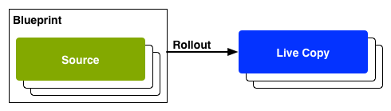

# Reutilizar conteúdo: gerenciador de vários sites e Live Copy{#reusing-content-multi-site-manager-and-live-copy}

O Multi Site Manager (MSM) permite que você use o mesmo conteúdo de site em vários locais. O MSM usa a funcionalidade de Live Copy para alcançar isso:

* Com o MSM é possível:

   * Criar um conteúdo uma vez e
   * Copie este conteúdo para outras áreas e reutilize-o em ([cópias dinâmicas](#live-copies)) do mesmo site ou de outros sites.

* O MSM mantém os relacionamentos (ao vivo) entre o conteúdo de origem e suas cópias ao vivo, de modo que:

   * Quando você faz alterações no conteúdo de origem, a origem e as cópias em tempo real são sincronizadas (para aplicar essas alterações também às cópias em tempo real).
   * Você pode fazer ajustes no conteúdo das cópias em tempo real desconectando o relacionamento em tempo real de subpáginas e/ou componentes individuais. Ao fazer isso, as alterações na origem não serão mais aplicadas à live copy.

Esta e as seguintes páginas abordam os problemas relacionados:

* [Criação e sincronização de Live Copies](/help/sites-administering/msm-livecopy.md)
* [Visão geral do console da Live Copy](/help/sites-administering/msm-livecopy-overview.md)
* [Configurar a sincronização da Live Copy](/help/sites-administering/msm-sync.md)
* [Conflitos de implantação do MSM](/help/sites-administering/msm-rollout-conflicts.md)
* [Práticas recomendadas do MSM](/help/sites-administering/msm-best-practices.md)

## Cenários possíveis {#possible-scenarios}

Há muitos casos de uso para MSM e cópias ao vivo, alguns cenários incluem:

* **Multinacionais - da empresa global para a local**

   Um caso de uso típico que o MSM permite é a reutilização de conteúdo em vários sites multinacionais de mesmo idioma. Isso permite a reutilização do conteúdo principal, permitindo variações nacionais.

   Por exemplo, a seção em inglês da amostra We.Retail Reference Site é criada para clientes nos EUA. A maior parte do conteúdo deste site também pode ser usada para outros sites We.Retail que atendem a clientes que falam inglês de diferentes países e culturas. O conteúdo principal permanece o mesmo em todos os sites, enquanto ajustes regionais podem ser feitos.

   A seguinte estrutura pode ser usada para sites dos Estados Unidos, Reino Unido, Canadá e Austrália:

   ```xml
   /content
       |- we.retail
           |- language-masters
               |- en
       |- we.retail
           |- us
               |- en
       |- we.retail
           |- gb
               |- en
       |- we.retail
           |- ca
               |- en
       |- we.retail
           |- au
               |- en
   ```

   >[!NOTE]
   >
   >O MSM não traduz o conteúdo. Ele é usado para criar a estrutura necessária e implantar o conteúdo.
   >
   >
   >Consulte [Tradução de conteúdo para sites multilíngues](/help/sites-administering/translation.md) se quiser estender esse exemplo.

* **Nacional - da sede para as divisões regionais**

   Como alternativa, uma empresa com uma rede de concessionários pode querer sítios Web distintos para as suas concessionárias individuais - cada uma delas uma variação do sítio principal fornecido pela sede. Pode ser uma única empresa com vários escritórios regionais ou um sistema nacional de franquias composto por um franqueador central e por vários franqueados locais.

   A sede pode fornecer as informações principais, enquanto as entidades regionais podem adicionar informações locais, como detalhes de contato, horários de abertura e eventos.

   ```xml
   /content
       |- head-office-Berlin
       |- branch-Hamburg
       |- branch-Stuttgart
       |- branch-Munich
       |- branch-Frankfurt
   ```

* **Várias versões**

   Ou você pode usar o MSM para criar versões de uma sub-ramificação específica. Por exemplo, um sub-site de suporte contendo detalhes das diferentes versões de um produto específico, onde as informações básicas permanecem constantes e somente os recursos atualizados precisam ser alterados:

   ```xml
   /content
       |- support
           |- product X
               |- v5.0
               |- v4.0
               |- v3.0
               |- v2.0
               |- v1.0
   ```

   >[!NOTE]
   >
   >Nesse cenário há sempre a questão de saber se fazer uma cópia simples ou usar cópias ao vivo.
   >
   >Há um equilíbrio de:
   >
   >  * Quanto do conteúdo principal precisará ser atualizado em várias versões.
   >
   >Contra:
   >
   >  * Quantas cópias individuais terão de ser ajustadas.


## MSM a partir da interface {#msm-from-the-ui}

O MSM é diretamente acessível por meio da interface usando várias opções do console apropriado. Para fornecer uma introdução, a lista a seguir mostra os locais principais:

* **Criar Site** (**Sites**)

   * O MSM ajuda você a gerenciar vários sites que compartilham conteúdo comum; por exemplo, os sites geralmente são fornecidos para públicos internacionais, de modo que a maioria do conteúdo é comum em todos os países, com um subconjunto do conteúdo específico para cada país. O MSM permite [crie cópias ativas que atualizam automaticamente um ou mais sites com base no site de origem](/help/sites-administering/msm-livecopy.md#creating-a-live-copy-of-a-site-from-a-blueprint-configuration). Isso também ajuda a impor uma estrutura básica comum, usar o conteúdo em comum nos vários sites, manter uma aparência semelhante e concentrar os esforços no gerenciamento do conteúdo que realmente difere entre os sites.
   * Requer uma configuração de blueprint predefinida para especificar a origem.
   * Cria uma live copy da fonte (predefinida).
   * Fornece ao usuário o botão **Implantação**.

* **Criar Live Copy** (**Sites**)

   * O MSM permite [criar uma live copy ad-hoc (única) de uma página individual ou subramificação de um site](/help/sites-administering/msm-livecopy.md#creating-a-live-copy-of-a-page); por exemplo, duplicar uma subramificação para fornecer informações sobre uma versão nova/atualizada de um produto.
   * Cria uma live copy ad-hoc (nenhuma configuração do blueprint é necessária).
   * Pode ser usado para (imediatamente) criar uma live copy de qualquer página/ramificação.
   * Requer **sincronização** (não fornece o botão **Implantação**).

* **Visualizar propriedades** (**Sites**)

   * Quando apropriado, essa opção ajuda você [monitorar sua live copy](/help/sites-administering/msm-livecopy.md#monitoring-your-live-copy) fornecendo informações sobre a **Live Cop** y ou **Blueprint**.

* **Referências** (**Sites**)

   * O painel [Referências](/help/sites-authoring/basic-handling.md#references) fornece informações sobre **Live Copies**, juntamente com o acesso às ações adequadas.

* **Visão geral da Live Copy** (**Sites**)

   * Esse console permite [visualizar e gerenciar seu blueprint e suas cópias dinâmicas](/help/sites-administering/msm-livecopy-overview.md).

* **Blueprints** (**Ferramentas** - **Sites**)

   * Esse console permite [criar e gerenciar as configurações do blueprint](/help/sites-administering/msm-livecopy.md#creating-a-blueprint-configuration).

>[!NOTE]
>
>Os aspectos da funcionalidade MSM são usados em vários outros recursos AEM (por exemplo, Lançamentos, Catálogo); nesses casos, a live copy é gerenciada por esse recurso.

### Termos usados {#terms-used}

Como introdução, o quadro a seguir apresenta uma visão geral dos principais termos usados com o MSM; eles serão abordados em mais detalhes nas seções e páginas subsequentes:

<table>
 <tbody>
  <tr>
   <td><strong>Termo</strong></td>
   <td><strong>Definição</strong></td>
   <td><strong>Mais detalhes</strong></td>
  </tr>
  <tr>
   <td><strong>Origem</strong></td>
   <td>As páginas originais.</td>
   <td>Sinônimo de Blueprints e/ou páginas do Blueprint.</td>
  </tr>
  <tr>
   <td><strong>Live Copy </strong></td>
   <td>A cópia (do original) mantida pelas ações de sincronização, conforme definido pelas configurações de implantação. </td>
   <td> </td>
  </tr>
  <tr>
   <td><strong>Configuração da Live Copy</strong></td>
   <td>Definição dos detalhes de configuração para uma live copy.</td>
   <td> </td>
  </tr>
  <tr>
   <td><strong>Relacionamento dinâmico</strong><br /> </td>
   <td>Definição efetiva da herança para um determinado recurso; a(s) conexão(ões) entre a origem e as cópias em tempo real.<br /> </td>
   <td>Garante que as alterações na origem possam ser sincronizadas com a live copy.</td>
  </tr>
  <tr>
   <td><strong>Blueprint</strong></td>
   <td>Sinônimo de Origem.</td>
   <td>Pode ser definido por uma configuração do blueprint.</td>
  </tr>
  <tr>
   <td><strong>Configuração do blueprint</strong></td>
   <td>Configuração predefinida especificando um caminho de origem.</td>
   <td>Quando uma página do blueprint é referenciada em uma configuração do blueprint, o comando Implantação fica disponível.</td>
  </tr>
  <tr>
   <td><strong>Sincronização</strong></td>
   <td>O termo genérico para a sincronização de conteúdo entre a origem e as cópias em tempo real (por <strong>Implantação</strong> e <strong>Sincronizar</strong>).</td>
   <td> </td>
  </tr>
  <tr>
   <td><strong>Implantação</strong><br /> </td>
   <td>Sincroniza da origem para a livecopy.<br /> Pode ser acionado por um autor (em uma página de blueprint) ou por um evento do sistema (conforme definido pela configuração de implantação).</td>
   <td> </td>
  </tr>
  <tr>
   <td><strong>Configuração de implantação</strong></td>
   <td>Regras que determinam quais propriedades serão sincronizadas, como e quando.</td>
   <td> </td>
  </tr>
  <tr>
   <td><strong>Sincronizar</strong></td>
   <td>Uma solicitação manual de sincronização, feita das páginas de livecopy.</td>
   <td> </td>
  </tr>
  <tr>
   <td><strong>Herança</strong></td>
   <td>Uma página/componente de Live Copy herda o conteúdo de sua página/componente de origem quando a sincronização ocorre.</td>
   <td> </td>
  </tr>
  <tr>
   <td><strong>Suspender</strong></td>
   <td>Remove temporariamente o relacionamento dinâmico entre uma live copy e sua página de blueprint.</td>
   <td> </td>
  </tr>
  <tr>
   <td><strong>Desconectar</strong></td>
   <td>Remove permanentemente a relação ativa entre uma live copy e sua página de blueprint.</td>
   <td> </td>
  </tr>
  <tr>
   <td><strong>Redefinir</strong></td>
   <td><p>Redefinir uma página de Live Copy para:</p>
    <ul>
     <li>Remover todos os cancelamentos de herança e<br /> </li>
     <li>Retornar a página ao mesmo estado da página de origem.</li>
    </ul> <p>A redefinição afeta todas as alterações feitas nas propriedades da página, no sistema de parágrafo e nos componentes.</p> </td>
   <td> </td>
  </tr>
  <tr>
   <td><strong>Superficial</strong></td>
   <td>Uma live copy de uma única página.</td>
   <td> </td>
  </tr>
  <tr>
   <td><strong>Profundo</strong></td>
   <td>Uma live copy de uma página, junto com suas páginas filhas.</td>
   <td> </td>
  </tr>
 </tbody>
</table>

>[!NOTE]
>
>Consulte [Visão geral da API Java](/help/sites-developing/extending-msm.md#overview-of-the-java-api) para os nomes de objetos.

## Live Copies {#live-copies}

Uma Live Copy MSM é uma cópia do conteúdo específico do site para o qual é mantido um relacionamento dinâmico com a fonte original:

* A Live Copy herda conteúdo de sua origem.
* A sincronização executa a transferência real do conteúdo quando alterações são feitas no conteúdo original.
* Uma live copy pode ser considerada como:

   * Superficial: uma página única
   * Profunda: a página, junto com suas páginas secundárias

* As regras de sincronização, chamadas de configurações de implementação, determinam quais propriedades são sincronizadas e quando a sincronização ocorre.

No exemplo anterior, `/content/we-retail/language-masters/en` é o site principal global em inglês. Para reutilizar o conteúdo deste site, cópias dinâmicas do MSM são criadas:

* O conteúdo abaixo de `/content/we-retail/language-masters/en` é a origem.

* O conteúdo abaixo `/content/we-retail/language-masters/en` é copiada abaixo do `/content/we-retail/us/en/`, `/content/we-retail/gb/en`, `/content/we-retail/ca/en`e `/content/we-retail/au/en` nós. Estas são as cópias ao vivo.

* Os autores fazem alterações nas páginas abaixo de `/content/we-retail/language-masters/en`.
* Quando acionado, o MSM sincroniza essas alterações nas cópias ativas.

### Live Copies - Composição {#live-copies-composition}

>[!NOTE]
>
>Os diagramas e descrições nesta seção representam instantâneos de possíveis cópias ativas. Eles não são abrangentes, mas fornecem uma visão geral e destacam características específicas.

Ao criar inicialmente uma live copy, as páginas de origem selecionadas são refletidas em uma base 1:1 na live copy. Depois disso, novos recursos (páginas e/ou parágrafos) também poderão ser criados diretamente na live copy, portanto, é útil estar ciente dessas variações e como elas afetam a sincronização. As possíveis composições incluem:

* [Live Copy com páginas que não são da Live Copy](#live-copy-with-non-live-copy-pages)
* [Live Copies aninhadas](#nested-live-copies)

A forma básica da live copy tem:

* Páginas de Live Copy que refletem as páginas de origem selecionadas em uma base 1:1.
* Uma definição de configuração.
* Um relacionamento dinâmico definido para cada recurso:

   * Vincule o recurso de Live Copy ao blueprint/origem.
   * São usados ao realizar a herança e a implantação.

* As alterações podem ser [sincronizadas](/help/sites-administering/msm-livecopy.md#synchronizing-your-live-copy) de acordo com os requisitos.


#### Live Copy com páginas que não são da Live Copy {#live-copy-with-non-live-copy-pages}

Ao criar uma live copy no AEM, você pode ver e navegar pela ramificação da live copy e usar a funcionalidade AEM normal na ramificação da live copy. Isso significa que você (ou um processo) pode criar novos recursos (páginas e/ou parágrafos) dentro da ramificação da live copy (por exemplo, `myCanadaOnlyProduct`).

* Esses recursos não têm um relacionamento dinâmico com as páginas de origem/blueprints e não são sincronizados.
* Podem ocorrer alguns cenários que o MSM trata como casos especiais. Por exemplo, quando você (ou um processo) cria uma página com a mesma posição e nome nas ramificações de origem/blueprint e live copy . Para essas situações, consulte [Conflitos de implantação do MSM](/help/sites-administering/msm-rollout-conflicts.md) para obter mais informações.


#### Live Copies aninhadas {#nested-live-copies}

Quando você (ou um processo) cria um [nova página dentro de uma live copy existente](#live-copy-with-non-live-copy-pages) essa nova página também pode ser configurada como uma live copy de um blueprint diferente. Isso é conhecido como Live Copy aninhada, onde o comportamento da segunda live copy (interna) é afetado pela primeira (externa) live copy da seguinte maneira:

* Uma implantação profunda acionada para a live copy de nível superior pode ser continuada na live copy aninhada (por exemplo, se o acionador corresponder).
* Quaisquer links entre as fontes serão reescritos nas cópias dinâmicas.

   Por exemplo, os links do segundo ao primeiro blueprint serão reescritos como links da live copy aninhada/segundo para a primeira live copy.


>[!NOTE]
>
>Se você mover/renomear uma página dentro da ramificação da live copy, isso será tratado (internamente) como uma live copy aninhada para permitir que o AEM rastreie os relacionamentos.

#### Live Copies empilhadas {#stacked-live-copies}

Uma live copy é conhecida como uma Live Copy empilhada quando é criada como filho de uma live copy superficial. Comporta-se da mesma forma que um [Live Copy aninhado](#nested-live-copies).

### Origem, blueprints e configurações do blueprint {#source-blueprints-and-blueprint-configurations}

Qualquer página ou ramificação de páginas pode ser usada como a fonte de uma live copy.

No entanto, o MSM também permite definir uma configuração do blueprint que especifique um caminho de origem. Os benefícios de usar uma configuração do blueprint são:

* Permitir que o autor use a variável **Implantação** em um blueprint - para (explicitamente) enviar modificações em live copies que herdam deste blueprint.
* Permitir que o autor use **Criar Site**; isso permite que o usuário selecione idiomas facilmente e configure a estrutura da live copy.
* Defina uma configuração de implementação padrão para cópias dinâmicas que tenham uma relação com o blueprint.

A origem de uma live copy pode ser páginas regulares ou páginas abrangidas por uma configuração de blueprint - ambos são casos de uso válidos.

A origem forma o blueprint para a live copy. O blueprint é definido quando você:

* [Criar uma configuração do Blueprint](/help/sites-administering/msm-livecopy.md#creating-a-blueprint-configuration)

   A configuração define (com antecedência) as páginas a serem usadas para criar a live copy.

* [Criar uma Live Copy de uma Página](/help/sites-administering/msm-livecopy.md#creating-a-live-copy-of-a-page)

   As páginas usadas para criar a live copy (as páginas de origem) são as páginas do blueprint.

   A página de origem pode ser referenciada por uma configuração do blueprint, ou não.

### Implantação e sincronização {#rollout-and-synchronize}

Uma implantação é a ação MSM central que sincroniza cópias ao vivo com sua origem. É possível executar implantações manualmente ou elas podem ocorrer automaticamente:

* A [configuração de implantação](#rollout-configurations) pode ser definida para que [eventos](/help/sites-administering/msm-sync.md#rollout-triggers) específicos ocasionem uma implantação automaticamente.
* Ao criar uma página do blueprint, você pode usar o [Implantação](/help/sites-administering/msm-livecopy.md#rolling-out-a-blueprint) para enviar alterações para a live copy.

   **O comando Implantação** está disponível em uma página de blueprint referenciada em uma configuração de blueprint.

   

* Ao criar uma página de Live Copy, você pode usar o [Sincronizar](/help/sites-administering/msm-livecopy.md#synchronizing-a-live-copy) para extrair alterações da origem para a live copy.

   O **Sincronizar** O comando está sempre disponível na página de Live Copy (independentemente de a página de origem/blueprint ser incluída por uma configuração de blueprint).

   

### Configurações de implementação {#rollout-configurations}

Uma configuração de implementação define quando e como uma live copy é sincronizada com o conteúdo de origem. Uma configuração de implantação consiste em um acionador e uma ou mais ações de sincronização:

* **Acionar**

   Um acionador é um evento que faz com que a sincronização da ação ao vivo ocorra, como a ativação de uma página de origem. O MSM define os acionadores que você pode usar.

* **Ações de sincronização**

   São executados na live copy para sincronizá-la com a fonte. Os exemplos de ações são copiar o conteúdo, ordenar nós filhos e ativar a página de Live Copy. O MSM fornece várias ações de sincronização.

   >[!NOTE]
   >
   >É possível criar ações personalizadas para sua instância usando a API do Java.

As configurações de implementação podem ser reutilizadas, de modo que mais de uma live copy possa usar a mesma configuração de implementação. Várias [configurações de implantação](/help/sites-administering/msm-sync.md#installed-rollout-configurations) estão inclusas em uma instalação padrão.

### Conflitos de implantação {#rollout-conflicts}

As implantações podem se tornar complicadas, especialmente quando os autores estão editando o conteúdo tanto na origem quanto na live copy, portanto, é útil estar ciente de como o AEM lida com qualquer [conflitos que podem ocorrer durante a implantação](/help/sites-administering/msm-rollout-conflicts.md).

### Suspensão e cancelamento de herança e sincronização {#suspending-and-cancelling-inheritance-and-synchronization}

Cada página e componente em uma live copy é associado à página e ao componente de origem por meio de um relacionamento dinâmico. O relacionamento dinâmico configura a sincronização do conteúdo da live copy da origem.

Você pode **Suspender** a herança da live copy de uma página de live copy, para que você possa alterar as propriedades e os componentes da página. Ao suspender a herança, as propriedades e os componentes da página não são mais sincronizados com a origem.

Ao editar uma página individual, os autores podem **cancelar a herança** de um componente. Quando a herança é cancelada, o relacionamento dinâmico é suspenso e a sincronização não ocorre para esse componente. Cancelar a herança e a sincronização são opções úteis quando subseções do conteúdo precisam ser personalizadas.

### Desconectar uma Live Copy {#detaching-a-live-copy}

Você também pode [desconectar uma live copy](/help/sites-administering/msm-livecopy.md#detaching-a-live-copy) do blueprint para remover todas as conexões.

>[!CAUTION]
>
>A ação Desconectar é permanente e irreversível.

Desanexar remove permanentemente a relação ativa entre uma live copy e sua página do blueprint. Todas as propriedades relevantes ao MSM são removidas da live copy e as páginas de live copy se tornam uma cópia independente.

>[!NOTE]
>
>Consulte [Desanexar uma Live Copy](/help/sites-administering/msm-livecopy.md#detaching-a-live-copy) para informações completas; incluindo o impacto relacionado nas páginas pai e subpai.

## Etapas padrão para usar o MSM {#standard-steps-for-using-msm}

As etapas a seguir descrevem o procedimento padrão para usar o MSM para reutilizar conteúdo e sincronizar alterações em cópias dinâmicas.

1. Desenvolva o conteúdo do site de origem.
1. Determine a configuração de implantação a ser usada.

   1. O MSM [instala várias configurações de implantação](/help/sites-administering/msm-sync.md#installed-rollout-configurations) que satisfazem vários casos de uso.
   1. Opcionalmente, é possível [criar uma configuração de implantação](/help/sites-administering/msm-sync.md#creating-a-rollout-configuration), se necessário.

1. Determine onde você precisa [especificar as configurações de implantação a serem usadas](/help/sites-administering/msm-sync.md#specifying-the-rollout-configurations-to-use) e configure conforme necessário.
1. Se necessário, [criar uma configuração do blueprint](/help/sites-administering/msm-livecopy.md#creating-a-blueprint-configuration) que identifica o conteúdo de origem da live copy.
1. [Criar uma live copy](/help/sites-administering/msm-livecopy.md#creating-a-live-copy).
1. Faça alterações no conteúdo original, conforme necessário. Você deve utilizar o processo normal de revisão e aprovação de conteúdo estabelecido pela organização.
1. [Implantação](/help/sites-administering/msm-livecopy.md#rolling-out-a-blueprint) o blueprint, ou [sincronizar a live copy](/help/sites-administering/msm-livecopy.md#synchronizing-a-live-copy) com as alterações.

## Personalização do MSM {#customizing-msm}

O MSM fornece ferramentas para que sua implementação possa se adaptar às complexidades excepcionais que podem existir ao compartilhar conteúdo:

* **Configurações personalizadas de implementação**
   [Criar uma configuração de implementação](/help/sites-administering/msm-sync.md#creating-a-rollout-configuration) quando as configurações de implementação instaladas não atenderem aos seus requisitos. Você pode usar qualquer acionador de implantação e ação de sincronização disponível.

* **Ações de sincronização personalizada**
   [Criar uma ação de sincronização personalizada](/help/sites-developing/extending-msm.md#creating-a-new-synchronization-action) quando as ações instaladas não atenderem aos requisitos específicos do aplicativo. O MSM fornece uma API Java para criar ações de sincronização personalizadas.

## Práticas recomendadas     {#best-practices}

A página de [Práticas recomendadas do MSM](/help/sites-administering/msm-best-practices.md) contém informações importantes sobre a implementação.
