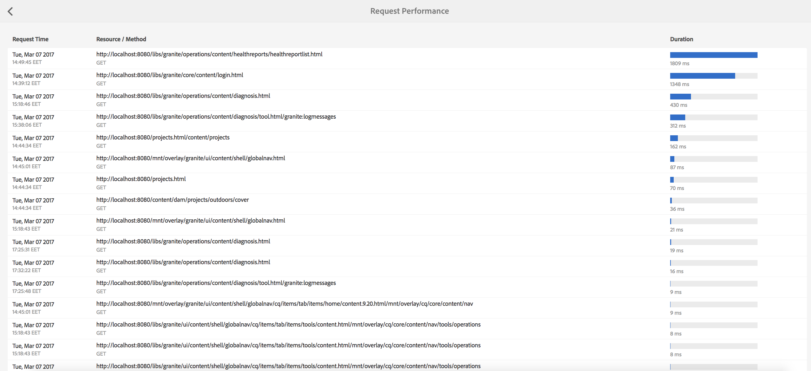
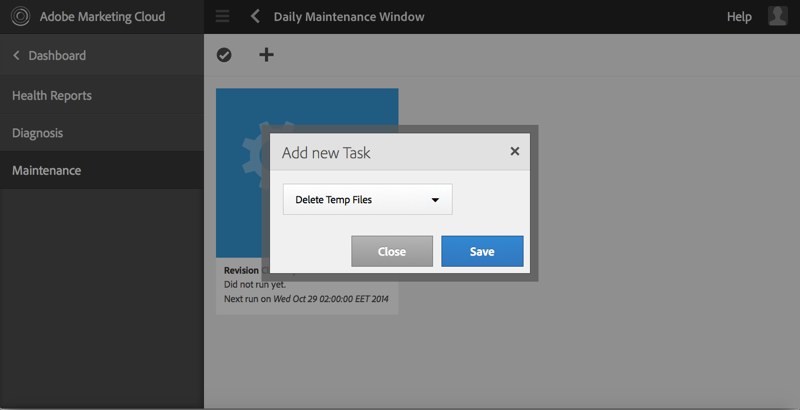

# Painel de operações {#operations-dashboard}

## Introdução {#introduction}

O Painel Operations no AEM 6 ajuda os operadores do sistema a monitorar rapidamente a integridade do sistema do AEM. Ele também fornece informações de diagnóstico geradas automaticamente sobre aspectos relevantes do AEM e permite configurar e executar automação de manutenção autossuficiente para reduzir significativamente as operações do projeto e os casos de suporte. O Painel Operações pode ser estendido com verificações de integridade personalizadas e tarefas de manutenção. Além disso, os dados do Operations Painel podem ser acessados a partir de ferramentas de monitoramento externas via JMX.

**O Painel de Operações:**

* É um status de sistema de um clique para ajudar os departamentos de operações a aumentar a eficiência
* Fornece uma visão geral da integridade do sistema em um único local centralizado
* Reduz o tempo para localizar, analisar e corrigir problemas
* Oferece automação de manutenção independente que ajuda a reduzir significativamente os custos das operações do projeto

Ele pode ser acessado indo até **Ferramentas** - **Operações** na tela de boas-vindas do AEM.

>[!NOTE]
>
>Para poder acessar o Painel Operações, o usuário conectado deve fazer parte do grupo de usuários &quot;Operadores&quot;. Para obter mais informações, consulte a documentação sobre Administração [de direitos de acesso, grupo e](/help/sites-administering/user-group-ac-admin.md)usuário.

## Relatórios de integridade {#health-reports}

O sistema de relatório de integridade fornece informações sobre a integridade de uma instância do AEM por meio das verificações de integridade do Sling. Isso pode ser feito por meio de solicitações OSGI, JMX, HTTP (via JSON) ou pela interface de usuário de toque. Ele oferta as medições e o limite de certos contadores configuráveis e, em alguns casos, oferta informações sobre como resolver o problema.

Ele tem vários recursos, descritos abaixo.

## Verificações de integridade {#health-checks}

Os relatórios **de** saúde são um sistema de cartões que indica boa ou má saúde em relação a uma área específica do produto. Esses cartões são visualizações das Sling Health Checks, que agregação dados do JMX e de outras fontes e expõe as informações processadas novamente como MBeans. Esses MBeans também podem ser inspecionados no console [da Web](/help/sites-administering/jmx-console.md)JMX, no domínio **org.apache.sling.saudcheck** .

A interface de Relatórios de integridade pode ser acessada por meio do menu **Ferramentas** - **Operações** - Relatórios **de** integridade, na tela de Boas-vindas do AEM, ou diretamente por meio do seguinte URL:

`https://<serveraddress>:port/libs/granite/operations/content/healthreports/healthreportlist.html`


O sistema de cartões expõe três estados possíveis: **OK**, **AVISO** e **CRÍTICO**. Os estados resultam de regras e limites, que podem ser configurados passando o mouse sobre o cartão e, em seguida, clicando no ícone de engrenagem na barra de ação:


### Tipos de verificação de integridade {#health-check-types}

Há dois tipos de verificações de integridade no AEM 6:

1. Verificações de integridade individuais
1. Verificações de integridade compostas

Uma verificação **de integridade** individual é uma verificação de integridade única que corresponde a um cartão de status. As Verificações de integridade individuais podem ser configuradas com regras ou limites e podem fornecer uma ou mais dicas e links para resolver problemas de integridade identificados. Vejamos a verificação &quot;Erros de registro&quot; como um exemplo: se houver entradas ERROR nos registros da instância, você as encontrará na página de detalhes da verificação de integridade. Na parte superior da página, você verá um link para o analisador &quot;Mensagem de registro&quot; na seção Ferramentas de diagnóstico, que permitirá que você analise esses erros com mais detalhes e reconfigure os registradores.

Uma verificação **de integridade** composta é uma verificação que agregação informações de várias verificações individuais.

As verificações de integridade composta são configuradas com o auxílio de tags **de** filtro. Essencialmente, todas as verificações únicas que têm a mesma tag de filtro serão agrupadas como uma verificação de integridade composta. Uma verificação de integridade composta terá um status OK somente se todas as verificações únicas que ela agregação tiverem status OK também.

### Como criar verificações de integridade {#how-to-create-health-checks}

No Painel Operações, você pode visualizar o resultado de verificações de integridade individuais e compostas.

### Criando uma verificação de integridade individual {#creating-an-individual-health-check}

A criação de uma verificação de integridade individual envolve duas etapas: implementar uma Verificação de integridade Sling e adicionar uma entrada para a Verificação de integridade nos nós de configuração do Painel.

1. Para criar uma Verificação de integridade Sling, é necessário criar um componente OSGI que implemente a interface Sling HealthCheck. Você adicionará esse componente dentro de um pacote. As propriedades do componente identificarão completamente a verificação de integridade. Quando o componente estiver instalado, um MBean JMX será criado automaticamente para a verificação de integridade. Consulte a Documentação [do](https://sling.apache.org/documentation/bundles/sling-health-check-tool.html) Sling Health Check para obter mais informações.

   Exemplo de um componente Sling Health Check, gravado com anotações do componente de serviço OSGI:

   ```java
   @Component(service = HealthCheck.class,
   property = {
       HealthCheck.NAME + "=Example Check",
       HealthCheck.TAGS + "=example",
       HealthCheck.TAGS + "=test",
       HealthCheck.MBEAN_NAME + "=exampleHealthCheckMBean"
   })
    public class ExampleHealthCheck implements HealthCheck {
       @Override
       public Result execute() {
           // health check code
       }
    }
   ```

   >[!NOTE]
   >
   >A `MBEAN_NAME` propriedade define o nome da mbean que será gerada para essa verificação de integridade.

1. Depois de criar uma Verificação de integridade, é necessário criar um novo nó de configuração para torná-lo acessível na interface do Painel Operações. Para esta etapa, é necessário saber o nome do JMX Mbean da verificação de integridade (a `MBEAN_NAME` propriedade). Para criar uma configuração para a Verificação de integridade, abra o CRXDE e adicione um novo nó (do tipo **nt:unstructed**) no seguinte caminho: `/apps/settings/granite/operations/hc`

   As seguintes propriedades devem ser definidas no novo nó:

   * **Nome:** `sling:resourceType`

      * **Tipo:** `String`
      * **Valor:** `granite/operations/components/mbean`
   * **Nome:** `resource`

      * **Tipo:** `String`
      * **Valor:** `/system/sling/monitoring/mbeans/org/apache/sling/healthcheck/HealthCheck/exampleHealthCheck`

   >[!NOTE]
   >
   >O caminho do recurso acima é criado da seguinte forma: se o nome da sua verificação de integridade for &quot;test&quot;, adicione &quot;test&quot; ao final do caminho `/system/sling/monitoring/mbeans/org/apache/sling/healthcheck/HealthCheck`
   >
   >Assim, o caminho final será:
   >
   >`/system/sling/monitoring/mbeans/org/apache/sling/healthcheck/HealthCheck/test`

   >[!NOTE]
   >
   >Verifique se o `/apps/settings/granite/operations/hc` caminho tem as seguintes propriedades definidas como true:
   >
   >
   >`sling:configCollectionInherit`
   >
   >`sling:configPropertyInherit`
   >
   >
   >Isso solicitará que o gerenciador de configuração mescle as novas configurações com as existentes de `/libs`.

### Criando uma verificação de integridade composta {#creating-a-composite-health-check}

A função de uma verificação de integridade composta é agregação de várias verificações de integridade individuais que compartilham um conjunto de recursos comuns. Por exemplo, o Security Composite Health Check agrupa todas as verificações de integridade individuais que realizam verificações relacionadas com a segurança. A primeira etapa para criar uma verificação composta é adicionar uma nova configuração OSGI. Para ser exibido no Painel Operações, é necessário adicionar um novo nó de configuração, da mesma forma que fizemos para uma verificação simples.

1. Vá para o Web Configuration Manager no Console OSGI. Você pode fazer isso acessando `https://serveraddress:port/system/console/configMgr`
1. Procure a entrada chamada **Apache Sling Composite Health Check (Verificação** de integridade composta do Apache Sling). Depois de encontrá-lo, observe que existem duas configurações disponíveis: um para as verificações do sistema e outro para as verificações de segurança.
1. Crie uma nova configuração pressionando o botão &quot;+&quot; no lado direito da configuração. Uma nova janela será exibida, como mostrado abaixo:

   

1. Crie uma configuração e salve-a. Uma Mbean será criada com a nova configuração.

   A finalidade de cada propriedade de configuração é a seguinte:

   * **Nome (hc.name):** O nome da verificação de integridade composta. Um nome significativo é recomendado.
   * **Tags (hc.tags):** As tags para esta verificação de integridade. Se essa verificação de integridade composta for parte de outra verificação de integridade composta (como em uma hierarquia de verificações de integridade), adicione as tags às quais esse composto está relacionado.
   * **Nome do MBean (hc.mbean.name):** O nome do Mbean que será fornecido ao JMX MBean desta verificação de integridade composta.
   * **Tags de filtro (filter.tags):** Esta é uma propriedade específica de verificações de integridade compostas. Essas são as tags que o composto deve agregação. A verificação de integridade composta agregação em seu grupo todas as verificações de integridade que tenham qualquer tag correspondente a qualquer uma das tags de filtro desse composto. Por exemplo, uma verificação de integridade composta que tenha as tags de filtro **teste** e **verificação** agregação todas as verificações de integridade individuais e compostas que têm qualquer uma das tags de **teste** e **verificação** em suas propriedades de tags ( `hc.tags`).

   >[!NOTE]
   >
   >Um novo JMX Mbean é criado para cada nova configuração da Verificação de integridade composta do Apache Sling.**

1. Finalmente, a entrada da verificação de integridade composta que acabou de ser criada precisa ser adicionada nos nós de configuração do Painel Operations. O procedimento para o efeito é o mesmo que para os controlos sanitários individuais: um nó do tipo **nt:unstruct** precisa ser criado em `/apps/settings/granite/operations/hc`. A propriedade resource do nó será definida pelo valor de **hc.medium.name** na configuração OSGI.

   Se, por exemplo, você tiver criado uma configuração e definir o valor **hc.mbean.name** como **diskusage**, os nós de configuração terão a seguinte aparência:

   * **Nome:** `Composite Health Check`

      * **Tipo:** `nt:unstructured`

   Com as seguintes propriedades:

   * **Nome:** `sling:resourceType`

      * **Tipo:** `String`
      * **Valor:** `granite/operations/components/mbean`
   * **Nome:** `resource`

      * **Tipo:** `String`
      * **Valor:** `/system/sling/monitoring/mbeans/org/apache/sling/healthcheck/HealthCheck/diskusage`

   >[!NOTE]
   >
   >Se você criar verificações de integridade individuais que pertencem logicamente a uma verificação composta que já está presente no Painel por padrão, elas serão automaticamente capturadas e agrupadas sob a respectiva verificação composta. Por isso, não há necessidade de criar um novo nó de configuração para essas verificações.
   >
   >Por exemplo, se você criar uma verificação de integridade de segurança individual, tudo o que você precisa fazer é atribuí-la à tag &quot;**security**&quot; e ela for instalada, ela aparecerá automaticamente sob a verificação composta de Verificações de segurança no Painel Operações.

### Verificações de integridade fornecidas com o AEM {#health-checks-provided-with-aem}

<table>
 <tbody>
  <tr>
   <td><strong>Nome da verificação completa</strong></td>
   <td><strong>Descrição</strong></td>
  </tr>
  <tr>
   <td>Desempenho da consulta</td>
   <td><p>Essa verificação de integridade foi simplificada <strong>no AEM 6.4</strong>e agora verifica o <code>Oak QueryStats</code> MBean recentemente refatorado, mais especificamente o <code>SlowQueries </code>atributo. Se as estatísticas contiverem query lentos, a verificação de integridade retornará um aviso. Caso contrário, retornará o status OK.<br /> </p> <p>O MBean para esta verificação de integridade é <a href="http://localhost:4502/system/console/jmx/org.apache.sling.healthcheck%3Aname%3DqueriesStatus%2Ctype%3DHealthCheck">org.apache.sling.saudcheck:name=queriesStatus,type=HealthCheck</a>.</p> </td>
  </tr>
  <tr>
   <td>Comprimento da fila de observação</td>
   <td><p>A Duração da Fila de Observação repete todos os Ouvintes de Evento e Observadores de Plano de Fundo, compara <code>queueSize </code>os respectivos e <code>maxQueueSize</code> os seguintes:</p>
    <ul>
     <li>retorna o status Crítico se o <code>queueSize</code> valor exceder o <code>maxQueueSize</code> valor (ou seja, quando os eventos seriam descartados)</li>
     <li>retorna Avisar se o <code>queueSize</code> valor estiver acima do <code>maxQueueSize * WARN_THRESHOLD</code> (o valor padrão é 0,75) </li>
    </ul> <p>O comprimento máximo de cada fila provém de configurações separadas (Oak e AEM) e não é configurável a partir dessa verificação de integridade. O MBean para esta verificação de integridade é <a href="http://localhost:4502/system/console/jmx/org.apache.sling.healthcheck%3Aname%3DObservationQueueLengthHealthCheck%2Ctype%3DHealthCheck">org.apache.sling.saudcheck:name=ObservationQueueLengthHealthCheck,type=HealthCheck</a>.</p> </td>
  </tr>
  <tr>
   <td>Limites de cruzamento da consulta</td>
   <td><p>Os Limites de cruzamento de Query verificam o <code>QueryEngineSettings</code> MBean, mais especificamente os atributos <code>LimitInMemory</code> e <code>LimitReads</code> , e retorna o seguinte status:</p>
    <ul>
     <li>retorna o status Avisar se um dos limites for igual ou superior ao <code>Integer.MAX_VALUE</code></li>
     <li>retorna o status Aviso se um dos limites for menor que 10000 (a configuração recomendada do Oak)</li>
     <li>retorna o status Crítico se não for possível recuperar os limites <code>QueryEngineSettings</code> ou qualquer um deles</li>
    </ul> <p>O Mbean para esta verificação de integridade é <a href="http://localhost:4502/system/console/jmx/org.apache.sling.healthcheck%3Aname%3DqueryTraversalLimitsBundle%2Ctype%3DHealthCheck">org.apache.sling.saudcheck:name=queryTraversalLimitsBundle,type=HealthCheck</a>.</p> </td>
  </tr>
  <tr>
   <td>Relógios sincronizados</td>
   <td><p>Essa verificação é relevante apenas para clusters <a href="https://github.com/apache/sling-old-svn-mirror/blob/4df9ab2d6592422889c71fa13afd453a10a5a626/bundles/extensions/discovery/oak/src/main/java/org/apache/sling/discovery/oak/SynchronizedClocksHealthCheck.java">de</a>documento nodestore. Ele retorna o seguinte status:</p>
    <ul>
     <li>retorna o status de Aviso quando os relógios de instância ficam fora de sincronização e passam por um limite baixo predefinido</li>
     <li>retorna o status Crítico quando os relógios de instância ficam fora de sincronia e ultrapassam um limite alto predefinido</li>
    </ul> <p>O Mbean para esta verificação de integridade é <a href="http://localhost:4502/system/console/jmx/org.apache.sling.healthcheck%3Aname%3DslingDiscoveryOakSynchronizedClocks%2Ctype%3DHealthCheck">org.apache.sling.saudcheck:name=slingDiscoveryOakSynchronizedClocks,type=HealthCheck</a>.</p> </td>
  </tr>
  <tr>
   <td>Índices assíncronos</td>
   <td><p>A verificação Índices Assíncronos:</p>
    <ul>
     <li>retorna o status Crítico se pelo menos uma linha de indexação estiver falhando</li>
     <li>verifica todas as vias de indexação <code>lastIndexedTime</code> e:
      <ul>
       <li>retorna o status Crítico se estiver há mais de 2 horas </li>
       <li>retorna o status Aviso se estiver entre 2 horas e 45 minutos atrás </li>
       <li>retorna o status OK se estiver há menos de 45 minutos </li>
      </ul> </li>
     <li>se nenhuma dessas condições for atendida, retornará o status OK</li>
    </ul> <p>Os limites de status Crítico e Avisar são configuráveis. O Mbean para esta verificação de integridade é <a href="http://localhost:4502/system/console/jmx/org.apache.sling.healthcheck%3Aname%3DasyncIndexHealthCheck%2Ctype%3DHealthCheck">org.apache.sling.saudcheck:name=asyncIndexHealthCheck,type=HealthCheck</a>.</p> <p><strong>Observação: </strong>Esta verificação de integridade está disponível com o AEM 6.4 e tem suporte para o AEM 6.3.0.1.</p> </td>
  </tr>
  <tr>
   <td>Índices Lucene grandes</td>
   <td><p>Essa verificação usa os dados expostos pelo <code>Lucene Index Statistics</code> MBean para identificar grandes índices e retornos:</p>
    <ul>
     <li>um status de Aviso se houver um índice com mais de 1 bilhão de documentos</li>
     <li>um status crítico se houver um índice com mais de 1,5 bilhão de documentos</li>
    </ul> <p>Os limites são configuráveis e o MBean para a verificação de integridade é <a href="http://localhost:4502/system/console/jmx/org.apache.sling.healthcheck%3Aname%3DlargeIndexHealthCheck%2Ctype%3DHealthCheck">org.apache.sling.saudcheck:name=largeIndexHealthCheck,type=HealthCheck.</a></p> <p><strong>Observação: </strong>Esta verificação está disponível com o AEM 6.4 e foi suportada para o AEM 6.3.2.0.</p> </td>
  </tr>
  <tr>
   <td>Manutenção do sistema</td>
   <td><p>A Manutenção do sistema é uma verificação composta que retorna o OK se todas as tarefas de manutenção estiverem em execução como configurado. Lembre-se de que:</p>
    <ul>
     <li>cada tarefa de manutenção é acompanhada de um exame de saúde associado</li>
     <li>se uma tarefa não for adicionada a uma janela de manutenção, sua verificação de integridade retornará Crítico</li>
     <li>é necessário configurar as tarefas de manutenção Log de Auditoria e Expurgação do Fluxo de Trabalho ou removê-las das janelas de manutenção. Se não estiverem configuradas, essas tarefas falharão na primeira tentativa de execução, então a verificação Manutenção do sistema retornará o status Crítico.</li>
     <li><strong>Com o AEM 6.4</strong>, também há uma verificação para a tarefa de manutenção <a href="/help/sites-administering/operations-dashboard.md#automated-maintenance-tasks">do</a> Lucene Binaries</li>
     <li>no AEM 6.2 e inferior, a verificação de manutenção do sistema retorna um status de Aviso logo após a inicialização, pois o tarefa nunca é executado. A partir da versão 6.3, eles retornarão OK se a primeira janela de manutenção ainda não tiver sido atingida.</li>
    </ul> <p>O MBean para esta verificação de integridade é <a href="http://localhost:4502/system/console/jmx/org.apache.sling.healthcheck%3Aname%3Dsystemchecks%2Ctype%3DHealthCheck">org.apache.sling.saudcheck:name=systemcheck,type=HealthCheck</a>.</p> </td>
  </tr>
  <tr>
   <td>Fila de replicação</td>
   <td><p>Esta verificação repete os agentes de replicação e observa suas filas. Para o item na parte superior da fila, a verificação verifica quantas vezes o agente repetiu a replicação. Se o agente tiver repetido a replicação mais do que o valor do <code>numberOfRetriesAllowed</code> parâmetro, ele retornará um aviso. O <code>numberOfRetriesAllowed</code> parâmetro é configurável. </p> <p>O MBean para esta verificação de integridade é <a href="http://localhost:4502/system/console/jmx/org.apache.sling.healthcheck%3Aname%3DreplicationQueue%2Ctype%3DHealthCheck" target="_blank">org.apache.sling.saudcheck:name=ReplicationQueue,type=HealthCheck</a>.</p> </td>
  </tr>
  <tr>
   <td>Tarefas de arremesso</td>
   <td>
    <div>
      O Sling Jobs verifica o número de jobs na fila no JobManager, o compara ao <code>maxNumQueueJobs</code> limite e:
    </div>
    <ul>
     <li>retorna Crítico se houver mais do que o <code>maxNumQueueJobs</code> que está na fila</li>
     <li>retorna Crítico se houver trabalhos ativos de longa duração com mais de 1 hora</li>
     <li>retorna Crítico se houver trabalhos em fila e o último tempo de trabalho concluído for superior a 1 hora</li>
    </ul> <p>Somente o número máximo de parâmetros de trabalhos em fila é configurável e tem o valor padrão de 1000.</p> <p>O MBean para esta verificação de integridade é <a href="http://localhost:4502/system/console/jmx/org.apache.sling.healthcheck%3Aname%3DslingJobs%2Ctype%3DHealthCheck" target="_blank">org.apache.sling.saudcheck:name=slingJobs,type=HealthCheck</a>.</p> </td>
  </tr>
  <tr>
   <td>Desempenho da solicitação</td>
   <td><p>Esta verificação analisa a métrica <code>granite.request.metrics.timer</code> Sling <a href="http://localhost:4502/system/console/slingmetrics" target="_blank"></a>e:</p>
    <ul>
     <li>retorna Crítico se o valor do percentil 75 estiver acima do limite crítico (o valor padrão é 500 milissegundos)</li>
     <li>retorna Avisar se o valor do 75º percentil estiver acima do limite de aviso (o valor padrão é 200 milissegundos)</li>
    </ul> <p>O MBean para esta verificação de integridade é<em> </em><a href="http://localhost:4502/system/console/jmx/org.apache.sling.healthcheck%3Aname%3DrequestsStatus%2Ctype%3DHealthCheck" target="_blank">org.apache.sling.saudcheck:name=requestStatus,type=HealthCheck</a>.</p> </td>
  </tr>
  <tr>
   <td>Erros de log</td>
   <td><p>Essa verificação retornará o status Avisar se houver erros no log.</p> <p>O MBean para esta verificação de integridade é <a href="http://localhost:4502/system/console/jmx/org.apache.sling.healthcheck%3Aname%3DlogErrorHealthCheck%2Ctype%3DHealthCheck" target="_blank">org.apache.sling.saudcheck:name=logErrorHealthCheck,type=HealthCheck</a>.</p> </td>
  </tr>
  <tr>
   <td>Espaço em disco</td>
   <td><p>A verificação de Espaço em Disco verifica o <code>FileStoreStats</code> MBean, recupera o tamanho do Node Store e a quantidade de espaço em disco utilizável na partição do Node Store e:</p>
    <ul>
     <li>retorna Avisar se a proporção de espaço em disco utilizável para o tamanho do repositório for menor que o limite de aviso (o valor padrão é 10)</li>
     <li>retorna Crítico se a taxa de espaço em disco utilizável para o tamanho do repositório for menor que o limite crítico (o valor padrão é 2)</li>
    </ul> <p>Ambos os limites são configuráveis. A verificação só funciona em instâncias com um Repositório de segmentos.</p> <p>O MBean para esta verificação de integridade é <a href="http://localhost:4502/system/console/jmx/org.apache.sling.healthcheck%3Aname%3DDiskSpaceHealthCheck%2Ctype%3DHealthCheck" target="_blank">org.apache.sling.saudcheck:name=DiskSpaceHealthCheck,type=HealthCheck</a>.</p> </td>
  </tr>
  <tr>
   <td>Verificação de integridade do assistente de agendamento</td>
   <td><p>Essa verificação retornará um aviso se a instância tiver trabalhos do Quartz em execução por mais de 60 segundos. O limite de duração aceitável é configurável.</p> <p>O MBean para esta verificação de integridade é <a href="http://localhost:4502/system/console/jmx/org.apache.sling.healthcheck%3Aname%3DslingCommonsSchedulerHealthCheck%2Ctype%3DHealthCheck" target="_blank">org.apache.sling.saudcheck:name=slingCommonsSchedulerHealthCheck,type=HealthCheck</a><em>.</em></p> </td>
  </tr>
  <tr>
   <td>Verificações de segurança</td>
   <td><p>A verificação de segurança é um composto que agregação os resultados de várias verificações relacionadas à segurança. Essas verificações de integridade individuais tratam de preocupações diferentes da lista de verificação de segurança disponível na página de documentação da Lista de verificação de <a href="/help/sites-administering/security-checklist.md">segurança.</a> A verificação é útil como um teste de segurança de fumaça quando a instância é iniciada. </p> <p>O MBean para esta verificação de integridade é <a href="http://localhost:4502/system/console/jmx/org.apache.sling.healthcheck%3Aname%3Dsecuritychecks%2Ctype%3DHealthCheck" target="_blank">org.apache.sling.saudcheck:name=</a><a href="http://localhost:4502/system/console/jmx/org.apache.sling.healthcheck%3Aname%3Dsecuritychecks%2Ctype%3DHealthCheck" target="_blank"></a><a href="http://localhost:4502/system/console/jmx/org.apache.sling.healthcheck%3Aname%3Dsecuritychecks%2Ctype%3DHealthCheck" target="_blank"></a><a href="http://localhost:4502/system/console/jmx/org.apache.sling.healthcheck%3Aname%3Dsecuritychecks%2Ctype%3DHealthCheck" target="_blank">security check,type=HealthCheck</a></p> </td>
  </tr>
  <tr>
   <td>Grupos ativos</td>
   <td><p>Os Pacotes Ativos verificam o estado de todos os pacotes e:</p>
    <ul>
     <li>retorna o status Aviso se algum dos pacotes não estiver ativo ou (iniciando, com ativação lento)</li>
     <li>ignora o status dos pacotes na lista ignorada</li>
    </ul> <p>O parâmetro ignorar lista é configurável.</p> <p>O MBean para esta verificação de integridade é <a href="http://localhost:4502/system/console/jmx/org.apache.sling.healthcheck%3Aname%3DinactiveBundles%2Ctype%3DHealthCheck" target="_blank">org.apache.sling.saudcheck:name=inativeBundles,type=HealthCheck</a>.</p> </td>
  </tr>
  <tr>
   <td>Verificação de Cache de Código</td>
   <td><p>Esta é uma verificação de integridade que verifica várias condições JVM que podem disparar um erro CodeCache presente no Java 7:</p>
    <ul>
     <li>retorna Avisar se a instância estiver em execução no Java 7, com o enfraquecimento do Cache de Código ativado</li>
     <li>retorna Avisar se a instância estiver em execução no Java 7 e o tamanho do Cache de Código Reservado for menor que um limite mínimo (o valor padrão é 90 MB)</li>
    </ul> <p>O <code>minimum.code.cache.size</code> limite é configurável. Para obter mais informações sobre o bug, <a href="https://bugs.java.com/bugdatabase/view_bug.do?bug_id=8012547">verifique</a><a href="https://bugs.java.com/bugdatabase/view_bug.do?bug_id=8012547"></a><a href="https://bugs.java.com/bugdatabase/view_bug.do?bug_id=8012547"></a><a href="https://bugs.java.com/bugdatabase/view_bug.do?bug_id=8012547"> esta página</a>.</p> <p>O MBean para esta verificação de integridade é <a href="http://localhost:4502/system/console/jmx/org.apache.sling.healthcheck%3Aname%3DcodeCacheHealthCheck%2Ctype%3DHealthCheck" target="_blank">org.apache.sling.saudcheck:name=codeCacheHealthCheck,type=HealthCheck</a>.</p> </td>
  </tr>
  <tr>
   <td>Recurso Buscar erros de caminho</td>
   <td><p>Verifica se há recursos no caminho <code>/apps/foundation/components/primary</code> e:</p>
    <ul>
     <li>retorna Avisar se houver nós secundários em <code>/apps/foundation/components/primary</code></li>
    </ul> <p>O MBean para esta verificação de integridade é <a href="http://localhost:4502/system/console/jmx/org.apache.sling.healthcheck%3Aname%3DresourceSearchPathErrorHealthCheck%2Ctype%3DHealthCheck" target="_blank">org.apache.sling.saudcheck:name=resourceSearchPathErrorHealthCheck,type=HealthCheck</a>.</p> </td>
  </tr>
 </tbody>
</table>

## Monitoramento com Nagios {#monitoring-with-nagios}

O Painel de verificação de integridade pode se integrar ao Nagios por meio do Granite JMX Mbeans. O exemplo a seguir ilustra como adicionar uma verificação que mostre a memória usada no servidor que executa o AEM.

1. Configure e instale Nagios no servidor de monitoramento.
1. Em seguida, instale o executor de plug-in remoto Nagios (NRPE).

   >[!NOTE]
   >
   >Para obter mais informações sobre como instalar Nagios e NRPE em seu sistema, consulte a Documentação [do](https://library.nagios.com/library/products/nagioscore/manuals/)Nagios.

1. Adicione uma definição de host para o servidor AEM. Isso pode ser feito por meio da interface da Web Nagios XI, usando o Configuration Manager:

   1. Abra um navegador e aponte para o servidor Nagios.
   1. Pressione o botão **Configure (Configurar** ) no menu superior.
   1. No painel esquerdo, pressione o **Core Config Manager** em Configuração **** avançada.
   1. Pressione o link **Hosts** na seção **Monitoramento** .
   1. Adicione a definição do host:

   

   Abaixo está um exemplo de um arquivo de configuração de host, no caso de você estar usando o Nagios Core:

   ```xml
   define host {
      address 192.168.0.5
      max_check_attempts 3
      check_period 24x7
      check-command check-host-alive
      contacts admin
      notification_interval 60
      notification_period 24x7
   }
   ```

1. Instale Nagios e NRPE no servidor AEM.
1. Instale o plug-in [check_http_json](https://github.com/phrawzty/check_http_json) em ambos os servidores.
1. Defina um comando de verificação JSON genérico em ambos os servidores:

   ```xml
   define command{
   
       command_name    check_http_json-int
   
       command_line    /usr/lib/nagios/plugins/check_http_json --user "$ARG1$" --pass "$ARG2$" -u 'https://$HOSTNAME$:$ARG3$/$ARG4$' -e '$ARG5$' -w '$ARG6$' -c '$ARG7$'
   
   }
   ```

1. Adicione um serviço para memória usada no servidor AEM:

   ```xml
   define service {
   
       use generic-service
   
       host_name my.remote.host
   
       service_description AEM Author Used Memory
   
       check_command  check_http_json-int!<cq-user>!<cq-password>!<cq-port>!system/sling/monitoring/mbeans/java/lang/Memory.infinity.json!{noname}.mbean:attributes.HeapMemoryUsage.mbean:attributes.used.mbean:value!<warn-threshold-in-bytes>!<critical-threshold-in-bytes>
   
       }
   ```

1. Verifique seu painel Nagios para obter o serviço recém-criado:

   

## Diagnosis tools {#diagnosis-tools}

O Painel Operation também fornece acesso às Ferramentas de diagnóstico que podem ajudar a encontrar e solucionar problemas das causas raiz dos avisos provenientes do Painel Health Check, além de fornecer informações importantes de depuração para os operadores do sistema.

Entre as suas características mais importantes estão:

* Um analisador de mensagens de registro
* A capacidade de acessar os despejos de heap e thread
* Analisadores de desempenho de solicitações e query

Você pode acessar a tela Ferramentas de diagnóstico indo até **Ferramentas - Operações - Diagnóstico** na tela de boas-vindas do AEM. Você também pode acessar a tela acessando diretamente o seguinte URL: `https://serveraddress:port/libs/granite/operations/content/diagnosis.html`


### Mensagens de registro {#log-messages}

Por padrão, as mensagens de log da Interface do usuário exibirão todas as mensagens de ERRO. Se desejar que mais mensagens de log sejam exibidas, é necessário configurar um agente de log com o nível de log apropriado.

As mensagens de registro usam um anexo de registro de memória e, portanto, não estão relacionadas aos arquivos de registro. Outra consequência é que alterar os níveis de log nesta interface não alterará as informações que são registradas nos arquivos de log tradicionais. A adição e remoção de registradores nesta interface afetará apenas o registrador de memória. Além disso, observe que a alteração das configurações do agente de log será refletida no futuro do agente de log de memória - as entradas que já estão registradas e não são mais relevantes não serão excluídas, mas entradas semelhantes não serão registradas no futuro.

Você pode configurar o que é registrado fornecendo configurações de logger do botão de engrenagem superior esquerdo na interface do usuário. Lá, você pode adicionar, remover ou atualizar configurações de agente de log. Uma configuração de agente de log é composta por um nível **de** log (WARN / INFO / DEBUG) e um nome **de** filtro. O nome **do** filtro tem a função de filtrar a origem das mensagens de log que são registradas. Como alternativa, se um agente de log deve capturar todas as mensagens de log para o nível especificado, o nome do filtro deve ser &quot;**root**&quot;. Definir o nível de um agente de log acionará a captura de todas as mensagens com um nível igual ou superior ao especificado.

Exemplos:

* Se você planeja capturar todas as mensagens de **ERRO** - nenhuma configuração é necessária. Todas as mensagens de ERRO são capturadas por padrão.
* Se você planeja capturar todas as mensagens **ERROR**, **WARN** e **INFO** - o nome do agente de log deve ser definido como: &quot;**root**&quot; e o nível do agente de log para: **INFORMAÇÕES**.

* Se você planeja capturar todas as mensagens provenientes de um determinado pacote (por exemplo, com.adobe.granite) - o nome do agente de log deve ser definido como: &quot;com.adobe.granite&quot; e o nível do agente de log para: **DEBUG** (isso capturará todas as mensagens de **ERRO**, **AVISO**, **INFORMAÇÕES** e **DEPURAÇÃO** ), conforme mostrado na imagem abaixo.


>[!NOTE]
>
>Não é possível definir um nome de agente de log para capturar somente mensagens ERROR por meio de um filtro especificado. Por padrão, todas as mensagens de ERRO são capturadas.

>[!NOTE]
>
>A interface do usuário das mensagens de log não reflete o log de erros real. A menos que você esteja configurando outros tipos de mensagens de log na interface do usuário, você verá apenas mensagens de ERRO. Para saber como exibir mensagens de registro específicas, consulte as instruções acima.

>[!NOTE]
>
>As configurações na página de diagnóstico não influenciam o que está registrado nos arquivos de log e vice-versa. Assim, embora o registro de erros possa capturar mensagens INFO, talvez você não as veja na interface do usuário das mensagens de registro. Além disso, por meio da interface é possível capturar mensagens DEBUG de determinados pacotes sem afetar o log de erros. Para obter mais informações sobre como configurar os arquivos de registro, consulte [Registro](/help/sites-deploying/configure-logging.md).

>[!NOTE]
>
>**Com o AEM 6.4**, as tarefas de manutenção são desconectadas da caixa em um formato mais rico em informações no nível INFO. Isso permite uma melhor visibilidade do estado das tarefas de manutenção.
>
>Caso esteja usando ferramentas de terceiros (como Splunk) para monitorar e reagir à atividade da tarefa de manutenção, você pode usar as seguintes declarações de log:

```
Log level: INFO
DATE+TIME [MaintanceLogger] Name=<MT_NAME>, Status=<MT_STATUS>, Time=<MT_TIME>, Error=<MT_ERROR>, Details=<MT_DETAILS>
```

### Request performance {#request-performance}

A página Desempenho da solicitação permite a análise das solicitações de página mais lentas processadas. Somente as solicitações de conteúdo serão registradas nesta página. Mais especificamente, as seguintes solicitações serão capturadas:

1. Solicitações de acesso a recursos em `/content`
1. Solicitações de acesso a recursos em `/etc/design`
1. Pedidos com a `".html"` extensão



A página exibe:

* A hora em que a solicitação foi feita
* O URL e o método de solicitação
* A duração em milissegundos

Por padrão, as 20 solicitações de página mais lentas são capturadas, mas o limite pode ser modificado no Configuration Manager.

### Desempenho da consulta {#query-performance}

A página Desempenho do Query permite a análise dos query mais lentos executados pelo sistema. Essas informações são fornecidas pelo repositório em um JMX Mbean. Em Jackrabbit, o `com.adobe.granite.QueryStat` JMX Mbean fornece essas informações, enquanto no repositório do Oak, ele é oferecido por `org.apache.jackrabbit.oak.QueryStats.`

A página exibe:

* A hora em que o query foi feito
* O idioma do query
* O número de vezes que o query foi emitido
* A declaração do query
* A duração em milissegundos


### Explicar consulta {#explain-query}

Para qualquer query, o Oak tenta descobrir a melhor maneira de executar com base nos índices Oak definidos no repositório no nó **oak:index** . Dependendo do query, diferentes índices podem ser escolhidos por Oak. Entender como o Oak está executando um query é o primeiro passo para otimizar o query.

O Query Explique é uma ferramenta que explica como o Oak está executando um query. Ele pode ser acessado indo até **Ferramentas - Operações - Diagnóstico** na tela de boas-vindas do AEM, e clicando em Desempenho **do** Query e alternando para a guia **Explicar Query** .

**Recursos**

* Suporta os idiomas de query Xpath, JCR-SQL e JCR-SQL2
* Relata o tempo de execução real do query fornecido
* Detecta query lentos e avisa sobre query que podem ser lentos
* Relata o índice Oak usado para executar o query
* Exibe a explicação real do mecanismo de Query Oak
* Fornece lista de clique para carregar de query lentos e populares

Quando você estiver na interface do usuário do Query Explique, tudo o que precisa fazer para usá-la é digitar o query e pressionar o botão **Explicar** :


A primeira entrada na seção Explicação do Query é a explicação concreta. A explicação mostrará o tipo de índice usado para executar o query.

A segunda entrada é o plano de execução.

Clicar na caixa **Incluir tempo** de execução antes de executar o query também mostrará a quantidade de tempo em que o query foi executado, permitindo mais informações que podem ser usadas para otimizar os índices para seu aplicativo ou implantação.


### O Gerenciador de índice {#the-index-manager}

A finalidade do Gerenciador de índice é facilitar o gerenciamento de índice, como manter índices, ou exibir seu status.

Para acessá-lo, acesse **Ferramentas - Operações - Diagnóstico **na tela de boas-vindas e clique no botão Gerenciador **de** índice.

Ele também pode ser acessado diretamente neste URL: `https://serveraddress:port/libs/granite/operations/content/diagnosistools/indexManager.html`


A interface do usuário pode ser usada para filtrar índices na tabela digitando os critérios do filtro na caixa de pesquisa no canto superior esquerdo da tela.

### Baixar o ZIP de status {#download-status-zip}

Isso acionará o download de um zip que contém informações úteis sobre o status e a configuração do sistema. O arquivo contém configurações de instância, uma lista de pacotes, OSGI, Métricas e estatísticas Sling, o que pode resultar em um arquivo grande. Você pode reduzir o impacto de arquivos de status grandes usando a **janela** Baixar Status ZIP. A janela pode ser acessada de:**AEM > Ferramentas > Operações > Diagnóstico > Baixar ZIP de status.**

Nessa janela, você pode selecionar o que exportar (arquivos de log e/ou despejos de thread) e o número de dias de logs incluídos no download em relação à data atual.


### Baixar o despejo de encadeamento {#download-thread-dump}

Isso acionará o download de um zip que contém informações sobre os encadeamentos presentes no sistema. Informações sobre cada thread são fornecidas, como seu status, o carregador de classe e o rastreamento de pilha.

### Baixar o despejo da pilha {#download-heap-dump}

Você também pode baixar um instantâneo do heap para analisá-lo posteriormente. Observe que isso acionará o download de um arquivo grande, da ordem de centenas de megabytes.

## Tarefas de manutenção automatizadas {#automated-maintenance-tasks}

A página Tarefas de manutenção automatizada é um local onde você pode visualização e rastrear tarefas de manutenção recomendadas programadas para execução periódica. As tarefas são integradas ao sistema de verificação de integridade. As tarefas também podem ser executadas manualmente a partir da interface.

Para acessar a página Manutenção no Painel de Operações, é necessário acessar **Ferramentas - Operações - Painel - Manutenção** na tela de Boas-vindas do AEM ou seguir diretamente este link:

`https://serveraddress:port/libs/granite/operations/content/maintenance.html`

As seguintes tarefas estão disponíveis no Painel Operações:

1. A **tarefa Limpar** revisão, localizada no menu da janela **Manutenção** diária.
1. A tarefa **Lucene Binaries Cleanup (Limpeza** de binários de Lucene), localizada no menu **Daily Maintenance Window (Janela** de manutenção diária).
1. A tarefa de expurgação **do** fluxo de trabalho, localizada no menu da janela **Manutenção** semanal.
1. A tarefa de Coleta **de Lixo do Repositório de** Dados, localizada no menu da Janela **de Manutenção** Semanal.
1. A tarefa de manutenção **do registro de** auditoria, localizada no menu da janela **Manutenção** semanal.
1. A tarefa **Version Purge Maintenance (Manutenção** de Expurgação da Versão), localizada no menu **Weekly Maintenance Window (Janela** de manutenção semanal).

O tempo padrão para a janela de manutenção diária é de 2 a 5 da manhã. As tarefas configuradas para execução na janela de manutenção semanal serão executadas entre 1 e 2 AM aos sábados.

Você também pode configurar os horários pressionando o ícone de engrenagem em qualquer uma das duas placas de manutenção:


>[!NOTE]
>
>Como o AEM 6.1, as janelas de manutenção existentes também podem ser configuradas para serem executadas mensalmente.

### Limpeza da revisão {#revision-clean-up}

Para obter mais informações sobre como executar a limpeza de revisão, [consulte este artigo](/help/sites-deploying/revision-cleanup.md)dedicado.

### Limpeza de binários do Lucene {#lucene-binaries-cleanup}

Ao usar a tarefa de Limpeza de binários Lucene, você pode expurgar binários lucene e reduzir o requisito de tamanho do armazenamento de dados em execução. Isso ocorre porque a geração binária do lucene será recuperada diariamente, em vez da dependência anterior em uma execução bem-sucedida da coleta [de lixo do armazenamento de](/help/sites-administering/data-store-garbage-collection.md) dados.

Embora a tarefa de manutenção tenha sido desenvolvida para reduzir o lixo de revisão relacionado a Lucene, há ganhos gerais de eficiência ao executar a tarefa:

* A execução semanal da tarefa de coleta de lixo do armazenamento de dados será concluída mais rapidamente
* Também pode melhorar ligeiramente o desempenho geral do AEM

Você pode acessar a tarefa de Limpeza de binários de Lucene a partir de: **AEM > Ferramentas > Operações > Manutenção > Janela de manutenção diária > Limpeza** de binários Lucene.

### Coleta de lixo do armazenamento de dados {#data-store-garbage-collection}

Para obter detalhes sobre a coleta de lixo do Data Store, consulte a página [de](/help/sites-administering/data-store-garbage-collection.md)documentação dedicada.

### Workflow purge {#workflow-purge}

Workflows também podem ser removidos do Painel Maintenance. Para executar a tarefa de Expurgação do Fluxo de Trabalho, é necessário:

1. Clique na página Janela **de manutenção** semanal.
1. Na página a seguir, clique no botão **Reproduzir** no cartão de expurgação **do** Fluxo de trabalho.

>[!NOTE]
>
>Para obter informações mais detalhadas sobre a Manutenção do fluxo de trabalho, consulte [esta página](/help/sites-administering/workflows-administering.md#regular-purging-of-workflow-instances).

### Manutenção do Log de Auditoria {#audit-log-maintenance}

Para a Manutenção do Log de Auditoria, consulte a página de documentação [separada.](/help/sites-administering/operations-audit-log.md)

### Remoção da versão {#version-purge}

Você pode agendar a tarefa de manutenção Expurgação da versão para excluir versões antigas automaticamente. Como resultado, isso minimiza a necessidade de usar manualmente as ferramentas [de Expurgação de](/help/sites-deploying/version-purging.md)versão. Você pode agendar e configurar a tarefa Expurgação da versão acessando **Ferramentas > Operações > Manutenção > Janela** de manutenção semanal e seguindo estas etapas:

1. Click the **Add** button.
1. Escolha **Expurgação** de versão no menu suspenso.

   

1. Para configurar a tarefa de Expurgação da Versão, clique no ícone de **engrenagens** no cartão de manutenção de Expurgação da Versão recém-criado.

   

**Com o AEM 6.4**, você pode parar a tarefa de manutenção da Expurgação da versão da seguinte maneira:

* Automaticamente - se a janela de manutenção programada for fechada antes que a tarefa possa ser concluída, a tarefa será interrompida automaticamente. Ele será retomado quando a próxima janela de manutenção for aberta.
* Manualmente - Para interromper manualmente a tarefa, no cartão de manutenção Expurgação da versão, clique no ícone **Parar** . Na próxima execução, a tarefa será retomada com segurança.

>[!NOTE]
>
>Parar a tarefa de manutenção significa suspender sua execução sem perder o controle da tarefa já em andamento.

>[!CAUTION]
>
>Para otimizar o tamanho do repositório, execute a tarefa de expurgação da versão com frequência. A tarefa deve ser agendada fora do horário comercial quando houver uma quantidade limitada de tráfego.

## Tarefas de manutenção personalizadas {#custom-maintenance-tasks}

tarefas de manutenção personalizadas podem ser implementadas como serviços OSGi. Como a infraestrutura da tarefa de manutenção se baseia no gerenciamento de tarefas do Apache Sling, uma tarefa de manutenção deve implementar a interface java ` [org.apache.sling.event.jobs.consumer.JobExecutor](https://sling.apache.org/apidocs/sling7/org/apache/sling/event/jobs/consumer/JobExecutor.html)`. Além disso, deve declarar várias propriedades de registro de serviço a serem detectadas como tarefa de manutenção, conforme listado abaixo:

<table>
 <tbody>
  <tr>
   <td><strong>Nome da propriedade do serviço</strong><br /> </td>
   <td><strong>Descrição</strong></td>
   <td><strong>Exemplo</strong><br /> </td>
   <td><strong>Tipo</strong></td>
  </tr>
  <tr>
   <td>granite.maintenance.isStoppable</td>
   <td>Atributo booliano que define se a tarefa pode ser interrompida pelo usuário. Se uma tarefa declarar que é parada, deverá verificar, durante a sua execução, se foi parada e, em seguida, agir em conformidade. O padrão é false.</td>
   <td>verdadeiro</td>
   <td>Opcional</td>
  </tr>
  <tr>
   <td>granite.maintenance.mandatory</td>
   <td>Atributo booliano que define se uma tarefa é obrigatória e deve ser executada periodicamente. Se uma tarefa for obrigatória, mas não estiver em nenhuma janela de programação ativa, uma Verificação de integridade reportará isso como um erro. O padrão é false.</td>
   <td>verdadeiro</td>
   <td>Opcional</td>
  </tr>
  <tr>
   <td>granite.maintenance.name</td>
   <td>Um nome exclusivo para a tarefa - é usado para fazer referência à tarefa. Este é geralmente um nome simples.</td>
   <td>MyMaintenanceTask</td>
   <td>Obrigatório</td>
  </tr>
  <tr>
   <td>granite.maintenance.title</td>
   <td>Um título exibido para esta tarefa</td>
   <td>Minha Tarefa de manutenção especial</td>
   <td>Obrigatório</td>
  </tr>
  <tr>
   <td>job.topics</td>
   <td>Este é um tópico exclusivo da tarefa de manutenção.<br /> O manuseio de tarefas do Apache Sling irá start um trabalho com exatamente este tópico para executar a tarefa de manutenção e, conforme a tarefa é registrada para este tópico, ele será executado.<br /> O tópico deve ser start com/ <i>adobe/granite/manutenção/job/</i></td>
   <td>com/adobe/granite/manutenção/job/MyMaintenanceTask</td>
   <td>Obrigatório</td>
  </tr>
 </tbody>
</table>

Além das propriedades de serviço acima, o `process()` método da `JobConsumer` interface precisa ser implementado adicionando o código que deve ser executado para a tarefa de manutenção. O formulário fornecido `JobExecutionContext` pode ser usado para exibir informações de status, verificar se o trabalho foi interrompido pelo usuário e criar um resultado (bem-sucedido ou com falha).

Para situações em que uma tarefa de manutenção não deve ser executada em todas as instalações (por exemplo, executada apenas na instância de publicação), é possível fazer com que o serviço exija uma configuração para ficar ativo ao adicionar `@Component(policy=ConfigurationPolicy.REQUIRE)`. Você pode marcar a configuração de acordo como sendo o modo de execução dependente no repositório. Para obter mais informações, consulte [Configuração do OSGi](/help/sites-deploying/configuring-osgi.md#creating-the-configuration-in-the-repository).

Abaixo está um exemplo de uma tarefa de manutenção personalizada que exclui arquivos de um diretório temporário configurável que foi modificado nas últimas 24 horas:

src/main/java/com/adobe/granite/samples/maintenance/impl/DeleteTempFilesTask.java

<table>
 <tbody>
  <tr>
   <td><p> </p> <p><code>/*</code></p> <p><code> * #%L</code></p> <p><code> * sample-maintenance-task</code></p> <p><code> * %%</code></p> <p><code> * Copyright (C) 2014 Adobe</code></p> <p><code> * %%</code></p> <p><code> * Licensed under the Apache License, Version 2.0 (the "License");</code></p> <p><code> * you may not use this file except in compliance with the License.</code></p> <p><code> * You may obtain a copy of the License at</code></p> <p><code> * </code></p> <p><code> * <a href="https://www.apache.org/licenses/LICENSE-2.0">https://www.apache.org/licenses/LICENSE-2.0</a></code></p> <p><code> * </code></p> <p><code> * Unless required by applicable law or agreed to in writing, software</code></p> <p><code> * distributed under the License is distributed on an "AS IS" BASIS,</code></p> <p><code> * WITHOUT WARRANTIES OR CONDITIONS OF ANY KIND, either express or implied.</code></p> <p><code> * See the License for the specific language governing permissions and</code></p> <p><code> * limitations under the License.</code></p> <p><code> * #L%</code></p> <p><code> */</code></p> <p><code> </code></p> <p><code>package com.adobe.granite.samples.maintenance.impl;</code></p> <p><code> </code></p> <p><code>import java.io.File;</code></p> <p><code>import java.util.Calendar;</code></p> <p><code>import java.util.Collection;</code></p> <p><code>import java.util.Map;</code></p> <p><code> </code></p> <p><code>import org.apache.commons.io.FileUtils;</code></p> <p><code>import org.apache.commons.io.filefilter.IOFileFilter;</code></p> <p><code>import org.apache.commons.io.filefilter.TrueFileFilter;</code></p> <p><code>import org.apache.felix.scr.annotations.Activate;</code></p> <p><code>import org.apache.felix.scr.annotations.Component;</code></p> <p><code>import org.apache.felix.scr.annotations.Properties;</code></p> <p><code>import org.apache.felix.scr.annotations.Property;</code></p> <p><code>import org.apache.felix.scr.annotations.Service;</code></p> <p><code>import org.apache.sling.commons.osgi.PropertiesUtil;</code></p> <p><code>import org.apache.sling.event.jobs.Job;</code></p> <p><code>import org.apache.sling.event.jobs.consumer.JobConsumer;</code></p> <p><code>import org.apache.sling.event.jobs.consumer.JobExecutionContext;</code></p> <p><code>import org.apache.sling.event.jobs.consumer.JobExecutionResult;</code></p> <p><code>import org.apache.sling.event.jobs.consumer.JobExecutor;</code></p> <p><code>import org.slf4j.Logger;</code></p> <p><code>import org.slf4j.LoggerFactory;</code></p> <p><code> </code></p> <p><code>import com.adobe.granite.maintenance.MaintenanceConstants;</code></p> <p><code> </code></p> <p><code>@Component(metatype = true,</code></p> <p><code> label = "Delete Temp Files Maintenance Task",</code></p> <p><code> description = "Maintatence Task which deletes files from a configurable temporary directory which have been modified in the last 24 hours.")</code></p> <p><code>@Service</code></p> <p><code>@Properties({</code></p> <p><code> @Property(name = MaintenanceConstants.PROPERTY_TASK_NAME, value = "DeleteTempFilesTask", propertyPrivate = true),</code></p> <p><code> @Property(name = MaintenanceConstants.PROPERTY_TASK_TITLE, value = "Delete Temp Files", propertyPrivate = true),</code></p> <p><code> @Property(name = JobConsumer.PROPERTY_TOPICS, value = MaintenanceConstants.TASK_TOPIC_PREFIX</code></p> <p><code> + "DeleteTempFilesTask", propertyPrivate = true) })</code></p> <p><code>public class DeleteTempFilesTask implements JobExecutor {</code></p> <p><code> </code></p> <p><code> private static final Logger log = LoggerFactory.getLogger(DeleteTempFilesTask.class);</code></p> <p><code> </code></p> <p><code> @Property(label = "Temporary Directory", description="Temporary Directory. Defaults to the java.io.tmpdir system property.")</code></p> <p><code> private static final String PROP_TEMP_DIR = "temp.dir";</code></p> <p><code> </code></p> <p><code> private File tempDir;</code></p> <p><code> </code></p> <p><code> @Activate</code></p> <p><code> private void activate(Map&lt;string, object=""&gt; properties) {</code></p> <p><code> this.tempDir = new File(PropertiesUtil.toString(properties.get(PROP_TEMP_DIR),</code></p> <p><code> System.getProperty("java.io.tmpdir")));</code></p> <p><code> }</code></p> <p><code> </code></p> <p><code> @Override</code></p> <p><code> public JobExecutionResult process(Job job, JobExecutionContext context) {</code></p> <p><code> log.info("Deleting old temp files from {}.", tempDir.getAbsolutePath());</code></p> <p><code> Collection&lt;file&gt; files = FileUtils.listFiles(tempDir, new LastModifiedBeforeYesterdayFilter(),</code></p> <p><code> TrueFileFilter.INSTANCE);</code></p> <p><code> int counter = 0;</code></p> <p><code> for (File file : files) {</code></p> <p><code> log.debug("Deleting file {}.", file.getAbsolutePath());</code></p> <p><code> counter++;</code></p> <p><code> file.delete();</code></p> <p><code> // TODO - capture the output of delete() and do something useful with it</code></p> <p><code> }</code></p> <p><code> return context.result().message(String.format("Deleted %s files.", counter)).succeeded();</code></p> <p><code> }</code></p> <p><code> </code></p> <p><code> /**</code></p> <p><code> * IOFileFilter which filters out files which have been modified in the last 24 hours.</code></p> <p><code> *</code></p> <p><code> */</code></p> <p><code> private static class LastModifiedBeforeYesterdayFilter implements IOFileFilter {</code></p> <p><code> </code></p> <p><code> private final long minTime;</code></p> <p><code> </code></p> <p><code> private LastModifiedBeforeYesterdayFilter() {</code></p> <p><code> Calendar cal = Calendar.getInstance();</code></p> <p><code> cal.add(Calendar.DATE, -1);</code></p> <p><code> this.minTime = cal.getTimeInMillis();</code></p> <p><code> }</code></p> <p><code> </code></p> <p><code> @Override</code></p> <p><code> public boolean accept(File dir, String name) {</code></p> <p><code> // this method is never actually called.</code></p> <p><code> return false;</code></p> <p><code> }</code></p> <p><code> </code></p> <p><code> @Override</code></p> <p><code> public boolean accept(File file) {</code></p> <p><code> return file.lastModified() <= this.minTime;</code></p> <p><code> }</code></p> <p><code> }</code></p> <p><code> </code></p> <p><code>}</code></p> <p><code>&lt;file&gt;&lt;/string,&gt;</code></p> <p> </p> </td>
  </tr>
 </tbody>
</table>

[experience-emanager-java-manuetask-sample](https://github.com/Adobe-Marketing-Cloud/experiencemanager-java-maintenancetask-sample)- [src/main/java/com/adobe/granite/samples/maintenance/impl/DeleteTempFilesTask.java](https://github.com/Adobe-Marketing-Cloud/experiencemanager-java-maintenancetask-sample/blob/master/src/main/java/com/adobe/granite/samples/maintenance/impl/DeleteTempFilesTask.java)

Depois que o serviço é implantado, ele é exposto à interface do usuário do Painel de Operações. Você pode adicioná-lo a uma das programações de manutenção disponíveis:



Isso adicionará um recurso correspondente em /apps/granite/operations/config/manutenção/`schedule`/`taskname`. Se a tarefa for dependente do modo de execução, a propriedade granite.operations.as.runmode precisa ser definida nesse nó com os valores dos modos de execução que precisam estar ativos para essa tarefa de manutenção.

## Visão geral do sistema {#system-overview}

O Painel **Visão geral do** sistema exibe uma visão geral de alto nível da configuração, hardware e integridade da instância do AEM. Isso significa que o status de integridade do sistema é transparente e todas as informações são agregadas em um único painel.

>[!NOTE]
>
>Você também pode [assistir a este vídeo](https://video.tv.adobe.com/v/21340?captions=por_br) para obter uma introdução ao Painel Visão geral do sistema.

### Como acessar {#how-to-access}

Para acessar o Painel Visão geral do sistema, navegue até **Ferramentas > Operações > Visão geral** do sistema.


### Explicação do Painel de visão geral do sistema {#system-overview-dashboard-explained}

A tabela abaixo descreve todas as informações exibidas no Painel Visão geral do sistema. Lembre-se de que quando não houver informações relevantes para mostrar (por exemplo, o backup não está em andamento, não há verificações de integridade críticas) a respectiva seção exibirá a mensagem &quot;Nenhuma entrada&quot;.

Você também pode baixar um `JSON` arquivo resumindo as informações do painel clicando no botão **Download** no canto superior direito do painel. O `JSON` endpoint é `/libs/granite/operations/content/systemoverview/export.json` e pode ser usado em um `curl` script para monitoramento externo.

<table>
 <tbody>
  <tr>
   <td><strong>Seção</strong></td>
   <td><strong>Que informações são exibidas</strong></td>
   <td><strong>Quando é crítico</strong></td>
   <td><strong>Links para</strong></td>
  </tr>
  <tr>
   <td>Verificações de integridade</td>
   <td>
    <ul>
     <li>uma lista de verificações em estado crítico</li>
     <li>uma lista de verificações que estão no status Aviso</li>
    </ul> </td>
   <td>Indicado visualmente:<br />
    <ul>
     <li>uma tag vermelha para verificações Críticas</li>
     <li>uma tag laranja para as verificações de Aviso</li>
    </ul> </td>
   <td>
    <ul>
     <li>Página Relatórios de integridade</li>
    </ul> </td>
  </tr>
  <tr>
   <td>Tarefas de manutenção</td>
   <td>
    <ul>
     <li>uma lista de tarefas que falhou</li>
     <li>uma lista de tarefas em execução no momento</li>
     <li>uma lista de tarefas que tiveram êxito na última execução</li>
     <li>uma lista de tarefas que nunca foram executadas</li>
     <li>uma lista de tarefas que não estão programadas</li>
    </ul> </td>
   <td><p>Indicado visualmente:</p>
    <ul>
     <li>uma tag vermelha para tarefas com falha</li>
     <li>uma tag laranja para executar o tarefa (pois isso pode afetar o desempenho)</li>
     <li>tags cinza para todos os outros status</li>
    </ul> </td>
   <td>
    <ul>
     <li>Página Tarefas de manutenção</li>
    </ul> </td>
  </tr>
  <tr>
   <td>Sistema</td>
   <td>
    <ul>
     <li>sistema operacional e versão do SO (por exemplo, Mac OS X)</li>
     <li>média de carga do sistema, conforme recuperado de <a href="https://docs.oracle.com/javase/8/docs/api/java/lang/management/OperatingSystemMXBean.html#getSystemLoadAverage--">OperatingSystemMXBeanusable</a></li>
     <li>espaço em disco (na partição onde o diretório inicial está localizado)</li>
     <li>heap máximo, conforme retornado por <a href="https://docs.oracle.com/javase/8/docs/api/java/lang/management/MemoryMXBean.html#getHeapMemoryUsage--">MemoryMXBean</a></li>
    </ul> </td>
   <td>N/A</td>
   <td>N/A</td>
  </tr>
  <tr>
   <td>Instância</td>
   <td>
    <ul>
     <li>a versão do AEM</li>
     <li>lista dos modos de execução</li>
     <li>a data em que a instância foi iniciada</li>
    </ul> </td>
   <td>N/A</td>
   <td>N/A</td>
  </tr>
  <tr>
   <td>Repositório</td>
   <td>
    <ul>
     <li>a versão Oak</li>
     <li>tipo de armazenamento de nó (barra de segmentos ou Documento)
      <ul>
       <li>se o tipo for documento, o tipo de armazenamento de documentos será exibido (RDB ou Mongo)</li>
      </ul> </li>
     <li>se houver um armazenamento de dados personalizado:
      <ul>
       <li>para um Arquivo de Dados, o caminho é exibido</li>
       <li>para um armazenamento de dados S3, o nome do bucket S3 é exibido</li>
       <li>para um armazenamento de Dados S3 Compartilhado, o nome do bucket S3 é exibido</li>
       <li>para um Armazenamento de Dados do Azure, o container é exibido</li>
      </ul> </li>
     <li>se não houver um armazenamento de dados externo personalizado, uma mensagem indicando esse fato será exibida</li>
    </ul> </td>
   <td>N/A</td>
   <td>N/A</td>
  </tr>
  <tr>
   <td>Agentes de distribuição</td>
   <td>
    <ul>
     <li>uma lista de agentes com filas bloqueadas</li>
     <li>uma lista de agentes configurados incorretamente ("Erro de configuração")</li>
     <li>uma lista de agentes com processamento de fila pausado</li>
     <li>uma lista de agentes ociosos</li>
     <li>uma lista de agentes em execução (que estão processando entradas no momento)</li>
    </ul> </td>
   <td><p>Indicado visualmente:</p>
    <ul>
     <li>uma tag vermelha para agentes bloqueados ou erros de configuração</li>
     <li>uma tag laranja para agentes pausados</li>
     <li>uma tag cinza para agentes pausados, ociosos ou em execução<br /> </li>
    </ul> </td>
   <td>Página de distribuição<br /> </td>
  </tr>
  <tr>
   <td>Agentes de replicação</td>
   <td>
    <ul>
     <li>uma lista de agentes com filas bloqueadas</li>
     <li>uma lista de agentes ociosos</li>
     <li>uma lista de agentes em execução (que estão processando entradas no momento)</li>
    </ul> </td>
   <td><p>Indicado visualmente:<br /> </p>
    <ul>
     <li>uma tag vermelha para agentes bloqueados</li>
     <li>uma tag cinza para agentes pausados</li>
    </ul> </td>
   <td>Página Replicação</td>
  </tr>
  <tr>
   <td>Fluxos de trabalhos</td>
   <td>
    <ul>
     <li>Trabalhos de Fluxo de Trabalho:
      <ul>
       <li>número de trabalhos de fluxo de trabalho com falha (se houver)</li>
       <li>número de trabalhos de fluxo de trabalho cancelados (se houver)</li>
      </ul> </li>
    </ul>
    <ul>
     <li>Contagens de Fluxo de Trabalho - número de workflows em um determinado status (se houver):
      <ul>
       <li>execução</li>
       <li>Falha</li>
       <li>suspenso</li>
       <li>abortado</li>
      </ul> </li>
    </ul> <p>Para cada um dos status apresentados acima, um query é executado, com um limite de 400 milissegundos. Em 400 milissegundos, o número de entradas obtidas até esse ponto é exibido.</p> </td>
   <td><p>Não interpretado:</p>
    <ul>
     <li>o usuário deve investigar quando há workflows e trabalhos em status inesperados.</li>
    </ul> </td>
   <td>Página Falhas de Fluxo de Trabalho</td>
  </tr>
  <tr>
   <td>Tarefas de arremesso</td>
   <td><p>Contagem de trabalhos de sling - número de trabalhos em um determinado status (se houver):</p>
    <ul>
     <li>Falha</li>
     <li>na fila</li>
     <li>cancelado</li>
     <li>ativo</li>
    </ul> </td>
   <td><p>Não interpretado:</p>
    <ul>
     <li>o usuário deve investigar quando há trabalhos em status inesperados ou com contagens elevadas.</li>
    </ul> </td>
   <td>N/A</td>
  </tr>
  <tr>
   <td>Contagens estimadas de nós</td>
   <td><p>Número estimado de:</p>
    <ul>
     <li>páginas</li>
     <li>ativos</li>
     <li>tags</li>
     <li>autorizáveis</li>
     <li>número total de nós<br /> </li>
    </ul> <p>O número total de nós é obtido a partir de nodeCounterMBean, enquanto o restante das estatísticas é obtido a partir de IndexInfoService.</p> </td>
   <td>N/A</td>
   <td>N/A</td>
  </tr>
  <tr>
   <td>Backup</td>
   <td>Exibe "Backup on-line em andamento", se esse for o caso.</td>
   <td>N/A</td>
   <td>N/A</td>
  </tr>
  <tr>
   <td>Indexação</td>
   <td><p>Exibições:</p>
    <ul>
     <li>"Indexação em andamento"</li>
     <li>"Consulta em andamento"</li>
    </ul> <p>Se uma indexação ou thread de query estiver presente no despejo de thread.</p> </td>
   <td>N/A</td>
   <td>N/A</td>
  </tr>
 </tbody>
</table>

