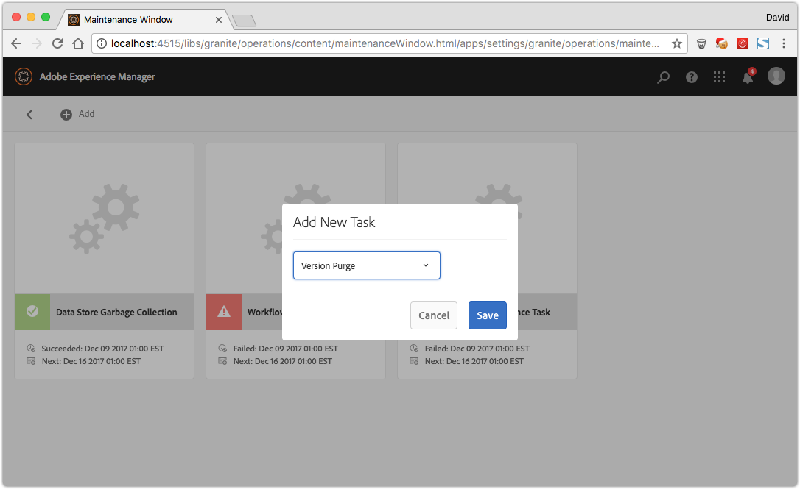

# Painel de operações {#operations-dashboard}

## Introdução {#introduction}

O Painel de operações no AEM 6 ajuda os operadores do sistema a monitorar rapidamente a integridade do sistema AEM. Ele também fornece informações de diagnóstico geradas automaticamente sobre aspectos relevantes do AEM e permite configurar e executar automação de manutenção independente para reduzir significativamente as operações do projeto e os casos de suporte. O Painel de operações pode ser estendido com verificações de integridade personalizadas e tarefas de manutenção. Além disso, os dados do Painel de operações podem ser acessados a partir de ferramentas de monitoramento externas por meio do JMX.

**O Painel de Operações:**

* É um status de sistema com um clique para ajudar os departamentos de operações a ganhar eficiência
* Fornece uma visão geral da integridade do sistema em um local único e centralizado
* Reduz o tempo para localizar, analisar e corrigir problemas
* Oferece automação de manutenção autossuficiente que ajuda a reduzir significativamente os custos operacionais do projeto

Ele pode ser acessado indo até **Ferramentas** - **Operações** na tela de boas-vindas AEM.

>[!NOTE]
>
>Para acessar o Painel de operações, o usuário conectado deve fazer parte do grupo de usuários &quot;Operadores&quot;. Para obter mais informações, consulte a documentação em [Administração de usuários, grupos e direitos de acesso](/help/sites-administering/user-group-ac-admin.md).

## Relatórios de integridade {#health-reports}

O sistema de Relatório de integridade fornece informações sobre a integridade de uma instância do AEM por meio das Verificações de integridade do Sling. Você executa essa operação por meio de solicitações OSGI, JMX, HTTP (por meio de JSON) ou pela interface para toque. Ele oferece medidas e limite de determinados contadores configuráveis e, às vezes, oferece informações sobre como resolver o problema.

Ele tem vários recursos, descritos abaixo.

## Verificações de integridade {#health-checks}

A variável **Relatórios de integridade** são um sistema de cartões que indica bom ou mau funcionamento de uma área específica do produto. Esses cartões são visualizações das Verificações de integridade do Sling, que agregam dados de JMX e outras fontes e expõem as informações processadas novamente como MBeans. Esses MBeans também podem ser inspecionados no [Console Web JMX](/help/sites-administering/jmx-console.md), no âmbito do **org.apache.sling.health check** domínio.

A interface de Relatórios de integridade pode ser acessada por meio da **Ferramentas** - **Operações** - **Relatórios de integridade** na tela de boas-vindas do AEM ou diretamente pelo seguinte URL:

`https://<serveraddress>:port/libs/granite/operations/content/healthreports/healthreportlist.html`


O sistema de placa expõe três estados possíveis: **OK**, **AVISO** e **CRÍTICO**. Os estados são resultado de regras e limites, que podem ser configurados ao passar o mouse sobre o cartão e clicar no ícone de engrenagem na barra de ação:


### Tipos de verificação de integridade {#health-check-types}

Há dois tipos de verificações de integridade no AEM 6:

1. Verificações de integridade individuais
1. Verificações de integridade do composto

Um **Verificação de integridade individual** O é uma única verificação de integridade que corresponde a um cartão de status. As Verificações de integridade individuais podem ser configuradas com regras ou limites, e podem fornecer uma ou mais dicas e links para resolver problemas de integridade identificados. Vamos ver a verificação &quot;Erros de log&quot; como exemplo: se houver entradas ERRO nos logs de instância, localize-as na página de detalhes da verificação de integridade. Na parte superior da página, você pode ver um link para o analisador &quot;Mensagem de log&quot; na seção Ferramentas de diagnóstico, que permite analisar esses erros com mais detalhes e reconfigurar os registradores.

A **Verificação de integridade do composto** é uma verificação que agrega informações de várias verificações individuais.

As verificações de integridade compostas são configuradas com a ajuda de **filtrar tags**. Basicamente, todas as verificações únicas que têm a mesma tag de filtro são agrupadas como uma verificação de integridade composta. Uma Verificação de integridade composta terá um status OK somente se todas as verificações únicas agregadas também tiverem status OK.

### Como criar verificações de integridade {#how-to-create-health-checks}

No Painel de operações, é possível visualizar o resultado das verificações de integridade individuais e compostas.

### Criação de uma verificação de integridade individual {#creating-an-individual-health-check}

A criação de uma verificação de integridade individual envolve duas etapas: implementar uma verificação de integridade do Sling e adicionar uma entrada para a verificação de integridade nos nós de configuração do painel.

1. Para criar uma verificação de integridade do Sling, crie um componente OSGI que implemente a interface Sling HealthCheck. Adicione este componente dentro de um pacote. As propriedades do componente identificam completamente a Verificação de integridade. Após a instalação do componente, um MBean JMX é criado automaticamente para a verificação de integridade. Consulte a [Documentação de verificação de integridade do Sling](https://sling.apache.org/documentation/bundles/sling-health-check-tool.html) para obter mais informações.

   Exemplo de um componente de Verificação de integridade do Sling, gravado com anotações de componente de serviço OSGI:

   ```java
   @Component(service = HealthCheck.class,
   property = {
       HealthCheck.NAME + "=Example Check",
       HealthCheck.TAGS + "=example",
       HealthCheck.TAGS + "=test",
       HealthCheck.MBEAN_NAME + "=exampleHealthCheckMBean"
   })
    public class ExampleHealthCheck implements HealthCheck {
       @Override
       public Result execute() {
           // health check code
       }
    }
   ```

   >[!NOTE]
   >
   >A variável `MBEAN_NAME` define o nome do mbean gerado para esta verificação de integridade.

1. Depois de criar uma verificação de integridade, um novo nó de configuração deve ser criado para torná-lo acessível na interface do Painel de operações. Para esta etapa, é necessário saber o nome do Mbean JMX da Verificação de integridade (o `MBEAN_NAME` propriedade). Para criar uma configuração para a Verificação de integridade, abra o CRXDE e adicione um nó (do tipo **nt:não estruturado**) no seguinte caminho: `/apps/settings/granite/operations/hc`

   As seguintes propriedades devem ser definidas no novo nó:

   * **Nome:** `sling:resourceType`

      * **Tipo:** `String`
      * **Valor:** `granite/operations/components/mbean`

   * **Nome:** `resource`

      * **Tipo:** `String`
      * **Valor:** `/system/sling/monitoring/mbeans/org/apache/sling/healthcheck/HealthCheck/exampleHealthCheck`

   >[!NOTE]
   >
   >O caminho do recurso acima é criado da seguinte maneira: se o nome do mbean da sua verificação de integridade for &quot;teste&quot;, adicione &quot;teste&quot; ao final do caminho `/system/sling/monitoring/mbeans/org/apache/sling/healthcheck/HealthCheck`
   >
   >Portanto, o caminho final é o seguinte:
   >
   >`/system/sling/monitoring/mbeans/org/apache/sling/healthcheck/HealthCheck/test`

   >[!NOTE]
   >
   >Certifique-se de que a variável `/apps/settings/granite/operations/hc` o caminho tem as seguintes propriedades definidas como true:
   >
   >
   >`sling:configCollectionInherit`
   >
   >`sling:configPropertyInherit`
   >
   >
   >Esse processo informa ao gerenciador de configurações para mesclar as novas configurações com as existentes do `/libs`.

### Criação de uma verificação de integridade composta {#creating-a-composite-health-check}

A função de uma Verificação de integridade composta é agregar várias Verificações de integridade individuais que compartilham um conjunto de recursos comuns. Por exemplo, a Verificação de integridade do composto de segurança agrupa todas as verificações de integridade individuais que executam verificações relacionadas à segurança. A primeira etapa para criar uma verificação composta é adicionar uma configuração OSGI. Para que seja exibido no Painel de operações, um novo nó de configuração deve ser adicionado da mesma forma que uma verificação simples.

1. Vá para o Gerenciador de configuração da Web no Console OSGI. Access `https://serveraddress:port/system/console/configMgr`
1. Procure a entrada chamada **Verificação de integridade do Apache Sling Composite**. Depois de localizá-la, observe que há duas configurações já disponíveis: uma para as Verificações de sistema e outra para as Verificações de segurança.
1. Crie uma configuração pressionando o botão &quot;+&quot; no lado direito da configuração. Uma nova janela é exibida, conforme mostrado abaixo:

   

1. Crie uma configuração e salve-a. Um Mbean é criado com a nova configuração.

   A finalidade de cada propriedade de configuração é a seguinte:

   * **Nome (hc.name):** O nome da Verificação de integridade do composto. Recomenda-se um nome significativo.
   * **Tags (hc.tags):** As tags desta verificação de integridade. Se esta verificação de integridade composta tiver que fazer parte de outra verificação de integridade composta (como em uma hierarquia de verificações de integridade), adicione as tags às quais este composto está relacionado.
   * **Nome do MBean (hc.mbean.name):** O nome do Mbean que é fornecido ao MBean JMX desta verificação de integridade composta.
   * **Tags de filtro (filter.tags):** A propriedade específica das verificações de integridade do composto. Essas tags são agregadas pelo composto. A verificação de integridade do composto agrega em seu grupo todas as verificações de integridade que têm qualquer tag correspondente a qualquer uma das tags de filtro deste composto. Por exemplo, uma verificação de integridade composta com as tags de filtro **test** e **check**, agrega todas as verificações de integridade individuais e compostas que têm qualquer uma das **test** e **check** tags na propriedade tags ( `hc.tags`).

   >[!NOTE]
   >
   >Um novo Mbean JMX é criado para cada nova configuração da verificação de integridade do Apache Sling Composite.**

1. Por fim, a entrada da verificação de integridade do composto que foi criada deve ser adicionada nos nós de configuração do Painel de operações. O procedimento é o mesmo das verificações de integridade individuais: um nó do tipo **nt:não estruturado** deve ser criado em `/apps/settings/granite/operations/hc`. A propriedade resource do nó é definida pelo valor de **hc.medium.name** na configuração OSGI.

   Por exemplo, se você criou uma configuração e definiu o **hc.mbean.name** valor para **diskusage**, os nós de configuração são semelhantes ao seguinte:

   * **Nome:** `Composite Health Check`

      * **Tipo:** `nt:unstructured`

   Com as seguintes propriedades:

   * **Nome:** `sling:resourceType`

      * **Tipo:** `String`
      * **Valor:** `granite/operations/components/mbean`

   * **Nome:** `resource`

      * **Tipo:** `String`
      * **Valor:** `/system/sling/monitoring/mbeans/org/apache/sling/healthcheck/HealthCheck/diskusage`

   >[!NOTE]
   >
   >Se você criar verificações de integridade individuais que pertencem logicamente a uma verificação composta que já está presente no Dashboard por padrão, elas serão automaticamente capturadas e agrupadas na respectiva verificação composta. Dessa forma, não há necessidade de criar um nó de configuração para essas verificações.
   >
   >Por exemplo, se você criar uma verificação de integridade de segurança individual, atribua a ela a função &quot;**segurança**&quot; e ele será instalado. Ele aparece automaticamente na verificação composta Verificações de segurança no Painel de operações.

### Verificações de integridade fornecidas com AEM {#health-checks-provided-with-aem}

<table>
 <tbody>
  <tr>
   <td><strong>Nome zHealthcheck</strong></td>
   <td><strong>Descrição</strong></td>
  </tr>
  <tr>
   <td>Desempenho da consulta</td>
   <td><p>Esta verificação de integridade foi simplificada <strong>no AEM 6.4</strong>e agora verifica o cenário refatorado recentemente <code>Oak QueryStats</code> MBean, mais especificamente o <code>SlowQueries </code>atributo. Se as estatísticas contiverem consultas lentas, a verificação de integridade retornará um aviso. Caso contrário, retornará o status OK.<br /> </p> <p>O MBean para esta verificação de integridade é <a href="http://localhost:4502/system/console/jmx/org.apache.sling.healthcheck%3Aname%3DqueriesStatus%2Ctype%3DHealthCheck">org.apache.sling.healthcheck:name=queriesStatus,type=HealthCheck</a>.</p> </td>
  </tr>
  <tr>
   <td>Comprimento da fila de observação</td>
   <td><p>O Comprimento da fila de observação repete todos os Ouvintes de eventos e Observadores de segundo plano; compara seus <code>queueSize </code>aos seus <code>maxQueueSize</code> e:</p>
    <ul>
     <li>retorna o status Crítico se a variável <code>queueSize</code> o valor excede o <code>maxQueueSize</code> valor (isto é, quando os eventos seriam descartados)</li>
     <li>retorna um Aviso se a variável <code>queueSize</code> o valor está acima de <code>maxQueueSize * WARN_THRESHOLD</code> (o valor padrão é 0,75) </li>
    </ul> <p>O comprimento máximo de cada fila vem de configurações separadas (Oak e AEM) e não pode ser configurado nesta verificação de integridade. O MBean para esta verificação de integridade é <a href="http://localhost:4502/system/console/jmx/org.apache.sling.healthcheck%3Aname%3DObservationQueueLengthHealthCheck%2Ctype%3DHealthCheck">org.apache.sling.healthcheck:name=ObservationQueueLengthHealthCheck,type=HealthCheck</a>.</p> </td>
  </tr>
  <tr>
   <td>Limites de cruzamento da consulta</td>
   <td><p>Limites de cruzamento de consulta verifica a <code>QueryEngineSettings</code> MBean, mais especificamente o <code>LimitInMemory</code> e <code>LimitReads</code> atributos, e retorna o seguinte status:</p>
    <ul>
     <li>retorna o status de Aviso se um dos limites for igual ou superior a <code>Integer.MAX_VALUE</code></li>
     <li>retorna o status Aviso se um dos limites for inferior a 10000 (a configuração recomendada do Oak)</li>
     <li>retorna o status Crítico se a variável <code>QueryEngineSettings</code> ou qualquer um dos limites não pode ser recuperado</li>
    </ul> <p>O Mbean para esta verificação de integridade é <a href="http://localhost:4502/system/console/jmx/org.apache.sling.healthcheck%3Aname%3DqueryTraversalLimitsBundle%2Ctype%3DHealthCheck">org.apache.sling.healthcheck:name=queryTraversalLimitsBundle,type=HealthCheck</a>.</p> </td>
  </tr>
  <tr>
   <td>Relógios sincronizados</td>
   <td><p>Essa verificação é relevante somente para <a href="https://github.com/apache/sling-old-svn-mirror/blob/4df9ab2d6592422889c71fa13afd453a10a5a626/bundles/extensions/discovery/oak/src/main/java/org/apache/sling/discovery/oak/SynchronizedClocksHealthCheck.java">clusters do document nodestore</a>. Ele retorna o seguinte status:</p>
    <ul>
     <li>retorna o status Aviso quando os relógios da instância saem de sincronia e ultrapassam um limite baixo predefinido</li>
     <li>retorna o status Crítico quando os relógios da instância saem de sincronia e ultrapassam um limite alto predefinido</li>
    </ul> <p>O Mbean para esta verificação de integridade é <a href="http://localhost:4502/system/console/jmx/org.apache.sling.healthcheck%3Aname%3DslingDiscoveryOakSynchronizedClocks%2Ctype%3DHealthCheck">org.apache.sling.healthcheck:name=slingDiscoveryOakSynchronizedClocks,type=HealthCheck</a>.</p> </td>
  </tr>
  <tr>
   <td>Índices assíncronos</td>
   <td><p>A verificação de Índices assíncronos:</p>
    <ul>
     <li>retorna um status Crítico se pelo menos uma via de indexação estiver falhando</li>
     <li>verifica a <code>lastIndexedTime</code> para todas as faixas de indexação e:
      <ul>
       <li>retorna um status Crítico se houver mais de 2 horas atrás </li>
       <li>retorna um status de Aviso se estiver entre 2 horas e 45 minutos atrás </li>
       <li>retorna um status OK se houver menos de 45 minutos atrás </li>
      </ul> </li>
     <li>se nenhuma dessas condições for atendida, retornará o status OK</li>
    </ul> <p>Os limites de status Crítico e Aviso são configuráveis. O Mbean para esta verificação de integridade é <a href="http://localhost:4502/system/console/jmx/org.apache.sling.healthcheck%3Aname%3DasyncIndexHealthCheck%2Ctype%3DHealthCheck">org.apache.sling.healthCheck:name=asyncIndexHealthCheck,type=HealthCheck</a>.</p> <p><strong>Nota: </strong>Esta verificação de integridade está disponível com AEM 6.4 e foi revertida para AEM 6.3.0.1.</p> </td>
  </tr>
  <tr>
   <td>Índices Lucene grandes</td>
   <td><p>Essa verificação usa os dados expostos pela variável <code>Lucene Index Statistics</code> MBean para identificar índices e retornos grandes:</p>
    <ul>
     <li>um Status de aviso se houver um índice com mais de 1 bilhão de documentos</li>
     <li>um Status crítico se houver um índice com mais de 1,5 bilhão de documentos</li>
    </ul> <p>Os limites podem ser configurados e o MBean para a verificação de integridade é <a href="http://localhost:4502/system/console/jmx/org.apache.sling.healthcheck%3Aname%3DlargeIndexHealthCheck%2Ctype%3DHealthCheck">org.apache.sling.healthcheck:name=largeIndexHealthCheck,type=HealthCheck.</a></p> <p><strong>Nota: </strong>Essa verificação está disponível com AEM 6.4 e foi revertida para AEM 6.3.2.0.</p> </td>
  </tr>
  <tr>
   <td>Manutenção do sistema</td>
   <td><p>A Manutenção do Sistema é uma verificação composta que retorna o OK se todas as tarefas de manutenção estiverem sendo executadas como configuradas. Lembre-se:</p>
    <ul>
     <li>cada tarefa de manutenção é acompanhada por uma verificação de integridade associada</li>
     <li>se uma tarefa não for adicionada a uma janela de manutenção, sua verificação de integridade retornará Critical</li>
     <li>configure as tarefas de manutenção Audit Log e Workflow Purge ou remova-as das janelas de manutenção. Se não configuradas, essas tarefas falharão na primeira tentativa de execução, portanto, a verificação de Manutenção do sistema retornará o status Crítico.</li>
     <li><strong>Com AEM 6.4</strong>Além disso, é também verificada a <a href="/help/sites-administering/operations-dashboard.md#automated-maintenance-tasks">Manutenção de binários do Lucene</a> tarefa</li>
     <li>no AEM 6.2 e inferior, a verificação de manutenção do sistema retorna um status de Aviso logo após a inicialização porque as tarefas nunca são executadas. A partir do 6.3, eles retornarão OK se a primeira janela de manutenção ainda não tiver sido atingida.</li>
    </ul> <p>O MBean para esta verificação de integridade é <a href="http://localhost:4502/system/console/jmx/org.apache.sling.healthcheck%3Aname%3Dsystemchecks%2Ctype%3DHealthCheck">org.apache.sling.healthcheck:name=systemcheck,type=HealthCheck</a>.</p> </td>
  </tr>
  <tr>
   <td>Fila de replicação</td>
   <td><p>Essa verificação repete os agentes de replicação e observa suas filas. Para o item na parte superior da fila, a verificação verifica quantas vezes o agente repetiu a replicação. Se o agente repetiu a replicação mais do que o valor de <code>numberOfRetriesAllowed</code> parâmetro, retorna um aviso. A variável <code>numberOfRetriesAllowed</code> parâmetro é configurável. </p> <p>O MBean para esta verificação de integridade é <a href="http://localhost:4502/system/console/jmx/org.apache.sling.healthcheck%3Aname%3DreplicationQueue%2Ctype%3DHealthCheck" target="_blank">org.apache.sling.healthcheck:name=replicationQueue,type=HealthCheck</a>.</p> </td>
  </tr>
  <tr>
   <td>Sling Jobs</td>
   <td>
    <div>
      O Sling Jobs verifica o número de trabalhos em fila no JobManager, compara-o com o
     <code>maxNumQueueJobs</code> limite e:
    </div>
    <ul>
     <li>retorna uma Critical se for maior que <code>maxNumQueueJobs</code> estão na fila</li>
     <li>retorna Crítico se houver jobs ativos de longa duração com mais de 1 hora</li>
     <li>retorna Crítico se houver jobs enfileirados e a última hora do job concluído tiver mais de 1 hora</li>
    </ul> <p>Somente o parâmetro de número máximo de tarefas em fila é configurável e tem o valor padrão de 1000.</p> <p>O MBean para esta verificação de integridade é <a href="http://localhost:4502/system/console/jmx/org.apache.sling.healthcheck%3Aname%3DslingJobs%2Ctype%3DHealthCheck" target="_blank">org.apache.sling.healthCheck:name=slingJobs,type=HealthCheck</a>.</p> </td>
  </tr>
  <tr>
   <td>Desempenho da solicitação</td>
   <td><p>Esta verificação analisa a <code>granite.request.metrics.timer</code> <a href="http://localhost:4502/system/console/slingmetrics" target="_blank">Métrica Sling </a>e:</p>
    <ul>
     <li>retorna Crítico se o valor do percentil 75 estiver acima do limite crítico (o valor padrão é 500 milissegundos)</li>
     <li>retorna um Aviso se o valor do percentil 75 estiver acima do limite de aviso (o valor padrão é 200 milissegundos)</li>
    </ul> <p>O MBean para esta verificação de integridade é<em> </em><a href="http://localhost:4502/system/console/jmx/org.apache.sling.healthcheck%3Aname%3DrequestsStatus%2Ctype%3DHealthCheck" target="_blank">org.apache.sling.healthcheck:name=requestsStatus,type=HealthCheck</a>.</p> </td>
  </tr>
  <tr>
   <td>Erros de log</td>
   <td><p>Essa verificação retorna o status Aviso se houver erros no log.</p> <p>O MBean para esta verificação de integridade é <a href="http://localhost:4502/system/console/jmx/org.apache.sling.healthcheck%3Aname%3DlogErrorHealthCheck%2Ctype%3DHealthCheck" target="_blank">org.apache.sling.healthCheck:name=logErrorHealthCheck,type=HealthCheck</a>.</p> </td>
  </tr>
  <tr>
   <td>Espaço de disco</td>
   <td><p>A verificação do Espaço em disco examina o <code>FileStoreStats</code> MBean, recupera o tamanho do Armazenamento de nós e a quantidade de espaço em disco utilizável na partição do Armazenamento de nós e:</p>
    <ul>
     <li>retorna um Aviso se a relação entre o espaço de uso em disco e o tamanho do repositório for menor que o limite de aviso (o valor default é 10)</li>
     <li>retorna Crítico se a relação entre o espaço de uso em disco e o tamanho do repositório for menor que o limite crítico (o valor default é 2)</li>
    </ul> <p>Ambos os limites são configuráveis. A verificação só funciona em instâncias com um Repositório de segmentos.</p> <p>O MBean para esta verificação de integridade é <a href="http://localhost:4502/system/console/jmx/org.apache.sling.healthcheck%3Aname%3DDiskSpaceHealthCheck%2Ctype%3DHealthCheck" target="_blank">org.apache.sling.healthCheck:name=DiskSpaceHealthCheck,type=HealthCheck</a>.</p> </td>
  </tr>
  <tr>
   <td>Verificação de integridade do assistente de agendamento</td>
   <td><p>Essa verificação retorna um aviso se a instância tiver trabalhos do Quartz em execução por mais de 60 segundos. O limite de duração aceitável é configurável.</p> <p>O MBean para esta verificação de integridade é <a href="http://localhost:4502/system/console/jmx/org.apache.sling.healthcheck%3Aname%3DslingCommonsSchedulerHealthCheck%2Ctype%3DHealthCheck" target="_blank">org.apache.sling.healthCheck:name=slingCommonsSchedulerHealthCheck,type=HealthCheck</a><em>.</em></p> </td>
  </tr>
  <tr>
   <td>Verificações de segurança</td>
   <td><p>A verificação de segurança é um composto que agrega os resultados de várias verificações relacionadas à segurança. Essas verificações de integridade individuais abordam questões diferentes da lista de verificação de segurança disponível na <a href="/help/sites-administering/security-checklist.md">Página da documentação da Lista de verificação de segurança.</a> A verificação é útil como um teste de fumaça de segurança quando a instância é iniciada. </p> <p>O MBean para esta verificação de integridade é <a href="http://localhost:4502/system/console/jmx/org.apache.sling.healthcheck%3Aname%3Dsecuritychecks%2Ctype%3DHealthCheck" target="_blank">org.apache.sling.healthcheck:name=securitycheck,type=HealthCheck</a></p> </td>
  </tr>
  <tr>
   <td>Grupos ativos</td>
   <td><p>Grupos ativos verifica o estado de todos os pacotes e:</p>
    <ul>
     <li>retorna o status Aviso se qualquer um dos pacotes não estiver ativo ou (iniciando, com ativação lenta)</li>
     <li>ignora o status dos pacotes na lista de itens a serem ignorados</li>
    </ul> <p>O parâmetro ignore list pode ser configurado.</p> <p>O MBean para esta verificação de integridade é <a href="http://localhost:4502/system/console/jmx/org.apache.sling.healthcheck%3Aname%3DinactiveBundles%2Ctype%3DHealthCheck" target="_blank">org.apache.sling.healthcheck:name=inativeBundles,type=HealthCheck</a>.</p> </td>
  </tr>
  <tr>
   <td>Verificação de Code Cache</td>
   <td><p>Uma verificação de integridade que verifica várias condições JVM que podem acionar um bug de CodeCache presente no Java™ 7:</p>
    <ul>
     <li>retorna um Aviso se a instância estiver em execução no Java™ 7, com a limpeza do Code Cache ativada</li>
     <li>retorna um Aviso se a instância estiver em execução no Java™ 7 e o tamanho do Cache de código reservado for menor que um limite mínimo (o valor padrão é 90 MB)</li>
    </ul> <p>A variável <code>minimum.code.cache.size</code> o limite é configurável. Para obter mais informações sobre o bug, consulte <a href="https://bugs.java.com/bugdatabase/"> e pesquise na ID de bug 8012547</a>.</p> <p>O MBean para esta verificação de integridade é <a href="http://localhost:4502/system/console/jmx/org.apache.sling.healthcheck%3Aname%3DcodeCacheHealthCheck%2Ctype%3DHealthCheck" target="_blank">org.apache.sling.healthcheck:name=codeCacheHealthCheck,type=HealthCheck</a>.</p> </td>
  </tr>
  <tr>
   <td>Recurso Buscar erros de caminho</td>
   <td><p>Verifica se há recursos no caminho <code>/apps/foundation/components/primary</code> e:</p>
    <ul>
     <li>retorna um Aviso se houver nós filhos em <code>/apps/foundation/components/primary</code></li>
    </ul> <p>O MBean para esta verificação de integridade é <a href="http://localhost:4502/system/console/jmx/org.apache.sling.healthcheck%3Aname%3DresourceSearchPathErrorHealthCheck%2Ctype%3DHealthCheck" target="_blank">org.apache.sling.healthCheck:name=resourceSearchPathErrorHealthCheck,type=HealthCheck</a>.</p> </td>
  </tr>
 </tbody>
</table>

### Configuração de verificação de integridade {#health-check-configuration}

Por padrão, para uma instância de AEM pronta para uso, as verificações de integridade são executadas a cada 60 segundos.

Você pode configurar o **Período** com o [Configuração OSGi](/help/sites-deploying/configuring-osgi.md) **Configuração de verificação de integridade da consulta** (com.adobe.granite.queries.impl.hc.QueryHealthCheckMetrics).

## Monitoramento com o Nagios {#monitoring-with-nagios}

O Painel de verificação de integridade pode se integrar ao Nagios por meio dos Mbeans Granite JMX. O exemplo abaixo ilustra como adicionar uma verificação que mostra a memória usada no servidor que executa o AEM.

1. Configure e instale o Nagios no servidor de monitoramento.
1. Em seguida, instale o NRPE (Nagios Remote Plugin Executor).

   >[!NOTE]
   >
   >Para obter mais informações sobre como instalar o Nagios e o NRPE em seu sistema, consulte o [Documentação do Nagios](https://library.nagios.com/library/products/nagios-core/manuals//).

1. Adicione uma definição de host para o servidor AEM. Você pode realizar essa tarefa por meio da interface da Web do Nagios XI, usando o Gerenciador de configurações:

   1. Abra um navegador e aponte para o servidor Nagios.
   1. Pressione a **Configurar** no menu superior.
   1. No painel esquerdo, pressione a tecla **Gerenciador de configuração principal** em **Configuração avançada**.
   1. Pressione a **Hosts** no link **Monitoramento** seção.
   1. Adicione a definição do host:

   

   Abaixo está um exemplo de um arquivo de configuração de host, caso você esteja usando o Nagios Core:

   ```xml
   define host {
      address 192.168.0.5
      max_check_attempts 3
      check_period 24x7
      check-command check-host-alive
      contacts admin
      notification_interval 60
      notification_period 24x7
   }
   ```

1. Instale o Nagios e o NRPE no servidor AEM.
1. Instale o [check_http_json](https://github.com/phrawzty/check_http_json) em ambos os servidores.
1. Defina um comando de verificação JSON genérico em ambos os servidores:

   ```xml
   define command{
   
       command_name    check_http_json-int
   
       command_line    /usr/lib/nagios/plugins/check_http_json --user "$ARG1$" --pass "$ARG2$" -u 'https://$HOSTNAME$:$ARG3$/$ARG4$' -e '$ARG5$' -w '$ARG6$' -c '$ARG7$'
   
   }
   ```

1. Adicionar um serviço para memória usada no servidor AEM:

   ```xml
   define service {
   
       use generic-service
   
       host_name my.remote.host
   
       service_description AEM Author Used Memory
   
       check_command  check_http_json-int!<cq-user>!<cq-password>!<cq-port>!system/sling/monitoring/mbeans/java/lang/Memory.infinity.json!{noname}.mbean:attributes.HeapMemoryUsage.mbean:attributes.used.mbean:value!<warn-threshold-in-bytes>!<critical-threshold-in-bytes>
   
       }
   ```

1. Verifique no painel do Nagios o serviço recém-criado:

   

## Ferramentas de diagnóstico {#diagnosis-tools}

O Painel de operação também fornece acesso às Ferramentas de diagnóstico que podem ajudar a encontrar e solucionar as causas raiz dos avisos provenientes do Painel de verificação de integridade e fornecer informações de depuração importantes para os operadores do sistema.

Entre suas características mais importantes estão:

* Um analisador de mensagens de registro
* A capacidade de acessar despejos de heap e thread
* Solicitações e analisadores de desempenho de consulta

Para acessar a tela Ferramentas de diagnóstico, acesse **Ferramentas - Operações - Diagnóstico** na tela de boas-vindas AEM. Você também pode acessar a tela acessando diretamente o seguinte URL: `https://serveraddress:port/libs/granite/operations/content/diagnosis.html`


### Mensagens de registro {#log-messages}

A interface do usuário de mensagens de log exibe todas as mensagens de ERRO por padrão. Se quiser que mais mensagens de log sejam exibidas, configure um agente de log com o nível de log apropriado.

As mensagens de log usam um anexador de log na memória e, portanto, não estão relacionadas aos arquivos de log. Outra consequência é que alterar os níveis de log nesta interface não altera as informações registradas nos arquivos de log tradicionais. A adição e remoção de registradores nesta interface afeta somente o registrador de memória. Além disso, a alteração das configurações do agente de log é refletida no futuro do agente de log na memória. As entradas que já estão registradas e não são mais relevantes não são excluídas, mas entradas semelhantes não são registradas no futuro.

Você pode definir o que é registrado fornecendo configurações do registrador no botão de engrenagem superior esquerdo na interface do usuário. Você pode adicionar, remover ou atualizar configurações do agente de log. Uma configuração de agente de log é composta de um **nível de log** (AVISO / INFORMAÇÕES / DEPURAÇÃO) e um **nome do filtro**. A variável **nome do filtro** tem a função de filtrar a origem das mensagens de log registradas. Como alternativa, se um agente de log deve capturar todas as mensagens de log para o nível especificado, o nome do filtro deve ser &quot;**raiz**&quot;. Definir o nível de um agente aciona a captura de todas as mensagens com um nível igual ou superior ao especificado.

Exemplos:

* Se você planeja capturar todas as **ERRO** mensagens - nenhuma configuração é necessária. Todas as mensagens de ERRO são capturadas por padrão.
* Se você planeja capturar todas as **ERRO**, **AVISO** e **INFORMAÇÕES** messages - o nome do agente de log deve ser definido como: &quot;**raiz**&quot; e o nível do agente de log para: **INFORMAÇÕES**.

* Se você quiser capturar todas as mensagens provenientes de um determinado pacote (por exemplo, com.adobe.granite), o nome do agente de log deverá ser definido como: &quot;com.adobe.granite&quot;. E o nível do agente de log definido como: **DEPURAR** (isso captura todas as **ERRO**, **AVISO**, **INFORMAÇÕES**, e **DEPURAR** conforme mostrado na imagem abaixo.


>[!NOTE]
>
>Não é possível definir um nome de agente de log para capturar apenas mensagens ERROR por meio de um filtro especificado. Por padrão, todas as mensagens de ERRO são capturadas.

>[!NOTE]
>
>A interface do usuário de mensagens de log não reflete o log de erros real. A menos que esteja configurando outros tipos de mensagens de log na interface do usuário do, você verá somente mensagens de ERRO. Para saber como exibir mensagens de log específicas, consulte as instruções acima.

>[!NOTE]
>
>As configurações na página de diagnóstico não influenciam o que é registrado nos arquivos de log e vice-versa. Portanto, embora o log de erros capture mensagens INFO, você pode não vê-las na interface do usuário de mensagens de log. Além disso, por meio da interface do usuário, é possível capturar mensagens DEBUG de determinados pacotes sem afetar o log de erros. Para obter mais informações sobre como configurar os arquivos de log, consulte [Logs](/help/sites-deploying/configure-logging.md).

>[!NOTE]
>
>**Com AEM 6.4**, as tarefas de manutenção são desconectadas da caixa em um formato mais avançado de informações no nível INFO. Esse workflow permite uma melhor visibilidade do estado das tarefas de manutenção.
>
>Caso você esteja usando ferramentas de terceiros (como o Splunk) para monitorar e reagir à atividade da tarefa de manutenção, é possível usar as seguintes instruções de log:

```
Log level: INFO
DATE+TIME [MaintanceLogger] Name=<MT_NAME>, Status=<MT_STATUS>, Time=<MT_TIME>, Error=<MT_ERROR>, Details=<MT_DETAILS>
```

### Desempenho da solicitação {#request-performance}

A página Desempenho da solicitação permite a análise das solicitações de página mais lentas processadas. Somente as solicitações de conteúdo são registradas nesta página. Mais especificamente, as seguintes solicitações são capturadas:

1. Solicitações de acesso a recursos em `/content`
1. Solicitações de acesso a recursos em `/etc/design`
1. Solicitações com o `".html"` extensão


A página é exibida:

* A hora em que a solicitação foi feita
* O URL e o método de solicitação
* A duração em milissegundos

Por padrão, as 20 solicitações de página mais lentas são capturadas, mas o limite pode ser modificado no Configuration Manager.

### Desempenho da consulta {#query-performance}

A página Desempenho da consulta permite a análise das consultas mais lentas executadas pelo sistema. Essas informações são fornecidas pelo repositório em um Mbean JMX. Em Jackrabbit, o `com.adobe.granite.QueryStat` O JMX Mbean fornece estas informações, enquanto no repositório Oak, ele é oferecido por `org.apache.jackrabbit.oak.QueryStats.`

A página é exibida:

* A hora em que a consulta foi feita
* O idioma da consulta
* O número de vezes que a consulta foi emitida
* A instrução da consulta
* A duração em milissegundos


### Explicar consulta {#explain-query}

Para qualquer consulta, o Oak tenta descobrir a melhor maneira de executar com base nos índices Oak definidos no repositório no **oak:índice** nó. Dependendo da consulta, índices diferentes podem ser escolhidos pelo Oak. Entender como o Oak está executando uma consulta é a primeira etapa para otimizar a consulta.

A Explicar consulta é uma ferramenta que explica como o Oak está executando uma consulta. Ele pode ser acessado indo até **Ferramentas - Operações - Diagnóstico** na tela de boas-vindas do AEM. Em seguida, clique em **Desempenho da consulta** e mude para o **Explicar consulta** guia.

**Recursos**

* Suporta as linguagens de consulta Xpath, JCR-SQL e JCR-SQL2
* Relata o tempo de execução real da consulta fornecida
* Detecta consultas lentas e avisa sobre consultas que podem ser potencialmente lentas
* Relata o índice Oak usado para executar a consulta
* Exibe a explicação real do mecanismo de consulta Oak
* Fornece uma lista de cliques para carregar consultas lentas e populares

Depois de entrar na interface de Explicar consulta, insira a consulta e pressione a tecla **Explicar** botão:


A primeira entrada na seção Explicação da Consulta é a explicação real. A explicação mostra o tipo de índice usado para executar a consulta.

A segunda entrada é o plano de execução.

Marcar a variável **Incluir tempo de execução** antes da execução da consulta também mostra o tempo em que a consulta foi executada. A variável **Incluir contagem de nós** opção relata a contagem de nós. O relatório permite obter mais informações que podem ser usadas para otimizar os índices do seu aplicativo ou implantação.


### O gerenciador de índice {#the-index-manager}

A finalidade do Gerenciador de índice é facilitar o gerenciamento de índice, como manter índices ou exibir seu status.

Ele pode ser acessado indo até **Ferramentas - Operações - Diagnóstico **na Tela de boas-vindas e clicando no link **Gerenciador de índice** botão.

Ele também pode ser acessado diretamente neste URL: `https://serveraddress:port/libs/granite/operations/content/diagnosistools/indexManager.html`


A interface pode ser usada para filtrar índices na tabela digitando os critérios de filtro na caixa de pesquisa no canto superior esquerdo da tela.

### Baixar o ZIP de status {#download-status-zip}

Essa ação aciona o download de um zip que contém informações úteis sobre o status e a configuração do sistema. O arquivo contém configurações de instância, uma lista de pacotes, OSGI, métricas e estatísticas do Sling, que podem resultar em um arquivo grande. Você pode reduzir o impacto de arquivos de status grandes usando o **Fazer download do ZIP de status** janela. A janela pode ser acessada de:**AEM > Ferramentas > Operações > Diagnóstico > Baixar o ZIP de status.**

Nessa janela, você pode selecionar o que exportar (arquivos de log e/ou despejos de thread) e o número de dias dos logs incluídos no download em relação à data atual.


### Baixar o despejo de encadeamento {#download-thread-dump}

Essa ação aciona o download de um zip que contém informações sobre as threads presentes no sistema. As informações sobre cada thread são fornecidas, como seu status, o carregador de classe e o rastreamento de pilha.

### Baixar o despejo da pilha {#download-heap-dump}

É possível baixar um instantâneo do heap para analisá-lo posteriormente. Essa ação aciona o download de um arquivo grande (centenas de megabytes).

## Tarefas de manutenção automatizada {#automated-maintenance-tasks}

A página Tarefas de manutenção automatizada é um local onde você pode visualizar e rastrear tarefas de manutenção recomendadas programadas para execução periódica. As tarefas são integradas ao sistema de Verificação de integridade. As tarefas também podem ser executadas manualmente na interface.

Para acessar a página de Manutenção no Painel de Operações, na tela de Boas-vindas do AEM, acesse **Ferramentas - Operações - Painel - Manutenção** ou siga diretamente este link:

`https://serveraddress:port/libs/granite/operations/content/maintenance.html`

As seguintes tarefas estão disponíveis no Painel de operações:

1. A variável **Limpeza de revisão** tarefa, localizada abaixo de **Janela de manutenção diária** menu.
1. A variável **Limpeza de binários do Lucene** tarefa, localizada abaixo de **Janela de manutenção diária** menu.
1. A variável **Limpeza do fluxo de trabalho** tarefa, localizada abaixo de **Janela de manutenção semanal** menu.
1. A variável **Coleta de lixo do armazenamento de dados** tarefa, localizada abaixo de **Janela de manutenção semanal** menu.
1. A variável **Manutenção do Log de Auditoria** tarefa, localizada abaixo de **Janela de manutenção semanal** menu.
1. A variável **Manutenção de limpeza de versão** tarefa, localizada abaixo de **Janela de manutenção semanal** menu.

O tempo padrão para a janela de manutenção diária é de 2h às 5h. As tarefas configuradas para serem executadas na janela de manutenção semanal são executadas entre 1:00 e 2:00 aos sábados.

Você também pode configurar os horários pressionando o ícone de engrenagem em qualquer uma das duas placas de manutenção:


>[!NOTE]
>
>Desde o AEM 6.1, as janelas de manutenção existentes também podem ser configuradas para serem executadas mensalmente.

### Limpeza da revisão {#revision-clean-up}

Para obter mais informações sobre como executar a Limpeza de revisão, [consulte este artigo dedicado](/help/sites-deploying/revision-cleanup.md).

### Limpeza de binários do Lucene {#lucene-binaries-cleanup}

Ao usar a tarefa Limpeza de binários do Lucene, você pode limpar os binários do Lucene e reduzir o requisito de tamanho do armazenamento de dados em execução. O churn binário de Lucene é recuperado diariamente em vez da dependência anterior em um [coleta de lixo do armazenamento de dados](/help/sites-administering/data-store-garbage-collection.md) executar.

Embora a tarefa de manutenção tenha sido desenvolvida para reduzir o lixo de revisão relacionado ao Lucene, há ganhos gerais de eficiência ao executar a tarefa:

* A execução semanal da tarefa de coleta de lixo do armazenamento de dados pode ser concluída mais rapidamente.
* Também pode melhorar ligeiramente o desempenho geral do AEM.

Você pode acessar a tarefa Limpeza de binários do Lucene em: **AEM > Ferramentas > Operações > Manutenção > Janela de manutenção diária > Limpeza de binários do Lucene**.

### Coleta de lixo do armazenamento de dados {#data-store-garbage-collection}

Para obter detalhes sobre a Coleta de lixo do armazenamento de dados, consulte a seção dedicada [página da documentação](/help/sites-administering/data-store-garbage-collection.md).

### Limpeza do fluxo de trabalho {#workflow-purge}

Os workflows também podem ser removidos do Painel de manutenção. Para executar a tarefa Expurgação de Workflow, faça o seguinte:

1. Clique em **Janela de manutenção semanal** página.
1. Na página a seguir, clique em **Reproduzir** no **Limpeza do fluxo de trabalho** cartão.

>[!NOTE]
>
>Para obter informações mais detalhadas sobre a Manutenção de Workflow, consulte [esta página](/help/sites-administering/workflows-administering.md#regular-purging-of-workflow-instances).

### Manutenção do Log de Auditoria {#audit-log-maintenance}

Para Manutenção do log de auditoria, consulte [página de documentação separada.](/help/sites-administering/operations-audit-log.md)

### Remoção da versão {#version-purge}

Você pode programar a tarefa de manutenção Limpeza de versão para excluir versões antigas automaticamente. Essa ação minimiza a necessidade de usar manualmente a variável [Ferramentas de limpeza de versão](/help/sites-deploying/version-purging.md). Você pode agendar e configurar a tarefa Limpeza de versão acessando **Ferramentas > Operações > Manutenção > Janela de manutenção semanal** e siga estas etapas:

1. Clique em **Adicionar**.
1. Escolher **Limpeza de versão** no menu suspenso.

   

1. Para configurar a tarefa Limpeza de versão, clique no link **engrenagens** no cartão de manutenção Version Purge recém-criado.

   

**Com AEM 6.4**, você poderá interromper a tarefa de manutenção Limpeza de Versão da seguinte maneira:

* Automaticamente - se a janela de manutenção programada fechar antes que a tarefa possa ser concluída, a tarefa será interrompida automaticamente. Ele será retomado quando a próxima janela de manutenção for aberta.
* Manualmente - Para interromper a tarefa manualmente, no cartão de manutenção Limpeza de versão, clique no link **Parar** ícone. Na próxima execução, a tarefa será retomada com segurança.

>[!NOTE]
>
>Interromper a tarefa de manutenção significa suspender sua execução sem perder o controle do trabalho já em andamento.

>[!CAUTION]
>
>Para otimizar o tamanho do repositório, execute a tarefa de limpeza de versão com frequência. A tarefa deve ser agendada fora do horário comercial quando houver uma quantidade limitada de tráfego.

## Tarefas de manutenção personalizadas {#custom-maintenance-tasks}

As tarefas de manutenção personalizadas podem ser implementadas como serviços OSGi. Como a infraestrutura da tarefa de manutenção se baseia na manipulação de trabalhos do Apache Sling, uma tarefa de manutenção deve implementar a interface Java™ ` [org.apache.sling.event.jobs.consumer.JobExecutor](https://sling.apache.org/apidocs/sling7/org/apache/sling/event/jobs/consumer/JobExecutor.html)`. Além disso, ele deve declarar várias propriedades de registro de serviço para serem detectadas como uma tarefa de manutenção, conforme listado abaixo:

<table>
 <tbody>
  <tr>
   <td><strong>Nome da Propriedade do Serviço</strong><br /> </td>
   <td><strong>Descrição</strong></td>
   <td><strong>Exemplo</strong><br /> </td>
   <td><strong>Tipo</strong></td>
  </tr>
  <tr>
   <td>granite.maintenance.isStoppable</td>
   <td>Atributo booleano que define se a tarefa pode ser interrompida pelo usuário. Se uma tarefa declarar que é parável, ela deverá verificar durante sua execução se está interrompida e agir de acordo. O padrão é false.</td>
   <td>verdadeiro</td>
   <td>Opcional</td>
  </tr>
  <tr>
   <td>granite.maintenance.mandatory</td>
   <td>Atributo booleano que define se uma tarefa é obrigatória e deve ser executada periodicamente. Se uma tarefa for obrigatória, mas não estiver em nenhuma janela de programação ativa no momento, uma Verificação de integridade relatará esse erro. O padrão é false.</td>
   <td>verdadeiro</td>
   <td>Opcional</td>
  </tr>
  <tr>
   <td>granite.maintenance.name</td>
   <td>Um nome exclusivo para a tarefa; o nome é usado para fazer referência à tarefa e é apenas um nome simples.</td>
   <td>MinhaTarefaDeManutenção</td>
   <td>Obrigatório</td>
  </tr>
  <tr>
   <td>granite.maintenance.title</td>
   <td>Um título exibido para esta tarefa</td>
   <td>Minha tarefa de manutenção especial</td>
   <td>Obrigatório</td>
  </tr>
  <tr>
   <td>job.topics</td>
   <td>Um tópico exclusivo da tarefa de manutenção.<br /> O manuseio de trabalhos do Apache Sling inicia um trabalho com exatamente este tópico para executar a tarefa de manutenção e, à medida que a tarefa é registrada para este tópico, ela é executada.<br /> O tópico deve começar com <i>com/adobe/granite/maintenance/job/</i></td>
   <td>com/adobe/granite/maintenance/job/MyMaintenanceTask</td>
   <td>Obrigatório</td>
  </tr>
 </tbody>
</table>

Além das propriedades de serviço acima, a variável `process()` método do `JobConsumer` A interface do deve ser implementada adicionando o código que deve ser executado para a tarefa de manutenção. Os dados fornecidos `JobExecutionContext` pode ser usado para gerar informações de status, verificar se o trabalho foi interrompido pelo usuário e criar um resultado (com êxito ou com falha).

Para situações em que uma tarefa de manutenção não deve ser executada em todas as instalações (por exemplo, executar somente na instância de publicação), é possível fazer com que o serviço exija uma configuração para estar ativo adicionando `@Component(policy=ConfigurationPolicy.REQUIRE)`. Você pode marcar a configuração de acordo como sendo modo de execução dependente no repositório. Para obter mais informações, consulte [Configuração do OSGi](/help/sites-deploying/configuring-osgi.md#creating-the-configuration-in-the-repository).

Veja abaixo um exemplo de uma tarefa de manutenção personalizada que exclui arquivos de um diretório temporário configurável que foi modificado nas últimas 24 horas:

src/main/java/com/adobe/granite/samples/maintenance/impl/DeleteTempFilesTask.java

<table>
 <tbody>
  <tr>
   <td><p> </p> <p><code>/*</code></p> <p><code> * #%L</code></p> <p><code> * sample-maintenance-task</code></p> <p><code> * %%</code></p> <p><code> * Copyright (C) 2014 Adobe</code></p> <p><code> * %%</code></p> <p><code> * Licensed under the Apache License, Version 2.0 (the "License");</code></p> <p><code> * you may not use this file except in compliance with the License.</code></p> <p><code> * You may obtain a copy of the License at</code></p> <p><code> * </code></p> <p><code> * <a href="https://www.apache.org/licenses/LICENSE-2.0">https://www.apache.org/licenses/LICENSE-2.0</a></code></p> <p><code> * </code></p> <p><code> * Unless required by applicable law or agreed to in writing, software</code></p> <p><code> * distributed under the License is distributed on an "AS IS" BASIS,</code></p> <p><code> * WITHOUT WARRANTIES OR CONDITIONS OF ANY KIND, either express or implied.</code></p> <p><code> * See the License for the specific language governing permissions and</code></p> <p><code> * limitations under the License.</code></p> <p><code> * #L%</code></p> <p><code> */</code></p> <p><code> </code></p> <p><code>package com.adobe.granite.samples.maintenance.impl;</code></p> <p><code> </code></p> <p><code>import java.io.File;</code></p> <p><code>import java.util.Calendar;</code></p> <p><code>import java.util.Collection;</code></p> <p><code>import java.util.Map;</code></p> <p><code> </code></p> <p><code>import org.apache.commons.io.FileUtils;</code></p> <p><code>import org.apache.commons.io.filefilter.IOFileFilter;</code></p> <p><code>import org.apache.commons.io.filefilter.TrueFileFilter;</code></p> <p><code>import org.apache.felix.scr.annotations.Activate;</code></p> <p><code>import org.apache.felix.scr.annotations.Component;</code></p> <p><code>import org.apache.felix.scr.annotations.Properties;</code></p> <p><code>import org.apache.felix.scr.annotations.Property;</code></p> <p><code>import org.apache.felix.scr.annotations.Service;</code></p> <p><code>import org.apache.sling.commons.osgi.PropertiesUtil;</code></p> <p><code>import org.apache.sling.event.jobs.Job;</code></p> <p><code>import org.apache.sling.event.jobs.consumer.JobConsumer;</code></p> <p><code>import org.apache.sling.event.jobs.consumer.JobExecutionContext;</code></p> <p><code>import org.apache.sling.event.jobs.consumer.JobExecutionResult;</code></p> <p><code>import org.apache.sling.event.jobs.consumer.JobExecutor;</code></p> <p><code>import org.slf4j.Logger;</code></p> <p><code>import org.slf4j.LoggerFactory;</code></p> <p><code> </code></p> <p><code>import com.adobe.granite.maintenance.MaintenanceConstants;</code></p> <p><code> </code></p> <p><code>@Component(metatype = true,</code></p> <p><code> label = "Delete Temp Files Maintenance Task",</code></p> <p><code> description = "Maintatence Task which deletes files from a configurable temporary directory which have been modified in the last 24 hours.")</code></p> <p><code>@Service</code></p> <p><code>@Properties({</code></p> <p><code> @Property(name = MaintenanceConstants.PROPERTY_TASK_NAME, value = "DeleteTempFilesTask", propertyPrivate = true),</code></p> <p><code> @Property(name = MaintenanceConstants.PROPERTY_TASK_TITLE, value = "Delete Temp Files", propertyPrivate = true),</code></p> <p><code> @Property(name = JobConsumer.PROPERTY_TOPICS, value = MaintenanceConstants.TASK_TOPIC_PREFIX</code></p> <p><code> + "DeleteTempFilesTask", propertyPrivate = true) })</code></p> <p><code>public class DeleteTempFilesTask implements JobExecutor {</code></p> <p><code> </code></p> <p><code> private static final Logger log = LoggerFactory.getLogger(DeleteTempFilesTask.class);</code></p> <p><code> </code></p> <p><code> @Property(label = "Temporary Directory", description="Temporary Directory. Defaults to the java.io.tmpdir system property.")</code></p> <p><code> private static final String PROP_TEMP_DIR = "temp.dir";</code></p> <p><code> </code></p> <p><code> private File tempDir;</code></p> <p><code> </code></p> <p><code> @Activate</code></p> <p><code> private void activate(Map&lt;string, object=""&gt; properties) {</code></p> <p><code> this.tempDir = new File(PropertiesUtil.toString(properties.get(PROP_TEMP_DIR),</code></p> <p><code> System.getProperty("java.io.tmpdir")));</code></p> <p><code> }</code></p> <p><code> </code></p> <p><code> @Override</code></p> <p><code> public JobExecutionResult process(Job job, JobExecutionContext context) {</code></p> <p><code> log.info("Deleting old temp files from {}.", tempDir.getAbsolutePath());</code></p> <p><code> Collection&lt;file&gt; files = FileUtils.listFiles(tempDir, new LastModifiedBeforeYesterdayFilter(),</code></p> <p><code> TrueFileFilter.INSTANCE);</code></p> <p><code> int counter = 0;</code></p> <p><code> for (File file : files) {</code></p> <p><code> log.debug("Deleting file {}.", file.getAbsolutePath());</code></p> <p><code> counter++;</code></p> <p><code> file.delete();</code></p> <p><code> // TODO - capture the output of delete() and do something useful with it</code></p> <p><code> }</code></p> <p><code> return context.result().message(String.format("Deleted %s files.", counter)).succeeded();</code></p> <p><code> }</code></p> <p><code> </code></p> <p><code> /**</code></p> <p><code> * IOFileFilter which filters out files which have been modified in the last 24 hours.</code></p> <p><code> *</code></p> <p><code> */</code></p> <p><code> private static class LastModifiedBeforeYesterdayFilter implements IOFileFilter {</code></p> <p><code> </code></p> <p><code> private final long minTime;</code></p> <p><code> </code></p> <p><code> private LastModifiedBeforeYesterdayFilter() {</code></p> <p><code> Calendar cal = Calendar.getInstance();</code></p> <p><code> cal.add(Calendar.DATE, -1);</code></p> <p><code> this.minTime = cal.getTimeInMillis();</code></p> <p><code> }</code></p> <p><code> </code></p> <p><code> @Override</code></p> <p><code> public boolean accept(File dir, String name) {</code></p> <p><code> // this method is never actually called.</code></p> <p><code> return false;</code></p> <p><code> }</code></p> <p><code> </code></p> <p><code> @Override</code></p> <p><code> public boolean accept(File file) {</code></p> <p><code> return file.lastModified() <= this.minTime;</code></p> <p><code> }</code></p> <p><code> }</code></p> <p><code> </code></p> <p><code>}</code></p> <p><code>&lt;file&gt;&lt;/string,&gt;</code></p> <p> </p> </td>
  </tr>
 </tbody>
</table>

[experiencemanager-java-maintenance-ask-sample](https://github.com/Adobe-Marketing-Cloud/experiencemanager-java-maintenancetask-sample)- [src/main/java/com/adobe/granite/samples/maintenance/impl/DeleteTempFilesTask.java](https://github.com/Adobe-Marketing-Cloud/experiencemanager-java-maintenancetask-sample/blob/master/src/main/java/com/adobe/granite/samples/maintenance/impl/DeleteTempFilesTask.java)

Depois que o serviço é implantado, ele é exposto à interface do usuário do Painel de operações. Você pode adicioná-lo a um dos cronogramas de manutenção disponíveis:


Esta ação adiciona um recurso correspondente em /apps/granite/operations/config/maintenance/`schedule`/`taskname`. Se a tarefa for dependente do modo de execução, a propriedade granite.operations.conditions.runmode deverá ser definida nesse nó com os valores dos modos de execução que devem estar ativos para essa tarefa de manutenção.

## Visão geral do sistema {#system-overview}

A variável **Painel de visão geral do sistema** exibe uma visão geral de alto nível da configuração, do hardware e da integridade da instância AEM. O status de integridade do sistema é transparente e todas as informações são agregadas em um único painel.

>[!NOTE]
>
>Também é possível [assista a este vídeo](https://video.tv.adobe.com/v/21340) para obter uma introdução ao Painel de visão geral do sistema.

### Como Acessar {#how-to-access}

Para acessar o Painel de Visão Geral do Sistema, navegue até **Ferramentas > Operações > Visão geral do sistema**.


### Painel de visão geral do sistema explicado {#system-overview-dashboard-explained}

A tabela abaixo descreve todas as informações exibidas no Painel de visão geral do sistema. Quando não há informações relevantes para mostrar (por exemplo, o backup não está em andamento, não há verificações de integridade críticas), a respectiva seção exibe a mensagem &quot;Nenhuma entrada&quot;.

Você também pode baixar um `JSON` arquivo resumindo as informações do painel clicando no ícone **Baixar** no canto superior direito do painel. A variável `JSON` o endpoint é `/libs/granite/operations/content/systemoverview/export.json` e pode ser usado em um `curl` script para monitoramento externo.

<table>
 <tbody>
  <tr>
   <td><strong>Seção</strong></td>
   <td><strong>Quais informações são exibidas</strong></td>
   <td><strong>Quando é crítico</strong></td>
   <td><strong>Links para</strong></td>
  </tr>
  <tr>
   <td>Verificações de integridade</td>
   <td>
    <ul>
     <li>uma lista de verificações com status Crítico</li>
     <li>uma lista de verificações com status de Aviso</li>
    </ul> </td>
   <td>Indicado visualmente:<br />
    <ul>
     <li>uma tag vermelha para verificações críticas</li>
     <li>uma tag laranja para verificações de Aviso</li>
    </ul> </td>
   <td>
    <ul>
     <li>Página Relatórios de integridade</li>
    </ul> </td>
  </tr>
  <tr>
   <td>Tarefas de manutenção</td>
   <td>
    <ul>
     <li>uma lista de tarefas que falharam</li>
     <li>uma lista de tarefas que estão sendo executadas no momento</li>
     <li>uma lista de tarefas que tiveram êxito na última execução</li>
     <li>uma lista de tarefas que nunca foram executadas</li>
     <li>uma lista de tarefas que não estão agendadas</li>
    </ul> </td>
   <td><p>Indicado visualmente:</p>
    <ul>
     <li>uma tag vermelha para tarefas com falha</li>
     <li>uma tag laranja para tarefas em execução (já que podem afetar o desempenho)</li>
     <li>tags cinza para todos os outros status</li>
    </ul> </td>
   <td>
    <ul>
     <li>Página Tarefas de manutenção</li>
    </ul> </td>
  </tr>
  <tr>
   <td>Sistema</td>
   <td>
    <ul>
     <li>sistema operacional e versão do SO (por exemplo, macOS X)</li>
     <li>média de carregamento do sistema, conforme recuperado de <a href="https://docs.oracle.com/javase/8/docs/api/java/lang/management/OperatingSystemMXBean.html#getSystemLoadAverage--">OperatingSystemMXBeanusable</a></li>
     <li>espaço em disco (na partição onde o diretório base está localizado)</li>
     <li>heap máximo, conforme retornado por <a href="https://docs.oracle.com/javase/8/docs/api/java/lang/management/MemoryMXBean.html#getHeapMemoryUsage--">MemoryMXBean</a></li>
    </ul> </td>
   <td>N/A</td>
   <td>N/A</td>
  </tr>
  <tr>
   <td>Instância</td>
   <td>
    <ul>
     <li>a versão AEM</li>
     <li>lista de modos de execução</li>
     <li>a data em que a instância foi iniciada</li>
    </ul> </td>
   <td>N/A</td>
   <td>N/A</td>
  </tr>
  <tr>
   <td>Repositório</td>
   <td>
    <ul>
     <li>a versão do Oak</li>
     <li>tipo de armazenamento de nós (Tar de segmento ou Documento)
      <ul>
       <li>se o tipo for documento, o tipo de armazenamento de documento será exibido (RDB ou Mongo)</li>
      </ul> </li>
     <li>se houver um armazenamento de dados personalizado:
      <ul>
       <li>para um Armazenamento de dados de arquivo, o caminho é exibido</li>
       <li>para um armazenamento de dados S3, o nome do bucket do S3 é exibido</li>
       <li>para um Armazenamento de dados S3 compartilhado, o nome do bucket do S3 é exibido</li>
       <li>para um Azure Data Store, o contêiner é exibido</li>
      </ul> </li>
     <li>se não houver um armazenamento de dados externo personalizado, uma mensagem indicando esse fato será exibida</li>
    </ul> </td>
   <td>N/A</td>
   <td>N/A</td>
  </tr>
  <tr>
   <td>Agentes de distribuição</td>
   <td>
    <ul>
     <li>uma lista de agentes com filas bloqueadas</li>
     <li>uma lista de agentes configurados incorretamente ("Erro de configuração")</li>
     <li>uma lista de agentes com o processamento da fila pausado</li>
     <li>uma lista de agentes ociosos</li>
     <li>uma lista de agentes em execução (que estão atualmente processando entradas)</li>
    </ul> </td>
   <td><p>Indicado visualmente:</p>
    <ul>
     <li>uma tag vermelha para agentes bloqueados ou erros de configuração</li>
     <li>uma tag laranja para agentes pausados</li>
     <li>uma tag cinza para agentes pausados, inativos ou em execução<br /> </li>
    </ul> </td>
   <td>Página de distribuição<br /> </td>
  </tr>
  <tr>
   <td>Agentes de replicação</td>
   <td>
    <ul>
     <li>uma lista de agentes com filas bloqueadas</li>
     <li>uma lista de agentes ociosos</li>
     <li>uma lista de agentes em execução (que estão atualmente processando entradas)</li>
    </ul> </td>
   <td><p>Indicado visualmente:<br /> </p>
    <ul>
     <li>uma tag vermelha para agentes bloqueados</li>
     <li>uma tag cinza para agentes pausados</li>
    </ul> </td>
   <td>Página Replicação</td>
  </tr>
  <tr>
   <td>Fluxos de trabalhos</td>
   <td>
    <ul>
     <li>Tarefas do fluxo de trabalho:
      <ul>
       <li>número de tarefas de workflow com falha (se houver)</li>
       <li>número de tarefas de workflow canceladas (se houver)</li>
      </ul> </li>
    </ul>
    <ul>
     <li>Contagens de workflow - número de workflows em um determinado status (se houver):
      <ul>
       <li>em execução</li>
       <li>com falha</li>
       <li>suspenso</li>
       <li>abortado</li>
      </ul> </li>
    </ul> <p>Para cada um dos status apresentados acima, uma consulta é executada, com um limite de 400 milissegundos. Em 400 milissegundos, o número de entradas obtidas até esse ponto é exibido.</p> </td>
   <td><p>Não interpretado:</p>
    <ul>
     <li>o usuário deve investigar quando há workflows e trabalhos em status inesperados.</li>
    </ul> </td>
   <td>Página Falhas do fluxo de trabalho</td>
  </tr>
  <tr>
   <td>Sling Jobs</td>
   <td><p>Contagens de trabalhos do Sling - número de trabalhos em um determinado status (se houver):</p>
    <ul>
     <li>com falha</li>
     <li>na fila</li>
     <li>cancelado</li>
     <li>ativo</li>
    </ul> </td>
   <td><p>Não interpretado:</p>
    <ul>
     <li>o usuário deve investigar quando há trabalhos em status inesperados ou com altas contagens.</li>
    </ul> </td>
   <td>N/A</td>
  </tr>
  <tr>
   <td>Contagens estimadas de nós</td>
   <td><p>Número estimado de:</p>
    <ul>
     <li>páginas</li>
     <li>ativos</li>
     <li>tags</li>
     <li>autorizáveis</li>
     <li>número total de nós<br /> </li>
    </ul> <p>O número total de nós é obtido do nodeCounterMBean, enquanto o restante das estatísticas é obtido do IndexInfoService.</p> </td>
   <td>N/A</td>
   <td>N/A</td>
  </tr>
  <tr>
   <td>Backup</td>
   <td>Exibe "Backup on-line em andamento", se houver.</td>
   <td>N/A</td>
   <td>N/A</td>
  </tr>
  <tr>
   <td>Indexação</td>
   <td><p>Exibições:</p>
    <ul>
     <li>"Indexação em andamento"</li>
     <li>"Consulta em andamento"</li>
    </ul> <p>Se uma thread de indexação ou consulta estiver presente no despejo de thread.</p> </td>
   <td>N/A</td>
   <td>N/A</td>
  </tr>
 </tbody>
</table>
