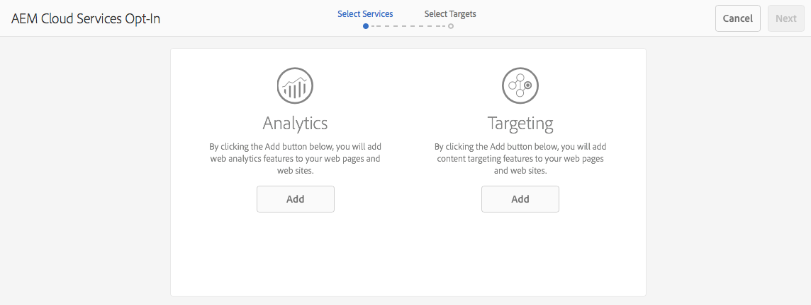

# Aceitação no Adobe Analytics e Adobe Target{#opting-into-adobe-analytics-and-adobe-target}

O AEM tem um procedimento de aceitação para ajudar você a se integrar ao Adobe Analytics e ao Adobe Target. Isso está disponível imediatamente, como uma tarefa pré-carregada atribuída ao grupo de usuários do administrador.

Ao efetuar logon como administrador, esta tarefa (**Configuração do Analytics &amp; Targeting**) está disponível no [Caixa de entrada](/help/sites-authoring/inbox.md#out-of-the-box-administrative-tasks). Com base nas credenciais fornecidas, ele ajuda a configurar e integrar esses serviços.

Você tem as seguintes opções para configurar a integração:

* Configure a integração por meio da tarefa .

   Isso pode ser feito imediatamente ou posteriormente, a tarefa permanecerá na Caixa de entrada até que alguma ação seja tomada. Em ambos os casos, a configuração pode ser feita diretamente na interface do usuário ou com o uso de um `.properties` arquivo.

* Rejeite a integração.

   Considere esta opção se preferir [configurar manualmente a integração](/help/sites-administering/marketing-cloud.md). Consulte também [Integração de AEM com o Adobe Target e o Adobe Analytics usando o DTM](https://helpx.adobe.com/experience-manager/using/integrate-digital-marketing-solutions.html).

* Configure a configuração e o provisionamento usando um script.

## Configurar a integração {#configuring-the-integration}

Opte pela integração com:

* Analytics para permitir o uso de seus recursos de análise e rastreamento de página.
* Target para permitir o uso de seus recursos de personalização.

Para qualquer opção, você precisa fornecer as informações da conta de usuário e especificar as páginas que são rastreadas.

>[!NOTE]
>
>Opcionalmente, é possível fornecer informações de conta do Analytics e do Target usando um arquivo de propriedades lido na inicialização do servidor. Consulte [Fornecendo informações da conta usando um arquivo de propriedades](/help/sites-administering/opt-in.md#providing-account-information-using-a-properties-file).

Quando você opta pela integração, o AEM executa as seguintes tarefas:

* Cria as configurações de nuvem que permitem a conexão com o Analytics e o Target.
* Cria as estruturas que determinam os dados que são rastreados.
* Configura as páginas da Web para usar esses serviços.

>[!NOTE]
>
>AT.js é a biblioteca de clientes padrão. Isso é configurado em [configuração dos serviços em nuvem do target](/help/sites-administering/target-configuring.md#creating-a-target-cloud-configuration).
>
>O Adobe recomenda usar a AT.js como a biblioteca do cliente.

Para aceitar a tarefa pré-carregada e pronta para uso:

1. Em seu [Caixa de entrada, selecione e **Abrir** Configurar o Analytics &amp; Targeting](/help/sites-authoring/inbox.md#taking-action-on-an-item) tarefa.

   

1. Para o Analytics:

   1. Insira as informações da conta do usuário para o Analytics e clique no link correspondente **Adicionar** botão.
   1. As credenciais apropriadas são autenticadas.
   1. Quando a conta do Analytics for autenticada, selecione o conjunto de relatórios do Analytics a ser usado. AEM recupera esses conjuntos de relatórios do Analytics. O status é atualizado para **Adicionado**.

1. Para o Target:

   1. Insira as informações da conta do usuário para o Target e clique no link correspondente **Adicionar** botão.
   1. As credenciais apropriadas são autenticadas. O status é atualizado para **Adicionado**.

1. Selecione **Próximo**.
1. Selecione os sites para os quais o Analytics e/ou Target deve ser usado.

1. Selecionar **Concluído** para concluir.

   >[!CAUTION]
   >
   >Depois de optar pela configuração, é necessário publicar o site/as páginas afetadas para replicar essas alterações na instância de publicação.

## Recusar a integração {#opting-out-of-the-integration}

Rejeite a integração com o Analytics e o Target quando:

* Não quiser integrar com esses produtos.
* Prefere configurar as integrações manualmente.

   Para obter informações sobre como configurar as integrações manualmente, consulte [Integração com o Adobe Analytics](/help/sites-administering/adobeanalytics.md) e [Integração com o Adobe Target](/help/sites-administering/target.md).

Para recusar, é necessário concluir a tarefa pré-carregada:

* Em seu [Caixa de entrada, selecione e **Concluído** Configurar o Analytics &amp; Targeting](/help/sites-authoring/inbox.md#taking-action-on-an-item) tarefa.

## Fornecendo informações da conta usando um arquivo de propriedades {#providing-account-information-using-a-properties-file}

Instale um arquivo de propriedades que AEM a leitura na inicialização do servidor para configurar as propriedades da conta para a integração com o Analytics e o Target. Ao usar o arquivo de propriedades, o assistente de aceitação usa automaticamente as propriedades do arquivo e a configuração da nuvem é criada adequadamente.

O arquivo de propriedades é um arquivo de texto chamado marketingcloud.properties que você salva no diretório de trabalho que o processo de AEM está usando (normalmente o mesmo diretório que o arquivo JAR). O arquivo inclui as seguintes propriedades:

* analytics.server: O URL do data center do Analytics que você usa.
* analytics.company: A empresa associada à conta de usuário do Analytics.
* analytics.username: Seu nome de usuário do Analytics.
* analytics.secret: O segredo associado ao nome de usuário do Analytics.
* analytics.reportsuite: O nome do conjunto de relatórios do Analytics a ser usado.
* target.clientcode: O código de cliente associado à sua conta Target.
* target.email: O endereço de email usado para autenticar sua conta do Target.
* target.password: A senha associada ao seu endereço de email.

Propriedades e valores são separados por sinais iguais (=). As propriedades do Analytics recebem o prefixo `analytics`e as propriedades do Target recebem o prefixo `target`. Para configurar um serviço, forneça valores para todas as propriedades desse serviço. Se não quiser configurar um serviço, não forneça valores para esse serviço.

O exemplo a seguir `.properties` O arquivo inclui os valores de propriedade para criar uma configuração de nuvem para o Analytics:

```xml
analytics.server=https://test.omniture.com/login/
analytics.company=MyCompany
analytics.username=sbroders
analytics.secret=12345678
analytics.reportsuite=myreportsuite
target.clientcode=
target.email=
target.password=
```

O procedimento a seguir descreve como aceitar a integração usando o arquivo de propriedades.

1. Crie o `marketingcloud.properties` no diretório de trabalho que o processo de AEM está usando (instância do autor).

   >[!NOTE]
   >
   >O diretório de trabalho geralmente é o diretório que contém o jar ou `license.properties` arquivo.
   >
   >No entanto, também pode ser definido como um caminho absoluto pela propriedade do sistema:
   >
   >`mac.provisioning.file.container`

1. Adicione os valores da propriedade de acordo com suas contas do Analytics e/ou Target.
1. Inicie ou reinicie o servidor e faça logon usando uma conta de administrador.
1. Abra a tarefa Configurar Analytics &amp; Targeting , conforme descrito em [Configurar a integração](/help/sites-administering/opt-in.md#configuring-the-integration). Em vez de solicitar informações de sua conta, o assistente usa os valores da variável `.properties` arquivo.

   Selecionar **Adicionar** para o serviço adequado, continue com o assistente.

   

## Sobre as configurações de nuvem {#about-the-cloud-configurations}

Ao configurar a integração com o Analytics e o Target, o AEM cria automaticamente as configurações e estruturas de nuvem necessárias. Por exemplo, a configuração de nuvem do Analytics é chamada de Conta do Analytics provisionada.

Não é necessário alterar as configurações de nuvem. No entanto, você pode configurar as estruturas conforme necessário. (Consulte [Mapeamento de dados do componente com propriedades do Adobe Analytics](/help/sites-administering/adobeanalytics-mapping.md) e [Adicionar uma estrutura do Target](/help/sites-administering/target.md).)

>[!NOTE]
>
>Por padrão, quando você opta pelo assistente de configuração do Adobe Target, o Direcionamento preciso é ativado.
>
>Direcionamento preciso significa que a configuração do Cloud Service aguarda o contexto ser carregado antes de carregar o conteúdo. Como resultado, em termos de desempenho, o direcionamento preciso pode criar um atraso de alguns milissegundos antes de carregar o conteúdo.
>
>O direcionamento preciso é sempre ativado na instância do autor. No entanto, na instância de publicação, é possível desativar o direcionamento preciso globalmente, limpando a marca de seleção ao lado de Direcionamento preciso na configuração do Cloud Service (**http://localhost:4502/etc/cloudservices.html**). Você também pode ativar e desativar o direcionamento preciso para componentes individuais, independentemente das suas definições na configuração do Cloud Service.
>
>Se você ***já*** tiver criado componentes direcionados e alterar essa configuração, suas alterações não afetarão esses componentes. Você deve alterar esses componentes diretamente.

>[!CAUTION]
>
>Ao aderir à configuração do Analytics e a um `reportsuite` for selecionada, a estrutura será restrita ao modo de execução de publicação. Isso significa que o rastreamento só funciona na instância de publicação.
>
>Se o rastreamento for necessário em uma instância de criação, também o valor deverá ser alterado para `all`.

## Configuração e provisionamento via Script {#configuring-the-setup-and-provisioning-via-script}

Como administrador, talvez você queira acionar a configuração e o provisionamento com um script em vez de passar manualmente pelo assistente. Você pode fazer isso:

* Envio de uma solicitação de POST para **/libs/cq/cloudservicesprovisioning/content/autoprovisioning.json** com os parâmetros necessários.

Os parâmetros enviados dependem do seguinte:

* Se quiser usar a variável **marketingcloud.properties** arquivo preenchido com todas as credenciais necessárias, você deve enviar os seguintes parâmetros:

   * `automaticProvisioning`= `true`
   * `servicename`= `analytics|target`
   * `path`=path para uma página AEM para anexar as configurações dos serviços em nuvem criados

   Por exemplo, uma solicitação de ondulação que cria configurações do Analytics e do Target e as anexa à página we.retail seria:

   ```shell
   curl -v -u admin:admin -X POST -d"automaticProvisioning=true&servicename=target&servicename=analytics&path=/content/we-retail" http://localhost:4502/libs/cq/cloudservicesprovisioning/content/autoprovisioning.json
   ```

* Se não quiser usar a variável **marketingcloud.properties** em seguida, você terá que enviar as credenciais, bem como os parâmetros; por exemplo:

   * automaticProvisioning= `true`
   * servicename= `analytics|target`
   * path=path para uma página de AEM para anexar as configurações dos serviços de nuvem criados; vários caminhos podem ser definidos
   * analytics.server= `https://servername`
   * analytics.company= `Name of company`
   * analytics.username= `me`
   * analytics.secret= `secret`
   * analytics.reportsuite= `we-retail`
   * target.clientcode= `mycompany`
   * target.email= `me@adobe.com`
   * target.password= `password`

   Nesse caso, a solicitação curl que cria configurações do Analytics e do Target e as anexa à página de web-retail seria:

   ```shell
   curl -v -u admin:admin -X POST -d"automaticProvisioning=false&servicename=target&servicename=analytics&path=/content/we-retail&analytics.server=https://servername/&analytics.company=Name of company&analytics.username=me&analytics.secret=secret&analytics.reportsuite=weretail&target.clientcode=mycompany&target.email=me@adobe.com&target.password=password" http://localhost:4502/libs/cq/cloudservicesprovisioning/content/autoprovisioning.json
   ```
