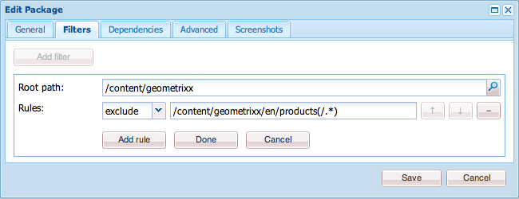
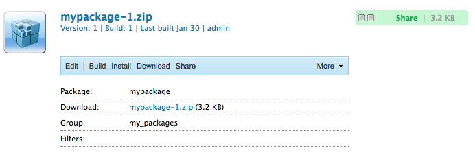

# Como trabalhar com pacotes{#how-to-work-with-packages}

Os pacotes permitem a importação e exportação de conteúdo do repositório. Por exemplo, você pode usar pacotes para instalar uma nova funcionalidade, transferir conteúdo entre instâncias e fazer backup do conteúdo do repositório.

Os pacotes podem ser acessados e/ou mantidos das seguintes páginas:

* [Gerenciador de pacotes](#package-manager), que você usa para gerenciar os pacotes na instância de AEM local.

* [Distribuição](#software-distribution) de software, um servidor centralizado que contém pacotes publicamente disponíveis e aqueles privados para sua empresa. Os pacotes públicos podem conter hotfixes, nova funcionalidade, documentação, etc.

Você pode transferir pacotes entre o Gerenciador de pacotes, a Distribuição de software e o sistema de arquivos.

## O que são pacotes? {#what-are-packages}

Um pacote é um arquivo zip com conteúdo de repositório na forma de uma serialização de sistema de arquivos (chamada de serialização &quot;vault&quot;). Isso oferece uma representação fácil de usar e editar de arquivos e pastas.

Os pacotes incluem conteúdo, conteúdo de página e conteúdo relacionado ao projeto, selecionados por meio de filtros.

Um pacote também contém informações de metadados de cofre, incluindo as definições de filtro e informações de configuração de importação. Propriedades de conteúdo adicionais (que não são usadas para extração de pacotes) podem ser incluídas no pacote, como uma descrição, uma imagem visual ou um ícone; essas propriedades são para o consumidor do pacote de conteúdo e somente para fins informativos.

>[!NOTE]
>
>Os pacotes representam a versão atual do conteúdo no momento em que o pacote é criado. Eles não incluem versões anteriores do conteúdo que AEM mantém no repositório.

Você pode executar as seguintes ações em pacotes ou com pacotes:

* Criar novos pacotes; definição das configurações e filtros do pacote conforme necessário
* Visualizar o conteúdo do pacote (antes da criação)
* Criar pacotes
* Exibir informações do pacote
* Exibir o conteúdo do pacote (após a criação)
* Modificar a definição de pacotes existentes
* Reconstruir pacotes existentes
* Reembrulhar pacotes
* Baixe pacotes do AEM para seu sistema de arquivos
* Faça upload de pacotes do seu sistema de arquivos para a instância de AEM local
* Validar o conteúdo do pacote antes da instalação
* Executar uma instalação de simulação
* Instalar pacotes (AEM não instala pacotes automaticamente após o upload)
* Excluir pacotes
* Baixe pacotes, como hotfixes, da biblioteca de distribuição de software
* Faça upload de pacotes para a seção interna da empresa da biblioteca de distribuição de software

## Informações do pacote {#package-information}

Uma definição de pacote é composta por vários tipos de informações:

* [Configurações do pacote](#package-settings)
* [Filtros do pacote](#package-filters)
* [Capturas de tela do pacote](#package-screenshots)
* [Ícones do pacote](#package-icons)

### Configurações do pacote {#package-settings}

É possível editar várias Configurações do pacote para definir aspectos como a descrição do pacote, bugs relacionados, dependências e informações do provedor.

A caixa de diálogo **Configurações do pacote** está disponível por meio do botão **Editar** quando [criar](#creating-a-new-package) ou [editar](#viewing-and-editing-package-information) um pacote e fornece três guias para configuração. Depois que qualquer alteração for feita, clique em **OK** para salvá-las.


| **Texto** | **Descrição** |
|---|---|
| Nome | O nome do pacote. |
| Grupo | O nome do grupo ao qual adicionar o pacote, para organizar pacotes. Digite o nome de um novo grupo ou selecione um grupo existente. |
| Versão | Texto a ser usado para a versão personalizada. |
| Descrição | Breve descrição do pacote. A marcação HTML pode ser usada para formatação. |
| Miniatura  | O ícone que aparece com a listagem de pacotes. Clique em Procurar para selecionar um arquivo local. |


<table>
 <tbody>
  <tr>
   <th><strong>Texto</strong></th>
   <th><strong>Descrição</strong></th>
   <th><strong>Formato/Exemplo</strong></th>
  </tr>
  <tr>
   <td>Nome</td>
   <td>O nome do provedor.</td>
   <td><em>AEM Geometrixx<br /> </em></td>
  </tr>
  <tr>
   <td>URL</td>
   <td>URL do provedor.</td>
   <td><em>https://www.aem-geometrixx.com</em></td>
  </tr>
  <tr>
   <td>Link</td>
   <td>Link específico do pacote para uma página de provedor.</td>
   <td><em>https://www.aem-geometrixx.com/mypackage.html</em></td>
  </tr>
  <tr>
   <td>Exige<br /> </td>
   <td>
    <ul>
     <li>Administrador: Selecione quando o pacote só pode ser instalado por uma conta com privilégios de administrador.</li>
     <li>Reiniciar: Selecione quando o servidor precisa ser reiniciado após a instalação do pacote.</li>
    </ul> </td>
   <td> </td>
  </tr>
  <tr>
   <td>Reparação de AC</td>
   <td><p>Especifique como as informações de controle de acesso definidas no pacote são tratadas quando o pacote é importado:</p>
    <ul>
     <li><strong>Ignorar</strong></li>
     <li><strong>Substituir</strong></li>
     <li><strong>Mesclar</strong></li>
     <li><strong>Limpar</strong></li>
     <li><strong>MergePreserve</strong></li>
    </ul> <p>O valor padrão é <strong>Ignore</strong>.</p> </td>
   <td>
    <ul>
     <li><strong>Ignorar</strong>  - preservar as ACLs no repositório</li>
     <li><strong>Substituir</strong>  - substituir ACLs no repositório</li>
     <li><strong>Mesclar</strong>  - mesclar ambos os conjuntos de ACLs</li>
     <li><strong>Clear</strong>  - clear ACLs</li>
     <li><strong>MergePreserve</strong>  - mescle o controle de acesso no conteúdo com o fornecido com o pacote adicionando as entradas de controle de acesso de entidades principais não presentes no conteúdo</li>
    </ul> </td>
  </tr>
 </tbody>
</table>


| **Texto** | **Descrição** | **Formato/Exemplo** |
|---|---|---|
| Testado com | O nome e a versão do produto com os quais este pacote é direcionado ou compatível. | *AEM6* |
| Erros/problemas corrigidos | Um campo de texto que permite listar detalhes de bugs corrigidos com este pacote. Liste cada bug em uma linha separada. | resumo bug-nr |
| Depende de | Lista informações de dependência que precisam ser respeitadas sempre que outros pacotes forem necessários para permitir que o pacote atual seja executado conforme esperado. Esse campo é importante ao usar hotfixes. | groupId:name:version |
| Substitui | Uma lista de pacotes obsoletos que este pacote substitui. Antes de instalar, verifique se este pacote inclui todo o conteúdo necessário dos pacotes obsoletos para que nenhum conteúdo seja substituído. | groupId:name:version |

### Filtros do pacote {#package-filters}

Os filtros identificam os nós do repositório a serem incluídos no pacote. Uma **Definição de Filtro** especifica as seguintes informações:

* O **Caminho raiz** do conteúdo a ser incluído.
* **** Regras que incluem ou excluem nós específicos abaixo do caminho raiz.

Os filtros podem incluir zero ou mais regras. Quando nenhuma regra é definida, o pacote contém todo o conteúdo abaixo do caminho raiz.

É possível definir uma ou mais definições de filtro para um pacote. Use mais de um filtro para incluir conteúdo de vários caminhos raiz.


A tabela a seguir descreve essas regras e fornece exemplos:

<table>
 <tbody>
  <tr>
   <th> Tipo de regra</th>
   <th>Descrição </th>
   <th>Exemplo </th>
  </tr>
  <tr>
   <td> incluir</td>
   <td>Você pode definir um caminho ou usar uma expressão regular para especificar todos os nós que deseja incluir.<br /> <br /> A inclusão de um diretório irá:
    <ul>
     <li>inclua esse diretório <i>e</i> todos os arquivos e pastas nesse diretório (ou seja, toda a subárvore)</li>
     <li><strong></strong> não inclua outros arquivos ou pastas de abaixo do caminho raiz especificado</li>
    </ul> </td>
   <td>/libs/sling/install(/.*)? </td>
  </tr>
  <tr>
   <td> excluir</td>
   <td>Você pode especificar um caminho ou usar uma expressão regular para especificar todos os nós que deseja excluir.<br /> <br /> A exclusão de um diretório excluirá esse diretório  <i></i> e todos os arquivos e pastas nesse diretório (ou seja, toda a subárvore).<br /> </td>
   <td>/libs/wcm/foundation/components(/.*)?</td>
  </tr>
 </tbody>
</table>

>[!NOTE]
>
>Um pacote pode conter várias definições de filtro, de modo que nós de diferentes locais possam ser facilmente combinados em um único pacote.

Os filtros de pacote são definidos com mais frequência ao criar o pacote pela primeira vez [, mas também podem ser editados posteriormente (depois disso, o pacote deve ser recriado).](#creating-a-new-package)

### Capturas de tela do pacote {#package-screenshots}

Você pode anexar capturas de tela ao seu pacote para fornecer uma representação visual da aparência do conteúdo; por exemplo, fornecendo capturas de tela de novas funcionalidades.

### Ícones do pacote {#package-icons}

Você também pode anexar um ícone ao seu pacote para fornecer uma representação visual de referência rápida do que ele contém. Isso é mostrado na lista de pacotes e pode ajudar você a identificar facilmente o pacote ou a classe do pacote.

Como um pacote pode conter um ícone, as seguintes convenções são usadas para embalagens oficiais:

>[!NOTE]
>
>Para evitar confusão, use um ícone descritivo para o pacote e não use um dos ícones oficiais.

Pacote de hotfix oficial:


Pacote oficial AEM Instalação ou extensão:

Pacotes de recursos oficiais:


## Gerenciador de pacotes {#package-manager}

O Gerenciador de pacotes gerencia os pacotes na instalação local do AEM. Depois que você tiver [atribuído as permissões necessárias](#permissions-needed-for-using-the-package-manager), poderá usar o Gerenciador de pacotes para várias ações, incluindo a configuração, criação, download e instalação dos pacotes. Os principais elementos a serem configurados são:

* [Configurações do pacote](#package-settings)
* [Filtros do pacote](#package-filters)

### Permissões necessárias para usar o Gerenciador de pacotes {#permissions-needed-for-using-the-package-manager}

Para conceder aos usuários o direito de criar, modificar, carregar e instalar pacotes, você deve conceder a eles as permissões apropriadas nos seguintes locais:

* **/etc/packages**  (direitos totais excluindo exclusão)
* o nó que contém o conteúdo do pacote

>[!CAUTION]
>
>A concessão de permissões em pacotes pode levar à divulgação de informações confidenciais e à perda de dados.
>
>Para limitar esses riscos, é altamente recomendável conceder permissões de grupo específicas somente sobre subárvores dedicadas, por exemplo `/etc/packages/site-content`.

Consulte [Definindo permissões](/help/sites-administering/security.md#setting-page-permissions) para obter instruções sobre como alterar permissões.

### Criação de um novo pacote {#creating-a-new-package}

Para criar uma nova definição de pacote:

1. Na tela de Boas-vindas AEM, clique em **Pacotes** (ou no console **Ferramentas** clique duas vezes em **Pacotes**).

1. Em seguida, selecione **Gerenciador de Pacotes**.
1. Clique em **Criar pacote**.

   >[!NOTE]
   >
   >Se a instância tiver muitos pacotes, pode haver uma estrutura de pastas em vigor, para que você possa navegar até a pasta de destino necessária antes de criar o novo pacote.

1. Na caixa de diálogo:

   

   Insira:

   * **Nome do grupo**

      O nome do grupo de destino (ou pasta). Os grupos devem ser usados para ajudar a organizar seus pacotes.

      Uma pasta será criada para o grupo se ainda não existir. Se deixar o nome do grupo em branco, ele criará o pacote na lista de pacotes principais (Início > Pacotes).

   * **Nome do pacote**

      O nome do novo pacote. Selecione um nome descritivo para ajudá-lo (e outros) a identificar facilmente o conteúdo do pacote.

   * **Versão**

      Um campo textual para indicar uma versão. Isso será anexado ao nome do pacote para formar o nome do arquivo zip.
   Clique em **OK** para criar o pacote.

1. AEM lista o novo pacote na pasta de grupo apropriada.

   

   Clique no ícone ou no nome do pacote para abrir.

   

   >[!NOTE]
   >
   >Você pode retornar a essa página em um estágio posterior, se necessário.

1. Clique em **Editar** para editar as [configurações de pacote](#package-settings).

   Aqui, você pode adicionar informações e/ou definir determinadas configurações; por exemplo, eles incluem uma descrição, o [ícone](#package-icons), bugs relacionados e adicionar detalhes do provedor.

   Clique em **OK** depois de concluir a edição das configurações.

1. Adicione **[Capturas de tela](#package-screenshots)** ao pacote, conforme necessário. Uma instância está disponível quando o pacote é criado, adicione mais, se necessário, usando **Captura de tela do pacote** do sidekick.

   Adicione a imagem real clicando duas vezes no componente de imagem na área **Capturas de tela**, adicionando uma imagem e clicando em **OK**.

1. Defina os **[Filtros de Pacote](#package-filters)** arrastando instâncias de **Definição de Filtro** do sidekick e clicando duas vezes para abrir para edição:

   

   Especifique:

   * **Caminho raizO conteúdo a ser embalado;**
 essa pode ser a raiz de uma subárvore.
   * ****
RegrasAs regras são opcionais; para definições de pacote simples, não é necessário especificar regras de inclusão ou exclusão.

      Se necessário, você pode definir [**Include** ou **Exclude** rules](#package-filters) para definir exatamente o conteúdo do pacote.

      Adicione regras usando o símbolo **+**, como alternativa, remova regras usando o símbolo **-**. As regras são aplicadas de acordo com sua ordem, de forma que sejam posicionadas conforme necessário usando os botões **Up** e **Down**.
   Em seguida, clique em **OK** para salvar o filtro.

   >[!NOTE]
   >
   >Você pode usar quantas definições de filtro forem necessárias, embora seja necessário tomar cuidado para garantir que elas não entrem em conflito. Use **Preview** para confirmar o conteúdo do pacote.

1. Para confirmar o que o pacote manterá, você poderá usar **Preview**. Isso executa uma execução seca do processo de criação e lista tudo que será adicionado ao pacote quando ele for realmente criado.
1. Agora você pode [Criar](#building-a-package) seu pacote.

   >[!NOTE]
   >
   >Não é obrigatório construir o pacote neste momento, pode ser feito posteriormente.

### Criação de um pacote {#building-a-package}

Geralmente, um pacote é criado ao mesmo tempo que você [cria a definição de pacote](#creating-a-new-package), mas você pode retornar posteriormente para criar ou reconstruir o pacote. Isso pode ser útil se o conteúdo no repositório tiver sido alterado.

>[!NOTE]
>
>Antes de criar o pacote, pode ser útil visualizar o conteúdo do pacote. Para fazer isso, clique em **Preview**.

1. Abra a definição de pacote em **Gerenciador de Pacotes** (clique no ícone ou nome do pacote).

1. Clique em **Criar**. Uma caixa de diálogo solicita a confirmação de que você deseja criar o pacote.

   >[!NOTE]
   >
   >Isso é de especial importância quando você está recriando um pacote, pois o conteúdo do pacote será substituído.

1. Clique em **OK**. AEM criará o pacote, listando todo o conteúdo adicionado ao pacote da maneira que ele fizer. Ao concluir o AEM, você exibe uma confirmação de que o pacote foi criado e (ao fechar a caixa de diálogo) atualiza as informações da lista de pacotes.

### Reembrulhar um pacote {#rewrapping-a-package}

Depois que um pacote é criado, ele pode ser reembutido, se necessário.

Rewrapping altera as informações do pacote - *sem* alterar o conteúdo do pacote. As informações do pacote são a miniatura, a descrição etc., em outras palavras, tudo o que você pode editar com a caixa de diálogo **Configurações do pacote** (para abrir, clique em **Editar**).

Um caso de uso importante para refazer é ao preparar um pacote. Por exemplo, você pode ter um pacote existente e decidir compartilhá-lo com outras pessoas. Para isso, adicione uma miniatura e uma descrição. Em vez de recriar o pacote inteiro com toda a funcionalidade (o que pode levar algum tempo e correr o risco de o pacote não ser mais idêntico ao original), você pode refazer o encapsulamento e adicionar a miniatura e a descrição.

1. Abra a definição de pacote em **Gerenciador de Pacotes** (clique no ícone ou nome do pacote).

1. Clique em **Editar** e atualize as **[Configurações do Pacote](#package-settings)** conforme necessário. Clique em **OK** para salvar.

1. Clique em **Reenvolver**, uma caixa de diálogo pedirá confirmação.

### Exibindo e editando informações do pacote {#viewing-and-editing-package-information}

Para exibir ou editar informações sobre uma definição de pacote:

1. No Gerenciador de pacotes, navegue até o pacote que deseja visualizar.
1. Clique no ícone de pacote do pacote que deseja visualizar. Isso abrirá a página do pacote listando informações sobre a definição do pacote:

   

   >[!NOTE]
   >
   >Também é possível editar e executar determinadas ações no pacote nessa página.
   >
   >Os botões disponíveis dependerão se o pacote já foi criado ou não.

1. Se o pacote já tiver sido criado, clique em **Contents**, uma janela será aberta e listará todo o conteúdo do pacote:

### Visualização do conteúdo do pacote e teste da instalação {#viewing-package-contents-and-testing-installation}

Após a criação de um pacote, você pode exibir o conteúdo:

1. No Gerenciador de pacotes, navegue até o pacote que deseja visualizar.
1. Clique no ícone de pacote do pacote que deseja visualizar. Isso abrirá a página do pacote listando informações sobre a definição do pacote.

1. Para exibir o conteúdo, clique em **Contents**, uma janela será aberta e listará todo o conteúdo do pacote:

   

1. Para executar uma simulação de instalação, clique em **Testar Instalação**. Após confirmar a ação, uma janela será aberta e listará os resultados como se a instalação tivesse sido executada:

   

### Fazendo download de pacotes no seu sistema de arquivos {#downloading-packages-to-your-file-system}

Esta seção descreve como baixar um pacote do AEM para seu sistema de arquivos usando o **Gerenciador de Pacotes**.

1. Na tela de Boas-vindas AEM, clique em **Pacotes** e selecione **Gerenciador de Pacotes**.
1. Navegue até o pacote que deseja baixar.

   

1. Clique no link formado pelo nome do arquivo zip (sublinhado) para o pacote que deseja baixar; por exemplo `export-for-offline.zip`.

   AEM o download do pacote para seu computador (usando uma caixa de diálogo padrão de download do navegador).

### Fazer upload de pacotes do seu sistema de arquivos {#uploading-packages-from-your-file-system}

Um upload de pacote permite fazer upload de um pacote de seu sistema de arquivos para o Gerenciador de pacotes de AEM.
Para fazer upload de um pacote:

1. Navegue até o **Gerenciador de Pacotes**. Em seguida, na pasta do grupo na qual deseja que o pacote seja carregado.

   

1. Clique em **Fazer upload do pacote**.

   

   * **Arquivo**

      Você pode digitar o nome do arquivo diretamente ou usar o **Procurar...** para selecionar o pacote necessário do sistema de arquivos local (após a seleção, clique em **OK**).

   * **Forçar atualização**

      Se um pacote com esse nome já existir, você poderá clicar nele para forçar o upload (e substituir o pacote existente).
   Clique em **OK** para que o novo pacote seja carregado e listado na lista Gerenciador de pacotes.

   >[!NOTE]
   >
   >Para disponibilizar o conteúdo para o AEM, certifique-se de [instalar o pacote](#installing-packages).

### Validação de pacotes {#validating-packages}

Antes de instalar um pacote, convém verificar seu conteúdo. Como os pacotes podem modificar arquivos sobrepostos em `/apps` e/ou adicionar, modificar e remover ACLs, geralmente é útil validar essas alterações antes de instalar.

#### Opções de validação {#validation-options}

O mecanismo de validação pode verificar as seguintes características do pacote:

* Importações de pacotes OSGi
* Sobreposições
* ACLs

Essas opções são detalhadas abaixo.

* **Validar importações do pacote OSGi**

   **O que está marcado**

   Essa validação inspeciona o pacote de todos os arquivos JAR (pacotes OSGi), extrai seus `manifest.xml` (que contém as dependências com versão das quais o pacote OSGi depende) e verifica as exportações da instância AEM mencionadas dependências com as versões corretas.

   **Como é reportado**

   Quaisquer dependências com versão que não possam ser atendidas pela instância de AEM são listadas no **Log de Atividades** do Gerenciador de Pacotes.

   **Estados de erro**

   Se as dependências não forem atendidas, os pacotes OSGi no pacote com essas dependências não serão iniciados. Isso resulta em uma implantação de aplicativo interrompida, pois qualquer coisa que dependa do pacote OSGi não iniciado, por sua vez, não funcionará corretamente.

   **Resolução de Erro**

   Para resolver erros devido a pacotes OSGi insatisfeitos, a versão de dependência no pacote com importações insatisfeitas precisa ser ajustada.

* **Validar sobreposições**

   **O que está marcado**

   Essa validação determina se o pacote que está sendo instalado contém um arquivo que já está sobreposto na instância de destino AEM.

   Por exemplo, considerando uma sobreposição existente em `/apps/sling/servlet/errorhandler/404.jsp`, um pacote que contém `/libs/sling/servlet/errorhandler/404.jsp`, de modo que alterará o arquivo existente em `/libs/sling/servlet/errorhandler/404.jsp`.

   **Como é reportado**

   Essas sobreposições são descritas no **Log de atividades** do Gerenciador de pacotes.

   **Estados de erro**

   Um estado de erro significa que o pacote está tentando implantar um arquivo que já está sobreposto, portanto, as alterações no pacote serão sobrepostas (e, portanto, &quot;ocultas&quot;) pela sobreposição e não terão efeito.

   **Resolução de Erro**

   Para resolver esse problema, o mantenedor do arquivo de sobreposição em `/apps` deve revisar as alterações no arquivo sobreposto em `/libs`, incorporar as alterações conforme necessário na sobreposição ( `/apps`) e reimplantar o arquivo sobreposto.

   >[!NOTE]
   >
   >Observe que o mecanismo de validação não tem como reconciliar se o conteúdo sobreposto foi incorporado corretamente no arquivo de sobreposição. Por conseguinte, esta validação continuará a apresentar relatórios sobre conflitos mesmo depois de terem sido efetuadas as alterações necessárias.

* **Validar ACLs**

   **O que está marcado**

   Essa validação verifica quais permissões estão sendo adicionadas, como serão tratadas (mesclar/substituir) e se as permissões atuais serão afetadas.

   **Como é reportado**

   As permissões são descritas no **Log de atividades** do Gerenciador de pacotes.

   **Estados de erro**

   Não é possível fornecer erros explícitos. A validação simplesmente indica se qualquer nova permissão ACL será adicionada ou afetada pela instalação do pacote.

   **Resolução de Erro**

   Usando as informações fornecidas pela validação, os nós afetados podem ser revisados no CRXDE e as ACLs podem estar ajustando no pacote conforme necessário.

   >[!CAUTION]
   >
   >Como prática recomendada, é recomendável que os pacotes não afetem as ACLs fornecidas AEM, pois isso pode resultar em comportamento inesperado do produto.

#### Executando validação {#performing-validation}

A validação dos pacotes pode ser feita de duas maneiras diferentes:

* Por meio da interface do usuário do Gerenciador de pacotes
* Por meio de solicitação HTTP POST, como com cURL

>[!NOTE]
>
>A validação deve sempre ocorrer após o upload do pacote, mas antes da instalação.

**Validação do pacote por meio do Gerenciador de pacotes**

1. Abra o Gerenciador de Pacotes em `https://<server>:<port>/crx/packmgr`
1. Selecione o pacote na lista e selecione **Mais** lista suspensa no cabeçalho e **Validar** no menu suspenso.

   >[!NOTE]
   >
   >Isso deve ser feito após o upload do pacote de conteúdo, mas antes da instalação do pacote.

1. Na caixa de diálogo modal que aparece, use as caixas de seleção para selecionar os tipos de validação e iniciar a validação clicando em **Validar**. Como alternativa, clique em **Cancelar**.

1. As validações escolhidas são executadas. Os resultados são exibidos no registro de atividades do Gerenciador de pacotes.

**Validação de pacote por solicitação POST HTTP**

A solicitação POST assume o seguinte formulário.

```
https://<host>:<port>/crx/packmgr/service.jsp?cmd=validate&type=osgiPackageImports,overlays,acls
```

>[!NOTE]
>
>O parâmetro `type` pode ser qualquer lista não ordenada separada por vírgulas que consista em:
>
>* `osgiPackageImports`
>* `overlays`
>* `acls`

>
>
O valor de `type` é definido como `osgiPackageImports` se não for passado.

Veja a seguir um exemplo de uso de cURL para executar uma validação de pacote.

1. Se estiver usando cURL, execute uma instrução semelhante ao seguinte:

   ```shell
   curl -v -X POST --user admin:admin -F file=@/Users/SomeGuy/Desktop/core.wcm.components.all-1.1.0.zip 'http://localhost:4502/crx/packmgr/service.jsp?cmd=validate&type=osgiPackageImports,overlays,acls'
   ```

1. A validação solicitada é executada e a resposta é enviada de volta como um objeto JSON.

>[!NOTE]
>
>A resposta a uma solicitação de validação HTTP POST será um objeto JSON com os resultados da validação.

### Instalação de pacotes {#installing-packages}

Após fazer upload de um pacote, é necessário instalar o conteúdo. Para ter o conteúdo do pacote instalado e funcional, ele precisa ser:

* carregado no AEM (ou [carregado do sistema de arquivos](#uploading-packages-from-your-file-system) ou baixado de [Distribuição de software](#software-distribution))

* instalados

>[!CAUTION]
>
>A instalação de um pacote pode substituir ou excluir o conteúdo existente. Faça upload de um pacote somente se tiver certeza de que ele não exclui ou substitui o conteúdo necessário.
>
>Para ver o conteúdo ou o impacto de um pacote, você pode:
>
>* Execute uma instalação de teste do pacote sem modificar qualquer conteúdo:
   >  Abra o pacote (clique no ícone ou nome do pacote) e clique em **Testar instalação**.
   >
   >
* Consulte uma lista de conteúdos do pacote:
   >  Abra o pacote e clique em **Contents**.

>


>[!NOTE]
>
>Imediatamente antes da instalação do pacote, um pacote de instantâneo é criado para conter o conteúdo que será substituído.
>
>Este instantâneo será reinstalado se/quando você desinstalar o pacote.

>[!CAUTION]
>
>Se você estiver instalando ativos digitais, deverá:
>
>* Primeiro, desative o WorkflowLauncher.
   >  Use a opção de menu Componentes do console OSGi para desativar `com.day.cq.workflow.launcher.impl.WorkflowLauncherImpl`.
   >
   >
* Em seguida, quando a instalação for concluída, reative o WorkflowLauncher.
>
>
Desativar o WorkflowLauncher garante que a estrutura do importador de Ativos não manipule (involuntariamente) os ativos na instalação.

1. No Gerenciador de pacotes, navegue até o pacote que deseja instalar.

   Um botão **Install** é exibido na lateral de Pacotes que ainda não foram instalados.

   >[!NOTE]
   >
   >Como alternativa, abra o pacote clicando no ícone para acessar o botão **Install**.

1. Clique em **Instalar** para iniciar a instalação. Uma caixa de diálogo solicitará a confirmação e listará todas as alterações feitas. Quando terminar, clique em **Fechar** na caixa de diálogo.

   A palavra **Installed** aparece ao lado do pacote depois de ele ter sido instalado.

### Upload e instalação baseados no sistema de arquivos {#file-system-based-upload-and-installation}

Há uma maneira alternativa de carregar e instalar pacotes na sua instância. No seu sistema de arquivos, você tem uma pasta `crx-quicksart` junto com seu jar e `license.properties` arquivo. Você precisa criar uma pasta chamada `install` em `crx-quickstart`. Você terá algo assim: `<aem_home>/crx-quickstart/install`

Nesta instalação, pasta , é possível adicionar diretamente os pacotes. Eles serão carregados e instalados automaticamente na sua instância. Quando terminar, você poderá ver os pacotes no Gerenciador de pacotes.

Se a instância estiver em execução, adicionar um pacote à pasta `install` iniciará diretamente o upload e a instalação na instância. Se a instância não estiver em execução, os pacotes colocados na pasta `install` serão instalados na inicialização, na ordem alfabética.

>[!NOTE]
>
>Você também pode fazer isso antes mesmo de iniciar a instância pela primeira vez. Para fazer isso, você precisa criar a pasta `crx-quickstart` manualmente, criar a pasta `install` nela e colocar seus pacotes lá. Em seguida, ao iniciar a instância pela primeira vez, os pacotes serão instalados na ordem alfabética.

### Desinstalação de pacotes {#uninstalling-packages}

AEM permite desinstalar pacotes. Essa ação reverte o conteúdo do repositório que é afetado ao instantâneo feito imediatamente antes da instalação do pacote.

>[!NOTE]
>
>Após a instalação, um pacote de instantâneo é criado contendo o conteúdo que será substituído.
>
>Este pacote será reinstalado quando você desinstalar o pacote.

1. No Gerenciador de pacotes, navegue até o pacote que você deseja desinstalar.
1. Clique no ícone de pacote do pacote que deseja desinstalar.
1. Clique em **Uninstall** para remover o conteúdo deste pacote do repositório. Uma caixa de diálogo solicitará a confirmação e listará todas as alterações feitas. Quando terminar, clique em **Fechar** na caixa de diálogo.

### Exclusão de pacotes {#deleting-packages}

Para excluir um pacote da(s) lista(ões) do Gerenciador de Pacotes:

>[!NOTE]
>
>Os arquivos/nós instalados do pacote são **e não** excluídos.

1. No console **Tools**, expanda a pasta **Packages** para mostrar seu pacote no painel direito.

1. Clique no pacote que deseja excluir para realçá-lo e, em seguida:

   * Clique em **Excluir** no menu da barra de ferramentas.
   * Clique com o botão direito do mouse e selecione **Delete**.

   

1. AEM solicita a confirmação de que você deseja excluir o pacote. Clique em **OK** para confirmar a exclusão.

>[!CAUTION]
>
>Se este pacote já tiver sido instalado, o conteúdo *instalado* **não** será excluído.

### Replicação de pacotes {#replicating-packages}

Replicar o conteúdo de um pacote para instalá-lo na instância de publicação:

1. No **Gerenciador de Pacotes**, navegue até o pacote que deseja replicar.

1. Clique no ícone ou no nome do pacote que deseja replicar para expandi-lo.
1. No menu suspenso **Mais** na barra de ferramentas, selecione **Replicar**.

## Compartilhamento de pacotes {#package-share}

O Compartilhamento de pacotes foi um servidor centralizado disponibilizado publicamente para compartilhar os Pacotes de conteúdo.

Ele foi substituído por [Distribuição de software](#software-distribution).

## Distribuição de software {#software-distribution}

[A ](https://downloads.experiencecloud.adobe.com) Distribuição de software é a nova interface de usuário criada para simplificar a pesquisa e o download de pacotes AEM.

Para obter mais informações, consulte a [Documentação de distribuição de software](https://experienceleague.adobe.com/docs/experience-cloud/software-distribution/home.html).

>[!CAUTION]
>
>AEM gerenciador de pacotes não pode ser usado com a Distribuição de software no momento, você pode baixar os pacotes no disco local.
