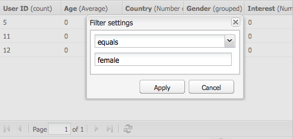

# Relatório {#reporting}

Para ajudá-lo a monitorar e analisar o estado da sua instância, AEM fornece uma seleção de relatórios padrão, que podem ser configurados para seus requisitos individuais:

* [Relatório de componentes](#component-report)
* [Uso do disco](#disk-usage)
* [Verificação de integridade](#health-check)
* [Relatório de atividades de página](#page-activity-report)
* [Relatório de conteúdo gerado pelo usuário](#user-generated-content-report)
* [Relatório do usuário](#user-report)
* [Relatório de instâncias do fluxo de trabalho](#workflow-instance-report)
* [Relatório de fluxo de trabalho](#workflow-report)

Todos os relatórios podem ser acessados pelo console **Ferramentas**. Selecione **Relatórios** no painel esquerdo e clique com o duplo no relatório necessário no painel direito para abri-lo para exibição e/ou configuração.

Novas instâncias de um relatório também podem ser criadas a partir do console **Ferramentas**. Selecione **Relatórios** no painel esquerdo e **Novo...** da barra de ferramentas. Defina um **Título** e **Nome**, selecione o tipo de relatório necessário e clique em **Criar**. Sua nova instância do relatório será exibida na lista. Clique com o duplo do mouse para abrir e arraste um componente do sidekick para criar a primeira coluna e o start da definição do relatório.

>[!NOTE]
>
>Além dos relatórios de AEM padrão que estão disponíveis prontamente, você pode [desenvolver seus próprios relatórios (completamente novos)](/help/sites-developing/dev-reports.md).

## As noções básicas da personalização de relatórios {#the-basics-of-report-customization}

Há vários formatos de relatórios disponíveis. Os relatórios a seguir usam colunas que podem ser personalizadas conforme detalhado nas seguintes seções:

* [Relatório de componentes](#component-report)
* [Relatório de atividades de página](#page-activity-report)
* [Relatório de conteúdo gerado pelo usuário](#user-generated-content-report)
* [Relatório do usuário](#user-report)
* [Relatório de instâncias do fluxo de trabalho](#workflow-instance-report)

>[!NOTE]
>
>Os relatórios a seguir têm seu próprio formato e personalização:
>
>
>* [As ](#health-check) Verificações de integridade usam os campos de seleção para especificar os dados nos quais você deseja criar relatórios.
>* [O Disk ](#disk-usage) Usageusa links para detalhar a estrutura do repositório.
>* [O ](/help/sites-administering/reporting.md#workflow-report) relatório de fluxo de trabalho fornece uma visão geral dos workflows em execução na sua instância.

>
>
Portanto, os seguintes procedimentos para configuração de coluna não são apropriados. Consulte as descrições dos relatórios individuais para obter detalhes.

### Selecionar e posicionar as colunas de dados {#selecting-and-positioning-the-data-columns}

As colunas podem ser adicionadas, reposicionadas ou removidas de qualquer um dos relatórios, padrão ou personalizado.

A guia **Componentes** do sidekick (disponível na página de relatório) lista todas as categorias de dados que podem ser selecionados como colunas.

Para alterar a seleção de dados:

* para adicionar uma nova coluna, arraste o componente desejado do sidekick e solte na posição desejada

   * uma marca de verificação verde indicará quando a posição é válida e um par de setas indicará exatamente onde ela será colocada
   * um símbolo vermelho de ausência de movimento indicará quando a posição for inválida

* para mover uma coluna, clique no cabeçalho, segure e arraste até a nova posição
* para remover uma coluna, clique no título da coluna, segure e arraste para cima até a área do cabeçalho do relatório (um símbolo vermelho de menos indicará que a posição não é válida); solte o botão do mouse e a caixa de diálogo Excluir componentes solicitará a confirmação de que você realmente deseja excluir a coluna.

### Menu suspenso Coluna {#column-drop-down-menu}

Cada coluna no relatório tem um menu suspenso. Isso se torna visível quando o cursor do mouse se move sobre a célula do título da coluna.

Uma ponta de seta aparecerá na extremidade direita da célula de título (não confundir com a ponta de seta imediatamente à direita do texto de título que indica o [mecanismo de classificação atual](#sorting-the-data)).

As opções disponíveis no menu dependerão da configuração da coluna (conforme feito durante o desenvolvimento do projeto), quaisquer opções inválidas ficarão esmaecidas.

### Classificação dos dados {#sorting-the-data}

Os dados podem ser classificados de acordo com uma coluna específica:

* clicando no cabeçalho da coluna apropriada; a classificação alternará entre ascendente e descendente, indicado por uma seta imediatamente ao lado do texto do título
* use o menu suspenso [coluna](#column-drop-down-menu) para selecionar especificamente **Classificar crescente** ou **Classificar decrescente**; novamente, isso será indicado por uma seta imediatamente ao lado do texto do título

### Grupos e o Gráfico de dados atual {#groups-and-the-current-data-chart}

Em colunas apropriadas, você pode selecionar **Agrupar por esta coluna** no menu suspenso [da coluna](#column-drop-down-menu). Isso agrupará os dados de acordo com cada valor distinto dentro dessa coluna. É possível selecionar mais de uma coluna a ser agrupada. A opção ficará esmaecida quando os dados na coluna forem inadequados; ou seja, cada entrada é distinta e exclusiva para que nenhum grupo possa ser formado, por exemplo, a coluna ID do usuário do relatório do usuário.

Após pelo menos uma coluna ter sido agrupada, um gráfico setorial de **Dados atuais** será gerado, com base neste agrupamento. Se várias colunas forem agrupadas, isso também será indicado no gráfico.

Mover o cursor sobre o gráfico setorial mostrará o valor agregado do segmento apropriado. Isso usa a agregação atualmente definida para a coluna; por exemplo, contar, mínimo, médio, entre outros.

### Filtros e Agregações {#filters-and-aggregates}

Em colunas apropriadas, você também pode configurar **Configurações de filtro** e/ou **Agregação** no menu suspenso [coluna](#column-drop-down-menu).

#### Filtros {#filters}

As Configurações de filtro permitem especificar os critérios para as entradas a serem exibidas. Os operadores disponíveis são:

* `contains`
* `equals`

Para definir um filtro:

1. Selecione o operador desejado na lista suspensa.
1. Insira o texto a ser filtrado.
1. Clique em **Aplicar**.

Para desativar o filtro:

1. Remova o texto do filtro.
1. Clique em **Aplicar**.

#### Agregação {#aggregates}

Você também pode selecionar um método de agregação (eles podem variar dependendo da coluna selecionada):

### Propriedades da coluna {#column-properties}

Esta opção só está disponível quando a [coluna Genérica](#generic-column) tiver sido usada no [Relatório do Usuário](#user-report).

### Dados históricos {#historic-data}

Um gráfico da alteração em seus dados ao longo do tempo pode ser visto em **Dados históricos**. Isso é derivado de instantâneos tirados em intervalos regulares.

Os dados são:

* Coletada, se disponível, pela primeira coluna classificada, caso contrário, pela primeira coluna (não agrupada)
* Agrupado pela coluna apropriada

O relatório pode ser gerado:

1. Defina **Agrupamento** na coluna necessária.
1. **** Edite a configuração para definir a frequência com que os instantâneos devem ser feitos; por hora ou por dia.
1. **Concluir...** a definição para start da coleção de instantâneos.

   O botão deslizante vermelho/verde na parte superior esquerda indica quando os instantâneos estão sendo coletados.

O gráfico resultante é mostrado na parte inferior direita:

Depois de iniciar a coleta de dados, você pode selecionar:

* **Período**

   Você pode selecionar datas de e para os dados do relatório a serem exibidos.

* **Intervalo**

   Mês, Semana, Dia, Hora podem ser selecionados para a escala e agregação do relatório.

   Por exemplo, se os instantâneos diários estiverem disponíveis para fevereiro de 2011:

   * Se o intervalo estiver definido como `Day`, cada instantâneo será mostrado como um único valor no gráfico.
   * Se o intervalo estiver definido como `Month`, todos os instantâneos de fevereiro serão agregados em um único valor (exibido como um único &quot;ponto&quot; no gráfico).

Selecione seus requisitos e clique em **Ir** para aplicá-los ao relatório. Para atualizar a exibição após a criação de outros instantâneos, clique em **Ir** novamente.

Quando os instantâneos estão sendo coletados, você pode:

* Usar **Concluir...** novamente para reinicializar a coleção.

   **Concluir**  &quot;congela&quot; a estrutura do relatório (ou seja, as colunas atribuídas ao relatório e que são agrupadas, classificadas, filtradas etc.) e start tirando fotos.

* Abra a caixa de diálogo **Editar** para selecionar **Nenhum instantâneo de dados** para encerrar a coleção até que seja necessário.

   **A** Editonly ativa ou desativa a captura de instantâneos. Se a captura de instantâneos for ativada novamente, ela usará o estado do relatório quando ele tiver sido concluído pela última vez para obter mais instantâneos.

>[!NOTE]
>
>Os instantâneos são armazenados em `/var/reports/...`, onde o restante do caminho reflete o caminho do respectivo relatório e ID criados quando o relatório foi concluído.
>
>
>Os instantâneos antigos podem ser removidos manualmente, se você tiver certeza absoluta de que não precisa mais dessas instâncias.

>[!NOTE]
>
>Os relatórios pré-configurados não exigem muito desempenho, mas ainda é recomendável usar instantâneos diários em um ambiente de produção. Se possível, execute esses instantâneos diários no momento em que não há muita atividade em seu site; isso pode ser definido com o parâmetro `Daily snapshots (repconf.hourofday)` para **Configuração do Relatórios Day CQ**; consulte [Configuração do OSGI](/help/sites-deploying/configuring-osgi.md) para obter mais detalhes sobre como configurar isso.

#### Limites de exibição {#display-limits}

O relatório de dados históricos também pode alterar ligeiramente a aparência devido aos limites que podem ser definidos, de acordo com o número de resultados do período selecionado.

Cada linha horizontal é conhecida como uma série (e corresponde a uma entrada na legenda do gráfico), cada coluna vertical de pontos representa os instantâneos agregados.

Para manter o gráfico limpo por períodos mais longos, há limites que podem ser definidos. Para os relatórios padrão, eles são:

* séries horizontais - o padrão e o máximo do sistema são `9`

* instantâneos agregados verticais - o padrão é `35` (por série horizontal)

Assim, quando os limites (adequados) forem excedidos, o:

* os pontos não serão exibidos
* a legenda do gráfico de dados históricos pode mostrar um número diferente de entradas do gráfico de dados atual

Os relatórios personalizados também podem mostrar o valor **Total** para todas as séries. Isso é mostrado como uma série (linha horizontal e entrada na legenda).

>[!NOTE]
>
>Para relatórios personalizados, os limites podem ser definidos de forma diferente.

### Editar (Relatório) {#edit-report}

O botão **Editar** abre a caixa de diálogo **Editar relatório**.

Este é um local onde o período para coleta de instantâneos para [Dados históricos](#historic-data) está definido, mas várias outras configurações também podem ser definidas:

* **Título**

   Você pode definir seu próprio título.

* **Descrição**

   Você pode definir sua própria descrição.

* **Caminho**  raiz (*somente ativo para determinados relatórios*)

   Use essa opção para limitar o relatório a uma seção (sub) do repositório.

* **Processamento de relatórios**

   * **atualização automática de dados**

      Os dados do relatório serão atualizados toda vez que você atualizar a definição do relatório.

   * **atualizar dados manualmente**

      Essa opção pode ser usada para evitar atrasos causados por operações de atualização automática quando há um grande volume de dados.

      Selecionar isso indica que os dados do relatório devem ser atualizados manualmente quando qualquer aspecto da configuração do relatório for alterado. Isso também significa que, assim que você alterar qualquer aspecto da configuração, a tabela do relatório será apagada.

      Quando selecionado, o botão **[Carregar dados](#load-data)** será exibido (ao lado de **Editar** no relatório). **Carregar** dados carregará os dados e atualizará os dados do relatório mostrados.

* ****
InstantâneosVocê pode definir a frequência com que os instantâneos devem ser criados; Diariamente, de hora em hora ou não.

### Carregar dados {#load-data}

O botão **Carregar dados** só fica visível quando **atualizar manualmente dados** foi selecionado de **[Editar](#edit-report)**.

Clicar em **Carregar dados** recarregará os dados e atualizará o relatório que está sendo exibido.

Selecionar para atualizar dados manualmente significa que:

1. Assim que você alterar a configuração do relatório, a tabela de dados do relatório será apagada.

   Por exemplo, se você alterar o mecanismo de classificação de uma coluna, os dados não serão exibidos.

1. Se quiser que os dados do relatório sejam exibidos novamente, clique em **Carregar dados** para recarregar os dados.

### Concluir (relatório) {#finish-report}

Quando você **Finalizar** o relatório:

* A definição do relatório *a partir desse ponto no tempo* será usada para tirar os instantâneos (depois você pode continuar trabalhando em uma definição de relatório, pois ela é separada dos instantâneos).
* Quaisquer instantâneos existentes serão removidos.
* Novos instantâneos são coletados para [Dados históricos](#historic-data).

Com essa caixa de diálogo, você pode definir ou atualizar seu próprio título e descrição para o relatório resultante.

## Tipos de relatórios {#report-types}

### Relatório de componentes {#component-report}

O relatório de componentes fornece informações sobre como seu site usa os componentes.

[Colunas de ](#selecting-and-positioning-the-data-columns) informações sobre:

* Autor
* Caminho do componente
* Tipo de componente
* Última modificação
* Página

Isso significa que você pode ver, por exemplo:

* Quais componentes são usados onde.

   Útil, por exemplo, ao testar.

* Como as instâncias de um componente específico são distribuídas.

   Isso pode ser interessante se páginas específicas (ou seja, &quot;páginas pesadas&quot;) estão enfrentando problemas de desempenho.

* Identificar partes do site com alterações frequentes/menos frequentes.
* Veja como o conteúdo da página se desenvolve ao longo do tempo.

Todos os componentes são incluídos, padrão do produto e específicos do projeto. Usando a caixa de diálogo **Editar**, o usuário também pode definir um **caminho raiz** que define o ponto de partida do relatório - todos os componentes sob essa raiz são considerados para o relatório.

 

### Uso do disco {#disk-usage}

O relatório de uso do disco mostra informações sobre os dados armazenados no repositório.

Os start de relatório na raiz ( / ) do repositório; ao clicar em uma ramificação específica, você pode fazer drill-down dentro do repositório (o caminho atual será refletido no título do relatório).

### Verificação de integridade {#health-check}

Este relatório analisa o log de solicitações atual:

`<cq-installation-dir>/crx-quickstart/logs/request.log`
para ajudá-lo a identificar as solicitações mais caras dentro de um determinado período.

Para gerar o relatório, você pode especificar:

* **Período (horas)**

   O número de horas (passadas) a serem analisadas.

   Padrão: `24`

* **max. Resultados**

   Número máximo de linhas de saída.

   Padrão: `50`

* **máx. Solicitações**

   Número máximo de solicitações a serem analisadas.

   Padrão: `-1` (todos)

* **Endereço de e-mail**

   Envie os resultados para um endereço de email.

   Facultativo; Padrão: blank

* **Executar diariamente às (hh:mm)**

   Especifique um horário para que o relatório seja executado automaticamente diariamente.

   Facultativo; Padrão: blank

### Relatório de atividades de página {#page-activity-report}

O relatório de atividade da página lista as páginas e as ações realizadas nelas.

[Colunas de ](#selecting-and-positioning-the-data-columns) informações sobre:

* Página
* Hora
* Tipo
* Usuário

Isso significa que você pode monitorar:

* As últimas modificações.
* Autores trabalhando em páginas específicas.
* As páginas que não foram modificadas recentemente, portanto, podem precisar de ação.
* Páginas que são alteradas com maior ou menor frequência.
* Usuários mais / menos ativos.

O relatório de atividade da página obtém todas as informações do log de auditoria. Por padrão, o caminho raiz é configurado para o log de auditoria em `/var/audit/com.day.cq.wcm.core.page`.

### Relatório de conteúdo gerado pelo usuário {#user-generated-content-report}

Este relatório fornece informações sobre o conteúdo gerado pelo usuário; sejam comentários, classificações ou fóruns.

[Colunas de ](#selecting-and-positioning-the-data-columns) informações:

* Data
* Endereço IP
* Página
* Referenciador
* Tipo
* Identificador do usuário

Permitir que você:

* Veja quais páginas estão recebendo mais comentários.
* Obtenha uma visão geral de todos os comentários que visitantes específicos do site estão deixando, talvez os problemas estejam relacionados.
* Avalie se o novo conteúdo está provocando comentários monitorando quando os comentários estão sendo feitos em uma página.

### Relatório do usuário {#user-report}

Este relatório fornece informações sobre todos os usuários que registraram uma conta e/ou perfil; isso pode incluir tanto os autores em sua organização quanto os visitantes externos.

[Colunas de informações](#selecting-and-positioning-the-data-columns)  (se disponíveis) sobre:

* Idade
* País
* Domínio
* E-mail
* Nome da família
* Sexo
* [Genérico](#generic-column)
* Nome
* Informações
* Interesse
* Idioma
* Hashcode NTLM
* ID de usuário

Permitir que você:

* Veja a distribuição demográfica de seus usuários.
* Relatório sobre campos personalizados que você adicionou aos perfis.

#### Coluna Genérica {#generic-column}

A coluna **Genérica** está disponível no Relatório do Usuário para que você possa acessar informações personalizadas, geralmente a partir de [perfis do usuário](/help/sites-administering/identity-management.md#profiles-and-user-accounts); por exemplo, [Cor favorita conforme detalhado em Adicionar campos à definição do Perfil](/help/sites-administering/identity-management.md#adding-fields-to-the-profile-definition).

A caixa de diálogo da coluna Genérica será aberta quando você:

* Arraste o componente Genérico do sidekick para o relatório.
* Selecione Propriedades da coluna para uma coluna Genérica existente.

Na guia **Definições**, é possível definir:

* **Título**

   Seu próprio título para a coluna genérica.

* **Propriedade**

   O nome da propriedade como armazenado no repositório, normalmente no perfil do usuário.

* **Caminho**

   Normalmente, a propriedade é retirada de `profile`.

* **Tipo**

   Selecione o tipo de campo de `String`, `Number`, `Integer`, `Date`.

* **Agregação padrão**

   Isso define a agregação usada por padrão se a coluna for desagrupada em um relatório com pelo menos uma coluna agrupada. Selecione a agregação necessária de `Count`, `Minimum`, `Average`, `Maximum`, `Sum`.

   Por exemplo, *Count* para um campo `String` significa que o número de valores `String` distintos é exibido para a coluna no estado agregado.

Na guia **Extended** também é possível definir as agregações e filtros disponíveis:

### Relatório de instâncias do fluxo de trabalho {#workflow-instance-report}

Isso oferece uma visão geral concisa, fornecendo informações sobre as instâncias individuais dos workflows, tanto em execução quanto concluídos.

[Colunas de ](#selecting-and-positioning-the-data-columns) informações sobre:

* Concluído
* Duração
* Iniciador
* Modelo
* Carga
* Iniciado
* Status

Ou seja, você pode:

* Acompanhar a duração média dos workflows; se isso acontecer regularmente, é possível destacar problemas com o fluxo de trabalho.

### Relatório de fluxo de trabalho {#workflow-report}

Isso fornece as principais estatísticas sobre os workflows em execução em sua instância.

## Uso de relatórios em um Ambiente de publicação {#using-reports-in-a-publish-environment}

Depois de configurar os relatórios para seus requisitos específicos, você pode ativá-los para transferir a configuração para o ambiente de publicação.

>[!CAUTION]
>
>Se você quiser **Dados históricos** para o ambiente de publicação, **Conclua** o relatório sobre o ambiente do autor antes de ativar a página.

O relatório adequado será então disponibilizado em

`/etc/reports`

Por exemplo, o relatório Conteúdo gerado pelo usuário pode ser encontrado em:

`http://localhost:4503/etc/reports/ugcreport.html`

Isso agora reportará os dados coletados do ambiente de publicação.

Como nenhuma configuração de relatório é permitida no ambiente publish, os botões **Edit** e **Finish** não estão disponíveis. No entanto, você pode selecionar **Período** e **Intervalo** para os relatórios **Dados históricos** se os instantâneos estiverem sendo coletados.

>[!CAUTION]
>
>O acesso a estes relatórios pode constituir uma questão de segurança; portanto, recomendamos que você configure o Dispatcher para que `/etc/reports` não esteja disponível para visitantes externos. Consulte a [Lista de verificação de segurança](security-checklist.md) para obter mais detalhes.

## Permissões necessárias para executar relatórios {#permissions-needed-for-running-reports}

As permissões necessárias dependem da ação:

* Os dados do relatório são basicamente coletados usando os privilégios do usuário atual.
* Os dados históricos são coletados usando os privilégios do usuário que concluiu o relatório.

Em uma instalação padrão AEM as seguintes permissões estão predefinidas para os relatórios:

* **Relatório do usuário**

   `user administrators` - ler e escrever

* **Relatório de atividades de página**

   `contributors` - ler e escrever

* **Relatório de componentes**

   `contributors` - ler e escrever

* **Relatório de conteúdo gerado pelo usuário**

   `contributors` - ler e escrever

* **Relatório de instâncias do fluxo de trabalho**

   `workflow-users` - ler e escrever

Todos os membros do grupo `administrators` têm os direitos necessários para criar novos relatórios.
