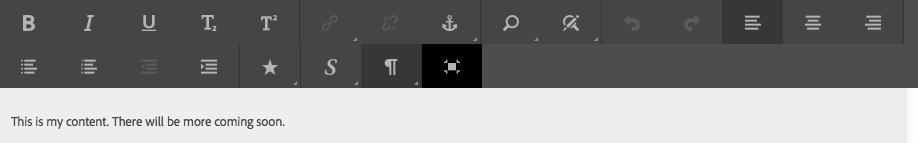

# Configure the Rich Text Editor {#configure-the-rich-text-editor}

O Editor de Rich Text (RTE) fornece aos autores uma ampla variedade de funcionalidades para editar seu conteúdo de texto. Ícones, caixas de seleção, barra de ferramentas e menus são fornecidos para uma experiência de edição de texto WYSIWYG.

O RTE pode ser configurado para ativar, desativar e estender os recursos disponíveis nos componentes de criação. Para saber como usar os recursos do RTE para criação, consulte [Usar o Editor de Rich Text para criação](/help/sites-authoring/rich-text-editor.md).

O fluxo de trabalho a seguir ilustra uma ordem recomendada para a conclusão das tarefas de configuração do RTE.


*Figura: Sequência de etapas para saber como configurar o RTE*

## Entenda a interface habilitada para toque e a interface clássica {#understand-touch-enabled-ui-and-classic-ui}

A interface habilitada para toque é a interface de usuário padrão do AEM. A Adobe introduziu a interface do usuário para toque com design [](/help/sites-authoring/responsive-layout.md) responsivo para o ambiente de criação. A interface do usuário de toque foi projetada para dispositivos de toque e desktop. A interface do usuário é consideravelmente diferente da interface clássica original.


*Figura: Barra de ferramentas do Editor de Rich Text na interface habilitada para toque*


*Figura: Barra de ferramentas do Editor de Rich Text na interface clássica*

>[!MORELIKETHIS]
>
>* [Recomendações da interface do usuário](/help/sites-deploying/ui-recommendations.md)
>* Sobre a substituição da interface clássica, consulte Notas de versão do [AEM 6.5](/help/release-notes/deprecated-removed-features.md)
>* Para obter a diferença entre as interfaces de usuário, consulte Interface de usuário [sensível ao toque e Interface clássica](https://aemcq5pedia.wordpress.com/2018/01/05/touch-enabled-ui-aem6-3/)
>* Para entender a interface habilitada para toque em detalhes, consulte [Conceitos da interface do usuário de toque do AEM](/help/sites-developing/touch-ui-concepts.md)


## Vários modos de edição {#editingmodes}

Os autores podem criar e editar conteúdo textual no AEM usando os diferentes modos de componentes. As opções da barra de ferramentas para criação e formatação de conteúdo e a experiência do usuário dos componentes habilitados para RTE em diferentes modos de edição variam com base nas configurações do RTE.

| Modo de edição | Área de edição | Recursos recomendados a serem ativados | Interface do usuário de toque | Interface do usuário clássica |
|--- |--- |--- |--- |--- |
| Inline | Edição no local para edições rápidas e secundárias; Formatar sem abrir uma caixa de diálogo | Recursos mínimos do RTE | S | S |
| RTE tela cheia | Cobre a página inteira | Todos os recursos RTE necessários | S | N |
| Caixa de diálogo | Caixa de diálogo sobre o conteúdo da página, mas não cobre a página inteira | Todos os recursos do RTE necessários na interface clássica; habilite criteriosamente os recursos na interface do usuário de toque | S | S |
| Tela cheia da caixa de diálogo | Igual ao modo de tela cheia; contém campos da caixa de diálogo ao lado do RTE | Todos os recursos RTE necessários | S | N |

>[!NOTE]
>
>O recurso de edição de origem não está disponível no modo de edição em linha na interface habilitada para toque. Não é possível arrastar imagens no modo de tela cheia. Todos os outros recursos funcionam em todos os modos.

### Edição em linha {#inline-editing}

Quando aberto (com um toque/clique duplo lento), o conteúdo pode ser editado dentro da página. Uma barra de ferramentas compacta com opções muito básicas é apresentada.


*Figura: Edição em linha com barra de ferramentas básica na interface habilitada para toque*

Na interface clássica, um clique duplo lento no componente permite a edição em linha e um contorno laranja destaca o conteúdo. Se o Localizador de conteúdo estiver aberto, uma barra de ferramentas com as opções de formatação RTE disponíveis será exibida na parte superior da janela. Se o Localizador de conteúdo não estiver aberto, as opções de formatação não serão exibidas e você só poderá fazer edições de texto básicas.

### Full screen editing {#full-screen-editing}

Os componentes do AEM podem ser abertos na exibição em tela cheia que oculta o conteúdo da página e ocupa a tela disponível. Considere a edição em tela cheia de uma versão detalhada da edição em linha, já que ela oferece as opções de edição mais avançadas. Para abri-lo, clique em , na barra de ferramentas compacta, ao usar o modo de edição em linha.

No modo de tela cheia da caixa de diálogo, juntamente com uma barra de ferramentas RTE detalhada, as opções e os componentes disponíveis em uma caixa de diálogo também estão disponíveis. É aplicável somente para uma caixa de diálogo que contém o RTE junto com outros componentes.



*Figura: A barra de ferramentas RTE detalhada ao editar no modo de tela cheia na interface habilitada para toque*

### Edição de diálogo {#dialog-editing}

Quando um componente é clicado duas vezes, uma caixa de diálogo é aberta para edição do conteúdo. A caixa de diálogo é aberta na parte superior da página existente. Em alguns cenários específicos, a caixa de diálogo é aberta como uma janela pop-up. Por exemplo, quando um componente de Texto faz parte de uma coluna em um layout de página de várias colunas e a área disponível para a caixa de diálogo é menor.


*Figura: Modo de edição de diálogo na interface habilitada para toque*


*Figura: Caixa de diálogo na interface clássica que contém a barra de ferramentas detalhada para edição*

## Sobre plug-ins RTE e os recursos associados {#aboutplugins}

A funcionalidade é disponibilizada por meio de uma série de plug-ins, cada um com:

* Uma `features` propriedade:

   * Usado para ativar ou desativar a funcionalidade básica desse plug-in
   * Isso pode ser configurado usando um procedimento padronizado

* Quando apropriado, propriedades e opções adicionais que exijam configuração especializada.

Os recursos básicos do RTE são ativados ou desativados pelo valor da `features` propriedade em um nó específico ao plug-in adequado.

A tabela a seguir lista os plug-ins atuais, mostrando:

* IDs de plug-in com um link para a documentação da API. A ID é usada como o nome do nó ao [ativar um plug-in](/help/sites-administering/configure-rich-text-editor-plug-ins.md#activateplugin).
* Valores permitidos para a `features` propriedade.
* Uma descrição da funcionalidade fornecida pelo plug-in.


| ID do plug-in | feições | Descrição |
|--- |--- |--- |
| editar | copiar colar - padrão colar - texto simples colar-pasta-pasta-wordhtml | [Corte, copie e, os três modos](/help/sites-administering/configure-rich-text-editor-plug-ins.md#textstyles)de colagem. |
| [findreplace](https://helpx.adobe.com/experience-manager/6-5/sites/developing/using/reference-materials/widgets-api/index.html?class=CQ.form.rte.plugins.FindReplacePlugin) | localizar substituição | Localize e substitua. |
| [format](https://helpx.adobe.com/experience-manager/6-5/sites/developing/using/reference-materials/widgets-api/index.html?class=CQ.form.rte.plugins.FormatPlugin) | negrito itálico sublinhado | [Formatação](/help/sites-administering/configure-rich-text-editor-plug-ins.md#textstyles)de texto básica. |
| [image](https://helpx.adobe.com/experience-manager/6-5/sites/developing/using/reference-materials/widgets-api/index.html?class=CQ.form.rte.plugins.ImagePlugin) | imagem | Suporte básico a imagens (arraste do conteúdo ou do Localizador de conteúdo). Dependendo do navegador, o suporte tem comportamentos diferentes para autores |
| [teclas](https://helpx.adobe.com/experience-manager/6-5/sites/developing/using/reference-materials/widgets-api/index.html?class=CQ.form.rte.plugins.KeyPlugin) |  | Para definir esse valor, consulte o tamanho [da](/help/sites-administering/configure-rich-text-editor-plug-ins.md#tabsize)guia. |
| [justify](https://helpx.adobe.com/experience-manager/6-5/sites/developing/using/reference-materials/widgets-api/index.html?class=CQ.form.rte.plugins.JustifyPlugin) | justificativa justificativa justificativa | Alinhamento de parágrafo. |
| [links](https://helpx.adobe.com/experience-manager/6-5/sites/developing/using/reference-materials/widgets-api/index.html?class=CQ.form.rte.plugins.LinkPlugin) | modiylink desvincular âncora | [Hiperlinks e âncoras](/help/sites-administering/configure-rich-text-editor-plug-ins.md#linkstyles). |
| [lists](https://helpx.adobe.com/experience-manager/6-5/sites/developing/using/reference-materials/widgets-api/index.html?class=CQ.form.rte.plugins.ListPlugin) | recuo não ordenado recuado pedido | Esse plug-in controla tanto o [recuo quanto as listas](/help/sites-administering/configure-rich-text-editor-plug-ins.md#indentmargin); incluindo listas aninhadas. |
| [miscelânea](https://helpx.adobe.com/experience-manager/6-5/sites/developing/using/reference-materials/widgets-api/index.html?class=CQ.form.rte.plugins.MiscToolsPlugin) | sourceedit de especialistas | Ferramentas diversas permitem que os autores digitem caracteres [](/help/sites-administering/configure-rich-text-editor-plug-ins.md#spchar) especiais ou editem a fonte HTML. Além disso, você pode adicionar um [intervalo completo de caracteres](/help/sites-administering/configure-rich-text-editor-plug-ins.md#definerangechar) especiais se desejar definir sua própria lista. |
| Paraformat | paraformat | Os formatos de parágrafo padrão são Parágrafo, Cabeçalho 1, Cabeçalho 2 e Cabeçalho 3 (`<p>`, `<h1>`, `<h2>`e `<h3>`). É possível [adicionar mais formatos](/help/sites-administering/configure-rich-text-editor-plug-ins.md#paraformats) de parágrafo ou estender a lista. |
| verificação ortográfica | checktext | [Verificador ortográfico](/help/sites-administering/configure-rich-text-editor-plug-ins.md#adddict)com reconhecimento de idioma. |
| estilos | estilos | Suporte para estilização usando uma classe CSS. [Adicione novos estilos](/help/sites-administering/configure-rich-text-editor-plug-ins.md#textstyles) de texto se desejar adicionar (ou estender) seu próprio intervalo de estilos para uso com texto. |
| subsobrescrito | sobrescrito subscrito | Extensões para os formatos básicos, adicionando sub e super scripts. |
| tabela | tabela removível inserir removerow inserir coluna removecolumn cellprops mergecells splitcell seletoroselecionar colunas | Consulte [configurar estilos](/help/sites-administering/configure-rich-text-editor-plug-ins.md#tablestyles)de tabela, se desejar adicionar seus próprios estilos para tabelas inteiras ou células individuais. |
| desfazer | desfazer refazer | Tamanho do histórico das operações [desfazer e refazer](/help/sites-administering/configure-rich-text-editor-plug-ins.md#undohistory) . |

>[!NOTE]
>
>O plug-in de tela cheia não é suportado no modo de diálogo. Use a configuração `dialogFullScreen` para configurar a barra de ferramentas para o modo de tela cheia.

## Entenda os caminhos e locais de configuração {#understand-the-configuration-paths-and-locations}

O [modo de edição do RTE (e a interface do usuário)](#editingmodes) que você fornece aos autores decide o local dos detalhes de configuração quando você está [ativando os plug-ins](/help/sites-administering/configure-rich-text-editor-plug-ins.md#activateplugin)do RTE:

| Modo de edição | Localização para a interface de toque | Localização para a interface clássica |
|---|---|---|
| Inline | `cq:editConfig/cq:inplaceEditing` | `cq:editConfig/cq:inplaceEditing` |
| Tela cheia | `cq:editConfig/cq:inplaceEditing` | Não aplicável |
| Caixa de diálogo | `cq:dialog` | `dialog` |
| Caixa de diálogo Tela cheia | `cq:dialog` | Não aplicável |

>[!NOTE]
>
>Não nomeie o nó `cq:inplaceEditing` como `config`. No `cq:inplaceEditing` nó, defina as seguintes propriedades:
>* **Nome**: `configPath`
>* **Tipo**: `String`
>* **Valor**: caminho do nó que contém a configuração real
>
>
Não nomeie o nó de configuração RTE como `config`. Caso contrário, as configurações do RTE terão efeito apenas para os administradores e não para os usuários do grupo `content-author`.

Configure as seguintes propriedades que se aplicam no modo de edição de Diálogo somente na interface de usuário de toque:

* `useFixedInlineToolbar`: Defina essa propriedade Booliana definida no nó RTE (um com sling:resourceType= `cq/gui/components/authoring/dialog/richtext`) como `True`, para que a barra de ferramentas RTE seja corrigida em vez de flutuante.

   Quando essa propriedade é verdadeira, a edição de Richtext é, por padrão, iniciada no evento &quot;base-contentloaded&quot;.

   Para evitar isso, defina a propriedade `customStart` como `True`e dispare o evento &#39;início-da-taxa&#39; para iniciar a edição do RTE. Quando essa propriedade for &#39;true&#39;, o comportamento padrão, iniciar na hora do clique, não funcionará.

* `customStart`: Defina essa propriedade Booliana definida no nó RTE como `True`, para controlar quando iniciar o RTE acionando o evento `rte-start`.

* `rte-start`: Acionar esse evento no RTE, quando iniciar a edição `contenteditable-div` do RTE. Isso funciona somente se `customStart` tiver sido definido como verdadeiro.

Quando o RTE é usado na caixa de diálogo habilitada para toque, a definição da propriedade `useFixedInlineToolbar` como true é obrigatória para evitar problemas.

## Ativar funcionalidades do RTE ativando plug-ins {#enable-rte-functionalities-by-activating-plug-ins}

As funcionalidades do RTE são disponibilizadas por meio de uma série de plug-ins, cada um com a propriedade features. Você pode configurar a propriedade features para ativar ou desativar os vários recursos de cada plug-in.

Para obter configurações detalhadas dos plug-ins RTE, consulte [como ativar e configurar os plug-ins](/help/sites-administering/configure-rich-text-editor-plug-ins.md)RTE.

**Amostra**: Baixe [esta configuração](/help/sites-administering/assets/rte-sample-all-features-enabled-10.zip) de amostra que ilustra como configurar o RTE. Neste pacote, todos os recursos estão ativados.

>[!NOTE]
>
>O componente [de texto Componentes](https://docs.adobe.com/content/help/en/experience-manager-core-components/using/components/text.html#the-text-component-and-the-rich-text-editor) principais permite que os editores de modelo configurem muitos plug-ins RTE em uma GUI como políticas de conteúdo, eliminando a necessidade de configuração técnica. As políticas de conteúdo podem funcionar com configurações de interface do usuário do RTE, conforme descrito neste documento.
>
>Para obter mais informações, consulte a seção Configurações da interface do usuário do [RTE e políticas](/help/sites-administering/rich-text-editor.md) de conteúdo deste documento, bem como [Criar modelos](/help/sites-authoring/templates.md) de página e a documentação [do desenvolvedor dos Componentes](https://docs.adobe.com/content/help/en/experience-manager-core-components/using/developing/developing.html)principais.

>[!NOTE]
>
>Para fins de referência, os componentes de Texto padrão (fornecidos como parte de uma instalação padrão) podem ser encontrados em:
>
>* `/libs/wcm/foundation/components/text`
>* `/libs/foundation/components/text`
>
>
Para criar seu próprio componente de texto, copie o componente acima em vez de editar esses componentes.

## Configurar a barra de ferramentas RTE {#dialogfullscreen}

O AEM permite que você configure a interface para o Editor de Rich Text de forma diferente para os diferentes modos de edição. As configurações padrão são fornecidas abaixo. É possível substituir esses padrões com base em seus requisitos. Personalize apenas os recursos da barra de ferramentas que deseja fornecer aos seus autores. Não é necessário especificar todas as configurações da barra de ferramentas.

Para configurar a barra de ferramentas para `dialogFullScreen`, use a seguinte configuração de amostra.

```java
<uiSettings jcr:primaryType="nt:unstructured">
  <cui jcr:primaryType="nt:unstructured">
    <inline
      jcr:primaryType="nt:unstructured"
      toolbar="[format#bold,format#italic,format#underline,#justify,#lists,links#modifylink,links#unlink,#paraformat]">
      <popovers jcr:primaryType="nt:unstructured">
        <justify
          jcr:primaryType="nt:unstructured"
          items="[justify#justifyleft,justify#justifycenter,justify#justifyright,justify#justifyjustify]"
          ref="justify"/>
        <lists
          jcr:primaryType="nt:unstructured"
          items="[lists#unordered,lists#ordered,lists#outdent,lists#indent]"
          ref="lists"/>
        <paraformat
          jcr:primaryType="nt:unstructured"
          items="paraformat:getFormats:paraformat-pulldown"
          ref="paraformat"/>
      </popovers>
    </inline>
    <dialogFullScreen
      jcr:primaryType="nt:unstructured"
      toolbar="[format#bold,format#italic,format#underline,justify#justifyleft,justify#justifycenter,justify#justifyright,justify#justifyjustify,lists#unordered,lists#ordered,lists#outdent,lists#indent,links#modifylink,links#unlink,table#createoredit,#paraformat,image#imageProps]">
      <popovers jcr:primaryType="nt:unstructured">
        <paraformat
          jcr:primaryType="nt:unstructured"
          items="paraformat:getFormats:paraformat-pulldown"
          ref="paraformat"/>
      </popovers>
    </dialogFullScreen>
    <tableEditOptions
      jcr:primaryType="nt:unstructured"
      toolbar="[table#insertcolumn-before,table#insertcolumn-after,table#removecolumn,-,table#insertrow-before,table#insertrow-after,table#removerow,-,table#mergecells-right,table#mergecells-down,table#mergecells,table#splitcell-horizontal,table#splitcell-vertical,-,table#selectrow,table#selectcolumn,-,table#ensureparagraph,-,table#modifytableandcell,table#removetable,-,undo#undo,undo#redo,-,table#exitTableEditing,-]">
    </tableEditOptions>
  </cui>
</uiSettings>
```

Diferentes configurações de interface são usadas para o modo em linha e para o modo de tela cheia. A propriedade da barra de ferramentas é usada para especificar os botões da barra de ferramentas.

Por exemplo, se o botão for um recurso (por exemplo, `Bold`), ele será especificado como `PluginName#FeatureName` (por exemplo, `links#modifylink`).

Se o botão for um pop-up (contendo alguns recursos de um plug-in), ele será especificado como `#PluginName` (por exemplo, `#format`).

Os separadores (`|`) entre um grupo de botões podem ser especificados com `-`.

O nó pop-up no modo em linha ou em tela cheia contém uma lista das opções que estão sendo usadas. Cada nó filho sob o nó &#39;propovers&#39; é nomeado após o plug-in (por exemplo, format). Ela tem uma propriedade &quot;items&quot; que contém uma lista de recursos do plug-in (por exemplo, format#bold).

## Configurações e políticas de conteúdo da interface do usuário do RTE {#rtecontentpolicies}

Os administradores podem controlar as opções de RTE usando políticas de conteúdo, digamos, em vez de fazer a configuração conforme descrito acima. As políticas de conteúdo definem as propriedades de design de um componente quando usadas como parte de um modelo [](/help/sites-authoring/templates.md)editável. Por exemplo, se um componente de texto que usa o RTE for usado com um modelo editável, a política de conteúdo poderá definir que a opção em negrito esteja disponível e algumas opções de formatação de parágrafo estarão disponíveis. As políticas de conteúdo são reutilizáveis e podem ser aplicadas em vários modelos.

As opções disponíveis no RTE fluem downstream das configurações da interface do usuário para as políticas de conteúdo.

* As configurações da interface do usuário definem quais opções estão disponíveis para as políticas de conteúdo.
* Se a configuração da interface do usuário do RTE tiver sido removida ou não ativar um item, a política de conteúdo não poderá configurá-lo.
* Um autor tem acesso apenas à funcionalidade que é disponibilizada pelas configurações da interface do usuário e pelas políticas de conteúdo.

Como exemplo, você pode ver a documentação [do Componente principal de](https://docs.adobe.com/help/en/experience-manager-core-components/using/components/text.html#the-text-component-and-the-rich-text-editor)texto.

## Personalizar o mapeamento entre ícones e comandos da barra de ferramentas {#iconstoolbar}

Você pode personalizar o mapeamento entre os ícones Corais exibidos na barra de ferramentas RTE e os comandos disponíveis. Não é possível usar outros ícones além dos ícones Corais.

1. Crie um nó com o nome `icons` em `uiSettings/cui`.

1. Crie nós para ícones individuais abaixo dele.
1. Em cada um dos nós de ícone individuais, especifique um ícone Coral e um comando para mapear para o ícone.

Abaixo está um trecho de amostra para mapear o comando Negrito para o ícone Coral chamado `textItalic`.

```java
<text jcr:primaryType="nt:unstructured" sling:resourceType="cq/gui/components/authoring/dialog/richtext" name="./text" useFixedInlineToolbar="{Boolean}true">
    <rtePlugins jcr:primaryType="nt:unstructured">
        <format jcr:primaryType="nt:unstructured" features="bold,italic"/>
    </rtePlugins>
    <uiSettings jcr:primaryType="nt:unstructured">
        <cui jcr:primaryType="nt:unstructured">
            <inline jcr:primaryType="nt:unstructured"
                toolbar="[format#bold,format#italic,format#underline,links#modifylink,links#unlink]">
            </inline>
            <icons jcr:primaryType="nt:unstructured">
                <bold jcr:primaryType="nt:unstructured"
                    command="format#bold"
                    icon="textItalic"/>
            </icons>
        </cui>
    </uiSettings>
</text>
```

## Alternar para o Editor de Rich Text CoralUI 2 {#switch-to-coralui-rich-text-editor}

Em uma página, você pode incluir a clientlib do RTE CoralUI 2 ou a clientlib do RTE CoralUI 3. Por padrão, o Editor de Rich Text inclui a clientlib RTE CoralUI 3. Para alternar para o RTE CoralUI 2, execute as seguintes etapas.

>[!NOTE]
>
>A Adobe não o recomenda como uma prática recomendada. Alternar para RTE CoralUI 2 como último recurso. Os plug-ins personalizados para o RTE CoralUI 2 funcionam com o RTE CoralUI 3 se os plug-ins não dependerem dos internos do RTE, como classes.
>
>Se você estiver usando plug-ins personalizados para CoralUI3 RTE, use a `rte.coralui3` biblioteca.


1. Sobreponha o nó `/libs/cq/gui/components/authoring/editors/clientlibs/core` em `/apps`, e faça o seguinte:

   * Replace `rte.coralui3` with `rte.coralui2` for the dependencies property.
   * Replace `cq.authoring.editor.core.inlineediting.rte.coralui3` with `cq.authoring.editor.core.inlineediting.rte.coralui2` for the embed property.
   * Replace `cq.authoring.rte.coralui3` with `cq.authoring.rte.coralui2` for the embed property.

1. Sobreponha os nós `/libs/cq/gui/components/authoring/dialog/richtext/clientlibs/rte/coralui3` e `/libs/cq/gui/components/authoring/dialog/richtext/clientlibs/rte/coralui2` em `/apps`.

   Remova a categoria `cq.authoring.dialog` de `/apps/cq/gui/components/authoring/dialog/richtext/clientlibs/rte/coralui3` e adicione-a a `/apps/cq/gui/components/authoring/dialog/richtext/clientlibs/rte/coralui2`.

1. Altere qualquer outra dependência que esteja sendo incluída na página de `rte.coralui3` para `rte.coralui2`. Por exemplo, depois de sobrepor o nó `/libs/mcm/campaign/components/touch-ui/clientlibs/rte` em `/apps`, altere qualquer dependência dele de `rte.coralui3` para `rte.coralui2`.

1. Sobreponha o nó `cq/ui/widgets` em `/apps`. Substitua a dependência `cq.rte` no nó `/apps/cq/ui/widgets` por `cq.coralui2.rte`.

>[!NOTE]
>
>O RTE CoralUI 2 usa modelos handlebars para caixas de diálogo de plug-in. Portanto, a clientlib do RTE CoralUI 2 tinha uma dependência na clientlib handlebars. O RTE CoralUI 3 não usa modelos handlebars e não tem nenhuma dependência associada. Se os plug-ins personalizados usam modelos handlebars, inclua a clientlib handlebars na sua página da Web.

## Informações adicionais {#further-information}

Para obter mais informações sobre como configurar o RTE, consulte a referência à API [do widget](https://helpx.adobe.com/experience-manager/6-5/sites/developing/using/reference-materials/widgets-api/index.html?class=CQ.form.RichText) AEM.

Em particular, para ver os plug-ins e as opções relacionadas disponíveis:

* O componente [CQ.form.RichText](https://helpx.adobe.com/experience-manager/6-5/sites/developing/using/reference-materials/widgets-api/index.html?class=CQ.form.rte.plugins.Plugin) fornece um campo de formulário para editar informações de texto estilizado (rich text). Para saber todos os parâmetros disponíveis para o formulário Rich Text, consulte as Opções de configuração.
* O componente RichText fornece uma ampla variedade de funcionalidades usando plug-ins listados em [CQ.form.rte.plugins.Plugin](https://helpx.adobe.com/experience-manager/6-5/sites/developing/using/reference-materials/widgets-api/index.html?class=CQ.form.rte.plugins.Plugin). Para cada plug-in:

   * consulte os Recursos para obter detalhes sobre a funcionalidade que pode ser ativada (ou desativada)
   * Consulte as Opções de configuração para ver todos os parâmetros disponíveis para obter a configuração detalhada do plug-in adequado

* Mais informações sobre Regras HTML para links também estão disponíveis.

Eles podem ser usados para estender e personalizar seu próprio RTE. Por exemplo, para listar as âncoras disponíveis na página ao criar um link, você pode fornecer sua própria implementação do `LinkPlugin`.

## Limitações conhecidas {#known-limitations}

O recurso RTE AEM tem as seguintes limitações:

* Os recursos do RTE são suportados apenas nas caixas de diálogo de componentes do AEM. O RTE não é compatível com assistentes ou formulários básicos, como Propriedades [da](/help/sites-developing/page-properties-views.md) página e [Andaime](/help/sites-authoring/scaffolding.md) na interface habilitada para toque.

* O AEM não funciona em dispositivos [](/help/release-notes/known-issues.md)híbridos.

* Não nomeie o nó de configuração RTE `config`. Caso contrário, a configuração do RTE entrará em vigor somente para os administradores e não para os usuários do grupo `content-author`.

* O RTE não oferece suporte a quadros incorporados ou iframe para incorporar conteúdo.

## Best practices and tips {#best-practices-and-tips}

* Ative apenas os plug-ins sem pop-up para uma caixa de diálogo flutuante. Plug-ins sem pop-up são menores e são mais adequados para uma caixa de diálogo flutuante.
* Ative os plug-ins com pop-up maior, como o plug- `Paste` -in, somente no modo de diálogo de tela cheia ou no modo de tela cheia. Plug-ins com pop-up grande precisam de mais espaço físico na tela para fornecer uma boa experiência de criação.
* Se você estiver usando plug-ins personalizados para CoralUI3 RTE, use a `rte.coralui3` biblioteca.

## Solucionar problemas frequentes com o RTE {#troubleshoot-issues-with-aem-rich-text-editor}

**Como selecionar várias células de tabela?**

Para selecionar várias células em uma tabela, pressione `Ctrl` ou `Cmd` a tecla e clique uma por uma nas células da tabela.

Agora, execute a operação na seleção, digamos, defina as propriedades das células selecionadas.

**Os hiperlinks são perdidos ao editar um componente usando o botão Configurar**

Adicione um hiperlink em um componente de texto editando-o usando o botão Configurar. Você pode perder o hiperlink ao editá-lo novamente e validar o hiperlink pela segunda vez.

Uma solução alternativa é clicar no componente de texto quando a caixa de diálogo de edição for exibida na segunda vez e, em seguida, executar a validação do link.

Esse problema é resolvido no AEM 6.3 e posterior.

**O conteúdo HTML adicionado no modo de edição de origem é perdido**

Não adicione um HTML propenso a XSS. O AEM, e não o RTE, pode remover algum conteúdo HTML para aderir às regras de antismo XSS.

Para verificar se o HTML colado está salvo, verifique o conteúdo salvo no CRXDE (no nó de conteúdo).

Se não for salvo, o HTML deverá ter sido removido pelo RTE, pois não aderiu às regras do RTE.

Se for salvo no CRXDE, mas não for renderizado na página (para verificar a renderização, consulte a [visualização](/help/sites-authoring/editing-content.md#preview-mode)da página, ela será removida pelas regras do AEM XSS.

**O componente de vários campos não está funcionando como esperado**

Para criar um componente de vários campos, use a CoralUI 3 exclusivamente. Não use as caixas de diálogo do componente CoralUI 2.

Além disso, verifique se o código de implementação de vários campos e a estrutura do nó estão corretos.

**A configuração disponível para administradores não está disponível para autores**

Se as atualizações das configurações da interface forem refletidas para administradores, mas não para contas do autor, verifique se o nó de configuração não é nomeado `config`. Use a [`configPath` propriedade](/help/sites-developing/components-basics.md#cq-inplaceediting).

>[!MORELIKETHIS]
>
>* [Configurar plug-ins RTE](configure-rich-text-editor-plug-ins.md)
>* [Usar o Editor de Rich Text para criação](../sites-authoring/rich-text-editor.md)
>* [Configurar o RTE para sites acessíveis](rte-accessible-content.md)
>* [Paridade de recursos da interface de usuário de toque e da interface de usuário clássica](../release-notes/touch-ui-features-status.md)
>* [Amostra do tutorial para criar um componente composto de vários campos](https://experience-aem.blogspot.com/2019/05/aem-65-touchui-composite-multifield-with-coral3-rte-rich-text.html)

