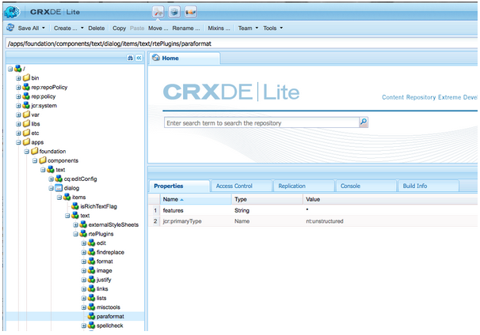

# Configuração do RTE para produção de sites acessíveis {#configuring-rte-for-producing-accessible-sites}

O AEM suporta ambos:

* recursos de acessibilidade padrão, incluindo texto alternativo para imagens
* além dos recursos adicionais que podem ser acessados ao criar conteúdo com componentes que usam o editor de Rich Text (RTE)

Os autores de conteúdo podem usar os recursos do RTE para fornecer informações de acessibilidade ao adicionar conteúdo a uma página. Isso pode incluir a adição de informações estruturais por meio de cabeçalhos e elementos de parágrafo.

Você pode [configurar e personalizar esses recursos configurando plug-ins](#configuring-the-plugin-features) RTE para o componente. Por exemplo, o `paraformat` plug-in permite que você adicione elementos semânticos de nível de bloco adicionais, incluindo a extensão do número de níveis de cabeçalho suportados além do básico `H1`, `H2` e `H3` fornecidos por padrão.

O RTE está disponível em diversos componentes da interface habilitada para toque e clássica. Entretanto, o componente principal para uso do RTE é o componente **Texto** .

O componente de **Texto** no AEM está disponível para as interfaces de usuário habilitadas para toque e clássica. As imagens a seguir mostram o editor de rich text com uma variedade de plug-ins ativados, incluindo `paraformat`:

* O componente **Texto** na interface habilitada para toque:

   

* O componente **Texto** na interface clássica:

   

>[!NOTE]
>
>Há diferenças entre os recursos do RTE disponíveis na interface clássica e na interface habilitada para toque. Para obter mais detalhes, consulte
>
>* [Plug-ins e seus recursos](/help/sites-administering/rich-text-editor.md#aboutplugins)
>* [Plug-ins e seus recursos - Interface habilitada para toque](/help/sites-administering/rich-text-editor.md#aboutplugins)
>


## Configuração dos recursos do plug-in {#configuring-the-plugin-features}

Instruções completas sobre a configuração do RTE estão disponíveis na página [Configuração do Editor](/help/sites-administering/rich-text-editor.md) de Rich Text. Isso abrange todos os problemas, incluindo as etapas principais:

* [Plug-ins e seus recursos](/help/sites-administering/rich-text-editor.md#aboutplugins)
* [Locais de configuração](/help/sites-administering/rich-text-editor.md#understand-the-configuration-paths-and-locations)
* [Ativar um plug-in e configurar a propriedade features](/help/sites-administering/rich-text-editor.md#enable-rte-functionalities-by-activating-plug-ins)
* [Configuração de outra funcionalidade do RTE](/help/sites-administering/rich-text-editor.md#enable-rte-functionalities-by-activating-plug-ins)

Ao configurar um plug-in dentro da `rtePlugins` subramificação apropriada no CRXDE Lite (consulte a imagem a seguir), você pode ativar todos os recursos ou recursos específicos para esse plug-in.



### Exemplo - Especificação de formatos de parágrafo disponíveis no campo de seleção RTE {#example-specifying-paragraph-formats-available-in-rte-selection-field}

Podem ser disponibilizados novos formatos de blocos semânticos para seleção através de:

1. Dependendo do RTE, determine e navegue até o local [da](/help/sites-administering/rich-text-editor.md#understand-the-configuration-paths-and-locations)configuração.
1. [Ativar o campo](/help/sites-administering/rich-text-editor.md)de seleção Parágrafos; ativando [o plug-in](/help/sites-administering/rich-text-editor.md#enable-rte-functionalities-by-activating-plug-ins).
1. [Especifique os formatos que deseja que estejam disponíveis no campo](/help/sites-administering/rich-text-editor.md)de seleção Parágrafos.
1. Os formatos de parágrafo ficam disponíveis para o autor do conteúdo nos campos de seleção no RTE. Eles podem ser acessados:

   * Usando o ícone de rolagem de parágrafo na interface habilitada para toque.
   * Uso do campo **Formatar** (seletor de pop-up) na interface clássica.

Com elementos estruturais disponíveis no RTE por meio das opções de formato de parágrafo, o AEM fornece uma boa base para o desenvolvimento de conteúdo acessível. Os autores de conteúdo não podem usar o RTE para formatar tamanho de fonte ou cores ou outros atributos relacionados, impedindo a criação de formatação em linha. Em vez disso, eles devem selecionar os elementos estruturais apropriados, como cabeçalhos e usar estilos globais escolhidos na opção Estilos. Isso garante uma marcação limpa, maiores opções para usuários que navegam com suas próprias folhas de estilos e conteúdo estruturado corretamente.

## Uso do recurso Editar fonte {#use-of-the-source-edit-feature}

Em alguns casos, os autores de conteúdo acharão necessário examinar e ajustar o código fonte HTML criado usando o RTE. Por exemplo, um conteúdo criado no RTE pode exigir marcação adicional para garantir a conformidade com o WCAG 2.0. Isso pode ser feito com a opção de edição [de](/help/sites-administering/rich-text-editor.md#aboutplugins) origem do RTE. Você pode especificar o [ recurso no `sourceedit` plug-in `misctools`](/help/sites-administering/rich-text-editor.md#aboutplugins).

>[!CAUTION]
>
>Use o `sourceedit` recurso com cuidado. Erros de digitação e/ou recursos não suportados podem causar mais problemas.

## Adicionar suporte para elementos e atributos HTML adicionais {#adding-support-for-additional-html-elements-and-attributes}

Para estender ainda mais os recursos de acessibilidade do AEM, é possível estender os componentes existentes com base no RTE (como os componentes **Texto** e **Tabela** ) com elementos e atributos adicionais.

O procedimento a seguir ilustra como estender o componente **Tabela** com um elemento **Legenda** que fornece informações sobre uma tabela de dados para usuários de tecnologia assistiva:

### Exemplo - Adicionar a legenda à caixa de diálogo Propriedades da tabela {#example-adding-the-caption-to-the-table-properties-dialog}

No construtor da legenda, adicione um campo de entrada de texto adicional que seja usado para editar a legenda. `TablePropertiesDialog` Observe que `itemId` deve ser definido como `caption` (ou seja, o nome do atributo DOM) para manipular automaticamente seu conteúdo.

Na **Tabela** , você deve definir ou remover explicitamente o atributo de/para o elemento DOM. O valor é transmitido pela caixa de diálogo no `config` objeto. Observe que os atributos DOM devem ser definidos/removidos usando os `CQ.form.rte.Common` métodos correspondentes ( `com` é um atalho para `CQ.form.rte.Common`) para evitar armadilhas comuns com as implementações do navegador.

>[!NOTE]
>
>Este procedimento é adequado apenas para a interface clássica.

### Instruções passo a passo {#step-by-step-instructions}

1. Inicie o CRXDE Lite. Por exemplo: [http://localhost:4502/crx/de/](http://localhost:4502/crx/de/)
1. Copiar:

   `/libs/cq/ui/widgets/source/widgets/form/rte/commands/Table.js`

   para:

   `/apps/cq/ui/widgets/source/widgets/form/rte/commands/Table.js`

   >[!NOTE]
   >
   >Talvez seja necessário criar pastas intermediárias se elas ainda não existirem.

1. Copiar:

   `/libs/cq/ui/widgets/source/widgets/form/rte/plugins/TablePropertiesDialog.js`

   para:

   `/apps/cq/ui/widgets/source/widgets/form/rte/plugins/TablePropertiesDialog.js`.

1. Abra o arquivo a seguir para edição (abra com um clique duplo):

   `/apps/cq/ui/widgets/source/widgets/form/rte/plugins/TablePropertiesDialog.js`

1. No `constructor` método, antes da leitura da linha:

   ```
   var dialogRef = this;
   ```

   Adicione o seguinte código:

   ```
   editItems.push({
       "itemId": "caption",
       "name": "caption",
       "xtype": "textfield",
       "fieldLabel": CQ.I18n.getMessage("Caption"),
       "value": (this.table && this.table.caption ? this.table.caption.textContent : "")
   });
   ```

1. Abra o seguinte arquivo:

   `/apps/cq/ui/widgets/source/widgets/form/rte/commands/Table.js`.

1. Adicione o seguinte código no final do `transferConfigToTable` método:

   ```
   /**
    * Adds Caption Element
   
*/
   var captionElement;

   if (dom.firstChild && dom.firstChild.tagName.toLowerCase() == "caption")

   {
      captionElement = dom.firstChild;
   }
   if (config.caption)
   {
       var captionTextNode = document.createTextNode(config.caption)
       if (captionElement)
       {
          dom.replaceNode(captionElement.firstChild,captionTextNode);

       } else
       {
           captionElement = document.createElement("caption");
           captionElement.appendChild(captionTextNode);
           if (dom.childNodes.length>0)
           {
              dom.insertBefore(captionElement, dom.firstChild);
           } else
           {
              dom.appendChild(captionElement);
           }
       }
   } else if (captionElement)

   {
     dom.removeChild(captionElement);
   }
   ```

1. Salvar suas alterações usando **Salvar tudo...**

>[!NOTE]
>
>Um campo de texto sem formatação não é o único tipo de entrada permitido para o valor do elemento de legenda. Qualquer widget ExtJS, que fornece o valor da legenda por meio de seu `getValue()` método, pode ser usado.
>
>Para adicionar recursos de edição para outros elementos e atributos adicionais, verifique se ambos:
>
>* A `itemId` propriedade para cada campo correspondente é definida como o nome do atributo DOM (`TablePropertiesDialog`) apropriado.
>* O atributo é definido e/ou removido no elemento DOM explicitamente (`Table`).


>[!MORELIKETHIS]
>
>* [Guia rápido para WCAG 2.0](/help/managing/qg-wcag.md)
>* [Criação de conteúdo acessível (conformidade com WCAG 2.0)](/help/sites-authoring/creating-accessible-content.md)

