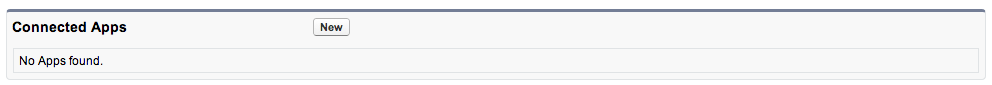
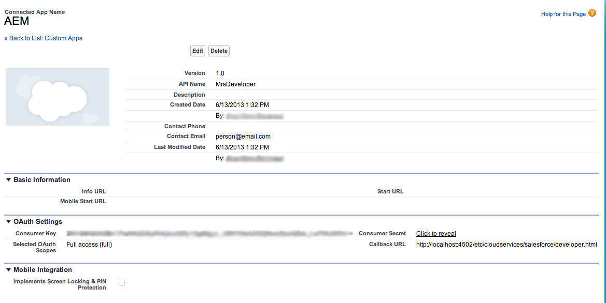

# Integração com o Salesforce {#integrating-with-salesforce}

A integração do Salesforce com o AEM fornece recursos de gerenciamento de clientes potenciais e aproveita os recursos existentes fornecidos imediatamente pelo Salesforce. Você pode configurar AEM para publicar leads no Salesforce e criar componentes que acessam dados diretamente do Salesforce.

A integração bidirecional e extensível entre o AEM e o Salesforce permite:

* Organizações para usar e atualizar totalmente os dados e aprimorar a experiência do cliente.
* Envolvimento do marketing para atividades de vendas.
* Organizações para transmitir e receber dados automaticamente de um armazenamento de dados do Salesforce.

Este documento descreve o seguinte:

* como configurar o Salesforce Cloud Services (configurar AEM para integrar com o Salesforce).
* como usar as informações de lead/contato do Salesforce no ClientContext e para personalização.
* como usar o modelo de fluxo de trabalho do Salesforce para publicar AEM usuários como leva ao salesforce.
* como criar um componente que mostre dados do Salesforce.

## Configuração de AEM para integração com o Salesforce {#configuring-aem-to-integrate-with-salesforce}

Para configurar AEM para integrar com o Salesforce, primeiro é necessário configurar um aplicativo de acesso remoto no Salesforce. Em seguida, configure o serviço de nuvem do salesforce para apontar para esse aplicativo de acesso remoto.

>[!NOTE]
>
>Você pode criar uma conta gratuita de desenvolvedor no Salesforce.

Para configurar AEM para integrar com o Salesforce:

>[!CAUTION]
>
>É necessário instalar o [API do Salesforce Force](https://experience.adobe.com/#/downloads/content/software-distribution/en/aem.html?fulltext=salesforce*&amp;orderby=%40jcr%3Acontent%2Fjcr%3AlastModified&amp;orderby.sort=desc&amp;layout=list&amp;p.offset=0&amp;p.limit=1&amp;package=%2Fcontent%2Fsoftware-distribution%2Fen%2Fdetails.html%2Fcontent%2Fdam%2Faem%2Fpublic%2Fadobe%2Fpackages%2Fcq650%2Ffeaturepack%2Fcom.adobe.cq.mcm.salesforce.content) pacote de integração antes de continuar com o procedimento. Para obter mais detalhes sobre como trabalhar com pacotes, consulte o [Como trabalhar com pacotes](/help/sites-administering/package-manager.md#package-share) página.

1. Em AEM, navegue até **Cloud Services**. Em Serviços de terceiros, clique em **Configurar agora** em **Salesforce**.

   

1. Crie uma nova configuração, por exemplo, **desenvolvedor**.

   >[!NOTE]
   >
   >A nova configuração redireciona para uma nova página: **http://localhost:4502/etc/cloudservices/salesforce/developer.html**. Esse é exatamente o mesmo valor que você precisa especificar no URL de retorno ao criar o aplicativo de acesso remoto no Salesforce. Esses valores devem corresponder.

1. Faça logon na conta do salesforce (ou, se não tiver uma), crie uma em [https://developer.force.com](https://developer.force.com).)
1. No Salesforce, navegue até **Criar** > **Aplicativos** para obter **Aplicativos conectados** (em versões anteriores do salesforce, o fluxo de trabalho era **Implantar** > **Acesso remoto**).
1. Clique em **Novo** para conectar AEM com o Salesforce.

   

1. Insira o **Nome do aplicativo conectado**, **Nome da API** e **E-mail de contato**. Selecione o **Ativar as configurações do OAuth** e digite o **URL de retorno** e adicionar um escopo OAuth (por exemplo, acesso completo). A URL de retorno de chamada é semelhante a: `http://localhost:4502/etc/cloudservices/salesforce/developer.html`

   Altere o nome do servidor/número da porta e o nome da página para corresponder à sua configuração.

   

1. Clique em **Salvar** para salvar a configuração do salesforce. O Salesforce cria um **consumer key** e **consumer secret**, que você precisa para AEM configuração.

   

   >[!NOTE]
   >
   >Talvez seja necessário aguardar vários minutos (até 15 minutos) para que o aplicativo de acesso remoto no Salesforce seja ativado.

1. Em AEM, navegue até **Cloud Services** e navegue até a configuração do salesforce criada anteriormente (por exemplo, **desenvolvedor**). Clique em **Editar** e insira a chave do cliente e o segredo do cliente em salesforce.com.

   

   | URL de login | Este é o Ponto de Extremidade da Autorização do Salesforce. Seu valor é pré-preenchido e serve a maioria dos casos. |
   |---|---|
   | Chave do cliente | Insira o valor obtido na página Registro de aplicativo de acesso remoto em salesforce.com |
   | Segredo do cliente | Insira o valor obtido na página Registro de aplicativo de acesso remoto em salesforce.com |

1. Clique em **Conectar-se ao Salesforce** para se conectar. O Salesforce solicita que você permita que sua configuração se conecte ao salesforce.

   

   No AEM, uma caixa de diálogo de confirmação é aberta informando que você se conectou com êxito.

1. Navegue até a página raiz do seu site e clique em **Propriedades da página**. Em seguida, selecione **Cloud Services** e adicionar **Salesforce** e selecione a configuração correta (por exemplo, **desenvolvedor**).

   

   Agora você pode usar o modelo de fluxo de trabalho para publicar leads no Salesforce e criar componentes que acessam dados do Salesforce.

## Exportar usuários AEM como leads do Salesforce {#exporting-aem-users-as-salesforce-leads}

Se quiser exportar um usuário AEM como um cliente potencial do salesforce, é necessário configurar o fluxo de trabalho para publicar leads no salesforce.

Para exportar AEM usuários como o Salesforce leva:

1. Navegue até o fluxo de trabalho do Salesforce em `http://localhost:4502/workflow` clicando com o botão direito do mouse no workflow **Exportação do Salesforce.com** e clicando em **Iniciar**.

   

1. Selecione o usuário AEM que deseja criar como lead como **Carga** para este workflow (inicial -> usuários). Certifique-se de selecionar o nó do perfil do usuário, pois ele contém informações como **givenName**, **familyName** e assim por diante, que são mapeados para o lead do Salesforce **FirstName** e **LastName** campos.

   

   >[!NOTE]
   >
   >Antes de iniciar esse workflow, há determinados campos obrigatórios que um nó de lead no AEM deve ter antes de ser publicado no Salesforce. Estes **givenName**, **familyName**, **empresa** e **email**. Para ver uma lista completa de mapeamento entre AEM usuário e o lead do Salesforce, consulte [Configuração de mapeamento entre AEM usuário e o cliente potencial do Slaesforce.](#mapping-configuration-between-aem-user-and-salesforce-lead)

1. Clique em **OK**. As informações do usuário são exportadas para o salesforce.com. Você pode verificá-lo em salesforce.com.

   >[!NOTE]
   >
   >Os registros de erro mostrarão se um lead é importado. Verifique o log de erros para obter mais informações.

### Configuração do fluxo de trabalho de exportação do Salesforce.com {#configuring-the-salesforce-com-export-workflow}

Talvez seja necessário configurar o fluxo de trabalho de exportação do Salesforce.com para corresponder à configuração correta do Salesforce.com ou fazer outras alterações.

Para configurar o workflow de exportação do Salesforce.com:

1. Vá até `http://localhost:4502/cf#/etc/workflow/models/salesforce-com-export.html.`

   

1. Abra a etapa Exportação do Salesforce.com , selecione o **Argumentos** e selecione a configuração correta que está selecionada e clique em **OK**. Além disso, se desejar que o workflow recrie um lead que foi excluído no Salesforce, marque a caixa de seleção .

   

1. Clique em **Salvar** para salvar as alterações.

   

### Configuração de mapeamento entre AEM usuário e líder do Salesforce {#mapping-configuration-between-aem-user-and-salesforce-lead}

Para exibir ou editar a configuração de mapeamento atual entre um usuário AEM e um lead do Salesforce, abra o Gerenciador de Configuração: `https://<hostname>:<port>/system/console/configMgr` e procurar **Configuração de mapeamento de leads do Salesforce**.

1. Abra o Configuration Manager clicando em **Console da Web** ou ir diretamente para `https://<hostname>:<port>/system/console/configMgr.`
1. Procurar por **Configuração de mapeamento de leads do Salesforce**.

   

1. Altere os mapeamentos, conforme necessário. O mapeamento padrão segue o padrão **aemUserAttribute=sfLeadAttribute**. Clique em **Salvar** para salvar as alterações.

## Configuração do Salesforce Client Context Store {#configuring-salesforce-client-context-store}

O repositório de contexto do cliente do salesforce mostra informações adicionais sobre o usuário conectado no momento em relação ao que já está disponível no AEM. Ele extrai essas informações adicionais do Salesforce, dependendo da conexão do usuário com o Salesforce.

Para fazer isso, você precisa configurar o seguinte:

1. Vincule um usuário do AEM com uma ID do Salesforce por meio do componente Conexão do Salesforce .
1. Adicione os Dados de perfil do Salesforce na página de contexto do cliente para configurar quais propriedades você deseja ver.
1. (Opcional) Crie um segmento que use os dados do Salesforce Client Context Store.

### Vincular um usuário do AEM com uma ID do Salesforce {#linking-an-aem-user-with-a-salesforce-id}

Você precisa mapear um usuário AEM com uma ID do Salesforce para carregá-la no contexto do cliente. Em um cenário real, você estaria vinculando com base em dados conhecidos do usuário com a validação. Para fins de demonstração, neste procedimento, você usa a variável **Salesforce Connect** componente.

1. Navegue até um site da Web em AEM, faça logon e arraste e solte o **Salesforce Connect** componente do sidekick.

   >[!NOTE]
   >
   >Se a variável **Salesforce Connect** não está disponível, vá para **Design** e selecione-o para torná-lo disponível em **Editar** exibir.

   

   Quando você arrasta o componente para a página, ele é exibido **Link para Salesforce=Off**.

   

   >[!NOTE]
   >
   >Este componente é somente para fins de demonstração. Para cenários do mundo real, haveria outro processo para vincular/combinar usuários com leads.

1. Depois de arrastar o componente na página, abra-o para configurá-lo. Selecione a configuração, o tipo de contato e o lead ou contato do Salesforce e clique em **OK**.

   

   AEM vincula o usuário ao contato ou ao cliente potencial do Salesforce.

   

### Adicionar dados do Salesforce ao contexto do cliente {#adding-salesforce-data-to-client-context}

Você pode carregar dados do usuário do Salesforce no Contexto do Cliente para usar na personalização:

1. Abra o contexto de cliente que deseja estender navegando até ele, por exemplo, `http://localhost:4502/etc/clientcontext/default/content.html.`

   

1. Arraste o **Dados de perfil do Salesforce** para o contexto do cliente.

   

1. Clique duas vezes no componente para abri-lo. Selecionar **Adicionar item** e selecione uma propriedade na lista suspensa. Adicione quantas propriedades desejar e selecione **OK**.

   

1. Agora, você vê propriedades específicas do Salesforce exibidas no contexto do cliente.

   

### Criar um segmento usando dados do Salesforce Client Context Store {#building-a-segment-using-data-from-salesforce-client-context-store}

Você pode criar um segmento que usa dados do Salesforce Client Context Store. Para fazer isso:

1. Navegue até a segmentação no AEM acessando **Ferramentas** > **Segmentação** ou indo para [http://localhost:4502/miscadmin#/etc/segmentation](http://localhost:4502/miscadmin#/etc/segmentation).
1. Crie ou atualize um segmento para incluir dados do Salesforce. Para obter mais informações, consulte [Segmentação](/help/sites-administering/campaign-segmentation.md).

## Pesquisando leads {#searching-leads}

AEM vem com um componente de pesquisa de amostra que pesquisa leads no Salesforce de acordo com os critérios especificados. Esse componente mostra como usar a API REST do Salesforce para procurar objetos do salesforce. Você precisa vincular uma página com uma configuração do Salesforce para acionar uma chamada para salesforce.com.

>[!NOTE]
>
>Este é um componente de amostra que mostra como usar a API REST do Salesforce para consultar objetos do Salesforce. Use-o como exemplo para criar componentes mais complexos com base em suas necessidades.

Para usar este componente:

1. Navegue até a página onde deseja usar essa configuração. Abra as propriedades da página e selecione **Cloud Services.** Clique em **Adicionar serviços** e selecione **Salesforce** e a configuração apropriada e clique em **OK**.

   

1. Arraste o componente de pesquisa do Salesforce para a página (desde que ele tenha sido ativado). Para habilitá-lo, vá para o modo Design e adicione-o à área apropriada).

   

1. Abra o componente de Pesquisa , especifique os parâmetros de pesquisa e clique em **Ok.**

   

1. AEM exibe os leads especificados em seu componente de pesquisa que correspondem aos critérios especificados.

   
