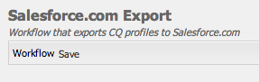

# Integração com o Salesforce {#integrating-with-salesforce}

A integração do Salesforce com o Adobe Experience Manager (AEM) fornece recursos de gerenciamento de clientes potenciais e usa os recursos existentes fornecidos prontos para uso pelo Salesforce. Você pode configurar o AEM para publicar leads no Salesforce e criar componentes que acessam dados diretamente do Salesforce.

A integração bidirecional e extensível entre o AEM e o Salesforce permite:

* Organizações para usar e corrigir totalmente os dados e aprimorar a experiência do cliente.
* Engajamento de marketing em atividades de vendas.
* Organizações para transmitir e receber dados automaticamente de um armazenamento de dados do Salesforce.

Este documento descreve o seguinte:

* como configurar o Salesforce Cloud Service (configurar o AEM para integrar com o Salesforce).
* como usar as informações de lead/contato do Salesforce no Contexto do cliente e para personalização.
* como usar o modelo de fluxo de trabalho do Salesforce para publicar usuários do AEM como clientes em potencial no Salesforce.
* como criar um componente que mostre dados do Salesforce.

## Configuração do AEM para integrar com o Salesforce {#configuring-aem-to-integrate-with-salesforce}

Para configurar o AEM para integrar com o Salesforce, primeiro configure um aplicativo de acesso remoto no Salesforce. Em seguida, você configura o serviço de nuvem Salesforce para apontar para esse aplicativo de acesso remoto.

>[!NOTE]
>
>Você pode criar uma conta de desenvolvedor gratuita no Salesforce.

Para configurar o AEM para integrar com o Salesforce:

>[!CAUTION]
>
>Instale o [API da força do Salesforce](https://experience.adobe.com/#/downloads/content/software-distribution/en/aem.html?fulltext=salesforce*&amp;orderby=%40jcr%3Acontent%2Fjcr%3AlastModified&amp;orderby.sort=desc&amp;layout=list&amp;p.offset=0&amp;p.limit=2&amp;package=%2Fcontent%2Fsoftware-distribution%2Fen%2Fdetails.html%2Fcontent%2Fdam%2Faem%2Fpublic%2Fadobe%2Fpackages%2Fcq650%2Ffeaturepack%2Fcom.adobe.cq.mcm.salesforce.content-1.0.4.zip) pacote de integração antes de continuar com o procedimento. Para obter mais detalhes sobre como trabalhar com pacotes, consulte [Como trabalhar com pacotes](/help/sites-administering/package-manager.md#package-share) página.

1. No AEM, navegue até **Cloud Service**. Em Serviços de terceiros, clique em **Configurar agora** in **Salesforce**.

   

1. Criar uma configuração, por exemplo, **desenvolvedor**.

   >[!NOTE]
   >
   >A nova configuração redireciona para uma nova página: **http://localhost:4502/etc/cloudservices/salesforce/developer.html**. Esse é exatamente o mesmo valor que você deve especificar na URL de retorno de chamada ao criar o aplicativo de acesso remoto no Salesforce. Esses valores devem corresponder a.

1. Faça logon na sua conta do Salesforce (ou, se não tiver uma, crie uma em [https://developer.salesforce.com](https://developer.salesforce.com).)
1. No Salesforce, navegue até **Criar** > **Aplicativos** para acessar o **Aplicativos conectados** (em versões anteriores do Salesforce, o fluxo de trabalho era **Implantar** > **Acesso remoto**).
1. Clique em **Novo** para conectar AEM com Salesforce.

   

1. Insira o **Nome do aplicativo conectado**, **Nome da API**, e **Email de contato**. Selecione o **Ativar configurações do OAuth** e insira o **URL de retorno** e adicione um escopo OAuth (por exemplo, acesso total). A URL de retorno é semelhante a esta: `http://localhost:4502/etc/cloudservices/salesforce/developer.html`

   Altere o nome do servidor/número da porta e o nome da página para corresponder à sua configuração.

   

1. Clique em **Salvar** para salvar a configuração do Salesforce. O Salesforce cria um **consumer key** e **consumer secret**, que é necessário para a configuração do AEM.

   

   >[!NOTE]
   >
   >Aguarde vários minutos (até 15 minutos) para que o aplicativo de acesso remoto no Salesforce seja ativado.

1. No AEM, navegue até **Cloud Service** e navegue até a configuração do Salesforce que você criou anteriormente (por exemplo, **desenvolvedor**). Clique em **Editar** e insira a chave do cliente e a senha do cliente em salesforce.com.

   

   | URL de login | Este é o endpoint de autorização do Salesforce. Seu valor é pré-preenchido e serve a maioria dos casos. |
   |---|---|
   | Chave do cliente | Insira o valor obtido da página Registro de aplicativo de acesso remoto em salesforce.com |
   | Segredo do cliente | Insira o valor obtido da página Registro de aplicativo de acesso remoto em salesforce.com |

1. Clique em **Conectar-se ao Salesforce** para se conectar. O Salesforce solicita que você permita que sua configuração se conecte ao Salesforce.

   

   No AEM, uma caixa de diálogo de confirmação é aberta, informando que você se conectou com êxito.

1. Navegue até a página raiz do site e clique em **Propriedades da página**. Em seguida, selecione **Cloud Service** e adicionar **Salesforce** e selecione a configuração correta (por exemplo, **desenvolvedor**).

   

   Agora você pode usar o modelo de fluxo de trabalho para publicar leads no Salesforce e criar componentes que acessam dados do Salesforce.

## Exportar usuários do AEM como clientes em potencial do Salesforce {#exporting-aem-users-as-salesforce-leads}

Se quiser exportar um usuário AEM como cliente potencial do Salesforce, configure o fluxo de trabalho para publicar clientes potenciais no Salesforce.

Para exportar usuários do AEM como clientes potenciais do Salesforce:

1. Navegue até o fluxo de trabalho do Salesforce em `http://localhost:4502/workflow` clicando com o botão direito do mouse no workflow **Exportação do Salesforce.com** e clicando em **Início**.

   

1. Selecione o usuário do AEM que deseja criar como lead como **Carga** para este workflow (início -> usuários). Certifique-se de selecionar o nó de perfil do usuário, pois ele contém informações como **givenName**, e  **familyName**, que são mapeados para clientes em potencial do Salesforce **Nome** e **Sobrenome** campos.

   

   >[!NOTE]
   >
   >Antes de iniciar esse fluxo de trabalho, há determinados campos obrigatórios que um nó principal no AEM deve ter antes de ser publicado no Salesforce. Estes são **givenName**, **familyName**, **empresa**, e **email**. Para ver uma lista completa de mapeamentos entre o usuário AEM e o lead Salesforce, consulte [Mapeamento da configuração entre o usuário do AEM e o lead do Salesforce.](#mapping-configuration-between-aem-user-and-salesforce-lead)

1. Clique em **OK**. As informações do usuário são exportadas para salesforce.com. Você pode verificá-lo em salesforce.com.

   >[!NOTE]
   >
   >Os logs de erros mostram se um cliente potencial foi importado. Verifique o log de erros para obter mais informações.

### Configuração do workflow de exportação do Salesforce.com {#configuring-the-salesforce-com-export-workflow}

Se necessário, configure o workflow de exportação do Salesforce.com para corresponder à configuração correta do Salesforce.com ou para fazer outras alterações.

Para configurar o workflow de exportação do Salesforce.com:

1. Vá até `http://localhost:4502/cf#/etc/workflow/models/salesforce-com-export.html.`

   

1. Abra a etapa Exportação do Salesforce.com e selecione a **Argumentos** e selecione se a configuração correta está selecionada e clique em **OK**. Além disso, se você quiser que o fluxo de trabalho recrie informações privilegiadas excluídas no Salesforce, marque a caixa de seleção.

   

1. Clique em **Salvar** para salvar as alterações.

   

### Configuração de mapeamento entre o usuário do AEM e o líder do Salesforce {#mapping-configuration-between-aem-user-and-salesforce-lead}

Para exibir ou editar a configuração de mapeamento atual entre um usuário AEM e um cliente potencial do Salesforce, abra o Configuration Manager: `https://<hostname>:<port>/system/console/configMgr` e pesquisar **Configuração do mapeamento de clientes em potencial do Salesforce**.

1. Abra o Gerenciador de configurações clicando em **Console da Web** ou indo diretamente para `https://<hostname>:<port>/system/console/configMgr.`
1. Pesquisar por **Configuração do mapeamento de clientes em potencial do Salesforce**.

   

1. Altere os mapeamentos, conforme necessário. O mapeamento padrão segue o padrão **aemUserAttribute=sfLeadAttribute**. Clique em **Salvar** para salvar as alterações.

## Configuração do Salesforce Client Context Store {#configuring-salesforce-client-context-store}

O armazenamento de contexto do cliente Salesforce mostra informações adicionais sobre o usuário conectado no momento além das que já estão disponíveis no AEM. Ele extrai essas informações adicionais do Salesforce dependendo da conexão do usuário com o Salesforce.

Para fazer isso, configure o seguinte:

1. Vincule um usuário do AEM a uma ID do Salesforce por meio do componente Salesforce Connect.
1. Adicione os Dados de perfil do Salesforce na página de contexto do cliente para que você possa configurar quais propriedades deseja ver.
1. (Opcional) Crie um segmento que use os dados do Salesforce Client Context Store.

### Vincular um usuário AEM a uma ID do Salesforce {#linking-an-aem-user-with-a-salesforce-id}

Mapeie um usuário do AEM com uma ID do Salesforce para que você possa carregá-lo no contexto do cliente. Em um cenário real, você estaria vinculando com base em dados de usuário conhecidos com validação. Para fins de demonstração, neste procedimento, use a variável **Salesforce Connect** componente.

1. Navegue até um site na AEM, entre, arraste e solte a **Salesforce Connect** componente do sidekick.

   >[!NOTE]
   >
   >Se a variável **Salesforce Connect** não estiver disponível, vá para a página **Design** exiba e selecione-o para disponibilizá-lo na **Editar** exibição.

   

   Quando você arrasta o componente para a página, ele é exibido **Vincular ao Salesforce=Off**.

   

   >[!NOTE]
   >
   >Este componente é apenas para fins de demonstração. Para cenários do mundo real, haveria outro processo para vincular/combinar usuários com leads.

1. Depois de arrastar o componente na página, abra-o para configurá-lo. Selecione a configuração, o tipo de contato e o cliente em potencial ou contato do Salesforce e clique em **OK**.

   

   O AEM vincula o usuário ao contato ou lead do Salesforce.

   

### Adicionar dados do Salesforce ao contexto do cliente {#adding-salesforce-data-to-client-context}

Você pode carregar dados do usuário do Salesforce no Client Context para usar na personalização:

1. Abra o contexto do cliente que deseja estender navegando até lá, por exemplo, `http://localhost:4502/etc/clientcontext/default/content.html.`

   

1. Arraste o **Dados de perfil do Salesforce** componente ao contexto do cliente.

   

1. Abra o componente clicando duas vezes nele. Selecionar **Adicionar item** e selecione uma propriedade na lista suspensa. Adicione quantas propriedades desejar e selecione **OK**.

   

1. Agora, você vê as propriedades específicas do Salesforce no Salesforce exibidas no contexto do cliente.

   

### Criar um segmento usando dados do Salesforce Client Context Store {#building-a-segment-using-data-from-salesforce-client-context-store}

Você pode criar um segmento que use dados do Salesforce Client Context Store. Para fazer isso:

1. Navegue até a segmentação no AEM acessando **Ferramentas** > **Segmentação** ou em [http://localhost:4502/miscadmin#/etc/segmentation](http://localhost:4502/miscadmin#/etc/segmentation).
1. Crie ou atualize um segmento para incluir dados do Salesforce. Para obter mais informações, consulte [Segmentação](/help/sites-administering/campaign-segmentation.md).

## Pesquisar clientes em potencial {#searching-leads}

O AEM vem com um componente de Pesquisa de amostra que pesquisa clientes potenciais no Salesforce de acordo com os critérios fornecidos. Esse componente mostra como usar a API REST do Salesforce para pesquisar objetos do Salesforce. Para acionar uma chamada para salesforce.com, vincule uma página a uma configuração do Salesforce.

>[!NOTE]
>
>Este é um componente de exemplo que mostra como usar a API REST do Salesforce para consultar objetos do Salesforce. Use-o como exemplo para criar componentes mais complexos com base em suas necessidades.

Para usar este componente:

1. Navegue até a página onde deseja usar essa configuração. Abra as propriedades da página e selecione **Cloud Service.** Clique em **Adicionar serviços** e selecione **Salesforce** e a configuração apropriada e clique em **OK**.

   

1. Arraste o componente de pesquisa do Salesforce para a página (desde que tenha sido ativado). Para ativá-lo, vá para o modo Design e adicione-o à área apropriada).

   

1. Abra o componente de Pesquisa, especifique os parâmetros de pesquisa e clique em **OK.**

   

1. O AEM exibe os leads especificados no componente de pesquisa que correspondem aos critérios especificados.

   
