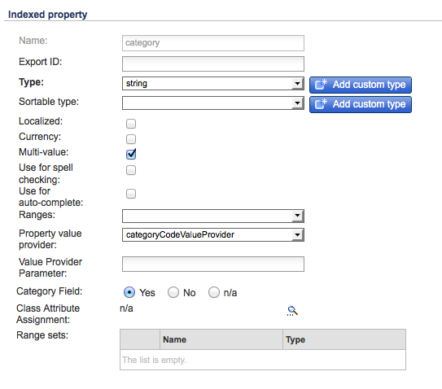

# SAP Commerce Cloud{#sap-commerce-cloud}

Após a instalação, você pode configurar sua instância:

1. [Configure a pesquisa direcionada para o Geometrixx Outdoors](#configure-the-facetted-search-for-geometrixx-outdoors).
1. [Configure a versão](#configure-the-catalog-version)do catálogo.
1. [Configure a estrutura](#configure-the-import-structure)de importação.
1. [Configure os atributos do produto para carregar](#configure-the-product-attributes-to-load).
1. [Importando os dados](#importing-the-product-data)do produto.
1. [Configure o Importador](#configure-the-catalog-importer)de Catálogo.
1. Use o [importador para importar o catálogo](#catalog-import) para um local específico no AEM.

## Configure a pesquisa direcionada para o Geometrixx Outdoors {#configure-the-facetted-search-for-geometrixx-outdoors}

>[!NOTE]
>
>Isso não é necessário para os híbridos 5.3.0.1 e posteriores.

1. No seu navegador, navegue até o console **de gerenciamento de** híbridos em:

   [http://localhost:9001/hmc/hybris](http://localhost:9001/hmc/hybris)

1. Na barra lateral, selecione **Sistema**, **Facet search** e **Facet Search Config**.
1. **Abra o Editor** para a **Exemplo de configuração do Solr para clothescatálogo**.

1. Em Versões **de** catálogo, use **Adicionar versão** de catálogo para adicionar `outdoors-Staged` e `outdoors-Online` à lista.
1. **** Salve a configuração.
1. Abra os tipos **de item** SOLR para adicionar Classificações **** SOLR a `ClothesVariantProduct`:

   * relevância (&quot;Relevância&quot;, pontuação)
   * name-asc (&quot;Nome (crescente)&quot;, nome)
   * name-desc (&quot;Nome (decrescente)&quot;, nome)
   * price-asc (&quot;Price (crescente)&quot;, priceValue)
   * price-desc (&quot;Price (decrescente)&quot;, priceValue)
   >[!NOTE]
   >
   >Use o menu de contexto (normalmente, clique com o botão direito do mouse) para selecionar `Create Solr sort`.
   >
   >Para abrir a guia Hybris 5.0.0, clique duas vezes na guia `Indexed Types` , `ClothesVariantProduct`em seguida, na guia `SOLR Sort`.

   

1. Na guia Tipos **** indexados, defina o Tipo **** composto como:

   `Product - Product`

1. Na guia Tipos **** indexados, ajuste as consultas **do** Indexador para `full`:

   ```shell
   SELECT {pk} FROM {Product} WHERE {pk} NOT IN ({{SELECT {baseProductpk} FROM {variantproduct}}})
   ```

1. Na guia Tipos **** indexados, ajuste as consultas **do** Indexador para `incremental`:

   ```shell
   SELECT {pk} FROM {Product} WHERE {pk} NOT IN ({{SELECT {baseProductpk} FROM {variantproduct}}}) AND {modifiedtime} <= ?lastIndexTime
   ```

1. Na guia Tipos **** indexados ajuste a `category` faceta. Clique duas vezes na última entrada na lista de categorias para abrir a guia Propriedade **** indexada:

   >[!NOTE]
   >
   >Para os híbridos 5.2, verifique se o `Facet` atributo na tabela Propriedades está selecionado de acordo com a captura de tela abaixo:

    

1. Abra a guia Configurações **de** faceta e ajuste os valores do campo:

   

1. **Salve as alterações.**
1. Novamente nos tipos **de Item** SOLR, ajuste a `price` faceta de acordo com as seguintes capturas de tela. Assim como `category`, clique duas vezes em `price` para abrir a guia **Propriedade** indexada:

   

1. Abra a guia Configurações **de** faceta e ajuste os valores do campo:

   

1. **Salve as alterações.**
1. Abra **Sistema**, Pesquisa **de** facetas e Assistente **de operação de** indexador. Inicie um cronjob:

   * **Operação** do indexador: `full`
   * **Configuração** Solr: `Sample Solr Config for Clothes`

## Configurar a versão do catálogo {#configure-the-catalog-version}

A versão **do** Catálogo ( `hybris.catalog.version`) importada pode ser configurada para o serviço OSGi:

**Configuração** de Hybris de Comércio do CQ Dia( `com.adobe.cq.commerce.hybris.common.DefaultHybrisConfigurationService`)

**A versão** do catálogo geralmente é definida como `Online` ou `Staged` (o padrão).

>[!NOTE]
>
>When working with AEM there are several methods of managing the configuration settings for such services; see [Configuring OSGi](/help/sites-deploying/configuring-osgi.md) for full details. Consulte também o console para obter uma lista completa de parâmetros configuráveis e seus padrões.

A saída do log fornece feedback sobre as páginas e os componentes criados e relata possíveis erros.

## Configurar a estrutura de importação {#configure-the-import-structure}

A listagem a seguir mostra uma estrutura de amostra (de ativos, páginas e componentes) criada por padrão:

```shell
+ /content/dam/path/to/images
  + 12345.jpg (dam:Asset)
    + ...
  + ...
+ /content/site/en
  - cq:commerceProvider = "hybris"
  - cq:hybrisBaseStore = "basestore"
  - cq:hybrisCatalogId = "catalog"
  + category1 (cq:Page)
    + jcr:content (cq:PageContent)
      - jcr:title = "Category 1"
    + category11 (cq:Page)
      + jcr:content (cq:PageContent)
        - jcr:title = "Category 1.1"
      + 12345 (cq:Page)
        + jcr:content (cq:PageContent)
          + par
            + product (nt:unstructured)
              - cq:hybrisProductId = "12345"
              - sling:resourceType = "commerce/components/product"
              + image (nt:unstructured)
                - sling:resourceType = "commerce/components/product/image"
                - fileReference = "/content/dam/path/to/images/12345.jpg"
              + 12345.1-S (nt:unstructured)
                - cq:hybrisProductId = "12345.1-S"
                - sling:resourceType = "commerce/components/product"
                + image (nt:unstructured)
                  - sling:resourceType = "commerce/components/product/image"
                  - fileReference = "/content/dam/path/to/images/12345.1-S.jpg"
              + ...
```

Essa estrutura é criada pelo serviço OSGi `DefaultImportHandler` que implementa a `ImportHandler` interface. Um manipulador de importação é chamado pelo importador real para criar produtos, variações de produtos, categorias, ativos, etc.

>[!NOTE]
>
>Você pode [personalizar esse processo implementando seu próprio manipulador](#configure-the-import-structure)de importação.

A estrutura a ser gerada ao importar pode ser configurada para:

&quot;Manipulador **** de Importação Padrão de Híbris do Comércio CQ`(com.adobe.cq.commerce.hybris.importer.DefaultImportHandler`Dia)

When working with AEM there are several methods of managing the configuration settings for such services; see [Configuring OSGi](/help/sites-deploying/configuring-osgi.md) for full details. Consulte também o console para obter uma lista completa de parâmetros configuráveis e seus padrões.

## Configure os atributos do produto para carregar {#configure-the-product-attributes-to-load}

O analisador de resposta pode ser configurado para definir as propriedades e os atributos a serem carregados para produtos (variantes):

1. Configure o pacote OSGi:

   **Analisador** de Resposta Padrão de Híbris de Comércio do CQ de Dia(`com.adobe.cq.commerce.hybris.impl.importer.DefaultResponseParser`)

   Aqui você pode definir várias opções e atributos necessários para carregar e mapear.

   >[!NOTE]
   >
   >When working with AEM there are several methods of managing the configuration settings for such services; see [Configuring OSGi](/help/sites-deploying/configuring-osgi.md) for full details. Consulte também o console para obter uma lista completa de parâmetros configuráveis e seus padrões.

## Importação dos dados do produto {#importing-the-product-data}

Há várias maneiras de importar os dados do produto. Os dados do produto podem ser importados ao configurar inicialmente o ambiente ou após alterações nos dados de suborno:

* [Importação completa](#full-import)
* [Importação incremental](#incremental-import)
* [Atualização Express](#express-update)

As informações reais sobre produtos importados de híbridos são mantidas no repositório sob:

`/etc/commerce/products`

As seguintes propriedades indicam o link com os híbridos:

* `commerceProvider`
* `cq:hybrisCatalogId`
* `cq:hybrisProductID`

>[!NOTE]
>
>A implementação de híbridos (ou seja, `geometrixx-outdoors/en_US`) armazena somente IDs de produtos e outras informações básicas em `/etc/commerce`.
>
>O servidor hybris é referenciado toda vez que informações sobre um produto são solicitadas.

### Importação completa {#full-import}

1. Se necessário, exclua todos os dados de produto existentes usando o CRXDE Lite.

   1. Navegue até a subárvore que contém os dados do produto:

      `/etc/commerce/products`

      Por exemplo:

      [`http://localhost:4502/crx/de/index.jsp#/etc/commerce/products`](http://localhost:4502/crx/de/index.jsp#/etc/commerce/products)

   1. Exclua o nó que armazena os dados do produto; por exemplo, `outdoors`.
   1. **Salvar tudo** para persistir a alteração.

1. Abra o importador de híbridos no AEM:

   `/etc/importers/hybris.html`

   Por exemplo:

   [http://localhost:4502/etc/importers/hybris.html](http://localhost:4502/etc/importers/hybris.html)

1. Configurar os parâmetros necessários; por exemplo:

   

1. Clique em **Importar catálogo** para iniciar a importação.

   Quando concluído, você pode verificar os dados importados em:

   ```
       /etc/commerce/products/outdoors
   ```

   Você pode abrir isso no CRXDE Lite; por exemplo:

   `[http://localhost:4502/crx/de/index.jsp#/etc/commerce/products](http://localhost:4502/crx/de/index.jsp#/etc/commerce/products)`

### Importação incremental {#incremental-import}

1. Verifique as informações contidas no AEM sobre o(s) produto(s) relevante(s), na subárvore apropriada em:

   `/etc/commerce/products`

   Você pode abrir isso no CRXDE Lite; por exemplo:

   [http://localhost:4502/crx/de/index.jsp#/etc/commerce/products](http://localhost:4502/crx/de/index.jsp#/etc/commerce/products)

1. Em hipbris, atualize a informação mantida sobre o(s) produto(s) revelador(es).

1. Abra o importador de híbridos no AEM:

   `/etc/importers/hybris.html`

   Por exemplo:

   [http://localhost:4502/etc/importers/hybris.html](http://localhost:4502/etc/importers/hybris.html)

1. Selecione a opção **Importação** incremental da caixa de clique.
1. Clique em **Importar catálogo** para iniciar a importação.

   Quando concluído, você pode verificar os dados atualizados no AEM em:

   ```
       /etc/commerce/products
   ```


### Atualização Express {#express-update}

O processo de importação pode levar muito tempo, de modo que, como uma extensão da Sincronização de produtos, você pode selecionar áreas específicas do catálogo para uma atualização expressa que é acionada manualmente. Isso usa o feed de exportação junto com a configuração de atributos padrão.

1. Verifique as informações contidas no AEM sobre o(s) produto(s) relevante(s), na subárvore apropriada em:

   `/etc/commerce/products`

   Você pode abrir isso no CRXDE Lite; por exemplo:

   [http://localhost:4502/crx/de/index.jsp#/etc/commerce/products](http://localhost:4502/crx/de/index.jsp#/etc/commerce/products)

1. Em hipbris, atualize a informação mantida sobre o(s) produto(s) revelador(es).

1. Em hipbris, adicione os produtos à fila expressa; por exemplo:

   

1. Abra o importador de híbridos no AEM:

   `/etc/importers/hybris.html`

   Por exemplo:

   [http://localhost:4502/etc/importers/hybris.html](http://localhost:4502/etc/importers/hybris.html)

1. Selecione a caixa de clique Atualização **** expressa.
1. Clique em **Importar catálogo** para iniciar a importação.

   Quando concluído, você pode verificar os dados atualizados no AEM em:

   ```
       /etc/commerce/products
   ```

   ` [](http://localhost:4502/crx/de/index.jsp#/etc/commerce/products)`

## Configurar o Importador de Catálogo {#configure-the-catalog-importer}

O catálogo de híbridos pode ser importado para o AEM, usando o importador de lote para catálogos de híbridos, categorias e produtos.

Os parâmetros usados pelo importador podem ser configurados para:

**Importador** do Catálogo de Híbris do Comércio do Day CQ( `com.adobe.cq.commerce.hybris.impl.importer.DefaultHybrisImporter`)

When working with AEM there are several methods of managing the configuration settings for such services; see [Configuring OSGi](/help/sites-deploying/configuring-osgi.md) for full details. Consulte também o console para obter uma lista completa de parâmetros configuráveis e seus padrões.

## Importação de catálogo {#catalog-import}

O pacote hybris vem com um importador de catálogo para configurar a estrutura da página inicial.

Isso está disponível em:

`http://localhost:4502/etc/importers/hybris.html`


Devem ser fornecidas as seguintes informações:

* **Armazenamento** baseO identificador do armazenamento base configurado em híbridos.

* **Catálogo** O identificador do catálogo a ser importado.

* **Caminho** raizO caminho para o qual o catálogo deve ser importado.

## Remoção de um produto do catálogo {#removing-a-product-from-the-catalog}

Para remover um ou mais produtos do catálogo:

1. [Configure o Importador](/help/sites-deploying/configuring-osgi.md) do Catálogo de Híbris do Comércio do CQ para o serviço **** OSGi; consulte também [Configurar o Importador](#configure-the-catalog-importer)de Catálogo.

   Ative as seguintes propriedades:

   * **Ativar remoção de produto**
   * **Ativar remoção de ativos de produtos**
   >[!NOTE]
   >
   >When working with AEM there are several methods of managing the configuration settings for such services; see [Configuring OSGi](/help/sites-deploying/configuring-osgi.md) for full details. Consulte também o console para obter uma lista completa de parâmetros configuráveis e seus padrões.

1. Inicialize o importador executando duas atualizações incrementais (consulte Importação [](#catalog-import)de catálogo):

   * A primeira execução resulta em um conjunto de produtos alterados - indicado na lista de log.
   * Pela segunda vez, nenhum produto deve ser atualizado.
   >[!NOTE]
   >
   >A primeira importação é inicializar as informações do produto. A segunda importação verifica se tudo funcionou e se o conjunto de produtos está pronto.

1. Verifique a página de categoria que contém o produto que deseja remover. Os detalhes do produto devem ser visíveis.

   Por exemplo, a seguinte categoria mostra detalhes do produto Cajamara:

   [http://localhost:4502/editor.html/content/geometrixx-outdoors/en_US/equipment/biking.html](http://localhost:4502/editor.html/content/geometrixx-outdoors/en_US/equipment/biking.html)

1. Remova o produto no console hybris. Use a opção **Alterar status** de aprovação para definir o status como `unapproved`. O produto será removido do feed vivo.

   Por exemplo:

   * Abra a página [http://localhost:9001/productcockpit](http://localhost:9001/productcockpit)
   * Selecionar o catálogo `Outdoors Staged`
   * Pesquisar `Cajamara`
   * Selecione este produto e altere o status de aprovação para `unapproved`

1. Execute outra atualização incremental (consulte Importação [](#catalog-import)de catálogo). O log listará o produto excluído.
1. [Implantar](/help/sites-administering/generic.md#rolling-out-a-catalog) o catálogo apropriado. A página do produto e do produto será removida do AEM.

   Por exemplo:

   * Abrir:

      [http://localhost:4502/aem/catalogs.html/content/catalogs/geometrixx-outdoors-hybris](http://localhost:4502/aem/catalogs.html/content/catalogs/geometrixx-outdoors-hybris)

   * Implantar o `Hybris Base` catálogo
   * Abrir:

      [http://localhost:4502/editor.html/content/geometrixx-outdoors/en_US/equipment/biking.html](http://localhost:4502/editor.html/content/geometrixx-outdoors/en_US/equipment/biking.html)

   * O `Cajamara` produto será removido da `Bike` categoria

1. Para reinstalar o produto:

   1. Em subtítulo, redefina o status de aprovação para **aprovado**
   1. No AEM:

      1. executar uma atualização incremental
      1. executar novamente o catálogo apropriado
      1. atualizar a página de categoria apropriada

## Adicionar a característica do histórico de pedidos ao contexto do cliente {#add-order-history-trait-to-the-client-context}

Para adicionar o histórico de pedidos ao contexto [do](/help/sites-developing/client-context.md)cliente:

1. Abra a página [de design de contexto do](/help/sites-administering/client-context.md)cliente:

   * Abra uma página para edição e abra o contexto do cliente usando **Ctrl-Alt-c** (windows) ou **control-option-c** (Mac). Use o ícone de lápis no canto superior esquerdo do contexto do cliente para **abrir a página** de design ClientContext.
   * Navegue diretamente para [http://localhost:4502/etc/clientcontext/default/content.html](http://localhost:4502/etc/clientcontext/default/content.html)

1. [Adicione o componente **Histórico** do](/help/sites-administering/client-context.md#adding-a-property-component) pedido ao componente **Carrinho de compras do** contexto do cliente.
1. Você pode confirmar que o contexto do cliente está mostrando detalhes do histórico do seu pedido. Por exemplo:

   1. Open the [client context](/help/sites-administering/client-context.md).
   1. Adicione um item ao carrinho.
   1. Conclua o check-out.
   1. Verifique o contexto do cliente.
   1. Adicione outro item ao carrinho.
   1. Navegue até a página de finalização:

      * O contexto do cliente mostra um resumo do histórico do pedido.
      * A mensagem &quot;Você é um cliente recorrente&quot; é exibida.
   >[!NOTE]
   >
   >A mensagem é realizada por:
   >
   >* Navegue até [http://localhost:4502/content/campaigns/geometrixx-outdoors/hybris-returning-customer.html](http://localhost:4502/content/campaigns/geometrixx-outdoors/hybris-returning-customer.html)
   >
   >  A campanha consiste em uma experiência.
   >
   >* Clique no segmento ([http://localhost:4502/etc/segmentation/geometrixx-outdoors/returning-customer.html](http://localhost:4502/etc/segmentation/geometrixx-outdoors/returning-customer.html))
      >
      >
   * O segmento é criado usando a característica Propriedade **do Histórico de** pedidos.

