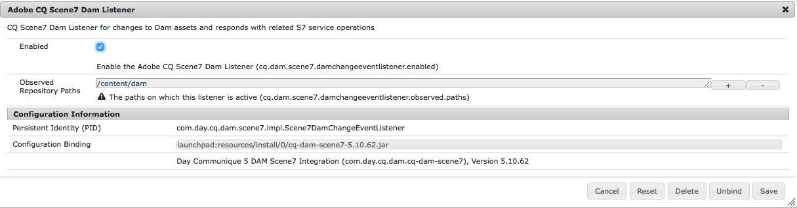

# Integração com o Dynamic Media Classic (Scene7){#integrating-with-dynamic-media-classic-scene}

[O Adobe Dynamic Media Classic](https://help.adobe.com/en_US/scene7/using/WS26AB0D9A-F51C-464e-88C8-580A5A82F810.html) é uma solução hospedada para gerenciar, aprimorar, publicar e fornecer ativos de mídia avançada para Web, dispositivos móveis, email e telas e impressão conectadas à Internet.

Para usar o Dynamic Media Classic, é necessário configurar a configuração de nuvem para que o Dynamic Media Classic e o AEM Assets possam interagir uns com os outros. Este documento descreve como configurar o AEM e o Dynamic Media Classic.

Para obter informações sobre como usar todos os componentes do Dynamic Media Classic em uma página e trabalhar com vídeo, consulte [Uso do Dynamic Media Classic](../assets/scene7.md).

>[!NOTE]
>
>* A plataforma do visualizador DHTML do Dynamic Media Classic chegou ao fim da vida útil em 31 de janeiro de 2014. Para obter mais informações, consulte as Perguntas frequentes sobre [o fim da vida útil do visualizador](../sites-administering/dhtml-viewer-endoflifefaqs.md)DHTML.
>* Antes de configurar o Dynamic Media Classic para trabalhar com AEM, consulte Práticas  recomendadas para integração do Dynamic Media Classic com AEM.
>* Se você estiver usando o Dynamic Media Classic com uma configuração de proxy personalizada, precisará configurar ambas as configurações de proxy do Cliente HTTP, já que algumas funcionalidades do AEM estão usando as APIs 3.x e outras as APIs 4.x. O 3.x é configurado com [http://localhost:4502/system/console/configMgr/com.day.commons.httpclient](http://localhost:4502/system/console/configMgr/com.day.commons.httpclient) e o 4.x é configurado com [http://localhost:4502/system/console/configMgr/org.apache.http.proxyconfigurator](http://localhost:4502/system/console/configMgr/org.apache.http.proxyconfigurator).

>

## Integração AEM/Dynamic Media Classic versus Dynamic Media {#aem-scene-integration-versus-dynamic-media}

AEM usuários têm uma opção entre duas soluções para trabalhar com mídia dinâmica: Integrando sua instância de AEM com o Dynamic Media Classic ou usando a solução Dynamic Media integrada ao AEM.

Use os seguintes critérios para determinar qual solução escolher:

* Se você for um cliente **existente** do Dynamic Media Classic cujos ativos de mídia avançada residem no Dynamic Media Classic para publicação e delivery, mas quiser integrar esses ativos à criação do Sites (WCM) e/ou ao AEM Assets para gerenciamento, use a integração [ponto a ponto do](#aem-scene-point-to-point-integration) AEM/Dynamic Media Classic descrita neste documento.

* Se você for um **novo** cliente AEM que tenha necessidades de delivery de mídia avançada, selecione a opção [Mídia](#aem-dynamic-media)dinâmica. Essa opção faz mais sentido se você não tiver uma conta S7 existente e muitos ativos armazenados nesse sistema.

* Em certos casos, você pode usar ambas as soluções. O cenário [de](/help/sites-administering/scene7.md#dual-use-scenario) dupla utilização descreve esse cenário.

### Integração ponto a ponto do AEM/Dynamic Media Classic {#aem-scene-point-to-point-integration}

Ao trabalhar com ativos nesta solução, execute um dos procedimentos a seguir:

* Faça upload de ativos diretamente para o Dynamic Media Classic e acesse por meio do navegador de conteúdo do **Dynamic Media Classic** para criação de página ou
* Faça upload para o AEM Assets e ative a publicação automática para o Dynamic Media Classic; você acessa o navegador de conteúdo do **Assets** para criação de página

Os componentes que você usa para essa integração são encontrados na área do componente **Dynamic Media Classic** no modo [Design.](/help/sites-authoring/author-environment-tools.md#page-modes)

### AEM Dynamic Media {#aem-dynamic-media}

AEM Dynamic Media é a unificação dos recursos do Dynamic Media Classic diretamente na plataforma AEM.

Ao trabalhar com ativos nesta solução, siga este fluxo de trabalho:

1. Carregue ativos de imagem única e vídeo diretamente para o AEM.
1. Codifique vídeos diretamente no AEM.
1. Crie conjuntos baseados em imagens diretamente no AEM.
1. Se aplicável, adicione interatividade a imagens ou vídeos.

Os componentes que você usa para o Dynamic Media são encontrados na área do componente **[!UICONTROL Dynamic Media]** no modo Design. Eles incluem o seguinte:

* **[!UICONTROL Mídia]** dinâmica - o componente **[!UICONTROL Mídia]** dinâmica é inteligente - dependendo se você adicionar uma imagem ou um vídeo, você terá várias opções. O componente oferece suporte a predefinições de imagem, visualizadores baseados em imagem, como conjuntos de imagens, conjuntos de rotação, conjuntos de mídia mista e vídeo. Além disso, o visualizador é responsivo: o tamanho da tela muda automaticamente com base no tamanho da tela. Todos são visualizadores HTML5.

* **[!UICONTROL Mídia]** interativa - o componente Mídia **** interativa é para esses ativos, como banners de carrossel, imagens interativas e vídeo interativo, que têm interatividade neles, como pontos de conexão ou mapas de imagem. Esse componente é inteligente - dependendo se você adicionar uma imagem ou um vídeo, você terá várias opções. Além disso, o visualizador é responsivo: o tamanho da tela muda automaticamente com base no tamanho da tela. Todos são visualizadores HTML5.

### Cenário de dupla utilização {#dual-use-scenario}

Desde o início, você pode usar os recursos de integração do Dynamic Media e do Dynamic Media Classic AEM simultaneamente. A tabela de casos de uso a seguir descreve quando determinadas áreas são ativadas e desativadas.

Para usar o Dynamic Media e o Dynamic Media Classic simultaneamente:

1. Configure o [Dynamic Media Classic](#creating-a-cloud-configuration-for-scene) nos serviços em nuvem.
1. Siga as instruções específicas do caso de uso:

   <table>
    <tbody>
    <tr>
    <td> </td>
    <td> </td>
    <td><strong>Dynamic Media</strong></td>
    <td> </td>
    <td><strong>Integração do Dynamic Media Classic</strong></td>
    <td> </td>
    </tr>
    <tr>
    <td><strong>Se você for...</strong></td>
    <td><strong>Fluxo de trabalho de caso de uso</strong></td>
    <td><strong>Imagem/vídeo</strong></td>
    <td><strong>Componente de mídia dinâmica</strong></td>
    <td><strong>Navegador de conteúdo e componentes S7</strong></td>
    <td><strong>Upload automático de ativos para S7</strong></td>
    </tr>
    <tr>
    <td>Novidades em sites e Dynamic Media</td>
    <td>Carregar ativos para AEM e usar AEM componente de Dynamic Media para criar ativos nas páginas do Sites</td>
    <td>
Ligado
 
(Consulte a etapa 3)
 </td>
    <td><a href="/help/assets/adding-dynamic-media-assets-to-pages.md">Ligado</a></td>
    <td>Desativado</td>
    <td>Desativado</td>
    </tr>
    <tr>
    <td>No varejo e são novos no Sites e no Dynamic Media</td>
    <td>Faça upload de ativos não relacionados ao produto para AEM para gerenciamento e delivery. Faça upload de ativos de PRODUTO para o Dynamic Media Classic e use o navegador de conteúdo do Dynamic Media Classic no AEM e componente para criar Páginas de detalhes do produto em sites.</td>
    <td>
Ligado
 
(Consulte a etapa 3)
 </td>
    <td><a href="/help/assets/adding-dynamic-media-assets-to-pages.md">Ligado</a></td>
    <td><a href="/help/assets/scene7.md#scene-content-browser">Ligado</a></td>
    <td>Desativado</td>
    </tr>
    <tr>
    <td>Novidade nos ativos e Mídia dinâmica</td>
    <td>Carregar ativos para o AEM Assets e usar o URL/código incorporado publicado do Dynamic Media</td>
    <td>
Ligado
 
(Consulte a etapa 3)
 </td>
    <td>Desativado</td>
    <td>Desativado</td>
    <td>Desativado</td>
    </tr>
    <tr>
    <td>Novo no Dynamic Media e modelos</td>
    <td>Use o Dynamic Media para criação de imagens e vídeos. Crie modelos de imagem no Dynamic Media Classic e use o localizador de conteúdo do Dynamic Media Classic para incluir modelos nas páginas do Sites.</td>
    <td>
Ligado
 
(Consulte a etapa 3)
 </td>
    <td><a href="/help/assets/adding-dynamic-media-assets-to-pages.md">Ligado</a></td>
    <td><a href="/help/assets/scene7.md#scene-content-browser">Ligado</a></td>
    <td>Desativado</td>
    </tr>
    <tr>
    <td>Um cliente existente do Dynamic Media Classic e novidades do Sites</td>
    <td>Carregue ativos no Dynamic Media Classic e use AEM navegador de conteúdo do Dynamic Media Classic para pesquisar e criar ativos nas páginas do Sites</td>
    <td>Desativado</td>
    <td>Desativado</td>
    <td><a href="/help/assets/scene7.md#scene-content-browser">Ligado</a></td>
    <td>Desativado</td>
    </tr>
    <tr>
    <td>Um cliente existente do Dynamic Media Classic e novidade para Sites e Ativos</td>
    <td>Carregue ativos no DAM e publique automaticamente no Dynamic Media Classic para delivery. Use AEM navegador de conteúdo do Dynamic Media Classic para pesquisar e criar ativos nas páginas do Sites.</td>
    <td>Desativado</td>
    <td>Desativado</td>
    <td><a href="/help/assets/scene7.md#scene-content-browser">Ligado</a></td>
    <td>
<a href="#configuringautouploadingfromaemassets">Ligado</a>
 
(Consulte a etapa 4)
 </td>
    </tr>
    <tr>
    <td>Cliente do Dynamic Media Classic existente e novo no Assets</td>
    <td>
Carregue ativos para AEM e usar o Dynamic Media para gerar execuções para download/compartilhamento. Publicar automaticamente ativos AEM no Dynamic Media Classic para delivery.
 
<strong>Importante:</strong> O processamento de duplicados e as execuções geradas no AEM não serão sincronizados com o Dynamic Media Classic
 </td>
    <td>
Ligado
 
(Consulte a etapa 3)
 </td>
    <td>Desativado</td>
    <td>Desativado</td>
    <td>
<a href="#configuringautouploadingfromaemassets">Ligado</a>
 
(Consulte a etapa 4)
 </td>
    </tr>
    </tbody>
    </table>

1. (Opcional; consulte a tabela de caso de uso) - Configure a configuração [da nuvem do](/help/assets/config-dynamic.md) Dynamic Media e [ative o servidor](/help/assets/config-dynamic.md)do Dynamic Media.
1. (Opcional; consulte a tabela de caso de uso) - Se você optar por ativar o Carregamento automático dos ativos para o Dynamic Media Classic, será necessário adicionar o seguinte:

   1. Configure o upload automático para o Dynamic Media Classic.
   1. Adicione a etapa de upload **do Dynamic Media Classic depois de todas as etapas do fluxo de trabalho do Dynamic Media** no final *do fluxo de trabalho do* Dam Update Asset **** ( `https://<server>:<host>/cf#/etc/workflow/models/dam/update_asset.html)`
   1. (Opcional) Restrinja o carregamento de ativos do Dynamic Media Classic por tipo MIME em [https://&lt;servidor>:&lt;porta>/system/console/configMgr/com.day.cq.dam.sceno7.impl.Scene7AssetMimeTypeServiceImpl](http://localhost:4502/system/console/configMgr/com.day.cq.dam.scene7.impl.Scene7AssetMimeTypeServiceImpl). Os tipos MIME de ativos não presentes nesta lista não serão carregados no servidor do Dynamic Media Classic.
   1. (Opcional) Configure o vídeo na configuração do Dynamic Media Classic. Você pode ativar a codificação de vídeo para o Dynamic Media ou para o Dynamic Media Classic simultaneamente. As renderizações dinâmicas são usadas para pré-visualização e reprodução localmente AEM instância, enquanto as renderizações de vídeo do Dynamic Media Classic são geradas e armazenadas nos servidores do Dynamic Media Classic. Ao configurar serviços de codificação de vídeo para o Dynamic Media e o Dynamic Media Classic, aplique um perfil [de processamento de](/help/assets/video-profiles.md) vídeo à pasta de ativos do Dynamic Media Classic.
   1. (Opcional) [Configure a pré-visualização segura no Dynamic Media Classic](/help/sites-administering/scene7.md#configuring-the-state-published-unpublished-of-assets-pushed-to-scene).

#### Limitações           {#limitations}

Quando o Dynamic Media Classic e o Dynamic Media estão ativados, há as seguintes limitações:

* Fazer upload manual para o Dynamic Media Classic selecionando um ativo e arrastando-o para um componente do Dynamic Media Classic em uma página AEM não funciona.
* Embora os ativos sincronizados AEM-Dynamic Media Classic sejam atualizados automaticamente para o Dynamic Media Classic quando o ativo é editado no Assets, uma ação de reversão não ativa um novo upload, portanto o Dynamic Media Classic não obteria a versão mais recente imediatamente após uma reversão. A solução alternativa é editar novamente depois que a reversão for concluída.
* Se você precisar usar o Dynamic Media para um caso de uso e a integração do Dynamic Media Classic para outro caso de uso, para que os ativos do Dynamic Media não interajam com o sistema do Dynamic Media Classic, não aplique a configuração do Dynamic Media Classic à pasta Dynamic Media ou a configuração do Dynamic Media (perfil de processamento) a uma pasta do Dynamic Media Classic.

## Práticas recomendadas para a integração do Dynamic Media Classic com o AEM {#best-practices-for-integrating-scene-with-aem}

Ao integrar o Dynamic Media Classic com o AEM, há algumas práticas recomendadas importantes que precisam ser observadas nas seguintes áreas:

* Como testar sua integração
* Fazer upload de ativos diretamente do Dynamic Media Classic recomendado para certos cenários

Consulte limitações [conhecidas](#known-limitations-and-design-implications).

### Como testar sua integração {#test-driving-your-integration}

O Adobe recomenda que você teste sua integração fazendo com que sua pasta raiz aponte apenas para uma subpasta, em vez de para uma empresa inteira.

>[!CAUTION]
>
>A importação de ativos de uma conta de empresa do Dynamic Media Classic pode levar muito tempo para ser exibida em AEM. Certifique-se de designar uma pasta no Dynamic Media Classic que não tenha muitos ativos (por exemplo, a pasta raiz geralmente terá muitos ativos e poderá travar o sistema).

### Fazer upload de ativos do AEM Assets em vez do Dynamic Media Classic {#uploading-assets-from-aem-assets-versus-from-scene}

Você pode fazer upload de ativos usando a funcionalidade Ativos (gerenciamento de ativos digitais) ou acessando o Dynamic Media Classic diretamente no AEM por meio do navegador de conteúdo do Dynamic Media Classic. Qual opção você escolhe depende dos seguintes fatores:

* Os tipos de ativos do Dynamic Media Classic que a AEM Assets ainda não suporta têm que ser adicionados a um site AEM do Dynamic Media Classic diretamente, por meio do navegador de conteúdo do Dynamic Media Classic, por exemplo, modelos de imagem.
* Para tipos de ativos compatíveis com o AEM Assets e o Dynamic Media Classic, decidir como fazer upload deles depende do seguinte:

   * Onde os ativos estão hoje E
   * Como é importante gerenciá-los em um repositório comum

Se os ativos já estiverem no Dynamic Media Classic e gerenciá-los em um repositório comum não for tão importante, exportá-los para a AEM Assets somente para sincronizá-los de volta ao Dynamic Media Classic for delivery seria uma viagem de ida e volta desnecessária. Caso contrário, manter os ativos em um único repositório e sincronizar com o Dynamic Media Classic somente para o delivery pode ser preferível.

## Configuração da integração do Dynamic Media Classic {#configuring-scene-integration}

Você pode configurar AEM para carregar ativos no Dynamic Media Classic. Os ativos de uma pasta de público alvo CQ podem ser carregados (automática ou manualmente) de AEM para uma conta de empresa do Dynamic Media Classic.

>[!NOTE]
>
>O Adobe recomenda que você use apenas a pasta público alvo designada para importar ativos do Dynamic Media Classic. Os ativos digitais que residem fora da pasta do público alvo só podem ser usados nos componentes do Dynamic Media Classic nas páginas em que a configuração do Dynamic Media Classic foi ativada. Além disso, eles são colocados em uma pasta ad hoc no Dynamic Media Classic. A pasta adhoc não é sincronizada com o AEM (mas os ativos podem ser descobertos no navegador de conteúdo do Dynamic Media Classic).

Para configurar o Dynamic Media Classic para integração com o AEM, é necessário concluir as seguintes etapas:

1. [Definir uma configuração](#creating-a-cloud-configuration-for-scene) de nuvem - Define o mapeamento entre uma pasta do Dynamic Media Classic e uma pasta Assets. É necessário concluir esta etapa mesmo se você quiser apenas sincronização unidirecional (AEM Assets para o Dynamic Media Classic).
1. [Ative o **Adobe CQ s7dam Dam Listener**](#enabling-the-adobe-cq-scene-dam-listener) - Concluído no console do [!UICONTROL OSGi] .
1. Se quiser que AEM ativos sejam carregados automaticamente no Dynamic Media Classic, ative essa opção e adicione o Dynamic Media Classic ao fluxo de trabalho Atualizar ativo [!UICONTROL do] DAM. Você também pode fazer upload manual de ativos.
1. Adicionar componentes do Dynamic Media Classic ao sidekick. Isso permite que os usuários usem componentes do Dynamic Media Classic em suas páginas AEM.
1. [Mapear a configuração para a página no AEM](#enabling-scene-for-wcm) - Essa etapa é necessária para visualização de qualquer predefinição de vídeo criada no Dynamic Media Classic. Também é necessário se você precisar executar um ativo de publicação de fora da pasta do público alvo CQ para o Dynamic Media Classic.

Esta seção aborda como executar todas essas etapas e limitações importantes do lista.

### Como funciona a sincronização entre o Dynamic Media Classic e o AEM Assets {#how-synchronization-between-scene-and-aem-assets-works}

Ao configurar a sincronização entre o AEM Assets e o Dynamic Media Classic, é importante entender o seguinte:

#### Upload para o Dynamic Media Classic a partir do AEM Assets {#uploading-to-scene-from-aem-assets}

* Há uma pasta de sincronização designada no AEM para uploads do Dynamic Media Classic.
* Os uploads para o Dynamic Media Classic podem ser automatizados se os ativos digitais forem colocados na pasta de sincronização designada.
* A estrutura de pastas e subpastas no AEM é replicada no Dynamic Media Classic.

>[!NOTE]
>
>AEM incorpora todos os metadados como XMP antes de carregá-los no Dynamic Media Classic, de modo que todas as propriedades no nó de metadados estejam disponíveis no Dynamic Media Classic como XMP.

#### Limitações conhecidas e implicações de design {#known-limitations-and-design-implications}

Com a sincronização entre o AEM Assets e o Dynamic Media Classic, existem atualmente as seguintes limitações/implicações de design:

<table>
 <tbody>
  <tr>
   <td><strong>Limitação/implicação de projeto</strong></td>
   <td><strong>Descrição</strong></td>
  </tr>
  <tr>
   <td>Uma pasta designada de sincronização (público alvo)</td>
   <td>Você só pode ter uma pasta designada por empresa no AEM para uploads do Dynamic Media Classic. Você pode criar várias configurações se precisar ter acesso a mais de uma conta de empresa no Dynamic Media Classic.</td>
  </tr>
  <tr>
   <td>Estrutura da pasta</td>
   <td>Se você excluir uma pasta sincronizada com ativos, todos os ativos remotos do Dynamic Media Classic serão excluídos, mas a pasta permanecerá.</td>
  </tr>
  <tr>
   <td>Pasta ad-hoc</td>
   <td>Os ativos que residem fora da pasta do público alvo carregados manualmente para o Dynamic Media Classic no WCM são automaticamente colocados em uma pasta ad-hoc separada no Dynamic Media Classic. Isso é configurado na configuração da nuvem no AEM.</td>
  </tr>
  <tr>
   <td>Mídia mista</td>
   <td>Os conjuntos de mídia mista são exibidos no AEM, embora não sejam suportados no AEM.</td>
  </tr>
  <tr>
   <td>PDFs</td>
   <td>Os PDFs gerados a partir de eCatalogs no Dynamic Media Classic são importados para a pasta de públicos alvos CQ.</td>
  </tr>
  <tr>
   <td>Atualização da interface</td>
   <td>Ao sincronizar entre o AEM e o Dynamic Media Classic, certifique-se de atualizar a interface do usuário para as alterações de visualização. </td>
  </tr>
  <tr>
   <td>Miniaturas de vídeo</td>
   <td>Se um vídeo for carregado no AEM Assets para codificação pelo Dynamic Media Classic, as miniaturas de vídeo e os vídeos codificados podem levar algum tempo para serem disponibilizados no AEM Assets, dependendo do tempo de processamento do vídeo.</td>
  </tr>
  <tr>
   <td>Subpastas de públicos alvos</td>
   <td>
Se você estiver usando subpastas dentro da pasta do público alvo, certifique-se de usar nomes exclusivos para cada ativo (independentemente da localização) ou configurar o Dynamic Media Classic (na área de Configuração) para não substituir ativos independentemente da localização.
 
Caso contrário, os ativos com o mesmo nome carregados em uma subpasta do público alvo do Dynamic Media Classic serão carregados, mas o ativo com o mesmo nome na pasta do público alvo será excluído. 
 </td>
  </tr>
 </tbody>
</table>

### Configuração de servidores Dynamic Media Classic {#configuring-scene-servers}

Se você executar AEM atrás de um proxy ou tiver configurações especiais de firewall, talvez seja necessário ativar explicitamente os hosts das diferentes regiões. Os servidores são gerenciados no conteúdo em `/etc/cloudservices/scene7/endpoints` e podem ser personalizados conforme necessário. Toque em um URL e edite para alterar o URL, se necessário. Em versões anteriores do AEM, esses valores eram codificados.

Se você navegar até `/etc/cloudservices/scene7/endpoints.html`, verá os servidores listados (e poderá editá-los clicando no URL):

### Criação de uma configuração de nuvem para o Dynamic Media Classic {#creating-a-cloud-configuration-for-scene}

Uma configuração em nuvem define o mapeamento entre uma pasta do Dynamic Media Classic e uma pasta do AEM Assets. Ele precisa ser configurado para sincronizar o AEM Assets com o Dynamic Media Classic. Consulte Como a sincronização funciona para obter mais informações.

>[!CAUTION]
>
>A importação de ativos de uma conta de empresa do Dynamic Media Classic pode levar muito tempo para ser exibida em AEM. Certifique-se de designar uma pasta no Dynamic Media Classic que não tenha muitos ativos (por exemplo, a pasta raiz geralmente terá muitos ativos).
>
>Se você quiser testar a integração, talvez você queira que a pasta raiz aponte apenas para uma subpasta, em vez da empresa inteira.

>[!NOTE]
>
>Você pode ter várias configurações: uma configuração de nuvem representa um usuário em uma empresa do Dynamic Media Classic. Se quiser acessar outras empresas ou usuários do Dynamic Media Classic, é necessário criar várias configurações.

Para configurar AEM para poder publicar ativos no Dynamic Media Classic:

1. Toque no ícone AEM e navegue até **[!UICONTROL Implantação > Cloud Services]** para acessar o Adobe Dynamic Media Classic.

1. Toque em **[!UICONTROL Configurar agora.]**

   

1. No campo **[!UICONTROL Título]** e, opcionalmente, no campo **[!UICONTROL Nome]** , informe as informações apropriadas. Toque em **[!UICONTROL Criar.]**

   >[!NOTE]
   >
   >Ao criar configurações adicionais, o campo de configuração **** pai é exibido.
   >
   >Não **altere** a configuração pai. Alterar a configuração pai pode quebrar a integração.

1. Digite o endereço de email, a senha e a região da sua conta do Dynamic Media Classic e toque em **[!UICONTROL Conectar-se ao Dynamic Media Classic.]** Você está conectado ao servidor do Dynamic Media Classic e a caixa de diálogo é expandida com mais opções.

1. Insira o nome da **[!UICONTROL Empresa]** e o Caminho **** raiz (este é o nome do servidor publicado junto com qualquer caminho que você deseja especificar; se você não souber o nome do servidor publicado, no Dynamic Media Classic, vá para **[!UICONTROL Configuração > Configuração do aplicativo.]**)

   >[!NOTE]
   >
   >O caminho raiz do Dynamic Media Classic é a pasta AEM do Dynamic Media Classic. Pode ser reduzido para uma pasta específica.

   >[!CAUTION]
   >
   >Dependendo do tamanho da pasta Dynamic Media Classic, a importação de uma pasta raiz pode levar muito tempo. Além disso, os dados do Dynamic Media Classic podem exceder o armazenamento AEM. Verifique se você está importando a pasta correta. Importar demasiados dados pode parar o sistema.

   

1. Clique em **[!UICONTROL OK.]** AEM salva sua configuração.

>[!NOTE]
>
>Se você estiver reconectando:
>
>* Ao reconectar-se ao Dynamic Media Classic ao publicar, talvez seja necessário redefinir a senha ao publicar ou a reconexão não funcionará. Esse não é um problema na instância do autor.
>* Se você modificar valores como sua região, nome da empresa, será necessário reconectar-se ao Dynamic Media Classic. Se as opções de configuração tiverem sido modificadas mas não salvas, AEM ainda indica erroneamente que a configuração é válida. Certifique-se de reconectar.

>

### Habilitando o ouvinte de Dam do Adobe CQ Dynamic Media Classic {#enabling-the-adobe-cq-scene-dam-listener}

Você deve ativar o Adobe CQ Dynamic Media Classic Dam Listener, que está desativado por padrão.

Para ativá-lo:

1. Toque no ícone [!UICONTROL Ferramentas] e navegue até **[!UICONTROL Operações > Console da Web.]** O console da Web é aberto.
1. Navegue até **[!UICONTROL Adobe CQ Dynamic Media Classic Dam Listener]** e marque a caixa de seleção **[!UICONTROL Ativado]** .

   

1. Toque em **[!UICONTROL Salvar.]**

### Adicionando tempo limite configurável ao fluxo de trabalho de Upload do Dynamic Media Classic {#adding-configurable-timeout-to-scene-upload-workflow}

Quando uma instância AEM é configurada para lidar com a codificação de vídeo pelo Dynamic Media Classic (Scene7), por padrão, há um tempo limite de 35 minutos em qualquer trabalho de upload. Para acomodar trabalhos de codificação de vídeo potencialmente mais longos, é possível configurar esta configuração:

1. Navegue até **http://localhost:4502/system/console/configMgr/com.day.cq.dam.scene7.impl.Scene7UploadServiceImpl**.

   

1. Altere o número conforme desejado no campo de tempo limite **[!UICONTROL do trabalho]** Ativo. Qualquer número não negativo é aceito com a unidade de medida em segundos. Por padrão, isso é definido como 2100.

   >[!NOTE]
   >
   >Melhores práticas: A maioria dos ativos é ingerida em minutos no máximo (por exemplo, imagens). Mas em certos casos - vídeos maiores, por exemplo - o valor do tempo limite deve ser aumentado para 7200 segundos (2 horas) para acomodar o tempo de processamento longo. Caso contrário, esse trabalho de upload do Dynamic Media Classic é marcado como **[!UICONTROL UploadFailed]** nos metadados do JCR.

1. Toque em **[!UICONTROL Salvar.]**

### Carregamento automático da AEM Assets {#autouploading-from-aem-assets}

A partir do AEM 6.3.2, a AEM Assets agora está configurada para você para que todos os ativos digitais carregados no gerenciador de ativos digitais sejam automaticamente atualizados para o Dynamic Media Classic se os ativos estiverem em uma pasta de público alvo CQ.

Quando um ativo é adicionado ao AEM Assets, é automaticamente carregado e publicado no Dynamic Media Classic.

>[!NOTE]
>
>O tamanho máximo de arquivo para carregamento automático do AEM Assets para o Dynamic Media Classic é 500 MB.

Para configurar o carregamento automático do AEM Assets:

1. Toque no ícone AEM e navegue até **[!UICONTROL Implantação > Cloud Services]** e, em seguida, sob o cabeçalho Dynamic Media (Mídia dinâmica), em Configurações disponíveis, toque em **[!UICONTROL dms7 (Mídia]** dinâmica)
1. Toque na guia **[!UICONTROL Avançado]** , marque a caixa de seleção **[!UICONTROL Ativar upload]** automático e, em seguida, toque em **[!UICONTROL OK.]** Agora é necessário configurar o fluxo de trabalho do ativo DAM para incluir o carregamento no Dynamic Media Classic.

   >[!NOTE]
   >
   >Consulte [Configuração do estado (publicado/não publicado) dos ativos enviados para o Dynamic Media Classic](#configuring-the-state-published-unpublished-of-assets-pushed-to-scene) para obter informações sobre como enviar ativos para o Dynamic Media Classic em um estado não publicado.

   

1. Navegue até a página de boas-vindas AEM e toque em **[!UICONTROL Workflows.]** Clique com o duplo no fluxo de trabalho Atualizar ativo **do** DAM para abri-lo.
1. No sidekick, navegue até os componentes do **[!UICONTROL Fluxo de trabalho]** e selecione **[!UICONTROL Dynamic Media Classic.]** Arraste o **[!UICONTROL Dynamic Media Classic]** para o fluxo de trabalho e toque em **[!UICONTROL Salvar.]** Os ativos adicionados ao AEM Assets na pasta público alvo serão carregados automaticamente para o Dynamic Media Classic.

   

   >[!NOTE]
   >
   >* Ao adicionar ativos após a automação, se eles não forem colocados na pasta do público alvo CQ, eles não serão carregados no Dynamic Media Classic.
   >* AEM incorpora todos os metadados como XMP antes de carregá-los no Dynamic Media Classic, de modo que todas as propriedades no nó de metadados estejam disponíveis no Dynamic Media Classic como XMP.

### Configuração do estado (publicado/não publicado) dos ativos enviados para o Dynamic Media Classic {#configuring-the-state-published-unpublished-of-assets-pushed-to-scene}

Se você estiver enviando ativos do AEM Assets para o Dynamic Media Classic, poderá publicá-los automaticamente (comportamento padrão) ou enviá-los para o Dynamic Media Classic em um estado não publicado.

Talvez você não queira publicar ativos imediatamente no Dynamic Media Classic se quiser testá-los em um ambiente de preparo antes de entrar em funcionamento. Você pode usar AEM com o ambiente de teste seguro do Dynamic Media Classic para enviar ativos diretamente do Assets para o Dynamic Media Classic em um estado não publicado.

Os ativos do Dynamic Media Classic permanecem disponíveis por pré-visualização segura. Somente quando os ativos são publicados dentro AEM os ativos do Dynamic Media Classic também entram em produção.

Se quiser publicar ativos imediatamente ao enviá-los para o Dynamic Media Classic, não é necessário configurar nenhuma opção. Esse é o comportamento padrão.

No entanto, se você não quiser que os ativos enviados para o Dynamic Media Classic sejam publicados automaticamente, esta seção descreve como configurar o AEM e o Dynamic Media Classic para fazer isso.

#### Pré-requisitos para enviar ativos para o Dynamic Media Classic não publicados {#prerequisites-to-push-assets-to-scene-unpublished}

Antes de poder enviar ativos para o Dynamic Media Classic sem publicá-los, você deve configurar o seguinte:

1. [Use a Admin Console para criar um caso de suporte.](https://helpx.adobe.com/enterprise/admin-guide.html/enterprise/using/support-for-experience-cloud.ug.html) No caso de suporte, solicite que a pré-visualização segura seja ativada para sua conta do Dynamic Media Classic.
1. Siga as instruções para [configurar a pré-visualização segura para sua conta do Dynamic Media Classic.](https://help.adobe.com/en_US/scene7/using/WSd968ca97bf00cf72-5eeee3a113268dc80f5-8000.html)

Estas são as mesmas etapas que você seguiria para criar qualquer configuração de teste segura no Dynamic Media Classic.

>[!NOTE]
>
>Se o ambiente de instalação for um sistema operacional Unix de 64 bits, consulte [https://helpx.adobe.com/experience-manager/kb/enable-xmp-write-back-64-bit-redhat.html](https://helpx.adobe.com/experience-manager/kb/enable-xmp-write-back-64-bit-redhat.html) sobre as opções de configuração adicionais que você precisa definir.

#### Limitações conhecidas para empurrar ativos em estado não publicado  {#known-limitations-for-pushing-assets-in-unpublished-state}

Se você usar esse recurso, observe as seguintes limitações:

* Não há suporte para controle de versão.
* Se um ativo já estiver publicado em AEM e uma versão subsequente for criada, essa nova versão será publicada imediatamente ao vivo para produção. Publicar na ativação funciona somente com a publicação inicial de um ativo.

>[!NOTE]
>
>Se você quiser publicar ativos instantaneamente, a prática recomendada é manter **[!UICONTROL Ativar Pré-visualização]** segura definida como **[!UICONTROL Imediatamente]** e usar o recurso **[!UICONTROL Ativar upload]** automático.

### Configuração do estado dos ativos enviados para o Dynamic Media Classic como não publicados {#setting-the-state-of-assets-pushed-to-scene-as-unpublished}

>[!NOTE]
>
>Se um usuário publicar o ativo no AEM, ele acionará automaticamente o ativo S7 para o ativo de produção/ao vivo (o ativo não estará mais em pré-visualização segura/não publicado).

Para definir o estado dos ativos enviados para o Dynamic Media Classic como não publicados:

1. Toque no ícone AEM e navegue até **[!UICONTROL Implantação > Cloud Services]**, toque em **[!UICONTROL Dynamic Media Classic]** e selecione a configuração no Dynamic Media Classic.
1. Tap the **[!UICONTROL Advanced]** tab. No menu suspenso **[!UICONTROL Ativar Visualização]** segura, selecione **[!UICONTROL Na Ativação]** de publicação do AEM para encaminhar ativos para o Dynamic Media Classic sem publicá-los. (Por padrão, esse valor é definido como **[!UICONTROL Imediatamente]**, onde os ativos do Dynamic Media Classic são publicados imediatamente.)

   Consulte a documentação [do](https://help.adobe.com/en_US/scene7/using/WSd968ca97bf00cf72-5eeee3a113268dc80f5-8000.html) Dynamic Media Classic para obter mais informações sobre como testar ativos antes de torná-los públicos.

   

1. Toque em **[!UICONTROL OK.]**

Habilitar a Visualização segura significa que seus ativos são encaminhados para o servidor de pré-visualização seguro e não publicados.

Você pode verificar isso navegando até um componente do Dynamic Media Classic em uma página no AEM e tocando em **[!UICONTROL Editar.]** O ativo terá o servidor de pré-visualização seguro listado no URL. Após a publicação no AEM, o domínio do servidor na referência do arquivo é atualizado do URL da pré-visualização para o URL de produção.

### Ativar o Dynamic Media Classic para WCM {#enabling-scene-for-wcm}

A ativação do Dynamic Media Classic para WCM é necessária por dois motivos:

* Para ativar a lista suspensa de perfis de vídeo universais para criação de página. Sem isso, o menu suspenso Predefinição **** de vídeo universal fica vazio e não pode ser definido.
* Se um ativo digital não estiver na pasta público alvo, você poderá fazer upload do ativo para o Dynamic Media Classic se ativar o Dynamic Media Classic para essa página nas propriedades da página e arrastar e soltar o ativo em um componente do Dynamic Media Classic. As regras de herança normais se aplicam (o que significa que as páginas secundárias herdarão a configuração da página pai).

Ao ativar o Dynamic Media Classic para o WCM, observe que, como acontece com outras configurações, as regras de herança se aplicam. Você pode ativar o Dynamic Media Classic para WCM na interface de usuário otimizada ao toque ou clássica.

#### Habilitar o Dynamic Media Classic para WCM na interface de usuário otimizada ao toque {#enabling-scene-for-wcm-in-the-touch-optimized-user-interface}

Para habilitar o Dynamic Media Classic para WCM na interface otimizada para toque:

1. Toque no ícone de AEM e navegue até **[!UICONTROL Sites]** e, em seguida, na página raiz do site (não específico do idioma).

1. Na barra de ferramentas, selecione o ícone de [!UICONTROL configurações] e toque em **[!UICONTROL Abrir propriedades.]**

1. Toque em **[!UICONTROL Cloud Services]** e em **[!UICONTROL Adicionar configuração]** e selecione **[!UICONTROL Dynamic Media Classic.]**
1. Na lista suspensa **[!UICONTROL Adobe Dynamic Media Classic]** , selecione a configuração desejada e toque em **[!UICONTROL OK.]**

   

   As predefinições de vídeo dessa configuração do Dynamic Media Classic estão disponíveis para uso em AEM com o componente de vídeo do Dynamic Media Classic nessa página e páginas filhas.

#### Habilitar o Dynamic Media Classic para WCM na interface de usuário clássica {#enabling-scene-for-wcm-in-the-classic-user-interface}

Para habilitar o Dynamic Media Classic para WCM na interface clássica:

1. Em AEM, toque em **[!UICONTROL Sites]** e navegue até a página raiz do site (não específico do idioma).

1. In the sidekick, tap the **[!UICONTROL Page]** icon and tap **[!UICONTROL Page Properties.]**

1. Toque em **[!UICONTROL Cloud Services > Adicionar serviços > Dynamic Media Classic.]**
1. Na lista suspensa **[!UICONTROL Adobe Dynamic Media Classic]** , selecione a configuração desejada e toque em **[!UICONTROL OK.]**

   As predefinições de vídeo dessa configuração do Dynamic Media Classic estão disponíveis para uso em AEM com o componente de vídeo do Dynamic Media Classic nessa página e páginas filhas.

### Configuração de uma configuração padrão {#configuring-a-default-configuration}

Se você tiver várias configurações do Dynamic Media Classic, poderá especificar uma delas como padrão para o navegador de conteúdo do Dynamic Media Classic.

Somente uma configuração do Dynamic Media Classic pode ser marcada como padrão em um determinado momento. A configuração padrão são os ativos de empresa exibidos por padrão no navegador de conteúdo do Dynamic Media Classic.

Para configurar a configuração padrão:

1. Toque no ícone AEM e navegue até **[!UICONTROL Implantação > Cloud Services]**, toque em **[!UICONTROL Dynamic Media Classic]** e selecione a configuração no Dynamic Media Classic.
1. Toque em **[!UICONTROL Editar]** para abrir a configuração.

1. Na guia **[!UICONTROL Geral]** , marque a caixa de seleção Configuração **** padrão para tornar essa empresa e o caminho raiz padrão exibidos no navegador de conteúdo do Dynamic Media Classic.

   

   >[!NOTE]
   >
   >Se houver apenas uma configuração, marcar a caixa de seleção Configuração **** padrão não terá efeito.

### Configuração da pasta Ad-hoc {#configuring-the-ad-hoc-folder}

Você pode configurar a pasta para a qual os ativos são carregados no Dynamic Media Classic quando o ativo não está localizado na pasta do público alvo CQ. Consulte Publicação de ativos fora da pasta do público alvo CQ.

Para configurar a pasta adhoc:

1. Toque no ícone AEM e navegue até **[!UICONTROL Implantação > Cloud Services]**, toque em **[!UICONTROL Dynamic Media Classic]** e selecione a configuração no Dynamic Media Classic.
1. Toque em **[!UICONTROL Editar]** para abrir a configuração.

1. Tap the **[!UICONTROL Advanced]** tab. No campo Pasta **[!UICONTROL Ad-hoc]** , é possível modificar a pasta **Ad-hoc** . Por padrão, é o **nome_da_empresa/CQ5_adhoc**.

   

### Configuração de predefinições universais {#configuring-universal-presets}

Para configurar as predefinições universais para o componente de vídeo, consulte [Vídeo](/help/assets/s7-video.md).

## Habilitar o suporte ao parâmetro de trabalho de upload do ativo baseado em tipo MIME Assets/Dynamic Media Classic {#enabling-mime-type-based-assets-scene-upload-job-parameter-support}

Você pode ativar parâmetros de trabalhos de upload configuráveis do Dynamic Media Classic que são acionados pela sincronização de ativos do Digital Asset Manager/Dynamic Media Classic.

Especificamente, você configura o formato de arquivo aceito por tipo MIME na área OSGi (iniciativa Open Service Gateway) do painel Configuração do Console da Web AEM. Em seguida, você pode personalizar os parâmetros individuais da tarefa de upload usados para cada tipo MIME no JCR (Java Content Repository).

**Para ativar ativos baseados em tipos MIME:**

1. Tap the AEM icon and navigate to **[!UICONTROL Tools > Operations > Web Console.]**
1. No painel Configuração do Adobe Experience Manager Web Console, no menu **[!UICONTROL OSGi]** , toque em **[!UICONTROL Configuração.]**
1. Na coluna Nome, localize e toque em **[!UICONTROL Adobe CQ Dynamic Media Classic Asset MIME, digite Serviço]** para editar a configuração.
1. Na área Mapeamento de tipo MIME, toque em qualquer sinal de mais (+) para adicionar um tipo MIME.

   Consulte Tipos [MIME](/help/assets/assets-formats.md#supported-mime-types)suportados.

1. No campo de texto, digite o novo nome do tipo MIME.

   Por exemplo, digite um `<file_extension>=<mime_type>` como em `EPS=application/postscript` OU `PSD=image/vnd.adobe.photoshop`.

1. No canto inferior direito da janela de configuração, toque em **[!UICONTROL Salvar.]**
1. Volte para AEM e, no painel esquerdo, toque em CRXDE Lite.
1. Na página CRXDE Lite, no painel esquerdo, navegue até `/etc/cloudservices/scene7/<environment>` (substitua `<environment>` o nome real).
1. Expanda `<environment>` (substitua `<environment>` o nome real) para revelar o `mimeTypes` nó.
1. Toque no mimeType que você acabou de adicionar.

   For example, `mimeTypes > application_postscript` OR `mimeTypes > image_vnd.adobe.photoshop`.

1. No lado direito da página CRXDE Lite, toque na guia **[!UICONTROL Propriedades]** .
1. Especifique um parâmetro de trabalho de upload do Dynamic Media Classic no campo de valor **[!UICONTROL jobParam]** .

   Por exemplo, `psprocess="rasterize"&psresolution=120` .

   Consulte a API [do Sistema de Produção de Imagem Clássica do](https://docs.adobe.com/content/help/en/dynamic-media-developer-resources/image-production-api/c-overview.html) Adobe Dynamic Media para obter outros parâmetros de trabalho de upload que você pode usar.

   >[!NOTE]
   >
   >Se você estiver carregando arquivos PSD e quiser processá-los como modelos com extrações de camada, digite o seguinte no campo de valor **[!UICONTROL jobParam]** :
   >
   >`process=MaintainLayers&createTemplate=true`
   >
   >Certifique-se de que seu arquivo PSD tenha &quot;camadas&quot;. Se for apenas uma imagem ou uma imagem com máscara, ela será processada como uma imagem porque não há camadas para processar.

1. No canto superior esquerdo da página CRXDE Lite, toque em **[!UICONTROL Salvar tudo.]**

## Solução de problemas de integração do Dynamic Media Classic e AEM {#troubleshooting-scene-and-aem-integration}

Se tiver problemas para integrar AEM com o Dynamic Media Classic, consulte os seguintes cenários para obter soluções.

**Se sua publicação de ativos digitais no Dynamic Media Classic falhar:**

* Verifique se o ativo que você está tentando carregar está na pasta do público alvo **** CQ (você especifica essa pasta na configuração da nuvem do Dynamic Media Classic).
* Caso contrário, é necessário configurar a configuração da nuvem nas Propriedades **[!UICONTROL da]** página para que a página possa ser carregada na pasta adhoc **[!UICONTROL do]** CQ.

* Verifique os registros para obter informações.

**Se as predefinições de vídeo não forem exibidas:**

* Verifique se você configurou a configuração em nuvem dessa página por meio das Propriedades da **[!UICONTROL página.]** As predefinições de vídeo estão disponíveis no componente de vídeo Dynamic Media Classic.

**Se os ativos de vídeo não forem reproduzidos no AEM:**

* Verifique se você usou o componente de vídeo correto. O componente de vídeo do Dynamic Media Classic é diferente do componente básico de vídeo. Consulte Componente de vídeo do [Foundation versus Componente](/help/assets/s7-video.md)de vídeo do Dynamic Media Classic.

**Se os ativos novos ou modificados no AEM não forem carregados automaticamente para o Dynamic Media Classic:**

* Verifique se os ativos estão na pasta do público alvo CQ. Somente os ativos que estão na pasta do público alvo CQ são atualizados automaticamente (desde que você tenha configurado o AEM Assets para fazer upload automático dos ativos).
* Verifique se você configurou a configuração dos Cloud Services para Ativar o carregamento automático e se atualizou e salvou o fluxo de trabalho do ativo DAM para incluir o upload do Dynamic Media Classic.
* Ao carregar uma imagem em uma subpasta da pasta do público alvo Dynamic Media Classic, siga um destes procedimentos:

   * Certifique-se de que os nomes de todos os ativos, independentemente da localização, sejam exclusivos. Caso contrário, o ativo na pasta do público alvo principal será excluído e somente o ativo da subpasta permanecerá.
   * Altere como o Dynamic Media Classic substitui ativos na área Configuração da conta do Dynamic Media Classic. Não defina o Dynamic Media Classic para substituir ativos independentemente do local se você usar ativos com o mesmo nome em subpastas.

**Se os ativos ou pastas excluídos não forem sincronizados entre o Dynamic Media Classic e o AEM:**

* Os ativos e pastas excluídos no AEM Assets ainda são exibidos na pasta sincronizada no Dynamic Media Classic. Você deve excluí-los manualmente.

**Se o upload do vídeo falhar**

* Se o upload do seu vídeo falhar e você estiver usando AEM para codificar o vídeo por meio da integração do Dynamic Media Classic, consulte [Adicionar tempo limite configurável ao fluxo de trabalho](#adding-configurable-timeout-to-scene-upload-workflow)de Upload do Dynamic Media Classic.

>[!CAUTION]
>
>A importação de ativos de uma conta de empresa do Dynamic Media Classic pode levar muito tempo para ser exibida em AEM. Certifique-se de designar uma pasta no Dynamic Media Classic que não tenha muitos ativos (por exemplo, a pasta raiz geralmente terá muitos ativos).
>
>Se você quiser testar a integração, talvez você queira que a pasta raiz aponte apenas para uma subpasta, em vez da empresa inteira.

