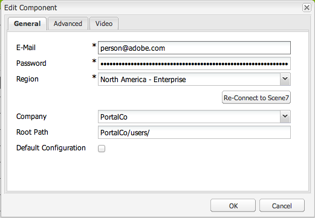

# Integrar o Adobe Experience Manager com o Dynamic Media Classic {#integrating-with-dynamic-media-classic-scene}

O Adobe Dynamic Media Classic é uma solução hospedada para gerenciamento, aprimoramento, publicação e fornecimento de ativos de mídia avançada para exibições e impressão na Web, em dispositivos móveis, por email e conectados à Internet.

Para usar o Dynamic Media Classic, você deve definir a configuração da nuvem para que o Dynamic Media Classic e o Adobe Experience Manager Assets possam interagir entre si. Este documento descreve como configurar o Experience Manager e o Dynamic Media Classic.

Para obter informações sobre como usar todos os componentes do Dynamic Media Classic em uma página e trabalhar com vídeo, consulte [Usar o Dynamic Media Classic](../assets/scene7.md).

>[!NOTE]
>
>* A plataforma de visualizador DHTML do Dynamic Media Classic chegou oficialmente ao fim da vida útil em 31 de janeiro de 2014. Para obter mais informações, consulte [Perguntas frequentes sobre fim de vida útil de visualizadores DHTML](../sites-administering/dhtml-viewer-endoflifefaqs.md).
>* Antes de configurar o Dynamic Media Classic para funcionar com o Experience Manager, consulte [Práticas recomendadas](#best-practices-for-integrating-scene-with-aem) para integração do Dynamic Media Classic com o Experience Manager.
>* Se você usar o Dynamic Media Classic com uma configuração de proxy personalizada, deverá definir ambas as configurações de proxy do cliente HTTP, pois algumas funcionalidades do Experience Manager usam as APIs 3.x e outras usam as APIs 4.x. O 3.x está configurado com [http://localhost:4502/system/console/configMgr/com.day.commons.httpclient](http://localhost:4502/system/console/configMgr/com.day.commons.httpclient) e 4.x está configurado com [http://localhost:4502/system/console/configMgr/org.apache.http.proxyconfigurator](http://localhost:4502/system/console/configMgr/org.apache.http.proxyconfigurator).
>

## Integração de Experience Manager/Dynamic Media Classic versus Dynamic Media {#aem-scene-integration-versus-dynamic-media}

Os usuários do Experience Manager têm uma escolha entre duas soluções para trabalhar com o Dynamic Media. Você pode usar um dos seguintes:

* Integre sua instância do Experience Manager com o Dynamic Media Classic.
* Use o Dynamic Media integrado ao Experience Manager.

Use os critérios a seguir para determinar qual solução escolher:

* Você é um **existente** Cliente da Dynamic Media Classic cujos ativos residem no Dynamic Media Classic para publicação e entrega, mas deseja integrar esses ativos à criação do Sites (WCM), do Experience Manager Assets ou de ambos? Em caso afirmativo, use o [Integração ponto a ponto do Experience Manager/Dynamic Media Classic](#aem-scene-point-to-point-integration) descrito neste documento.

* Se você é um **novo** cliente Experience Manager que tem necessidades de fornecimento de mídia avançada, selecione o [opção Dynamic Media](#aem-dynamic-media). Essa opção faz mais sentido se você não tiver uma conta S7 existente e muitos ativos armazenados nesse sistema.

* Em certos casos, use ambas as soluções. A variável [cenário de dupla utilização](/help/sites-administering/scene7.md#dual-use-scenario) A descreve esse cenário.

### Integração ponto a ponto do Experience Manager/Dynamic Media Classic {#aem-scene-point-to-point-integration}

Ao trabalhar com ativos nesta solução, siga um destes procedimentos:

* Faça upload de ativos diretamente no Dynamic Media Classic e acesse por meio da **Dynamic Media Classic** navegador de conteúdo para criação de página ou
* Faça upload para o Experience Manager Assets e ative a publicação automática no Dynamic Media Classic; você acessa via **Assets** navegador de conteúdo para criação de página

Os componentes usados para essa integração são encontrados na **Dynamic Media Classic** área do componente em [Modo de design](/help/sites-authoring/author-environment-tools.md#page-modes).

### Experience Manager Dynamic Media {#aem-dynamic-media}

Experience Manager Dynamic Media é a unificação dos recursos do Dynamic Media Classic diretamente na plataforma Experience Manager.

Ao trabalhar com ativos nesta solução, siga este fluxo de trabalho:

1. Faça upload de ativos de imagem e vídeo únicos diretamente para o Experience Manager.
1. Codifique vídeos diretamente no Experience Manager.
1. Crie conjuntos baseados em imagem diretamente no Experience Manager.
1. Se aplicável, adicione interatividade a imagens ou vídeos.

Os componentes usados para o Dynamic Media são encontrados no **[!UICONTROL Dynamic Media]** área do componente em [Modo de design](/help/sites-authoring/author-environment-tools.md#page-modes). Eles incluem o seguinte:

* **[!UICONTROL Dynamic Media]** - A **[!UICONTROL Dynamic Media]** O componente é inteligente - dependendo se você adiciona uma imagem ou um vídeo, existem várias opções. O componente oferece suporte a predefinições de imagens, visualizadores baseados em imagem, como conjuntos de imagens, conjuntos de rotação, conjuntos de mídia mista e vídeo. Além disso, o visualizador é responsivo - o tamanho da tela muda automaticamente com base no tamanho da tela. Todos os visualizadores são visualizadores HTML5.

* **[!UICONTROL Mídia interativa]** - A **[!UICONTROL Mídia interativa]** O componente é para ativos como banners do carrossel, imagens interativas e vídeo interativo. Esses ativos têm interatividade neles, como pontos de acesso ou mapas de imagem. Este componente é inteligente. Ou seja, dependendo se você adiciona uma imagem ou um vídeo, existem várias opções. Além disso, o visualizador é responsivo - o tamanho da tela muda automaticamente com base no tamanho da tela. Todos os visualizadores são visualizadores HTML5.

### Cenário de dupla utilização {#dual-use-scenario}

Você pode usar os recursos de integração do Experience Manager com o Dynamic Media e o Dynamic Media Classic simultaneamente. A tabela de casos de uso a seguir descreve quando você ativa e desativa determinadas áreas.

Para usar o Dynamic Media e o Dynamic Media Classic simultaneamente:

1. Configurar [Dynamic Media Classic](#creating-a-cloud-configuration-for-scene) em Cloud Service.
1. Siga as instruções específicas do caso de uso:

   <table>
    <tbody>
    <tr>
    <td> </td>
    <td> </td>
    <td><strong>Dynamic Media</strong></td>
    <td> </td>
    <td><strong>Integração do Dynamic Media Classic</strong></td>
    <td> </td>
    </tr>
    <tr>
    <td><strong>Se você estiver...</strong></td>
    <td><strong>Fluxo de trabalho do caso de uso</strong></td>
    <td><strong>Criação de imagens/vídeo</strong></td>
    <td><strong>Componente de mídia dinâmica</strong></td>
    <td><strong>Navegador de conteúdo e componentes S7</strong></td>
    <td><strong>Upload automático do Assets para o S7</strong></td>
    </tr>
    <tr>
    <td>Novo no Sites e no Dynamic Media</td>
    <td>Fazer upload de ativos no Experience Manager e usar o componente Experience Manager Dynamic Media para criar ativos nas páginas do Sites</td>
    <td>
Ativado
 
(Consulte a etapa 3)
 </td>
    <td><a href="/help/assets/adding-dynamic-media-assets-to-pages.md">Ativado</a></td>
    <td>Desligado</td>
    <td>Desligado</td>
    </tr>
    <tr>
    <td>No varejo, e novo em Sites e Dynamic Media</td>
    <td>Fazer upload de ativos que não são de produtos para o Experience Manager para gerenciamento e entrega. Faça upload dos ativos do PRODUTO para o Dynamic Media Classic e use o navegador de conteúdo do Dynamic Media Classic no Experience Manager e no componente para criar as Páginas de detalhes do produto nos sites.</td>
    <td>
Ativado
 
(Consulte a etapa 3)
 </td>
    <td><a href="/help/assets/adding-dynamic-media-assets-to-pages.md">Ativado</a></td>
    <td><a href="/help/assets/scene7.md#scene-content-browser">Ativado</a></td>
    <td>Desligado</td>
    </tr>
    <tr>
    <td>Novo no Assets e no Dynamic Media</td>
    <td>Fazer upload de ativos para o Experience Manager Assets e usar o URL/código incorporado publicado do Dynamic Media</td>
    <td>
Ativado
 
(Consulte a etapa 3)
 </td>
    <td>Desligado</td>
    <td>Desligado</td>
    <td>Desligado</td>
    </tr>
    <tr>
    <td>Novo no Dynamic Media e na modelagem</td>
    <td>Use o Dynamic Media para criação de imagens e vídeo. Crie modelos de imagem no Dynamic Media Classic e use o localizador de conteúdo do Dynamic Media Classic para incluir modelos nas páginas do Sites.</td>
    <td>
Ativado
 
(Consulte a etapa 3)
 </td>
    <td><a href="/help/assets/adding-dynamic-media-assets-to-pages.md">Ativado</a></td>
    <td><a href="/help/assets/scene7.md#scene-content-browser">Ativado</a></td>
    <td>Desligado</td>
    </tr>
    <tr>
    <td>Um cliente existente do Dynamic Media Classic e são novos no Sites</td>
    <td>Faça upload de ativos para o Dynamic Media Classic e use o navegador de conteúdo Experience Manager Dynamic Media Classic para pesquisar e criar ativos nas páginas do Sites</td>
    <td>Desligado</td>
    <td>Desligado</td>
    <td><a href="/help/assets/scene7.md#scene-content-browser">Ativado</a></td>
    <td>Desligado</td>
    </tr>
    <tr>
    <td>Um cliente existente do Dynamic Media Classic e são novos no Sites e no Assets</td>
    <td>Fazer upload de ativos no DAM e publicar automaticamente no Dynamic Media Classic para entrega. Use o navegador de conteúdo do Experience Manager Dynamic Media Classic para pesquisar e criar ativos nas páginas do Sites.</td>
    <td>Desligado</td>
    <td>Desligado</td>
    <td><a href="/help/assets/scene7.md#scene-content-browser">Ativado</a></td>
    <td>
<a href="#configuringautouploadingfromaemassets">Ativado</a>
 
(Consulte a etapa 4)
 </td>
    </tr>
    <tr>
    <td>Cliente existente do Dynamic Media Classic e novo no Assets</td>
    <td>
Faça upload de ativos no Experience Manager e use o Dynamic Media para gerar representações para download/compartilhamento. Publicar ativos do Experience Manager automaticamente no Dynamic Media Classic para entrega.
 
<strong>Importante:</strong> Incorre processamento duplicado e as representações geradas no Experience Manager não são sincronizadas com o Dynamic Media Classic
 </td>
    <td>
Ativado
 
(Consulte a etapa 3)
 </td>
    <td>Desligado</td>
    <td>Desligado</td>
    <td>
<a href="#configuringautouploadingfromaemassets">Ativado</a>
 
(Consulte a etapa 4)
 </td>
    </tr>
    </tbody>
    </table>

1. (Opcional; consulte a tabela de casos de uso) - Configurar o [Configuração da nuvem do Dynamic Media](/help/assets/config-dynamic.md) e [ativar o servidor do Dynamic Media](/help/assets/config-dynamic.md).
1. (Opcional; consulte a tabela de casos de uso) - Se você optar por habilitar o Upload automático do Assets para o Dynamic Media Classic, será necessário adicionar o seguinte:

   1. Configurar upload automático para o Dynamic Media Classic.
   1. Adicione o **Upload do Dynamic Media Classic** etapa após todas as etapas do fluxo de trabalho do Dynamic Media *no final de* **Ativo de atualização do DAM** workflow ( `https://<server>:<host>/cf#/etc/workflow/models/dam/update_asset.html)`
   1. (Opcional) Restringir o upload de ativos do Dynamic Media Classic por tipo MIME no [https://&lt;server>:&lt;port>/system/console/configMgr/com.day.cq.dam.scene7.impl.Scene7AssetMimeTypeServiceImpl](http://localhost:4502/system/console/configMgr/com.day.cq.dam.scene7.impl.Scene7AssetMimeTypeServiceImpl). Os tipos MIME de ativos que não estão nessa lista não são carregados no servidor do Dynamic Media Classic.
   1. (Opcional) Defina o vídeo na configuração do Dynamic Media Classic. Você pode ativar a codificação de vídeo para o Dynamic Media e o Dynamic Media Classic, ou ambos, simultaneamente. As representações dinâmicas são usadas para visualização e reprodução localmente na instância do Experience Manager, enquanto as representações de vídeo do Dynamic Media Classic são geradas e armazenadas nos servidores do Dynamic Media Classic. Ao configurar serviços de codificação de vídeo para o Dynamic Media e o Dynamic Media Classic, aplique uma [perfil de processamento de vídeo](/help/assets/video-profiles.md) para a pasta de ativos da Dynamic Media Classic.
   1. (Opcional) [Configurar visualização segura no Dynamic Media Classic](/help/sites-administering/scene7.md#configuring-the-state-published-unpublished-of-assets-pushed-to-scene).

#### Limitações {#limitations}

Quando o Dynamic Media Classic e o Dynamic Media estão habilitados, há as seguintes limitações:

* Fazer upload manual para o Dynamic Media Classic selecionando um ativo e arrastando-o para um componente do Dynamic Media Classic em uma página de Experience Manager não funciona.
* Embora os ativos sincronizados do Experience Manager-Dynamic Media Classic sejam atualizados automaticamente para o Dynamic Media Classic quando o ativo é editado no Assets, uma ação de reversão não aciona um novo upload. Dessa forma, o Dynamic Media Classic não obtém a versão mais recente imediatamente após uma reversão. A solução alternativa é editar novamente depois que a reversão for concluída.
* É necessário usar o Dynamic Media para um caso de uso e a integração do Dynamic Media Classic para outro, para que os ativos do Dynamic Media não interajam com o sistema do Dynamic Media Classic? Em caso positivo, não aplique a configuração do Dynamic Media Classic à pasta do Dynamic Media. E não aplique a configuração do Dynamic Media (perfil de processamento) a uma pasta do Dynamic Media Classic.

## Práticas recomendadas para a integração do Dynamic Media Classic com o Experience Manager {#best-practices-for-integrating-scene-with-aem}

Ao integrar o Dynamic Media Classic com o Experience Manager, há algumas práticas recomendadas importantes que devem ser observadas nas seguintes áreas:

* Teste de condução da integração
* Fazer upload de ativos diretamente do Dynamic Media Classic é recomendado para determinados cenários

Consulte [limitações conhecidas](#known-limitations-and-design-implications).

### Teste sua integração {#test-driving-your-integration}

A Adobe recomenda que você teste a integração fazendo com que a pasta raiz aponte somente para uma subpasta, em vez de para uma empresa inteira.

>[!CAUTION]
>
>A importação de ativos de uma conta existente da empresa Dynamic Media Classic pode demorar muito para ser mostrada no Experience Manager. Certifique-se de designar uma pasta no Dynamic Media Classic que não tenha muitos ativos (por exemplo, a pasta raiz geralmente tem muitos ativos e pode travar o sistema).

### Fazer upload de ativos do Experience Manager Assets versus do Dynamic Media Classic {#uploading-assets-from-aem-assets-versus-from-scene}

Você pode fazer upload de ativos usando a funcionalidade Ativos (gerenciamento de ativos digitais) ou acessando o Dynamic Media Classic diretamente no Experience Manager por meio do navegador de conteúdo do Dynamic Media Classic. A escolha depende dos seguintes fatores:

* Os tipos de ativos do Dynamic Media Classic que o Experience Manager Assets ainda não suporta devem ser adicionados a um site Experience Manager diretamente do Dynamic Media Classic, por meio do navegador de conteúdo Dynamic Media Classic. Por exemplo, templates de imagem.
* Para tipos de ativos compatíveis com Experience Manager Assets e Dynamic Media Classic, decidir como carregá-los dependerá do seguinte:

   * Onde os ativos estão hoje E
   * Quão importante é gerenciá-los em um repositório comum

Suponha que os ativos já estejam no Dynamic Media Classic e que seu gerenciamento em um repositório comum não seja importante. Se esse for o caso, exportar os ativos para o Experience Manager Assets somente para sincronizá-los de volta ao Dynamic Media Classic para entrega é uma viagem de ida e volta desnecessária. A Adobe recomenda que você mantenha os ativos em um único repositório e sincronize com o Dynamic Media Classic somente para entrega.

## Configurar a integração do Dynamic Media Classic {#configuring-scene-integration}

É possível configurar o Experience Manager para carregar ativos no Dynamic Media Classic. É possível fazer upload dos ativos de uma pasta de destino do CQ (automática ou manualmente) do Experience Manager para uma conta de empresa da Dynamic Media Classic.

>[!NOTE]
>
>A Adobe recomenda que você use somente a pasta de destino designada para importar ativos do Dynamic Media Classic. Os ativos digitais que residem fora da pasta de destino só podem ser usados em componentes do Dynamic Media Classic em páginas em que a configuração do Dynamic Media Classic foi habilitada. Além disso, são colocados em uma pasta sob demanda no Dynamic Media Classic. A pasta sob demanda não é sincronizada com o Experience Manager (mas os ativos podem ser detectados no navegador de conteúdo do Dynamic Media Classic).

**Para configurar o Dynamic Media Classic para integração com o Experience Manager:**

1. [Definir uma configuração de nuvem](#creating-a-cloud-configuration-for-scene) - Define o mapeamento entre uma pasta do Dynamic Media Classic e uma pasta de Ativos. Conclua esta etapa mesmo se desejar apenas a sincronização unidirecional (Experience Manager Assets para Dynamic Media Classic).
1. [Ativar o **Ouvinte de DAM do Adobe CQ s7dam**](#enabling-the-adobe-cq-scene-dam-listener) - Feito no [!UICONTROL OSGi] console.
1. Se quiser que o Experience Manager Assets carregue automaticamente para o Dynamic Media Classic, ative essa opção e adicione o Dynamic Media Classic à [!UICONTROL Ativo de atualização DAM] fluxo de trabalho. Também é possível fazer upload manual de ativos.
1. Adicionar componentes do Dynamic Media Classic ao sidekick. Essa funcionalidade permite que os usuários usem componentes Dynamic Media Classic em suas páginas de Experience Manager.
1. [Mapeie a configuração para a página no Experience Manager](#enabling-scene-for-wcm) - Essa etapa é necessária para exibir qualquer predefinição de vídeo criada no Dynamic Media Classic. Também é necessário se você precisar publicar um ativo de fora da pasta de destino do CQ na Dynamic Media Classic.

Esta seção aborda como executar todas essas etapas e lista limitações importantes.

### Como funciona a sincronização entre o Dynamic Media Classic e o Experience Manager Assets {#how-synchronization-between-scene-and-aem-assets-works}

Ao configurar a sincronização do Experience Manager Assets e do Dynamic Media Classic, é importante entender o seguinte:

#### Fazer upload para o Dynamic Media Classic a partir do Experience Manager Assets {#uploading-to-scene-from-aem-assets}

* Há uma pasta de sincronização designada no Experience Manager para uploads de Dynamic Media Classic.
* Os uploads para o Dynamic Media Classic podem ser automatizados se os ativos digitais forem colocados na pasta de sincronização designada.
* A estrutura de pastas e subpastas no Experience Manager é replicada no Dynamic Media Classic.

>[!NOTE]
>
>O Experience Manager incorpora todos os metadados como XMP antes de carregá-los no Dynamic Media Classic, de modo que todas as propriedades no nó de metadados estejam disponíveis no Dynamic Media Classic XMP como.

#### Limitações conhecidas e implicações de design {#known-limitations-and-design-implications}

Com a sincronização entre o Experience Manager Assets e o Dynamic Media Classic, existem atualmente as seguintes limitações/implicações de design:

<table>
 <tbody>
  <tr>
   <td><strong>Limitação/implicação do design</strong></td>
   <td><strong>Descrição</strong></td>
  </tr>
  <tr>
   <td>Uma pasta de sincronização (destino) designada</td>
   <td>Você só pode ter uma pasta designada por empresa no Experience Manager para uploads do Dynamic Media Classic. É possível criar várias configurações se você precisar ter acesso a mais de uma conta de empresa no Dynamic Media Classic.</td>
  </tr>
  <tr>
   <td>Estrutura de pastas</td>
   <td>Se você excluir uma pasta sincronizada com ativos, todos os ativos remotos do Dynamic Media Classic serão excluídos, mas a pasta permanecerá.</td>
  </tr>
  <tr>
   <td>Pasta por demanda</td>
   <td>Os ativos que estão fora da pasta de destino e que são carregados manualmente no Dynamic Media Classic no WCM são colocados automaticamente em uma pasta separada sob demanda no Dynamic Media Classic. Você define essa pasta na configuração de nuvem no Experience Manager.</td>
  </tr>
  <tr>
   <td>Mix de mídia</td>
   <td>Os conjuntos de mídia mista aparecem no Experience Manager, embora não sejam suportados no Experience Manager.</td>
  </tr>
  <tr>
   <td>PDF</td>
   <td>Os PDF gerados de eCatalogs no Dynamic Media Classic são importados para a pasta de destino do CQ.</td>
  </tr>
  <tr>
   <td>Atualização da interface</td>
   <td>Ao sincronizar entre o Experience Manager e o Dynamic Media Classic, atualize a interface do usuário para visualizar as alterações. </td>
  </tr>
  <tr>
   <td>Miniaturas de vídeo</td>
   <td>Se você estiver carregando um vídeo no Experience Manager Assets para codificação via Dynamic Media Classic, as miniaturas e os vídeos codificados podem levar algum tempo para estarem disponíveis no Experience Manager Assets, dependendo do tempo de processamento do vídeo.</td>
  </tr>
  <tr>
   <td>Subpastas de destino</td>
   <td>
Se você usar subpastas na pasta de destino, certifique-se de usar nomes exclusivos para cada ativo (independentemente do local). Além disso, configure o Dynamic Media Classic (na área Configuração) para não substituir ativos, independentemente da localização.
 
Caso contrário, os ativos com o mesmo nome carregados em uma subpasta de destino do Dynamic Media Classic serão carregados, mas o ativo com o mesmo nome na pasta de destino será excluído. 
 </td>
  </tr>
 </tbody>
</table>

### Configurar servidores do Dynamic Media Classic {#configuring-scene-servers}

Se você executar o Experience Manager atrás de um proxy ou tiver configurações especiais de firewall, deverá ativar explicitamente os hosts das diferentes regiões. Os servidores são gerenciados em conteúdo no `/etc/cloudservices/scene7/endpoints` e podem ser personalizadas conforme necessário. Selecione um URL e edite-o para alterá-lo, se necessário. Em versões anteriores do Experience Manager, esses valores eram codificados.

Se você navegar até `/etc/cloudservices/scene7/endpoints.html`, você verá os servidores listados (e poderá editá-los tocando no URL):

### Criar uma configuração de nuvem para o Dynamic Media Classic {#creating-a-cloud-configuration-for-scene}

Uma configuração de nuvem define o mapeamento entre uma pasta do Dynamic Media Classic e uma pasta do Experience Manager Assets. Deve ser configurado para sincronizar o Experience Manager Assets com o Dynamic Media Classic. Consulte Como a sincronização funciona para obter mais informações.

>[!CAUTION]
>
>A importação de ativos de uma conta existente da empresa Dynamic Media Classic pode demorar muito para ser mostrada no Experience Manager. Certifique-se de designar uma pasta no Dynamic Media Classic que não tenha muitos ativos. Por exemplo, a pasta raiz geralmente tem muitos ativos.
>
>Se você quiser testar a integração, faça com que a pasta raiz aponte somente para uma subpasta, em vez de para toda a empresa.

>[!NOTE]
>
>É possível ter várias configurações: uma configuração em nuvem representa um usuário em uma empresa da Dynamic Media Classic. Se quiser acessar outras empresas ou usuários da Dynamic Media Classic, crie várias configurações.

**Para criar uma configuração de nuvem para o Dynamic Media Classic:**

1. Selecione o ícone de Experience Manager e navegue até **[!UICONTROL Implantação]** > **[!UICONTROL Cloud Service]** para acessar o Adobe Dynamic Media Classic.

1. Selecionar **[!UICONTROL Configurar agora]**.

   

1. No **[!UICONTROL Título]** e, opcionalmente, no campo **[!UICONTROL Nome]** insira as informações apropriadas. Selecione **[!UICONTROL Criar]**.

   >[!NOTE]
   >
   >Ao criar mais configurações, a variável **[!UICONTROL configuração principal]** é exibido.
   >
   >Fazer **não** alterar a configuração principal. Alterar a configuração principal pode interromper a integração.

1. Digite o endereço de email, a senha e a região da sua conta do Dynamic Media Classic e selecione **[!UICONTROL Conectar-se ao Dynamic Media Classic]**. Você está conectado ao servidor do Dynamic Media Classic e a caixa de diálogo se expande com mais opções.

1. Insira o **[!UICONTROL Empresa]** nome e **[!UICONTROL Caminho raiz]**. Essas informações são o nome do servidor publicado juntamente com qualquer caminho que você deseja especificar. Caso não saiba o nome do servidor publicado, no Dynamic Media Classic, acesse **[!UICONTROL Configuração > Configuração do aplicativo]**).

   >[!NOTE]
   >
   >O caminho raiz do Dynamic Media Classic é o Experience Manager da pasta Dynamic Media Classic conectado ao. Ele pode ser reduzido a uma pasta específica.

   >[!CAUTION]
   >
   >Dependendo do tamanho da pasta do Dynamic Media Classic, a importação de uma pasta raiz pode levar muito tempo. Além disso, os dados do Dynamic Media Classic podem exceder o armazenamento Experience Manager. Verifique se você está importando a pasta correta. A importação de dados demais pode interromper o sistema.

   

1. Selecionar **[!UICONTROL OK]**. Experience Manager salva sua configuração.

>[!NOTE]
>
>Se você estiver se reconectando:
>
>* Ao reconectar ao Dynamic Media Classic na publicação, redefinir a senha na publicação ou reconectar não funciona (não é um problema na instância do Autor).
>* Se você modificar valores como região, nome da empresa, deverá se reconectar ao Dynamic Media Classic. Se as opções de configuração foram modificadas, mas não foram salvas, Experience Manager ainda indicará erroneamente que a configuração é válida. Certifique-se de reconectar.
>

### Ativar o ouvinte do DAM do Adobe CQ Dynamic Media Classic {#enabling-the-adobe-cq-scene-dam-listener}

Ative o Ouvinte do Dam do Adobe CQ Dynamic Media Classic, que está desativado por padrão.

**Para ativar o Ouvinte do Dam do Adobe CQ Dynamic Media Classic:**

1. Selecione o [!UICONTROL Ferramentas] e navegue até **[!UICONTROL Operações]** > **[!UICONTROL Console da Web]**.
1. No console da Web, navegue até **[!UICONTROL Ouvinte de DAM do Adobe CQ Dynamic Media Classic]** e selecione o **[!UICONTROL Ativado]** caixa de seleção

   

1. Selecione **[!UICONTROL Salvar]**.

### Adicionar tempo limite configurável ao fluxo de trabalho de upload do Dynamic Media Classic {#adding-configurable-timeout-to-scene-upload-workflow}

Quando uma instância de Experience Manager é configurada para lidar com a codificação de vídeo por meio do Dynamic Media Classic, por padrão, há um tempo limite de 35 minutos em qualquer trabalho de upload. Para acomodar trabalhos de codificação de vídeo potencialmente mais longos, você pode definir essa configuração.

1. Navegue até **http://localhost:4502/system/console/configMgr/com.day.cq.dam.scene7.impl.Scene7UploadServiceImpl**.

   

1. Altere o número conforme desejado na variável **[!UICONTROL Tempo limite do trabalho ativo]** campo. Qualquer número não negativo é aceito com a unidade de medida em segundos. Por padrão, esse número é definido como 2100.

   >[!NOTE]
   >
   >Prática recomendada: a maioria dos ativos é assimilada em minutos, no máximo (por exemplo, imagens). Mas, em determinadas instâncias (vídeos maiores, por exemplo), aumente o valor de tempo limite para 7.200 segundos (duas horas) para acomodar um tempo de processamento longo. Caso contrário, esse trabalho de upload do Dynamic Media Classic será marcado como **[!UICONTROL UploadFailed]** nos metadados JCR (Java™ Content Repository).

1. Selecione **[!UICONTROL Salvar]**.

### Upload automático do Experience Manager Assets {#autouploading-from-aem-assets}

A partir do Experience Manager 6.3.2, o Experience Manager Assets é configurado para que todos os ativos digitais carregados sejam atualizados para o Dynamic Media Classic, se os ativos estiverem em uma pasta de destino CQ.

Quando um ativo é adicionado ao Experience Manager Assets, ele é automaticamente carregado e publicado no Dynamic Media Classic.

>[!NOTE]
>
O tamanho máximo de arquivo para upload automático do Experience Manager Assets para o Dynamic Media Classic é 500 MB.

**Para fazer upload automático do Experience Manager Assets:**

1. Selecione o ícone de Experience Manager e navegue até **[!UICONTROL Implantação]** > **[!UICONTROL Cloud Service]**.
1. No cabeçalho Dynamic Media, em Configurações disponíveis, selecione **[!UICONTROL dms7 (Dynamic Media)]**).
1. Selecione o **[!UICONTROL Avançado]** , selecione a **[!UICONTROL Ativar carregamento automático]** e selecione **[!UICONTROL OK]**. Configure o fluxo de trabalho do Ativo DAM para incluir o upload para o Dynamic Media Classic.

   >[!NOTE]
   >
   Consulte [Configuração do estado (publicado/não publicado) dos ativos enviados para o Dynamic Media Classic](#configuring-the-state-published-unpublished-of-assets-pushed-to-scene) para obter informações sobre como enviar ativos para o Dynamic Media Classic em um estado não publicado.

   

1. Volte para a página de boas-vindas do Experience Manager e selecione **[!UICONTROL Fluxos de trabalho]**. Clique duas vezes no ícone **Ativo de atualização DAM** fluxo de trabalho para que seja aberto.
1. No sidekick, navegue até o **[!UICONTROL Fluxo de trabalho]** componentes e selecione **[!UICONTROL Dynamic Media Classic]**. Arrastar **[!UICONTROL Dynamic Media Classic]** ao workflow e selecione **[!UICONTROL Salvar]**. Os ativos adicionados ao Experience Manager Assets na pasta de destino são carregados automaticamente no Dynamic Media Classic.

   

   >[!NOTE]
   >
   * Ao adicionar ativos após a automatização, se não forem colocados na pasta de destino do CQ, eles não serão carregados no Dynamic Media Classic.
   * O Experience Manager incorpora todos os metadados como XMP antes de carregá-los no Dynamic Media Classic, de modo que todas as propriedades no nó de metadados estejam disponíveis no Dynamic Media Classic XMP como.

### Configurar o estado (publicado/não publicado) dos ativos enviados para o Dynamic Media Classic {#configuring-the-state-published-unpublished-of-assets-pushed-to-scene}

Se você estiver enviando ativos do Experience Manager Assets para o Dynamic Media Classic, é possível publicá-los automaticamente (comportamento padrão) ou enviá-los para o Dynamic Media Classic em um estado não publicado.

É possível que você não queira publicar ativos imediatamente no Dynamic Media Classic se quiser testá-los em um ambiente de preparo antes de ativá-los. Você pode usar o Experience Manager com o ambiente de teste seguro da Dynamic Media Classic para enviar ativos diretamente do Assets para o Dynamic Media Classic em um estado não publicado.

Os ativos do Dynamic Media Classic permanecem disponíveis por meio da visualização segura. Somente quando os ativos são publicados no Experience Manager é que os ativos do Dynamic Media Classic também entram em produção.

Se quiser publicar ativos imediatamente ao enviá-los para o Dynamic Media Classic, não é necessário configurar opções. Essa funcionalidade é o comportamento padrão.

No entanto, se você não quiser que os ativos enviados para o Dynamic Media Classic sejam publicados automaticamente, esta seção descreve como configurar o Experience Manager e o Dynamic Media Classic para executar essa funcionalidade.

#### Pré-requisitos para enviar ativos para o Dynamic Media Classic não publicados {#prerequisites-to-push-assets-to-scene-unpublished}

Antes de enviar ativos para o Dynamic Media Classic sem publicá-los, você deve configurar o seguinte:

1. [Use o Admin Console para criar um caso de suporte](https://helpx.adobe.com/br/enterprise/admin-guide.html/enterprise/using/support-for-experience-cloud.ug.html). No caso de suporte, solicite a ativação da visualização segura para a sua conta do Dynamic Media Classic.
1. [Configurar a visualização segura da sua conta do Dynamic Media Classic](https://experienceleague.adobe.com/docs/dynamic-media-classic/using/upload-publish/testing-assets-making-them-public.html?lang=en).

Essas etapas são as mesmas que você seguiria para criar qualquer configuração de teste segura no Dynamic Media Classic.

>[!NOTE]
>
Se o ambiente de instalação for um sistema operacional UNIX® de 64 bits, consulte [https://helpx.adobe.com/experience-manager/kb/enable-xmp-write-back-64-bit-redhat.html](https://helpx.adobe.com/experience-manager/kb/enable-xmp-write-back-64-bit-redhat.html) em relação a outras opções de configuração, você deve definir.

#### Limitações conhecidas para enviar ativos no estado não publicado  {#known-limitations-for-pushing-assets-in-unpublished-state}

Se você usar esse recurso, observe as seguintes limitações:

* Não há suporte para controle de versão.
* Se um ativo já estiver publicado no Experience Manager e uma versão subsequente for criada, essa nova versão será publicada imediatamente para produção. Publicar após a ativação só funciona com a publicação inicial de um ativo.

>[!NOTE]
>
Se quiser publicar ativos instantaneamente, a prática recomendada é manter **[!UICONTROL Ativar visualização segura]** definir como **[!UICONTROL Imediatamente]** e use o **[!UICONTROL Ativar carregamento automático]** recurso.

### Definir o estado dos ativos enviados para o Dynamic Media Classic como não publicados {#setting-the-state-of-assets-pushed-to-scene-as-unpublished}

>[!NOTE]
>
Se um usuário publicar o ativo no Experience Manager, ele acionará automaticamente o ativo S7 para o ativo de produção/ativo (o ativo não está mais em visualização segura/não publicado).

**Para definir o estado dos ativos enviados para o Dynamic Media Classic como não publicados:**

1. Selecione o ícone de Experience Manager e navegue até **[!UICONTROL Implantação]** > **[!UICONTROL Cloud Service]**.
1. Selecionar **[!UICONTROL Dynamic Media Classic]**.
1. Selecione sua configuração no Dynamic Media Classic.
1. Selecione o **[!UICONTROL Avançado]** guia.
1. No **[!UICONTROL Ativar visualização segura]** selecione **[!UICONTROL Na ativação de publicação do AEM]** para enviar ativos para o Dynamic Media Classic sem publicar. (Por padrão, esse valor é definido como **[!UICONTROL Imediatamente]**, em que os ativos do Dynamic Media Classic são publicados imediatamente.)

   Consulte [Documentação do Dynamic Media Classic](https://experienceleague.adobe.com/docs/dynamic-media-classic/using/upload-publish/testing-assets-making-them-public.html) para obter mais informações sobre como testar ativos antes de torná-los públicos.

   

1. Selecionar **[!UICONTROL OK]**.

Ativar a Visualização segura significa que os ativos são enviados para o servidor de visualização segura e não são publicados.

Para ver se **[!UICONTROL Visualização Segura]** estiver ativado, navegue até um componente Dynamic Media Classic em uma página no Experience Manager. Selecionar **[!UICONTROL Editar]**. O ativo tem o servidor de visualização seguro listado no URL. Depois de publicar no Experience Manager, o domínio do servidor na referência do arquivo é atualizado do URL de visualização para o URL de produção.

### Ativar o Dynamic Media Classic para WCM {#enabling-scene-for-wcm}

É necessário habilitar o Dynamic Media Classic para WCM por dois motivos:

* Ela ativa a lista suspensa de perfis de vídeo universal para a criação de página. Sem esta lista, a **[!UICONTROL Predefinição de vídeo universal]** está vazio e não pode ser definido.
* Se um ativo digital não estiver na pasta de destino, você poderá fazer upload do ativo para o Dynamic Media Classic se ativar o Dynamic Media Classic para essa página nas propriedades da página. Em seguida, arraste e solte o ativo em um componente do Dynamic Media Classic. As regras normais de herança se aplicam (o que significa que as páginas secundárias herdam a configuração da página principal).

Ao ativar o Dynamic Media Classic para o WCM, como em outras configurações, as regras de herança se aplicam. Você pode ativar o Dynamic Media Classic para WCM na interface do usuário otimizada para toque ou clássica.

#### Ativar o Dynamic Media Classic para WCM na interface do usuário otimizada para toque {#enabling-scene-for-wcm-in-the-touch-optimized-user-interface}

1. Selecione o ícone de Experience Manager e navegue até **[!UICONTROL Sites]**, em seguida, a página raiz do seu site (não é específica do idioma).

1. Na barra de ferramentas, selecione o [!UICONTROL configurações] e selecione **[!UICONTROL Abrir propriedades]**.

1. Selecionar **[!UICONTROL Cloud Service]** e selecione **[!UICONTROL Adicionar configuração]** e selecione **[!UICONTROL Dynamic Media Classic]**.
1. No **[!UICONTROL Adobe Dynamic Media Classic]** selecione a configuração desejada e selecione **[!UICONTROL OK]**.

   

   As predefinições de vídeo dessa configuração do Dynamic Media Classic estão disponíveis para uso no Experience Manager com o componente de vídeo do Dynamic Media Classic nessa página e em páginas secundárias.

#### Ativar o Dynamic Media Classic para WCM na interface clássica {#enabling-scene-for-wcm-in-the-classic-user-interface}

1. No Experience Manager, selecione **[!UICONTROL Sites]** e navegue até a página raiz do seu site (não específico do idioma).

1. No sidekick, selecione a variável **[!UICONTROL Página]** e selecione **[!UICONTROL Propriedades da página]**.

1. Selecionar **[!UICONTROL Cloud Service]** > **[!UICONTROL Adicionar serviços]** > **[!UICONTROL Dynamic Media Classic]**.
1. No **[!UICONTROL Adobe Dynamic Media Classic]** selecione a configuração desejada e selecione **[!UICONTROL OK]**.

   As predefinições de vídeo dessa configuração do Dynamic Media Classic estão disponíveis para uso no Experience Manager com o componente de vídeo do Dynamic Media Classic nessa página e em páginas secundárias.

### Definir uma configuração padrão {#configuring-a-default-configuration}

Se você tiver várias configurações do Dynamic Media Classic, poderá especificar uma delas como padrão para o navegador de conteúdo do Dynamic Media Classic.

Somente uma configuração do Dynamic Media Classic pode ser marcada como padrão em um determinado momento. A configuração padrão são os ativos da empresa exibidos por padrão no Dynamic Media Classic Content Browser.

**Para definir uma configuração padrão:**

1. Selecione o ícone de Experience Manager e navegue até **[!UICONTROL Implantação]** > **[!UICONTROL Cloud Service]**.
1. Selecionar **[!UICONTROL Dynamic Media Classic]**.
1. Selecione sua configuração no Dynamic Media Classic.
1. Para abrir a configuração, selecione **[!UICONTROL Editar]**.

1. No **[!UICONTROL Geral]** , selecione a **[!UICONTROL Configuração padrão]** marque a caixa para torná-la a empresa padrão e o caminho raiz que aparecem no navegador de conteúdo do Dynamic Media Classic.

   

   >[!NOTE]
   >
   Se houver apenas uma configuração, selecione a variável **[!UICONTROL Configuração padrão]** não tem efeito.

### Configurar a pasta Ad-hoc {#configuring-the-ad-hoc-folder}

Você pode configurar a pasta sob demanda na qual os ativos são carregados no Dynamic Media Classic quando o ativo não está na pasta de destino do CQ. Consulte Publicação de ativos de fora da pasta de destino do CQ.

**Para configurar a pasta Ad-hoc:**

1. Selecione o ícone de Experience Manager e navegue até **[!UICONTROL Implantação]** > **[!UICONTROL Cloud Service]**.
1. Selecionar **[!UICONTROL Dynamic Media Classic]**.
1. Selecione sua configuração no Dynamic Media Classic.
1. Para abrir a configuração, selecione **[!UICONTROL Editar]**.

1. Selecione o **[!UICONTROL Avançado]** guia. No **[!UICONTROL Pasta ad-hoc]** , é possível modificar o **Ad-hoc** pasta. Por padrão, é a variável **name_of_the_company/CQ5_adhoc**.

   

### Configurar predefinições de vídeo universal {#configuring-universal-presets}

Para configurar predefinições de vídeo universal para o componente de vídeo, consulte [Vídeo](/help/assets/s7-video.md).

## Habilitar suporte a parâmetro de trabalho de upload de Ativos/Dynamic Media Classic baseado em tipo de MIME {#enabling-mime-type-based-assets-scene-upload-job-parameter-support}

Você pode ativar parâmetros configuráveis de processos de upload do Dynamic Media Classic que são acionados pela sincronização de ativos do Digital Asset Manager/Dynamic Media Classic.

Especificamente, você configura o formato de arquivo aceito por tipo MIME na área OSGi (Open Service Gateway initiative) do painel Configuração do console da Web do Experience Manager. Em seguida, você pode personalizar os parâmetros de processo de upload individuais usados para cada tipo MIME no JCR (Java™ Content Repository).

**Para ativar ativos baseados em tipo MIME:**

1. Selecione o ícone de Experience Manager e navegue até **[!UICONTROL Ferramentas]** > **[!UICONTROL Operações]** > **[!UICONTROL Console da Web]**.
1. No painel Configuração do console da Web do Adobe Experience Manager, no **[!UICONTROL OSGi]** selecione **[!UICONTROL Configuração]**.
1. Na coluna Nome, localize e selecione **[!UICONTROL Serviço de tipo MIME do ativo do Adobe CQ Dynamic Media Classic]** para editar a configuração.
1. Na área Mapeamento do tipo MIME, selecione qualquer sinal de adição (+) para adicionar um tipo MIME.

   Consulte [Tipos MIME suportados](/help/assets/assets-formats.md#supported-mime-types).

1. No campo de texto, digite o novo nome do tipo MIME.

   Por exemplo, você digitaria um `<file_extension>=<mime_type>` como em `EPS=application/postscript` OU `PSD=image/vnd.adobe.photoshop`.

1. No canto inferior direito da janela de configuração, selecione **[!UICONTROL Salvar]**.
1. Retorne ao Experience Manager e, no painel à esquerda, selecione **[!UICONTROL CRXDE Lite]**.
1. Na página CRXDE Lite, no painel à esquerda, acesse `/etc/cloudservices/scene7/<environment>` (substituto `<environment>` para o nome real).
1. Expandir `<environment>` (substituto `<environment>` para o nome real) para revelar a `mimeTypes` nó.
1. Selecione o mimeType que você acabou de adicionar.

   Por exemplo, `mimeTypes > application_postscript` OU `mimeTypes > image_vnd.adobe.photoshop`.

1. No lado direito da página do CRXDE Lite, selecione a **[!UICONTROL Propriedades]** guia.
1. Especifique um parâmetro de trabalho de upload do Dynamic Media Classic no **[!UICONTROL jobParam]** campo de valor.

   Por exemplo, `psprocess="rasterize"&psresolution=120` .

   Consulte a [API do sistema de produção de imagens Adobe Dynamic Media Classic](https://experienceleague.adobe.com/docs/dynamic-media-developer-resources/image-production-api/c-overview.html) para fazer upload de parâmetros de job, você pode usar mais.

   >[!NOTE]
   >
   Se você estiver fazendo upload de arquivos PSD e quiser processá-los como modelos com extrações de camada, insira o seguinte no campo **[!UICONTROL jobParam]** campo de valor:
   >
   `process=MaintainLayers&layerNaming=AppendName&createTemplate=true`
   >
   Certifique-se de que o arquivo PSD tenha &quot;camadas&quot;. Se for estritamente uma imagem ou uma imagem com máscara, ela será processada como uma imagem, pois não há camadas a serem processadas.

1. No canto superior esquerdo da página CRXDE Lite, selecione **[!UICONTROL Salvar tudo]**.

## Solução de problemas de integração do Dynamic Media Classic e do Experience Manager {#troubleshooting-scene-and-aem-integration}

Se tiver problemas ao integrar o Experience Manager com o Dynamic Media Classic, consulte os cenários a seguir para obter soluções.

**Se a publicação de ativos digitais no Dynamic Media Classic falhar:**

* Verifique se o ativo que você está fazendo upload está na **[!UICONTROL Público alvo do CQ]** (você especifica essa pasta na configuração da nuvem do Dynamic Media Classic).
* Se não estiver, você deverá definir a configuração da nuvem no **[!UICONTROL Propriedades da página]** para que a página permita o upload para a **[!UICONTROL Ad hoc do CQ]** pasta.

* Verifique os logs para obter informações.

**Se as predefinições de vídeo não forem exibidas:**

* Verifique se você definiu a configuração de nuvem dessa página por meio de **[!UICONTROL Propriedades da página]**. As predefinições de vídeo estão disponíveis no componente de vídeo do Dynamic Media Classic.

**Se os ativos de vídeo não forem reproduzidos no Experience Manager:**

* Verifique se você usou o componente de vídeo correto. O componente de vídeo do Dynamic Media Classic é diferente do componente de vídeo básico. Consulte [Componente de vídeo do Foundation versus Componente de vídeo do Dynamic Media Classic](/help/assets/s7-video.md).

**Se os ativos novos ou modificados no Experience Manager não forem carregados automaticamente na Dynamic Media Classic:**

* Verifique se os ativos estão na pasta de destino do CQ. Somente os ativos que estão na pasta de destino do CQ são atualizados automaticamente (desde que você tenha configurado o Experience Manager Assets para carregar ativos automaticamente).
* Verifique se você definiu a configuração do Cloud Service como Ativar o upload automático e se atualizou e salvou o fluxo de trabalho do ativo DAM para incluir o upload do Dynamic Media Classic.
* Ao fazer upload de uma imagem em uma subpasta da pasta de destino do Dynamic Media Classic, siga um destes procedimentos:

   * Verifique se os nomes de todos os ativos, independentemente da localização, são exclusivos. Caso contrário, o ativo na pasta de destino principal será excluído e somente o ativo na subpasta permanecerá.
   * Altere como o Dynamic Media Classic substitui ativos na área Configuração da conta do Dynamic Media Classic. Não defina o Dynamic Media Classic para substituir ativos independentemente do local se você usar ativos com o mesmo nome em subpastas.

**Se os ativos ou pastas excluídos não estiverem sincronizados entre o Dynamic Media Classic e o Experience Manager:**

* Os ativos e as pastas excluídos no Experience Manager Assets ainda são exibidos na pasta sincronizada no Dynamic Media Classic. Excluí-los manualmente.

**Se o upload do vídeo falhar:**

* Se o upload do vídeo falhar e você estiver usando o Experience Manager para codificar vídeos por meio da integração com o Dynamic Media Classic, consulte [Adicionar tempo limite configurável ao fluxo de trabalho de upload do Dynamic Media Classic](#adding-configurable-timeout-to-scene-upload-workflow).

>[!CAUTION]
>
A importação de ativos de uma conta existente da empresa Dynamic Media Classic pode demorar muito para ser mostrada no Experience Manager. Certifique-se de designar uma pasta no Dynamic Media Classic que não tenha muitos ativos. Por exemplo, a pasta raiz geralmente tem muitos ativos.
>
Se você quiser testar a integração, faça com que a pasta raiz aponte somente para uma subpasta, em vez de para toda a empresa.
