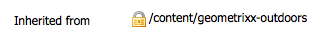

# Integração com Adobe Search &amp; Promote{#integrating-with-adobe-search-promote}

Para chamar o serviço Adobe Search &amp; Promote de seu site, execute as seguintes tarefas:

1. Especifique o URL da nuvem.
1. Configure a conexão com o serviço Search &amp; Promote.
1. Adicionar componentes do Search &amp; Promote ao Sidekick.
1. Use os componentes para criar o conteúdo. (Consulte [Adicionar recursos do Search &amp; Promote a uma página da Web](/help/sites-authoring/search-and-promote.md).)
1. Adicione banners às suas páginas. Imagens de banner são sensíveis aos dados do Search &amp; Promote.
1. Gere um mapa de site para o serviço Search &amp; Promote ser consumido.

>[!NOTE]
>
>Se você estiver usando o Search &amp; Promote com uma configuração de proxy personalizada, precisará configurar ambas as configurações de proxy do Cliente HTTP, pois algumas funcionalidades do AEM estão usando as APIs 3.x e outras as APIs 4.x:
>
>* 3.x está configurado com [https://localhost:4502/system/console/configMgr/com.day.commons.httpclient](https://localhost:4502/system/console/configMgr/com.day.commons.httpclient)
>* 4.x está configurado com [https://localhost:4502/system/console/configMgr/org.apache.http.proxyconfigurator](https://localhost:4502/system/console/configMgr/org.apache.http.proxyconfigurator)

>

## Alteração do URL do serviço Search &amp; Promote {#changing-the-search-promote-service-url}

O URL padrão configurado para o serviço Search &amp; Promote é `https://searchandpromote.omniture.com/px/`. Para usar um serviço diferente, use o console OSGi para especificar um URL diferente.

1. Abra o console OSGi e clique na guia Configuração . ([https://localhost:4502/system/console/configMgr](https://localhost:4502/system/console/configMgr))
1. Clique no item Configuração do Search &amp; Promote Day CQ .
1. Digite o URL na caixa URI do servidor remoto e clique em Salvar.

## Configuração da conexão com o Search &amp; Promote {#configuring-the-connection-to-search-promote}

Configure uma ou mais conexões com o Search &amp; Promote para que suas páginas da Web possam interagir com o serviço. Para se conectar, você precisa da identificação do membro e do número da conta do Search &amp; Promote.

1. No ícone **Ferramentas** > **Implantação**, selecione **Cloud Services**.

   Isso leva você ao painel Cloud Services. Se em uma máquina local, o url do painel será semelhante a:

   [https://localhost:4502/libs/cq/core/content/tools/cloudservices.html](https://localhost:4502/libs/cq/core/content/tools/cloudservices.html)

1. Na página Cloud Services, clique no link Adobe Search &amp; Promote ou no ícone Search &amp; Promote.

1. Se esta for a primeira vez que você está configurando o Search &amp; Promote do Adobe, clique em **Configurar agora** para abrir o painel Criar configuração.

   Se quiser saber mais sobre o Search &amp; Promote, clique em **Saiba mais** em vez disso.

   

1. Insira um **Título** que seja reconhecível aos autores da página, insira um **Nome** exclusivo e clique em **Criar**.

   A janela **Editar componente** é aberta.

   Além disso, a Configuração recém-criada aparece abaixo de **Configurações disponíveis** no item de lista **Cloud Services dashboard** Adobe.

   

1. Adicione o seguinte aos campos na caixa de diálogo **Editar componente**.

   * **ID de membro**
   * **Número da conta**

   >[!NOTE]
   >
   >Para obter essas informações **você mesmo,** primeiro precisa fazer logon
   >
   >[https://searchandpromote.omniture.com/center/](https://searchandpromote.omniture.com/center/)
   >
   >
   >usando suas credenciais válidas do Search&amp;Promote (email/senha).
   >Em seguida, você precisa verificar o url na barra de endereços do seu navegador, que deve ser semelhante a:
   >
   >
   >[https://searchandpromote.omniture.com/px/home/?sp_id=XXXXXXXX-spYYYYYYYY](https://searchandpromote.omniture.com/px/home/?sp_id=XXXXXXXX-spYYYYYYYY)
   >
   >**Em que:**
   >
   >    * **** XXXXXXXX corresponde à sua** ID do membro**
   >    * **** spAAAAcorresponde ao seu número  **de conta**

1. Clique em **Conectar ao Search &amp; Promote**.

   Quando a mensagem de sucesso de conexão for exibida, clique em **OK**.

   (Após a conexão, o texto do botão muda para** Reconectar ao Search &amp; Promote**.)

1. Clique em **OK**. A página Configurações do Search &amp; Promote é exibida para a configuração que você acabou de criar.

## Configuração do data center {#configuring-the-data-center}

Se sua conta do Search &amp; Promote estiver na Ásia ou na Europa, será necessário alterar o data center padrão para que ele aponte para o correto (o data center padrão é para contas da América do Norte).

Para configurar o data center:

1. Navegue até o console da Web em `https://localhost:4502/system/console/configMgr/com.day.cq.searchpromote.impl.SearchPromoteServiceImpl`

   

1. Dependendo do local do servidor, altere o URI para um dos seguintes:

   * América do Norte: [https://center.atomz.com/px/](https://center.atomz.com/px/)
   * EMEA: [https://center.lon5.atomz.com/px/](https://center.lon5.atomz.com/px/)
   * APAC: [https://center.sin2.atomz.com/px/](https://center.sin2.atomz.com/px/)

1. Clique em **Salvar**.

## Adicionar componentes do Search &amp; Promote ao Sidekick {#adding-search-promote-components-to-sidekick}

No modo Design, edite um componente **par** para permitir os componentes do Search &amp; Promote no Sidekick. (Consulte a documentação [Componentes](/help/sites-developing/components.md#addinganewcomponenttotheparagraphsystemdesignmode) para obter mais informações.)

Para obter informações sobre como usar os componentes, consulte [Adicionar recursos do Search &amp; Promote a uma página da Web](/help/sites-authoring/search-and-promote.md).)

## Especificação do serviço de Search &amp; Promote que suas páginas usam {#specifying-the-search-promote-service-that-your-pages-use}

Configure as páginas da Web para que elas usem um serviço específico do Search &amp; Promote. Os componentes do Search &amp; Promote usam automaticamente o serviço de sua página de host.

Quando você configura as propriedades do Search &amp; Promote para uma página, todas as páginas secundárias herdam as configurações. Se necessário, você pode configurar páginas filhas para substituir as configurações herdadas.

>[!NOTE]
>
>A conexão de serviço já deve estar configurada. (Consulte [Configurar a conexão com Search &amp; Promote](#connection).)

1. Abra a caixa de diálogo **Propriedades da página**. Por exemplo, na página** Sites**, clique com o botão direito do mouse na página e clique em **Propriedades**.
1. Clique na guia **Cloud Services**.
1. Para desativar a herança das configurações dos serviços de nuvem de uma página pai, clique no ícone de cadeado ao lado do caminho de herança.

   

1. Clique em **Adicionar Serviço**, selecione **Adobe Search &amp; Promote** e clique em **OK**.
1. Selecione a configuração de conexão da sua conta Search &amp; Promote e clique em **OK**.

## Feed do produto {#product-feed}

A integração do Search &amp; Promote permite:

* use a API do eCommerce, independentemente da estrutura de repositório subjacente e da plataforma de comércio.
* utilize o recurso Conector de índice do Search &amp; Promote para fornecer um feed de produto no formato XML.
* aproveitar o recurso de Controle remoto do Search &amp; Promote para executar solicitações sob demanda ou programadas do feed do produto
* geração de feed para diferentes contas do Search &amp; Promote, configuradas como configurações dos serviços de nuvem.

Para obter mais informações, leia [Feed do produto](/help/sites-administering/product-feed.md).
