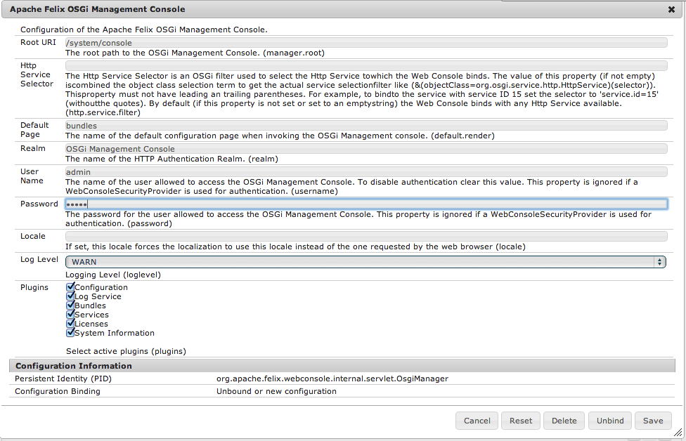

# Lista de verificação de segurança {#security-checklist}

Esta seção trata de várias etapas necessárias para garantir que a instalação do AEM esteja segura quando implantada. A lista de verificação deve ser aplicada de cima para baixo.

>[!NOTE]
>
>Informações adicionais também estão disponíveis sobre as ameaças de segurança mais perigosas publicadas pelo [Open Web Application Security Project (OWASP)](https://owasp.org/www-project-top-ten/).

>[!NOTE]
>
>Há algumas [considerações de segurança](/help/sites-developing/dev-guidelines-bestpractices.md#security-considerations) adicionais aplicáveis na fase de desenvolvimento.

## Principais medidas de segurança {#main-security-measures}

### Execute o AEM no modo de produção pronta {#run-aem-in-production-ready-mode}

Para obter mais informações, consulte [Executando o AEM no Modo de Produção Pronto](/help/sites-administering/production-ready.md).

### Ativar HTTPS para segurança da camada de transporte {#enable-https-for-transport-layer-security}

Habilitar a camada de transporte HTTPS em instâncias de autor e publicação é obrigatório para ter uma instância segura.

>[!NOTE]
>
>Consulte a seção [Habilitando HTTP por SSL](/help/sites-administering/ssl-by-default.md) para obter mais informações.

### Instalar Hotfixes de Segurança {#install-security-hotfixes}

Verifique se você instalou os [Hotfixes de Segurança mais recentes fornecidos pelo Adobe](https://experienceleague.adobe.com/docs/experience-manager-release-information/aem-release-updates/aem-releases-updates.html?lang=pt-BR).

### Alterar senhas padrão para as contas de administrador do console do AEM e OSGi {#change-default-passwords-for-the-aem-and-osgi-console-admin-accounts}

O Adobe recomenda que, após a instalação, você altere a senha das contas [**AEM** `admin` privilegiadas](#changing-the-aem-admin-password) (em todas as instâncias).

Essas contas incluem:

* A conta do AEM `admin`

  Depois de alterar a senha da conta de administrador AEM, use a nova senha ao acessar o CRX.

* A senha `admin` para o console OSGi da Web

  Essa alteração também se aplica à conta de administrador usada para acessar o console da Web, portanto, use a mesma senha ao acessá-lo.

Essas duas contas usam credenciais separadas e ter uma senha forte e distinta para cada uma é essencial para uma implantação segura.

#### Alteração da senha do administrador do AEM {#changing-the-aem-admin-password}

A senha da conta de administrador AEM pode ser alterada por meio do console [Operações do Granite - Usuários](/help/sites-administering/granite-user-group-admin.md).

Aqui você pode editar a conta `admin` e [alterar a senha](/help/sites-administering/granite-user-group-admin.md#changing-the-password-for-an-existing-user).

>[!NOTE]
>
>Alterar a conta de administrador também altera a conta do console da Web OSGi. Depois de alterar a conta de administrador, você deve alterar a conta OSGi para algo diferente.

#### Importância de alterar a senha do console da Web OSGi {#importance-of-changing-the-osgi-web-console-password}

Além da conta AEM `admin`, a falha na alteração da senha padrão para a senha do console da Web OSGi pode levar a:

* Exposição do servidor com uma senha padrão durante a inicialização e o encerramento (que pode levar minutos para servidores grandes);
* Exposição do servidor quando o repositório está inativo/reiniciando o pacote - e OSGI está em execução.

Para obter mais informações sobre como alterar a senha do console da Web, consulte [Alterando a senha de administrador do console da Web OSGi](/help/sites-administering/security-checklist.md#changing-the-osgi-web-console-admin-password) abaixo.

#### Alteração da senha do administrador do console da Web OSGi {#changing-the-osgi-web-console-admin-password}

Altere a senha usada para acessar o console da Web. Use uma [configuração OSGI](/help/sites-deploying/configuring-osgi.md) para atualizar as seguintes propriedades do **Console de Gerenciamento OSGi do Apache Felix**:

* **Nome do Usuário** e **Senha**, as credenciais para acessar o próprio Console de Gerenciamento da Web do Apache Felix.
A senha deve ser alterada *após* a instalação inicial para garantir a segurança da sua instância.

>[!NOTE]
>
>Consulte [Configuração OSGI](/help/sites-deploying/configuring-osgi.md) para obter detalhes completos sobre como definir as configurações OSGi.

**Para alterar a senha de administrador do console da Web OSGi**:

1. Usando o menu **Ferramentas**, **Operações**, abra o **Console da Web** e navegue até a seção **Configuração**.
Por exemplo, em `<server>:<port>/system/console/configMgr`.
1. Navegue até a entrada do **Console de Gerenciamento OSGi do Apache Felix** e abra-a.
1. Alterar o **nome de usuário** e a **senha**.

   

1. Selecione **Salvar**.

### Implementar manipulador de erros personalizado {#implement-custom-error-handler}

A Adobe recomenda definir páginas de manipulador de erros personalizadas, especialmente para códigos de resposta HTTP 404 e 500, para impedir a divulgação de informações.

>[!NOTE]
>
>Consulte [Como posso criar scripts personalizados ou manipuladores de erros](https://experienceleague.adobe.com/docs/experience-manager-cloud-service/content/implementing/developing/full-stack/custom-error-page.html?lang=pt-BR) para obter mais detalhes.

### Lista de verificação de segurança completa do Dispatcher {#complete-dispatcher-security-checklist}

O AEM Dispatcher é uma parte essencial de sua infraestrutura. A Adobe recomenda que você conclua a [lista de verificação de segurança do Dispatcher](https://experienceleague.adobe.com/docs/experience-manager-dispatcher/using/getting-started/security-checklist.html?lang=pt-BR).

>[!CAUTION]
>
>Usando o Dispatcher, você deve desativar o seletor &quot;.form&quot;.

## Etapas de verificação {#verification-steps}

### Configurar usuários de replicação e transporte {#configure-replication-and-transport-users}

Uma instalação padrão do AEM especifica `admin` como usuário para credenciais de transporte nos [agentes de replicação](/help/sites-deploying/replication.md) padrão. Além disso, o usuário administrador é usado para originar a replicação no sistema do autor.

Por questões de segurança, ambos devem ser alterados para refletir o caso de uso específico em questão, tendo em mente os dois aspectos a seguir:

* O **usuário de transporte** não deve ser o usuário administrador. Em vez disso, configure um usuário no sistema de publicação que tenha direitos de acesso somente às partes relevantes do sistema de publicação e use as credenciais desse usuário para o transporte.

  Você pode começar com o usuário receptor de replicação agrupada e configurar os direitos de acesso desse usuário para corresponder à sua situação

* O **usuário de replicação** ou a **ID de Usuário Agente** também não deve ser o usuário administrador, mas um usuário que pode ver somente o conteúdo replicado. O usuário de replicação é usado para coletar o conteúdo a ser replicado no sistema do autor antes de ser enviado ao publicador.

### Verifique as verificações de integridade da segurança do painel de operações {#check-the-operations-dashboard-security-health-checks}

O AEM 6 apresenta o novo Painel de operações, destinado a ajudar os operadores de sistema a solucionar problemas e monitorar a integridade de uma instância.

O painel também vem com uma coleção de verificações de integridade de segurança. É recomendável verificar o status de todas as verificações de integridade de segurança antes de entrar em atividade com a instância de produção. Para obter mais informações, consulte a [documentação do Painel de Operações](/help/sites-administering/operations-dashboard.md).

### Verifique se o conteúdo de exemplo está presente {#check-if-example-content-is-present}

Todos os exemplos de conteúdo e usuários (por exemplo, o projeto do Geometrixx e seus componentes) devem ser desinstalados e excluídos completamente em um sistema produtivo antes de torná-lo publicamente acessível.

>[!NOTE]
>
>Os aplicativos de amostra `We.Retail` serão removidos se esta instância estiver em execução no [Modo Pronto para Produção](/help/sites-administering/production-ready.md). Se esse cenário não for o caso, você poderá desinstalar o conteúdo de amostra acessando o Gerenciador de Pacotes e procurando e desinstalando todos os pacotes do `We.Retail`.

Consulte [Trabalhar Com Pacotes](package-manager.md).

### Verifique se os pacotes de desenvolvimento do CRX estão presentes {#check-if-the-crx-development-bundles-are-present}

Esses pacotes OSGi de desenvolvimento devem ser desinstalados nos sistemas produtivos do autor e da publicação antes de torná-los acessíveis.

* Suporte ao CRXDE do Adobe (com.adobe.granite.crxde-support)
* Adobe Granite CRX Explorer (com.adobe.granite.crx-explorer)
* CRXDE Lite do Adobe Granite (com.adobe.granite.crxde-lite)

### Verifique se o pacote de desenvolvimento do Sling está presente {#check-if-the-sling-development-bundle-is-present}

As [Ferramentas de desenvolvedor do AEM](/help/sites-developing/aem-eclipse.md) implantam a Instalação do suporte de Apache Sling Tooling (org.apache.sling.tooling.support.install).

Esse pacote OSGi deve ser desinstalado nos sistemas produtivos do autor e da publicação antes de torná-los acessíveis.

### Protect contra falsificação de solicitação entre sites {#protect-against-cross-site-request-forgery}

#### A estrutura de proteção CSRF {#the-csrf-protection-framework}

O AEM 6.1 é fornecido com um mecanismo que ajuda a proteger contra ataques de falsificação de solicitação entre sites, chamado de **Estrutura de proteção CSRF**. Para obter mais informações sobre como usá-lo, consulte a [documentação](/help/sites-developing/csrf-protection.md).

#### O filtro referenciador do Sling {#the-sling-referrer-filter}

Para resolver problemas de segurança conhecidos com a CSRF (Falsificação de solicitação entre sites) no CRX WebDAV e no Apache Sling, adicione configurações para o filtro Referenciador para usá-lo.

O serviço de filtro referenciador é um serviço OSGi que permite configurar o seguinte:

* quais métodos http devem ser filtrados
* se um cabeçalho de referenciador vazio é permitido
* e uma lista de servidores permitidos além do host do servidor.

  Por padrão, todas as variações do host local e os nomes de host atuais aos quais o servidor está vinculado estão na lista.

Para configurar o serviço de filtro de referenciador:

1. Abra o console Apache Felix (**Configurações**) em:

   `https://<server>:<port_number>/system/console/configMgr`

1. Fazer logon como `admin`.
1. No menu **Configurações**, selecione:

   `Apache Sling Referrer Filter`

1. No campo `Allow Hosts`, insira todos os hosts permitidos como referenciador. Cada entrada deve estar no formato

   &lt;protocol>://&lt;server>:&lt;port>

   Por exemplo:

   * `https://allowed.server:80` permite todas as solicitações deste servidor com a porta especificada.
   * Se também quiser permitir solicitações https, insira uma segunda linha.
   * Se você permitir todas as portas desse servidor, poderá usar `0` como o número da porta.

1. Marque o campo `Allow Empty` se desejar permitir cabeçalhos de referenciador vazios/ausentes.

   >[!CAUTION]
   >
   >A Adobe recomenda que você forneça um referenciador ao usar ferramentas de linha de comando, como `cURL`, em vez de permitir um valor vazio, pois ele pode expor seu sistema a ataques CSRF.

1. Edite os métodos que esse filtro usa para verificações com o campo `Filter Methods`.

1. Clique em **Salvar** para salvar as alterações.

### Configurações OSGI {#osgi-settings}

Algumas configurações de OSGI são definidas por padrão para facilitar a depuração do aplicativo. Altere essas configurações nas instâncias produtivas de publicação e criação para evitar que informações internas vazem para o público.

>[!NOTE]
>
>Todas as configurações abaixo, exceto **O Filtro de Depuração Day CQ WCM**, são automaticamente cobertas pelo [Modo Pronto para Produção](/help/sites-administering/production-ready.md). Dessa forma, a Adobe recomenda que você revise todas as configurações antes de implantar sua instância em um ambiente produtivo.

Para cada um dos seguintes serviços, as configurações especificadas devem ser alteradas:

* [Gerenciador de biblioteca de HTML do Adobe Granite](/help/sites-deploying/osgi-configuration-settings.md#day-cq-html-library-manager):

   * habilitar **Minify** (para remover caracteres CRLF e espaços em branco).
   * habilite o **Gzip** (para permitir que os arquivos sejam compactados e acessados com uma solicitação).
   * desabilitar **Depuração**
   * desabilitar **Horário**

* [Filtro de Depuração WCM CQ de Dias](/help/sites-deploying/osgi-configuration-settings.md#day-cq-wcm-debug-filter):

   * desmarcar **Habilitar**

* [Filtro WCM CQ de Dia](/help/sites-deploying/osgi-configuration-settings.md):

   * somente em publicação, defina **Modo WCM** como &quot;desabilitado&quot;

* [Apache Sling JavaScript Handler](/help/sites-deploying/osgi-configuration-settings.md#apache-sling-javascript-handler):

   * desabilitar **Gerar Informações de Depuração**

* [Manipulador de script JSP do Apache Sling](/help/sites-deploying/osgi-configuration-settings.md#apache-sling-jsp-script-handler):

   * desabilitar **Gerar Informações de Depuração**
   * desabilitar **Conteúdo Mapeado**

Consulte [Configurações OSGi](/help/sites-deploying/osgi-configuration-settings.md).

Ao trabalhar com AEM, há vários métodos de gerenciamento das definições de configuração desses serviços; consulte [Configurar OSGi](/help/sites-deploying/configuring-osgi.md) para obter mais detalhes e as práticas recomendadas.

## Outras leituras {#further-readings}

### Atenuar ataques de negação de serviço (DoS) {#mitigate-denial-of-service-dos-attacks}

Um ataque de negação de serviço (DoS) é uma tentativa de tornar um recurso de computador indisponível para os usuários desejados. Esse ataque geralmente é feito sobrecarregando o recurso; por exemplo:

* Uma enxurrada de solicitações de uma fonte externa.
* Uma solicitação de mais informações do que o sistema pode fornecer com êxito.

  Por exemplo, uma representação em JSON de todo o repositório.

* Ao solicitar uma página de conteúdo com um número ilimitado de URLs, o URL pode incluir um identificador, alguns seletores, uma extensão e um sufixo. Qualquer um deles pode ser modificado.

  Por exemplo, `.../en.html` também pode ser solicitado como:

   * `.../en.ExtensionDosAttack`
   * `.../en.SelectorDosAttack.html`
   * `.../en.html/SuffixDosAttack`

  Todas as variações válidas (por exemplo, retornam uma resposta `200` e são configuradas para serem armazenadas em cache) são armazenadas em cache pelo Dispatcher, eventualmente resultando em um sistema de arquivos completo e nenhum serviço para mais solicitações.

Há muitos pontos de configuração para evitar esses ataques, mas apenas os pontos relacionados ao AEM são discutidos aqui.

**Configurando o Sling para Evitar DoS**

O Sling é *centrado no conteúdo*. O processamento se concentra no conteúdo à medida que cada solicitação (HTTP) é mapeada para o conteúdo no formato de um recurso JCR (um nó de repositório):

* O primeiro destino é o recurso (nó JCR) que contém o conteúdo.
* Segundo, o renderizador, ou script, está localizado nas propriedades de recurso com determinadas partes da solicitação (por exemplo, seletores e/ou a extensão).

Consulte [Processamento de solicitação do Sling](/help/sites-developing/the-basics.md#sling-request-processing) para obter mais informações.

Essa abordagem torna o Sling eficiente e flexível, mas, como sempre, é a flexibilidade que deve ser gerenciada com cuidado.

Para ajudar a evitar o uso indevido de DoS, você pode fazer o seguinte:

1. Incorpore controles no nível do aplicativo. Devido ao número de variações possíveis, uma configuração padrão não é viável.

   No aplicativo, você deve:

   * Controle os seletores em seu aplicativo, para que você *somente* atenda aos seletores explícitos necessários e retorne `404` para todos os outros.
   * Evite a saída de um número ilimitado de nós de conteúdo.

1. Verifique a configuração dos renderizadores padrão, que pode ser uma área com problemas.

   * Especificamente, o renderizador de JSON atravessa a estrutura de árvore em vários níveis.

     Por exemplo, a solicitação:

     `http://localhost:4502/.json`

     O poderia despejar todo o repositório em uma representação JSON, o que pode causar problemas significativos do servidor. Por esse motivo, o Sling define um limite no número de resultados máximos. Para limitar a profundidade da renderização JSON, defina o valor do seguinte:

     **Máximo de resultados JSON** ( `json.maximumresults`)

     na configuração do [Apache Sling GET Servlet](/help/sites-deploying/osgi-configuration-settings.md#apache-sling-get-servlet). Quando esse limite é excedido, a renderização é recolhida. O valor padrão para o Sling dentro do AEM é `1000`.

   * Como medida preventiva, você deve desativar os outros renderizadores padrão (HTML, texto simples, XML). Novamente, configurando o [Apache Sling GET Servlet](/help/sites-deploying/osgi-configuration-settings.md#apache-sling-get-servlet).

   >[!CAUTION]
   >
   >Não desative o renderizador JSON porque ele é necessário para a operação normal do AEM.

1. Use um firewall para filtrar o acesso à sua instância.

   * O uso de um firewall em nível de sistema operacional é necessário para filtrar o acesso a pontos da sua instância que podem levar a ataques de negação de serviço, se deixados desprotegidos.

**Mitigar Contra DoS Causada pelo Uso de Seletores de Formulário**

>[!NOTE]
>
>Essa mitigação deve ser executada somente em ambientes AEM que não estejam usando o Forms.

Como o AEM não fornece índices prontos para uso para o `FormChooserServlet`, o uso de seletores de formulário em consultas pode acionar uma travessia de repositório dispendiosa, geralmente redirecionando a instância AEM para uma parada. Os seletores de formulário podem ser detectados pela presença do **&ast;.form.&ast;** sequência de caracteres em consultas.

Para atenuar esse problema, você pode executar as seguintes etapas:

1. Vá para o Console da Web apontando seu navegador para *https://&lt;serveraddress>:&lt;serverport>/system/console/configMgr*

1. Procurar Servlet **Day CQ WCM Form Chooser**
1. Depois de clicar na entrada, desabilite o **Requisito de Pesquisa Avançada** na janela a seguir.

1. Clique em **Salvar**.

**Mitigar Contra DoS Causada pelo Servlet de Download de Ativo**

O servlet de download de ativos padrão permite que usuários autenticados emitam arbitrariamente grandes solicitações simultâneas de download para criar arquivos ZIP de ativos. A criação de arquivos ZIP grandes pode sobrecarregar o servidor e a rede. Para mitigar um possível risco de Negação de Serviço (DoS) causado por esse comportamento, o componente OSGi `AssetDownloadServlet` é desabilitado por padrão na instância de publicação [!DNL Experience Manager]. Está habilitado na instância do autor [!DNL Experience Manager] por padrão.

Se você não precisar do recurso de download, desative o servlet nas implantações de autor e publicação. Se a sua configuração exigir que o recurso de download de ativos esteja habilitado, consulte [Baixar ativos do Adobe Experience Manager](/help/assets/download-assets-from-aem.md) para obter mais informações. Além disso, é possível definir um limite máximo de download que sua implantação possa suportar.

### Desabilitar WebDAV {#disable-webdav}

Desative o WebDAV nos ambientes do autor e de publicação, interrompendo os pacotes OSGi apropriados.

1. Conecte-se ao **Console de Gerenciamento Felix** em execução em:

   `https://<*host*>:<*port*>/system/console`

   Por exemplo, `http://localhost:4503/system/console/bundles`.

1. Na lista de pacotes, localize o pacote chamado:

   `Apache Sling Simple WebDAV Access to repositories (org.apache.sling.jcr.webdav)`

1. Para interromper esse pacote, na coluna Actions, clique no botão stop.

1. Novamente, na lista de pacotes, localize o pacote chamado:

   `Apache Sling DavEx Access to repositories (org.apache.sling.jcr.davex)`

1. Para interromper esse pacote, clique no botão Stop.

   >[!NOTE]
   >
   >Não é necessário reiniciar o AEM.

### Verifique se você não está revelando informações de identificação pessoal no caminho da página inicial dos usuários {#verify-that-you-are-not-disclosing-personally-identifiable-information-in-the-users-home-path}

É importante proteger seus usuários, certificando-se de que você não exponha nenhuma informação de identificação pessoal no caminho inicial dos usuários do repositório.

Desde o AEM 6.1, a maneira como os nomes de nó de ID de usuário (também conhecida como autorizável) são armazenados é alterada com uma nova implementação da interface `AuthorizableNodeName`. A nova interface não expõe mais a ID de usuário no nome do nó, mas gera um nome aleatório.

Nenhuma configuração deve ser executada para ativá-la, pois agora essa é a maneira padrão de gerar IDs autorizáveis no AEM.

Embora não seja recomendado, você pode desativá-la caso precise da implementação antiga para ter compatibilidade com versões anteriores de seus aplicativos existentes. Para fazer isso, você deve fazer o seguinte:

1. Vá para o Console da Web e remova a entrada **&#x200B; org.apache.jackrabbit.oak.security.user.RandomAuthorizableNodeName** da propriedade **requiredServicePids** no **Apache Jackrabbit Oak SecurityProvider**.

   Você também pode encontrar o Provedor de Segurança do Oak procurando o PID **org.apache.jackrabbit.oak.security.internal.SecurityProviderRegistration** nas configurações do OSGi.

1. Exclua a configuração OSGi **Apache Jackrabbit Oak Random Authorizable Node Name** do Console da Web.

   Para facilitar a pesquisa, o PID dessa configuração é **org.apache.jackrabbit.oak.security.user.RandomAuthorizableNodeName**.

>[!NOTE]
>
>Para obter mais informações, consulte a documentação do Oak em [Geração de nome de nó autorizada](https://jackrabbit.apache.org/oak/docs/security/user/authorizablenodename.html).

### Pacote de Proteção de Permissões Anônimas {#anonymous-permission-hardening-package}

Por padrão, o AEM armazena metadados do sistema, como `jcr:createdBy` ou `jcr:lastModifiedBy` como propriedades de nó, ao lado do conteúdo regular, no repositório. Dependendo da configuração e da configuração de controle de acesso, em alguns casos isso pode levar à exposição de informações de identificação pessoal (PII), por exemplo, quando esses nós são renderizados como JSON ou XML brutos.

Como todos os dados do repositório, essas propriedades são mediadas pela pilha de autorização do Oak. O acesso aos mesmos deverá ser restringido de acordo com o princípio do menor privilégio.

Para respaldar isso, o Adobe fornece um pacote de fortalecimento de permissões como base para os clientes criarem. Ele funciona instalando uma entrada de controle de acesso &quot;negado&quot; na raiz do repositório, restringindo o acesso anônimo às propriedades do sistema usadas com frequência. O pacote pode ser [baixado](https://experience.adobe.com/#/downloads/content/software-distribution/en/aem.html?package=/content/software-distribution/en/details.html/content/dam/aem/public/adobe/packages/helper/anonymous-permissions-pkg-0.1.2.zip) e instalado em todas as versões do AEM com suporte.

Para ilustrar as alterações, podemos comparar as propriedades do nó que podem ser visualizadas anonimamente antes da instalação do pacote:

pelos que podem ser exibidos após a instalação do pacote, em que `jcr:createdBy` e `jcr:lastModifiedBy` não estão visíveis:

Para obter mais informações, consulte as notas de versão do pacote.

### Prevenção contra clickjacking {#prevent-clickjacking}

Para evitar o clickjacking, a Adobe recomenda configurar o servidor web para fornecer o cabeçalho HTTP `X-FRAME-OPTIONS` definido como `SAMEORIGIN`.

Para mais informações sobre clickjacking, consulte o [site OWASP](https://www.owasp.org/index.php/Clickjacking).

### Certifique-Se De Replicar Corretamente As Chaves De Criptografia Quando Necessário {#make-sure-you-properly-replicate-encryption-keys-when-needed}

Certos recursos e esquemas de autenticação do AEM exigem a replicação das chaves de criptografia em todas as instâncias do AEM.

Antes disso, a replicação de chaves é feita de forma diferente entre as versões, pois a maneira como as chaves são armazenadas é diferente entre as versões 6.3 e mais antigas.

Consulte mais informações abaixo.

#### Replicação de chaves para AEM 6.3 {#replicating-keys-for-aem}

Enquanto em versões mais antigas, as chaves de replicação eram armazenadas no repositório, a partir do AEM 6.3 elas são armazenadas no sistema de arquivos.

Portanto, para replicar suas chaves entre instâncias, copie-as da instância de origem para o local das instâncias de destino no sistema de arquivos.

Mais especificamente, você deve fazer o seguinte:

1. Acesse a instância do AEM - normalmente uma instância de autor - que contém o material principal a ser copiado;
1. Localize o conjunto com.adobe.granite.crypto.file no sistema de arquivos local. Por exemplo, neste caminho:

   * `<author-aem-install-dir>/crx-quickstart/launchpad/felix/bundle21`

   O arquivo `bundle.info` dentro de cada pasta identifica o nome do pacote.

1. Navegue até a pasta de dados. Por exemplo:

   * `<author-aem-install-dir>/crx-quickstart/launchpad/felix/bundle21/data`

1. Copie os arquivos HMAC e mestre.
1. Em seguida, vá para a instância de destino para a qual deseja duplicar a chave HMAC e navegue até a pasta de dados. Por exemplo:

   * `<publish-aem-install-dir>/crx-quickstart/launchpad/felix/bundle21/data`

1. Cole os dois arquivos copiados anteriormente.
1. [Atualize o Pacote de Criptografia](/help/communities/deploy-communities.md#refresh-the-granite-crypto-bundle) se a instância de destino já estiver em execução.
1. Repita as etapas acima para todas as instâncias para as quais deseja replicar a chave.

#### Replicação de chaves para AEM 6.2 e versões anteriores {#replicating-keys-for-aem-and-older-versions}

No AEM 6.2 e versões anteriores, as chaves são armazenadas no repositório no nó `/etc/key`.

A maneira recomendada de replicar com segurança as chaves em suas instâncias é replicar somente esse nó. Você pode replicar nós seletivamente via CRXDE Lite:

1. Abrir CRXDE Lite indo para *`https://&lt;serveraddress&gt;:4502/crx/de/index.jsp`*
1. Selecione o nó `/etc/key`.
1. Vá para a guia **Replicação**.
1. Pressione o botão **Replicação**.

### Realizar um teste de penetração {#perform-a-penetration-test}

A Adobe recomenda que você faça um teste de penetração da infraestrutura do AEM antes de continuar a produção.

### Práticas recomendadas de desenvolvimento {#development-best-practices}

É importante que o novo desenvolvimento siga as [Práticas recomendadas de segurança](/help/sites-developing/security.md) para garantir que seu ambiente AEM permaneça seguro.
