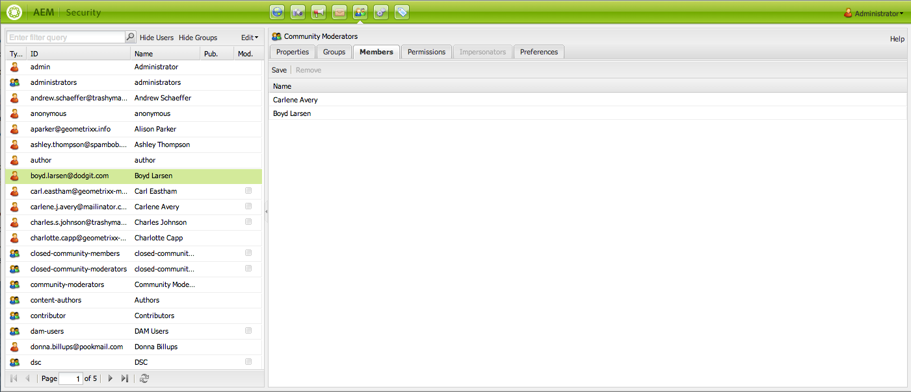

# Administração e segurança do usuário{#user-administration-and-security}

Este capítulo descreve como configurar e manter a autorização do usuário e também descreve a teoria por trás de como a autenticação e a autorização funcionam no AEM.

## Usuários e grupos no AEM {#users-and-groups-in-aem}

Esta seção trata mais detalhadamente das várias entidades e conceitos relacionados para ajudá-lo a configurar um conceito de gerenciamento de usuários fácil de manter.

### Usuários {#users}

Os usuários farão logon no AEM com sua conta. Cada conta de usuário é exclusiva e contém os detalhes básicos da conta, juntamente com os privilégios atribuídos.

Os usuários são frequentemente membros de Grupos, o que simplifica a alocação dessas permissões e/ou privilégios.

### Grupos {#groups}

Grupos são coleções de usuários e/ou outros grupos; todos eles se chamam membros de um grupo.

A sua principal finalidade é simplificar o processo de manutenção, reduzindo o número de entidades a atualizar, uma vez que a alteração efetuada a um grupo é aplicada a todos os membros do grupo. Os grupos geralmente refletem:

* um papel no âmbito do pedido; como alguém que tem permissão para navegar no conteúdo ou alguém que tem permissão para contribuir com conteúdo.
* sua própria organização; você pode desejar estender as funções para diferenciar os contribuidores de diferentes departamentos quando eles estiverem restritos a diferentes ramificações na árvore de conteúdo.

Por conseguinte, os grupos tendem a permanecer estáveis, enquanto os utilizadores vêm e vão com mais frequência.

Com o planejamento e uma estrutura limpa, o uso de grupos pode refletir sua estrutura, fornecendo uma visão geral clara e um mecanismo eficiente de atualizações.

### Built-in Users and Groups {#built-in-users-and-groups}

O WCM AEM instala vários usuários e grupos. Estes podem ser vistos quando você acessa o Console de segurança pela primeira vez após a instalação.

As tabelas a seguir listas cada item junto com:

* uma breve descrição
* quaisquer recomendações sobre alterações necessárias

*Altere todas as senhas* padrão (se você não excluir a conta em determinadas circunstâncias).

<table>
 <tbody>
  <tr>
   <td>ID de usuário</td>
   <td>Tipo</td>
   <td>Descrição</td>
   <td>Recomendação</td>
  </tr>
  <tr>
   <td>
admin
 
Senha padrão: admin
 </td>
   <td>Usuário</td>
   <td>
Conta de administração do sistema com direitos de acesso totais.
 
Esta conta é usada para a conexão entre o AEM WCM e o CRX.
 
Se você excluir acidentalmente essa conta, ela será recriada após a reinicialização do repositório (na configuração padrão).
 
A conta de administrador é um requisito da plataforma AEM. Consequentemente, esta conta não pode ser eliminada.
 </td>
   <td>
A Adobe recomenda que a senha desta conta de usuário seja alterada do padrão.
 
De preferência na instalação, embora possa ser feito depois.
 
Observação: Esta conta não deve ser confundida com a conta de administrador do CQ Servlet Engine.
 </td>
  </tr>
  <tr>
   <td>
anônimo
 
 
 </td>
   <td>Usuário</td>
   <td>
Detém os direitos padrão para acesso não autenticado a uma instância. Por padrão, isso mantém os direitos mínimos de acesso.
 
Se você excluir acidentalmente esta conta, ela será recriada na inicialização. Não pode ser excluído permanentemente, mas pode ser desativado.
 </td>
   <td>Evite excluir ou desativar esta conta, pois isso afetará negativamente o funcionamento das instâncias do autor. Se houver requisitos de segurança que o obriguem a excluí-lo, primeiro teste os efeitos que ele tem nos seus sistemas.</td>
  </tr>
  <tr>
   <td>
author
 
Senha padrão: autor
 </td>
   <td>Usuário</td>
   <td>
Uma conta do autor com permissão para gravar em /content. Abrange privilégios de contribuinte e surfista.
 
Pode ser usado como um webmaster, pois tem acesso a toda a /árvore de conteúdo.
 
Este não é um usuário integrado, mas outro usuário de demonstração geometrixx
 </td>
   <td>
A Adobe recomenda que a conta seja totalmente excluída ou que a senha seja alterada a partir do padrão.
 
De preferência na instalação, embora possa ser feito depois.
 </td>
  </tr>
  <tr>
   <td>administradores</td>
   <td>Grupo</td>
   <td>
Grupo que concede direitos de administrador a todos os seus membros. Somente o administrador tem permissão para editar esse grupo.
 
Tem direitos de acesso totais.
 </td>
   <td>Se você definir um "negar a todos" em um nó, os administradores só terão acesso se ele for ativado novamente para esse grupo.</td>
  </tr>
  <tr>
   <td>autores de conteúdo</td>
   <td>Grupo</td>
   <td>
Grupo responsável pela edição de conteúdo. Requer permissões de leitura, modificação, criação e exclusão.
 </td>
   <td>Você pode criar seus próprios grupos de autores de conteúdo com direitos de acesso específicos ao projeto, desde que adicione permissões de leitura, modificação, criação e exclusão.</td>
  </tr>
  <tr>
   <td>contribuinte</td>
   <td>Grupo</td>
   <td>
Privilégios básicos que permitem ao usuário gravar conteúdo (somente na funcionalidade).
 
Não aloca nenhum privilégio para a árvore /content - eles devem ser alocados especificamente para grupos individuais ou usuários.
 </td>
   <td> </td>
  </tr>
  <tr>
   <td>hidrelétricas</td>
   <td>Grupo</td>
   <td>Grupo de referência predefinido para um usuário AEM Assets típico. Os membros deste grupo têm privilégios apropriados para permitir o upload/compartilhamento de ativos e coleções.</td>
   <td> </td>
  </tr>
  <tr>
   <td>everyone</td>
   <td>Grupo</td>
   <td>
Todos os usuários do AEM são membros do grupo e todos, mesmo que você não veja o grupo ou a relação de associação em todas as ferramentas.
 
Esse grupo pode ser considerado como os direitos padrão, pois pode ser usado para aplicar permissões a todos, até mesmo aos usuários que serão criados no futuro.
 </td>
   <td>
Não modifique ou exclua este grupo.
 
Modificar esta conta tem implicações adicionais de segurança.
 </td>
  </tr>
  <tr>
   <td>administradores de tags</td>
   <td>Grupo</td>
   <td>Grupo que tem permissão para editar tags.</td>
   <td> </td>
  </tr>
  <tr>
   <td>administradores de usuários</td>
   <td>Grupo</td>
   <td>Autoriza a administração do usuário, ou seja, o direito de criar usuários e grupos.</td>
   <td> </td>
  </tr>
  <tr>
   <td>editores de fluxo de trabalho</td>
   <td>Grupo</td>
   <td>Grupo que tem permissão para criar e modificar modelos de fluxo de trabalho.</td>
   <td> </td>
  </tr>
  <tr>
   <td>usuários do fluxo de trabalho</td>
   <td>Grupo</td>
   <td>
Um usuário que participe de um fluxo de trabalho deve ser membro de usuários de fluxo de trabalho de grupo. Isto dá-lhe pleno acesso: /etc/workflow/instance para que ela ou ela possa atualizar a instância do fluxo de trabalho.
 
O grupo está incluído na instalação padrão, mas é necessário adicionar manualmente os usuários ao grupo.
 </td>
  </tr>
 </tbody>
</table>

## Permissões no AEM {#permissions-in-aem}

O AEM usa ACLs para determinar quais ações um usuário ou grupo pode realizar e onde pode executar essas ações.

### Permissões e ACLs {#permissions-and-acls}

As permissões definem quem pode executar quais ações em um recurso. As permissões são o resultado de avaliações de [controles de acesso](#access-control-lists-and-how-they-are-evaluated) .

Você pode alterar as permissões concedidas/negadas a um determinado usuário marcando ou desmarcando as caixas de seleção das [ações](security.md#actions)individuais do AEM. Uma marca de seleção indica que uma ação é permitida. Nenhuma marca de seleção indica que uma ação foi negada.

Onde a marca de seleção está localizada na grade também indica quais permissões os usuários têm em quais locais no AEM (ou seja, quais caminhos).

### Ações {#actions}

As ações podem ser executadas em uma página (recurso). Para cada página na hierarquia, você pode especificar que ação o usuário tem permissão para realizar nessa página. [As permissões](#permissions-and-acls) permitem permitir ou negar uma ação.

<table>
 <tbody>
  <tr>
   <td><strong>Ação </strong></td>
   <td><strong>Descrição </strong></td>
  </tr>
  <tr>
   <td>Leitura</td>
   <td>O usuário tem permissão para ler a página e qualquer página secundária.</td>
  </tr>
  <tr>
   <td>Modificar</td>
   <td>
O usuário pode:

    <ul>
     <li>modifique o conteúdo existente na página e em qualquer página secundária.</li>
     <li>criar novos parágrafos na página ou em qualquer página secundária.</li>
    </ul> 
No nível do JCR, os usuários podem modificar um recurso modificando suas propriedades, bloqueando, verificando as versões, não modificando e têm permissão de gravação completa em nós que definem um nó filho jcr:content, por exemplo cq:Page, nt:file, cq:Asset.
 </td>
  </tr>
  <tr>
   <td>Criar</td>
   <td>
O usuário pode:

    <ul>
     <li>criar uma nova página ou página secundária.</li>
    </ul> 
Se a <strong>modificação</strong> for negada, as subárvores abaixo de jcr:o conteúdo será excluído especificamente porque a criação de jcr:content e seus nós filhos são considerados uma modificação de página. Isso se aplica somente aos nós que definem um nó filho jcr:content.
 </td>
  </tr>
  <tr>
   <td>Excluir</td>
   <td>
O usuário pode:

    <ul>
     <li>exclua parágrafos existentes da página ou de qualquer página secundária.</li>
     <li>excluir uma página ou página secundária.</li>
    </ul> 
Se nenhuma <strong>modificação</strong> for negada, quaisquer subárvores abaixo de jcr:o conteúdo será especificamente excluído, pois a remoção de jcr:content e seus nós filhos serão considerados uma modificação de página. Isso se aplica somente aos nós que definem um nó filho jcr:content.
 </td>
  </tr>
  <tr>
   <td>Ler ACL</td>
   <td>O usuário pode ler a lista do controle de acesso da página ou das páginas secundárias.</td>
  </tr>
  <tr>
   <td>Editar ACL</td>
   <td>O usuário pode modificar a lista do controle de acesso da página ou qualquer página secundária.</td>
  </tr>
  <tr>
   <td>Replicar</td>
   <td>O usuário pode replicar o conteúdo para outro ambiente (por exemplo, o ambiente Publicar). O privilégio também é aplicado a qualquer página secundária.</td>
  </tr>
 </tbody>
</table>

>[!NOTE]
>
>O AEM gera automaticamente grupos de usuários para atribuição de funções (Proprietário, Editor, Visualizador) em [Coleções](/help/assets/managing-collections-touch-ui.md). No entanto, adicionar manualmente ACLs para esses grupos pode introduzir vulnerabilidades de segurança no AEM. A Adobe recomenda que você evite adicionar ACLs manualmente.

### Listas do Controle de acesso e como elas são avaliadas {#access-control-lists-and-how-they-are-evaluated}

O AEM WCM usa Listas de Controles de acesso (ACLs) para organizar as permissões aplicadas às várias páginas.

As Listas do Controle de acesso são constituídas pelas permissões individuais e são usadas para determinar a ordem na qual essas permissões são realmente aplicadas. A lista é formada de acordo com a hierarquia das páginas em questão. Essa lista é digitalizada de baixo para cima até que a primeira permissão apropriada para aplicar a uma página seja encontrada.

>[!NOTE]
>
>Há ACLs incluídas nas amostras. É recomendável que você analise e determine o que é apropriado para seus aplicativos. Para revisar as ACLs incluídas, vá para **CRXDE **e selecione a guia **Controle de acesso** para os seguintes nós:
>
>`/etc/cloudservices/facebookconnect/geometrixx-outdoorsfacebookapp`: Permite que todos tenham acesso de leitura.
>`/etc/cloudservices/twitterconnect/geometrixx-outdoors-twitter-app`: Permite que todos tenham acesso de leitura.
>`/home/users/geometrixx-outdoors`: Permite que todos tenham acesso de leitura para `*/profile*` e
>`*/social/relationships/following/*`.
>
>Seu aplicativo personalizado pode definir o acesso para outros relacionamentos, como `*/social/relationships/friend/*` ou `*/social/relationships/pending-following/*`.
>
>Quando você cria ACLs específicas para comunidades, os membros que ingressam nessas comunidades podem receber permissões adicionais. Por exemplo, esse pode ser o caso quando os usuários ingressam nas comunidades em `/content/geometrixx-outdoors/en/community/hiking` ou `/content/geometrixx-outdoors/en/community/winter-sports`.

### Estados de permissão {#permission-states}

>[!NOTE]
>
>Para usuários do CQ 5.3:
>
>Em contraste com as versões anteriores do CQ, a **criação** e a **exclusão** não devem mais ser concedidas se um usuário precisar apenas modificar páginas. Em vez disso, conceda a ação de **modificação** somente se você quiser que os usuários possam criar, modificar ou excluir componentes em páginas existentes.
>
>Por motivos de compatibilidade com versões anteriores, os testes de ações não levam em conta o tratamento especial de nós que definem **jcr:content** .

| **Ação** | **Descrição** |
|---|---|
| Permitir (marca de seleção) | O WCM AEM permite que o usuário execute a ação nesta página ou em qualquer página secundária. |
| Negar (sem marca de seleção) | O WCM AEM não permite que o usuário execute a ação nesta página nem em nenhuma página secundária. |

As permissões também são aplicadas a qualquer página secundária.

Se uma permissão não for herdada do nó pai, mas tiver pelo menos uma entrada local, os seguintes símbolos serão anexados à caixa de seleção. Uma entrada local é uma entrada criada na interface CRX 2.2 (atualmente, as ACLs curingas só podem ser criadas no CRX.)

Para uma ação em um determinado caminho:

<table>
 <tbody>
  <tr>
   <td>* (asterisco)</td>
   <td>Existe pelo menos uma entrada local (efetiva ou ineficaz). Essas ACLs curingas são definidas no CRX.</td>
  </tr>
  <tr>
   <td>! (ponto de exclamação)</td>
   <td>Há pelo menos uma entrada que não tem efeito no momento.</td>
  </tr>
 </tbody>
</table>

Ao passar o mouse sobre o asterisco ou ponto de exclamação, uma dica de ferramenta fornece mais detalhes sobre as entradas declaradas. A dica de ferramenta é dividida em duas partes:

<table>
 <tbody>
  <tr>
   <td>Parte superior</td>
   <td>
Lista as entradas efetivas.
 </td>
  </tr>
  <tr>
   <td>Parte inferior</td>
   <td>Lista as entradas não eficazes que podem ter um efeito em outro lugar da árvore (conforme indicado por um atributo especial presente com a ECA correspondente que limita o escopo da entrada). Como alternativa, esta é uma entrada cujo efeito foi revogado por outra entrada definida no caminho especificado ou em um nó ancestral.</td>
  </tr>
 </tbody>
</table>

>[!NOTE]
>
>Se nenhuma permissão for definida para uma página, todas as ações serão negadas.

Veja a seguir recomendações sobre como gerenciar listas do controle de acesso:

* Não atribua permissões diretamente aos usuários. Atribua-os somente a grupos.

   Isso simplificará a manutenção, já que o número de grupos é muito menor do que o número de usuários, e também menos volátil.

* Se você deseja que um grupo/usuário possa apenas modificar páginas, não conceda a ele direitos de criação ou negação. Conceda somente a eles direitos de modificação e leitura.
* Use Negar com moderação. Na medida do possível, use apenas Permitir.

   O uso de negação pode causar efeitos inesperados se as permissões forem aplicadas em uma ordem diferente da ordem esperada. Se um usuário for membro de mais de um grupo, as declarações Negar de um grupo poderão cancelar a instrução Permitir de outro grupo ou vice-versa. É difícil manter uma visão geral quando isso acontece e pode facilmente levar a resultados imprevistos, enquanto Permitir atribuições não gera tais conflitos.

   A Adobe recomenda que você trabalhe com Permitir, em vez de Negar, ver [Práticas recomendadas](#best-practices).

Antes de modificar qualquer permissão, certifique-se de entender como elas funcionam e se relacionam. Consulte a documentação do CRX para ilustrar como o AEM WCM [avalia os direitos](/help/sites-administering/user-group-ac-admin.md#how-access-rights-are-evaluated) de acesso e exemplos sobre como configurar listas do controle de acesso.

### Permissões     {#permissions}

As permissões concedem aos usuários e grupos acesso à funcionalidade do AEM nas páginas do AEM.

Você navega permissões por caminho expandindo/recolhendo os nós e pode rastrear a herança de permissão até o nó raiz.

Você permite ou nega permissões marcando ou desmarcando as caixas de seleção apropriadas.

### Exibindo Informações Detalhadas sobre Permissão {#viewing-detailed-permission-information}

Juntamente com a visualização de grade, o AEM fornece uma visualização detalhada de permissões para um usuário/grupo selecionado em um determinado caminho. A visualização de detalhes fornece informações adicionais.

Além de visualizar informações, você também pode incluir ou excluir o usuário ou grupo atual de um grupo. Consulte [Adicionar usuários ou grupos ao adicionar permissões](#adding-users-or-groups-while-adding-permissions). As alterações feitas aqui são refletidas imediatamente na porção superior da visualização detalhada.

Para acessar a visualização de detalhes, na guia **Permissões** , clique em **Detalhes** para qualquer grupo/usuário e caminho selecionados.

Os detalhes são divididos em duas partes:

<table>
 <tbody>
  <tr>
   <td>Parte superior</td>
   <td>
Repete as informações que você vê na grade de árvore. Para cada ação, um ícone mostra se a ação é permitida ou negada:

    <ul>
     <li>nenhum ícone = nenhuma entrada declarada</li>
     <li>(tick) = ação declarada (permitir)</li>
     <li>(-) = ação declarada (negação)</li>
    </ul> </td>
  </tr>
  <tr>
   <td>Parte inferior</td>
   <td>
Mostra a grade de usuários e grupos que faz o seguinte:

    <ul>
     <li>Declara uma entrada para o caminho especificado E</li>
     <li>É o autorizável fornecido OU é um grupo</li>
    </ul> </td>
  </tr>
 </tbody>
</table>

### Representando outro usuário {#impersonating-another-user}

With the [Impersonate functionality](/help/sites-authoring/user-properties.md#user-settings) a user can work on behalf of another user.

Isso significa que uma conta de usuário pode especificar outras contas que podem operar com sua conta. Em outras palavras, se o usuário B estiver autorizado a representar o usuário A, o usuário B poderá realizar ações usando os detalhes completos da conta do usuário A.

Isso permite que as contas do representador completem as tarefas como se estivessem usando a conta que estão representando; por exemplo, durante uma ausência ou para compartilhar uma carga excessiva em curto prazo.

>[!NOTE]
>
>Para que a representação funcione para usuários que não sejam administradores, o impersonador (no caso acima, user-B) deve ter permissões de LEITURA no `/home/users` caminho.
>
>Para obter mais informações sobre como fazer isso, consulte [Permissões no AEM](/help/sites-administering/security.md#permissions-in-aem).

>[!CAUTION]
>
>Se uma conta representa outra é muito difícil de ver. Uma entrada é feita no log de auditoria quando a representação é start e encerrada, mas os outros arquivos de log (como o log de acesso) não contêm informações sobre o fato de que a representação ocorreu nos eventos. Portanto, se o usuário B estiver representando o usuário A, todos os eventos parecerão como se fossem executados pessoalmente pelo usuário A.

>[!CAUTION]
>
>O bloqueio de uma página pode ser executado quando se representa um usuário. No entanto, uma página bloqueada dessa maneira só pode ser desbloqueada como o usuário que foi representado ou como um usuário com privilégios de administrador.
>
>Páginas não podem ser desbloqueadas representando o usuário que as bloqueou.

### Práticas recomendadas    {#best-practices}

A seguir, é apresentada uma descrição das práticas recomendadas ao trabalhar com permissões e privilégios:

| Regra | Motivo |
|--- |--- |
| *Usar grupos* | Evite atribuir direitos de acesso a cada usuário. Há várias razões para isso:<ul><li>Você tem muito mais usuários do que grupos, então os grupos simplificam a estrutura.</li><li>Os grupos ajudam a fornecer uma visão geral de todas as contas.</li> <li>A herança é mais simples com os grupos.</li><li>Os usuários vêm e vão. Grupos são de longo prazo.</li></ul> |
| *Seja positivo* | Use sempre as instruções Permitir para especificar os direitos do grupo (sempre que possível). Evite usar uma declaração Negar. Os grupos são avaliados em ordem e a ordem pode ser definida de forma diferente por usuário. Por outras palavras: Você pode ter pouco controle sobre a ordem em que as declarações são implementadas e avaliadas. Se você usar somente as instruções Permitir, a ordem não importa. |
| *Mantenha simples* | O investimento em algum tempo e a reflexão ao configurar uma nova instalação serão bem reembolsados. A aplicação de uma estrutura clara simplificará a manutenção e a administração contínuas, garantindo que os seus atuais colegas e/ou futuros sucessores possam compreender facilmente o que está a ser implementado. |
| *Testar* | Use uma instalação de teste para praticar e garantir que você compreenda as relações entre os vários usuários e grupos. |
| *Usuários/grupos padrão* | Sempre atualize os Usuários e grupos padrão imediatamente após a instalação para ajudar a evitar problemas de segurança. |

## Managing Users and Groups {#managing-users-and-groups}

Os usuários incluem pessoas que usam o sistema e sistemas estrangeiros que fazem solicitações ao sistema.

Um grupo é um conjunto de usuários.

Ambos podem ser configurados usando a funcionalidade Administração do usuário no Console de segurança.

### Acessar a administração do usuário com o console de segurança {#accessing-user-administration-with-the-security-console}

Você acessa todos os usuários, grupos e permissões associadas usando o console Segurança. Todos os procedimentos descritos nesta seção são executados nesta janela.

Para acessar a segurança WCM do AEM, execute um dos procedimentos a seguir:

* Na tela Bem-vindo ou em vários locais no AEM, clique no ícone de segurança:

* Navegue diretamente para `https://<server>:<port>/useradmin`. Certifique-se de fazer logon no AEM como administrador.

A seguinte janela é exibida:

A árvore esquerda lista todos os usuários e grupos atualmente no sistema. Você pode selecionar as colunas que deseja exibir, classificar o conteúdo das colunas e até mesmo alterar a ordem em que as colunas são exibidas arrastando o cabeçalho da coluna para uma nova posição.

As guias fornecem acesso a várias configurações:

<!-- ??? in table below. -->

| Guia | Descrição |
|--- |--- |
| Caixa Filtro | Um mecanismo para filtrar os usuários e/ou grupos listados. Consulte [Filtrando usuários e grupos](#filtering-users-and-groups). |
| Ocultar usuários | Um switch de alternância que ocultará todos os usuários listados, deixando apenas grupos. Consulte [Ocultar usuários e grupos](#hiding-users-and-groups). |
| Ocultar grupos | Um switch de alternância que ocultará todos os grupos listados, deixando apenas os usuários. Consulte [Ocultar usuários e grupos](#hiding-users-and-groups). |
| Editar | Um menu que permite criar e excluir, além de ativar e desativar usuários ou grupos. Consulte [Criação de usuários e grupos](#creating-users-and-groups) e [Exclusão de usuários e grupos](#deleting-users-and-groups). |
| Propriedades | Listas informações sobre o usuário ou grupo que podem incluir informações de email, uma descrição e informações de nome. Também permite alterar a senha de um usuário. Consulte [Criação de usuários e grupos](#creating-users-and-groups), [Modificação de propriedades](#modifying-user-and-group-properties) de usuários e grupos e [Alteração de uma senha](#changing-a-user-password)de usuário. |
| Grupos | Lista todos os grupos aos quais o usuário ou grupo selecionado pertence. Você pode atribuir o usuário ou grupos selecionados a grupos adicionais ou removê-los de grupos. Consulte [Grupos](#adding-users-or-groups-to-a-group). |
| Membros | Disponível somente para grupos. Lista os membros de um grupo específico. Consulte [Membros](#members-adding-users-or-groups-to-a-group). |
| Permissões     | Você pode alocar permissões para um usuário ou grupo. Permite controlar o seguinte:<ul><li>Permissões relacionadas a páginas/nós específicos. Consulte [Configuração de permissões](#setting-permissions). </li><li>Permissões relacionadas à criação e exclusão de páginas e modificação de hierarquia. ???? permite [alocar privilégios](#settingprivileges), como modificação de hierarquia, que permite criar e excluir páginas,</li><li>Permissões relacionadas a privilégios [de](#setting-replication-privileges) replicação (normalmente do autor para a publicação) de acordo com um caminho.</li></ul> |
| Personificadores | Permite que outro usuário personalize a conta. Útil quando você precisa que um usuário atue em nome de outro usuário. Consulte [Representando usuários](#impersonating-another-user). |
| Preferências | Define [preferências para o grupo ou usuário](#setting-user-and-group-preferences). Por exemplo, preferências de idioma. |

### Filtering Users and Groups {#filtering-users-and-groups}

Você pode filtrar a lista inserindo uma expressão de filtro, que oculta todos os usuários e grupos que não correspondem à expressão. Você também pode ocultar usuários e grupos usando os botões [Ocultar usuário e Ocultar grupo](#hiding-users-and-groups) .

Para filtrar usuários ou grupos:

1. Na lista da árvore esquerda, digite a expressão do filtro no espaço fornecido. Por exemplo, inserir **admin** exibe todos os usuários e grupos que contêm essa string.
1. Clique na lupa para filtrar a lista.

   

1. Clique no **x** quando quiser remover todos os filtros.

### Hiding Users and Groups {#hiding-users-and-groups}

Ocultar usuários ou grupos é outra forma de filtrar a lista de todos os usuários e grupos em um sistema. Há dois mecanismos de alternância. Clicar em Ocultar usuário oculta todos os usuários da visualização e clicar em Ocultar grupos oculta todos os grupos da visualização (não é possível ocultar os usuários e os grupos ao mesmo tempo). Para filtrar a lista usando uma expressão de filtro, consulte [Filtrar usuários e grupos](#filtering-users-and-groups).

Para ocultar usuários e grupos:

1. No console **Segurança** , clique em **Ocultar usuários** ou em **Ocultar grupos**. O botão selecionado aparece realçado.

   

1. Para que os usuários ou grupos reapareçam, clique no botão correspondente novamente.

### Creating Users and Groups {#creating-users-and-groups}

Para criar um novo usuário ou grupo:

1. Na lista da árvore do console **de segurança** , clique em **Editar** e em **Criar usuário** ou **Criar grupo**.

   

1. Insira os detalhes necessários, de acordo com a criação de um usuário ou de um grupo.

   * Se você selecionar **Criar usuário,** digite a ID de login, o nome e o sobrenome, o endereço de email e a senha. Por padrão, o AEM cria um caminho com base na primeira letra do sobrenome, mas você pode selecionar outro caminho.

   

   * Se você selecionar **Criar grupo**, insira uma ID de grupo e uma descrição opcional.

   

1. Clique em **Criar**. O usuário ou grupo criado é exibido na lista em árvore.

### Deleting Users and Groups {#deleting-users-and-groups}

Para excluir um usuário ou grupo:

1. No console **Segurança** , selecione o usuário ou grupo que deseja excluir. Se desejar excluir vários itens, pressione Shift ou Ctrl e clique para selecioná-los.
1. Clique em **Editar,** em seguida, selecione Excluir. O WCM AEM pergunta se você deseja excluir o usuário ou grupo.
1. Clique em **OK** para confirmar ou em Cancelar para cancelar sua ação.

### Modificando propriedades de usuário e grupo {#modifying-user-and-group-properties}

Para modificar as propriedades do usuário e do grupo:

1. No console **Segurança** , clique com o duplo no nome do usuário ou grupo que deseja modificar.

1. Clique na guia **Propriedades** , faça as alterações necessárias e clique em **Salvar**.

   

>[!NOTE]
>
>O caminho do usuário é exibido na parte inferior das propriedades do usuário. Não pode ser modificada.

### Alteração de uma senha de usuário {#changing-a-user-password}

Use o procedimento a seguir para modificar a senha de um usuário.

>[!NOTE]
>
>Não é possível usar o console Segurança para alterar a senha do administrador. Para alterar a senha da conta de administrador, use o console  Usuários fornecido pelo Granite Operations.
>
>Se você estiver usando AEM Forms no JEE, não use as instruções abaixo para alterar a senha, em vez de usar AEM Forms no console de administração do JEE (/adminui) para alterar a senha.

1. No console **Segurança** , clique com o duplo no nome de usuário para o qual deseja alterar a senha.
1. Clique na guia **Propriedades** (se ainda não estiver ativa).
1. Clique em **Definir senha**. A janela Definir senha é aberta onde você pode alterar sua senha.

   

1. Introduza a nova senha duas vezes; como não são exibidos em texto claro, isso é para confirmação - se não corresponderem, o sistema exibe um erro.
1. Clique em **Definir** para ativar a nova senha da conta.

### Adicionar usuários ou grupos a um grupo {#adding-users-or-groups-to-a-group}

O AEM oferta três maneiras diferentes de adicionar usuários ou grupos a um grupo existente:

* Quando estiver no grupo, você poderá adicionar membros (usuários ou grupos).
* Quando você estiver no membro, poderá adicionar membros a grupos.
* Ao trabalhar em Permissões, você pode adicionar membros a grupos.

### Grupos - Adicionar usuários ou grupos a um grupo {#groups-adding-users-or-groups-to-a-group}

A guia **Grupos** mostra a quais grupos a conta atual pertence. Você pode usá-lo para adicionar a conta selecionada a um grupo:

1. Clique com o Duplo no nome da conta (usuário ou grupo) que você deseja atribuir a um grupo.
1. Click the **Groups** tab. Você verá uma lista de grupos aos quais a conta já pertence.
1. Na lista em árvore, clique no nome do grupo ao qual deseja adicionar a conta e arraste-o para o painel **Grupos** . (Se você quiser adicionar vários usuários, pressione Shift ou Ctrl e clique nesses nomes e arraste-os.)

   

1. Click **Save** to save your changes.

### Membros - Adicionar usuários ou grupos a um grupo {#members-adding-users-or-groups-to-a-group}

A guia **Membros** funciona somente para grupos e mostra quais usuários e grupos pertencem ao grupo atual. Você pode usá-lo para adicionar contas a um grupo:

1. Clique com o Duplo no nome do grupo ao qual deseja adicionar membros.
1. Click the **Members** tab. Você verá uma lista de membros que já pertencem a esse grupo.
1. Na lista em árvore, clique no nome do membro que deseja adicionar ao grupo e arraste-o para o painel **Membros** . (Se você quiser adicionar vários usuários, pressione Shift ou Ctrl e clique nesses nomes e arraste-os.)

   

1. Click **Save** to save your changes.

### Adicionar usuários ou grupos ao adicionar permissões {#adding-users-or-groups-while-adding-permissions}

Para adicionar membros a um grupo em um determinado caminho:

1. Clique com o Duplo no nome do grupo ou usuário ao qual deseja adicionar usuários.

1. Click the **Permissions** tab.

1. Navegue até o caminho ao qual deseja adicionar permissões e clique em **Detalhes**. A parte inferior da janela de detalhes fornece informações sobre quem tem permissões para essa página.

   

1. Marque a caixa de seleção na coluna **Membro** para os membros que você deseja que tenham permissões para esse caminho. Desmarque a caixa de seleção do membro para o qual deseja remover permissões. Um triângulo vermelho aparece na célula à qual você fez alterações.
1. Clique em **OK** para salvar suas alterações.

### Removendo usuários ou grupos de grupos {#removing-users-or-groups-from-groups}

O AEM oferta três maneiras diferentes de remover usuários ou grupos de um grupo:

* Quando estiver no perfil do grupo, você poderá remover membros (usuários ou grupos).
* Quando estiver no perfil membro, você poderá remover membros dos grupos.
* Ao trabalhar em Permissões, você pode remover membros de grupos.

### Grupos - Remoção de usuários ou grupos de grupos {#groups-removing-users-or-groups-from-groups}

Para remover uma conta de usuário ou grupo de um grupo:

1. Clique com o Duplo no nome do grupo ou conta de usuário que deseja remover de um grupo.
1. Click the **Groups** tab. Você verá a quais grupos a conta selecionada pertence.
1. No painel **Grupos** , clique no nome do usuário ou grupo que deseja remover do grupo e clique em **Remover**. (Se quiser remover várias contas, pressione Shift ou Ctrl e clique nesses nomes e clique em **Remover**.)

   

1. Click **Save** to save your changes.

### Membros - Remoção de usuários ou grupos de grupos {#members-removing-users-or-groups-from-groups}

Para remover contas de um grupo:

1. Clique com o Duplo no nome do grupo do qual você deseja remover membros.
1. Click the **Members** tab. Você verá uma lista de membros que já pertencem a esse grupo.
1. No painel **Membros** , clique no nome do membro que deseja remover do grupo e clique em **Remover**. (Se quiser remover vários usuários, pressione Shift ou Control e clique nesses nomes e clique em **Remover**.)

   

1. Click **Save** to save your changes.

### Removendo usuários ou grupos ao adicionar permissões {#removing-users-or-groups-while-adding-permissions}

Para remover membros de um grupo em um determinado caminho:

1. Clique com o Duplo no nome do grupo ou usuário do qual você deseja remover usuários.

1. Click the **Permissions** tab.

1. Navegue até o caminho para o qual deseja remover permissões e clique em **Detalhes**. A parte inferior da janela de detalhes fornece informações sobre quem tem permissões para essa página.

   

1. Marque a caixa de seleção na coluna **Membro** para os membros que você deseja que tenham permissões para esse caminho. Desmarque a caixa de seleção do membro para o qual deseja remover permissões. Um triângulo vermelho aparece na célula à qual você fez alterações.
1. Clique em **OK** para salvar suas alterações.

### Sincronização do usuário {#user-synchronization}

Quando a implantação é um farm [de](/help/sites-deploying/recommended-deploys.md#tarmk-farm)publicação, os usuários e grupos precisam ser sincronizados entre todos os nós de publicação.

Para saber mais sobre a sincronização do usuário e como ativá-la, consulte Sincronização [do](/help/sites-administering/sync.md)usuário.

## Gerenciando permissões {#managing-permissions}

>[!NOTE]
>
>A Adobe introduziu uma nova visualização principal baseada na interface do usuário para o gerenciamento de permissões. Para obter mais detalhes sobre como usá-lo, consulte [esta página](/help/sites-administering/touch-ui-principal-view.md).

Esta seção descreve como definir permissões, incluindo privilégios de replicação.

### Definindo permissões {#setting-permissions}

As permissões permitem que os usuários executem determinadas ações em recursos em determinados caminhos. Também inclui a capacidade de criar ou excluir páginas.

Para adicionar, modificar ou excluir permissões:

1. No console **Segurança** , clique com o duplo no nome do usuário ou grupo para o qual você deseja definir permissões ou [procurar nós](#searching-for-nodes).

1. Click the **Permissions** tab.

   

1. Na grade da árvore, marque uma caixa de seleção para permitir que o usuário ou grupo selecionado execute uma ação ou desmarque uma caixa de seleção para negar que o usuário ou grupo selecionado execute uma ação. Para obter mais informações, clique em **Detalhes**.

1. When finished, click **Save**.

### Definindo Privilégios de Replicação {#setting-replication-privileges}

O privilégio de replicação é o direito de publicar conteúdo e pode ser definido para grupos e usuários.

>[!NOTE]
>
>* Todos os direitos de replicação aplicados a um grupo se aplicam a todos os usuários nesse grupo.
>* Os privilégios de replicação de um usuário substituem os privilégios de replicação de um grupo.
>* Os direitos de replicação de Permitir têm uma precedência superior aos direitos de replicação de Negar. Consulte [Permissões no AEM](#permissions-in-aem) para obter mais informações.

>

Para definir privilégios de replicação:

1. Selecione o usuário ou grupo na lista, clique com o duplo para abrir e clique em **Permissões**.
1. Na grade, navegue até o caminho onde deseja que o usuário tenha privilégios de replicação ou [procure nós.](#searching-for-nodes)

1. Na coluna **Replicar** no caminho selecionado, marque uma caixa de seleção para adicionar o privilégio de replicação para esse usuário ou grupo, ou desmarque a caixa de seleção para remover o privilégio de replicação. O AEM exibe um triângulo vermelho em qualquer lugar em que você tenha feito alterações que ainda não foram salvas.

   

1. Click **Save** to save your changes.

### Procurando nós {#searching-for-nodes}

Ao adicionar ou remover permissões, você pode procurar ou procurar pelo nó.

Há dois tipos diferentes de pesquisa de caminho:

* Pesquisa de caminho - Se a sequência de caracteres de pesquisa for start com um &quot;/&quot;, a pesquisa pesquisará os subnós diretos do caminho fornecido:

Na caixa de pesquisa, é possível fazer o seguinte:

| Ação | O que ele faz |
|--- |--- |
| Tecla de seta para a direita | Seleciona um subnó no resultado da pesquisa |
| Tecla de seta para baixo | Start a pesquisa novamente. |
| Tecla Enter (Return) | Seleciona um subnó e o carrega na árvore |

* Pesquisa FullText - Se a string de pesquisa não for start com &quot;/&quot;, uma pesquisa de texto completo será executada em todos os nós sob o caminho &quot;/content&quot;.

Para executar uma pesquisa em caminhos ou texto completo:

1. No console Segurança, selecione um usuário ou grupo e clique na guia **Permissões** .

1. Na caixa Pesquisar, digite um termo para pesquisar.

### Representando usuários {#impersonating-users}

Você pode especificar um ou mais usuários que podem representar o usuário atual. Isso significa que eles podem mudar suas configurações de conta para as do usuário atual e agir em nome desse usuário.

Use essa função com cautela, pois pode permitir que os usuários executem ações que não podem ser executadas por seus próprios usuários. Ao representar um usuário, os usuários são notificados de que não estão conectados como eles mesmos.

Há vários cenários em que você pode usar essa funcionalidade, incluindo:

* Se você estiver fora do escritório, você pode deixar outra pessoa te representar enquanto você estiver fora. Ao usar esse recurso, você pode garantir que alguém tenha seus direitos de acesso e que não seja necessário modificar um perfil do usuário ou fornecer sua senha.
* Você pode usá-lo para fins de depuração. Por exemplo, para ver como o site procura um usuário com direitos de acesso restritos. Além disso, se um usuário se queixa de problemas técnicos, você pode representar esse usuário para diagnosticar e corrigir o problema.

Para representar um usuário existente:

1. Na lista em árvore, selecione o nome da pessoa que você deseja atribuir a outros usuários para representar. Clique com o Duplo para abrir.
1. Click the **Impersonators** tab.
1. Clique no usuário que deseja personalizar o usuário selecionado. Arraste o usuário (que representará) da lista para o painel Representar. O nome é exibido na lista.

   

1. Clique em **Salvar**.

### Configuração de preferências de usuário e grupo {#setting-user-and-group-preferences}

Para definir as preferências do usuário e do grupo, incluindo idioma, gerenciamento de janelas e preferências da barra de ferramentas:

1. Selecione o usuário ou grupo cujas preferências você deseja alterar na árvore à esquerda. Para selecionar vários usuários ou grupos, pressione Ctrl ou Shift e clique nas seleções.
1. Click the **Preferences** tab.

   

1. Faça alterações, conforme necessário, nas preferências de grupo ou usuário e clique em **Salvar** ao terminar.

### Configurar usuários ou administradores para terem o privilégio de gerenciar outros usuários {#setting-users-or-administrators-to-have-the-privilege-to-manage-other-users}

Para definir usuários ou administradores com os privilégios para excluir/ativar/desativar outros usuários:

1. Adicione o usuário que você deseja conceder privilégios para gerenciar outros usuários ao grupo de administradores e salve suas alterações.

   

1. Na guia **Permissões** do usuário, navegue até &quot;/&quot; e, na coluna Replicar, marque a caixa de seleção para permitir a replicação em &quot;/&quot; e clique em **Salvar**.

   

   O usuário selecionado agora tem a capacidade de desativar, ativar, excluir e criar usuários.

### Extensão de Privilégios em um Nível de Projeto {#extending-privileges-on-a-project-level}

Se você planeja implementar privilégios específicos do aplicativo, as seguintes informações descrevem o que você precisa saber para implementar um privilégio personalizado e como aplicá-lo em todo o CQ:

O privilégio de modificação de hierarquia é coberto por uma combinação de privilégios de jcr. O privilégio de replicação é chamado de **crx:replicate** que é armazenado/avaliado juntamente com outros privilégios no repositório jcr. No entanto, não é aplicada a nível do emprego.

A definição e o registro de privilégios personalizados fazem parte oficialmente da API  Jackrabbit a partir da versão 2.4 (consulte também [JCR-2887](https://issues.apache.org/jira/browse/JCR-2887)). A gestão de Controles de acesso do JCR abrange outras utilizações, tal como definidas pelo [JSR 283](https://jcp.org/en/jsr/detail?id=283) (seção 16). Além disso, a API Jackrabbit define algumas extensões.

O mecanismo de registro de privilégios é refletido na interface do usuário em Configuração **** do repositório.

O registro de novos privilégios (personalizados) é protegido por um privilégio incorporado que deve ser concedido no nível do repositório (no JCR: transmitindo &#39;null&#39; como parâmetro &#39;absPath&#39; na api mgt ac, consulte jsr 333 para obter detalhes). Por padrão, o privilégio de **administrador** e todos os membros dos administradores é concedido.

>[!NOTE]
>
>Embora a implementação tenha o cuidado de validar e avaliar privilégios personalizados, ela não poderá aplicá-los, a menos que sejam agregações de privilégios incorporados.
