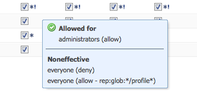
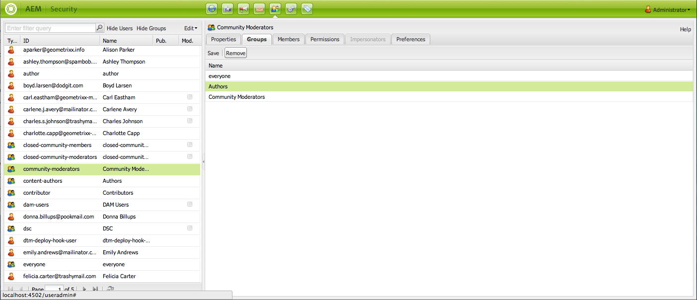
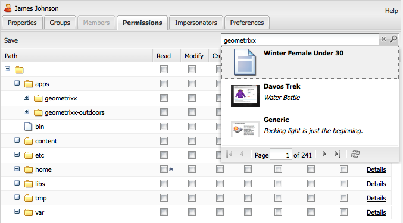

# Administração e segurança do usuário{#user-administration-and-security}

Este capítulo descreve como configurar e manter a autorização do usuário e também descreve a teoria por trás de como a autenticação e a autorização funcionam no AEM.

## Usuários e grupos no AEM {#users-and-groups-in-aem}

Esta seção trata das várias entidades e conceitos relacionados com mais detalhes para ajudá-lo a configurar um conceito de gerenciamento de usuários fácil de manter.

### Usuários {#users}

Os usuários farão logon no AEM com a conta. Cada conta de usuário é exclusiva e contém os detalhes básicos da conta, juntamente com os privilégios atribuídos.

Geralmente, os usuários são membros de Grupos, o que simplifica a alocação dessas permissões e/ou privilégios.

### Grupos {#groups}

Grupos são coleções de usuários e/ou outros grupos; todos eles se chamam membros de um grupo.

O seu principal objetivo é simplificar o processo de manutenção, reduzindo o número de entidades a atualizar, uma vez que uma alteração efetuada num grupo é aplicada a todos os membros do grupo. Os grupos geralmente refletem:

* um papel no pedido; como alguém que tem permissão para navegar no conteúdo ou alguém que tem permissão para contribuir com o conteúdo.
* sua própria organização; é possível estender as funções para diferenciar os contribuidores de diferentes departamentos quando eles estão restritos a diferentes ramificações na árvore de conteúdo.

Portanto, os grupos tendem a permanecer estáveis, enquanto os usuários vêm e vão com mais frequência.

Com o planejamento e uma estrutura limpa, o uso de grupos pode refletir sua estrutura, fornecendo uma visão geral clara e um mecanismo eficiente para atualizações.

### Usuários e grupos incorporados {#built-in-users-and-groups}

AEM WCM instala vários usuários e grupos. Estes podem ser vistos quando você acessa o Console de Segurança pela primeira vez após a instalação.

As tabelas a seguir listam cada item junto com:

* uma breve descrição
* quaisquer recomendações sobre as alterações necessárias

*Altere todas as senhas*  padrão (se você não excluir a conta em determinadas circunstâncias).

<table>
 <tbody>
  <tr>
   <td>ID de usuário</td>
   <td>Tipo</td>
   <td>Descrição</td>
   <td>Recomendação</td>
  </tr>
  <tr>
   <td>
admin
 
Senha padrão: administrador
 </td>
   <td>Usuário</td>
   <td>
Conta de administração do sistema com direitos de acesso totais.
 
Essa conta é usada para a conexão entre AEM WCM e CRX.
 
Se você excluir acidentalmente essa conta, ela será recriada após a reinicialização do repositório (na configuração padrão).
 
A conta de administrador é um requisito da plataforma de AEM. Como consequência, essa conta não pode ser excluída.
 </td>
   <td>
O Adobe recomenda que a senha desta conta de usuário seja alterada a partir do padrão.
 
Preferencialmente após a instalação, embora possa ser feito posteriormente.
 
Observação: Essa conta não deve ser confundida com a conta de administrador do CQ Servlet Engine.
 </td>
  </tr>
  <tr>
   <td>
anônimo
 
 
 </td>
   <td>Usuário</td>
   <td>
Retém os direitos padrão para acesso não autenticado a uma instância. Por padrão, isso mantém os direitos mínimos de acesso.
 
Se você excluir acidentalmente essa conta, ela será recriada na inicialização. Ele não pode ser excluído permanentemente, mas pode ser desativado.
 </td>
   <td>Evite excluir ou desabilitar essa conta, pois isso afetará negativamente o funcionamento das instâncias do autor. Se houver requisitos de segurança que o obriguem a excluí-lo, certifique-se de testar corretamente os efeitos que ele tem em seus sistemas primeiro.</td>
  </tr>
  <tr>
   <td>
author
 
Senha padrão: autor
 </td>
   <td>Usuário</td>
   <td>
Uma conta de autor com permissão para gravar em /content. Engloba privilégios de colaborador e surfista.
 
Pode ser usado como um webmaster, pois tem acesso a toda a árvore de conteúdo /content.
 
Este não é um usuário integrado, mas outro usuário de demonstração do geometrixx
 </td>
   <td>
O Adobe recomenda que a conta seja totalmente excluída ou que a senha seja alterada do padrão.
 
Preferencialmente após a instalação, embora possa ser feito posteriormente.
 </td>
  </tr>
  <tr>
   <td>administradores</td>
   <td>Grupo</td>
   <td>
Grupo que concede direitos de administrador a todos os seus membros. Somente o administrador tem permissão para editar este grupo.
 
Tem direitos de acesso totais.
 </td>
   <td>Se você definir um "negar todos" em um nó, os administradores só terão acesso se ele for ativado novamente para esse grupo.</td>
  </tr>
  <tr>
   <td>autores de conteúdo</td>
   <td>Grupo</td>
   <td>
Grupo responsável pela edição de conteúdo. Requer permissões de leitura, modificação, criação e exclusão.
 </td>
   <td>Você pode criar seus próprios grupos de autores de conteúdo com direitos de acesso específicos do projeto, desde que adicione permissões de leitura, modificação, criação e exclusão.</td>
  </tr>
  <tr>
   <td>colaborador</td>
   <td>Grupo</td>
   <td>
Privilégios básicos que permitem que o usuário grave conteúdo (como somente na funcionalidade).
 
Não aloca privilégios à árvore de conteúdo / - eles devem ser alocados especificamente para grupos ou usuários individuais.
 </td>
   <td> </td>
  </tr>
  <tr>
   <td>dam-users</td>
   <td>Grupo</td>
   <td>Grupo de referência pronto para uso para um usuário típico do AEM Assets. Os membros deste grupo têm privilégios adequados para permitir o upload/compartilhamento de ativos e coleções.</td>
   <td> </td>
  </tr>
  <tr>
   <td>todos</td>
   <td>Grupo</td>
   <td>
Cada usuário no AEM é membro do grupo de todos, mesmo que você não veja o grupo ou a relação de associação em todas as ferramentas.
 
Esse grupo pode ser considerado como os direitos padrão, pois pode ser usado para aplicar permissões para todos, até mesmo para usuários que serão criados no futuro.
 </td>
   <td>
Não modifique ou exclua este grupo.
 
Modificar essa conta tem implicações adicionais de segurança.
 </td>
  </tr>
  <tr>
   <td>administradores de tags</td>
   <td>Grupo</td>
   <td>Grupo que tem permissão para editar tags.</td>
   <td> </td>
  </tr>
  <tr>
   <td>usuários-administradores</td>
   <td>Grupo</td>
   <td>Autoriza a administração de usuários, ou seja, o direito de criar usuários e grupos.</td>
   <td> </td>
  </tr>
  <tr>
   <td>editores de fluxo de trabalho</td>
   <td>Grupo</td>
   <td>Grupo que tem permissão para criar e modificar modelos de fluxo de trabalho.</td>
   <td> </td>
  </tr>
  <tr>
   <td>usuários de fluxo de trabalho</td>
   <td>Grupo</td>
   <td>
Um usuário que participa de um fluxo de trabalho deve ser membro de usuários de fluxo de trabalho de grupo. Este fato dá-lhe pleno acesso: /etc/workflow/instances para que ele possa atualizar a instância do workflow.
 
O grupo está incluído na instalação padrão, mas você deve adicionar manualmente os usuários ao grupo.
 </td>
  </tr>
 </tbody>
</table>

## Permissões em AEM {#permissions-in-aem}

O AEM usa ACLs para determinar quais ações um usuário ou grupo pode realizar e onde pode executar essas ações.

### Permissões e ACLs {#permissions-and-acls}

As permissões definem quem tem permissão para executar quais ações em um recurso. As permissões são o resultado de avaliações [controle de acesso](#access-control-lists-and-how-they-are-evaluated).

Você pode alterar as permissões concedidas/negadas a um determinado usuário selecionando ou desmarcando as caixas de seleção para a AEM individual [actions](security.md#actions). Uma marca de seleção indica que uma ação é permitida. Nenhuma marca de seleção indica que uma ação foi negada.

Onde a marca de seleção está localizada na grade também indica quais permissões os usuários têm em quais locais no AEM (ou seja, quais caminhos).

### Ações {#actions}

As ações podem ser executadas em uma página (recurso). Para cada página na hierarquia, você pode especificar qual ação o usuário tem permissão para realizar nessa página.  Permissão: permite que você permita ou negue uma ação.

<table>
 <tbody>
  <tr>
   <td><strong>Ação </strong></td>
   <td><strong>Descrição </strong></td>
  </tr>
  <tr>
   <td>Leitura</td>
   <td>O usuário tem permissão para ler a página e quaisquer páginas filhas.</td>
  </tr>
  <tr>
   <td>Modificar</td>
   <td>
O usuário pode:

    <ul>
     <li>modifique o conteúdo existente na página e em qualquer página secundária.</li>
     <li>criar novos parágrafos na página ou em qualquer página secundária.</li>
    </ul> 
No nível do JCR, os usuários podem modificar um recurso modificando suas propriedades, bloqueio, controle de versão, nt-modify e têm permissão de gravação completa em nós que definem um nó filho jcr:content, por exemplo, cq:Page, nt:file, cq:Asset.
 </td>
  </tr>
  <tr>
   <td>Criar</td>
   <td>
O usuário pode:

    <ul>
     <li>criar uma nova página ou página secundária.</li>
    </ul> 
Se <strong>modify</strong> for negado, as subárvores abaixo de jcr:content serão excluídas especificamente porque a criação de jcr:content e seus nós filho são considerados uma modificação de página. Isso se aplica somente aos nós que definem um nó filho jcr:content.
 </td>
  </tr>
  <tr>
   <td>Excluir</td>
   <td>
O usuário pode:

    <ul>
     <li>excluir parágrafos existentes da página ou de qualquer página secundária.</li>
     <li>excluir uma página ou página filho.</li>
    </ul> 
Se <strong>modify</strong> for negado, quaisquer subárvores abaixo de jcr:content serão excluídas especificamente como remoção de jcr:content e seus nós filho serão considerados uma modificação de página. Isso se aplica somente aos nós que definem um nó filho jcr:content.
 </td>
  </tr>
  <tr>
   <td>Ler ACL</td>
   <td>O usuário pode ler a lista de controle de acesso da página ou das páginas filhas.</td>
  </tr>
  <tr>
   <td>Editar ACL</td>
   <td>O usuário pode modificar a lista de controle de acesso da página ou de qualquer página secundária.</td>
  </tr>
  <tr>
   <td>Replicar</td>
   <td>O usuário pode replicar o conteúdo para outro ambiente (por exemplo, o ambiente de Publicação ). O privilégio também é aplicado a qualquer página secundária.</td>
  </tr>
 </tbody>
</table>

>[!NOTE]
>
>AEM gera automaticamente grupos de usuários para atribuição de função (Proprietário, Editor, Visualizador) em [Coleções](/help/assets/manage-collections.md). No entanto, adicionar manualmente ACLs para esses grupos pode introduzir vulnerabilidades de segurança no AEM. O Adobe recomenda que você evite adicionar ACLs manualmente.

### Listas de Controle de Acesso e como elas são avaliadas {#access-control-lists-and-how-they-are-evaluated}

AEM WCM usa Listas de Controle de Acesso (ACLs) para organizar as permissões que estão sendo aplicadas às várias páginas.

Listas de Controle de Acesso são compostas por permissões individuais e são usadas para determinar a ordem na qual essas permissões são realmente aplicadas. A lista é formada de acordo com a hierarquia das páginas em consideração. Essa lista é digitalizada de baixo para cima até que a primeira permissão apropriada para aplicar a uma página seja encontrada.

>[!NOTE]
>
>Há ACLs incluídas nas amostras. É recomendável revisar e determinar o que é apropriado para seus aplicativos. Para revisar as ACLs incluídas, vá para **CRXDE **e selecione a guia **Controle de acesso** para os seguintes nós:
>
>`/etc/cloudservices/facebookconnect/geometrixx-outdoorsfacebookapp`: Permite acesso de leitura para todos.
>`/etc/cloudservices/twitterconnect/geometrixx-outdoors-twitter-app`: Permite acesso de leitura para todos.
>`/home/users/geometrixx-outdoors`: Permite que todos leiam acesso para `*/profile*` e
>`*/social/relationships/following/*`.
>
>Seu aplicativo personalizado pode definir o acesso para outros relacionamentos, como `*/social/relationships/friend/*` ou `*/social/relationships/pending-following/*`.
>
>Quando você cria ACLs específicas para comunidades, os membros que ingressam nessas comunidades podem receber permissões adicionais. Por exemplo, esse pode ser o caso quando os usuários ingressam nas comunidades em `/content/geometrixx-outdoors/en/community/hiking` ou `/content/geometrixx-outdoors/en/community/winter-sports`.

### Estados de permissão {#permission-states}

>[!NOTE]
>
>Para usuários do CQ 5.3:
>
>Ao contrário das versões anteriores do CQ, **create** e **delete** não devem mais ser concedidas se um usuário precisar apenas modificar páginas. Em vez disso, conceda a ação **modify** somente se desejar que os usuários possam criar, modificar ou excluir componentes em páginas existentes.
>
>Por motivos de compatibilidade com versões anteriores, os testes para ações não levam em conta o tratamento especial de nós que definem **jcr:content**.

| **Ação** | **Descrição** |
|---|---|
| Permitir (marca de verificação) | AEM WCM permite que o usuário execute a ação nesta página ou em qualquer página secundária. |
| Negar (sem marca de seleção) | AEM WCM não permite que o usuário execute a ação nesta página nem em nenhuma página secundária. |

As permissões também são aplicadas a quaisquer páginas filhas.

Se uma permissão não for herdada do nó pai, mas tiver pelo menos uma entrada local, os seguintes símbolos serão anexados à caixa de seleção. Uma entrada local é uma entrada criada na interface CRX 2.2 (ACLs curinga atualmente só podem ser criadas no CRX.)

Para uma ação em um determinado caminho:

<table>
 <tbody>
  <tr>
   <td>* (asterisco)</td>
   <td>Existe pelo menos uma entrada local (efetiva ou ineficaz). Essas ACLs curingas são definidas no CRX.</td>
  </tr>
  <tr>
   <td>! (ponto de exclamação)</td>
   <td>Há pelo menos uma entrada que atualmente não tem efeito.</td>
  </tr>
 </tbody>
</table>

Quando você passa o mouse sobre o asterisco ou ponto de exclamação, uma dica de ferramenta fornece mais detalhes sobre as entradas declaradas. A dica de ferramenta é dividida em duas partes:

<table>
 <tbody>
  <tr>
   <td>Parte superior</td>
   <td>
Lista as entradas efetivas.
 </td>
  </tr>
  <tr>
   <td>Parte inferior</td>
   <td>Lista as entradas não efetivas que podem ter um efeito em outro lugar na árvore (conforme indicado por um atributo especial presente na ACE correspondente, limitando o escopo da entrada). Como alternativa, essa é uma entrada cujo efeito foi revogado por outra entrada definida no caminho especificado ou em um nó ancestral.</td>
  </tr>
 </tbody>
</table>

>[!NOTE]
>
>Se nenhuma permissão for definida para uma página, todas as ações serão negadas.

Estas são as recomendações sobre o gerenciamento de listas de controle de acesso:

* Não atribua permissões diretamente aos usuários. Atribuí-los somente a grupos.

   Isso simplificará a manutenção, pois o número de grupos é muito menor do que o número de usuários, e também menos volátil.

* Se você quiser que um grupo/usuário possa apenas modificar páginas, não conceda a ele direitos de criar ou negar. Conceda somente direitos de modificação e leitura.
* Use Negar com moderação. Na medida do possível, use apenas Permitir.

   O uso de negação pode causar efeitos inesperados se as permissões forem aplicadas em uma ordem diferente da esperada. Se um usuário for membro de mais de um grupo, as instruções Negar de um grupo poderão cancelar a instrução Permitir de outro grupo ou vice-versa. É difícil manter uma visão geral quando isso acontece e pode facilmente levar a resultados imprevistos, enquanto Permitir atribuições não causa tais conflitos.

   O Adobe recomenda que você trabalhe com Permitir em vez de Negar para ver [Práticas recomendadas](#best-practices).

Antes de modificar qualquer permissão, certifique-se de entender como elas funcionam e se relacionam. Consulte a documentação do CRX para ilustrar como AEM WCM [avalia os direitos de acesso](/help/sites-administering/user-group-ac-admin.md#how-access-rights-are-evaluated) e exemplos sobre como configurar listas de controle de acesso.

### Permissões  {#permissions}

As permissões concedem aos usuários e grupos acesso à funcionalidade AEM em AEM páginas.

Você navega permissões por caminho expandindo/recolhendo os nós e pode rastrear a herança de permissão até o nó raiz.

Você permite ou nega permissões marcando ou desmarcando as caixas de seleção apropriadas.

### Exibindo informações detalhadas de permissão {#viewing-detailed-permission-information}

Juntamente com a exibição de grade, o AEM fornece uma exibição detalhada das permissões para um usuário/grupo selecionado em um determinado caminho. A exibição detalhada fornece informações adicionais.

Além de exibir informações, você também pode incluir ou excluir o usuário ou grupo atual de um grupo. Consulte [Adicionar usuários ou grupos ao adicionar permissões](#adding-users-or-groups-while-adding-permissions). As alterações feitas aqui são refletidas imediatamente na parte superior da exibição detalhada.

Para acessar a exibição Detalhes, na guia **Permissões**, clique em **Detalhes** para qualquer grupo/usuário e caminho selecionados.

Os detalhes são divididos em duas partes:

<table>
 <tbody>
  <tr>
   <td>Parte superior</td>
   <td>
Repete as informações que você vê na grade de árvore. Para cada ação, um ícone mostra se a ação é permitida ou negada:

    <ul>
     <li>nenhum ícone = nenhuma entrada declarada</li>
     <li>(marca de verificação) = ação declarada (permitir)</li>
     <li>(-) = ação declarada (negar)</li>
    </ul> </td>
  </tr>
  <tr>
   <td>Parte inferior</td>
   <td>
Mostra a grade de usuários e grupos que faz o seguinte:

    <ul>
     <li>Declara uma entrada para o caminho determinado E</li>
     <li>É o autorizável fornecido OU é um grupo</li>
    </ul> </td>
  </tr>
 </tbody>
</table>

### Representando outro Usuário {#impersonating-another-user}

Com o [Representar funcionalidade](/help/sites-authoring/user-properties.md#user-settings), um usuário pode trabalhar em nome de outro usuário.

Isso significa que uma conta de usuário pode especificar outras contas que podem operar com sua conta. Em outras palavras, se o usuário B tiver permissão para representar o usuário A, o usuário B poderá realizar ações usando os detalhes completos da conta do usuário A.

Isso permite que as contas do representante concluam tarefas como se estivessem usando a conta que representam; por exemplo, durante uma ausência ou para compartilhar uma carga excessiva em curto prazo.

>[!NOTE]
>
>Para que a representação funcione para usuários não administradores, o representante (no caso acima, usuário-B) deve ter permissões de LEITURA no caminho `/home/users`.
>
>Para obter mais informações sobre como fazer isso, consulte [Permissões em AEM](/help/sites-administering/security.md#permissions-in-aem).

>[!CAUTION]
>
>Se uma conta representa outra é muito difícil de ver. Uma entrada é feita no log de auditoria quando a representação começa e termina, mas os outros arquivos de log (como o log de acesso) não contêm informações sobre o fato de que a representação ocorreu nos eventos. Portanto, se o usuário B estiver representando o usuário-A, todos os eventos parecerão ter sido executados pessoalmente pelo usuário-A.

>[!CAUTION]
>
>O bloqueio de uma página pode ser executado quando se representa um usuário. No entanto, uma página bloqueada dessa maneira só pode ser desbloqueada como o usuário que foi representado ou como um usuário com privilégios de administrador.
>
>Páginas não podem ser desbloqueadas representando o usuário que as bloqueou.

### Práticas recomendadas      {#best-practices}

A seguir, a descrição das práticas recomendadas ao trabalhar com permissões e privilégios:

| Regra | Motivo |
|--- |--- |
| *Usar grupos* | Evite atribuir direitos de acesso a cada usuário. Há várias razões para isso:<ul><li>Você tem muito mais usuários do que grupos, então os grupos simplificam a estrutura.</li><li>Os grupos ajudam a fornecer uma visão geral de todas as contas.</li> <li>A herança é mais simples com os grupos.</li><li>Os usuários vêm e vão. Grupos são de longo prazo.</li></ul> |
| *Seja positivo* | Sempre use as instruções Permitir para especificar os direitos do grupo (sempre que possível). Evite usar uma instrução Negar . Os grupos são avaliados em ordem e a ordem pode ser definida de forma diferente por usuário. Por outras palavras: Você pode ter pouco controle sobre a ordem em que as declarações são implementadas e avaliadas. Se você usar somente as instruções Permitir , a ordem não será importante. |
| *Mantenha simples* | Investir algum tempo e pensar ao configurar uma nova instalação será bem reembolsado. A aplicação de uma estrutura clara simplificará a manutenção e a administração em curso, assegurando que tanto os seus atuais colegas como os futuros sucessores possam compreender facilmente o que está a ser implementado. |
| *Testar* | Use uma instalação de teste para praticar e garantir que você entenda as relações entre os vários usuários e grupos. |
| *Usuários/grupos padrão* | Sempre atualize os Usuários e grupos padrão imediatamente após a instalação para ajudar a evitar problemas de segurança. |

## Gerenciando usuários e grupos {#managing-users-and-groups}

Os usuários incluem pessoas usando o sistema e sistemas externos que fazem solicitações ao sistema.

Um grupo é um conjunto de usuários.

Ambos podem ser configurados usando a funcionalidade Administração de usuário no Console de segurança.

### Acessar a administração do usuário com o Console de segurança {#accessing-user-administration-with-the-security-console}

Você acessa todos os usuários, grupos e permissões associadas usando o console Segurança. Todos os procedimentos descritos nesta seção são executados nesta janela.

Para acessar AEM segurança WCM, siga um destes procedimentos:

* Na tela Bem-vindo ou em vários locais no AEM, clique no ícone de segurança:

* Navegue diretamente para `https://<server>:<port>/useradmin`. Certifique-se de fazer logon no AEM como administrador.

A seguinte janela é exibida:

A árvore da esquerda lista todos os usuários e grupos que estão atualmente no sistema. Você pode selecionar as colunas que deseja exibir, classificar o conteúdo das colunas e até mesmo alterar a ordem em que as colunas são exibidas, arrastando o cabeçalho da coluna para uma nova posição.

As guias fornecem acesso a várias configurações:

<!-- ??? in table below. -->

| Guia | Descrição |
|--- |--- |
| Caixa Filtro | Um mecanismo para filtrar os usuários e/ou grupos listados. Consulte [Filtrando usuários e grupos](#filtering-users-and-groups). |
| Ocultar usuários | Um switch de alternância que ocultará todos os usuários listados, deixando somente grupos. Consulte [Ocultar usuários e grupos](#hiding-users-and-groups). |
| Ocultar grupos | Uma opção de alternância que ocultará todos os grupos listados, deixando somente os usuários. Consulte [Ocultar usuários e grupos](#hiding-users-and-groups). |
| Editar | Um menu que permite criar e excluir, além de ativar e desativar usuários ou grupos. Consulte [Criação de usuários e grupos](#creating-users-and-groups) e [Exclusão de usuários e grupos](#deleting-users-and-groups). |
| Propriedades | Lista informações sobre o usuário ou grupo que podem incluir informações de email, uma descrição e informações de nome. Também permite alterar a senha de um usuário. Consulte [Criação de usuários e grupos](#creating-users-and-groups), [Modificação das propriedades do usuário e do grupo](#modifying-user-and-group-properties) e [Alteração de uma senha de usuário](#changing-a-user-password). |
| Grupos | Lista todos os grupos aos quais o usuário ou grupo selecionado pertence. Você pode atribuir o usuário ou grupos selecionados a grupos adicionais ou removê-los de grupos. Consulte [Grupos](#adding-users-or-groups-to-a-group). |
| Membros | Disponível somente para grupos. Lista os membros de um grupo específico. Consulte [Membros](#members-adding-users-or-groups-to-a-group). |
| Permissões | Você pode alocar permissões a um usuário ou grupo. Permite controlar o seguinte:<ul><li>Permissões relacionadas a páginas/nós específicos. Consulte [Definindo Permissões](#setting-permissions). </li><li>Permissões relacionadas à criação e exclusão de páginas e modificação de hierarquia. ???? permite [alocar privilégios](#settingprivileges), como modificação de hierarquia, que permite criar e excluir páginas,</li><li>Permissões relacionadas a [privilégios de replicação](#setting-replication-privileges) (normalmente de autor para publicação) de acordo com um caminho.</li></ul> |
| Personificadores | Permite que outro usuário represente a conta. Útil quando você precisa que um usuário atue em nome de outro usuário. Consulte [Representando usuários](#impersonating-another-user). |
| Preferências | Define [preferências para o grupo ou usuário](#setting-user-and-group-preferences). Por exemplo, preferências de idioma. |

### Filtrando usuários e grupos {#filtering-users-and-groups}

Você pode filtrar a lista inserindo uma expressão de filtro, que oculta todos os usuários e grupos que não correspondem à expressão. Você também pode ocultar usuários e grupos usando os botões [Ocultar Usuário e Ocultar Grupo](#hiding-users-and-groups).

Para filtrar usuários ou grupos:

1. Na lista de árvore da esquerda, digite a expressão de filtro no espaço fornecido. Por exemplo, inserir **admin** exibe todos os usuários e grupos que contêm essa string.
1. Clique na lupa para filtrar a lista.

   

1. Clique em **x** quando quiser remover todos os filtros.

### Ocultar usuários e grupos {#hiding-users-and-groups}

Ocultar usuários ou grupos é outra maneira de filtrar a lista de todos os usuários e grupos em um sistema. Há dois mecanismos de alternância. Clicar em Ocultar usuário oculta todos os usuários da exibição e clicar em Ocultar grupos oculta todos os grupos da exibição (não é possível ocultar usuários e grupos ao mesmo tempo). Para filtrar a lista usando uma expressão de filtro, consulte [Filtrar usuários e grupos](#filtering-users-and-groups).

Para ocultar usuários e grupos:

1. No console **Segurança**, clique em **Ocultar usuários** ou **Ocultar grupos**. O botão selecionado aparece realçado.

   

1. Para fazer com que os usuários ou grupos reapareçam, clique no botão correspondente novamente.

### Criação de usuários e grupos {#creating-users-and-groups}

Para criar um novo usuário ou grupo:

1. Na lista da árvore do console **Security**, clique em **Edit** e em **Create User** ou **Create Group**.

   

1. Insira os detalhes necessários, de acordo com a criação de um usuário ou grupo.

   * Se você selecionar **Criar Usuário,**, digite o ID de Logon, o nome e sobrenome, o endereço de email e uma senha. Por padrão, AEM cria um caminho com base na primeira letra do sobrenome, mas você pode selecionar outro caminho.

   

   * Se você selecionar **Criar grupo**, insira uma ID de grupo e uma descrição opcional.

   

1. Clique em **Criar**. O usuário ou grupo criado é exibido na lista em árvore.

### Excluindo usuários e grupos {#deleting-users-and-groups}

Para excluir um usuário ou grupo:

1. No console **Security**, selecione o usuário ou grupo que deseja excluir. Se quiser excluir vários itens, pressione Shift ou Control e clique para selecioná-los.
1. Clique em **Editar,** e selecione Excluir. AEM WCM pergunta se você deseja excluir o usuário ou grupo.
1. Clique em **OK** para confirmar ou em Cancelar para cancelar a ação.

### Modificando propriedades de usuários e grupos {#modifying-user-and-group-properties}

Para modificar propriedades de usuários e grupos:

1. No console **Security**, clique duas vezes no nome do usuário ou grupo que deseja modificar.

1. Clique na guia **Properties**, faça as alterações necessárias e clique em **Save**.

   

>[!NOTE]
>
>O caminho do usuário é exibido na parte inferior das propriedades do usuário. Ele não pode ser modificado.

### Alterando uma Senha de Usuário {#changing-a-user-password}

Use o procedimento a seguir para modificar a senha de um usuário.

>[!NOTE]
>
>Não é possível usar o console Segurança para alterar a senha do administrador. Para alterar a senha da conta de administrador, use o [console Usuários](/help/sites-administering/granite-user-group-admin.md#changing-the-password-for-an-existing-user) que o Granite Operations fornece.
>
>Se você estiver usando o AEM Forms no JEE, não use as instruções abaixo para alterar a senha, em vez de usar o AEM Forms no Admin Console do JEE (/adminui) para alterar a senha.

1. No console **Security**, clique duas vezes no nome de usuário para o qual deseja alterar a senha.
1. Clique na guia **Properties** (se ainda não estiver ativa).
1. Clique em **Definir senha**. A janela Definir senha é aberta onde você pode alterar sua senha.

   

1. Introduza a nova senha duas vezes; como elas não são exibidas em texto claro, isso é para confirmação - se não corresponderem, o sistema exibirá um erro.
1. Clique em **Definir** para ativar a nova senha da conta.

### Adicionar usuários ou grupos a um grupo {#adding-users-or-groups-to-a-group}

O AEM oferece três maneiras diferentes de adicionar usuários ou grupos a um grupo existente:

* Quando estiver no grupo, você poderá adicionar membros (usuários ou grupos).
* Quando estiver no membro, você poderá adicionar membros a grupos.
* Ao trabalhar em Permissões, você pode adicionar membros a grupos.

### Grupos - Adicionar usuários ou grupos a um grupo {#groups-adding-users-or-groups-to-a-group}

A guia **Groups** mostra a quais grupos a conta atual pertence. Você pode usá-lo para adicionar a conta selecionada a um grupo:

1. Clique duas vezes no nome da conta (usuário ou grupo) que deseja atribuir a um grupo.
1. Clique na guia **Grupos**. Você verá uma lista de grupos aos quais a conta já pertence.
1. Na lista de árvore, clique no nome do grupo que deseja adicionar à conta e arraste-o para o painel **Grupos**. (Se quiser adicionar vários usuários, pressione Shift ou Control e clique nesses nomes e arraste-os.)

   

1. Clique em **Salvar** para salvar as alterações.

### Membros - Adicionar usuários ou grupos a um grupo {#members-adding-users-or-groups-to-a-group}

A guia **Members** funciona somente para grupos e mostra quais usuários e grupos pertencem ao grupo atual. Você pode usá-lo para adicionar contas a um grupo:

1. Clique duas vezes no nome do grupo ao qual deseja adicionar membros.
1. Clique na guia **Members**. Você verá uma lista de membros que já pertencem a esse grupo.
1. Na lista de árvore, clique no nome do membro que deseja adicionar ao grupo e arraste-o para o painel **Members**. (Se quiser adicionar vários usuários, pressione Shift ou Control e clique nesses nomes e arraste-os.)

   

1. Clique em **Salvar** para salvar as alterações.

### Adicionar usuários ou grupos ao adicionar permissões {#adding-users-or-groups-while-adding-permissions}

Para adicionar membros a um grupo em um determinado caminho:

1. Clique duas vezes no nome do grupo ou usuário ao qual deseja adicionar usuários.

1. Clique na guia **Permissões**.

1. Navegue até o caminho ao qual deseja adicionar permissões e clique em **Detalhes**. A parte inferior da janela de detalhes fornece informações sobre quem tem permissões para essa página.

   

1. Marque a caixa de seleção na coluna **Member** para os membros que deseja que tenham permissões para esse caminho. Desmarque a caixa de seleção do membro para o qual deseja remover permissões. Um triângulo vermelho aparece na célula na qual você fez alterações.
1. Clique em **OK** para salvar suas alterações.

### Remover usuários ou grupos de grupos {#removing-users-or-groups-from-groups}

O AEM oferece três maneiras diferentes de remover usuários ou grupos de um grupo:

* Quando você está no perfil do grupo, é possível remover membros (usuários ou grupos).
* Quando estiver no perfil do membro, você poderá remover membros dos grupos.
* Ao trabalhar em Permissões, você pode remover membros dos grupos.

### Grupos - Remover usuários ou grupos de grupos {#groups-removing-users-or-groups-from-groups}

Para remover uma conta de usuário ou grupo de um grupo:

1. Clique duas vezes no nome do grupo ou conta de usuário que deseja remover de um grupo.
1. Clique na guia **Grupos**. Você verá a quais grupos a conta selecionada pertence.
1. No painel **Grupos**, clique no nome do usuário ou grupo que deseja remover do grupo e clique em **Remover**. (Se quiser remover várias contas, pressione Shift ou Control e clique nesses nomes e em **Remover**.)

   

1. Clique em **Salvar** para salvar as alterações.

### Membros - Remover usuários ou grupos de grupos {#members-removing-users-or-groups-from-groups}

Para remover contas de um grupo:

1. Clique duas vezes no nome do grupo do qual deseja remover membros.
1. Clique na guia **Members**. Você verá uma lista de membros que já pertencem a esse grupo.
1. No painel **Members**, clique no nome do membro que deseja remover do grupo e clique em **Remove**. (Se quiser remover vários usuários, pressione Shift ou Control e clique nesses nomes e clique em **Remover**.)

   

1. Clique em **Salvar** para salvar as alterações.

### Remover usuários ou grupos ao adicionar permissões {#removing-users-or-groups-while-adding-permissions}

Para remover membros de um grupo em um determinado caminho:

1. Clique duas vezes no nome do grupo ou usuário do qual deseja remover usuários.

1. Clique na guia **Permissões**.

1. Navegue até o caminho para o qual deseja remover permissões e clique em **Detalhes**. A parte inferior da janela de detalhes fornece informações sobre quem tem permissões para essa página.

   

1. Marque a caixa de seleção na coluna **Member** para os membros que deseja que tenham permissões para esse caminho. Desmarque a caixa de seleção do membro para o qual deseja remover permissões. Um triângulo vermelho aparece na célula na qual você fez alterações.
1. Clique em **OK** para salvar suas alterações.

### Sincronização de usuários {#user-synchronization}

Quando a implantação é um [publish farm](/help/sites-deploying/recommended-deploys.md#tarmk-farm), os usuários e grupos precisam ser sincronizados entre todos os nós de publicação.

Para saber mais sobre a sincronização de usuários e como ativá-la, consulte [Sincronização de usuários](/help/sites-administering/sync.md).

## Gerenciamento de permissões {#managing-permissions}

>[!NOTE]
>
>O Adobe introduziu uma nova exibição principal baseada na interface de toque para o gerenciamento de permissões. Para obter mais detalhes sobre como usá-lo, consulte [esta página](/help/sites-administering/touch-ui-principal-view.md).

Esta seção descreve como definir permissões, incluindo privilégios de replicação.

### Definir permissões {#setting-permissions}

As permissões permitem que os usuários executem determinadas ações em recursos em determinados caminhos. Também inclui a capacidade de criar ou excluir páginas.

Para adicionar, modificar ou excluir permissões:

1. No console **Security**, clique duas vezes no nome do usuário ou grupo que deseja definir permissões para ou [pesquise nós](#searching-for-nodes).

1. Clique na guia **Permissões**.

   

1. Na grade da árvore, marque uma caixa de seleção para permitir que o usuário ou grupo selecionado execute uma ação ou desmarque uma caixa de seleção para negar que o usuário ou grupo selecionado execute uma ação. Para obter mais informações, clique em **Detalhes**.

1. Quando terminar, clique em **Salvar**.

### Definindo Privilégios de Replicação {#setting-replication-privileges}

Privilégio Replicação é o direito de publicar conteúdo e pode ser definido para grupos e usuários.

>[!NOTE]
>
>* Quaisquer direitos de replicação aplicados a um grupo se aplicam a todos os usuários nesse grupo.
>* Os privilégios de replicação de um usuário substituem os privilégios de replicação de um grupo.
>* Os direitos de Permitir replicação têm uma precedência maior do que os direitos de Negar replicação. Consulte [Permissões em AEM](#permissions-in-aem) para obter mais informações.

>

Para definir privilégios de replicação:

1. Selecione o usuário ou grupo na lista, clique duas vezes para abrir e clique em **Permissões**.
1. Na grade, navegue até o caminho onde deseja que o usuário tenha privilégios de replicação ou [pesquise nós.](#searching-for-nodes)

1. Na coluna **Replicar** no caminho selecionado, marque uma caixa de seleção para adicionar o privilégio de replicação para esse usuário ou grupo, ou desmarque a caixa de seleção para remover o privilégio de replicação. AEM exibe um triângulo vermelho em qualquer lugar em que você tenha feito alterações que ainda não foram salvas.

   

1. Clique em **Salvar** para salvar as alterações.

### Procurando nós {#searching-for-nodes}

Ao adicionar ou remover permissões, você pode procurar ou procurar o nó.

Há dois tipos diferentes de pesquisa de caminho:

* Pesquisa de caminho - Se a cadeia de caracteres de pesquisa começar com um &quot;/&quot;, a pesquisa pesquisará os subnós diretos do caminho especificado:

Na caixa de pesquisa, é possível fazer o seguinte:

| Ação | O que ele faz |
|--- |--- |
| Tecla de seta para a direita | Seleciona um subnó no resultado da pesquisa |
| Tecla de seta para baixo | Inicia a pesquisa novamente. |
| Tecla Enter (Return) | Seleciona um subnó e o carrega na árvore |

* Pesquisa FullText - Se a cadeia de caracteres de pesquisa não começar com um &quot;/&quot;, uma pesquisa de texto completo será executada em todos os nós sob o caminho &quot;/content&quot;.

Para realizar uma pesquisa em caminhos ou texto completo:

1. No console Segurança, selecione um usuário ou grupo e clique na guia **Permissões**.

1. Na caixa Pesquisar , digite um termo para pesquisar.

### Representando usuários {#impersonating-users}

Você pode especificar um ou mais usuários com permissão para representar o usuário atual. Isso significa que eles podem mudar suas configurações de conta para as do usuário atual e agir em nome desse usuário.

Use essa função com cautela, pois pode permitir que os usuários executem ações que não podem ser executadas por seu próprio usuário. Ao representar um usuário, os usuários são notificados de que não estão conectados como si mesmos.

Há vários cenários em que você pode usar essa funcionalidade, incluindo:

* Se você estiver fora do escritório, você pode deixar outra pessoa representar você enquanto você estiver fora. Ao usar esse recurso, você pode garantir que alguém tenha seus direitos de acesso e que não precise modificar um perfil de usuário ou fornecer sua senha.
* Você pode usá-lo para fins de depuração. Por exemplo, para ver como o site procura um usuário com direitos de acesso restritos. Além disso, se um usuário reclamar de problemas técnicos, você poderá representar esse usuário para diagnosticar e corrigir o problema.

Para representar um usuário existente:

1. Na lista de árvore, selecione o nome da pessoa que deseja atribuir a outros usuários para representar. Clique duas vezes para abrir.
1. Clique na guia **Representators**.
1. Clique no usuário que deseja representar o usuário selecionado. Arraste o usuário (que representará) da lista para o painel Representar . O nome aparece na lista.

   

1. Clique em **Salvar**.

### Definir preferências de usuário e grupo {#setting-user-and-group-preferences}

Para definir as preferências do usuário e do grupo, incluindo idioma, gerenciamento de janela e preferências da barra de ferramentas:

1. Selecione o usuário ou grupo cujas preferências você deseja alterar na árvore do lado esquerdo. Para selecionar vários usuários ou grupos, pressione Ctrl ou Shift e clique nas seleções.
1. Clique na guia **Preferências**.

   

1. Faça alterações, conforme necessário, no grupo ou nas preferências do usuário e clique em **Salvar** ao concluir.

### Definir usuários ou administradores para terem o privilégio de gerenciar outros usuários {#setting-users-or-administrators-to-have-the-privilege-to-manage-other-users}

Para definir usuários ou administradores para terem privilégios para excluir/ativar/desativar outros usuários:

1. Adicione o usuário que você deseja conceder privilégios para gerenciar outros usuários no grupo de administradores e salvar suas alterações.

   

1. Na guia **Permissions** do usuário, navegue até &quot;/&quot; e, na coluna Replicar, marque a caixa de seleção para permitir replicação em &quot;/&quot; e clique em **Save**.

   

   O usuário selecionado agora tem a capacidade de desativar, ativar, excluir e criar usuários.

### Estendendo privilégios em um nível de projeto {#extending-privileges-on-a-project-level}

Se você planeja implementar privilégios específicos ao aplicativo, as informações a seguir descrevem o que você precisa saber para implementar um privilégio personalizado e como aplicá-lo em todo o CQ:

O privilégio de modificação da hierarquia é coberto por uma combinação de privilégios de jcr. O privilégio de replicação é chamado de **crx:replicate** que é armazenado/avaliado juntamente com outros privilégios no repositório jcr. No entanto, ela não é aplicada no nível do jcr.

A definição e o registro de privilégios personalizados fazem oficialmente parte da [Jackrabbit API](https://jackrabbit.apache.org/api/2.8/org/apache/jackrabbit/api/security/authorization/PrivilegeManager.html) a partir da versão 2.4 (consulte também [JCR-2887](https://issues.apache.org/jira/browse/JCR-2887)). O uso adicional é coberto pelo Gerenciamento de Controle de Acesso JCR, como definido por [JSR 283](https://jcp.org/en/jsr/detail?id=283) (seção 16). Além disso, a API Jackrabbit define algumas extensões.

O mecanismo de registro de privilégios é refletido na interface do usuário em **Configuração do Repositório**.

O registro de novos privilégios (personalizados) é protegido por um privilégio integrado que deve ser concedido no nível do repositório (no JCR: transmitindo &#39;null&#39; como o parâmetro &#39;absPath&#39; na api mgt ac, consulte jsr 333 para obter detalhes). Por padrão, **admin** e todos os membros dos administradores têm esse privilégio concedido.

>[!NOTE]
>
>Embora a implementação trate da validação e avaliação de privilégios personalizados, ela não poderá executá-los, a menos que sejam agregados de privilégios incorporados.
