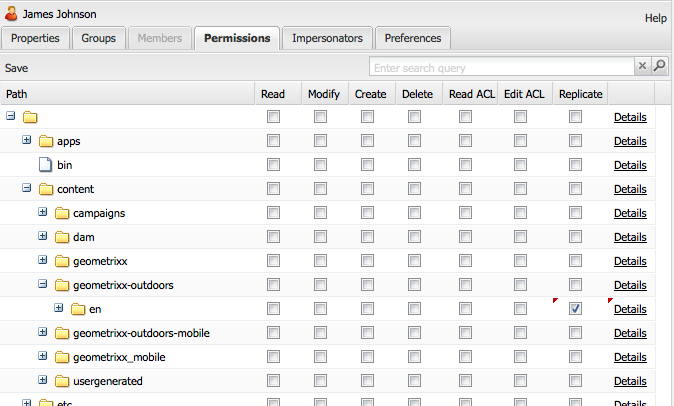

# Administração e segurança do usuário{#user-administration-and-security}

Este capítulo descreve como configurar e manter a autorização do usuário e também descreve a teoria por trás de como a autenticação e a autorização funcionam no AEM.

## Usuários e grupos no AEM {#users-and-groups-in-aem}

Esta seção lida com as várias entidades e conceitos relacionados em mais detalhes para ajudar você a configurar um conceito de gerenciamento de usuário fácil de manter.

### Usuários {#users}

Os usuários fazem logon no AEM com sua conta. Cada conta de usuário é exclusiva e contém os detalhes básicos da conta, juntamente com os privilégios atribuídos.

Os usuários geralmente são membros de Grupos, o que simplifica a alocação dessas permissões e/ou privilégios.

### Grupos {#groups}

Grupos são coleções de usuários, de outros grupos ou de ambos. Todas essas coleções são chamadas de Membros de um grupo.

Seu objetivo principal é simplificar o processo de manutenção, reduzindo o número de entidades a serem atualizadas, já que uma alteração feita em um grupo é aplicada a todos os membros do grupo. Os grupos geralmente refletem:

* uma função no aplicativo; como alguém com permissão para navegar no conteúdo ou alguém com permissão para contribuir com conteúdo.
* sua própria organização; convém estender as funções para diferenciar os colaboradores de departamentos diferentes quando eles são restritos a ramificações diferentes na árvore de conteúdo.

Portanto, os grupos tendem a permanecer estáveis, enquanto os usuários vêm e vão com mais frequência.

Com um planejamento e uma estrutura limpa, o uso de grupos pode refletir sua estrutura, fornecendo uma visão geral clara e um mecanismo eficiente para atualizações.

### Usuários e grupos integrados {#built-in-users-and-groups}

O AEM WCM instala vários usuários e grupos. Essas coleções são vistas quando você acessa o Console de segurança pela primeira vez após a instalação.

As tabelas a seguir listam cada item junto com:

* uma breve descrição
* qualquer recomendação sobre as alterações necessárias

*Alterar todas as senhas padrão* (se você não excluir a conta propriamente dita em determinadas circunstâncias).

<table>
 <tbody>
  <tr>
   <td>ID de usuário</td>
   <td>Tipo</td>
   <td>Descrição</td>
   <td>Recomendação</td>
  </tr>
  <tr>
   <td>
admin
 
Senha padrão: admin
 </td>
   <td>Usuário</td>
   <td>
Conta de administração do sistema com direitos de acesso totais.
 
Essa conta é usada para a conexão entre o AEM WCM e o CRX.
 
Se você excluir acidentalmente essa conta, ela será recriada na reinicialização do repositório (na configuração padrão).
 
A conta de administrador é um requisito da plataforma AEM. Como consequência, essa conta não pode ser excluída.
 </td>
   <td>
A Adobe recomenda que você altere a senha padrão dessa conta de usuário.
 
De preferência na instalação, embora possa ser feito posteriormente.
 
Observação: não confunda essa conta com a conta de administrador do Mecanismo de Servlet CQ.
 </td>
  </tr>
  <tr>
   <td>
anônimo
 
 
 </td>
   <td>Usuário</td>
   <td>
Mantém os direitos padrão para acesso não autenticado a uma instância. Por padrão, essa conta tem os direitos mínimos de acesso.
 
Se você excluir acidentalmente essa conta, ela será recriada na inicialização. Ela não pode ser excluída permanentemente, mas pode ser desativada.
 </td>
   <td>Evite excluir ou desabilitar essa conta, pois isso afeta negativamente o funcionamento das instâncias de autor. Se houver requisitos de segurança que determinem a exclusão, primeiro teste corretamente os efeitos sobre os sistemas.</td>
  </tr>
  <tr>
   <td>
autor
 
Senha padrão: autor
 </td>
   <td>Usuário</td>
   <td>
Uma conta de autor tem permissão para gravar em /content. Abrange privilégios de colaborador e surfer.
 
Pode ser usado como um webmaster, pois tem acesso a toda a árvore /content.
 
Esta conta não é um usuário incorporado, mas outro usuário de demonstração do Geometrixx
 </td>
   <td>
A Adobe recomenda que a conta seja completamente excluída ou que a senha padrão seja alterada.
 
De preferência na instalação, embora possa ser feito posteriormente.
 </td>
  </tr>
  <tr>
   <td>administradores</td>
   <td>Grupo</td>
   <td>
Grupo que dá direitos de administrador a todos os membros. Somente o administrador tem permissão para editar este grupo.
 
Tem direitos de acesso totais.
 </td>
   <td>Mesmo que você defina um "negar todos" em um nó, os administradores ainda poderão acessá-lo</td>
  </tr>
  <tr>
   <td>autores de conteúdo</td>
   <td>Grupo</td>
   <td>
Grupo responsável pela edição de conteúdo. Exige permissões de leitura, modificação, criação e exclusão.
 </td>
   <td>Você pode criar seus próprios grupos de autores de conteúdo com direitos de acesso específicos ao projeto, desde que adicione permissões de leitura, modificação, criação e exclusão.</td>
  </tr>
  <tr>
   <td>colaborador</td>
   <td>Grupo</td>
   <td>
Privilégios básicos que permitem ao usuário gravar conteúdo (como em funcionalidade apenas).
 
Não aloca nenhum privilégio para a árvore /content. Deve ser alocado para grupos ou usuários individuais.
 </td>
   <td> </td>
  </tr>
  <tr>
   <td>dam-users</td>
   <td>Grupo</td>
   <td>Grupo de referência pronto para uso para um usuário típico do AEM Assets. Os membros deste grupo têm privilégios apropriados para habilitar o upload/compartilhamento de ativos e coleções.</td>
   <td> </td>
  </tr>
  <tr>
   <td>todos</td>
   <td>Grupo</td>
   <td>
Todos os usuários no AEM são membros do grupo todos, mesmo que você não veja o grupo ou a relação de associação em todas as ferramentas.
 
Esse grupo pode ser considerado como os direitos padrão, pois pode ser usado para aplicar permissões para todos, até mesmo para usuários que serão criados no futuro.
 </td>
   <td>
Não modifique ou exclua este grupo.
 
A modificação desta conta tem implicações adicionais de segurança.
 </td>
  </tr>
  <tr>
   <td>administradores de tags</td>
   <td>Grupo</td>
   <td>Grupo que tem permissão para editar tags.</td>
   <td> </td>
  </tr>
  <tr>
   <td>administradores-usuários</td>
   <td>Grupo</td>
   <td>Autoriza a administração do usuário, ou seja, o direito de criar usuários e grupos.</td>
   <td> </td>
  </tr>
  <tr>
   <td>workflow-editors</td>
   <td>Grupo</td>
   <td>Grupo que tem permissão para criar e modificar modelos de fluxo de trabalho.</td>
   <td> </td>
  </tr>
  <tr>
   <td>workflow-users</td>
   <td>Grupo</td>
   <td>
Um usuário que participa de um fluxo de trabalho deve ser membro do grupo workflow-users. Fornece ao usuário acesso total a: /etc/workflow/instances para que ele possa atualizar a instância do fluxo de trabalho.
 
O grupo está incluído na instalação padrão, mas você deve adicionar manualmente os usuários ao grupo.
 </td>
  </tr>
 </tbody>
</table>

## Permissões no AEM {#permissions-in-aem}

O AEM usa ACLs para determinar quais ações um usuário ou grupo pode realizar e onde pode realizar essas ações.

### Permissões e ACLs {#permissions-and-acls}

As permissões definem quem pode executar quais ações em um recurso. As permissões são o resultado de [controle de acesso](#access-control-lists-and-how-they-are-evaluated) avaliações.

Você pode alterar as permissões concedidas/negadas a um determinado usuário marcando ou desmarcando as caixas de seleção de cada AEM [ações](security.md#actions). Uma marca de seleção indica que uma ação é permitida. Nenhuma marca de seleção indica que uma ação foi negada.

O local em que a marca de seleção está na grade também indica quais permissões os usuários têm em quais locais dentro do AEM (ou seja, quais caminhos).

### Ações {#actions}

As ações podem ser executadas em uma página (recurso). Para cada página na hierarquia, você pode especificar qual ação o usuário tem permissão para realizar nessa página. [Permissões](#permissions-and-acls) permitir ou negar uma ação.

<table>
 <tbody>
  <tr>
   <td><strong>Ação </strong></td>
   <td><strong>Descrição </strong></td>
  </tr>
  <tr>
   <td>Ler</td>
   <td>O usuário tem permissão para ler a página e qualquer página secundária.</td>
  </tr>
  <tr>
   <td>Modificar</td>
   <td>
O usuário pode:

    <ul>
     <li>modificar o conteúdo existente na página e em qualquer página secundária.</li>
     <li>crie parágrafos na página ou em qualquer página secundária.</li>
    </ul> 
No nível do JCR, os usuários podem editar um recurso editando suas propriedades, bloqueando, versionando, nt-modified e têm permissão de gravação completa nos nós que definem um nó filho jcr:content. Por exemplo, cq:Page, nt:file, cq:Asset.
 </td>
  </tr>
  <tr>
   <td>Criar</td>
   <td>
O usuário pode:

    <ul>
     <li>crie uma página ou uma página secundária.</li>
    </ul> 
Se <strong>modificar</strong> for negado, as subárvores abaixo de jcr:content serão excluídas porque a criação de jcr:content e seus nós filhos são considerados uma modificação de página. Essa regra se aplica somente aos nós que definem um nó filho jcr:content.
 </td>
  </tr>
  <tr>
   <td>Excluir</td>
   <td>
O usuário pode:

    <ul>
     <li>excluir parágrafos existentes da página ou de qualquer página secundária.</li>
     <li>excluir uma página ou página secundária.</li>
    </ul> 
Se <strong>modificar</strong> é negado, pois qualquer subárvore abaixo de jcr:content é excluída porque a remoção de jcr:content e de seus nós filhos é considerada uma modificação de página. Essa regra se aplica somente aos nós que definem um nó filho jcr:content.
 </td>
  </tr>
  <tr>
   <td>Ler ACL</td>
   <td>O usuário pode ler a lista de controle de acesso da página ou das páginas secundárias.</td>
  </tr>
  <tr>
   <td>Editar ACL</td>
   <td>O usuário pode modificar a lista de controle de acesso da página ou qualquer página secundária.</td>
  </tr>
  <tr>
   <td>Replicar</td>
   <td>O usuário pode replicar o conteúdo para outro ambiente (por exemplo, o ambiente de Publicação). O privilégio também é aplicado a qualquer página secundária.</td>
  </tr>
 </tbody>
</table>

>[!NOTE]
>
>O AEM gera automaticamente grupos de usuários para atribuição de funções (Proprietário, Editor, Visualizador) no [Coleções](/help/assets/manage-collections.md). No entanto, a adição manual de ACLs para esses grupos pode introduzir vulnerabilidades de segurança no AEM. O Adobe recomenda que você evite adicionar ACLs manualmente.

### Listas de controle de acesso e como são avaliadas {#access-control-lists-and-how-they-are-evaluated}

O AEM WCM usa Listas de controle de acesso (ACLs) para organizar as permissões que estão sendo aplicadas às várias páginas.

As Listas de controle de acesso são compostas por permissões individuais e são usadas para determinar a ordem em que essas permissões são aplicadas. A lista é formada de acordo com a hierarquia das páginas consideradas. Essa lista é então digitalizada de baixo para cima até que a primeira permissão apropriada para aplicar a uma página seja encontrada.

>[!NOTE]
>
>Há ACLs incluídas com as amostras. É recomendável que você analise e determine o que é apropriado para seus aplicativos. Para revisar as ACLs incluídas, vá para **CRXDE** e selecione o **Controle de acesso** para os seguintes nós:
>
>* `/etc/cloudservices`
>* `/home/users/we-retail`
>
>Seu aplicativo personalizado pode definir o acesso a outros relacionamentos, como:
>
>* `*/social/relationships/friend/*`
>* ou `*/social/relationships/pending-following/*`.
>
>Quando você cria ACLs específicas para comunidades, os membros que ingressam nessas comunidades podem receber permissões adicionais. Por exemplo, quando usuários se associam às comunidades em: `/content/we-retail/us/en/community`

### Estados de permissão {#permission-states}

>[!NOTE]
>
>Para usuários do CQ 5.3:
>
>Em contraste com versões anteriores do CQ, **criar** e **excluir** O não deve mais ser concedido se um usuário precisar modificar apenas páginas. Em vez disso, conceda **modificar** ação somente se quiser que os usuários possam criar, modificar ou excluir componentes em páginas existentes.
>
>Por motivos de compatibilidade com versões anteriores, os testes para ações não recebem o tratamento especial de nós que definem **jcr:content** conta.

| **Ação** | **Descrição** |
|---|---|
| Permitir (marca de seleção) | O AEM WCM permite que o usuário execute a ação nesta página ou em qualquer página secundária. |
| Negar (sem marca de seleção) | O WCM do AEM não permite que o usuário execute a ação nesta página ou em qualquer página secundária. |

As permissões também são aplicadas a qualquer página secundária.

Se uma permissão não for herdada do nó principal, mas tiver pelo menos uma entrada local para ela, os símbolos a seguir serão anexados à caixa de seleção. Uma entrada local é aquela criada na interface do CRX 2.2 (atualmente, ACLs curinga só podem ser criadas no CRX.)

Para uma ação em um determinado caminho:

<table>
 <tbody>
  <tr>
   <td>* (asterisco)</td>
   <td>Há pelo menos uma entrada local (efetiva ou ineficaz). Essas ACLs curingas são definidas no CRX.</td>
  </tr>
  <tr>
   <td>! (ponto de exclamação)</td>
   <td>Há pelo menos uma entrada que atualmente não tem efeito.</td>
  </tr>
 </tbody>
</table>

Quando você passa o mouse sobre o asterisco ou ponto de exclamação, uma dica de ferramenta fornece mais detalhes sobre as entradas declaradas. A dica de ferramenta é dividida em duas partes:

<table>
 <tbody>
  <tr>
   <td>Parte superior</td>
   <td>
Lista as entradas efetivas.
 </td>
  </tr>
  <tr>
   <td>Parte inferior</td>
   <td>Lista as entradas ineficazes que podem ter efeito em outro lugar na árvore (conforme indicado por um atributo especial presente com a ACE correspondente que limita o escopo da entrada). Alternativamente, é uma entrada cujo efeito é revogado por outra entrada definida no caminho determinado ou em um nó ancestral.</td>
  </tr>
 </tbody>
</table>

>[!NOTE]
>
>Se nenhuma permissão for definida para uma página, todas as ações serão negadas.

Veja a seguir recomendações sobre o gerenciamento de listas de controle de acesso:

* Não atribua permissões diretamente aos usuários. Atribuí-los somente a grupos.

  Isso simplifica a manutenção, pois o número de grupos é muito menor do que o número de usuários e também menos volátil.

* Se quiser que um grupo/usuário possa modificar apenas páginas, não conceda a ele direitos de criação ou negação. Conceda a eles apenas direitos de modificação e leitura.
* Use Negar com moderação. Na medida do possível, use somente Permitir.

  O uso de negar pode causar efeitos inesperados se as permissões forem aplicadas em uma ordem diferente da ordem esperada. Se um usuário for membro de mais de um grupo, as instruções Deny de um grupo poderão cancelar a instrução Allow de outro grupo ou o oposto. É difícil manter uma visão geral quando tal coisa acontece e pode facilmente levar a resultados imprevistos, enquanto Permitir atribuições não causa esses conflitos.

  O Adobe recomenda que você trabalhe com Permitir em vez de Negar para ver [Práticas recomendadas](#best-practices).

Antes de modificar qualquer uma das permissões, compreenda como elas funcionam e se relacionam entre si. Consulte a documentação do CRX que ilustra como o WCM do AEM [avalia os direitos de acesso](/help/sites-administering/user-group-ac-admin.md#how-access-rights-are-evaluated)e exemplos de configuração de listas de controle de acesso.

### Permissões {#permissions}

As permissões dão aos usuários e grupos acesso à funcionalidade AEM em páginas AEM.

As permissões são pesquisadas por caminho, expandindo/recolhendo os nós, e é possível rastrear a herança de permissões até o nó raiz.

Você permite ou nega permissões marcando ou desmarcando as caixas de seleção apropriadas.

### Exibindo Informações Detalhadas sobre Permissões {#viewing-detailed-permission-information}

Juntamente com a exibição de grade, o AEM fornece uma exibição detalhada das permissões para um usuário/grupo selecionado em um determinado caminho. A visualização detalhada fornece informações adicionais.

Além de visualizar informações, você também pode incluir ou excluir o usuário ou grupo atual de um grupo. Consulte [Adicionar usuários ou grupos ao adicionar permissões](#adding-users-or-groups-while-adding-permissions). As alterações feitas aqui são refletidas imediatamente na parte superior da exibição detalhada.

Para acessar a exibição Detalhe, na **Permissões** clique em **Detalhes** para qualquer grupo/usuário e caminho selecionados.

Os detalhes são divididos em duas partes:

<table>
 <tbody>
  <tr>
   <td>Parte superior</td>
   <td>
Repete as informações que você vê na grade da árvore. Para cada ação, um ícone mostra se a ação é permitida ou negada:

    <ul>
     <li>nenhum ícone = nenhuma entrada declarada</li>
     <li>(marca de verificação) = ação declarada (permitir)</li>
     <li>(-) = ação declarada (negar)</li>
    </ul> </td>
  </tr>
  <tr>
   <td>Parte inferior</td>
   <td>
Mostra a grade de usuários e grupos que faz o seguinte:

    <ul>
     <li>Declara uma entrada para o caminho determinado E</li>
     <li>O OU é um grupo autorizado</li>
    </ul> </td>
  </tr>
 </tbody>
</table>

### Representar outro usuário {#impersonating-another-user}

Com o [Representar funcionalidade](/help/sites-authoring/user-properties.md#user-settings), um usuário pode trabalhar em nome de outro usuário.

Ou seja, uma conta de usuário pode especificar outras contas que possam operar com sua conta. Por exemplo, se o usuário-B tiver permissão para representar o usuário-A, ele poderá agir usando os detalhes completos da conta do usuário-A.

Essa funcionalidade permite que contas de representantes concluam tarefas como se estivessem usando a conta que estão representando. Por exemplo, durante uma ausência ou para compartilhar uma carga excessiva a curto prazo.

>[!NOTE]
>
>Para que a representação funcione para usuários não administradores, o representante (no caso acima, o usuário B) deve ter permissões de LEITURA na `/home/users` caminho.
>
>Consulte [Permissões no AEM](/help/sites-administering/security.md#permissions-in-aem).

>[!CAUTION]
>
>Se uma conta representa outra, é difícil visualizar. Uma entrada é feita no log de auditoria quando a representação começa e termina, mas os outros arquivos de log (como o log de acesso) não mantêm informações de que uma representação ocorreu nos eventos. Portanto, se o usuário B estiver representando o usuário A, todos os eventos serão exibidos como se o usuário A os executasse.

>[!CAUTION]
>
>O bloqueio de uma página pode ser executado quando se representa um usuário. No entanto, uma página bloqueada dessa maneira só pode ser desbloqueada como o usuário que foi representado ou um usuário com privilégios de administrador.
>
>Páginas não podem ser desbloqueadas representando o usuário que as bloqueou.

### Práticas recomendadas {#best-practices}

A tabela a seguir descreve as práticas recomendadas ao trabalhar com permissões e privilégios:

| Regra | Motivo |
|--- |--- |
| *Usar grupos* | Evite atribuir direitos de acesso a cada usuário. Há várias razões para este conselho:<ul><li>Você tem muito mais usuários do que grupos, portanto, os grupos simplificam a estrutura.</li><li>Os grupos ajudam a fornecer uma visão geral de todas as contas.</li> <li>A herança é mais simples com grupos.</li><li>Os usuários vêm e vão. Os grupos são de longo prazo.</li></ul> |
| *Ser positivo* | Sempre use as instruções Allow para especificar os direitos do grupo (sempre que possível). Evite usar uma instrução Deny. Os grupos são avaliados em ordem, e a ordem pode ser definida de forma diferente por usuário. Em outras palavras: você pode ter pouco controle sobre a ordem em que as instruções são implementadas e avaliadas. Se você usar somente as instruções Allow, a ordem não será importante. |
| *Mantenha a simplicidade* | Investir algum tempo e pensamento ao configurar uma nova instalação vale a pena. A aplicação de uma estrutura clara simplifica a manutenção e a administração contínuas, garantindo que tanto seus colegas atuais quanto os futuros sucessores possam entender facilmente o que é implementado. |
| *Teste* | Use uma instalação de teste para praticar e garantir que você entenda os relacionamentos entre os vários usuários e grupos. |
| *Usuários/grupos padrão* | Sempre atualize os Usuários e grupos padrão imediatamente após a instalação para ajudar a evitar problemas de segurança. |

## Gerenciar usuários e grupos {#managing-users-and-groups}

Os usuários incluem pessoas que usam o sistema e sistemas estrangeiros que fazem solicitações ao sistema.

Um grupo é um conjunto de usuários.

Ambos podem ser configurados usando a funcionalidade Administração de usuários no Console de segurança.

### Acesso à Administração do usuário com o Console de segurança {#accessing-user-administration-with-the-security-console}

Você acessa todos os usuários, grupos e permissões associadas usando o console Segurança. Todos os procedimentos descritos nesta seção são executados nesta janela.

Para acessar a segurança WCM do AEM, siga um destes procedimentos:

* Na tela Welcome (Bem-vindo) ou em vários locais no AEM, clique no ícone de segurança:

* Navegue diretamente para `https://<server>:<port>/useradmin`. Certifique-se de fazer logon no AEM como administrador.

A janela a seguir é exibida:

A árvore esquerda lista todos os usuários e grupos que estão atualmente no sistema. Você pode selecionar as colunas que deseja exibir, classificar o conteúdo das colunas e até mesmo alterar a ordem em que as colunas são exibidas, arrastando o cabeçalho da coluna para uma nova posição.

As guias fornecem acesso a várias configurações:

<!-- ??? in table below. -->

| Guia | Descrição |
|--- |--- |
| Caixa de filtro | Um mecanismo para filtrar os usuários, grupos ou ambos listados. Consulte [Filtrar usuários e grupos](#filtering-users-and-groups). |
| Ocultar usuários | Um switch de alternância que oculta todos os usuários listados, deixando apenas os grupos. Consulte [Ocultar usuários e grupos](#hiding-users-and-groups). |
| Ocultar grupos | Um switch de alternância que oculta todos os grupos listados, deixando apenas os usuários. Consulte [Ocultar usuários e grupos](#hiding-users-and-groups). |
| Editar | Um menu que permite criar e excluir, bem como ativar e desativar usuários ou grupos. Consulte [Criar usuários e grupos](#creating-users-and-groups) e [Excluir usuários e grupos](#deleting-users-and-groups). |
| Propriedades | Lista informações sobre o usuário ou grupo que podem incluir informações de email, uma descrição e informações de nome. Também permite alterar a senha de um usuário. Consulte [Criar usuários e grupos](#creating-users-and-groups), [Modificando Propriedades de Usuários e Grupos](#modifying-user-and-group-properties) e [Alterar a senha de um usuário](#changing-a-user-password). |
| Grupos | Lista todos os grupos aos quais o usuário ou grupo selecionado pertence. Você pode atribuir o(s) usuário(s) selecionado(s) a grupos adicionais ou removê-los de grupos. Consulte [Grupos](#adding-users-or-groups-to-a-group). |
| Membros | Disponível somente para grupos. Lista os membros de um grupo específico. Consulte [Membros](#members-adding-users-or-groups-to-a-group). |
| Permissões | Você pode alocar permissões a um usuário ou grupo. Permite controlar o seguinte:<ul><li>Permissões relacionadas a páginas/nós específicos. Consulte [Definição de permissões](#setting-permissions). </li><li>Permissões relacionadas à criação e exclusão de páginas e modificação de hierarquia. ??? permite [alocar privilégios](#settingprivileges), como modificação de hierarquia, que permite criar e excluir páginas,</li><li>Permissões relacionadas a [privilégios de replicação](#setting-replication-privileges) (geralmente do autor para a publicação) de acordo com um caminho.</li></ul> |
| Personificadores | Permite que outro usuário personifique a conta. Útil quando você precisa que um usuário atue em nome de outro usuário. Consulte [Representação de usuários](#impersonating-another-user). |
| Preferências | Conjuntos [preferências para o grupo ou usuário](#setting-user-and-group-preferences). Por exemplo, preferências de idioma. |

### Filtrar usuários e grupos {#filtering-users-and-groups}

Você pode filtrar a lista inserindo uma expressão de filtro, que oculta todos os usuários e grupos que não correspondem à expressão. Também é possível ocultar usuários e grupos usando o [Ocultar usuário e ocultar grupo](#hiding-users-and-groups) botões.

Para filtrar usuários ou grupos:

1. Na lista de árvores à esquerda, digite a expressão de filtro no espaço fornecido. Por exemplo, inserir **administrador** exibe todos os usuários e grupos que contêm esta cadeia de caracteres.
1. Clique na lupa para filtrar a lista.

   

1. Clique em **x** quando quiser remover todos os filtros.

### Ocultar usuários e grupos {#hiding-users-and-groups}

Ocultar usuários ou grupos é outra maneira de filtrar a lista de todos os usuários e grupos em um sistema. Há dois mecanismos de alternância. Clicar em Ocultar usuário oculta todos os usuários da exibição e clicar em Ocultar grupos oculta todos os grupos da exibição (não é possível ocultar usuários e grupos ao mesmo tempo). Para filtrar a lista usando uma expressão de filtro, consulte [Filtrar usuários e grupos](#filtering-users-and-groups).

Para ocultar usuários e grupos:

1. No **Segurança** , clique em **Ocultar usuários** ou **Ocultar grupos**. O botão selecionado aparece realçado.

   

1. Para fazer com que usuários ou grupos reapareçam, clique novamente no botão correspondente.

### Criar usuários e grupos {#creating-users-and-groups}

Para criar um usuário ou grupo:

1. No **Segurança** lista da árvore do console, clique em **Editar** e depois **Criar usuário** ou **Criar grupo**.

   

1. Insira os detalhes necessários, de acordo com a criação de um usuário ou grupo.

   * Se você selecionar **Criar usuário,** digite a ID de login, o nome e sobrenome, o endereço de e-mail e uma senha. Por padrão, o AEM cria um caminho com base na primeira letra do sobrenome, mas você pode selecionar outro caminho.

   

   * Se você selecionar **Criar grupo**, você informa uma ID de grupo e uma descrição opcional.

   

1. Clique em **Criar**. O usuário ou grupo que você criou aparece na lista em árvore.

### Excluir usuários e grupos {#deleting-users-and-groups}

Para excluir um usuário ou grupo:

1. No **Segurança** selecione o usuário ou grupo que deseja excluir. Se desejar excluir vários itens, Shift+clique ou Control+clique para selecioná-los.
1. Clique em **Editar,** e selecione Excluir. O WCM do AEM pergunta se você deseja excluir o usuário ou grupo.
1. Clique em **OK** para confirmar ou Cancelar.

### Modificando Propriedades de Usuários e Grupos {#modifying-user-and-group-properties}

Para modificar propriedades de usuários e grupos:

1. No **Segurança** clique duas vezes no nome do usuário ou do grupo que deseja modificar.

1. Clique em **Propriedades** faça as alterações necessárias e clique em **Salvar**.

   

>[!NOTE]
>
>O caminho do usuário é exibido na parte inferior das propriedades do usuário. Ele não pode ser modificado.

### Alterar a senha de um usuário {#changing-a-user-password}

Use o procedimento a seguir para modificar a senha de um usuário.

>[!NOTE]
>
>Não é possível usar o Console de segurança para alterar a senha do administrador. Para alterar a senha da conta de administrador, use o [Console de usuários](/help/sites-administering/granite-user-group-admin.md#changing-the-password-for-an-existing-user) que a Granite Operations oferece.
>
>Se você estiver usando o AEM Forms no JEE, não use as instruções abaixo para alterar a senha. Em vez disso, use o AEM Forms no JEE Admin Console (/adminui) para alterar a senha.

1. No **Segurança** clique duas vezes no nome de usuário para o qual deseja alterar a senha.
1. Clique em **Propriedades** (se ainda não estiver ativo).
1. Clique em **Definir senha**. A janela Definir senha é aberta, onde você pode alterar sua senha.

   

1. Digite a nova senha duas vezes; como elas não são exibidas em texto não criptografado, esta ação é para confirmação - se não corresponderem, o sistema mostrará um erro.
1. Clique em **Definir** para ativar a nova senha da conta.

### Adicionar usuários ou grupos a um grupo {#adding-users-or-groups-to-a-group}

O AEM oferece três maneiras diferentes de adicionar usuários ou grupos a um grupo existente:

* Quando estiver no grupo, você poderá adicionar membros (usuários ou grupos).
* Quando você estiver no membro, poderá adicionar membros a grupos.
* Quando estiver trabalhando nas Permissões, você poderá adicionar membros aos grupos.

### Grupos - Adicionando usuários ou grupos a um grupo {#groups-adding-users-or-groups-to-a-group}

A variável **Grupos** mostra a você a quais grupos a conta atual pertence. Você pode usá-la para adicionar a conta selecionada a um grupo:

1. Clique duas vezes no nome da conta (usuário ou grupo) que deseja atribuir a um grupo.
1. Clique em **Grupos** guia. Você verá uma lista de grupos aos quais a conta já pertence.
1. Na lista em árvore, clique no nome do grupo que deseja adicionar à conta e arraste-o para a **Grupos** painel. (Se quiser adicionar vários usuários, pressione Shift e clique ou Control e arraste esses nomes.)

   

1. Clique em **Salvar** para salvar as alterações.

### Membros - Adicionando Usuários ou Grupos a um Grupo {#members-adding-users-or-groups-to-a-group}

A variável **Membros** A guia só funciona para grupos e mostra quais usuários e grupos pertencem ao grupo atual. Você pode usá-la para adicionar contas a um grupo:

1. Clique duas vezes no nome do grupo ao qual deseja adicionar membros.
1. Clique em **Membros** guia. Você verá uma lista de membros que já pertencem a este grupo.
1. Na lista em árvore, clique no nome do membro que deseja adicionar ao grupo e arraste-o para a **Membros** painel. (Se quiser adicionar vários usuários, pressione Shift e clique ou Control e arraste esses nomes.)

   

1. Clique em **Salvar** para salvar as alterações.

### Adicionar usuários ou grupos ao adicionar permissões {#adding-users-or-groups-while-adding-permissions}

Para adicionar membros a um grupo em em um determinado caminho:

1. Clique duas vezes no nome do grupo ou usuário ao qual deseja adicionar usuários.

1. Clique em **Permissões** guia.

1. Navegue até o caminho ao qual deseja adicionar permissões e clique em **Detalhes**. A parte inferior da janela de detalhes fornece informações sobre quem tem permissões para essa página.

   

1. Marque a caixa de seleção na caixa **membro** para os membros que você deseja que tenham permissões para esse caminho. Desmarque a caixa de seleção do membro para o qual você deseja remover permissões. Um triângulo vermelho aparece na célula que você alterou.
1. Clique em **OK** para salvar as alterações.

### Removendo usuários ou grupos de grupos {#removing-users-or-groups-from-groups}

O AEM oferece três maneiras diferentes de remover usuários ou grupos de um grupo:

* Quando estiver no perfil do grupo, você poderá remover membros (usuários ou grupos).
* Quando estiver no perfil do membro, você poderá remover membros dos grupos.
* Quando você está trabalhando nas Permissões, é possível remover membros dos grupos.

### Grupos - Removendo usuários ou grupos de grupos {#groups-removing-users-or-groups-from-groups}

Para remover uma conta de usuário ou de grupo de um grupo:

1. Clique duas vezes no nome do grupo ou da conta de usuário que deseja remover de um grupo.
1. Clique em **Grupos** guia. Você pode ver a quais grupos a conta selecionada pertence.
1. No **Grupos** clique no nome do usuário ou grupo que deseja remover do grupo e clique em **Remover**. (Se desejar remover várias contas, clique com a tecla Shift pressionada ou com a tecla Control pressionada e clique **Remover**.)

   

1. Clique em **Salvar** para salvar as alterações.

### Membros - Removendo Usuários ou Grupos de Grupos {#members-removing-users-or-groups-from-groups}

Para remover contas de um grupo:

1. Clique duas vezes no nome do grupo do qual deseja remover membros.
1. Clique em **Membros** guia. Você verá uma lista de membros que já pertencem a este grupo.
1. No **Membros** clique no nome do membro que deseja remover do grupo e clique em **Remover**. (Se desejar remover vários usuários, pressione Shift+clique ou Control+clique nesses nomes e clique em **Remover**.)

   

1. Clique em **Salvar** para salvar as alterações.

### Removendo usuários ou grupos ao adicionar permissões {#removing-users-or-groups-while-adding-permissions}

Para remover membros de um grupo em um determinado caminho:

1. Clique duas vezes no nome do grupo ou usuário do qual deseja remover usuários.

1. Clique em **Permissões** guia.

1. Navegue até o caminho ao qual deseja remover as permissões e clique em **Detalhes**. A parte inferior da janela de detalhes fornece informações sobre quem tem permissões para essa página.

   

1. Marque a caixa de seleção na caixa **membro** para os membros que você deseja que tenham permissões para esse caminho. Desmarque a caixa de seleção do membro para o qual você deseja remover permissões. Um triângulo vermelho aparece na célula que você alterou.
1. Clique em **OK** para salvar as alterações.

### Sincronização de usuário {#user-synchronization}

Quando a implantação é uma [publicar farm](/help/sites-deploying/recommended-deploys.md#tarmk-farm), usuários e grupos devem ser sincronizados entre todos os nós de publicação.

Para saber mais sobre a sincronização de usuários e como ativá-la, consulte [Sincronização de usuário](/help/sites-administering/sync.md).

## Gerenciamento de permissões {#managing-permissions}

>[!NOTE]
>
>O Adobe apresentou uma nova visualização principal baseada na interface para toque para gerenciamento de permissões. Para obter mais detalhes sobre como usá-lo, consulte [esta página](/help/sites-administering/touch-ui-principal-view.md).

Esta seção descreve como definir permissões, incluindo privilégios de replicação.

### Definição de permissões {#setting-permissions}

As permissões permitem que os usuários executem determinadas ações nos recursos em determinados caminhos. Também inclui a capacidade de criar ou excluir páginas.

Para adicionar, modificar ou excluir permissões:

1. No **Segurança** console, clique duas vezes no nome do usuário ou grupo para o qual deseja definir permissões ou [pesquisar nós](#searching-for-nodes).

1. Clique em **Permissões** guia.

   

1. Na grade da árvore, marque uma caixa de seleção para permitir que o usuário ou grupo selecionado execute uma ação ou desmarque uma caixa de seleção para negar que o usuário ou grupo selecionado execute uma ação. Para obter mais informações, clique em **Detalhes**.

1. Quando terminar, clique em **Salvar**.

### Definindo Privilégios de Replicação {#setting-replication-privileges}

O privilégio de replicação é o direito de publicar conteúdo e pode ser definido para grupos e usuários.

>[!NOTE]
>
>* Quaisquer direitos de replicação aplicados a um grupo se aplicam a todos os usuários desse grupo.
>* Os privilégios de replicação de um usuário substituem os privilégios de replicação de um grupo.
>* Os direitos de replicação Permitir têm uma precedência maior do que os direitos de replicação Negar. Consulte [Permissões no AEM](#permissions-in-aem) para obter mais informações.
>

Para definir privilégios de replicação:

1. Selecione o usuário ou grupo na lista, clique duas vezes para abri-lo e clique em **Permissões**.
1. Na grade, navegue até o caminho em que deseja que o usuário tenha privilégios de replicação ou [pesquisar nós.](#searching-for-nodes)

1. No **Replicar** no caminho selecionado, marque uma caixa de seleção para adicionar o privilégio de replicação para esse usuário ou grupo ou desmarque a caixa de seleção para remover o privilégio de replicação. O AEM exibe um triângulo vermelho em qualquer lugar em que você tenha feito alterações que ainda não foram salvas.

   

1. Clique em **Salvar** para salvar as alterações.

### Procurando nós {#searching-for-nodes}

Ao adicionar ou remover permissões, você pode procurar ou procurar o nó.

Há dois tipos diferentes de pesquisa de caminho:

* Pesquisa de caminho - Se a sequência de pesquisa começar com &quot;/&quot;, ela pesquisará pelos subnós diretos do caminho fornecido:

Na caixa de pesquisa, é possível fazer o seguinte:

| Ação | O que faz |
|--- |--- |
| Seta para a direita | Seleciona um subnó no resultado da pesquisa |
| Tecla de seta para baixo | Inicia a pesquisa novamente. |
| Tecla Enter (Return) | Seleciona um subnó e o carrega na grade da árvore |

* Pesquisa de texto completo - se a sequência de pesquisa não iniciar com &quot;/&quot;, uma pesquisa de texto completo será executada em todos os nós no caminho &quot;/content&quot;.

Para executar uma pesquisa em caminhos ou texto completo:

1. No Console de segurança, selecione um usuário ou grupo e clique no botão **Permissões** guia.

1. Na caixa Pesquisar, digite um termo para procurar.

### Representação de usuários {#impersonating-users}

Você pode especificar um ou mais usuários que podem representar o usuário atual. Essa capacidade significa que eles podem alternar as configurações da conta para o usuário atual e agir em nome desse usuário.

Use essa função com cuidado, pois ela pode permitir que os usuários executem ações que seus próprios usuários não podem executar. Ao representar um usuário, os usuários são notificados de que não estão conectados como eles mesmos.

Há vários cenários em que você pode querer usar essa funcionalidade, incluindo:

* Se você estiver fora do escritório, você pode deixar outra pessoa se passar por você enquanto estiver fora. Ao usar esse recurso, você pode garantir que alguém tenha seus direitos de acesso e não é necessário modificar um perfil de usuário ou fornecer sua senha.
* Você pode usá-lo para fins de depuração. Por exemplo, para ver como o site procura um usuário com direitos de acesso restritos. Além disso, se um usuário reclamar de problemas técnicos, você poderá representar esse usuário para diagnosticar e corrigir o problema.

Para representar um usuário existente:

1. Na lista em árvore, selecione o nome da pessoa que você deseja atribuir a outros usuários para representação. Clique duas vezes para abrir.
1. Clique em **Representantes** guia.
1. Clique no usuário que você deseja poder representar o usuário selecionado. Arraste o usuário (o representante) da lista para o painel Representar. O nome aparece na lista.

   

1. Clique em **Salvar**.

### Configurando as preferências do usuário e do grupo {#setting-user-and-group-preferences}

Para definir preferências de usuário e grupo, incluindo idioma, gerenciamento de janelas e preferências de barra de ferramentas:

1. Selecione o usuário ou grupo cujas preferências você deseja alterar na árvore do lado esquerdo. Para selecionar vários usuários ou grupos, clique nas seleções com as teclas Ctrl+clique ou Shift+clique.
1. Clique em **Preferências** guia.

   

1. Faça alterações, conforme necessário, nas preferências do grupo ou do usuário e clique em **Salvar** quando terminar.

### Configurar usuários ou administradores para terem o privilégio de gerenciar outros usuários {#setting-users-or-administrators-to-have-the-privilege-to-manage-other-users}

Para definir usuários ou administradores com privilégios para excluir/ativar/desativar outros usuários:

1. Adicione o usuário que você deseja conceder privilégios para gerenciar outros usuários ao grupo de administradores e salve suas alterações.

   

1. No do **Permissões** navegue até &quot;/&quot; e, na coluna Replicar, marque a caixa de seleção para permitir a replicação em &quot;/&quot; e clique em **Salvar**.

   

   O usuário selecionado agora pode desativar, ativar, excluir e criar usuários.

### Estendendo Privilégios no Nível do Projeto {#extending-privileges-on-a-project-level}

Se você planeja implementar privilégios específicos do aplicativo, as informações a seguir descrevem o que você deve saber para implementar um privilégio personalizado e como aplicá-lo em todo o CQ:

O privilégio de modificação de hierarquia é coberto por uma combinação de privilégios jcr. O privilégio de replicação é nomeado como **crx:replicar** que é armazenado/avaliado juntamente com outros privilégios no repositório jcr. No entanto, não é aplicado no nível do jcr.

A definição e o registro de privilégios personalizados fazem parte oficialmente do [API Jackrabbit](https://jackrabbit.apache.org/oak/docs/security/privilege.html) a partir da versão 2.4 (consulte também [JCR-2887](https://issues.apache.org/jira/browse/JCR-2887)). A utilização adicional é coberta pelo Gerenciamento de controle de acesso JCR, como definido por [JSR 283](https://jcp.org/en/jsr/detail?id=283) (seção 16). Além disso, a API Jackrabbit define algumas extensões.

O mecanismo de registro de privilégios é refletido na interface em **Configuração do repositório**.

O registro de novos privilégios (personalizados) é protegido por um privilégio incorporado que deve ser concedido no nível do repositório. No JCR: transmitindo &#39;null&#39; como o parâmetro &#39;absPath&#39; na api ac mgt, consulte jsr 333 para obter detalhes. Por padrão, **administrador** e todos os membros dos administradores têm esse privilégio concedido.

>[!NOTE]
>
>Embora a implementação cuide da validação e avaliação de privilégios personalizados, ela não pode aplicá-los, a menos que sejam agregados de privilégios incorporados.
