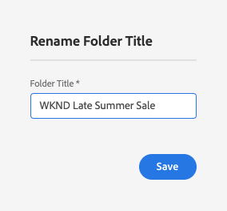
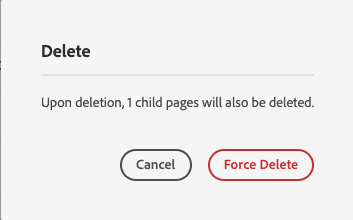

# Configuração da segmentação com o ContextHub{#configuring-segmentation-with-contexthub}

>[!NOTE]
>
>Esta seção descreve como configurar a segmentação ao usar o ContextHub. Se você estiver usando a funcionalidade Contexto do Cliente, consulte a documentação relevante para [configuração da segmentação para Contexto do Cliente](/help/sites-administering/campaign-segmentation.md).

A segmentação é uma consideração importante ao criar uma campanha. Consulte [Gerenciamento de públicos-alvo](/help/sites-authoring/managing-audiences.md) para obter informações sobre como a segmentação funciona e os termos principais.

Dependendo das informações que você já coletou sobre os visitantes do seu site e das metas que deseja alcançar, será necessário definir os segmentos e as estratégias necessárias para o seu conteúdo direcionado.

Esses segmentos são usados para fornecer conteúdo direcionado especificamente a um visitante. Esse conteúdo é mantido no [Personalização](/help/sites-authoring/personalization.md) do site. As [atividades](/help/sites-authoring/activitylib.md) definidas aqui podem ser incluídas em qualquer página e definem para qual segmento de visitante o conteúdo especializado se aplica.

O AEM permite personalizar facilmente a experiência dos usuários. Também permite verificar os resultados das definições de segmento.

## Acessar segmentos {#accessing-segments}

O [Públicos-alvo](/help/sites-authoring/managing-audiences.md) O console é usado para gerenciar segmentos do ContextHub ou do ClientContext, bem como públicos-alvo da sua conta Adobe Target. Esta documentação abrange o gerenciamento de segmentos para o ContextHub. Para [Segmentos de contexto do cliente](/help/sites-administering/campaign-segmentation.md) e segmentos do Adobe Target, consulte a documentação relevante.

Para acessar seus segmentos, você precisa selecionar sua configuração. Na navegação global, selecione **Navegação > Personalização > Públicos-alvo**. Você verá as configurações disponíveis:


Selecione sua configuração para ver os segmentos, por exemplo, Site WKND:


## Editor do segmento  {#segment-editor}

O **Editor de segmentos** permite modificar facilmente um segmento. Para editar um segmento, selecione um segmento na [lista de segmentos](/help/sites-administering/segmentation.md#accessing-segments) e clique no botão **Editar** botão.


Usando o navegador de componentes, você pode adicionar contêineres **AND** e **OR** para definir a lógica do segmento e, em seguida, adicionar componentes adicionais para comparar propriedades e valores ou scripts de referência e outros segmentos para definir os critérios de seleção (consulte [Criar um novo segmento](#creating-a-new-segment)) para definir o cenário exato para selecionar o segmento.

Quando a declaração inteira for avaliada como verdadeira, o segmento será resolvido. Caso vários segmentos sejam aplicáveis, o fator de **reforço** também é usado. Consulte [Criar um novo segmento](#creating-a-new-segment)[ para obter detalhes sobre o fator de reforço.](/help/sites-administering/campaign-segmentation.md#boost-factor)

>[!CAUTION]
>
>O editor de segmentos não verifica se há referências circulares. Por exemplo, o segmento A faz referência a outro segmento B, que, por sua vez, faz referência ao segmento A. Você deve garantir que seus segmentos não contenham referências circulares.

### Contêineres {#containers}

Os seguintes contêineres estão disponíveis prontamente e permitem agrupar comparações e referências para avaliação boolean. Eles podem ser arrastados do navegador de componentes para o editor. Consulte a seção [Uso de contêineres AND e OR](/help/sites-administering/segmentation.md#using-and-and-or-containers) seguinte para obter mais informações.

<table>
 <tbody>
  <tr>
   <td>Contêiner AND<br /> </td>
   <td>O operador AND boolean<br /> </td>
  </tr>
  <tr>
   <td>Contêiner OR<br /> </td>
   <td>O operador OR boolean</td>
  </tr>
 </tbody>
</table>

### Comparações {#comparisons}

As comparações de segmentos a seguir estão disponíveis prontas para uso para avaliar as propriedades do segmento. Eles podem ser arrastados do navegador de componentes para o editor.

<table>
 <tbody>
  <tr>
   <td>Propriedade—Valor<br /> </td>
   <td>Compara uma propriedade de um armazenamento a um valor definido<br /> </td>
  </tr>
  <tr>
   <td>Propriedade—Propriedade</td>
   <td>Compara uma propriedade de um armazenamento a outra propriedade<br /> </td>
  </tr>
  <tr>
   <td>Propriedade—Referência de segmento</td>
   <td>Compara uma propriedade de um armazenamento a outro segmento referenciado<br /> </td>
  </tr>
  <tr>
   <td>Propriedade—Referência de script</td>
   <td>Compara uma propriedade de um armazenamento aos resultados de um script<br /> </td>
  </tr>
  <tr>
   <td>Referência de segmento—Referência do script</td>
   <td>Compara um segmento referenciado aos resultados de um script<br /> </td>
  </tr>
 </tbody>
</table>

>[!NOTE]
>
>Ao comparar valores, se o tipo de dados da comparação não estiver definido (ou seja, definido para detecção automática), o mecanismo de segmentação do ContextHub simplesmente comparará os valores, como o javascript faria. Não converte valores em seus tipos esperados, o que pode levar a resultados enganosos. Por exemplo:
>
>`null < 30 // will return true`
>
>Portanto, ao [criar um segmento](/help/sites-administering/segmentation.md#creating-a-new-segment), você deve selecionar um **tipo de dados** sempre que os tipos de valores comparados forem conhecidos. Por exemplo:
>
>Ao comparar a propriedade `profile/age`, você já sabe que o tipo comparado será **número**, mesmo que `profile/age` não esteja definido, uma comparação `profile/age` menor do que 30 retornará **falso**, como esperado.

### Referências {#references}

As seguintes referências estão disponíveis prontas para uso para vincular diretamente a um script ou outro segmento. Eles podem ser arrastados do navegador de componentes para o editor.

<table>
 <tbody>
  <tr>
   <td>Referência do segmento<br /> </td>
   <td>Avaliar o segmento referenciado</td>
  </tr>
  <tr>
   <td>Referência de scripts</td>
   <td>Avaliar o script referenciado. Consulte a seção <a href="/help/sites-administering/segmentation.md#using-script-references">Usar referências de script</a> para obter mais informações.</td>
  </tr>
 </tbody>
</table>

## Criar um novo segmento {#creating-a-new-segment}

Para definir seu novo segmento:

1. Depois [acesso aos segmentos](/help/sites-administering/segmentation.md#accessing-segments), [navegue até a pasta](#organizing-segments) onde deseja criar o segmento.

1. clique ou toque no botão Criar e selecione **Criar segmento do ContextHub**.

   

1. No **Novo segmento do ContextHub**, insira um título para o segmento, bem como um valor de reforço, se necessário, e toque ou clique em **Criar**.

   

   Cada segmento tem um parâmetro de reforço usado como fator de ponderação. Um número mais alto indica que o segmento será selecionado em detrimento de um segmento com um número menor em instâncias em que vários segmentos são válidos.

   * Valor mínimo: `0`
   * Valor máximo: `1000000`

1. Arraste uma comparação ou referência para o editor de segmentos e ela aparecerá no contêiner AND padrão.
1. Clique duas vezes em ou toque na opção de configuração da nova referência ou segmento para editar os parâmetros específicos. Neste exemplo, estamos testando pessoas em San Jose.

   

   Sempre defina um **Tipo de dados**, se possível, para garantir que suas comparações sejam avaliadas corretamente. Consulte [Comparações](/help/sites-administering/segmentation.md#comparisons) para obter mais informações.

1. Clique em **OK** para salvar sua definição:
1. Adicione mais componentes conforme necessário. É possível formular expressões boolean usando os componentes do contêiner para comparações AND e OR (consulte [Uso de contêineres AND e OR](/help/sites-administering/segmentation.md#using-and-and-or-containers) abaixo). Com o editor de segmentos, é possível excluir componentes que não são mais necessários ou arrastá-los para novas posições na instrução.

### Uso de contêineres AND e OR {#using-and-and-or-containers}

Ao usar os componentes de contêineres AND e OR, é possível construir segmentos complexos no AEM. Ao fazer isso, é útil estar ciente de alguns pontos básicos:

* O nível superior da definição é sempre o contêiner AND criado inicialmente. Isso não pode ser alterado, mas não afeta o restante da definição de segmento.
* Certifique-se de que o aninhamento do seu contêiner faça sentido. Os contêineres podem ser exibidos como colchetes da expressão boolean.

O exemplo a seguir é usado para selecionar visitantes que são considerados em nossa faixa etária principal:

Masculino e entre 30 e 59 anos

OU

Mulheres e entre 30 e 59 anos

Você começa colocando um componente de contêiner OR no contêiner AND padrão. No contêiner OR, você adiciona dois contêineres AND e, em ambos, pode adicionar a propriedade ou os componentes de referência.


### Uso de referências de script {#using-script-references}

Ao usar o componente Referência de script, a avaliação de uma propriedade de segmento pode ser delegada a um script externo. Depois que o script é configurado corretamente, ele pode ser usado como qualquer outro componente de uma condição de segmento.

#### Definição de um script para referência {#defining-a-script-to-reference}

1. Adicione o arquivo ao clientlib `contexthub.segment-engine.scripts`.
1. Implemente uma função que retorne um valor. Por exemplo:

   ```
   ContextHub.console.log(ContextHub.Shared.timestamp(), '[loading] contexthub.segment-engine.scripts - script.profile-info.js');
   
   (function() {
       'use strict';
   
       /**
        * Sample script returning profile information. Returns user info if data is available, false otherwise.
        *
        * @returns {Boolean}
        */
       var getProfileInfo = function() {
           /* let the SegmentEngine know when script should be re-run */
           this.dependOn(ContextHub.SegmentEngine.Property('profile/age'));
           this.dependOn(ContextHub.SegmentEngine.Property('profile/givenName'));
   
           /* variables */
           var name = ContextHub.get('profile/givenName');
           var age = ContextHub.get('profile/age');
   
           return name === 'Joe' && age === 123;
       };
   
       /* register function */
       ContextHub.SegmentEngine.ScriptManager.register('getProfileInfo', getProfileInfo);
   
   })();
   ```

1. Registre o script com `ContextHub.SegmentEngine.ScriptManager.register`.

Se o script depender de propriedades adicionais, será necessário chamar `this.dependOn()`. Por exemplo, se o script depender de `profile/age`:

```
this.dependOn(ContextHub.SegmentEngine.Property('profile/age'));
```

#### Fazer referência a um script {#referencing-a-script}

1. Crie um segmento do ContextHub.
1. Adicione o componente **Referência de script** no local desejado do segmento.
1. Abra a caixa de diálogo de edição do componente **Referência de script**. Se [configurado adequadamente](/help/sites-administering/segmentation.md#defining-a-script-to-reference), o script deve estar disponível na lista suspensa **Nome do script**.

## Organizar segmentos {#organizing-segments}

Se você tiver muitos segmentos, eles podem se tornar difíceis de gerenciar como uma lista simples. Nesses casos, pode ser útil criar pastas para gerenciar seus segmentos.

### Criar uma nova pasta {#create-folder}

1. Após [acessar os segmentos](#accessing-segments), clique ou toque no botão **Criar** e selecione **Pasta**.

   

1. Forneça um **Título** e um **Nome** para sua pasta.
   * O **Título** deve ser descritivo.
   * O **Nome** se tornará o nome do nó no repositório.
      * Ele será gerado automaticamente com base no título e ajustado de acordo com as [convenções de nomenclatura do AEM.](/help/sites-developing/naming-conventions.md)
      * Ele pode ser ajustado, se necessário.

   

1. Toque ou clique em **Criar**.

   

1. A pasta aparecerá na lista de segmentos.
   * A forma como você classifica as colunas afetará onde a nova pasta aparece na lista.
   * Toque ou clique nos cabeçalhos da coluna para ajustar sua classificação.
      

### Modificar pastas existentes {#modify-folders}

1. Após [acessar os segmentos](#accessing-segments), clique ou toque na pasta que deseja modificar para selecioná-la.

   

1. Toque ou clique em **Renomear**, na barra de ferramentas, para renomear a pasta.

1. Forneça um novo **Título da pasta** e toque ou clique em **Salvar**.

   

>[!NOTE]
>
>Ao renomear pastas, somente o título pode ser alterado. O nome não pode ser alterado.

### Excluir uma pasta

1. Após [acessar os segmentos](#accessing-segments), clique ou toque na pasta que deseja modificar para selecioná-la.

   

1. Toque ou clique em **Excluir**, na barra de ferramentas, para excluir a pasta.

1. Uma caixa de diálogo apresenta uma lista de pastas selecionadas para exclusão.

   

   * Toque ou clique em **Excluir** para confirmar.
   * Toque ou clique em **Cancelar** para suspender.

1. Se qualquer uma das pastas selecionadas contiver subpastas ou segmentos, sua exclusão deverá ser confirmada.

   

   * Toque ou clique em **Forçar exclusão** para confirmar.
   * Toque ou clique em **Cancelar** para suspender.

>[!NOTE]
>
> Não é possível mover um segmento de uma pasta para outra.

## Testar a aplicação de um segmento {#testing-the-application-of-a-segment}

Depois que o segmento é definido, os resultados potenciais podem ser testados com o auxílio do **[ContextHub](/help/sites-authoring/ch-previewing.md).**

1. Visualizar uma página
1. Clique no ícone do ContextHub para exibir sua barra de ferramentas
1. Selecione um perfil que corresponda ao segmento criado
1. O ContextHub resolverá os segmentos aplicáveis para o perfil selecionado

Por exemplo, nossa definição de segmento simples para identificar usuários em nosso grupo principal é uma definição de segmento simples baseada na idade e no sexo do usuário. O carregamento de um perfil específico que corresponde a esses critérios mostra se o segmento foi resolvido com êxito:


Ou se não for resolvido:


>[!NOTE]
>
>Todas as características são resolvidas imediatamente, embora a maioria seja alterada somente no recarregamento da página.

Esses testes também podem ser executados em páginas de conteúdo e em combinação com conteúdo direcionado e **Atividades** e **Experiências** relacionadas.

Se você configurou uma atividade e uma experiência usando o exemplo de segmento de grupo de idade principal acima, é possível testar facilmente seu segmento com a atividade . Para obter detalhes sobre como configurar uma atividade, consulte a [documentação sobre a criação de conteúdo direcionado](/help/sites-authoring/content-targeting-touch.md) relacionada.

1. No modo de edição de uma página em que você configurou o conteúdo direcionado, é possível ver que o conteúdo é direcionado por meio do ícone de seta no conteúdo.

   

1. Alterne para o modo de visualização e, usando o hub de contexto, alterne para um perfil que não corresponda à segmentação configurada para a experiência.

   

1. Alterne para um perfil que corresponda à segmentação configurada para a experiência e veja que a experiência muda de acordo.

   

## Usar seu segmento {#using-your-segment}

Os segmentos são usados para orientar o conteúdo real visualizado por públicos-alvo específicos. Consulte [Gerenciar públicos-alvo](/help/sites-authoring/managing-audiences.md) para obter mais informações sobre públicos-alvo e segmentos e [Criação de conteúdo direcionado](/help/sites-authoring/content-targeting-touch.md) sobre o uso de públicos-alvo e segmentos para direcionar conteúdo.
