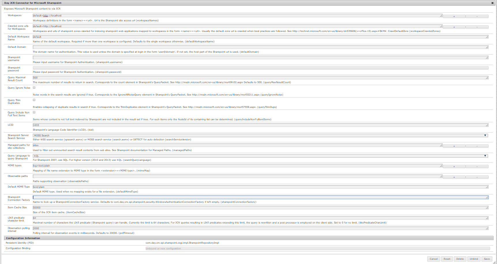
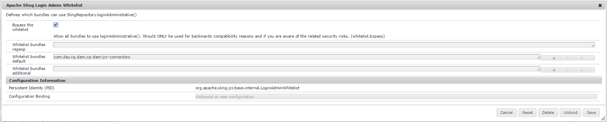

# Conector do SharePoint{#sharepoint-connector}

Este artigo inclui detalhes sobre o Adobe JCR Connector para Microsoft SharePoint 2010 e Microsoft SharePoint 2013, versão 4.0.

O conector SharePoint suporta as seguintes funcionalidades básicas:

* Lendo conteúdo e metadados do SharePoint.
* Confirmando as configurações de segurança do SharePoint para conteúdo acessado aplicando autenticação e autorização nativas do SharePoint
* Integração de conteúdo usando o Content Finder
* Uso de componentes AEM, como Recurso externo para exibir imagens e vídeos do SharePoint
* Sincronização do SharePoint com o AEM Assets

Todas as funcionalidades são implementadas usando os serviços Web nativos do SharePoint como interface para conteúdo e serviços do SharePoint.

>[!NOTE]
>
>O SharePoint Connector também é suportado com o AEM 6.1 service pack 2. O conector não suporta mais a montagem do repositório virtual e, portanto, não pode ser montado. Se você quiser acessar o repositório do Sharepoint usando APIs Java, use a implementação do repositório JCR do conector do Sharepoint no seu projeto.
>
>As operações de instalação, configuração, gerenciamento e TI do servidor SharePoint e da infraestrutura de TI relacionada estão fora do escopo deste documento. Consulte a documentação do fornecedor no [SharePoint](https://www.microsoft.com/sharepoint) para obter informações sobre esses tópicos. O conector exige que essas partes da infraestrutura sejam instaladas, configuradas e operadas corretamente.


## Introdução {#getting-started}

Para começar a usar o conector, faça o seguinte:

* Verifique se você tem pelo menos o Java 7 instalado.
* Baixe o arquivo de distribuição do pacote do conector na Distribuição de software.
* Copie um arquivo *license.properties* válido para o diretório que contém o arquivo *cq-quickstart-6.4.0.jar* .

* Clique/toque no duplo .jar para AEM de start ou start-o da linha de comando.
* Instale o pacote do conector do Gerenciador de pacotes.
* Configure as opções do conector.

## Instalação do conector do SharePoint {#installing-sharepoint-connector}

O conector é um pacote de conteúdo que facilita a instalação. Instale o pacote usando o Package Manager e defina o URL do servidor SharePoint e outras opções de configuração. O conteúdo do SharePoint está disponível no repositório AEM.

### Requisitos de instalação {#installation-requirements}

O conector exige o seguinte:

* Java Runtime Ambiente 1.7 ou posterior
* Serviços Web do SharePoint disponíveis através da rede
* URL do servidor SharePoint
* Credenciais e permissões do usuário para repositórios CRX e SharePoint
* [Plataformas suportadas](#supported-platforms)

O conector do SharePoint está disponível para download na Distribuição [de](https://experience.adobe.com/#/downloads/content/software-distribution/en/aem.html?package=/content/software-distribution/en/details.html/content/dam/aem/public/adobe/packages/cq630/featurepack/cq-6.3.0-featurepack-17673)software.

### Plataformas compatíveis {#supported-platforms}

O conector suporta o seguinte:

* AEM versões:

   * AEM 6.4, 6.3

* Versões do Microsoft SharePoint:

   * Microsoft Office SharePoint Server (MOSS) 2010
   * Microsoft Office SharePoint Server (MOSS) 2013

* Se você precisar de suporte para implantações personalizadas do conector (OEM, requisitos especiais, métodos de autenticação personalizados), entre em contato com o Adobe Office da sua região.

>[!NOTE]
>
>O conector só suporta configurações oficialmente suportadas pela Microsoft. Consulte os requisitos de sistema [MOSS 2010](https://technet.microsoft.com/en-us/library/cc262485(office.14).aspx) e [MOSS 2013](https://technet.microsoft.com/en-us/library/cc262485.aspx) .

### Instalação padrão {#standard-installation}

A Distribuição de software é usada para distribuir recursos do produto, exemplos e hot fixes. Para obter detalhes, consulte a documentação [de Distribuição de](https://experienceleague.adobe.com/docs/experience-cloud/software-distribution/home.html#software-distribution)software.


#### Integração com AEM {#integrating-with-aem}

Para instalar o pacote de conteúdo do conector.

1. Abra um ticket de suporte ao Adobe para solicitar o pacote de recursos do conector.
1. Baixe o pacote quando ele estiver disponível e abra o Package Manager para sua instância de AEM.
1. Toque/clique em **Instalar** na página de descrição do pacote.
1. Na caixa de diálogo **Instalar pacote** , toque/clique em **Instalar**.

   **Observação**: Verifique se você está conectado como administrador.

1. Quando o pacote estiver instalado, toque/clique em **Fechar**.

## Configuração do conector do SharePoint {#configuring-sharepoint-connector}

Depois de instalar o conector SharePoint, configure o aplicativo e as camadas do SharePoint para o conector.

Defina o URL do servidor SharePoint para tornar o repositório do SharePoint compatível com o JCR. Você pode definir parâmetros adicionais para configurar a conexão com o servidor SharePoint. Além disso, configure a autenticação com o conector do SharePoint.

### Configurar a conexão com o servidor SharePoint {#configuring-the-connection-with-the-sharepoint-server}

Para definir o URL do servidor SharePoint e as opções avançadas, execute estas etapas:

1. Navegue até o Console de Gerenciamento OSGi: [http://localhost:4502/system/console/configMgr](http://localhost:4502/system/console/configMgr).
1. Procure o conjunto **Day JCR Connector for Microsoft Sharepoint** .
1. Edite os valores de configuração.
1. Defina o URL do SharePoint Server como o valor de **Espaços de Trabalho**.
1. Tap/click **Save**.



Parâmetros de &#39;Espaços de trabalho&#39; e &#39;Nome padrão do espaço de trabalho&#39;:

Por padrão, o conector expõe uma única área de trabalho JCR. O servidor SharePoint exposto por esta área de trabalho é definido pelo parâmetro de configuração &#39;URL do SharePoint Server&#39;.

O conector também pode ser configurado para vários espaços de trabalho. Nesse caso, cada espaço de trabalho é associado ao URL do respectivo servidor SharePoint exposto pela área de trabalho. Para adicionar um espaço de trabalho, adicione uma definição de espaço de trabalho ao parâmetro Espaços de trabalho. Uma definição de espaço de trabalho tem o seguinte formato:
`<name>`= `<url>` onde`<name>` é o nome do espaço de trabalho JCR e`<url>` é o URL do servidor SharePoint para esse espaço de trabalho.

No AEM, execute mais uma etapa além das etapas de configuração acima. Lista de permissões o pacote &#39;**com.day.cq.dam.cq-dam-jcr-connectors**&#39;.

Para lista de permissões de pacotes no AEM, execute as seguintes etapas:

1. Navegue até o Console de Gerenciamento OSGi: http://localhost:4502/system/console/configMgr.
1. Procure o serviço &quot;Apache Sling Login Admin Whitelist&quot;.
1. Selecione **Ignorar a lista de permissões**.
1. Adicionar `com.day.cq.dam.cq-dam-jcr-connectors` em pacotes de lista de permissões padrão
1. Clique em Salvar.



>[!NOTE]
>
>Se você configurar vários espaços de trabalho, especifique o nome do espaço de trabalho padrão no parâmetro Nome padrão do espaço de trabalho.

Para obter informações adicionais sobre parâmetros relacionados à autenticação, consulte [Autenticação](/help/sites-administering/sharepoint-connector.md#configuring-authentication).

### Verificação da configuração do Sharepoint {#verifying-the-sharepoint-setup}

Depois de configurar o conector, verifique o seguinte:

* O SharePoint Server é executado e os serviços da Web estão acessíveis para a instância do conector
* As credenciais de usuário do SharePoint são válidas e o usuário tem as permissões necessárias do SharePoint
* O conector está instalado e configurado corretamente

### Configuração da sincronização DAM com o servidor SharePoint {#configuring-dam-sync-with-the-sharepoint-server}

Para sincronizar os ativos do SharePoint com AEM, execute as seguintes etapas:

1. Navegue até o Console de Gerenciamento OSGi: [http://localhost:4502/system/console/configMgr](http://localhost:4502/system/console/configMgr).
1. Procure o serviço &quot;Default DAMAssetSynchronization&quot;.
1. Edite os valores de configuração.
1. Defina o nome de usuário e a senha correspondente do usuário que tem acesso ao site do SharePoint.
1. Clique em Salvar.

Ative o serviço de sincronização DAM, que é desativado por padrão:

1. Navegue até Componentes do console da Web do OSGi: [http://localhost:4502/system/console/components](http://localhost:4502/system/console/components)
1. Procure &quot;com.day.cq.dam.jcrconnectors.impl.AssetSynchronizationService&quot;.
1. Clique em Ativar.

Como opção, você pode configurar o atraso de sincronização entre diferentes ciclos de sincronização:

1. Navegue até o Console de Gerenciamento OSGi: [http://localhost:4502/system/console/configMgr](http://localhost:4502/system/console/configMgr)
1. Procure &quot;DAY CQ DAM JCR Connector Asset Synchronization Service&quot; (Serviço de sincronização de ativos do conector JCR DAM DAY CQ).
1. Edite os valores de configuração.
1. Defina o valor do Período de sincronização (em segundos).
1. Clique em Salvar.

### Configuração da autenticação {#configuring-authentication}

O Sharepoint inclui os métodos de autenticação Classic e Claims Based, que são compatíveis com os seguintes tipos de autenticação:

* Básico
* Baseado na Forms

Em particular, estão disponíveis os seguintes tipos de autenticação:

* Classic-Basic
* Baseado no Classic-Forms
* Claims-Basic
* Baseado em solicitações da Forms

O AEM JCR Connector for Microsoft SharePoint 2010 e Microsoft SharePoint 2013, versão 4.0. suporta autenticação baseada em afirmações (sugerida pela Microsoft), que opera nos seguintes modos:

* **Autenticação** básica/NTLM: O conector primeiro tenta se conectar usando a autenticação básica. Se não estiver disponível, ele alterna para autenticação baseada em NTLM.
* **Autenticação** baseada em Forms: O Sharepoint valida os usuários com base nas credenciais que os usuários digitam em um formulário de logon (normalmente uma página da Web). O sistema emite um token para solicitações autenticadas que contém uma chave para restabelecer a identidade de solicitações subsequentes.

**Configuração da autenticação baseada no Forms**

Ir para: [http://localhost:4502/system/console/bundles](http://localhost:4502/system/console/bundles)

1. Clique em OSGI -> Configuração
1. Pesquise &quot;Conector Day JCR para Microsoft Sharepoint&quot;
1. Clique em &quot;Editar os valores de configuração&quot;
1. Defina o valor de &quot;Sharepoint Connection Fatory&quot; como &quot;com.day.crx.spi.share.security.FormsBasedAuthenticationConnectionFactory&quot;
1. Clique em **Salvar**.

**Configuração da autenticação básica (Windows)**

1. [Desative a autenticação](#disable-token-authentication)do token.
1. Vá para [http://localhost:4502/system/console/bundles](http://localhost:4502/system/console/bundles).
1. Clique em OSGI > Configuração.
1. Procure **Day JCR Connector for Microsoft Sharepoint**.
1. Clique em `Edit the configuration values`.
1. Defina o valor de Sharepoint Connection Fatory como `com.day.crx.spi.sharepoint.security.WindowsAuthenticationConnectionFactory`.
1. Clique em **Salvar**.

Somente um usuário autenticado no AEM e no SharePoint pode acessar o conteúdo do SharePoint por meio do conector.

Você também pode usar a extensão do conector para autenticação para criar um módulo de autenticação personalizado, que, por exemplo, mapeia o acesso de usuários AEM a usuários específicos do SharePoint. Crie usuários AEM correspondentes a usuários do SharePoint (o nome de usuário e a senha devem corresponder) para que possam ver o conteúdo do SharePoint mapeado para a instância do conector.

Para criar um usuário no AEM:

1. Faça logon em http://localhost:9502/with o usuário administrador.
1. Clique em Ferramentas.
1. Clique em Segurança.
1. Clique em Usuários.
1. Clique em **Criar usuário**.
1. Forneça a ID do usuário (o nome do usuário tem acesso ao SharePoint).
1. Forneça a senha correspondente.
1. Clique no símbolo de marca de verificação verde para criar o usuário.

Para adicionar o usuário ao grupo de administradores:

1. Vá para Administração de grupos.
1. Clique no nó &quot;a&quot;.
1. Clique em &quot;administradores&quot;.
1. Digite a ID do usuário criada acima na caixa de texto antes do botão **Procurar** .
1. Clique no símbolo de marca de verificação verde para adicionar o usuário ao grupo administrativo.

### Desativar autenticação de token {#disable-token-authentication}

1. Baixe e instale o pacote `basic auth`. `zip` da Distribuição de software.

1. Feche o Início Rápido.
1. Abra o arquivo *\crx-quickstart\repository\repository.xml*.
1. Encontre a tag `<LoginModule class="com.day.crx.core.CRXLoginModule"> ... </LoginModule>.`
1. Insira a tag `<param name="disableTokenAuth" value="true"/>` dentro da tag mencionada na etapa 4.
1. Salve e feche o arquivo xml.
1. Reinicie o QuickStart e faça logon com suas credenciais.

#### Suporte a diferentes métodos de autenticação do servidor SharePoint {#supporting-different-authentication-methods-of-the-sharepoint-server}

Na versão padrão, o conector suporta a autenticação padrão do IIS **Windows** (Básica) e a autenticação baseada em Forms (baseada em token). Os [outros métodos](https://technet.microsoft.com/en-us/library/cc262350.aspx#section2) de autenticação podem ser suportados pelo mecanismo de extensibilidade.

As etapas a seguir fornecem orientações sobre a extensão da autenticação padrão para suportar vários métodos de autenticação do servidor SharePoint:

1. Implemente `com.day.crx.spi.sharepoint.security.SharepointConnectionFactory` para lidar com o lado do cliente do processo de autenticação específico.
1. Instale a `SharepointConnectionFactory` implementação como um pacote de fragmentos com o host do fragmento `com.day.crx.spi.crx2sharepoint-bundle`.

   Ao usar o Maven, adapte a seguinte configuração do `maven-bundle-plugin` para os requisitos do seu projeto:

   ```xml
              <plugin>
                  <groupId>org.apache.felix</groupId>
                  <artifactId>maven-bundle-plugin</artifactId>
                  <extensions>true</extensions>
                  <configuration>
                      <instructions>
                          <Export-Package />
                          <Private-Package>
                              <!-- your private package here -->
                          </Private-Package>
                          <Fragment-Host>
                              com.day.crx.spi.crx2sharepoint-bundle
                          </Fragment-Host>
                       </instructions>
                  </configuration>
              </plugin>
   ```

1. Registre a `SharepointConnectionFactory` implementação na configuração do conector. Na janela de configuração do conector, clique em Opções **** avançadas. No campo For **Sharepoint Connection Fatory** , especifique o nome da implementação `com.day.crx.spi.sharepoint.auth.CustomConnectionFactory`.

1. Reinicie o conector.

