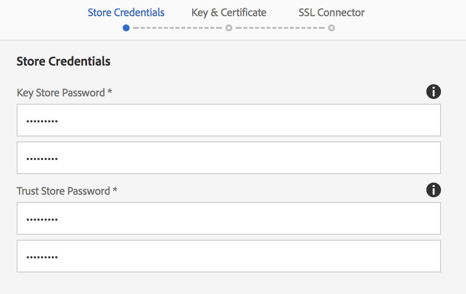

# SSL por padrão{#ssl-by-default}

Em um esforço para melhorar continuamente a segurança do AEM, o Adobe introduziu um recurso chamado SSL por padrão. O objetivo é incentivar o uso de HTTPS para se conectar a instâncias AEM.

## Ativar SSL por padrão {#enabling-ssl-by-default}

Você pode começar a configurar o SSL por padrão clicando na mensagem da Caixa de entrada relevante na tela inicial do AEM. Para acessar a Caixa de entrada, pressione o ícone do sino no canto superior direito da tela. Em seguida, clique em **Exibir todos**. Isso exibirá uma lista de todos os alertas pedidos em uma exibição de lista.

Na lista, selecione e abra o **Configurar HTTPS** alerta:


>[!NOTE]
>
>Se a variável **Configurar HTTPS** não estiver presente na Caixa de entrada, você pode navegar diretamente para o Assistente HTTPS acessando *<http://serveraddress:serverport/libs/granite/security/content/sslConfig.html?item=configuration%2fconfiguressl&_charset_=utf-8>*

Um usuário de serviço chamado **ssl-service** O foi criado para este recurso. Depois de abrir o alerta, você será guiado pelo seguinte assistente de configuração:

1. Primeiro, configure as Credenciais da Loja. Essas são as credenciais para a variável **ssl-service** armazenamento de chaves do usuário do sistema que conterá a chave privada e o armazenamento de confiança do ouvinte HTTPS.

   

1. Depois de inserir as credenciais, clique em **Próximo** no canto superior direito da página. Em seguida, carregue a chave privada associada e o certificado para a conexão SSL.

   

   >[!NOTE]
   >
   >Para obter informações sobre como gerar uma chave privada e um certificado para usar com o assistente, consulte [este procedimento](/help/sites-administering/ssl-by-default.md#generating-a-private-key-certificate-pair-to-use-with-the-wizard) abaixo.

1. Por fim, especifique o nome de host HTTPS e a porta TCP do ouvinte HTTPS.

   

## Automatizando SSL por padrão {#automating-ssl-by-default}

Há três maneiras de automatizar o SSL por padrão.

### Via HTTP POST {#via-http-post}

O primeiro método envolve publicar no servidor SSLSetup que está sendo usado pelo assistente de configuração:

```shell
POST /libs/granite/security/post/sslSetup.html
```

Você pode usar a seguinte carga no POST para automatizar a configuração:

```xml
------WebKitFormBoundaryyBO4ArmGlcfdGDbs
Content-Disposition: form-data; name="keystorePassword"

test
------WebKitFormBoundaryyBO4ArmGlcfdGDbs
Content-Disposition: form-data; name="keystorePasswordConfirm"
test
------WebKitFormBoundaryyBO4ArmGlcfdGDbs
Content-Disposition: form-data; name="truststorePassword"
test
------WebKitFormBoundaryyBO4ArmGlcfdGDbs
Content-Disposition: form-data; name="truststorePasswordConfirm"
test
------WebKitFormBoundaryyBO4ArmGlcfdGDbs
Content-Disposition: form-data; name="privatekeyFile"; filename="server.der"
Content-Type: application/x-x509-ca-cert

------WebKitFormBoundaryyBO4ArmGlcfdGDbs
Content-Disposition: form-data; name="certificateFile"; filename="server.crt"
Content-Type: application/x-x509-ca-cert

------WebKitFormBoundaryyBO4ArmGlcfdGDbs
Content-Disposition: form-data; name="httpsPort"
8443
```

O servlet, como qualquer sling POST servlet, responderá com 200 OK ou um código de status HTTP de erro. Você pode encontrar detalhes sobre o status no corpo do HTML da resposta.

Abaixo estão exemplos de resposta bem-sucedida e de erro.

**EXEMPLO DE SUCESSO** (status = 200):

```xml
<!DOCTYPE html>
<html lang='en'>
<head>
<title>OK</title>
</head>
<body>
<h1>OK</h1>
<dl>
<dt class='foundation-form-response-status-code'>Status</dt>
<dd>200</dd>
<dt class='foundation-form-response-status-message'>Message</dt>
<dd>SSL successfully configured</dd>
<dt class='foundation-form-response-title'>Title</dt>
<dd>OK</dd>
<dt class='foundation-form-response-description'>Description</dt>
<dd>HTTPS has been configured on port 8443. The private key and
certificate were stored in the key store of the user ssl-service.
Please take note of the key store password you provided. You will need
it for any subsequent updating of the private key or certificate.</dd>
</dl>
<h2>Links</h2>
<ul class='foundation-form-response-links'>
<li><a class='foundation-form-response-redirect' href='/'>Done</a></li>
</ul>
</body>
</html>
```

**EXEMPLO DE ERRO** (status = 500):

```xml
<!DOCTYPE html>
<html lang='en'>
<head>
<title>Error</title>
</head>
<body>
<h1>Error</h1>
<dl>
<dt class='foundation-form-response-status-code'>Status</dt>
<dd>500</dd>
<dt class='foundation-form-response-status-message'>Message</dt>
<dd>The provided file is not a valid key, DER format expected</dd>
<dt class='foundation-form-response-title'>Title</dt>
<dd>Error</dd>
</dl>
</body>
</html>
```

### Via Pacote {#via-package}

Como alternativa, você pode automatizar a configuração do SSL carregando um pacote que já contém estes itens necessários:

* O repositório de chaves do usuário do serviço ssl. Está localizado em */home/users/system/security/ssl-service/keystore* no repositório.
* O `GraniteSslConnectorFactory` configuração

### Gerar um par de chave privada/certificado para usar com o assistente {#generating-a-private-key-certificate-pair-to-use-with-the-wizard}

Abaixo você encontrará um exemplo para criar um certificado autoassinado no formato DER que o Assistente SSL pode usar. Instale o OpenSSL com base no sistema operacional, abra o prompt de comando OpenSSL e altere o diretório para a pasta onde deseja gerar a Chave/Certificado Privado.

>[!NOTE]
>
>O uso de um certificado autoassinado é apenas para fins de exemplo e não deve ser usado na produção.

1. Primeiro, crie a chave privada:

   ```shell
   openssl genrsa -aes256 -out localhostprivate.key 4096
   openssl rsa -in localhostprivate.key -out localhostprivate.key
   ```

1. Em seguida, gere uma solicitação de assinatura de certificado (CSR) usando a chave privada:

   ```shell
   openssl req -sha256 -new -key localhostprivate.key -out localhost.csr -subj "/CN=localhost"
   ```

1. Gere o certificado SSL e assine-o com a chave privada. Neste exemplo, expirará um ano a partir de agora:

   ```shell
   openssl x509 -req -days 365 -in localhost.csr -signkey localhostprivate.key -out localhost.crt
   ```

Converta a Chave privada no formato DER. Isso ocorre porque o assistente SSL requer que a chave esteja no formato DER:

```shell
openssl pkcs8 -topk8 -inform PEM -outform DER -in localhostprivate.key -out localhostprivate.der -nocrypt
```

Finalmente, faça upload do **localhostprivate.der** como a Chave privada e **localhost.crt** como o certificado SSL na etapa 2 do assistente gráfico SSL descrito no início desta página.

### Atualização da configuração SSL via cURL {#updating-the-ssl-configuration-via-curl}

>[!NOTE]
>
>Consulte [Uso do cURL com AEM](https://helpx.adobe.com/experience-manager/6-4/sites/administering/using/curl.html) para obter uma lista centralizada de comandos cURL úteis no AEM.

Você também pode automatizar a configuração SSL usando a ferramenta cURL. Você pode fazer isso ao postar os parâmetros de configuração neste URL:

*https://&lt;serveraddress>:&lt;serverport>/libs/granite/security/post/sslSetup.html*

Abaixo estão os parâmetros que você pode usar para alterar as várias configurações no assistente de configuração:

* `-F "keystorePassword=password"` - a senha do repositório de chaves;

* `-F "keystorePasswordConfirm=password"` - confirme a senha do armazenamento de chaves;

* `-F "truststorePassword=password"` - a senha do truststore;

* `-F "truststorePasswordConfirm=password"` - confirme a senha do truststore;

* `-F "privatekeyFile=@localhostprivate.der"` - especificar a chave privada;

* `-F "certificateFile=@localhost.crt"` - especificar o certificado;

* `-F "httpsHostname=host.example.com"`- especificar o nome do host;
* `-F "httpsPort=8443"` - a porta em que o ouvinte HTTPS funcionará.

>[!NOTE]
>
>A maneira mais rápida de executar o cURL para automatizar a configuração SSL é a partir da pasta onde estão os arquivos DER e CRT. Como alternativa, você pode especificar o caminho completo na variável `privatekeyFile` e argumentos certificateFile.
>
>Também é necessário ser autenticado para executar a atualização. Portanto, anexe o comando cURL com a função `-u user:passeword` parâmetro.
>
>Um comando cURL post correto deve ser semelhante a:

```shell
curl -u user:password -F "keystorePassword=password" -F "keystorePasswordConfirm=password" -F "truststorePassword=password" -F "truststorePasswordConfirm=password" -F "privatekeyFile=@localhostprivate.der" -F "certificateFile=@localhost.crt" -F "httpsHostname=host.example.com" -F "httpsPort=8443" https://host:port/libs/granite/security/post/sslSetup.html
```

#### Vários certificados usando cURL {#multiple-certificates-using-curl}

Você pode enviar ao servlet uma cadeia de certificados repetindo o parâmetro certificateFile desta forma:

`-F "certificateFile=@root.crt" -F "certificateFile=@localhost.crt"..`

Depois de executar o comando, verifique se todos os certificados foram feitos no keystore. Verifique o armazenamento de chaves de:
[http://localhost:4502/libs/granite/security/content/userEditor.html/home/users/system/security/ssl-service](http://localhost:4502/libs/granite/security/content/userEditor.html/home/users/system/security/ssl-service)
