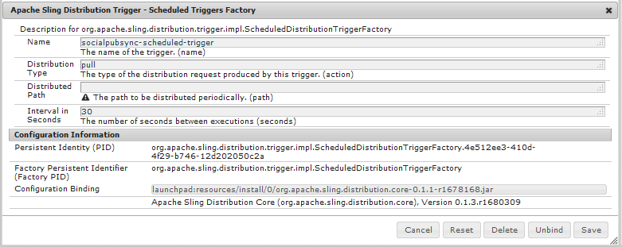

# Sincronização do usuário{#user-synchronization}

## Introdução {#introduction}

Quando a implantação é um farm [de](/help/sites-deploying/recommended-deploys.md#tarmk-farm)publicação, os membros precisam fazer logon e ver seus dados em qualquer nó de publicação.

Usuários e grupos de usuários (dados de usuário) criados no ambiente publish não são necessários no ambiente author.

A maioria dos dados do usuário criados no ambiente do autor deve permanecer no ambiente do autor e não ser copiada para publicar instâncias.

O registro e as modificações feitas em uma instância de publicação precisam ser sincronizados com outras instâncias de publicação para que elas tenham acesso aos mesmos dados do usuário.

A partir do AEM 6.1, quando a sincronização do usuário estiver ativada, os dados do usuário serão sincronizados automaticamente entre as instâncias de publicação no farm e não serão criados no autor.

## Distribuição Sling {#sling-distribution}

Os dados do usuário, juntamente com suas [ACLs](/help/sites-administering/security.md), são armazenados no [Oak Core](/help/sites-deploying/platform.md), a camada abaixo de Oak JCR, e são acessados usando a API [](https://helpx.adobe.com/experience-manager/6-5/sites/developing/using/reference-materials/javadoc/org/apache/jackrabbit/oak/api/package-tree.html)Oak. Com atualizações raras, é razoável que os dados do usuário sejam sincronizados com outras instâncias de publicação usando a Distribuição [de conteúdo](https://github.com/apache/sling/blob/trunk/contrib/extensions/distribution/README.md) Sling (distribuição Sling).

Os benefícios da sincronização do usuário usando a distribuição Sling, em comparação com a replicação tradicional são:

* *usuários*, perfis *de* usuários e grupos *de* usuários criados na publicação não são criados no autor

* A distribuição Sling define propriedades em eventos jcr, possibilitando a ação de ouvintes de eventos do lado da publicação sem preocupação com loops de replicação infinitos
* A distribuição Sling envia somente dados do usuário para instâncias de publicação não originárias, eliminando tráfego desnecessário
* [As ACLs](/help/sites-administering/security.md) definidas no nó do usuário são incluídas na sincronização

>[!NOTE]
>
>Se as sessões forem necessárias, é recomendável usar uma solução SSO ou usar uma sessão aderente e fazer com que os clientes façam logon se mudarem para outro editor.

>[!CAUTION]
>
>A sincronização do grupo de ***administradores*** não é suportada, mesmo quando a sincronização do usuário está ativada. Em vez disso, uma falha ao &quot;importar o diff&quot; será registrada no registro de erros.
>
>Portanto, quando a implantação é um farm de publicação, se um usuário for adicionado ou removido do grupo ***administradores** , a modificação deverá ser feita manualmente em cada instância de publicação.

## Ativar sincronização de usuário {#enable-user-sync}

>[!NOTE]
>
>Por padrão, a sincronização do usuário é `disabled`.
>
>A ativação da sincronização do usuário envolve a modificação das configurações *existentes* do OSGi.
>
>Nenhuma nova configuração deve ser adicionada como resultado da ativação da sincronização do usuário.

A sincronização do usuário depende do ambiente do autor para gerenciar as distribuições de dados do usuário, mesmo que os dados do usuário não sejam criados no autor. Grande parte, mas não toda, da configuração acontece no ambiente do autor e cada etapa identifica claramente se ela deve ser executada no autor ou publicação.

Veja a seguir as etapas necessárias para habilitar a sincronização do usuário, seguidas por uma seção [Solução de problemas](#troubleshooting) :

### Pré-requisitos {#prerequisites}

1. Se usuários e grupos de usuários já tiverem sido criados em um editor, é recomendável sincronizar [](#manually-syncing-users-and-user-groups) manualmente os dados do usuário com todos os editores antes de configurar e ativar a sincronização do usuário.

Quando a sincronização do usuário estiver ativada, somente os usuários e grupos recém-criados serão sincronizados.

1. Verifique se o código mais recente foi instalado:

* [Atualizações da plataforma AEM](https://helpx.adobe.com/experience-manager/kb/aem62-available-hotfixes.html)
* [Atualizações do AEM Communities](/help/communities/deploy-communities.md#latestfeaturepack)

### 1. Apache Sling Distribution Agent - Fábrica de agentes de sincronização {#apache-sling-distribution-agent-sync-agents-factory}

**Ativar sincronização de usuário**

* **sobre o autor**

   * fazer logon com privilégios de administrador
   * acessar o console [da Web](/help/sites-deploying/configuring-osgi.md)

      * por exemplo, [https://localhost:4502/system/console/configMgr](https://localhost:4502/system/console/configMgr)
   * location `Apache Sling Distribution Agent - Sync Agents Factory`

      * selecione a configuração existente para abrir para edição (ícone de lápis)Verificar `name`: **`socialpubsync`**

      * marcar a `Enabled` caixa de seleção
      * select `Save`


### 2. Criar usuário autorizado {#createauthuser}

**Configurar permissões** Este usuário autorizado será usado na etapa 3 para configurar a distribuição Sling no autor.

* **em cada instância de publicação**

   * fazer logon com privilégios de administrador
   * acessar o Console [de segurança](/help/sites-administering/security.md)

      * por exemplo, [https://localhost:4503/useradmin](https://localhost:4503/useradmin)
   * criar um novo usuário

      * for example, `usersync-admin`
   * add this user to the **`administrators`** user group
   * [adicionar ACL para este usuário em /home](#howtoaddacl)

      * `Allow jcr:all` com restrição `rep:glob=*/activities/*`


>[!CAUTION]
>
>Um novo usuário deve ser criado.
>
>* O usuário padrão atribuído é **`admin`**.
>* Não utilize `communities-user-admin user.`
>


#### Como adicionar ACL {#addacls}

* acessar CRXDE Lite

   * por exemplo, [https://localhost:4503/crx/de](https://localhost:4503/crx/de)

* selecionar `/home` nó
* no painel direito, selecione a `Access Control` guia
* selecione o `+` botão para adicionar uma entrada ACL

   * **Principal**: *pesquisar usuário criado para sincronização do usuário*
   * **Tipo**: `Allow`
   * **Privilégios**: `jcr:all`
   * **Restrições** rep:global: `*/activities/*`
   * selecione **OK**

* selecione **Salvar tudo**


Consulte também:

* [Gerenciamento de direitos de acesso](/help/sites-administering/user-group-ac-admin.md#access-right-management)
* Seção Solução de problemas [Modificar Exceção da Operação Durante o Processamento](#modify-operation-exception-during-response-processing)da Resposta.

### 3. Credenciais de Transporte de Distribuição do Apache Sling - Credenciais de Usuário baseadas em DistributionTransportSecretProvider {#adobegraniteencpasswrd}

**Configurar permissões**

Depois que um usuário autorizado, um membro do grupo de usuários **`administrators`**s, for criado em todas as instâncias de publicação, esse usuário autorizado deverá ser identificado como tendo permissão para sincronizar os dados do usuário do autor para publicar.

* **sobre o autor**

   * fazer logon com privilégios de administrador
   * acessar o console [da Web](/help/sites-deploying/configuring-osgi.md)

      * por exemplo, [https://localhost:4502/system/console/configMgr](https://localhost:4502/system/console/configMgr)
   * location `Apache Sling Distribution Transport Credentials - User Credentials based DistributionTransportSecretProvider`
   * selecione a configuração existente para abrir para edição (ícone de lápis)Verificar `property name`: **`socialpubsync-publishUser`**

   * defina o nome de usuário e a senha para o usuário [](#createauthuser) autorizado criado ao publicar na etapa 2

      * for example, `usersync-admin`


### 4. Apache Sling Distribution Agent - Fábrica de agentes da fila {#apache-sling-distribution-agent-queue-agents-factory}

**Ativar sincronização de usuário**

* **ao publicar**:

   * fazer logon com privilégios de administrador
   * acessar o console [da Web](/help/sites-deploying/configuring-osgi.md)

      * por exemplo, [https://localhost:4503/system/console/configMgr](https://localhost:4503/system/console/configMgr)
   * location `Apache Sling Distribution Agent - Queue Agents Factory`

      * selecione a configuração existente para abrir para edição (ícone de lápis)Verificar `Name`: `socialpubsync-reverse`

      * marcar a `Enabled` caixa de seleção
      * select `Save`
   * **repetir **para cada instância de publicação


### 5. Adobe Social Sync - Fábrica de Observadores Diff {#diffobserver}

**Ativar sincronização de grupos**

* **em cada instância** de publicação:

   * fazer logon com privilégios de administrador
   * acessar o console [da Web](/help/sites-deploying/configuring-osgi.md)

      * por exemplo, [https://localhost:4503/system/console/configMgr](https://localhost:4503/system/console/configMgr)
   * location **`Adobe Social Sync - Diff Observer Factory`**

      * selecione a configuração existente para abrir para edição (ícone de lápis)

         Verificar `agent name`: `socialpubsync-reverse`

      * marcar a `Enabled` caixa de seleção
      * select `Save`


### 6. Apache Sling Distribution Trigger - Fábrica de Acionadores Programados {#apache-sling-distribution-trigger-scheduled-triggers-factory}

**(Opcional) modificar o intervalo de polling**

Por padrão, o autor pesquisará as alterações a cada 30 segundos. Para alterar esse intervalo:

* **sobre o autor**

   * fazer logon com privilégios de administrador
   * acessar o console [da Web](/help/sites-deploying/configuring-osgi.md)

      * por exemplo, [https://localhost:4502/system/console/configMgr](https://localhost:4502/system/console/configMgr)
   * location `Apache Sling Distribution Trigger - Scheduled Triggers Factory`

      * selecione a configuração existente para abrir para edição (ícone de lápis)

         * Verificar `Name`: `socialpubsync-scheduled-trigger`
      * definir o intervalo `Interval in Seconds` para o intervalo desejado
      * select `Save`




## Configurar para várias instâncias de publicação {#configure-for-multiple-publish-instances}

A configuração padrão é para uma única instância de publicação. Como o motivo para ativar a sincronização do usuário é para sincronizar várias instâncias de publicação, como para um farm de publicação, as instâncias de publicação adicionais precisarão ser adicionadas à Fábrica de agentes de sincronização.

### 7. Apache Sling Distribution Agent - Fábrica de agentes de sincronização {#apache-sling-distribution-agent-sync-agents-factory-1}

**Adicionar instâncias de publicação:**

* **sobre o autor**

   * fazer logon com privilégios de administrador
   * acessar o console [da Web](/help/sites-deploying/configuring-osgi.md)

      * por exemplo, [https://localhost:4502/system/console/configMgr](https://localhost:4502/system/console/configMgr)
   * location `Apache Sling Distribution Agent - Sync Agents Factory`

      * selecione a configuração existente para abrir para edição (ícone de lápis)Verificar `Name`: `socialpubsync`


* **Extremidades do exportador** Deve haver um terminal de exportador para cada editor. Por exemplo, se houver 2 editores, localhost:4503 e 4504, deve haver 2 entradas:

   * `https://localhost:4503/libs/sling/distribution/services/exporters/socialpubsync-reverse`
   * `https://localhost:4504/libs/sling/distribution/services/exporters/socialpubsync-reverse`

* **Pontos de extremidade** do importador Deve haver um ponto de extremidade do importador para cada editor. Por exemplo, se houver 2 editores, localhost:4503 e 4504, deve haver 2 entradas:

   * `https://localhost:4503/libs/sling/distribution/services/importers/socialpubsync`
   * `https://localhost:4504/libs/sling/distribution/services/importers/socialpubsync`

* select `Save`

### 8. Ouvinte de sincronização de usuário do AEM Communities {#aem-communities-user-sync-listener}

**(Opcional) Sincronizar nós JCR adicionais**

Se houver dados personalizados que serão sincronizados em várias instâncias de publicação, então:

* **em cada instância** de publicação:

   * fazer logon com privilégios de administrador
   * acessar o console [da Web](/help/sites-deploying/configuring-osgi.md)

      * for example, `https://localhost:4503/system/console/configMgr`
   * location `AEM Communities User Sync Listener`
   * selecione a configuração existente para abrir para edição (ícone de lápis)Verificar `Name`: `socialpubsync-scheduled-trigger`


* **Tipos**de nó Essa é a lista de tipos de nó que serão sincronizados. Qualquer tipo de nó diferente de sling:Folder precisa ser listado aqui (sling:folder é manipulado separadamente).
lista padrão de tipos de nó a sincronizar:

   * rep:User
   * nt:unstructured
   * nt:resource

* **Propriedades**ignoráveisEssa é a lista de propriedades que serão ignoradas se qualquer alteração for detectada. As alterações nessas propriedades podem ser sincronizadas como um efeito colateral de outras alterações (já que a sincronização está sempre no nível do nó), mas as alterações nessas propriedades não acionarão a sincronização por si só.
Propriedade padrão a ser ignorada:

   * cq:lastModified

* **Subcaminhos de nós**ignoráveis que serão totalmente ignorados durante a sincronização. Nada nesses subcaminhos será sincronizado a qualquer momento.
Nós padrão a serem ignorados:

   * .tokens
   * sistema

* **Pastas**distribuídas A maioria das pastas:são ignoradas porque a sincronização não é necessária. As poucas exceções estão listadas aqui.
Pastas padrão para sincronizar

   * segmentos/pontuação
   * social/relações
   * atividades

### 9. ID de Sling exclusiva {#unique-sling-id}

>[!CAUTION]
>
>Se a Sling ID corresponder entre duas ou mais instâncias de publicação, a sincronização do grupo de usuários falhará.

Se a Sling ID for a mesma para várias instâncias de publicação em um farm de publicação, os grupos de usuários não serão sincronizados.

Para validar se todos os valores de ID de Sling diferem, em cada instância de publicação:

1. navegar até `http://<host>:<port>/system/console/status-slingsettings`
1. verifique o valor da **Sling ID**


Se a Sling ID de uma instância de publicação corresponder à Sling ID de qualquer outra instância de publicação, então:

1. parar uma das instâncias de publicação com uma ID de Sling correspondente
1. no diretório crx-quickstart/launch/felix

   * procure e exclua o arquivo chamado *sling.id.file*

      * por exemplo, em um sistema Linux:
         `rm -i $(find . -type f -name sling.id.file)`

      * por exemplo, em um sistema Windows:
         `use windows explorer and search for *sling.id.file*`

1. start da instância de publicação

   * na inicialização, ele receberá uma nova ID de Sling

1. validar que a **Sling ID** agora é exclusiva

Repita essas etapas até que todas as instâncias de publicação tenham uma Sling ID exclusiva.

## Fábrica do Criador de pacotes Vault {#vault-package-builder-factory}

Para que as atualizações sejam sincronizadas corretamente, é necessário modificar o construtor de pacote do cofre para sincronização do usuário:

* em cada instância de publicação do AEM
* acessar o console [da Web](/help/sites-deploying/configuring-osgi.md)

   * por exemplo, [https://localhost:4503/system/console/configMgr](https://localhost:4503/system/console/configMgr)

* localize a variável `Apache Sling Distribution Packaging - Vault Package Builder Factory`

   * `Builder name: socialpubsync-vlt`

* selecione o ícone de edição
* adicione dois `Package Node Filters`:

   * `/home/users|-.*/.tokens`
   * `/home/users|-.*/rep:cache`

* tratamento de políticas:

   * para substituir os nós rep existentes:policy por novos, adicione um terceiro Filtro de Pacote:

      * `/home/users|+.*/rep:policy`
   * para impedir que as políticas sejam distribuídas, defina

      * `Acl Handling:` `IGNORE`


## O Que Acontece Quando... {#what-happens-when}

### Perfil de Autoinscrição ou edição do usuário na publicação {#user-self-registers-or-edits-profile-on-publish}

Por padrão, os usuários e perfis criados no ambiente de publicação (autoinscrição) não aparecem no ambiente do autor.

Quando a topologia é um farm [de](/help/sites-deploying/recommended-deploys.md#tarmk-farm) publicação e a sincronização do usuário foi configurada corretamente, o *usuário *e o perfil *do* usuário são sincronizados no farm de publicação usando a distribuição Sling.

### Usuários ou grupos de usuários são criados usando o console de segurança {#users-or-user-groups-are-created-using-security-console}

Por padrão, os dados do usuário criados no ambiente de publicação não aparecem no ambiente do autor e vice-versa.

Quando o console Administração e segurança [do](/help/sites-administering/security.md) usuário for usado para adicionar novos usuários ao ambiente de publicação, a sincronização do usuário sincronizará os novos usuários e sua associação de grupo com outras instâncias de publicação, se necessário. A sincronização do usuário também sincronizará os grupos de usuários criados por meio do console de segurança.

## Resolução de Problemas{#troubleshooting}

### Como colocar a sincronização do usuário offline {#how-to-take-user-sync-offline}

Para colocar a sincronização do usuário offline, para [remover um editor](#how-to-remove-a-publisher) ou sincronizar dados [](#manually-syncing-users-and-user-groups)manualmente, a fila de distribuição deve estar vazia e silenciosa.

Para verificar o estado da fila de distribuição:

* sobre o autor:

   * usando o [CRXDE Lite](/help/sites-developing/developing-with-crxde-lite.md)

      * procurar entradas em `/var/sling/distribution/packages`

         * nós de pasta nomeados com o padrão `distrpackage_*`
   * usando o Gerenciador [de pacotes](/help/sites-administering/package-manager.md)

      * procurar pacotes pendentes (ainda não instalados)

         * nomeado com o padrão `socialpubsync-vlt*`
         * created by `communities-user-admin`


Quando a fila de distribuição estiver vazia, desative a sincronização do usuário:

* sobre o autor

   * *desmarque a caixa de `Enabled` [seleção Apache Sling Distribution Agent - Fábrica de agentes de sincronização](#apache-sling-distribution-agent-sync-agents-factory)

Após a conclusão do tarefa, para reativar a sincronização do usuário:

* sobre o autor

   * marque a `Enabled` caixa de seleção do [Apache Sling Distribution Agent - Sync Agents Fatory](#apache-sling-distribution-agent-sync-agents-factory)

### Diagnóstico de sincronização de usuário {#user-sync-diagnostics}

O Diagnóstico de sincronização do usuário é uma ferramenta que verifica a configuração e tenta identificar qualquer problema.

Em autor, basta navegar do console principal por meio de **Ferramentas, Operações, Diagnóstico, Diagnóstico de sincronização do usuário.**

Basta entrar no console Diagnóstico de sincronização do usuário para exibir os resultados.

Isso é o que é exibido quando a Sincronização do usuário não está ativada:


#### Como executar o diagnóstico para editores {#how-to-run-diagnostics-for-publishers}

Quando o diagnóstico é executado a partir do ambiente do autor, os resultados de aprovação/falha incluirão uma seção [INFO] exibindo a lista de instâncias de publicação configuradas para confirmação.

Incluído na lista, há um URL para cada instância de publicação que executará o diagnóstico para essa instância. O parâmetro url `syncUser` é anexado ao URL de diagnóstico com seu valor definido para o usuário *de sincronização* autorizado criado na [Etapa 2](#createauthuser).

**Observação**: antes de iniciar o URL, o usuário *de sincronização* autorizado já deve estar conectado a essa instância de publicação.


### Configuração adicionada incorretamente {#configuration-improperly-added}

Quando a sincronização do usuário falha, o problema mais comum é que configurações adicionais foram *adicionadas*. Em vez disso, a *configuração *padrão existente deve ter sido *editada*.

Veja a seguir visualizações de como as configurações padrão editadas devem aparecer no console da Web. Se mais de uma instância for exibida, a configuração adicionada deverá ser removida.

#### (autor) One Apache Sling Distribution Agent - Sync Agents Fatory {#author-one-apache-sling-distribution-agent-sync-agents-factory}


#### (autor) One Apache Sling Distribution Transport Credentials - Credenciais do usuário baseadas em DistributionTransportSecretProvider {#author-one-apache-sling-distribution-transport-credentials-user-credentials-based-distributiontransportsecretprovider}


#### (publicar) Um agente de distribuição Apache Sling - Fábrica de agentes de fila {#publish-one-apache-sling-distribution-agent-queue-agents-factory}


#### (publicar) Uma sincronização do Adobe Social - Fábrica de Observadores Diff {#publish-one-adobe-social-sync-diff-observer-factory}


#### (autor) Um Apache Sling Distribution Trigger - Fábrica de Acionadores Programados {#author-one-apache-sling-distribution-trigger-scheduled-triggers-factory}


### Modificar Exceção de Operação Durante Processamento de Resposta {#modify-operation-exception-during-response-processing}

Se o seguinte estiver visível no registro:

`org.apache.sling.servlets.post.impl.operations.ModifyOperation Exception during response processing.`

`java.lang.IllegalStateException: This tree does not exist`

Em seguida, verifique se a seção [2. Criar usuário](#createauthuser) autorizado foi seguido corretamente.

Esta seção descreve a criação de um usuário autorizado, que existe em todas as instâncias de publicação e a identificação deles na configuração OSGi do &#39;Provedor secreto&#39; no autor. By default, the user is `admin`.

O usuário autorizado deve se tornar um membro do grupo de **`administrators`** usuários e as permissões desse grupo não devem ser alteradas.

O usuário autorizado deve ter explicitamente os seguintes privilégios e restrições em todas as instâncias de publicação:

| **path** | **jcr:all** | **rep:global** |
|---|---|---|
| /home | X | */atividades/* |
| /home/users | X | */atividades/* |
| /home/groups | X | */atividades/* |

Como membro do `administrators` grupo, o usuário autorizado deve ter os seguintes privilégios em todas as instâncias de publicação:

| **path** | **jcr:all** | **jcr:read** | **rep:write** |
|---|---|---|---|
| /etc/packages/sling/distribution |  |  | X |
| /libs/sling/distribution |  | X |  |
| /var |  |  | X |
| /var/eventing |  | X | X |
| /var/sling/distribution |  | X | X |

### Falha na Sincronização do Grupo de Usuários {#user-group-sync-failed}

Se a Sling ID corresponder entre duas ou mais instâncias de publicação, a sincronização do grupo de usuários falhará.

Ver seção [9. ID de Sling exclusiva](#unique-sling-id)

### Sincronização manual de usuários e grupos de usuários {#manually-syncing-users-and-user-groups}

* no editor em que os usuários e grupos de usuários existem:

   * [se ativado, desabilitar a sincronização do usuário](#how-to-take-user-sync-offline)
   * [criar um pacote](/help/sites-administering/package-manager.md#creating-a-new-package) de `/home`

      * ao editar o pacote

         * guia Filtros: Adicionar filtro: Caminho raiz: `/home`
         * Guia Avançado: Manuseio de CA: `Overwrite`
   * [exportar o pacote](/help/sites-administering/package-manager.md#downloading-packages-to-your-file-system)


* em outras instâncias de publicação:

   * [importar o pacote](/help/sites-administering/package-manager.md#installing-packages)

Para configurar ou ativar a sincronização do usuário, vá para a etapa 1: Apache Sling Distribution Agent - Fábrica de agentes de sincronização [](#apache-sling-distribution-agent-sync-agents-factory)

### Quando um editor fica indisponível {#when-a-publisher-becomes-unavailable}

Quando uma instância de publicação ficar indisponível, ela não deverá ser removida se estiver novamente online no futuro. As alterações serão colocadas em fila para o editor e, uma vez que estejam novamente online, as alterações serão processadas.

Se a instância de publicação nunca mais estiver on-line, se estiver off-line permanentemente, ela deverá ser removida, pois a construção da fila resultará no uso notável de espaço em disco no ambiente do autor.

Quando um editor estiver inativo, o registro do autor terá exceções semelhantes a:

```
28.01.2016 15:57:48.475 ERROR
 [pool-12-thread-34-org_apache_sling_distribution_queue_socialpubsync_endpoint1
 (org/apache/sling/distribution/queue/socialpubsync/endpoint1)]
 org.apache.sling.distribution.agent.impl.SimpleDistributionAgent [agent][socialpubsync] could not deliver package distrpackage_1454014575838_a2b45ec8-0400-42f3-bed8-ae09b66381cb
 org.apache.sling.distribution.packaging.DistributionPackageImportException: failed in importing package ...
```

### Como remover um editor {#how-to-remove-a-publisher}

Para remover um editor do [Apache Sling Distribution Agent - Sync Agents Fatory](#apache-sling-distribution-agent-sync-agents-factory), a fila de distribuição deve estar vazia e silenciosa.

* sobre o autor:

   * [Colocar a sincronização do usuário offline](#how-to-take-user-sync-offline)
   * siga a [etapa 7](#apache-sling-distribution-agent-sync-agents-factory) para remover o editor das duas listas do servidor:

      * `Exporter Endpoints`
      * `Importer Endpoints`
   * reativar sincronização do usuário

      * marque a `Enabled` caixa de seleção do [Apache Sling Distribution Agent - Sync Agents Fatory](#apache-sling-distribution-agent-sync-agents-factory)
