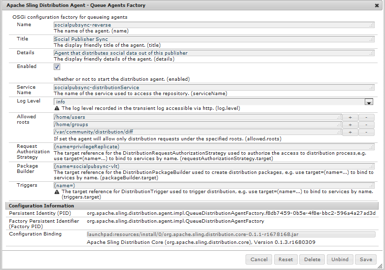

# Sincronização de usuário{#user-synchronization}

## Introdução {#introduction}

Quando a implantação é um [farm de publicação](/help/sites-deploying/recommended-deploys.md#tarmk-farm), os membros devem poder fazer logon e ver seus dados em qualquer nó do Publish.

Usuários e grupos de usuários (dados do usuário) criados no ambiente de publicação não são necessários no ambiente de criação.

A maioria dos dados do usuário criados no ambiente de criação deve permanecer no ambiente de criação e não ser copiada para instâncias do Publish.

O registro e as modificações feitas em uma instância do Publish devem ser sincronizados com outras instâncias do Publish para que elas tenham acesso aos mesmos dados do usuário.

A partir do AEM 6.1, quando a sincronização de usuários é ativada, os dados do usuário são sincronizados automaticamente nas instâncias do Publish no farm e não são criados no autor.

## Distribuição Sling {#sling-distribution}

Os dados do usuário, juntamente com suas [ACLs](/help/sites-administering/security.md), são armazenados no [Oak Core](/help/sites-deploying/platform.md), a camada abaixo do Oak JCR, e são acessados usando a [API do Oak](https://developer.adobe.com/experience-manager/reference-materials/6-5/javadoc/org/apache/jackrabbit/oak/api/package-tree.html). Com atualizações pouco frequentes, é razoável que os dados do usuário sejam sincronizados com outras instâncias do Publish usando a [Distribuição de conteúdo de sling](https://github.com/apache/sling-old-svn-mirror/blob/trunk/contrib/extensions/distribution/README.md) (distribuição de sling).

Os benefícios da sincronização de usuários usando a distribuição Sling, em comparação à replicação tradicional, são:

* *usuários*, *perfis de usuários* e *grupos de usuários* criados no Publish não são criados no Author

* A distribuição Sling define propriedades em eventos jcr, permitindo agir em ouvintes de eventos do lado da publicação sem preocupação com loops de replicação infinitos
* A distribuição Sling envia apenas dados do usuário para instâncias Publish não originárias, eliminando o tráfego desnecessário
* [ACLs](/help/sites-administering/security.md) definidas no nó do usuário estão incluídas na sincronização

>[!NOTE]
>
>Se as sessões forem necessárias, é recomendável usar uma solução SSO ou usar uma sessão adesiva e solicitar que os clientes façam logon se forem alternados para outra instância do Publish.

>[!CAUTION]
>
>Não há suporte para a sincronização do grupo **administradores**, mesmo quando a sincronização de usuário está habilitada. Em vez disso, uma falha ao &quot;importar o diferencial&quot; é registrada no log de erros.
>
>Portanto, quando a implantação for um farm de publicação, se um usuário for adicionado ou removido do grupo **administradores**, a modificação deverá ser feita manualmente em cada instância do Publish.

## Habilitar Sincronização de Usuário {#enable-user-sync}

>[!NOTE]
>
>Por padrão, a sincronização do usuário é `disabled`.
>
>A habilitação da sincronização de usuários envolve a modificação de *configurações OSGi* existentes.
>
>Nenhuma nova configuração deve ser adicionada como resultado da ativação da sincronização do usuário.

A sincronização de usuários depende do ambiente do autor para gerenciar as distribuições de dados do usuário, mesmo que os dados do usuário não sejam criados no Autor. Grande parte, mas não toda, da configuração ocorre no ambiente de criação e cada etapa identifica claramente se deve ser executada no Autor ou no Publish.

Veja a seguir as etapas necessárias para habilitar a sincronização de usuários, seguida pela seção [Solução de problemas](#troubleshooting):

### Pré-requisitos {#prerequisites}

1. Se usuários e grupos de usuários já tiverem sido criados em uma instância do Publish, é recomendável [sincronizar manualmente](#manually-syncing-users-and-user-groups) os dados do usuário para todas as instâncias do Publish antes de configurar e habilitar a sincronização de usuários.

Quando a sincronização de usuários estiver habilitada, somente os usuários e grupos recém-criados serão sincronizados.

1. Verifique se o código mais recente está instalado:

* [Atualizações da plataforma AEM](https://experienceleague.adobe.com/docs/experience-manager-release-information/aem-release-updates/aem-releases-updates.html?lang=pt-BR)
* [Atualizações do AEM Communities](/help/communities/deploy-communities.md#latestfeaturepack)

### 1. Apache Sling Distribution Agent - Fábrica de agentes de sincronização {#apache-sling-distribution-agent-sync-agents-factory}

**Habilitar sincronização de usuário**

* **no autor**

   * entrar com privilégios de administrador
   * acessar o [Console da Web](/help/sites-deploying/configuring-osgi.md)

      * por exemplo, [https://localhost:4502/system/console/configMgr](https://localhost:4502/system/console/configMgr)

   * localizar `Apache Sling Distribution Agent - Sync Agents Factory`

      * selecione a configuração existente para abri-la para edição (ícone de lápis)
Verificar `name`: **`socialpubsync`**

      * marque a caixa de seleção `Enabled`
      * selecionar `Save`


### 2. Criar usuário autorizado {#createauthuser}

**Configurar permissões**

O usuário autorizado é usado na etapa 3 para configurar a distribuição do Sling no Author.

* **em cada instância do Publish**

   * entrar com privilégios de administrador
   * acessar o [Console de Segurança](/help/sites-administering/security.md)

      * por exemplo, [https://localhost:4503/useradmin](https://localhost:4503/useradmin)

   * criar um usuário

      * por exemplo, `usersync-admin`

   * adicionar este usuário ao grupo de usuários **`administrators`**
   * [adicionar ACL para este usuário ao /home](#howtoaddacl)

      * `Allow jcr:all` com restrição `rep:glob=*/activities/*`

>[!CAUTION]
>
>Um novo usuário deve ser criado.
>
>* O usuário padrão atribuído é **`admin`**.
>* Não usar `communities-user-admin user.`
>

#### Como adicionar ACL {#addacls}

* CRXDE Lite de acesso

   * por exemplo, [https://localhost:4503/crx/de](https://localhost:4503/crx/de)

* selecionar nó `/home`
* no painel direito, selecione a guia `Access Control`
* para adicionar uma entrada ACL, selecione o botão `+`

   * **Entidade de Segurança**: *pesquisar usuário criado para sincronização de usuário*
   * **Tipo**: `Allow`
   * **Privilégios**: `jcr:all`
   * **Restrições** `rep:glob`: `*/activities/*`
   * selecione **OK**

* selecione **Salvar tudo**


Consulte também:

* [Gerenciamento de direitos de acesso](/help/sites-administering/user-group-ac-admin.md#access-right-management)
* Seção de Solução de Problemas [Modificar Exceção de Operação Durante o Processamento de Resposta](#modify-operation-exception-during-response-processing).

### 3. Distribuição do Adobe Granite - Provedor secreto de transporte de senha criptografada {#adobegraniteencpasswrd}

**Configurar permissões**

Depois que um usuário autorizado, membro do grupo de usuários **`administrators`**, é criado em todas as instâncias do Publish, o usuário autorizado deve ser identificado no Autor como tendo permissão para sincronizar dados do usuário do Autor para o Publish.

* **em Autor**

   * entrar com privilégios de administrador
   * acessar o [Console da Web](/help/sites-deploying/configuring-osgi.md)

      * por exemplo, [https://localhost:4502/system/console/configMgr](https://localhost:4502/system/console/configMgr)

   * localizar `com.adobe.granite.distribution.core.impl.CryptoDistributionTransportSecretProvider.name`
   * para abrir para edição, selecione a configuração existente (ícone de lápis)
Verificar `property name`: **`socialpubsync-publishUser`**

   * defina o nome de usuário e a senha para o [usuário autorizado](#createauthuser) criado no Publish na etapa 2

      * por exemplo, `usersync-admin`


### 4. Apache Sling Distribution Agent - Fábrica de agentes de fila {#apache-sling-distribution-agent-queue-agents-factory}

**Habilitar sincronização de usuário**

* **em cada instância do Publish**:

   * entrar com privilégios de administrador
   * acessar o [Console da Web](/help/sites-deploying/configuring-osgi.md)

      * por exemplo, [https://localhost:4503/system/console/configMgr](https://localhost:4503/system/console/configMgr)

   * localizar `Apache Sling Distribution Agent - Queue Agents Factory`

      * para abrir para edição, selecione a configuração existente (ícone de lápis)
Verificar `Name`: `socialpubsync-reverse`

      * marque a caixa de seleção `Enabled`
      * selecionar `Save`

   * **repetir** para cada instância do Publish



### 5. Adobe Social Sync - Diff Observer Fatory {#diffobserver}

**Habilitar sincronização de grupo**

* **em cada instância do Publish**:

   * entrar com privilégios de administrador
   * acessar o [Console da Web](/help/sites-deploying/configuring-osgi.md)

      * por exemplo, [https://localhost:4503/system/console/configMgr](https://localhost:4503/system/console/configMgr)

   * localizar **`Adobe Social Sync - Diff Observer Factory`**

      * para abrir para edição, selecione a configuração existente (ícone de lápis)

        Verificar `agent name`: `socialpubsync-reverse`

      * marque a caixa de seleção `Enabled`
      * selecionar `Save`


### 6. Acionador de distribuição do Apache Sling - Fábrica de acionadores programados {#apache-sling-distribution-trigger-scheduled-triggers-factory}

**(Opcional) modificar intervalo de sondagem**

Por padrão, o Autor pesquisa alterações a cada 30 segundos. Para alterar esse intervalo:

* **em Autor**

   * entrar com privilégios de administrador
   * acessar o [Console da Web](/help/sites-deploying/configuring-osgi.md)

      * por exemplo, [https://localhost:4502/system/console/configMgr](https://localhost:4502/system/console/configMgr)

   * localizar `Apache Sling Distribution Trigger - Scheduled Triggers Factory`

      * para abrir para edição, selecione a configuração existente (ícone de lápis)

         * Verificar `Name`: `socialpubsync-scheduled-trigger`

      * defina o `Interval in Seconds` para o intervalo desejado
      * selecionar `Save`


## Configurar para várias instâncias do Publish {#configure-for-multiple-publish-instances}

A configuração padrão é para uma única instância do Publish. Como o motivo para habilitar a sincronização de usuários é sincronizar várias instâncias do Publish, como em um farm de publicação, as instâncias adicionais do Publish devem ser adicionadas ao Sync Agents Fatory.

### 7. Apache Sling Distribution Agent - Fábrica de agentes de sincronização {#apache-sling-distribution-agent-sync-agents-factory-1}

**Adicionar Instâncias do Publish:**

* **em Autor**

   * entrar com privilégios de administrador
   * acessar o [Console da Web](/help/sites-deploying/configuring-osgi.md)

      * por exemplo, [https://localhost:4502/system/console/configMgr](https://localhost:4502/system/console/configMgr)

   * localizar `Apache Sling Distribution Agent - Sync Agents Factory`

      * para abrir para edição, selecione a configuração existente (ícone de lápis)
Verificar `Name`: `socialpubsync`


* **Pontos de Extremidade do Exportador**
Deve haver um terminal de exportador para cada instância do Publish. Por exemplo, se houver duas instâncias do Publish, localhost:4503 e 4504, deverá haver duas entradas:

   * `https://localhost:4503/libs/sling/distribution/services/exporters/socialpubsync-reverse`
   * `https://localhost:4504/libs/sling/distribution/services/exporters/socialpubsync-reverse`

* **Pontos de Extremidade do Importador**
Deve haver um endpoint de importador para cada instância do Publish. Por exemplo, se houver duas instâncias do Publish, localhost:4503 e 4504, deverá haver duas entradas:

   * `https://localhost:4503/libs/sling/distribution/services/importers/socialpubsync`
   * `https://localhost:4504/libs/sling/distribution/services/importers/socialpubsync`

* selecionar `Save`

### 8. Ouvinte de sincronização de usuário do AEM Communities {#aem-communities-user-sync-listener}

**(Opcional) Sincronizar nós JCR adicionais**

Se houver dados personalizados para sincronizar em várias instâncias do Publish, então:

* **em cada instância do Publish**:

   * entrar com privilégios de administrador
   * acessar o [Console da Web](/help/sites-deploying/configuring-osgi.md)

      * por exemplo, `https://localhost:4503/system/console/configMgr`

   * localizar `AEM Communities User Sync Listener`
   * para abrir para edição, selecione a configuração existente (ícone de lápis)
Verificar `Name`: `socialpubsync-scheduled-trigger`


* **Tipos de nós**
Esta é a lista de tipos de nó que são sincronizados. Qualquer tipo de nó diferente de sling:Folder deve ser listado aqui (sling:folder é manipulado separadamente).
Lista padrão de tipos de nó a serem sincronizados:

   * rep:Usuário
   * nt:unstructured
   * nt:resource

* **Propriedades Ignoráveis**
Esta é a lista de propriedades que são ignoradas se qualquer alteração for detectada. As alterações nessas propriedades podem ser sincronizadas como um efeito colateral de outras alterações (já que a sincronização está sempre no nível do nó), mas as alterações nessas propriedades não acionam a sincronização sozinhas.
Propriedade padrão a ignorar:

   * cq:lastModified

* **Nós Ignoráveis**
Subcaminhos ignorados durante a sincronização. Nada nesses subcaminhos é sincronizado a qualquer momento.
Nós padrão a ignorar:

   * .tokens
   * sistema

* **Pastas Distribuídas**
A maioria das sling:Folders é ignorada porque a sincronização não é necessária. As poucas exceções estão listadas aqui.
Pastas padrão a serem sincronizadas

   * segmentos/pontuação
   * social/relacionamentos
   * atividades

### 9. ID exclusiva do Sling {#unique-sling-id}

>[!CAUTION]
>
>Se a ID do Sling corresponder entre duas ou mais instâncias do Publish, a sincronização do grupo de usuários falhará.

Se a ID do Sling for a mesma para várias instâncias do Publish em um farm de publicação, os grupos de usuários não serão sincronizados.

Para validar se todos os valores de ID do Sling diferem, em cada instância do Publish:

1. navegar até `http://<host>:<port>/system/console/status-slingsettings`
1. verifique o valor de **Sling ID**


Se a Sling ID de uma instância do Publish corresponder à Sling ID de qualquer outra instância do Publish, então:

1. interrompa uma das instâncias do Publish que tenha uma Sling ID correspondente
1. no diretório crx-quickstart/launch/felix

   * procure e exclua o arquivo chamado *sling.id.file*

      * por exemplo, em um sistema Linux®:

        `rm -i $(find . -type f -name sling.id.file)`

      * por exemplo, em um sistema Windows:

        `use windows explorer and search for *sling.id.file*`

1. iniciar a instância do Publish

   * na inicialização, uma nova ID do Sling é atribuída a ele

1. valide se a **ID do Sling** agora é exclusiva

Repita essas etapas até que todas as instâncias do Publish tenham uma Sling ID exclusiva.

## Fábrica do Package Builder do Vault {#vault-package-builder-factory}

Para que as atualizações sejam sincronizadas corretamente, é necessário modificar o construtor de pacotes do Vault para sincronização do usuário:

* em cada instância do AEM Publish
* acessar o [Console da Web](/help/sites-deploying/configuring-osgi.md)

   * por exemplo, [https://localhost:4503/system/console/configMgr](https://localhost:4503/system/console/configMgr)

* localizar o `Apache Sling Distribution Packaging - Vault Package Builder Factory`

   * `Builder name: socialpubsync-vlt`

* selecionar o ícone editar
* adicione dois `Package Node Filters`:

   * `/home/users|-.*/.tokens`
   * `/home/users|-.*/rep:cache`

* tratamento de políticas:

   * para substituir os nós rep:policy existentes por novos, adicione um terceiro Filtro de Pacote:

      * `/home/users|+.*/rep:policy`

   * para impedir a distribuição de políticas, defina

      * `Acl Handling:` `IGNORE`


## O Que Acontece Quando... {#what-happens-when}

### O usuário se registra ou edita o perfil no Publish {#user-self-registers-or-edits-profile-on-publish}

Por design, os usuários e perfis criados no ambiente de publicação (autorregistro) não aparecem no ambiente de criação.

Quando a topologia é um [farm de publicação](/help/sites-deploying/recommended-deploys.md#tarmk-farm) e a sincronização de usuário foi configurada corretamente, o *usuário* e o *perfil de usuário* são sincronizados no farm de publicação usando a distribuição Sling.

### Usuários ou grupos de usuários são criados usando o Console de segurança {#users-or-user-groups-are-created-using-security-console}

Por design, os dados do usuário criados no ambiente de publicação não aparecem no ambiente de criação e vice-versa.

Quando o console [Administração e Segurança do Usuário](/help/sites-administering/security.md) é usado para adicionar novos usuários no ambiente de publicação, a sincronização de usuários sincroniza os novos usuários e suas associações de grupo para outras instâncias do Publish, se necessário. A sincronização de usuários também sincroniza grupos de usuários criados por meio do console de segurança.

## Resolução de problemas {#troubleshooting}

### Como colocar a sincronização de usuários off-line {#how-to-take-user-sync-offline}

Para colocar a sincronização de usuários offline, para [remover uma instância do Publish](#how-to-remove-a-publish-instance) ou [sincronizar dados manualmente](#manually-syncing-users-and-user-groups), a fila de distribuição deve estar vazia e silenciosa.

Para verificar o estado da fila de distribuição:

* em Autor:

   * usando [CRXDE Lite](/help/sites-developing/developing-with-crxde-lite.md)

      * procurar entradas em `/var/sling/distribution/packages`

         * nós de pasta nomeados com o padrão `distrpackage_*`

   * usando o [Gerenciador de Pacotes](/help/sites-administering/package-manager.md)

      * procurar pacotes pendentes (ainda não instalados)

         * nomeado com o padrão `socialpubsync-vlt*`
         * criado por `communities-user-admin`

Quando a fila de distribuição estiver vazia, desabilitar sincronização de usuário:

* no Autor

   * *desmarque *a caixa de seleção `Enabled` para o [Apache Sling Distribution Agent - Fábrica de agentes de sincronização](#apache-sling-distribution-agent-sync-agents-factory)

Quando as tarefas forem concluídas, para reativar a sincronização de usuários:

* no Autor

   * marque a caixa de seleção `Enabled` do [Apache Sling Distribution Agent - Fábrica de Agentes de Sincronização](#apache-sling-distribution-agent-sync-agents-factory)

### Diagnóstico de sincronização de usuário {#user-sync-diagnostics}

O Diagnóstico de sincronização de usuário é uma ferramenta que verifica a configuração e tenta identificar quaisquer problemas.

No Autor, basta navegar pelo console principal através de **Ferramentas, Operações, Diagnóstico, Diagnóstico de Sincronização de Usuários.**

Basta inserir o console Diagnóstico de sincronização de usuário para exibir os resultados.

Isso é exibido quando a Sincronização de Usuário não foi habilitada:


#### Como executar diagnósticos para instâncias do Publish {#how-to-run-diagnostics-for-publish-instances}

Quando o diagnóstico é executado do ambiente do autor, os resultados de aprovação/falha incluem uma seção [INFO] exibindo a lista de instâncias do Publish configuradas para confirmação.

Está incluído na lista um URL para cada instância do Publish que executa o diagnóstico para essa instância. O parâmetro de URL `syncUser` está anexado à URL de diagnóstico com seu valor definido para o *usuário de sincronização autorizado* criado em [Etapa 2](#createauthuser).

**Observação**: antes de iniciar a URL, o *usuário de sincronização autorizado* já deve estar conectado a essa instância do Publish.


### Configuração adicionada incorretamente {#configuration-improperly-added}

Quando a sincronização de usuários falha ao funcionar, o problema mais comum é que configurações adicionais foram *adicionadas*. Em vez disso, a configuração padrão *existente *deveria ter sido *editada*.

Veja a seguir como as configurações padrão editadas devem aparecer no Console da Web. Se mais de uma instância for exibida, a configuração adicionada deverá ser removida.

#### (Autor) Um agente de distribuição Apache Sling - fábrica de agentes de sincronização {#author-one-apache-sling-distribution-agent-sync-agents-factory}


#### (Autor) Credenciais de transporte de distribuição do Apache Sling - Credenciais do usuário com base em DistributionTransportSecretProvider {#author-one-apache-sling-distribution-transport-credentials-user-credentials-based-distributiontransportsecretprovider}


#### (Publish) One Apache Sling Distribution Agent - Fábrica de agentes de fila {#publish-one-apache-sling-distribution-agent-queue-agents-factory}


#### (Publish) One Adobe Social Sync - Diff Observer Fatory {#publish-one-adobe-social-sync-diff-observer-factory}


#### (Autor) Um acionador de distribuição do Apache Sling - Fábrica de acionadores programados {#author-one-apache-sling-distribution-trigger-scheduled-triggers-factory}


### Modificar Exceção de Operação Durante o Processamento de Resposta {#modify-operation-exception-during-response-processing}

Se o seguinte estiver visível no log:

`org.apache.sling.servlets.post.impl.operations.ModifyOperation Exception during response processing.`

`java.lang.IllegalStateException: This tree does not exist`

Em seguida, verifique se a seção [2. Criar Usuário Autorizado](#createauthuser) foi seguido corretamente.

Esta seção descreve como criar um usuário autorizado, que existe em todas as instâncias do Publish, e identificá-lo na configuração OSGi &quot;Provedor secreto&quot; no autor. Por padrão, o usuário é `admin`.

O usuário autorizado deve se tornar membro do grupo de usuários **`administrators`** e as permissões para esse grupo não devem ser alteradas.

O usuário autorizado deve ter explicitamente os seguintes privilégios e restrições em todas as instâncias do Publish:

| **caminho** | **jcr:all** | **rep:glob** |
|---|---|---|
| /home | X | &#42;/atividades/&#42; |
| /home/users | X | &#42;/atividades/&#42; |
| /home/groups | X | &#42;/atividades/&#42; |

Como membro do grupo `administrators`, o usuário autorizado deve ter os seguintes privilégios em todas as instâncias do Publish:

| **caminho** | **jcr:all** | **jcr:read** | **rep:write** |
|---|---|---|---|
| /etc/packages/sling/distribution |  |  | X |
| /libs/sling/distribution |  | X |  |
| /var |  |  | X |
| /var/eventing |  | X | X |
| /var/sling/distribution |  | X | X |

### Falha na sincronização do grupo de usuários {#user-group-sync-failed}

Se a ID do Sling corresponder entre duas ou mais instâncias do Publish, a sincronização do grupo de usuários falhará.

Consulte a seção [9. Identificador exclusivo do Sling ](#unique-sling-id)

### Sincronizando usuários e grupos de usuários manualmente {#manually-syncing-users-and-user-groups}

* em instâncias do Publish em que existem usuários e grupos de usuários:

   * [se ativado, desativa a sincronização de usuários](#how-to-take-user-sync-offline)
   * [criar um pacote](/help/sites-administering/package-manager.md#creating-a-new-package) de `/home`

      * ao editar o pacote

         * Guia Filtros: Adicionar filtro: Caminho raiz: `/home`
         * Guia Avançado: Manuseio de AC: `Overwrite`

   * [exportar o pacote](/help/sites-administering/package-manager.md#downloading-packages-to-your-file-system)

* em outras instâncias do Publish:

   * [importar o pacote](/help/sites-administering/package-manager.md#installing-packages)

Para configurar ou habilitar a sincronização de usuários, vá para a etapa 1: [Agente de Distribuição Apache Sling - Fábrica de Agentes de Sincronização](#apache-sling-distribution-agent-sync-agents-factory)

### Quando uma instância do Publish se torna indisponível {#when-a-publish-instance-becomes-unavailable}

Quando uma instância do Publish se torna indisponível, ela não deve ser removida se estiver online novamente no futuro. As alterações são enfileiradas para a instância do Publish e, quando ela voltar a ficar online, as alterações serão processadas.

Se a instância do Publish nunca voltar a ficar online, se estiver offline permanentemente, ela deverá ser removida, pois o acúmulo da fila resulta no uso notável de espaço em disco no ambiente do Autor.

Quando uma instância do Publish está inativa, o log do Autor tem exceções semelhantes ao seguinte:

```
28.01.2016 15:57:48.475 ERROR
 [pool-12-thread-34-org_apache_sling_distribution_queue_socialpubsync_endpoint1
 (org/apache/sling/distribution/queue/socialpubsync/endpoint1)]
 org.apache.sling.distribution.agent.impl.SimpleDistributionAgent [agent][socialpubsync] could not deliver package distrpackage_1454014575838_a2b45ec8-0400-42f3-bed8-ae09b66381cb
 org.apache.sling.distribution.packaging.DistributionPackageImportException: failed in importing package ...
```

### Como remover uma instância do Publish {#how-to-remove-a-publish-instance}

Para remover uma instância do Publish do [Apache Sling Distribution Agent - Sync Agents Fatory](#apache-sling-distribution-agent-sync-agents-factory), a fila de distribuição deve estar vazia e silenciosa.

* em Autor:

   * [Colocar a sincronização do usuário offline](#how-to-take-user-sync-offline)
   * siga a [etapa 7](#apache-sling-distribution-agent-sync-agents-factory) para remover a instância do Publish de ambas as listas de servidores:

      * `Exporter Endpoints`
      * `Importer Endpoints`

   * reativar sincronização de usuário

      * marque a caixa de seleção `Enabled` do [Apache Sling Distribution Agent - Fábrica de Agentes de Sincronização](#apache-sling-distribution-agent-sync-agents-factory)
