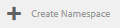
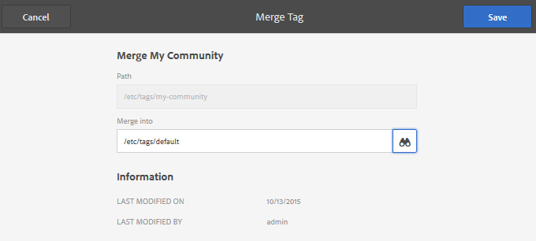

# Administração de tags {#administering-tags}

As tags são um método rápido e fácil de classificar conteúdo em um site. Elas podem ser consideradas palavras-chave ou rótulos (metadados) que permitem que o conteúdo seja encontrado mais rapidamente como resultado de uma pesquisa.

No Adobe Experience Manager (AEM), uma tag pode ser uma propriedade de

* um nó de conteúdo para uma página (consulte [Uso de tags](/help/sites-authoring/tags.md))

* um nó de metadados para um ativo (consulte [Gerenciamento de metadados para ativos digitais](/help/assets/metadata.md))

Além de páginas e ativos, as tags são usadas para recursos do AEM Communities

* conteúdo gerado pelo usuário (consulte [Marcar UGC)](/help/communities/tag-ugc.md)

* Recursos de ativação (consulte [Marcação de recursos de ativação](/help/communities/functions.md#catalog-function))

## Recursos de tag {#tag-features}

Alguns dos recursos das tags no AEM incluem:

* As tags podem ser agrupadas em vários namespaces. Essas hierarquias permitem que taxonomias sejam criadas. Essas taxonomias são globais por todo o AEM.
* A restrição principal para tags recém-criadas é que elas devem ser exclusivas em um namespace específico.
* O título de uma tag não deve incluir caracteres de separação de caminho de tag (nem eles serão exibidos, se presentes)

   * dois pontos `:` - delimita a tag do namespace
   * barra `/` - delimita subtags

* As tags podem ser aplicadas por autores e visitantes do site. Independentemente do criador, todas as formas de tags são disponibilizadas para seleção, tanto ao atribuir a uma página quanto ao pesquisar.
* As tags podem ser criadas e sua taxonomia modificada por membros do grupo &quot;administradores de tags&quot; e membros que tenham direitos de modificação para `/content/cq:tags`.

   * Uma tag que contém tags secundárias é chamada de tag de container
   * Uma tag que não é uma tag container é chamada de tag folha
   * Um namespace de tag é uma tag folha ou container

* As tags são usadas pelo [Componente de pesquisa](https://helpx.adobe.com/experience-manager/core-components/using/quick-search.html) para facilitar a localização do conteúdo.
* As tags são usadas pelo [Componente de teaser](https://helpx.adobe.com/experience-manager/core-components/using/teaser.html), que monitora a nuvem de tags de um usuário para fornecer conteúdo direcionado.
* Se a marcação for um aspecto importante do seu conteúdo

   * empacotar tags com as páginas que as usam
   * verifique se [permissões de tag](#setting-tag-permissions) habilitar acesso de leitura

## Console de marcação {#tagging-console}

O console Marcação é usado para criar e gerenciar tags e suas taxonomias. Um objetivo é evitar ter muitas tags semelhantes relacionadas basicamente à mesma coisa: por exemplo, páginas e páginas ou calçados e sapatos.

As tags são gerenciadas por meio do agrupamento em namespaces, da revisão do uso de tags existentes antes da criação de novas e da reorganização sem desconectar a tag do conteúdo referenciado no momento.

Para acessar o console de Marcação:

* no autor
* entrar com privilégios administrativos
* da navegação global

   * selecionar **`Tools`**
   * selecionar **`General`**
   * selecionar **`Tagging`**

### Criar um namespace {#creating-a-namespace}

Para criar um novo namespace, selecione a variável **`Create Namespace`** ícone.

O namespace é, em si, uma tag e não precisa conter nenhuma subtag. No entanto, para continuar criando uma taxonomia, [criar subtags](#creating-tags), que por sua vez podem ser tags de folha ou tags de container.

 

* **Título**
  *(obrigatório)* Um título de exibição para o namespace.

* **Nome**
  *(opcional)* Nome do namespace. Se não for especificado, um nome de nó válido será criado a partir do Título. Consulte [TagID](/help/sites-developing/framework.md#tagid).

* **Descrição**
  *(opcional)* Uma descrição do namespace.

Quando as informações necessárias forem inseridas

* selecionar **Criar**

### Operações em tags {#operations-on-tags}

Selecionar um namespace ou outra tag disponibiliza as seguintes operações:

* [Propriedades da exibição](#viewing-tag-properties)
* [Referências](#showing-tag-references)
* [Criar tag](#creating-tags)
* [Editar](#editing-tags)
* [Mover](#moving-tags)
* [Mesclar](#merging-tags)
* [Publicação](#publishing-tags)
* [Desfazer publicação](#unpublishing-tags)
* [Excluir](#deleting-tags)

Quando a janela do navegador não é larga o suficiente para exibir todos os ícones, os ícones mais à direita são agrupados em uma **`... More`** ícone, que exibirá uma lista suspensa dos ícones de operação ocultos quando selecionados.

### Selecionar uma tag de namespace {#selecting-a-namespace-tag}

Quando selecionado pela primeira vez, se o namespace não contiver tags, as propriedades serão exibidas à direita; caso contrário, as tags secundárias serão exibidas. Cada tag selecionada exibirá as tags que contém ou suas propriedades se não tiver tags secundárias.

Para selecionar a tag para operações e para várias seleções, selecione somente o ícone ao lado do título. Selecionar o título exibirá somente as propriedades ou abrirá a tag para exibir seu conteúdo.

 

### Exibição das propriedades da tag {#viewing-tag-properties}

Quando um namespace ou outra tag é selecionada, a seleção do **`View Properties`** ícone resulta na exibição de informações sobre o `name`, hora da última edição e número de referências. Se publicado, são mostradas a hora em que foi publicado pela última vez e a ID do editor. Essas informações serão exibidas em uma coluna à esquerda das colunas de tag.

### Mostrando referências de tag {#showing-tag-references}

Quando um namespace ou outra tag é selecionada, a seleção do **Referências** O ícone identificará o conteúdo ao qual a tag foi aplicada.

A exibição inicial é uma contagem de tags aplicadas.

Ao selecionar a seta à direita da contagem, os nomes de referência são listados.

O caminho para a referência é exibido como uma dica de ferramenta ao passar o mouse sobre uma referência.

### Criação de tags {#creating-tags}

Quando um namespace ou outra tag é selecionada (selecionando o ícone ao lado do título), uma tag secundária pode ser criada para a tag atual selecionando o **`Create Tag`** ícone.

* **Título**
* (obrigatório) *Um título de exibição para a tag.

* **Nome**
* (opcional) *Um nome para a tag. Se não for especificado, um nome de nó válido será criado a partir do Título. Consulte [TagID](/help/sites-developing/framework.md#tagid).

* **Descrição**
* (opcional) *Uma descrição da tag.

Quando as informações necessárias forem inseridas

* selecionar **Criar**

### Edição de tags {#editing-tags}

Quando um namespace ou outra tag é selecionada, é possível alterar o Título, a Descrição e fornecer localizações do Título selecionando o **`Edit`**ícone.

Depois que as edições forem feitas, selecione **Salvar**.

Para obter detalhes sobre como adicionar traduções de idioma, consulte a seção sobre [Gerenciamento de tags em diferentes idiomas](#managing-tags-in-different-languages).

### Mover tags {#moving-tags}

Quando um namespace ou outra tag é selecionada, a seleção do **`Move`** O ícone permitirá que Administradores e desenvolvedores de tags limpem a taxonomia movendo a tag para um novo local ou renomeando-a. Quando a tag selecionada for uma tag container, movê-la também moverá todas as tags secundárias.

>[!NOTE]
>
>Recomenda-se que os Autores só tenham permissão para [editar](#editing-tags) a tag da `title`, não para mover ou renomear tags.

* **Caminho**
  *(somente leitura)* O caminho atual para a tag selecionada.

* **Mover para**
Navegue até o novo caminho no qual mover a tag.

* **Renomear para**
Exibe inicialmente o atual `name`da tag. Um novo `name`podem ser inseridos.

* selecionar **Salvar**

### Mesclar tags {#merging-tags}

A mesclagem de tags pode ser usada quando uma taxonomia tem duplicatas. Quando a tag A é mesclada à tag B, todas as páginas marcadas com a tag A são marcadas com a tag B e a tag A não está mais disponível para os autores.

Quando um namespace ou outra tag é selecionada, a seleção do **Mesclar** O ícone abrirá um painel onde o caminho para mesclar pode ser selecionado.

* **Caminho**
  *(somente leitura)* O caminho da tag selecionada para mesclagem em outra tag.

* **Mesclar para**
Procure para selecionar o caminho da tag na qual mesclar.

>[!NOTE]
>
>Após a mesclagem, a variável **Caminho** o selecionado originalmente (virtualmente) não existirá mais.
>
>Quando uma tag referenciada é movida ou mesclada, a tag não é fisicamente excluída, de modo que é possível manter referências.

### Publicação de tags {#publishing-tags}

Quando um namespace ou outra tag é selecionada, a seleção do **Publish** ícone para ativar a tag no ambiente de publicação. Similar ao conteúdo da página, somente a tag selecionada é publicada, independentemente de ser uma tag container ou não.

Para publicar uma taxonomia (um namespace e subtags), a prática recomendada é criar uma [pacote](/help/sites-administering/package-manager.md) do namespace (consulte [Nó raiz da taxonomia](/help/sites-developing/framework.md#taxonomy-root-node)). Certifique-se de [aplicar permissões](#setting-tag-permissions) ao namespace antes de criar o pacote.

### Desfazer publicação de tags {#unpublishing-tags}

Quando um namespace ou outra tag é selecionada, a seleção do **Cancelar publicação** O ícone desativará a tag no ambiente do autor e a removerá do ambiente de publicação. Semelhante ao `Delete`operação, se a tag selecionada for uma tag container, todas as tags secundárias serão desativadas no ambiente de criação e removidas do ambiente de publicação.

### Exclusão de tags {#deleting-tags}

Quando um namespace ou outra tag é selecionada, a seleção do **Excluir** O ícone removerá permanentemente a tag do ambiente de criação. Se a tag tiver sido publicada, ela também será removida do ambiente de publicação. Se a tag selecionada for uma tag container, todas as tags secundárias também serão removidas.

## Definição de permissões de tag {#setting-tag-permissions}

As permissões de tag são [&#39;seguro (por padrão)&#39;](/help/sites-administering/production-ready.md); uma prática recomendada para o ambiente de publicação que requer que a permissão de leitura seja explicitamente permitida para tags. Basicamente, isso é feito criando um pacote do namespace de tag depois que as permissões forem definidas no autor e instalando o pacote em todas as instâncias de publicação.

* na instância do autor

   * entrar com privilégios administrativos
   * acesse o [Console de segurança](/help/sites-administering/security.md#accessing-user-administration-with-the-security-console),

      * por exemplo, navegue até http://localhost:4502/useradmin

   * no painel esquerdo, selecione o grupo (ou usuário) para o qual [permissão de leitura](/help/sites-administering/security.md#permissions) deve ser concedido
   * no painel direito, localize o **Caminho **para o namespace da tag

      * por exemplo, `/content/cq:tags/mycommunity`

   * selecione o `checkbox`no **Ler** coluna
   * selecionar **Salvar**

* verifique se todas as instâncias de publicação têm as mesmas permissões

   * uma abordagem é [criar um pacote](/help/sites-administering/package-manager.md#package-manager) do namespace no autor

      * em `Advanced` guia, para `AC Handling` selecionar `Overwrite`

   * replicar o pacote

      * escolher `Replicate` do gerenciador de pacotes

## Gerenciamento de tags em diferentes idiomas {#managing-tags-in-different-languages}

A variável `title`A propriedade de uma tag pode ser traduzida em vários idiomas. Depois de traduzida, a tag apropriada `title`podem ser exibidos de acordo com o idioma do usuário ou da página.

### Definição de títulos de tag em vários idiomas {#defining-tag-titles-in-multiple-languages}

A tabela a seguir descreve como traduzir `title`da tag **Animais** de inglês para alemão e francês.

Comece selecionando a tag sob a **Banco de imagens** namespace e selecionar o **`Edit`**ícone (consulte [Edição de tags](#editing-tags) seção).

O painel Editar tag apresenta a capacidade de escolher idiomas nos quais o título da tag deve ser localizado.

À medida que cada idioma é selecionado, uma caixa de entrada de texto é exibida, na qual o título traduzido pode ser inserido.

Depois que todas as traduções forem inseridas, selecione **Salvar** para sair do modo de edição.

Em geral, o idioma escolhido para a tag é retirado do idioma da página, quando disponível. Quando a variável [`tag` widget](/help/sites-developing/building.md#tagging-on-the-client-side) for usada em outros casos (por exemplo, em formulários ou caixas de diálogo), a linguagem da tag dependerá do contexto.

Em vez de usar a configuração de idioma da página, o console Marcação usa a configuração de idioma do usuário. No console de marcação, para a tag &quot;Animais&quot;, &quot;Animaux&quot; seria exibido para um usuário que define o idioma para francês em suas propriedades de usuário.

Para adicionar um novo idioma à caixa de diálogo, consulte [Adicionar um novo idioma à caixa de diálogo Editar tag](/help/sites-developing/building.md#adding-a-new-language-to-the-edit-tag-dialog).

>[!NOTE]
>
>A nuvem de tags e as metapalavras-chave no componente de página padrão usam a tag localizada `titles`com base no idioma da página, se disponível.

## Recursos {#resources}

* [Marcação para desenvolvedores](/help/sites-developing/tags.md)

  Informações sobre a estrutura de marcação e sobre a extensão e inclusão de tags em aplicativos personalizados.

* [Console de marcação da interface clássica](/help/sites-administering/classic-console.md)
