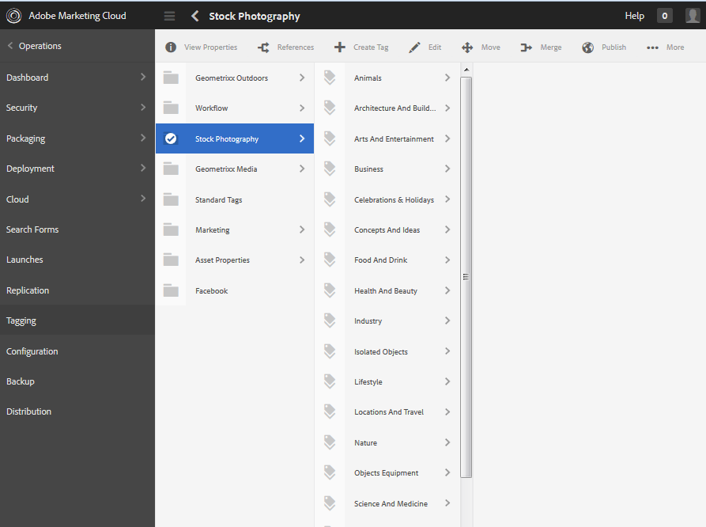

# Administração de tags {#administering-tags}

Tags são um método rápido e fácil de classificar o conteúdo em um site. Eles podem ser considerados palavras-chave ou rótulos (metadados) que permitem que o conteúdo seja encontrado mais rapidamente como resultado de uma pesquisa.

No Adobe Experience Manager (AEM), uma tag pode ser uma propriedade de

* um nó de conteúdo para uma página (consulte [Usando tags](/help/sites-authoring/tags.md))

* um nó de metadados para um ativo (consulte [Gerenciamento de metadados para ativos digitais](/help/assets/metadata.md))

Além de páginas e ativos, as tags são usadas para os recursos do AEM Communities

* conteúdo gerado pelo usuário (consulte [Marcação de UGC)](/help/communities/tag-ugc.md)

* Recursos de ativação (consulte [Marcando recursos de ativação](/help/communities/functions.md#catalog-function))

## Recursos de tag {#tag-features}

Alguns dos recursos das tags no AEM incluem:

* As tags podem ser agrupadas em várias namespaces. Essas hierarquias permitem construir taxonomias. Essas taxonomias são globais por toda AEM.
* A principal restrição para tags recém-criadas é que elas devem ser exclusivas em uma namespace específica.
* O título de uma tag não deve incluir caracteres de separação de caminho de tag (nem serão exibidos se estiverem presentes)

   * dois pontos `:` - delimita a tag de namespace
   * barra `/` - delimita as subtags

* As tags podem ser aplicadas por autores e visitantes do site. Independentemente do criador, todas as formas de tags são disponibilizadas para seleção, tanto ao atribuir a uma página quanto ao pesquisar.
* As tags podem ser criadas e sua taxonomia modificada por membros do grupo &quot;administradores de tags&quot; e membros que têm direitos de modificação para `/content/cq:tags`.

   * Uma tag que contém tags-filho é chamada de tag de container
   * Uma tag que não é uma tag de container é chamada de tag de folha
   * Uma namespace de tag é uma tag de folha ou uma tag de container

* As tags são usadas pelo [componente de pesquisa](https://helpx.adobe.com/experience-manager/core-components/using/quick-search.html) para facilitar a localização de conteúdo.
* As tags são usadas pelo [componente Teaser](https://helpx.adobe.com/experience-manager/core-components/using/teaser.html), que monitora a nuvem de tags de um usuário para fornecer conteúdo direcionado.
* Se a marcação for um aspecto importante do seu conteúdo

   * certifique-se de disponibilizar tags com as páginas que as usam
   * certifique-se de [permissões de tag](#setting-tag-permissions) habilitar acesso de leitura

## Console de marcação {#tagging-console}

O console Marcação é usado para criar e gerenciar tags e suas taxonomias. Um objetivo é evitar ter muitas tags similares relacionadas basicamente à mesma coisa: por exemplo, página e páginas ou calçados e sapatos.

As tags são gerenciadas por meio do agrupamento no namespace, da revisão do uso de tags existentes antes da criação de novas tags e da reorganização sem desconectar a tag do conteúdo referenciado no momento.

Para acessar o console Marcação :

* sobre o autor
* fazer logon com privilégios administrativos
* da navegação global

   * select **`Tools`**
   * selecione **`General`**
   * selecione **`Tagging`**

### Criação de uma Namespace {#creating-a-namespace}

Para criar uma nova namespace, selecione o ícone **`Create Namespace`**.

A namespace é uma tag e não precisa conter subtags. Entretanto, para continuar criando uma taxonomia, [crie subtags](#creating-tags), que por sua vez podem ser tags de folha ou de container.

 

* **Título**

   *(obrigatório)* Um título de exibição para a namespace.

* **Nome**
   *(opcional)* Um nome para a namespace. Se não for especificado, um nome de nó válido será criado a partir do Título. Consulte [TagID](/help/sites-developing/framework.md#tagid).

* **Descrição**

   *(opcional)* Uma descrição da namespace.

Após a inserção das informações necessárias

* selecione **Criar**

### Operações em tags {#operations-on-tags}

Selecionar uma namespace ou outra tag torna disponíveis as seguintes operações:

* [Propriedades da exibição](#viewing-tag-properties)
* [Referências](#showing-tag-references)
* [Criar tag](#creating-tags)
* [Editar](#editing-tags)
* [Mover](#moving-tags)
* [Mesclar](#merging-tags)
* [Publicação](#publishing-tags)
* [Desfazer publicação](#unpublishing-tags)
* [Excluir](#deleting-tags)

Quando a janela do navegador não for larga o suficiente para exibir todos os ícones, os ícones mais à direita serão agrupados sob um ícone **`... More`**, que exibirá uma lista suspensa dos ícones de operação ocultos quando selecionados.

### Selecionar uma tag de Namespace {#selecting-a-namespace-tag}

Quando selecionadas pela primeira vez, se a namespace não contiver nenhuma tag, as propriedades serão exibidas à direita, caso contrário, as tags-filho serão exibidas. Cada tag selecionada exibirá as tags que contém ou suas propriedades se não tiver tags-filho.

Para selecionar a tag para operações e para fazer várias seleções, selecione apenas o ícone ao lado do título. Selecionar o título exibirá somente as propriedades ou abrirá a tag para exibir seu conteúdo.

 

### Exibindo propriedades da tag {#viewing-tag-properties}

Quando uma namespace ou outra tag é selecionada, selecionar o ícone **`View Properties`** resulta na exibição de informações sobre `name`, a hora da última edição e o número de referências. Se publicada, a hora em que foi publicada pela última vez e a ID do editor são mostradas. Essas informações aparecerão em uma coluna à esquerda das colunas da tag.

### Mostrando referências de tag {#showing-tag-references}

Quando uma namespace ou outra tag é selecionada, selecionar o ícone **Referências** identificará o conteúdo ao qual a tag foi aplicada.

A exibição inicial é uma contagem de tags aplicadas.

Ao selecionar a seta à direita da contagem, os nomes de referência são listados.

O caminho para a referência é exibido como uma dica de ferramenta ao passar o mouse sobre uma referência.

### Criar tags {#creating-tags}

Quando uma namespace ou outra tag é selecionada (selecionando o ícone ao lado do título), uma tag filho pode ser criada para a tag atual selecionando o ícone **`Create Tag`**.

* **Título**
* (obrigatório) *Um título de exibição para a tag .

* **Nome**
* (opcional) *Um nome para a tag . Se não for especificado, um nome de nó válido será criado a partir do Título. Consulte [TagID](/help/sites-developing/framework.md#tagid).

* **Descrição**
* (opcional) *Uma descrição da tag.

Após a inserção das informações necessárias

* selecione **Criar**

### Edição de tags {#editing-tags}

Quando uma namespace ou outra tag é selecionada, é possível alterar o Título, a Descrição e fornecer localizações do Título selecionando o ícone **`Edit`**.

Depois que as edições forem feitas, selecione **Salvar**.

Para obter detalhes sobre como adicionar traduções de idioma, consulte a seção [Gerenciar tags em diferentes idiomas](#managing-tags-in-different-languages).

### Mover tags {#moving-tags}

Quando uma namespace ou outra tag é selecionada, selecionar o ícone **`Move`** permitirá que os administradores e desenvolvedores de tags limpem a taxonomia movendo a tag para um novo local ou renomeando-a. Quando a tag selecionada for uma tag de container, mover a tag também moverá todas as tags-filho.

>[!NOTE]
>
>Recomenda-se que os Autores tenham permissão para [editar](#editing-tags) a tag `title`, e não para mover ou renomear tags.

* **Caminho**

   *(somente leitura)* O caminho atual para a tag selecionada.

* **Mover**
paraNavegar até o novo caminho sob o qual mover a tag.

* **Renomear**
paraInicialmente exibe o valor atual 
`name`da tag . Um novo `name`pode ser inserido.

* selecione **Salvar**

### Mesclar tags {#merging-tags}

A mesclagem de tags pode ser usada quando uma taxonomia tem duplicados. Quando a tag A é unida à tag B, todas as páginas marcadas com a tag A serão marcadas com a tag B e a tag A não estará mais disponível para os autores.

Quando uma namespace ou outra tag é selecionada, selecionar o ícone **Mesclar** abrirá um painel no qual o caminho para mesclar pode ser selecionado.

* **Caminho**

   *(somente leitura)* O caminho da tag selecionada a ser unida em outra tag.

* **Mesclar**
emNavegação para selecionar o caminho da tag para a qual deseja mesclar.

>[!NOTE]
>
>Após a mesclagem, o **Caminho** originalmente selecionado não existirá (virtualmente) mais.
>
>Quando uma tag referenciada é movida ou unida, ela não é fisicamente excluída, de modo que seja possível manter referências.

### Publicação de tags {#publishing-tags}

Quando uma namespace ou outra tag for selecionada, selecione o ícone **Publicar** para ativar a tag no ambiente de publicação. Semelhante ao conteúdo da página, somente a tag selecionada é publicada, independentemente de ser ou não uma tag de container.

Para publicar uma taxonomia (uma namespace e subtags), a prática recomendada é criar um [pacote](/help/sites-administering/package-manager.md) da namespace (consulte [Nó raiz de taxonomia](/help/sites-developing/framework.md#taxonomy-root-node)). Certifique-se de [aplicar permissões](#setting-tag-permissions) à namespace antes de criar o pacote.

### Cancelar publicação de tags {#unpublishing-tags}

Quando uma namespace ou outra tag é selecionada, selecionar o ícone **Cancelar publicação** desativará a tag no ambiente do autor e a removerá do ambiente de publicação. Semelhante à operação `Delete`se a tag selecionada for uma tag de container, todas as tags-filho serão desativadas no ambiente do autor e removidas do ambiente de publicação.

### Excluindo tags {#deleting-tags}

Quando uma namespace ou outra tag é selecionada, selecionar o ícone **Excluir** removerá permanentemente a tag do ambiente do autor. Se a tag tiver sido publicada, ela também será removida do ambiente de publicação. Se a tag selecionada for uma tag de container, todas as tags-filho também serão removidas.

## Definindo permissões de tag {#setting-tag-permissions}

As permissões de tag são [&#39;secure (por padrão)&#39;](/help/sites-administering/production-ready.md); uma prática recomendada para o ambiente de publicação que requer permissão de leitura para ser explicitamente permitida para tags. Basicamente, isso é feito criando um pacote da Namespace de tags depois que as permissões são definidas no autor e instalando o pacote em todas as instâncias de publicação.

* na instância do autor

   * fazer logon com privilégios administrativos
   * acesse o [Console de Segurança](/help/sites-administering/security.md#accessing-user-administration-with-the-security-console),

      * por exemplo, navegue até http://localhost:4502/useradmin
   * no painel esquerdo, selecione o grupo (ou usuário) para o qual [permissão de leitura](/help/sites-administering/security.md#permissions) deve ser concedida
   * no painel direito, localize o **Caminho **para a Namespace da tag

      * por exemplo, `/content/cq:tags/mycommunity`
   * selecione `checkbox`na coluna **Leitura**
   * selecione **Salvar**

* garantir que todas as instâncias de publicação tenham as mesmas permissões

   * uma abordagem é para [criar um pacote](/help/sites-administering/package-manager.md#package-manager) da namespace no autor

      * na guia `Advanced`, para `AC Handling` selecione `Overwrite`
   * replicar o pacote

      * escolher `Replicate` do gerenciador de pacotes

## Gerenciando tags em diferentes idiomas {#managing-tags-in-different-languages}

A propriedade `title`de uma tag pode ser traduzida para vários idiomas. Depois de traduzida, a tag apropriada `title`pode ser exibida de acordo com o idioma do usuário ou com o idioma da página.

### Definição de títulos de tag em vários idiomas {#defining-tag-titles-in-multiple-languages}

A seguir, é descrito como traduzir `title`da tag **Animais** do inglês para o alemão e o francês.

Start selecionando a tag na namespace **Fotografia do Estoque** e selecionando o ícone **`Edit`**(consulte a seção [Editando tags](#editing-tags)).

O painel Editar tag apresenta a capacidade de escolher idiomas nos quais o título da tag deve ser localizado.

À medida que cada idioma é selecionado, uma caixa de entrada de texto é exibida na qual o título traduzido pode ser inserido.

Depois que todas as traduções forem inseridas, selecione **Salvar** para sair do modo de edição.

Em geral, o idioma escolhido para a tag é retirado do idioma da página, quando disponível. Quando o [ `tag` widget](/help/sites-developing/building.md#tagging-on-the-client-side) é usado em outros casos (por exemplo, em formulários ou caixas de diálogo), a linguagem da tag depende do contexto.

Em vez de usar a configuração de idioma da página, o console Marcação usa a configuração de idioma do usuário. No console Marcação, para a tag &#39;Animais&#39;, &#39;Animaux&#39; seria exibido para um usuário que define o idioma como francês em suas propriedades de usuário.

Para adicionar um novo idioma à caixa de diálogo, consulte [Adicionar um novo idioma à caixa de diálogo Editar tag](/help/sites-developing/building.md#adding-a-new-language-to-the-edit-tag-dialog).

>[!NOTE]
>
>A nuvem de tags e as palavras-chave meta no componente de página padrão usam a tag localizada `titles`com base no idioma da página, se disponível.

## Recursos {#resources}

* [Marcação para desenvolvedores](/help/sites-developing/tags.md)

   Informações sobre a estrutura de marcação, além de estender e incluir tags em aplicativos personalizados.

* [Console de marcação da interface clássica](/help/sites-administering/classic-console.md)

