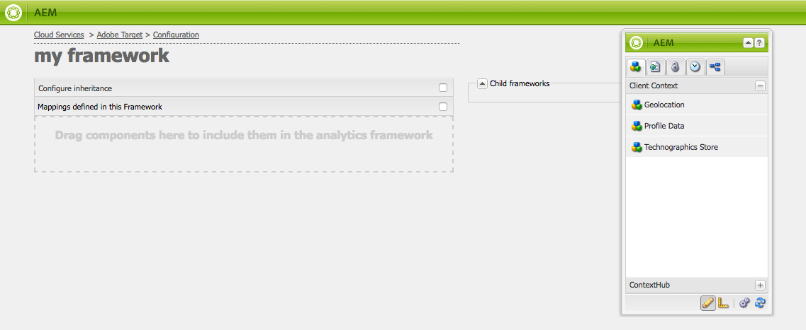

# Configuração manual da integração com a Adobe Target {#manually-configuring-the-integration-with-adobe-target}

Você pode modificar as configurações do assistente de aceitação que você fez ao usar o assistente ou pode fazer a integração manual com o Adobe Target sem usar o assistente.

## Modificação das configurações do Assistente de aceitação {#modifying-the-opt-in-wizard-configurations}

O assistente [de](/help/sites-administering/opt-in.md) aceitação que [integra AEM ao Adobe Target](/help/sites-administering/target.md) cria automaticamente uma configuração de nuvem de Públicos alvos chamada Configuração de Público alvo Provisionada. O assistente também cria uma estrutura de Público alvo para a configuração de nuvem chamada Provisioning Público alvo Framework. É possível modificar as propriedades da configuração e da estrutura da nuvem, se necessário.

Você também pode configurar o Adobe Target para usar o Adobe Target como a fonte do relatórios ao direcionar o conteúdo configurando a Configuração do Analytics Cloud A4T.

Para localizar a configuração de nuvem e a estrutura, navegue até **Cloud Services** por meio de **Ferramentas** > **Implantação** > **Nuvem**. ([http://localhost:4502/libs/cq/core/content/tools/cloudservices.html](http://localhost:4502/libs/cq/core/content/tools/cloudservices.html))Abaixo do Adobe Target, clique ou toque em **Mostrar configurações**.

### Propriedades de configuração do Público alvo provisionado {#provisioned-target-configuration-properties}

Os seguintes valores de propriedade são usados na configuração da nuvem Configuração de Público alvo Provisionada que o assistente de Aceitação cria:

* **Código do cliente:** Conforme inserido no assistente de aceitação.
* **E-mail:** Conforme inserido no assistente de aceitação.
* **Senha:** Conforme inserido no assistente de aceitação.
* **Tipo de API:** REST
* **Sincronizar segmentos do Adobe Target:** Selecionado.

* **Biblioteca do cliente:** mbox.js.
* **Use o DTM para fornecer a biblioteca do cliente:** Não selecionado. Selecione essa opção se você [usar o DTM](/help/sites-administering/dtm.md) ou outro sistema de gerenciamento de tags para hospedar o arquivo mbox.js ou AT.js. O Adobe recomenda usar o DTM em vez de AEM para fornecer a biblioteca.

* **Mbox.js personalizado:** Nenhum especificado para que o arquivo mbox.js padrão seja usado. Especifique um arquivo mbox.js personalizado para usar, conforme necessário. Será exibido somente se você tiver selecionado mbox.js.
* **AT.js personalizado:** Nenhum especificado para que o arquivo padrão AT.js seja usado. Especifique um arquivo AT.js personalizado para usar, conforme necessário. Será exibido somente se você tiver selecionado AT.js.

>[!NOTE]
>
>No AEM 6.3, você pode selecionar o arquivo da Biblioteca de Públicos alvos, [AT.JS](https://docs.adobe.com/content/help/en/target/using/implement-target/client-side/mbox-implement/mbox-download.html), que é uma nova biblioteca de implementação para Adobe Target projetada para implementações típicas da Web e aplicativos de página única.
>
>O AT.js oferta várias melhorias na biblioteca mbox.js:
>
>* Tempo de carregamento de página aprimorado para implementações da Web
>* Segurança aprimorada
>* Melhores opções de implementação para aplicativos de página única
>* O AT.js contém os componentes que foram incluídos no público alvo.js, portanto, não há mais uma chamada para público alvo.js

### Propriedades da estrutura de Públicos alvos provisionada {#provisioned-target-framework-properties}

A Estrutura de Públicos alvos Provisionada que o assistente de Aceitação cria é configurada para enviar dados de contexto do repositório de Dados do Perfil. Por padrão, os itens de dados de idade e gênero da loja são enviados ao Público alvo. Sua solução provavelmente exige que parâmetros adicionais sejam enviados.

Você pode configurar a estrutura para enviar informações de contexto adicionais ao Público alvo, conforme descrito em [Adicionar uma estrutura](/help/sites-administering/target-configuring.md#adding-a-target-framework)de Público alvo.

### Configuring A4T Analytics Cloud Configuration {#configuring-a-t-analytics-cloud-configuration}

Você pode configurar o Adobe Target para usar o Adobe Analytics como a fonte do relatórios ao direcionar conteúdo.

Para fazer isso, é necessário especificar a configuração da nuvem A4T para conectar a configuração da nuvem do Adobe Target com:

1. Navegue até **Cloud Services** por meio do logotipo **** AEM > **Ferramentas** > **Implantação** > **Cloud Services**.
1. Na seção **Adobe Target** , clique em **Configurar agora**.
1. Reconecte à sua configuração do Adobe Target.
1. No menu suspenso Configuração **do Analytics Cloud** A4T, selecione a estrutura.

   >[!NOTE]
   >
   >Somente as configurações de análise ativadas para A4T estão disponíveis.
   >
   >Ao configurar A4T com AEM, você pode ver uma entrada ausente de referência de Configuração. Para poder selecionar a estrutura de análise, faça o seguinte:
   >
   >1. Navegue até **Ferramentas** > **Geral** > **CRXDE Lite**.
   1. Navegue até **/libs/cq/analytics/components/testandtargetpage/dialog/items/tabs/items/tab1_general/items/a4tAnalyticsConfig**
   1. Defina a propriedade **disable** como **false**.
   1. Tap or click **Save All**.

   

   Clique em **OK**. Ao público alvo de conteúdo com o Adobe Target, você pode [selecionar sua fonte](/help/sites-authoring/content-targeting-touch.md)de relatórios.

## Manually Integrating with Adobe Target {#manually-integrating-with-adobe-target}

Integre manualmente com a Adobe Target em vez de usar o assistente de aceitação.

>[!NOTE]
O arquivo da Biblioteca de Públicos alvos, [AT.JS](https://docs.adobe.com/content/help/en/target/using/implement-target/client-side/mbox-implement/mbox-download.html), é uma nova biblioteca de implementação da Adobe Target projetada para implementações típicas da Web e aplicativos de página única. O Adobe recomenda usar o AT.js em vez do mbox.js como a biblioteca do cliente.
O AT.js oferta várias melhorias na biblioteca mbox.js:
* Tempo de carregamento de página aprimorado para implementações da Web
* Segurança aprimorada
* Melhores opções de implementação para aplicativos de página única
* O AT.js contém os componentes que foram incluídos no público alvo.js, portanto, não há mais uma chamada para público alvo.js

Você pode selecionar AT.js ou mbox.js no menu suspenso da biblioteca **do** cliente.

### Criando uma configuração da Público alvo Cloud {#creating-a-target-cloud-configuration}

Para permitir que o AEM interaja com o Adobe Target, crie uma configuração de nuvem de Público alvo. Para criar a configuração, forneça o código do cliente Adobe Target e as credenciais do usuário.

Você cria a configuração da nuvem de Públicos alvos somente uma vez, pois pode associar a configuração a várias campanhas AEM. Se você tiver vários códigos de cliente Adobe Target, crie uma configuração para cada código de cliente.

Você pode configurar a configuração da nuvem para sincronizar segmentos da Adobe Target. Se você ativar a sincronização, os segmentos serão importados do Público alvo em segundo plano assim que a configuração da nuvem for salva.

Use o seguinte procedimento para criar uma configuração de nuvem de Público alvo no AEM:

1. Navegue até **Cloud Services** por meio do logotipo **** AEM > **Ferramentas** > **Implantação** > **Cloud Services**. ([http://localhost:4502/libs/cq/core/content/tools/cloudservices.html](http://localhost:4502/libs/cq/core/content/tools/cloudservices.html))

   A página de visão geral do **Adobe Marketing Cloud** é aberta.

1. Na seção **Adobe Target** , clique em **Configurar agora**.
1. Na caixa de diálogo **Criar configuração** :

   1. Atribua à configuração um **Título**.
   1. Selecione o modelo de Configuração **do** Adobe Target.
   1. Clique em **Criar**.

   A caixa de diálogo de edição é aberta.

   

   >[!NOTE]
   Ao configurar A4T com AEM, você pode ver uma entrada ausente de referência de Configuração. Para poder selecionar a estrutura de análise, faça o seguinte:
   1. Navegue até **Ferramentas** > **Geral** > **CRXDE Lite**.
   1. Navegue até **/libs/cq/analytics/components/testandtargetpage/dialog/items/tabs/items/tab1_general/items/a4tAnalyticsConfig**
   1. Defina a propriedade **disable** como **false**.
   1. Tap or click **Save All**.

1. Na caixa de diálogo, forneça valores para essas propriedades.

   * **Código** do cliente: o código do cliente da conta do Público alvo
   * **E-mail**: o email da conta do Público alvo.
   * **Senha**: a senha da conta do Público alvo.
   * **Tipo** de API: REST ou XML
   * **Configuração** Analytics Cloud A4T: Selecione a configuração de nuvem do Analytics usada para as métricas e metas de atividade do público alvo. Isso é necessário se você estiver usando o Adobe Analytics como a fonte do relatórios ao direcionar o conteúdo. Se você não vir a configuração da nuvem, consulte a observação em [Configuração](#configuring-a-t-analytics-cloud-configuration)da A4T Analytics Cloud.

   * **Usar direcionamento preciso:** Por padrão, essa caixa de seleção é selecionada. Se selecionada, a configuração do serviço de nuvem aguardará o contexto ser carregado antes de carregar o conteúdo. Veja a seguir.
   * **Sincronizar segmentos do Adobe Target:** Selecione essa opção para baixar segmentos definidos no Público alvo para usá-los no AEM. Você deve selecionar essa opção quando a propriedade Tipo de API for REST, pois os segmentos em linha não são suportados e você sempre precisa usar os segmentos do Público alvo. (Observe que o termo AEM de &quot;segment&quot; equivale à &quot;audiência&quot; do Público alvo.)
   * **Biblioteca do cliente:** Selecione se deseja a biblioteca do cliente mbox.js ou AT.js.
   * **Usar o DTM para fornecer a biblioteca** do cliente - Selecione essa opção para usar o AT.js ou o mbox.js do DTM ou outro sistema de gerenciamento de tags. É necessário [configurar a integração](/help/sites-administering/dtm.md) do DTM para usar essa opção. O Adobe recomenda usar o DTM em vez de AEM para fornecer a biblioteca.
   * **Mbox.js** personalizado: Deixe em branco se você marcou a caixa do DTM ou para usar a mbox.js padrão. Como alternativa, carregue seu mbox.js personalizado. Será exibido somente se você tiver selecionado mbox.js.
   * **AT.js** personalizado: Deixe em branco se você marcou a caixa do DTM ou para usar o AT.js padrão. Como alternativa, carregue seu AT.js personalizado. Será exibido somente se você tiver selecionado AT.js.

   >[!NOTE]
   Por padrão, ao optar pelo assistente de configuração do Adobe Target, a Definição de metas precisa está ativada.
   Direcionamento preciso significa que a configuração do serviço de nuvem aguarda o contexto ser carregado antes de carregar o conteúdo. Como resultado, em termos de desempenho, o direcionamento preciso pode criar alguns milissegundos de atraso antes de carregar o conteúdo.
   A definição de metas precisa está sempre ativada na instância do autor. No entanto, na instância de publicação, você pode optar por desativar a definição de metas precisa globalmente, apagando a marca de seleção ao lado da Definição de metas precisa na configuração do serviço de nuvem (**http://localhost:4502/etc/cloudservices.html**). Você também pode ativar e desativar a definição de metas precisa para componentes individuais, independentemente de sua configuração na configuração do serviço de nuvem.
   Se você ***já*** criou componentes direcionados e alterar essa configuração, suas alterações não afetarão esses componentes. É necessário fazer alterações diretamente nesses componentes.

1. Clique em **Conectar-se ao Público alvo** para inicializar a conexão com o Público alvo. Se a conexão for bem-sucedida, será exibida a mensagem **Conexão bem-sucedida** . Clique em **OK** na mensagem e em **OK** na caixa de diálogo.

   Se não conseguir se conectar ao Público alvo, consulte a seção [solução de problemas](/help/sites-administering/target-configuring.md#troubleshooting-target-connection-problems) .

### Adicionar uma estrutura de Públicos alvos {#adding-a-target-framework}

Depois de configurar a configuração da nuvem de Públicos alvos, adicione uma estrutura de Públicos alvos. A estrutura identifica os parâmetros padrão que são enviados para a Adobe Target a partir dos componentes [Client Context](/help/sites-administering/client-context.md) ou [ContextHub](/help/sites-developing/ch-configuring.md) disponíveis. O público alvo usa os parâmetros para determinar os segmentos que se aplicam ao contexto atual.

Você pode criar várias estruturas para uma configuração de Público alvo único. Várias estruturas são úteis quando você precisa enviar um conjunto diferente de parâmetros ao Público alvo para diferentes seções do seu site. Crie uma estrutura para cada conjunto de parâmetros que você precisa enviar. Associe cada seção do seu site à estrutura apropriada. Observe que uma página da Web pode usar apenas uma estrutura por vez.

1. Na página de configuração do Público alvo, clique no sinal **+** (sinal de mais) ao lado de Estruturas disponíveis.
1. Na caixa de diálogo Criar estrutura, especifique um **Título**, selecione o **Adobe Target Framework** e clique em **Criar**.

   

   A página da estrutura é aberta. O Sidekick fornece componentes que representam informações do [Client Context](/help/sites-administering/client-context.md) ou do [ContextHub](/help/sites-developing/ch-configuring.md) que você pode mapear.

   

1. Arraste o componente Contexto do cliente que representa os dados que você deseja usar para mapear para o público alvo solto. Como alternativa, arraste **o componente da Loja** ContextHub para a estrutura.

   >[!NOTE]
   Ao mapear, os parâmetros são enviados para uma mbox por meio de strings simples. Não é possível mapear matrizes do ContextHub.

   Por exemplo, para usar os Dados **de** Perfil sobre os visitantes do site para controlar a campanha do Público alvo, arraste o componente Dados **do** Perfil para a página. As variáveis de dados de perfil disponíveis para mapeamento para parâmetros de Público alvo são exibidas.

   

1. Selecione as variáveis que deseja tornar visíveis para o sistema Adobe Target marcando a caixa de seleção **Compartilhar** nas colunas apropriadas.

   

   >[!NOTE]
   A sincronização de parâmetros é uma única maneira - do AEM ao Adobe Target.

Sua estrutura foi criada. Para replicar a estrutura para a instância de publicação, use a opção **Ativar estrutura** do sidekick.

### Associando o Atividade à configuração da Público alvo Cloud  {#associating-activities-with-the-target-cloud-configuration}

Associe suas [AEM atividades](/help/sites-authoring/activitylib.md) à configuração da nuvem do Público alvo para que você possa espelhar as atividades no [Adobe Target](https://docs.adobe.com/content/help/en/target/using/experiences/offers/manage-content.html).

>[!NOTE]
Os tipos de atividades disponíveis são determinados pelo seguinte:
* Se a opção **xt_only** estiver ativada no inquilino do Adobe Target (clientcode) usado no lado do AEM para se conectar ao Adobe Target, você poderá criar **apenas** atividades XT no AEM.

* Se a opção **xt_only** **não** estiver ativada no inquilino do Adobe Target (clientcode), você poderá criar **** atividades XT e A/B no AEM.

**Observação adicional:** a opção **xt_only** é uma configuração aplicada em um determinado inquilino do Target (clientcode) e só pode ser modificada diretamente no Adobe Target. Não é possível ativar ou desativar essa opção no AEM.

### Associando a estrutura do Público alvo ao seu site {#associating-the-target-framework-with-your-site}

Depois de criar uma estrutura de Público alvo no AEM, associe suas páginas da Web à estrutura. Os componentes direcionados nas páginas enviam os dados definidos pela estrutura para o Adobe Target para rastreamento. (Consulte Definição de metas [de conteúdo](/help/sites-authoring/content-targeting-touch.md).)

Quando você associa uma página à estrutura, as páginas secundárias herdam a associação.

1. No console **Sites** , navegue até o site que você deseja configurar.
1. Usando ações  rápidas ou o modo [de](/help/sites-authoring/basic-handling.md)seleção, selecione Propriedades da **Visualização.**
1. Selecione a guia **Cloud Services** .
1. Tap/click **Edit**.
1. Toque/clique em **Adicionar configuração** em Configurações **de** Cloud Service e selecione **Adobe Target**.

   

1. Selecione a estrutura desejada em Referência **** de configuração.

   >[!NOTE]
   Certifique-se de selecionar a **estrutura** específica que você criou e não a configuração da nuvem de Públicos alvos sob a qual ela foi criada.

1. Toque/clique em **Concluído**.
1. Ative a página raiz do site para replicá-lo no servidor de publicação. (Consulte [Como Publicar Páginas](/help/sites-authoring/publishing-pages.md).)

   >[!NOTE]
   Se a estrutura que você anexou à página ainda não foi ativada, um assistente será aberto, permitindo que você a publique também.

## Solução de problemas de conexão do Público alvo {#troubleshooting-target-connection-problems}

Execute as seguintes tarefas para solucionar problemas que ocorrem ao conectar-se ao Público alvo:

* Verifique se as credenciais de usuário fornecidas estão corretas.
* Verifique se a instância AEM pode se conectar ao servidor do Público alvo. Por exemplo, verifique se as regras de firewall não estão bloqueando conexões AEM de saída ou se AEM configurado para usar os proxies necessários.
* Procure mensagens úteis no registro de erros AEM. O arquivo error.log está localizado no diretório **crx-quickstart/logs** onde o AEM está instalado.
* Ao editar a atividade no Adobe Target, o URL aponta para localhost. Para contornar isso, configure o AEM externalizador para o URL correto.

