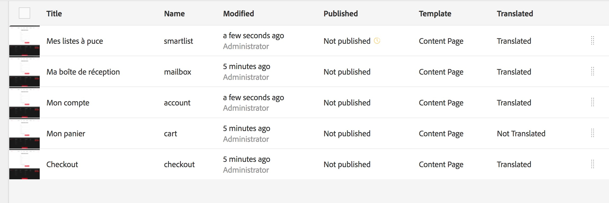

# Aprimoramentos de tradução{#translation-enhancements}

Esta página apresenta melhorias e refinamentos incrementais nos recursos de gerenciamento de tradução do AEM.

## Automação de projeto de tradução {#translation-project-automation}

Foram adicionadas opções para melhorar a produtividade, trabalhando com projetos de tradução, como promover e excluir automaticamente inicializações de tradução e agendar a execução recorrente de um projeto de tradução.

1. No seu projeto de tradução, clique nas reticências na parte inferior do bloco **Resumo da tradução**.

   

1. Alterne para a guia **Avançado**. Na parte inferior, você pode selecionar **Promover inicializações de tradução automaticamente**.

   

1. Como opção, é possível selecionar se, depois de receber conteúdo traduzido, as inicializações de tradução devem ser promovidas e excluídas automaticamente.

   

1. Para selecionar a execução recorrente de um projeto de tradução, selecione a frequência com a lista suspensa em **Repetir tradução**. A execução recorrente do projeto criará e executará automaticamente os trabalhos de tradução nos intervalos especificados.

   

## Projetos de tradução multilíngues {#multilingual-translation-projects}

É possível configurar vários idiomas de destino em um projeto de tradução para reduzir o número total de projetos de tradução criados.

1. No seu projeto de tradução, clique nos pontos na parte inferior do bloco **Resumo da tradução**.

   

1. Alterne para a guia **Avançado**. Você pode adicionar vários idiomas em **Idioma de Destino**.

   

1. Como alternativa, se você estiver iniciando a tradução por meio do painel de referências no Sites, adicione os idiomas e selecione **Criar projeto de tradução entre vários idiomas**.

   

1. Os trabalhos de tradução serão criados no projeto para cada idioma de destino. Eles podem ser iniciados um por um no projeto ou todos de uma vez, executando o projeto globalmente no Administrador de projetos.

   

## Atualizações da memória de tradução {#translation-memory-updates}

As edições manuais de conteúdo traduzido podem ser sincronizadas com o Sistema de gerenciamento de tradução (TMS) para treinar a memória de tradução.

1. No console Sites, depois de atualizar o conteúdo do texto em uma página traduzida, selecione **Atualizar memória de tradução**.

   

1. Uma exibição de lista mostra uma comparação lado a lado da origem e da tradução para cada componente de texto que foi editado. Selecione quais atualizações de tradução devem ser sincronizadas com a memória de tradução e selecione **Atualizar memória**.

   

O AEM atualiza a tradução dos segmentos existentes na memória de tradução do TMS configurado.

* A ação atualiza a tradução dos segmentos existentes na memória de tradução do TMS configurado.
* Isso não cria novos trabalhos de tradução.
* As traduções são enviadas de volta para o TMS, por meio da API de tradução do AEM (veja abaixo).

Para usar este recurso:

* Um TMS deve ser configurado para uso com o AEM.
* O conector precisa implementar o método [`storeTranslation`](https://developer.adobe.com/experience-manager/reference-materials/cloud-service/javadoc/com/adobe/granite/translation/api/TranslationService.html).
   * O código desse método determina o que acontece com a solicitação de atualização da memória de tradução.
   * A estrutura de tradução do AEM envia os pares de valores do segmento (tradução original e atualizada) para o TMS por meio da implementação desse método.

As atualizações da memória de tradução podem ser interceptadas e enviadas a um destino personalizado, nos casos em que uma memória de tradução própria for usada.

## Cópias de idioma em vários níveis {#language-copies-on-multiple-levels}

As raízes de idioma agora podem ser agrupadas em nós, por exemplo, por região, enquanto ainda são reconhecidas como raízes de cópias de idioma.

>[!CAUTION]
>
>Somente um nível é permitido. Por exemplo, o seguinte não permitirá a página &quot;es&quot; para resolver para uma cópia de idioma:
>
>* `/content/we-retail/language-masters/en`
>* `/content/we-retail/language-masters/americas/central-america/es`
>
>Esta cópia de idioma `es` não será detectada, pois tem 2 níveis (américas/américa central) longe do nó `en`.

>[!NOTE]
>
>As raízes de idioma podem ter qualquer nome de página, em vez de apenas o código ISO do idioma. O AEM sempre verificará o caminho e o nome primeiro, mas se o nome da página não identificar um idioma, o AEM verificará a propriedade cq:language da página para a identificação do idioma.

## Relatório do status da tradução {#translation-status-reporting}

Uma propriedade agora pode ser selecionada na exibição de lista dos sites que mostra se uma página foi traduzida, está em tradução ou ainda não foi traduzida. Para exibi-lo:

1. Em Sites, alterne para **Exibição em Lista.**

   

1. Clique em **Exibir configurações**.

   

1. Marque a caixa de seleção **Traduzido** em **Tradução** e clique em **Atualização**.

   

Agora você pode ver uma coluna **Traduzido** que mostra o status de tradução das páginas.

