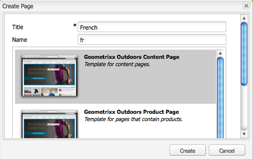

# Criar uma raiz de idioma usando a interface clássica{#creating-a-language-root-using-the-classic-ui}

O procedimento a seguir usa a interface clássica para criar uma raiz de idioma de um site. Para obter mais informações, consulte [Criar uma raiz de idioma](/help/sites-administering/tc-prep.md#creating-a-language-root).

1. No console Sites, na árvore Sites, selecione a página raiz do site. ([http://localhost:4502/siteadmin#](http://localhost:4502/siteadmin#))
1. Adicione uma nova página secundária que represente a versão de idioma do site:

   1. Clique em Nova > Nova página.
   1. Na caixa de diálogo, especifique o Título e o Nome. O Nome precisa estar no formato de `<language-code>` ou `<language-code>_<country-code>`, por exemplo, en, en_US, en_us, en_GB, en_gb.

      * O código de idioma suportado é o código de duas letras em letras minúsculas, conforme definido pelo ISO-639-1
      * O código de país suportado é o código de duas letras em letras minúsculas ou maiúsculas, conforme definido pela ISO 3166
   1. Selecione o modelo e clique em Criar.

   

1. No console Sites, na árvore Sites, selecione a página raiz do site.
1. No menu Ferramentas, selecione Cópia de idioma.

   

   A caixa de diálogo Cópia de idioma exibe uma matriz de versões de idioma e páginas da Web disponíveis. Um x em uma coluna de idioma significa que a página está disponível nesse idioma.

   

1. Para copiar uma página ou árvore de página existente para uma versão de idioma, selecione a célula para essa página na coluna de idioma. Clique na seta e selecione o tipo de cópia a ser criada.

   No exemplo a seguir, a página equipamento/óculos escuros/íris está sendo copiada para a versão em francês.

   

   | Tipo de cópia do idioma | Descrição |
   |---|---|
   | auto | Usa o comportamento de páginas principais |
   | ignore | Não cria uma cópia desta página e dos seus filhos |
   | `<language>+` (por exemplo, francês+) | Copia a página e todos os seus filhos desse idioma |
   | `<language>` (por exemplo, francês) | Copia somente a página desse idioma |

1. Clique em OK para fechar a caixa de diálogo.
1. Na próxima caixa de diálogo, clique em Sim para confirmar a cópia.
