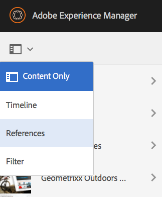
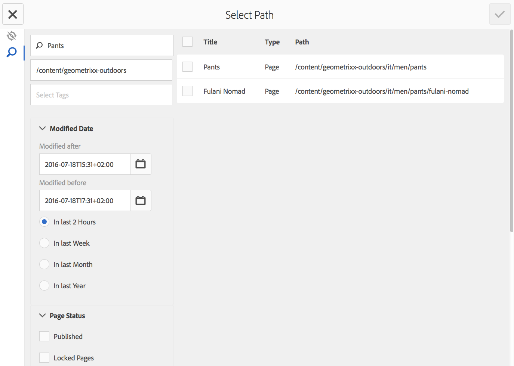
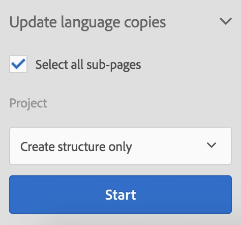

# Gerenciamento de projetos de tradução{#managing-translation-projects}

Depois de preparar o conteúdo para tradução, é necessário concluir a estrutura de idioma criando cópias de idioma ausentes e criar projetos de tradução.

Os projetos de tradução permitem gerenciar a tradução de conteúdo do AEM. Um projeto de tradução é um tipo de [projeto](/help/sites-authoring/projects.md) do AEM que contém recursos a serem traduzidos para outras línguas. Esses recursos são as páginas e os ativos das [cópias de idioma](/help/sites-administering/tc-prep.md) que são criadas a partir do idioma principal.

Quando os recursos são adicionados a um projeto de tradução, um trabalho de tradução é criado para eles. Os trabalhos fornecem comandos e informações de status que são usados para gerenciar os fluxos de trabalho de tradução humana e tradução automática que são executados nos recursos.

>[!NOTE]
>
>Um projeto de tradução pode conter vários trabalhos de tradução.

Os projetos de tradução são itens de longa duração, definidos pelo idioma e pelo método/provedor de tradução para entrar em conformidade com a governança organizacional no sentido da globalização. Eles devem ser iniciados uma vez, durante a tradução inicial ou manualmente, e devem permanecer em vigor durante as atividades de atualização de conteúdo e tradução.

Os projetos e os trabalhos de tradução são criados com fluxos de trabalho de preparação de tradução. Esses fluxos de trabalho têm três opções, tanto para a tradução inicial (Criar e traduzir) quanto para as atualizações (Atualizar tradução):

1. [Criar novo projeto](#creating-translation-projects-using-the-references-panel)
1. [Adicionar a um projeto existente](#adding-pages-to-a-translation-project)
1. [Somente a estrutura de conteúdo](#creating-the-structure-of-a-language-copy)

>[!NOTE]
>
>A opção 3 não está relacionada com o trabalho/projeto de tradução. Ela permite copiar o conteúdo e as alterações estruturais no idioma principal para as cópias de idioma (não traduzidas). Você pode usar isso para manter seus idiomas principais em sincronia, mesmo sem tradução.

## Executar traduções iniciais e atualizar traduções existentes {#performing-initial-translations-and-updating-existing-translations}

O AEM detecta se um projeto de tradução está sendo criado para a tradução inicial do conteúdo ou para atualizar cópias de idioma já traduzidas. Ao criar um projeto de tradução para uma página e indicar as cópias de idioma para as quais você está traduzindo, o AEM detecta se a página de origem já existe nas cópias de idioma escolhidas:

* **A cópia de idioma não inclui a página:** o AEM trata essa situação como a tradução inicial. A página é copiada imediatamente para a cópia de idioma e incluída no projeto. Quando a página traduzida é importada para o AEM, ele a copia diretamente para a cópia de idioma.
* **A cópia de idioma já inclui a página:** o AEM trata essa situação como uma tradução atualizada. Uma inicialização é criada, uma cópia da página é adicionada a ela e incluída no projeto. Inicializações permitem revisar as traduções atualizadas antes de confirmá-las na cópia de idioma:

   * Quando a página traduzida é importada para o AEM, ela substitui a página na inicialização.
   * A página traduzida substitui a cópia de idioma somente quando a inicialização é promovida.

Por exemplo, a raiz de idioma /content/geometrixx/fr é criada para a tradução em francês do idioma principal /content/geometrixx/en. Não há outras páginas na cópia de idioma em francês.

* Um projeto de tradução é criado para a página /content/geometrixx/en/products e todas as páginas secundárias, direcionado para a cópia de idioma em francês. Como a cópia de idioma não inclui a página /content/geometrixx/fr/products, o AEM copia imediatamente a página /content/geometrixx/en/products e todas as páginas secundárias para a cópia de idioma em francês. As cópias também são incluídas no projeto de tradução.
* Um projeto de tradução é criado para a página /content/geometrixx/en e todas as páginas secundárias, direcionado para a cópia de idioma em francês. Como a cópia de idioma inclui a página que corresponde à página /content/geometrixx/en (a raiz de idioma), o AEM copia a página /content/geometrixx/en e todas as páginas secundárias e as adiciona a uma inicialização. As cópias também são incluídas no projeto de tradução.

## Criação de projetos de tradução usando o painel de Referências {#creating-translation-projects-using-the-references-panel}

Crie projetos de tradução para poder executar e gerenciar o fluxo de trabalho de tradução dos recursos do seu idioma principal. Ao criar projetos, você especifica a página no idioma principal que está traduzindo e as cópias de idioma para as quais está executando a tradução:

* A configuração da nuvem da estrutura de integração de tradução associada à página selecionada determina muitas propriedades dos projetos de tradução, como o fluxo de trabalho de tradução a ser usado.
* Um projeto é criado para cada cópia de idioma selecionada.
* Uma cópia da página selecionada e dos ativos associados é criada e adicionada a cada projeto. Essas cópias são enviadas posteriormente ao provedor para tradução.

É possível especificar que as páginas secundárias da página selecionada também sejam selecionadas. Neste caso, cópias das páginas secundárias também são adicionadas a cada projeto para serem traduzidas. Quando qualquer página secundária é associada a diferentes configurações da estrutura de integração de tradução, o AEM cria projetos adicionais.

Também é possível [criar projetos de tradução manualmente](#creating-a-translation-project-using-the-projects-console).

>[!NOTE]
>
>Para criar um projeto, sua conta deve ser membro do grupo `project-administrators`.

**Traduções iniciais e atualização de traduções**

O painel de Referências indica se você está atualizando cópias de idioma existentes ou criando a primeira versão das cópias de idioma. Quando existe uma cópia de idioma para a página selecionada, a guia Atualizar cópias de idioma aparece para fornecer acesso aos comandos relacionados ao projeto.

Depois de traduzir, é possível [revisar a tradução](#reviewing-and-promoting-updated-content) antes de substituir a cópia de idioma por ela. Quando não existe uma cópia de idioma para a página selecionada, a guia Criar e traduzir aparece para fornecer acesso aos comandos relacionados ao projeto.

### Criar projetos de tradução para uma nova cópia de idioma {#create-translation-projects-for-a-new-language-copy}

1. Use o console de sites para selecionar a página que você está adicionando aos projetos de tradução.

   Por exemplo, para traduzir as páginas em inglês do Site de demonstração do Geometrixx, selecione Site de demonstração do Geometrixx > Inglês.

1. Na barra de ferramentas, clique em Referências.

   

1. Selecione Cópias de idioma e, em seguida, selecione as cópias de idioma para as quais você está traduzindo as páginas de origem.
1. Clique em Criar e traduzir e configure o trabalho de tradução:

   * Use a lista suspensa Idiomas para selecionar uma cópia de idioma para a qual deseja traduzir. Selecione idiomas adicionais, conforme necessário. Os idiomas exibidos na lista correspondem às [raízes de idioma que você criou](/help/sites-administering/tc-prep.md#creating-a-language-root).
   * Para traduzir a página selecionada e todas as páginas secundárias, selecione Selecionar todas as subpáginas. Para traduzir apenas a página selecionada, desmarque a opção.
   * Em Projeto, selecione Criar novo projeto de tradução.
   * Digite um nome para o projeto.

   

1. Clique em Criar.

### Criar projetos de tradução para uma cópia de idioma existente {#create-translation-projects-for-an-existing-language-copy}

1. Use o console de sites para selecionar a página que você está adicionando aos projetos de tradução.

   Por exemplo, para traduzir as páginas em inglês do Site de demonstração do Geometrixx, selecione Site de demonstração do Geometrixx > Inglês.

1. Na barra de ferramentas, clique em Referências.

   

1. Selecione Cópias de idioma e, em seguida, selecione as cópias de idioma para as quais você está traduzindo as páginas de origem.
1. Clique em Atualizar cópias de idioma e configure o trabalho de tradução:

   * Para traduzir a página selecionada e todas as páginas secundárias, selecione Selecionar todas as subpáginas. Para traduzir apenas a página selecionada, desmarque a opção.
   * Em Projeto, selecione Criar novo projeto de tradução.
   * Digite um nome para o projeto.

   

1. Clique em Start.

## Adicionar páginas a um projeto de tradução {#adding-pages-to-a-translation-project}

Depois de criar um projeto de tradução, é possível usar o painel Recursos para adicionar páginas ao projeto. Adicionar páginas é útil quando você está incluindo páginas de diferentes ramificações no mesmo projeto.

Ao adicionar páginas a um projeto de tradução, elas são incluídas em um novo trabalho de tradução. Também é possível [adicionar páginas a um trabalho existente](#adding-pages-assets-to-a-translation-job).

Assim como ao criar um projeto, ao adicionar páginas, cópias das páginas são adicionadas a uma inicialização quando necessário, para evitar a substituição de cópias de idioma existentes. (Consulte [Criação de projetos de tradução para cópias de idioma existentes](#performing-initial-translations-and-updating-existing-translations).)

1. Use o console de sites para selecionar a página que você está adicionando ao projeto de tradução.

   Por exemplo, para traduzir as páginas em inglês do Site de demonstração do Geometrixx, selecione Site de demonstração do Geometrixx > Inglês.

1. Na barra de ferramentas, clique em Referências.

   

1. Selecione Cópias de idioma e, em seguida, selecione as cópias de idioma para as quais você está traduzindo as páginas de origem.

   

1. Clique em Atualizar cópias de idioma e configure as propriedades:

   * Para traduzir a página selecionada e todas as páginas secundárias, selecione Selecionar todas as subpáginas. Para traduzir apenas a página selecionada, desmarque a opção.
   * Em Projeto, selecione Adicionar a um projeto de tradução existente.
   * Selecione o projeto.

   >[!NOTE]
   >
   >O idioma de destino definido no Projeto de tradução deve corresponder ao caminho da cópia de idioma, conforme mostrado no Painel de referências.

   

1. Clique em Start.

## Adicionar páginas/Assets a um trabalho de tradução {#adding-pages-assets-to-a-translation-job}

Você pode adicionar páginas, ativos, tags ou dicionários i18n à Tarefa de tradução do seu projeto de tradução. Para adicionar páginas ou ativos:

1. Na parte inferior do bloco Tarefa de tradução do seu projeto, clique nas reticências.

   

1. Clique em Adicionar e Páginas/Assets.

   

1. Selecione o item na extremidade superior da ramificação que deseja adicionar e clique no ícone de marca de seleção. É possível selecionar várias vezes.

   

1. Como alternativa, é possível selecionar o ícone de pesquisa para procurar facilmente por páginas ou ativos que deseja adicionar ao seu trabalho de tradução.

   

Suas páginas e/ou ativos são adicionados ao seu trabalho de tradução.

## Adicionar dicionários i18n a um trabalho de tradução {#adding-i-n-dictionaries-to-a-translation-job}

Você pode adicionar páginas, ativos, tags ou dicionários i18n à Tarefa de tradução do seu projeto de tradução. Para adicionar um dicionário i18n:

1. Na parte inferior do bloco Tarefa de tradução do seu projeto, clique nas reticências.

   

1. Clique em Adicionar e dicionário-I18N.

   

1. Selecione o **Diretório Raiz** e o dicionário (se necessário) que você deseja adicionar e selecione **Adicionar**.

   

1. Se solicitado, selecione a natureza da atualização:

   

Seu dicionário agora está em seu trabalho de tradução.

>[!NOTE]
>
>Para obter mais informações sobre dicionários i18n, leia [Usando o Translator para gerenciar dicionários](/help/sites-developing/i18n-translator.md).

## Adicionar tags a um trabalho de tradução {#adding-tags-to-a-translation-job}

Você pode adicionar páginas, ativos, tags ou dicionários i18n à Tarefa de tradução do seu projeto de tradução. Para adicionar tags:

1. Na parte inferior do bloco Tarefa de tradução do seu projeto, clique nas reticências.

   

1. Clique em Adicionar e, em seguida, em Tags.

   

1. Selecione as tags que deseja adicionar e clique no ícone de marca de seleção. É possível selecionar várias vezes.

   

Suas tags agora são adicionadas em seu trabalho de tradução.

## Visualizar detalhes do projeto de tradução {#seeing-translation-project-details}

O bloco Resumo da tradução contém as propriedades configuradas para um projeto de tradução. Além das [informações do projeto](/help/sites-authoring/projects.md#project-info) genéricas, a guia Tradução contém as propriedades específicas da tradução:

* Idioma do Source: o idioma das páginas que estão sendo traduzidas.
* Idioma de destino: o idioma para o qual as páginas estão sendo traduzidas.
* Método de tradução: o fluxo de trabalho de tradução. Há suporte para a Tradução humana ou a Tradução automática.
* Provedor de tradução: o provedor de serviços de tradução que está executando a tradução.
* Categoria de conteúdo: (tradução automática) a categoria de conteúdo usada para tradução.
* Configuração da nuvem: a configuração da nuvem para o conector do serviço de tradução usado no projeto.

Quando um projeto é criado usando o painel Recursos de uma página, essas propriedades são configuradas automaticamente com base nas propriedades da página de origem.

## Monitorar o status de um trabalho de tradução {#monitoring-the-status-of-a-translation-job}

O bloco Tarefa de tradução de um projeto fornece o status de um trabalho de tradução e o número de páginas e ativos no trabalho.

A tabela a seguir descreve cada status que um trabalho ou um item no trabalho podem ter:

| Status | Descrição |
|---|---|
| Rascunho | O trabalho de tradução não foi iniciado. Os trabalhos de tradução estarão no status de RASCUNHO quando forem criados. |
| Enviado | Os arquivos no trabalho de tradução têm esse status quando são enviados com sucesso para o serviço de tradução. Esse status pode ser ativado após os comandos Escopo da solicitação ou Iniciar serem executados. |
| Escopo solicitado | Para o fluxo de trabalho Tradução humana, os arquivos no trabalho foram enviados ao fornecedor de tradução para definição do escopo. Este status aparece após o comando Solicitar escopo ser executado. |
| Escopo concluído | O fornecedor definiu o escopo do trabalho de tradução. |
| Enviado para tradução | O proprietário do projeto aceitou o escopo. Esse status indica que o fornecedor de tradução deve começar a traduzir os arquivos na tarefa. |
| Tradução em andamento | Para uma tarefa, a tradução de um ou mais arquivos ainda não foi concluída. Para um item na tarefa, o item está sendo traduzido. |
| Traduzido | Para uma tarefa, a tradução de todos os arquivos está concluída. Para um item na tarefa, o item é traduzido. |
| Pronto para revisão | O item na tarefa é traduzido e o arquivo foi importado para o AEM. |
| Concluído | O proprietário do projeto indicou que o contrato de tradução está concluído. |
| Cancelar | Indica que o fornecedor de tradução deve parar de trabalhar em um trabalho de tradução. |
| Atualização de erro | Ocorreu um erro ao transferir arquivos entre o AEM e o serviço de tradução. |
| Estado desconhecido | Ocorreu um erro desconhecido. |

Para ver o status de cada arquivo no trabalho, clique nas reticências na parte inferior do bloco.

## Definir a data de vencimento dos trabalhos de tradução {#setting-the-due-date-of-translation-jobs}

Especifique a data antes da qual seu fornecedor de tradução precisa retornar os arquivos traduzidos. É possível definir a data de vencimento do projeto ou de uma ordem de produção específica:

* **Projeto:** os trabalhos de tradução no projeto herdam a data de vencimento.
* **Trabalho:** a data de vencimento definida para o trabalho substitui a data de vencimento definida para o projeto.

A configuração da data de vencimento funciona corretamente somente quando o fornecedor de tradução que você está usando aceita esse recurso.

O procedimento a seguir define a data de vencimento de um projeto.

1. Clique nas reticências na parte inferior do bloco Resumo da tradução.

   

1. Na guia Básico, use o seletor de datas da propriedade Data de vencimento para selecionar a data de vencimento.

   

1. Clique em Concluído.

O procedimento a seguir define a data de vencimento de um trabalho de tradução.

1. No bloco Tarefa de tradução, clique no menu de comandos e, em seguida, clique em Data de vencimento.

   

1. Na caixa de diálogo, clique no ícone de calendário e selecione a data e a hora a serem usadas como a data de vencimento e, em seguida, clique em Salvar.

   

## Escopo de um trabalho de tradução {#scoping-a-translation-job}

Determine o escopo de um trabalho de tradução para obter uma estimativa do custo da tradução do seu provedor de serviços de tradução. Ao determinar o escopo de um trabalho, os arquivos de origem são enviados ao fornecedor de tradução que compara o texto ao pool de traduções armazenadas (memória de tradução). Normalmente, o escopo é o número de palavras que exigem tradução.

Para obter mais informações sobre os resultados do escopo, entre em contato com seu fornecedor de tradução.

>[!NOTE]
>
>O escopo é opcional. Você pode iniciar um trabalho de tradução sem determinar o escopo.

Quando você escopo um trabalho de tradução, o status do trabalho é `Scope Requested`. Quando o fornecedor de tradução retorna o escopo, o status é alterado para `Scope Completed`. Quando o escopo for concluído, você poderá usar o comando Mostrar escopo para analisar os resultados do escopo.

O escopo funciona corretamente somente quando o fornecedor de tradução que você está usando aceita esse recurso.

1. No console de Projetos, abra o projeto de tradução.
1. No bloco Tarefa de tradução, clique no menu de comandos e, em seguida, clique em Solicitar escopo.

   

1. Quando o status da tarefa for alterado para SCOPE_COMPLETED, no bloco Tarefa de tradução, clique no menu de comandos e, em seguida, clique em Mostrar escopo.

## Iniciar um trabalho de tradução {#starting-a-translation-job}

Inicie um trabalho de tradução para traduzir as páginas de origem para o idioma de destino. A tradução é executada de acordo com os valores de propriedade do bloco Resumo da tradução.

Depois de iniciar o trabalho de tradução, o bloco Tarefa de tradução mostra o status Tradução em andamento.

1. No console de Projetos, abra o projeto de tradução.
1. No bloco Tarefa de tradução, clique no menu de comandos e em Iniciar.

   

1. Na caixa de diálogo Ação que confirma o início da tradução, clique em Fechar.

## Cancelar um trabalho de tradução {#canceling-a-translation-job}

Cancele um trabalho de tradução para interromper o processo e impedir que o fornecedor realize mais traduções. Você pode cancelar um trabalho quando ele tiver o status `Committed For Translation` ou `Translation In Progress`.

1. No console de Projetos, abra o projeto de tradução.
1. No bloco Tarefa de tradução, clique no menu de comandos e em Cancelar.
1. Na caixa de diálogo Ação que confirma o cancelamento da tradução, clique em OK.

## Aceitar/Rejeitar Fluxo de Trabalho {#accept-reject-workflow}

Quando o conteúdo retorna após a tradução e está com o status Pronto para revisão, é possível acessar o trabalho de tradução e aceitar/rejeitar o conteúdo.

Ao selecionar Rejeitar tradução, você terá a opção de adicionar um comentário.

Rejeitar o conteúdo o envia de volta ao fornecedor de tradução, onde ele poderá ver o comentário.

## Revisar e promover conteúdo atualizado {#reviewing-and-promoting-updated-content}

Quando o conteúdo for traduzido para uma cópia de idioma existente, revise as traduções, faça alterações se necessário e promova as traduções para movê-lo para a cópia de idioma. É possível revisar arquivos traduzidos quando o trabalho de tradução mostra o status Pronto para revisão.

1. Selecione a página no idioma principal, clique em Referências e, em seguida, clique em Cópias de idioma.
1. Clique na cópia de idioma a ser revisada.

   

1. Clique em Launch para revelar os comandos relacionados à inicialização.

   

1. Para abrir a cópia de inicialização da página com o objetivo de revisar e editar o conteúdo, clique em Abrir página.
1. Para promover a cópia de inicialização após ter revisado o conteúdo e feito as alterações necessárias, clique em Promover.
1. Na página Promover inicialização, especifique quais páginas serão promovidas e clique em Promover.

## Comparação de cópias de idioma {#comparing-language-copies}

Para comparar Cópias de idioma ao idioma principal:

1. No console **Sites**, navegue até a cópia de idioma que deseja comparar.
1. Abra o painel **[Referências](/help/sites-authoring/basic-handling.md#references)**.
1. No cabeçalho de **Cópias**, selecione **Cópias de idioma.**
1. Selecione a cópia de idioma específica e, em seguida, clique em **Comparar ao principal** ou **Comparar com anterior**, se aplicável.

   

1. As duas páginas (inicialização e origem) serão abertas lado a lado.

   Para obter informações completas sobre como usar este recurso, consulte [Diferencial de página](/help/sites-authoring/page-diff.md).

## Concluir e arquivar trabalhos de tradução {#completing-and-archiving-translation-jobs}

Conclua um trabalho de tradução depois de ter revisado os arquivos traduzidos do fornecedor. Para fluxos de trabalho de tradução humana, concluir uma tradução indica ao fornecedor que o contrato de tradução foi cumprido e que ele deve salvar a tradução na sua memória de tradução.

Após concluir o job, ele terá o status Concluído.

Arquive um trabalho de tradução depois que ele estiver concluído e você não precisar mais ver os detalhes de status do trabalho. Ao arquivar o trabalho, o bloco Tarefa de tradução é removido do projeto.

## Criar a estrutura de uma cópia de idioma {#creating-the-structure-of-a-language-copy}

Preencha sua cópia de idioma para que ela tenha conteúdo do idioma principal que você está traduzindo. Antes de preencher a cópia de idioma, é necessário ter [criado a raiz de idioma](/help/sites-administering/tc-prep.md#creating-a-language-root) da cópia do idioma.

1. Use o console Sites para selecionar a raiz do idioma principal que você está usando como a origem. Por exemplo, para traduzir as páginas em inglês do Site de demonstração do Geometrixx, selecione Conteúdo > Site de demonstração do Geometrixx > Inglês.
1. Na barra de ferramentas, clique em Referências.

   

1. Selecione Cópias de idioma e, em seguida, selecione as cópias de idioma que deseja preencher.

   

1. Clique em Atualizar cópias de idioma para revelar as ferramentas de tradução e configurar as propriedades:

   * Selecione a opção Selecionar todas as subpáginas.
   * Para Projeto, selecione Criar somente estrutura.

   

1. Clique em Start.

## Mover ou renomear uma página de origem {#move-source}

Se uma página de origem já traduzida precisar ser [renomeada ou movida](/help/sites-authoring/managing-pages.md#moving-or-renaming-a-page), a tradução da página novamente depois da movimentação criará uma cópia de idioma com base no novo nome/local da página. A cópia de idioma antiga baseada no nome/local anterior ainda existe. Para evitar isso, você pode usar a funcionalidade de cópia de idioma de atualização após a movimentação:

1. Mova uma página que tenha uma cópia de idioma.
1. Selecione a raiz da cópia de idioma.
1. Abra o painel **Referências**.
1. Selecione **Cópias de Idiomas**.
1. Selecione os idiomas de destino que deseja atualizar.
1. Selecione **Atualizar cópias de idioma**.

   

1. Clique em **Atualizar**. Uma [Inicialização](/help/sites-authoring/launches-promoting.md) será criada.
1. Navegue até a raiz de idioma necessária e selecione-a.
1. Usando o painel **Referências**, selecione **Inicializações**.

   

1. Clique na Inicialização criada e em **Promover inicialização**.

Agora, a página de origem foi movida e a cópia de idioma associada.

## Criação de um projeto de tradução usando o Console de projetos {#creating-a-translation-project-using-the-projects-console}

Você pode criar manualmente um projeto de tradução se preferir usar o console de Projetos.

>[!NOTE]
>
>Para criar um projeto, sua conta deve ser membro do grupo `projects-administrators`.

Ao criar manualmente um projeto de tradução, você deve fornecer valores para as seguintes propriedades relacionadas à tradução, além das [propriedades básicas](/help/sites-authoring/touch-ui-managing-projects.md#creating-a-project):

* **Nome:** Nome do projeto.
* **Idioma do Source:** O idioma do conteúdo de origem.
* **Idioma de Destino:** O idioma para o qual o conteúdo está sendo traduzido.
* **Método de Tradução:** Selecione Tradução Humana para indicar que a tradução deve ser executada manualmente.

1. Na barra de ferramentas do console Projetos, clique em Criar.
1. Selecione o modelo Projeto de tradução e clique em Próximo.
1. Insira valores para as propriedades Básicas.
1. Clique em Avançado e forneça valores para as propriedades relacionadas à tradução.
1. Clique em Criar. Na caixa de confirmação, clique em Concluído para retornar ao console de Projetos ou clique em Abrir projeto para abrir e começar a gerenciar o projeto.

## Exportar um trabalho de tradução {#exporting-a-translation-job}

É possível baixar o conteúdo de um trabalho de tradução, por exemplo, para enviar a um provedor de tradução que não esteja integrado ao AEM por meio de um conector ou para revisar o conteúdo.

1. No menu suspenso do bloco Tarefa de tradução, clique em Exportar.
1. Na caixa de diálogo Exportar, clique em Baixar arquivo exportado e, se necessário, use a caixa de diálogo do navegador da Web para salvar o arquivo.
1. Na caixa de diálogo Exportar, clique em Fechar.

## Importar um trabalho de tradução {#importing-a-translation-job}

Você pode importar conteúdo traduzido para AEM, por exemplo, quando seu provedor de tradução o envia para você porque não está integrado ao AEM por meio de um conector.

1. No menu suspenso do bloco Tarefa de tradução, clique em Importar.
1. Use a caixa de diálogo do navegador da web para selecionar o arquivo a ser importado.
1. Na caixa de diálogo Importar, clique em Fechar.
