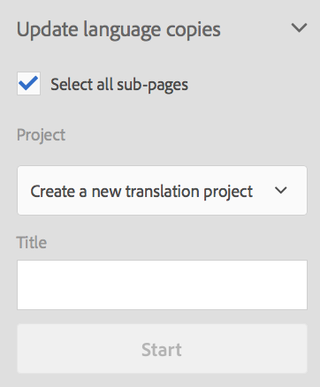
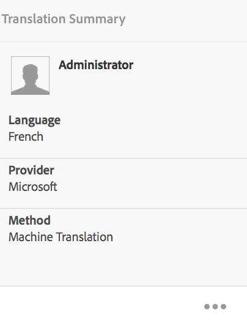
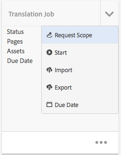
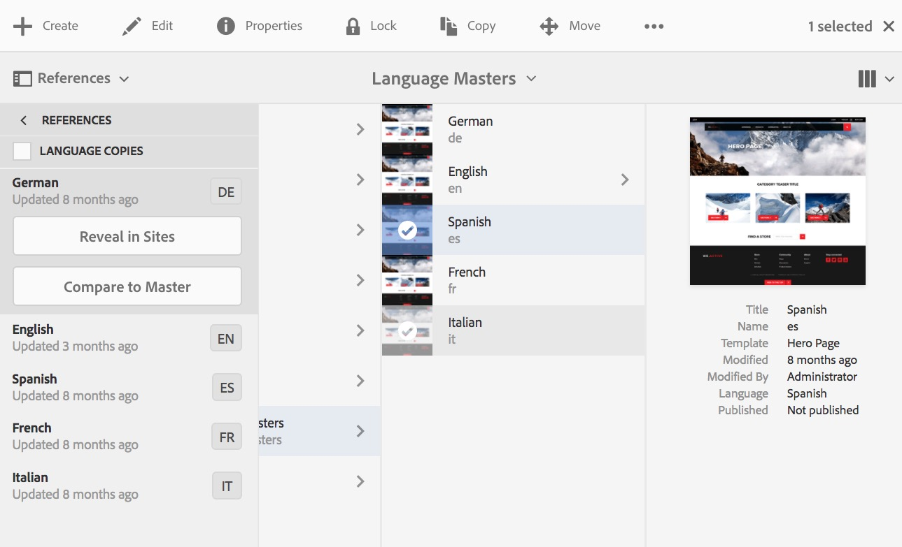

# Gerenciamento de projetos de tradução{#managing-translation-projects}

Após preparar o conteúdo para tradução, é necessário concluir a estrutura do idioma criando cópias de idioma ausentes e criar projetos de tradução.

Os projetos de tradução permitem gerenciar a tradução do conteúdo do AEM. Um projeto de tradução é um tipo de AEM [project](/help/sites-authoring/projects.md) que contém recursos que devem ser traduzidos para outros idiomas. Esses recursos são as páginas e os ativos das [cópias de idioma](/help/sites-administering/tc-prep.md) que são criadas a partir do mestre de idiomas.

Quando os recursos são adicionados a um projeto de tradução, um trabalho de tradução é criado para eles. Os trabalhos fornecem comandos e informações de status que você usa para gerenciar os workflows de tradução humana e tradução automática que são executados nos recursos.

>[!NOTE]
>
>Um projeto de tradução pode conter vários trabalhos de tradução.

Os projetos de tradução são itens de longa duração, definidos por idioma e método/provedor de tradução para alinhar-se à governança organizacional para a globalização. Eles devem ser iniciados uma vez, durante a tradução inicial ou manualmente, e permanecer em vigor durante as atividades de atualização de conteúdo e tradução.

Os projetos de tradução e os trabalhos são criados com fluxos de trabalho de preparação de tradução. Esses workflows têm três opções, tanto para a tradução inicial (Create&amp;Translate) quanto para as atualizações (Update Translation):

1. [Criar novo projeto](#creating-translation-projects-using-the-references-panel)
1. [Adicionar ao projeto existente](#adding-pages-to-a-translation-project)
1. [Somente a estrutura de conteúdo](#creating-the-structure-of-a-language-copy)

>[!NOTE]
>
>A opção 3 não está relacionada com o trabalho/projeto de tradução. Ele permite copiar o conteúdo e as alterações estruturais no idioma mestre para cópias de idioma (não traduzidas). Você pode usar isso para manter seus mestres em sincronia, mesmo sem tradução.

## Execução de traduções iniciais e atualização de traduções existentes {#performing-initial-translations-and-updating-existing-translations}

O AEM detecta se um projeto de tradução está sendo criado para a tradução inicial do conteúdo ou para atualizar cópias de idioma já traduzidas. Ao criar um projeto de tradução para uma página e indicar as cópias de idioma para as quais você está traduzindo, o AEM detecta se a página de origem já existe nas cópias de idioma direcionado:

* **A cópia de idioma não inclui a página:** o AEM trata essa situação como a tradução inicial. A página é copiada imediatamente para a cópia de idioma e incluída no projeto. Quando a página traduzida é importada para o AEM, o AEM a copia diretamente para a cópia de idioma.
* **A cópia de idioma já inclui a página:** o AEM trata essa situação como uma tradução atualizada. Um lançamento é criado e uma cópia da página é adicionada ao lançamento e incluída no projeto. Lançamentos permitem que você revise as traduções atualizadas antes de confirmá-las na cópia de idioma:

   * Quando a página traduzida é importada para o AEM, ela substitui a página na inicialização.
   * A página traduzida substitui a cópia de idioma somente quando o lançamento é promovido.

Por exemplo, a raiz de idioma /content/geometrixx/fr é criada para a tradução em francês do idioma mestre /content/geometrixx/en. Não há outras páginas na cópia em francês.

* Um projeto de tradução é criado para a página /content/geometrixx/en/products e para todas as páginas-filho, direcionando a cópia em francês. Como a cópia de idioma não inclui a página /content/geometrixx/fr/products , o AEM copia imediatamente a página /content/geometrixx/en/products e todas as páginas-filho para a cópia em francês. As cópias também são incluídas no projeto de tradução.
* Um projeto de tradução é criado para a página /content/geometrixx/en e para todas as páginas-filho, direcionando a cópia em francês. Como a cópia do idioma inclui a página que corresponde à página /content/geometrixx/en (a raiz do idioma), o AEM copia a página /content/geometrixx/en e todas as páginas filhas e as adiciona a um lançamento. As cópias também são incluídas no projeto de tradução.

## Criação de projetos de tradução usando o painel Referências {#creating-translation-projects-using-the-references-panel}

Crie projetos de tradução para que você possa executar e gerenciar o fluxo de trabalho para traduzir os recursos do seu mestre de idiomas. Ao criar projetos, especifique a página no idioma mestre que está sendo traduzido e as cópias de idioma para as quais você está executando a tradução:

* A configuração de nuvem da estrutura de integração de tradução associada à página selecionada determina muitas propriedades dos projetos de tradução, como o fluxo de trabalho de tradução a ser usado.
* Um projeto é criado para cada cópia de idioma selecionada.
* Uma cópia da página selecionada e dos ativos associados é criada e adicionada a cada projeto. Essas cópias são enviadas posteriormente para o provedor de tradução para tradução.

Você pode especificar que as páginas filhas da página selecionada também sejam selecionadas. Nesse caso, cópias das páginas filhas também são adicionadas a cada projeto para serem traduzidas. Quando qualquer página secundária é associada a diferentes configurações da estrutura de integração de tradução, o AEM cria projetos adicionais.

Você também pode [criar projetos de tradução manualmente](#creating-a-translation-project-using-the-projects-console).

>[!NOTE]
>
>Para criar um projeto, sua conta deve ser membro do grupo `project-administrators`.

**Traduções iniciais e atualização de traduções**

O painel Referências indica se você está atualizando cópias de idioma existentes ou criando a primeira versão das cópias de idioma. Quando existe uma cópia de idioma para a página selecionada, a guia Atualizar Cópias de idioma aparece para fornecer acesso aos comandos relacionados ao projeto.

Após a tradução, você pode [revisar a tradução](#reviewing-and-promoting-updated-content) antes de substituir a cópia de idioma por ela. Quando não existe uma cópia de idioma para a página selecionada, a guia Criar e traduzir aparece para fornecer acesso aos comandos relacionados ao projeto.

### Criar projetos de tradução para uma nova cópia de idioma {#create-translation-projects-for-a-new-language-copy}

1. Use o console Sites para selecionar a página que você está adicionando aos projetos de tradução.

   Por exemplo, para traduzir as páginas em inglês do Site de demonstração do Geometrixx, selecione Geometrixx Demo Site > Inglês.

1. Na barra de ferramentas, clique ou toque em Referências.

   

1. Selecione Cópias de idioma e, em seguida, selecione as cópias de idioma para as quais você está traduzindo as páginas de origem.
1. Clique ou toque em Criar e traduzir e configure o trabalho de tradução:

   * Use o menu suspenso Idiomas para selecionar uma cópia de idioma para a qual deseja traduzir. Selecione idiomas adicionais, conforme necessário. Os idiomas que aparecem na lista correspondem às raízes de idioma [que você criou](/help/sites-administering/tc-prep.md#creating-a-language-root).
   * Para traduzir a página selecionada e todas as páginas filhas, selecione Selecionar todas as subpáginas. Para traduzir apenas a página selecionada, desmarque a opção .
   * Para Projeto, selecione Criar novo projeto de tradução.
   * Digite um nome para o projeto.

   

1. Clique ou toque em Criar.

### Criar projetos de tradução para uma cópia de idioma existente {#create-translation-projects-for-an-existing-language-copy}

1. Use o console Sites para selecionar a página que você está adicionando aos projetos de tradução.

   Por exemplo, para traduzir as páginas em inglês do Site de demonstração do Geometrixx, selecione Geometrixx Demo Site > Inglês.

1. Na barra de ferramentas, clique ou toque em Referências.

   

1. Selecione Cópias de idioma e, em seguida, selecione as cópias de idioma para as quais você está traduzindo as páginas de origem.
1. Clique ou toque em Atualizar cópias de idioma e configure o trabalho de tradução:

   * Para traduzir a página selecionada e todas as páginas filhas, selecione Selecionar todas as subpáginas. Para traduzir apenas a página selecionada, desmarque a opção .
   * Para Projeto, selecione Criar novo projeto de tradução.
   * Digite um nome para o projeto.

   

1. Clique ou toque em Iniciar.

## Adicionar páginas a um projeto de tradução {#adding-pages-to-a-translation-project}

Depois de criar um projeto de tradução, você pode usar o painel Recursos para adicionar páginas ao projeto. Adicionar páginas é útil quando você está incluindo páginas de diferentes ramificações no mesmo projeto.

Quando você adiciona páginas a um projeto de tradução, as páginas são incluídas em um novo trabalho de tradução. Você também pode [adicionar páginas a um trabalho existente](#adding-pages-assets-to-a-translation-job).

Assim como ao criar um novo projeto, ao adicionar páginas, cópias das páginas são adicionadas a um lançamento quando necessário para evitar a substituição de cópias de idioma existentes. (Consulte [Criação de projetos de tradução para cópias de idioma existentes](#performing-initial-translations-and-updating-existing-translations).)

1. Use o console Sites para selecionar a página que você está adicionando ao projeto de tradução.

   Por exemplo, para traduzir as páginas em inglês do Site de demonstração do Geometrixx, selecione Geometrixx Demo Site > Inglês.

1. Na barra de ferramentas, clique ou toque em Referências.

   

1. Selecione Cópias de idioma e, em seguida, selecione as cópias de idioma para as quais você está traduzindo as páginas de origem.

   

1. Clique ou toque em Atualizar cópias de idioma e configure as propriedades:

   * Para traduzir a página selecionada e todas as páginas filhas, selecione Selecionar todas as subpáginas. Para traduzir apenas a página selecionada, desmarque a opção .
   * Para Projeto, selecione Adicionar ao Projeto de Tradução Existente.
   * Selecione o projeto.

   >[!NOTE]
   >
   >O idioma de destino definido no Projeto de tradução deve corresponder ao caminho da cópia de idioma, como mostrado no Painel de referências.

   

1. Clique ou toque em Iniciar.

## Adicionar páginas/ativos a um trabalho de tradução {#adding-pages-assets-to-a-translation-job}

Você pode adicionar páginas, ativos, tags ou dicionários do i18n ao trabalho de tradução do seu projeto de tradução. Para adicionar páginas ou ativos:

1. Na parte inferior do bloco Tarefa de tradução do seu projeto de tradução, clique ou toque nas reticências.

   

1. Clique ou toque em Adicionar e em Páginas/Ativos.

   

1. Selecione o item na extremidade superior da ramificação que deseja adicionar e clique ou toque no ícone de marca de seleção. É possível selecionar várias vezes.

   

1. Como alternativa, você pode selecionar o ícone de pesquisa para procurar facilmente páginas ou ativos que deseja adicionar ao seu trabalho de tradução.

   

Suas páginas e/ou ativos são adicionados ao seu trabalho de tradução.

## Adicionar dicionários i18n a um trabalho de tradução {#adding-i-n-dictionaries-to-a-translation-job}

Você pode adicionar páginas, ativos, tags ou dicionários do i18n ao trabalho de tradução do seu projeto de tradução. Para adicionar um dicionário i18n:

1. Na parte inferior do bloco Tarefa de tradução do seu projeto de tradução, clique ou toque nas reticências.

   

1. Clique ou toque em Adicionar e dicionário I18N.

   

1. Selecione o dicionário que deseja adicionar e clique ou toque no botão Adicionar .

   

Seu dicionário agora está em seu trabalho de tradução.

>[!NOTE]
>
>Para obter mais informações sobre os dicionários i18n, leia [Usar o tradutor para gerenciar dicionários](/help/sites-developing/i18n-translator.md).

## Adicionar tags a um trabalho de tradução {#adding-tags-to-a-translation-job}

Você pode adicionar páginas, ativos, tags ou dicionários do i18n ao trabalho de tradução do seu projeto de tradução. Para adicionar Tags:

1. Na parte inferior do bloco Tarefa de tradução do seu projeto de tradução, clique ou toque nas reticências.

   

1. Clique ou toque em Adicionar e em Tags.

   

1. Selecione as tags que deseja adicionar e clique ou toque no ícone de marca de seleção. É possível selecionar várias vezes.

   

Suas tags agora são adicionadas ao trabalho de tradução.

## Visualizando detalhes do projeto de tradução {#seeing-translation-project-details}

O bloco Resumo da tradução contém as propriedades que estão configuradas para um projeto de tradução. Além das [informações genéricas do projeto](/help/sites-authoring/projects.md#project-info), a guia Translation contém propriedades específicas de tradução:

* Idioma de Origem: O idioma das páginas que estão sendo traduzidas.
* Idioma de Destino: O idioma em que as páginas estão sendo traduzidas.
* Método de tradução: O fluxo de trabalho de tradução. Há suporte para Tradução Humana ou Tradução Automática.
* Provedor de Tradução: O provedor de serviços de tradução que está executando a tradução.
* Categoria de conteúdo: (Tradução automática) A categoria de conteúdo usada para tradução.
* Configuração da nuvem: A configuração de nuvem do conector do serviço de tradução usado para o projeto.

Quando um projeto é criado usando o painel Recursos de uma página, essas propriedades são configuradas automaticamente com base nas propriedades da página de origem.

## Monitorar o status de um trabalho de tradução {#monitoring-the-status-of-a-translation-job}

O bloco Tarefa de tradução de um projeto de Tradução fornece o status de um trabalho de tradução, bem como o número de páginas e ativos no trabalho.

A tabela a seguir descreve cada status que uma ordem de produção ou um item na ordem de produção pode ter:

| Status | Descrição |
|---|---|
| Rascunho | O trabalho de tradução não foi iniciado. Os trabalhos de tradução estão no status de RASCUNHO quando são criados. |
| Enviado | Os arquivos no trabalho de tradução têm esse status quando foram enviados com êxito para o serviço de tradução. Esse status pode ocorrer após o comando Request Scope ou o comando Start ser emitido. |
| Escopo solicitado | Para o fluxo de trabalho de Tradução Humana, os arquivos no trabalho foram enviados ao fornecedor de tradução para escopo. Esse status aparece após o comando Solicitar Escopo ser emitido. |
| Escopo concluído | O fornecedor esticou o trabalho de tradução. |
| Autorizado para tradução | O proprietário do projeto aceitou o escopo. Esse status indica que o fornecedor de tradução deve começar a traduzir os arquivos na tarefa. |
| Tradução Em Andamento | Para uma tarefa, a tradução de um ou mais arquivos na tarefa ainda não foi concluída. Para um item na tarefa, o item está sendo traduzido. |
| Traduzido | Para uma tarefa, a tradução de todos os ficheiros na tarefa está concluída. Para um item na tarefa, o item é traduzido. |
| Pronto Para Revisão | O item no trabalho é traduzido e o arquivo foi importado para o AEM. |
| Concluir | O proprietário do projeto indicou que o contrato de tradução está concluído. |
| Cancelar | Indica que o fornecedor de tradução deve parar de trabalhar em um trabalho de tradução. |
| Atualização de erro | Erro ao transferir arquivos entre o AEM e o serviço de tradução. |
| Estado desconhecido | Ocorreu um erro desconhecido. |

Para ver o status de cada arquivo no trabalho, clique ou toque nas reticências na parte inferior do bloco.

## Definindo a Data de Vencimento dos Trabalhos de Tradução {#setting-the-due-date-of-translation-jobs}

Especifique a data antes da qual seu fornecedor de tradução precisa retornar os arquivos traduzidos. É possível definir a data de vencimento do projeto ou de um trabalho específico:

* **Projeto:** os trabalhos de tradução no projeto herdam a data de vencimento.
* **Cargo:** A data de vencimento que você definiu para o trabalho substitui a data de vencimento que foi definida para o projeto.

A configuração da data de vencimento funciona corretamente somente quando o fornecedor de tradução que você está usando suporta esse recurso.

O procedimento a seguir define a data de vencimento de um projeto.

1. Clique ou toque nas reticências na parte inferior do bloco Resumo da tradução .

   

1. Na guia Básico , use o seletor de datas da propriedade Data de Vencimento para selecionar a data de vencimento.

   

1. Clique ou toque em Concluído.

O procedimento a seguir define a data de vencimento de um trabalho de tradução.

1. No bloco Tarefa de tradução, clique ou toque no menu de comandos e, em seguida, clique ou toque em Data de vencimento.

   

1. Na caixa de diálogo, clique ou toque no ícone de calendário, selecione a data e a hora a serem usadas como a data de vencimento e, em seguida, clique em Salvar.

   

## Escopo de um trabalho de tradução {#scoping-a-translation-job}

Escopo um trabalho de tradução para obter uma estimativa do custo da tradução do seu provedor de serviços de tradução. Quando você faz um escopo de um trabalho, os arquivos de origem são enviados ao fornecedor da tradução que compara o texto ao pool de traduções armazenadas (memória de tradução). Normalmente, o escopo é o número de palavras que exigem tradução.

Para obter mais informações sobre os resultados do escopo, entre em contato com seu fornecedor de tradução.

>[!NOTE]
>
>O escopo é opcional. Você pode iniciar um trabalho de tradução sem escopo.

Quando você cria um escopo de trabalho de tradução, o status do trabalho é `Scope Requested`. Quando o fornecedor de tradução retorna o escopo, o status é alterado para `Scope Completed`. Quando o escopo é concluído, você pode usar o comando Mostrar escopo para revisar os resultados do escopo.

O escopo funciona corretamente somente quando o fornecedor de tradução que você está usando suporta esse recurso.

1. No console Projetos , abra o projeto de tradução.
1. No bloco Tarefa de tradução, clique ou toque no menu de comandos e, em seguida, clique ou toque em Escopo da solicitação.

   

1. Quando o status da tarefa for alterado para SCOPE_COMPLETED, no bloco Tarefa de Tradução clique ou toque no menu de comandos e, em seguida, clique ou toque em Mostrar escopo.

## Iniciar um trabalho de tradução {#starting-a-translation-job}

Inicie um trabalho de tradução para traduzir as páginas de origem para o idioma de destino. A tradução é executada de acordo com os valores de propriedade do bloco Resumo da tradução .

Após iniciar o trabalho de tradução, o bloco Tarefa de tradução mostra o status Tradução em Andamento.

1. No console Projetos , abra o projeto de tradução.
1. No bloco Tarefa de tradução, clique ou toque no menu de comandos e, em seguida, clique ou toque em Iniciar.

   

1. Na caixa de diálogo Ação que confirma o início da tradução, clique ou toque em Fechar.

## Cancelar um trabalho de tradução {#canceling-a-translation-job}

Cancele um trabalho de tradução para interromper o processo de tradução e impedir que o fornecedor de tradução execute mais traduções. Você pode cancelar um trabalho quando ele tiver o status `Committed For Translation` ou `Translation In Progress` .

1. No console Projetos , abra o projeto de tradução.
1. No bloco Tarefa de tradução, clique ou toque no menu de comandos e, em seguida, clique ou toque em Cancelar.
1. Na caixa de diálogo Action que confirma o cancelamento da tradução, clique ou toque em OK.

## Aceitar/Rejeitar Fluxo de Trabalho {#accept-reject-workflow}

Quando o conteúdo volta após a tradução e está no status Pronto para revisão , você pode ir no trabalho de tradução e aceitar/rejeitar o conteúdo.

Se você selecionar Rejeitar tradução, terá a opção de adicionar um comentário.

Recusar o conteúdo o envia ao fornecedor de tradução, onde ele poderá ver o comentário.

## Revisar e promover conteúdo atualizado {#reviewing-and-promoting-updated-content}

Quando o conteúdo é traduzido para uma cópia de idioma existente, revise as traduções, faça alterações se necessário e promova as traduções para movê-lo para a cópia de idioma. Você pode revisar arquivos traduzidos quando o trabalho de tradução mostrar o status Pronto para Revisão .

1. Selecione a página no idioma mestre, clique ou toque em Referências e, em seguida, clique ou toque em Cópias de idioma.
1. Clique ou toque na cópia de idioma para revisar.

   

1. Clique ou toque em Launch para revelar os comandos relacionados ao lançamento.

   

1. Para abrir a cópia de lançamento da página para revisar e editar o conteúdo, clique em Abrir página.
1. Após ter revisado o conteúdo e feito as alterações necessárias, para promover a cópia de lançamento, clique em Promover.
1. Na página Promover lançamento , especifique quais páginas serão promovidas e clique ou toque em Promover.

## Comparando Cópias de Idioma {#comparing-language-copies}

Para comparar Cópias de idioma com o idioma mestre:

1. No console **Sites**, navegue até a cópia de idioma que deseja comparar.
1. Abra o painel **[Referências](/help/sites-authoring/basic-handling.md#references)**.
1. No cabeçalho **Cópias** selecione **Cópias de Idioma.**
1. Selecione a cópia de idioma específica e clique em **Comparar com mestre **ou **Comparar com anterior **se aplicável.

   

1. As duas páginas (lançamento e origem) serão abertas lado a lado.

   Para obter informações completas sobre como usar esse recurso, consulte [Diferencial de página](/help/sites-authoring/page-diff.md).

## Concluir e arquivar trabalhos de tradução {#completing-and-archiving-translation-jobs}

Conclua um trabalho de tradução depois de ter revisado os arquivos traduzidos do fornecedor. Para fluxos de trabalho de tradução humana, concluir uma tradução indica ao fornecedor que o contrato de tradução foi cumprido e que ele deve salvar a tradução na memória de tradução.

Após concluir o trabalho, ele terá o status Concluído .

Arquive um trabalho de tradução depois que ele estiver concluído e não será mais necessário ver os detalhes do status do trabalho. Quando você arquiva o trabalho, o bloco Tarefa de tradução é removido do projeto.

## Criar a estrutura de uma cópia de idioma {#creating-the-structure-of-a-language-copy}

Preencha a cópia de idioma para que ela contenha conteúdo da linguagem mestra que você está traduzindo. Antes de preencher a cópia de idioma, você deve ter [criado a raiz de idioma](/help/sites-administering/tc-prep.md#creating-a-language-root) da cópia de idioma.

1. Use o console Sites para selecionar a raiz de idioma do idioma mestre que você está usando como a fonte. Por exemplo, para traduzir as páginas em inglês do Site de demonstração do Geometrixx, selecione Conteúdo > Site de demonstração do Geometrixx > Inglês.
1. Na barra de ferramentas, clique ou toque em Referências.

   

1. Selecione Cópias de idioma e, em seguida, selecione as cópias de idioma que deseja preencher.

   

1. Clique ou toque em Atualizar cópias de idioma para revelar as ferramentas de tradução e configure as propriedades:

   * Selecione a opção Selecionar todas as subpáginas .
   * Para Projeto, selecione Criar somente estrutura.

   

1. Clique ou toque em Iniciar.

## Criação de um projeto de tradução usando o console Projetos {#creating-a-translation-project-using-the-projects-console}

Você pode criar manualmente um projeto de tradução se preferir usar o console Projetos .

>[!NOTE]
>
>Para criar um projeto, sua conta deve ser membro do grupo `project-administrators`.

Ao criar manualmente um projeto de tradução, você deve fornecer valores para as seguintes propriedades relacionadas à tradução, além das [propriedades básicas](/help/sites-authoring/touch-ui-managing-projects.md#creating-a-project):

* **Nome:** Nome do projeto.
* **Idioma de origem:** o idioma do conteúdo de origem.
* **Idioma de destino:** o idioma no qual o conteúdo está sendo traduzido.
* **Método de tradução:** selecione Tradução humana para indicar que a tradução deve ser executada manualmente.

1. Na barra de ferramentas do console Projetos , clique ou toque em Criar .
1. Selecione o modelo Projeto de tradução e clique ou toque em Próximo.
1. Insira valores para as propriedades Básicas.
1. Clique ou toque em Avançado e forneça valores para as propriedades relacionadas à tradução.
1. Clique ou toque em Criar. Na caixa de confirmação, clique ou toque em Concluído para retornar ao console Projetos ou clique ou toque em Abrir projeto para abrir e iniciar o gerenciamento do projeto.

## Exportar um trabalho de tradução {#exporting-a-translation-job}

Você pode baixar o conteúdo de um trabalho de tradução, por exemplo, para enviar a um provedor de tradução que não esteja integrado ao AEM por meio de um conector ou para revisar o conteúdo.

1. No menu suspenso do bloco Tarefa de tradução, clique ou toque em Exportar.
1. Na caixa de diálogo Exportar, clique ou toque em Baixar arquivo exportado e, se necessário, use a caixa de diálogo do navegador da Web para salvar o arquivo.
1. Na caixa de diálogo Exportar, clique ou toque em Fechar.

## Importando um trabalho de tradução {#importing-a-translation-job}

Você pode importar conteúdo traduzido para o AEM, por exemplo, quando seu provedor de tradução o envia para você porque não está integrado ao AEM por meio de um conector.

1. No menu suspenso do bloco Tarefa de tradução, clique ou toque em Importar.
1. Use a caixa de diálogo do navegador da Web para selecionar o arquivo a ser importado.
1. Na caixa de diálogo Importar, clique ou toque em Fechar.

