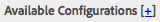

# Conexão com o Microsoft Translator{#connecting-to-microsoft-translator}

Crie uma configuração para o serviço em nuvem do Microsoft Translator para usar sua conta do Microsoft Translator para traduzir conteúdo da página do AEM, conteúdo da comunidade ou ativos.

| Propriedade | Descrição |
|---|---|
| Rótulo da tradução | O nome de exibição do serviço de tradução. |
| Atribuição da tradução | (Opcional) Para conteúdo gerado pelo usuário, a atribuição que aparece ao lado do texto convertido, por exemplo `Translations by Microsoft`. |
| ID da área de trabalho | (Opcional) A ID do mecanismo personalizado do Microsoft Translator a ser usado. |
| Chave de inscrição | Sua chave de Subscrição da Microsoft para o Microsoft Translator. |

Depois de criar a configuração, é necessário [ativá-la](/help/sites-administering/tc-msconf.md#activating-the-translator-service-configurations).

O procedimento a seguir usa a interface otimizada ao toque para criar uma configuração do Microsoft Translator.

1. No painel, clique ou toque em Ferramentas > Cloud Service.
1. Na área Microsoft Translator, clique ou toque em Mostrar configurações.
1. Clique no link + ao lado de Configurações disponíveis.

   

1. Digite um título para sua configuração. O título identifica a configuração no console Cloud Service, bem como nas listas suspensas de propriedade de página. O nome padrão é baseado no título. Opcionalmente, digite um nome a ser usado para o nó do repositório que armazena a configuração. Você deve usar o valor padrão para a propriedade Parent Configuration, que é o caminho do nó do repositório.
1. Clique em Criar.
1. Na caixa de diálogo que é exibida, digite os valores para as propriedades e clique em OK.

## Exemplos de configurações de Cloud Service do Microsoft Translator {#sample-microsoft-translator-cloud-service-configurations}

As seguintes configurações do serviço em nuvem do Microsoft Translator são instaladas com as amostras do Geometrixx. Algumas configurações de amostra usam uma conta Microsoft Translation de avaliação que permite no máximo 2.000.000 caracteres traduzidos gratuitos por mês.

### Licença de avaliação do Microsoft Translator {#microsoft-translator-trial-license}

A configuração da Licença de Avaliação do Microsoft Translator é uma amostra da configuração instalada com o pacote de amostra Geometrixx Outdoors. Esta configuração usa uma conta do Microsoft Translator que tem uma subscrição gratuita que permite 2.000.000 caracteres traduzidos por mês.

### Microsoft Translator Trial License - Geometrixx-outdoors {#microsoft-translator-trial-license-geometrixx-outdoors}

A configuração Microsoft Translator Trial License - Geometrixx-outdoors é uma configuração de amostra instalada com o Geometrixx Outdoors. Esta configuração usa a mesma conta gratuita do Microsoft Translator que a configuração da Licença de Avaliação do Microsoft Translator. A conta tem uma subscrição gratuita que permite 2 000 000 caracteres traduzidos por mês.

Essa configuração do Microsoft Translator é otimizada para uso com o tipo de conteúdo do site de amostra Geometrixx Outdoors.

### Atualizando A Configuração Da Licença De Avaliação Do Microsoft Translator {#upgrading-the-microsoft-translator-trial-license-configuration}

As páginas de configuração do Microsoft Translation fornecem um link conveniente ao site da Microsoft para obter uma subscrição de conta adequada para sistemas de produção.

1. No painel, clique ou toque em Ferramentas > Operações > Nuvem > Cloud Service.
1. Na área Microsoft Translator, clique ou toque em Mostrar configurações e, em seguida, clique ou toque em Licença de avaliação do Microsoft Translator (Configuração de tradução Microsoft).

   

1. Na página de configuração, clique em Atualizar Subscrição. Use a página da Web da Microsoft que é aberta para configurar sua conta.

   

### Personalizando seu Mecanismo Microsoft Translator {#customizing-your-microsoft-translator-engine}

As páginas de configuração do Microsoft Translator fornecem um link conveniente ao site da Microsoft para personalizar seu mecanismo do Microsoft Translator. ([https://hub.microsofttranslator.com](https://hub.microsofttranslator.com/))

1. No painel, clique ou toque em Ferramentas > Operações > Nuvem > Cloud Service.
1. Na área Microsoft Translator, clique ou toque em Mostrar configurações e, em seguida, clique ou toque na configuração que deseja personalizar.
1. Na página de configuração, clique em Personalizar tradutor. Use a página da Web da Microsoft que é aberta para personalizar seu serviço.

## Ativando as configurações do serviço de tradução {#activating-the-translator-service-configurations}

É necessário ativar as configurações do serviço de nuvem para suportar o conteúdo traduzido que é replicado para a instância de publicação. Use o método de [ativação de uma seção completa (árvore)](/help/sites-authoring/publishing-pages.md#publishing-and-unpublishing-a-tree) para ativar os nós do repositório que armazenam as configurações do serviço em nuvem do Microsoft Translator ou de terceiros. Os nós estão localizados abaixo dos seguintes nós principais:

* Serviço de Tradução da Microsoft: /libs/settings/cloudconfigs/Translation/msft-Translation
* Tradução de terceiros: /etc/cloudservices/tradução automática

