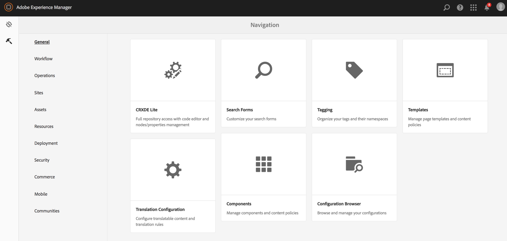
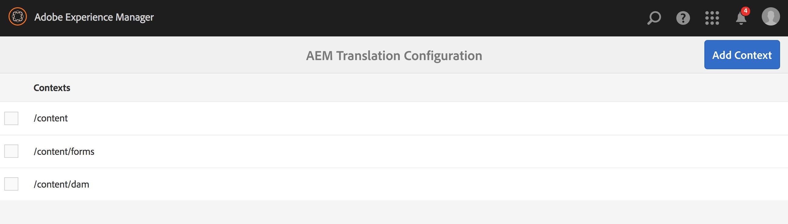
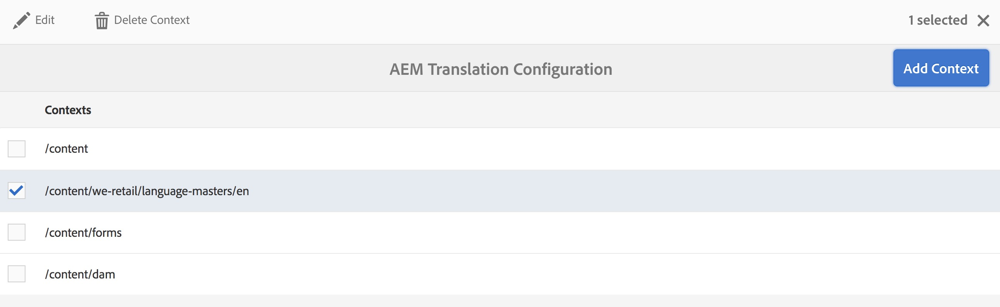
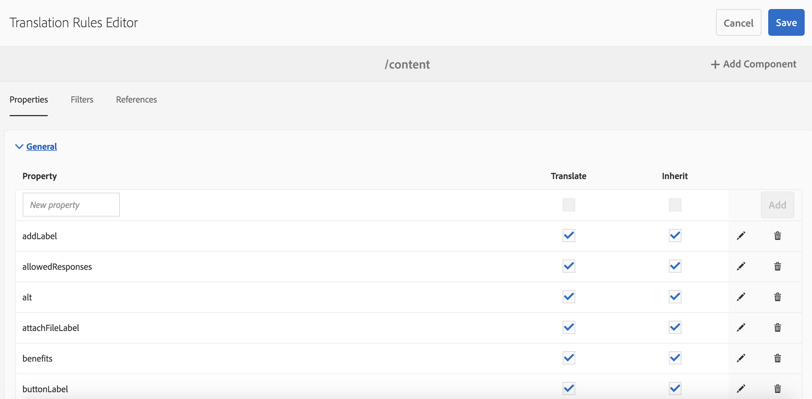
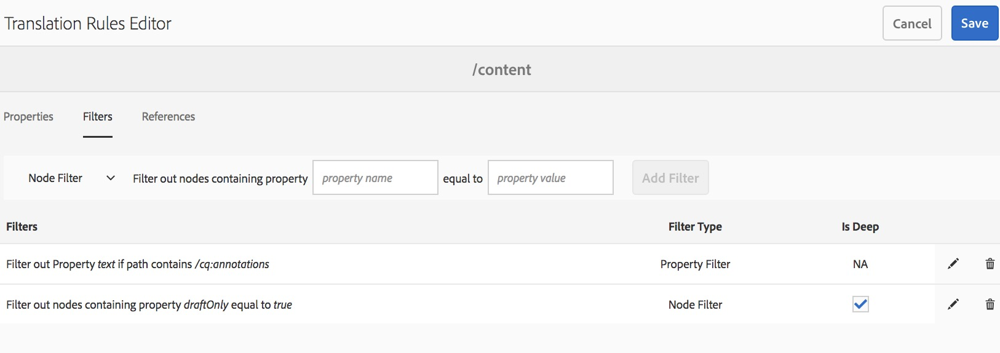
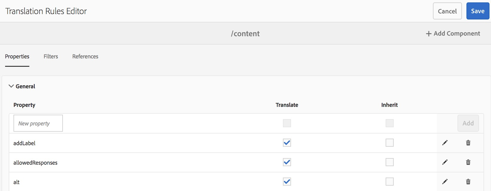
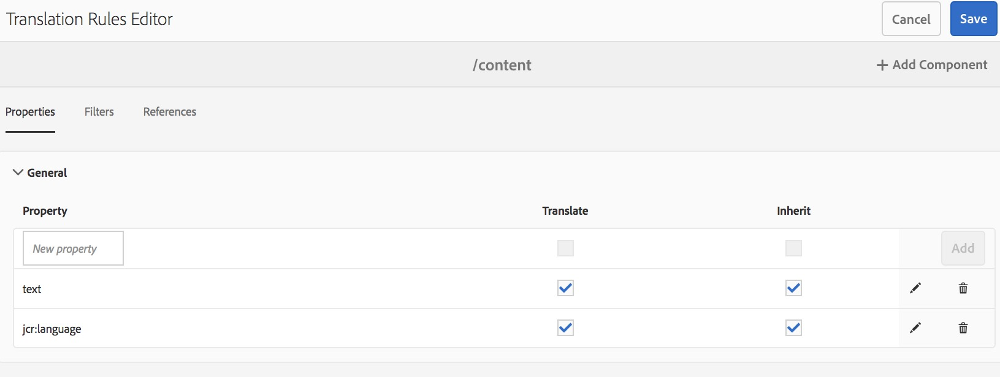

# Identificação de conteúdo a ser traduzido{#identifying-content-to-translate}

As regras de tradução identificam o conteúdo a ser traduzido para páginas, componentes e ativos que estão incluídos ou excluídos de projetos de tradução. Quando uma página ou ativo está sendo traduzido, o AEM extrai esse conteúdo para que ele possa ser enviado ao serviço de tradução.

As páginas e os ativos são representados como nós no repositório JCR. O conteúdo extraído é um ou mais valores de propriedade dos nós. As regras de tradução identificam as propriedades que contêm o conteúdo a ser extraído.

As regras de tradução são expressas em formato XML e armazenadas nesses locais possíveis:

* `/libs/settings/translation/rules/translation_rules.xml`
* `/apps/settings/translation/rules/translation_rules.xml`
* `/conf/global/settings/translation/rules/translation_rules.xml`

O arquivo se aplica a todos os projetos de tradução.

>[!NOTE]
>
>Após uma atualização para a versão 6.4, é recomendável mover o arquivo de /etc. Consulte [Reestruturação do repositório comum no AEM 6.5](/help/sites-deploying/all-repository-restructuring-in-aem-6-5.md#translation-rules) para obter mais detalhes.

As regras incluem as seguintes informações:

* O caminho do nó ao qual a regra se aplica. A regra também se aplica aos descendentes do nó.
* Os nomes das propriedades do nó que contêm o conteúdo a ser traduzido. A propriedade pode ser específica a um tipo de recurso específico ou a todos os tipos de recurso.

Por exemplo, você pode criar uma regra que traduza o conteúdo que os autores adicionam a todos os componentes de texto de base do AEM em suas páginas. A regra pode identificar o nó `/content` e a propriedade `text` do componente `foundation/components/text`.

Existe um [console](#translation-rules-ui) que foi adicionado para configurar regras de tradução. As definições na interface preencherão o arquivo para você.

Para obter uma visão geral dos recursos de tradução de conteúdo no AEM, consulte [Tradução de conteúdo para sites multilíngues](/help/sites-administering/translation.md).

>[!NOTE]
>
>O AEM é compatível com mapeamento de um para um entre os tipos de recursos e atributos de referência para a tradução de conteúdo referenciado em uma página.

## Sintaxe de regra para páginas, componentes e ativos {#rule-syntax-for-pages-components-and-assets}

Uma regra é um elemento `node` com um ou mais elementos filhos `property` e zero ou mais elementos `node` filhos:

```xml
<node path="content path">
          <property name="property name" [translate="false"]/>
          <node resourceType="component path" >
               <property name="property name" [translate="false"]/>
          </node>
</node>
```

Cada um desses elementos `node` têm as seguintes características:

* O atributo `path` contém o caminho para o nó raiz da ramificação à qual as regras se aplicam.
* Os elementos `property` filhos identificam as propriedades do nó a serem traduzidas para todos os tipos de recursos:

   * O atributo `name` contém o nome da propriedade.
   * O atributo opcional `translate` é igual a `false` se a propriedade não for traduzida. O valor padrão é `true`. Esse atributo é útil ao substituir regras anteriores.

* Os elementos `node` filhos identificam as propriedades do nó a serem traduzidas para tipos de recursos específicos:

   * O atributo `resourceType` contém o caminho que é resolvido para o componente que implementa o tipo de recurso.
   * Os elementos `property` filhos identificam a propriedade do nó a ser traduzida. Use este nó da mesma forma que os elementos `property` filhos para regras de nó.

A seguinte regra de exemplo faz com que o conteúdo de todas as propriedades `text` seja traduzido para todas as páginas abaixo do nó `/content`. A regra é válida para qualquer componente que armazene conteúdo em uma propriedade `text`, como o componente de texto de base e o componente de imagem de base.

```xml
<node path="/content">
          <property name="text"/>
</node>
```

O exemplo a seguir traduz o conteúdo de todas as propriedades `text` e também de outras propriedades do componente de Imagem de base. Se outros componentes tiverem propriedades com o mesmo nome, a regra não se aplica a eles.

```xml
<node path="/content">
      <property name="text"/>
      <node resourceType="foundation/components/textimage">
         <property name="image/alt"/>
         <property name="image/jcr:description"/>
         <property name="image/jcr:title"/>
      </node>
</node>
```

## Sintaxe de regra para extração de ativos de páginas  {#rule-syntax-for-extracting-assets-from-pages}

Use a sintaxe de regra a seguir para incluir ativos incorporados ou referenciados de componentes:

```xml
<assetNode resourceType="path to component" assetReferenceAttribute="property that stores asset"/>
```

Cada elemento `assetNode` tem as seguintes características:

* Um atributo `resourceType` que é igual ao caminho que é resolvido para o componente.
* Um atributo `assetReferenceAttribute` que é igual ao nome da propriedade que armazena o binário do ativo (para ativos incorporados) ou o caminho para o ativo referenciado.

O exemplo a seguir extrai imagens do componente de Imagem básico:

```xml
<assetNode resourceType="foundation/components/image" assetReferenceAttribute="fileReference"/>
```

## Substituição de regras {#overriding-rules}

O arquivo translation_rules.xml consiste em um elemento `nodelist` com vários elementos `node` filhos. O AEM lê a lista de nós de cima para baixo. Quando várias regras têm como alvo o mesmo nó, a regra que está mais abaixo no arquivo é usada. Por exemplo, as seguintes regras fazem com que todo o conteúdo das propriedades `text` seja traduzido, exceto para a ramificação `/content/mysite/en` de páginas:

```xml
<nodelist>
     <node path="/content">
           <property name="text" />
     </node>
     <node path="/content/mysite/en">
          <property name="text" translate="false" />
     </node>
<nodelist>
```

## Propriedades de filtro {#filtering-properties}

Você pode filtrar nós que têm uma propriedade específica usando um elemento `filter`.

Por exemplo, as seguintes regras fazem com que todo o conteúdo das propriedades `text` seja traduzido, exceto para os nós que têm a propriedade `draft` definida como `true`.

```xml
<nodelist>
    <node path="/content">
     <filter>
   <node containsProperty="draft" propertyValue="true" />
     </filter>
        <property name="text" />
    </node>
<nodelist>
```

## Interface das regras de tradução {#translation-rules-ui}

Um console também está disponível para configurar regras de tradução.

Para acessá-lo:

1. Navegue até **Ferramentas** e, em seguida, até **Geral**.

   

1. Selecione **Configurações de tradução**.

   

Aqui, você pode **Adicionar Contexto**. Isso permite adicionar um caminho.



Em seguida, é necessário selecionar o contexto e clicar em **Editar**. Isso abre o Editor de regras de tradução.



Há 4 atributos que você pode alterar por meio da interface: `isDeep`, `inherit`, `translate` e `updateDestinationLanguage`.

**isDeep** Este atributo é aplicável em filtros de nó e é verdadeiro por padrão. Ele verifica se o nó (ou seus antecessores) contém essa propriedade com o valor da propriedade especificado no filtro. Se for falso, ele só verifica o nó atual.

Por exemplo, os nós filhos são adicionados a um trabalho de tradução mesmo quando o nó pai tem a propriedade `draftOnly` definida como verdadeira para sinalizar o conteúdo de rascunho. `isDeep` verifica se os nós pai têm a propriedade `draftOnly` como verdadeira e exclui esses nós filhos.

No Editor, você pode marcar/desmarcar **É profundo** na guia **Filtros**.



Este é um exemplo do xml resultante quando **Is Deep** está desmarcado na interface:

```xml
 <filter>
    <node containsProperty="draftOnly" isDeep="false" propertyValue="true"/>
</filter>
```

**herdar** Aplicável às propriedades. Por padrão, cada propriedade é herdada, mas se você quiser que uma propriedade não seja herdada pelo nó secundário, poderá marcá-la como falsa para que seja aplicada somente a esse nó específico.

Na interface, você pode marcar/desmarcar **Herdar** na guia **Propriedades**.



**translate** O atributo translate é usado apenas para especificar se uma propriedade deve ser traduzida ou não.

Na interface, você pode marcar/desmarcar **Traduzir** na guia **Propriedades**.

**updateDestinationLanguage** Este atributo é usado para propriedades que não têm texto, mas códigos de idioma como `jcr:language`. O usuário não está traduzindo o texto, e sim convertendo a localidade do idioma da origem para o destino. Essas propriedades não são enviadas para tradução.

Na interface, você pode marcar/desmarcar **Traduzir** na guia **Propriedades**, mas para as propriedades específicas que têm códigos de idioma como valor.

Para ajudar a esclarecer a diferença entre `updateDestinationLanguage` e `translate`, veja um exemplo simples de um contexto com apenas duas regras:



O resultado no XML terá esta aparência:

```xml
<property inherit="true" name="text" translate="true" updateDestinationLanguage="false"/>
<property inherit="true" name="jcr:language" translate="false" updateDestinationLanguage="true"/>
```

## Editar o arquivo de regras manualmente {#editing-the-rules-file-manually}

O arquivo translation_rules.xml instalado com o AEM contém um conjunto padrão de regras de tradução. Você pode editar o arquivo para atender aos requisitos dos seus projetos de tradução. Por exemplo, você pode adicionar regras para que o conteúdo dos componentes personalizados seja traduzido.

Se você editar o arquivo translation_rules.xml, mantenha uma cópia de backup em um pacote de conteúdo. A instalação de service packs do AEM ou a reinstalação de determinados pacotes do AEM pode substituir o arquivo Translation_rules.xml atual pelo original. Para restaurar as regras nessa situação, você pode instalar o pacote que contém a cópia de backup.

>[!NOTE]
>
>Após criar o pacote de conteúdo, recrie-o sempre que editar o arquivo.

## Exemplo de arquivo de regras de tradução {#example-translation-rules-file}

```xml
<nodelist>
    <!-- translation rules for Geometrixx Demo site (example) -->
    <node path="/content/geometrixx">
        <!-- list all node properties that should be translated -->
        <property name="jcr:title" /> <!-- translation workflows running on content saved in /content/geometrixx, will extract jcr:title values independent of the component. -->
        <property name="jcr:description" />
        <node resourceType ="foundation/components/image"> <!-- translation workflows running on content saved in /content/geometrixx, will extract alternateText values only for Image component. -->
            <property name="alternateText"/>
        </node>
        <node resourceType ="geometrixx/components/title">
            <property name="richText"/>
            <property name="jcr:title" translate="false"/> <!-- translation workflows running on content saved in /content/geometrixx, will not extract jcr:title for Title component, but instead use richText. -->
        </node>
        <node pathContains="/cq:annotations">
            <property name="text" translate="false"/> <!-- translation workflows running on content saved in /content/geometrixx, will not extract text if part of cq:annotations node. -->
        </node>
    </node>
    <!-- translation rules for Geometrixx Outdoors site (example) -->
    <node path="/content/geometrixx-outdoors">
        <node resourceType ="foundation/components/image">
            <property name="alternateText"/>
            <property name="jcr:title" />
        </node>
        <node resourceType ="geometrixx-outdoors/components/title">
            <property name="richText"/>
        </node>
    </node>
    <!-- translation rules for ASSETS (example) -->
    <node path="/content/dam">
        <!-- configure list of metadata properties here -->
        <property name="dc:title" />
        <property name="dc:description" />
    </node>
    <!-- translation rules for extracting ASSETS from SITES content, configure all components that embed or reference assets -->
    <assetNode resourceType="foundation/components/image" assetReferenceAttribute="fileReference"/>
    <assetNode resourceType="foundation/components/video" assetReferenceAttribute="asset"/>
    <assetNode resourceType="foundation/components/download" assetReferenceAttribute="fileReference"/>
    <assetNode resourceType="foundation/components/mobileimage" assetReferenceAttribute="fileReference"/>
    <assetNode resourceType="wcm/foundation/components/image" assetReferenceAttribute="fileReference"/>
</nodelist>
```
