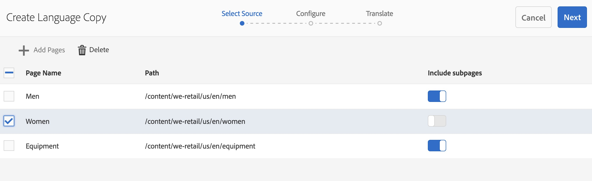

# Assistente de cópia de Idioma{#language-copy-wizard}

O assistente de Cópia de idioma é uma experiência guiada para criar e instrumentar a estrutura de conteúdo multilíngue. Agora é muito mais simples e rápido criar uma cópia de linguagem.

>[!NOTE]
>
>O usuário precisa ser membro do grupo de administradores de projetos para criar a Cópia de idioma de um site.

Para acessar este assistente:

1. No Sites, selecione uma página e toque/clique em Criar.

   

1. Selecione Cópia de idioma e o assistente será aberto.

   

1. A variável **Selecionar fonte** a etapa do assistente permite adicionar/remover páginas. Também há a opção de incluir ou excluir as subpáginas.

   

1. A variável **Próxima** O botão traz você para a **Configurar** etapa do assistente. Aqui você pode adicionar/remover idiomas e selecionar o método de tradução.

   

   >[!NOTE]
   >
   >Por padrão, há apenas uma configuração de tradução. Para poder selecionar outras configurações, é necessário definir as configurações de nuvem primeiro. Consulte [Configuração da estrutura de integração de tradução](/help/sites-administering/tc-tic.md).

1. A variável **Próxima** O botão traz você para a **Traduza** etapa do assistente. Aqui é possível escolher entre criar somente a estrutura, criar um projeto de tradução ou adicionar a um projeto de tradução existente.

   >[!NOTE]
   >
   >Se você selecionou vários idiomas na etapa anterior, vários projetos de tradução serão criados.

   

1. O botão **Criar** encerra o assistente.

   
