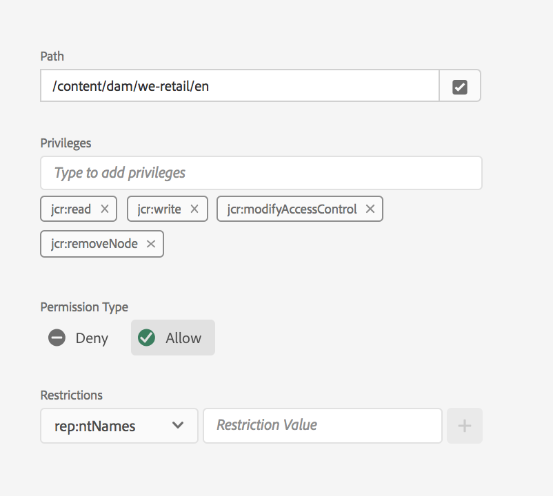

# Visualização principal para gerenciamento de permissões{#principal-view-for-permissions-management}

## Visão geral {#overview}

AEM 6.5 apresenta o Gerenciamento de permissões para usuários e grupos. A funcionalidade principal permanece a mesma da interface clássica, mas é mais fácil de usar e eficiente.

## Como usar {#how-to-use}

### Acessar a interface do usuário {#accessing-the-ui}

O novo gerenciamento de permissões baseado na interface do usuário é acessado por meio do cartão de permissões em Segurança, como mostrado abaixo:

A nova visualização facilita olhar para todo o conjunto de privilégios e restrições de um determinado principal em todos os caminhos onde as Permissões foram concedidas explicitamente. Isso elimina a necessidade de ir para

CRXDE para gerenciar privilégios e restrições avançados. Foi consolidado na mesma visualização. O padrão da visualização é o Grupo &quot;todos&quot;.

Existe um filtro que permite ao utilizador selecionar o tipo de principais para procurar **Utilizadores**, **Grupos** ou **Todos** e procurar qualquer principal **.**

### Exibindo Permissões para um Principal {#viewing-permissions-for-a-principal}

O quadro à esquerda permite que os usuários rolem para baixo para localizar qualquer principal ou pesquisar por um Grupo ou um Usuário com base no filtro selecionado, como mostrado abaixo:

Clicar no nome mostra as permissões atribuídas à direita. O painel de permissões mostra a lista de Entradas de Controle de acesso em caminhos específicos, juntamente com as restrições configuradas.

### Adicionando nova entrada de Controle de acesso para um Principal {#adding-new-access-control-entry-for-a-principal}

Novas permissões podem ser adicionadas adicionando uma nova entrada de controle de acesso clicando no botão Adicionar ACE.

Isso exibe a janela mostrada abaixo, a próxima etapa é escolher um caminho no qual a permissão precisa ser configurada.

Aqui, selecionamos um caminho onde queremos configurar uma permissão para **dam-users**:

Depois que o caminho é selecionado, o fluxo de trabalho volta para essa tela, onde o usuário pode selecionar um ou mais dos privilégios das namespaces disponíveis (como `jcr`, `rep` ou `crx`), conforme mostrado abaixo.

Os privilégios podem ser adicionados pesquisando-se usando o campo de texto e, em seguida, selecionando-se na lista.

>[!NOTE]
>
>Para obter uma lista completa de privilégios e descrições, consulte [esta página](/help/sites-administering/user-group-ac-admin.md#access-right-management).

 

Depois que a lista de privilégios é selecionada, o usuário pode escolher o Tipo de permissão: Negar ou Permitir, conforme mostrado abaixo.

 

### Usando restrições {#using-restrictions}

Além da lista de privilégios e do Tipo de permissão em um determinado caminho, essa tela também permite adicionar restrições ao controle de acesso de granulado fino, como mostrado abaixo:

>[!NOTE]
>
>Para obter mais informações sobre o que cada restrição significa, consulte [esta página](/help/sites-administering/user-group-ac-admin.md#restrictions).

As restrições podem ser adicionadas, como mostrado abaixo, escolhendo o tipo de restrição, inserindo o valor e pressionando o ícone **+**.  

A nova ECA é refletida na Lista do Controle de acesso, como mostrado abaixo. Observe que `jcr:write` é um privilégio agregação que inclui `jcr:removeNode` que foi adicionado acima, mas não é mostrado abaixo como está coberto em `jcr:write`.

### Editando ACEs {#editing-aces}

As Entradas de controle de acesso podem ser editadas selecionando um principal e escolhendo o ACE que você deseja editar.

Por exemplo, aqui podemos editar a entrada abaixo para **dam-users** clicando no ícone de lápis à direita:

A tela de edição é mostrada com ACEs configurados pré-selecionados, que podem ser excluídos clicando-se no ícone de cruz ao lado deles ou novos privilégios podem ser adicionados ao caminho fornecido, como mostrado abaixo.

Aqui estamos adicionando o privilégio `addChildNodes` para **dam-users** no caminho fornecido.

As alterações podem ser salvas clicando no botão **Salvar** no canto superior direito, e as alterações refletirão nas novas permissões para **dam-users **conforme mostrado abaixo:

### Excluindo ACEs {#deleting-aces}

As Entradas de controle de acesso podem ser excluídas para remover todas as permissões concedidas a um principal em um caminho específico. O ícone X ao lado da ECA pode ser usado para excluí-lo, como mostrado abaixo:

 

### Combinações de privilégios de interface clássica {#classic-ui-privilege-combinations}

Observe que a nova interface de usuário de permissões usa explicitamente o conjunto básico de privilégios em vez de combinações predefinidas que não refletem verdadeiramente os privilégios subjacentes exatos que foram concedidos.

Causou confusão sobre o que exatamente está sendo configurado. A tabela a seguir lista o mapeamento entre as combinações de privilégios da interface clássica e os privilégios reais que as constituem:

<table>
 <tbody>
  <tr>
   <th>Combinações de privilégios de interface clássica</th>
   <th>Privilégio da interface do usuário de permissões</th>
  </tr>
  <tr>
   <td>Leitura</td>
   <td><code>jcr:read</code></td>
  </tr>
  <tr>
   <td>Modificar</td>
   <td>
<code>jcr:modifyProperties</code>
 
<code>jcr:lockManagement</code>
 
<code>jcr:versionManagement</code>
 </td>
  </tr>
  <tr>
   <td>Criar</td>
   <td>
<code>jcr:addChildNodes</code>
 
<code>jcr:nodeTypeManagement</code>
 </td>
  </tr>
  <tr>
   <td>Excluir</td>
   <td>
<code>jcr:removeNode</code>
 
<code>jcr:removeChildNodes</code>
 </td>
  </tr>
  <tr>
   <td>Ler ACL</td>
   <td><code>jcr:readAccessControl</code></td>
  </tr>
  <tr>
   <td>Editar ACL</td>
   <td><code>jcr:modifyAccessControl</code></td>
  </tr>
  <tr>
   <td>Replicar</td>
   <td><code>crx:replicate</code></td>
  </tr>
 </tbody>
</table>

