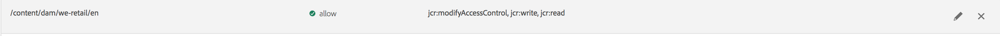

# Exibição principal para gerenciamento de permissões{#principal-view-for-permissions-management}

## Visão geral {#overview}

O AEM 6.5 apresenta o Gerenciamento de permissões para usuários e grupos. A funcionalidade principal permanece a mesma da interface clássica, mas é mais amigável e eficiente.

## Como usar {#how-to-use}

### Acesso à interface {#accessing-the-ui}

O novo gerenciamento de permissões com base na interface é acessado por meio do cartão Permissões, em Segurança, conforme mostrado abaixo:

A nova exibição facilita a análise de todo o conjunto de privilégios e restrições para uma determinada entidade de segurança em todos os caminhos nos quais as Permissões foram concedidas explicitamente. Isso elimina a necessidade de ir para

CRXDE para gerenciar privilégios e restrições avançados. Ela foi consolidada na mesma visão. A visualização assume como padrão o Grupo &quot;todos&quot;.

Há um filtro que permite ao usuário selecionar o tipo de entidades a serem observadas **Usuários**, **Grupos** ou **Todos** e pesquisar qualquer principal **.**

### Exibindo permissões para um Principal {#viewing-permissions-for-a-principal}

O quadro à esquerda permite que os usuários rolem para baixo para encontrar qualquer principal ou pesquisar por um Grupo ou um Usuário com base no filtro selecionado, conforme mostrado abaixo:

Clicar no nome mostra as permissões atribuídas à direita. O painel de permissões mostra a lista de Entradas de controle de acesso em caminhos específicos, juntamente com as restrições configuradas.

### Adicionando uma nova Entrada de Controle de Acesso para um Principal {#adding-new-access-control-entry-for-a-principal}

Para adicionar novas permissões, adicione uma nova Entrada de controle de acesso clicando no botão Adicionar ACE.

Isso exibe a janela mostrada abaixo. A próxima etapa é escolher um caminho em que a permissão precise ser configurada.

Aqui selecionamos um caminho para o qual queremos configurar uma permissão para **dam-users**:

Após selecionar o caminho, o fluxo de trabalho volta para essa tela, onde o usuário pode selecionar um ou mais privilégios dos namespaces disponíveis (como `jcr`, `rep` ou `crx`) conforme mostrado abaixo.

Os privilégios podem ser adicionados pesquisando usando o campo de texto e selecionando na lista.

>[!NOTE]
>
>Para obter uma lista completa de privilégios e descrições, consulte [esta página](/help/sites-administering/user-group-ac-admin.md#access-right-management).

 

Depois que a lista de privilégios for selecionada, o usuário poderá escolher o Tipo de permissão: Negar ou Permitir, conforme mostrado abaixo.

 

### Uso de restrições {#using-restrictions}

Além da lista de privilégios e do Tipo de permissão em um determinado caminho, essa tela também permite adicionar restrições para controle de acesso refinado, conforme mostrado abaixo:

>[!NOTE]
>
>Para obter mais informações sobre o que significa cada restrição, consulte [a documentação do Jackrabbit Oak](https://jackrabbit.apache.org/oak/docs/security/authorization/restriction.html).

As restrições podem ser adicionadas conforme mostrado abaixo, escolhendo o tipo de restrição, inserindo o valor e acessando o **+** ícone.

 

O novo ACE é refletido na Lista de controle de acesso conforme mostrado abaixo. Observe que `jcr:write` é um privilégio agregado que inclui `jcr:removeNode` que foi acrescentado acima, mas não é mostrado abaixo como seu coberto `jcr:write`.

### Edição de ACEs {#editing-aces}

As Entradas de controle de acesso podem ser editadas selecionando um principal e escolhendo o ACE que você deseja editar.

Por exemplo, aqui podemos editar a entrada abaixo para **dam-users** clicando no ícone de lápis à direita:

A tela de edição é exibida com ACEs configuradas pré-selecionadas, que podem ser excluídas clicando no ícone cruzado ao lado delas ou novos privilégios podem ser adicionados ao caminho fornecido, conforme mostrado abaixo.

Aqui, adicionamos a variável `addChildNodes` privilégio para **dam-users** no caminho fornecido.

As alterações podem ser salvas clicando no ícone **Salvar** no canto superior direito, e as alterações serão refletidas nas novas permissões para **dam-users** conforme mostrado abaixo:

### Exclusão de ACEs {#deleting-aces}

As Entradas de Controle de Acesso podem ser excluídas para remover todas as permissões concedidas a um principal em um caminho específico. O ícone X ao lado de ACE pode ser usado para excluí-lo, conforme mostrado abaixo:

 

### Combinações de Privilégios da Interface Clássica {#classic-ui-privilege-combinations}

Observe que a nova interface de permissões usa explicitamente o conjunto básico de privilégios em vez de combinações predefinidas que não refletiam verdadeiramente os privilégios subjacentes exatos que foram concedidos.

Causou confusão sobre o que exatamente está sendo configurado. A tabela a seguir lista o mapeamento entre as combinações de privilégios da interface clássica para os privilégios reais que as constituem:

<table>
 <tbody>
  <tr>
   <th>Combinações de Privilégios da Interface Clássica</th>
   <th>Privilégio de Permissões da Interface do Usuário</th>
  </tr>
  <tr>
   <td>Ler</td>
   <td><code>jcr:read</code></td>
  </tr>
  <tr>
   <td>Modificar</td>
   <td>
<code>jcr:modifyProperties</code>
 
<code>jcr:lockManagement</code>
 
<code>jcr:versionManagement</code>
 </td>
  </tr>
  <tr>
   <td>Criar</td>
   <td>
<code>jcr:addChildNodes</code>
 
<code>jcr:nodeTypeManagement</code>
 </td>
  </tr>
  <tr>
   <td>Excluir</td>
   <td>
<code>jcr:removeNode</code>
 
<code>jcr:removeChildNodes</code>
 </td>
  </tr>
  <tr>
   <td>Ler ACL</td>
   <td><code>jcr:readAccessControl</code></td>
  </tr>
  <tr>
   <td>Editar ACL</td>
   <td><code>jcr:modifyAccessControl</code></td>
  </tr>
  <tr>
   <td>Replicar</td>
   <td><code>crx:replicate</code></td>
  </tr>
 </tbody>
</table>
