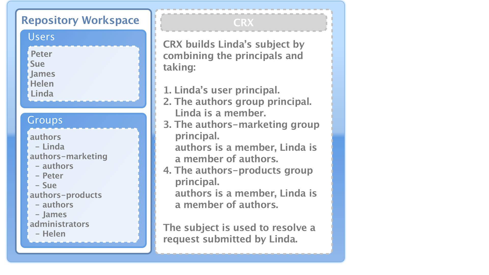
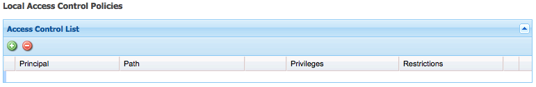

# Administração de usuários, grupos e direitos de acesso{#user-group-and-access-rights-administration}

A habilitação do acesso a um repositório CRX envolve vários tópicos:

* [Direitos de acesso](#how-access-rights-are-evaluated) - as noções de definição e de avaliação das mesmas
* [Administração do usuário](#user-administration) - gestão das contas individuais utilizadas para acesso
* [Administração de grupo](#group-administration) - simplificar o gerenciamento de usuários através da formação de grupos
* [Gerenciamento de direitos de acesso](#access-right-management) - definição de políticas que controlam como esses usuários e grupos podem acessar recursos

Os elementos básicos são:

**Contas de usuário** O CRX autentica o acesso identificando e verificando um usuário (por essa pessoa ou outro aplicativo) de acordo com os detalhes contidos na conta de usuário.

No CRX, cada conta de usuário é um nó no espaço de trabalho. Uma conta de usuário do CRX tem as seguintes propriedades:

* Ele representa um usuário do CRX.
* Ele contém um nome de usuário e senha.
* É aplicável a esse espaço de trabalho.
* Ele não pode ter subusuários. Para direitos de acesso hierárquicos, você deve usar grupos.

* Você pode especificar direitos de acesso para a conta de usuário.

   No entanto, para simplificar o gerenciamento, recomendamos que (na maioria dos casos) você atribua direitos de acesso a contas de grupo. A atribuição de direitos de acesso para cada usuário individual torna-se rapidamente muito difícil de gerenciar (as exceções são determinados usuários do sistema quando há apenas uma ou duas instâncias).

**Contas de grupo** As contas de grupo são coleções de usuários e/ou outros grupos. Eles são usados para simplificar o gerenciamento, pois uma alteração nos direitos de acesso atribuídos a um grupo é aplicada automaticamente a todos os usuários desse grupo. Um usuário não precisa pertencer a nenhum grupo, mas geralmente pertence a vários.

No CRX, um grupo tem as seguintes propriedades:

* Ele representa um grupo de usuários com direitos de acesso comuns. Por exemplo, autores ou desenvolvedores.
* É aplicável a esse espaço de trabalho.
* Pode ter membros; podem ser usuários individuais ou outros grupos.
* O agrupamento hierárquico pode ser obtido com relações de membro. Não é possível colocar um grupo logo abaixo de outro grupo no repositório.
* Você pode definir os direitos de acesso para todos os membros do grupo.

**Direitos de acesso** O CRX usa Direitos de acesso para controlar o acesso a áreas específicas do repositório.

Isso é feito atribuindo privilégios para permitir ou negar acesso a um recurso (nó ou caminho) no repositório. Como vários privilégios podem ser atribuídos, eles devem ser avaliados para determinar qual combinação é aplicável à solicitação atual.

O CRX permite configurar os direitos de acesso para contas de usuário e grupos. Os mesmos princípios básicos de avaliação são então aplicados a ambos.

## Como os direitos de acesso são avaliados {#how-access-rights-are-evaluated}

>[!NOTE]
>
>Implementações do CRX [controle de acesso conforme definido por JSR-283](https://www.adobe.io/experience-manager/reference-materials/spec/jcr/2.0/16_Access_Control_Management.html).
>
>Uma instalação padrão de um repositório CRX é configurada para usar listas de controle de acesso baseadas em recursos. Essa é uma possível implementação do controle de acesso JSR-283 e uma das implementações presentes com o Jackrabbit.

### Assuntos e princípios {#subjects-and-principals}

O CRX usa dois conceitos principais ao avaliar direitos de acesso:

* A **principal** é uma entidade que carrega direitos de acesso. Os principais incluem:

   * Uma conta de usuário
   * Uma conta de grupo

      Se uma conta de usuário pertencer a um ou mais grupos, ela também será associada a cada um desses principais grupos.

* A **assunto** é usada para representar a origem de uma solicitação.

   É usado para consolidar os direitos de acesso aplicáveis a essa solicitação. São retirados de:

   * O principal usuário

      Os direitos atribuídos diretamente à conta de usuário.

   * Todos os principais grupos associados a esse usuário

      Todos os direitos atribuídos a qualquer um dos grupos aos quais o usuário pertence.
   O resultado é então usado para permitir ou negar acesso ao recurso solicitado.

#### Compilando a lista de direitos de acesso de um assunto {#compiling-the-list-of-access-rights-for-a-subject}

No CRX, o assunto depende de:

* o principal usuário
* todos os principais do grupo associados a esse usuário

A lista de direitos de acesso aplicáveis ao assunto é construída a partir de:

* os direitos atribuídos diretamente à conta de usuário
* além de todos os direitos atribuídos a qualquer um dos grupos aos quais o usuário pertence



>[!NOTE]
>
>* O CRX não leva nenhuma hierarquia de usuário em consideração ao compilar a lista.
>* O CRX usa uma hierarquia de grupo somente quando você inclui um grupo como membro de outro grupo. Não há herança automática de permissões de grupo.
>* A ordem em que você especifica os grupos não afeta os direitos de acesso.
>


### Resolvendo Direitos de Solicitação e Acesso {#resolving-request-and-access-rights}

Quando o CRX lida com a solicitação, ele compara a solicitação de acesso do assunto com a lista de controle de acesso no nó do repositório:

Portanto, se Linda solicitar a atualização do `/features` na seguinte estrutura de repositório:


### Ordem de precedência {#order-of-precedence}

Os direitos de acesso no CRX são avaliados da seguinte maneira:

* Os principais usuários sempre têm precedência sobre os principais do grupo, independentemente de:

   * sua ordem na lista de controle de acesso
   * sua posição na hierarquia do nó

* Para um determinado principal existe (no máximo) 1 negação e 1 entrada de permissão em um determinado nó. A implementação sempre limpa entradas redundantes e garante que o mesmo privilégio não esteja listado nas entradas permitir e negar.

>[!NOTE]
>
>Esse processo de avaliação é adequado para o controle de acesso baseado em recursos de uma instalação padrão do CRX.

A tomar dois exemplos em que o usuário `aUser` é membro do grupo `aGroup`:

```xml
   + parentNode
     + acl
       + ace: aUser - deny - write
     + childNode
       + acl
         + ace: aGroup - allow - write
       + grandChildNode
```

No caso anterior:

* `aUser` não recebe permissão de gravação em `grandChildNode`.

```xml
   + parentNode
     + acl
       + ace: aUser - deny - write
     + childNode
       + acl
         + ace: aGroup - allow - write
         + ace: aUser - deny - write
       + grandChildNode
```

Nesse caso:

* `aUser` não recebe permissão de gravação em `grandChildNode`.
* O segundo ACE para `aUser` é redundante.

Os direitos de acesso de vários principais de grupo são avaliados com base em sua ordem, tanto na hierarquia quanto em uma única lista de controle de acesso.

### Práticas recomendadas     {#best-practices}

A tabela a seguir lista algumas recomendações e práticas recomendadas:

<table>
 <tbody>
  <tr>
   <td>Recomendação...</td>
   <td>Motivo...</td>
  </tr>
  <tr>
   <td><i>Usar grupos</i></td>
   <td><p>Evite atribuir direitos de acesso a cada usuário. Há várias razões para isso:</p>
    <ul>
     <li>Você tem muito mais usuários do que grupos, então os grupos simplificam a estrutura.</li>
     <li>Os grupos ajudam a fornecer uma visão geral de todas as contas.</li>
     <li>A herança é mais simples com os grupos.</li>
     <li>Os usuários vêm e vão. Grupos são de longo prazo.</li>
    </ul> </td>
  </tr>
  <tr>
   <td><i>Seja positivo</i></td>
   <td><p>Use sempre Permitir instruções para especificar os direitos de acesso do principal do grupo (sempre que possível). Evite usar uma instrução Negar .</p> <p>Os principais do grupo são avaliados em ordem, tanto na hierarquia quanto na ordem em uma única lista de controle de acesso.</p> </td>
  </tr>
  <tr>
   <td><i>Mantenha simples</i></td>
   <td><p>Investir algum tempo e pensar ao configurar uma nova instalação será bem reembolsado.</p> <p>A aplicação de uma estrutura clara simplificará a manutenção e a administração em curso, assegurando que tanto os seus atuais colegas como os futuros sucessores possam compreender facilmente o que está a ser implementado.</p> </td>
  </tr>
  <tr>
   <td><i>Testar</i></td>
   <td>Use uma instalação de teste para praticar e garantir que você entenda as relações entre os vários usuários e grupos.</td>
  </tr>
  <tr>
   <td><i>Usuários/grupos padrão</i></td>
   <td>Sempre atualize os Usuários e grupos padrão imediatamente após a instalação para ajudar a evitar problemas de segurança.</td>
  </tr>
 </tbody>
</table>

## Administração do usuário {#user-administration}

Uma caixa de diálogo padrão é usada para **Administração do usuário**.

Você deve estar conectado ao espaço de trabalho apropriado e, em seguida, pode acessar a caixa de diálogo de ambos:

* o **Administração do usuário** link no console principal do CRX
* o **Segurança** do CRX Explorer


**Propriedades**

* **UserID**

   Nome curto para a conta, usado ao acessar o CRX.

* **Nome Principal**

   Um nome de texto completo para a conta.

* **Senha**

   Necessário ao acessar o CRX com esta conta.

* **ntlmhash**

   Atribuído automaticamente a cada nova conta e atualizado quando a senha é alterada.

* É possível adicionar novas propriedades definindo um nome, tipo e valor. Clique em Salvar (símbolo de marca de verificação verde) para cada nova propriedade.

**Associação de Grupo**

Isso exibe todos os grupos aos quais a conta pertence. A coluna Herdado indica que a associação foi herdada como resultado da associação a outro grupo.

Clicar em um GroupID (quando disponível) abrirá o [Administração de grupo](#group-administration) para esse grupo.

**Personificadores**

Com a funcionalidade Representar , um usuário pode trabalhar em nome de outro usuário.

Isso significa que uma conta de usuário pode especificar outras contas (usuário ou grupo) que podem operar com sua conta. Em outras palavras, se o usuário-B tiver permissão para representar o usuário-A, o usuário-B poderá realizar ações usando os detalhes completos da conta do usuário-A (incluindo ID, nome e direitos de acesso).

Isso permite que as contas do representante concluam tarefas como se estivessem usando a conta que representam; por exemplo, durante uma ausência ou para compartilhar uma carga excessiva em curto prazo.

Se uma conta representar outra é muito difícil de ver. Os arquivos de log não contêm informações sobre o fato de que a representação ocorreu nos eventos. Portanto, se o usuário B estiver representando o usuário-A, todos os eventos parecerão ter sido executados pessoalmente pelo usuário-A.

### Criando uma conta de usuário {#creating-a-user-account}

1. Abra o **Administração do usuário** caixa de diálogo.
1. Clique em **Criar usuário**.
1. É possível inserir as Propriedades:

   * **UserID** usado como o nome da conta.
   * **Senha** necessário ao fazer logon.
   * **Nome Principal** para fornecer um nome textual completo.
   * **Caminho intermediário** que podem ser usadas para formar uma estrutura de árvore.

1. Clique em Salvar (símbolo de marca de verificação verde).
1. A caixa de diálogo será expandida para que você possa:

   1. Configurar **Propriedades**.
   1. Consulte **Associação de Grupo**.
   1. Definir **Representadores**.

>[!NOTE]
>
>Às vezes, pode-se observar uma perda de desempenho ao registrar novos usuários em instalações que têm um número alto de ambos:
>
>* usuários
>* grupos com muitos membros
>


### Atualizando uma conta de usuário {#updating-a-user-account}

1. Com o **Administração do usuário** abra a exibição de lista de todas as contas.
1. Navegue pela estrutura de árvore.
1. Clique na conta desejada para abrir para edição.
1. Faça uma alteração e clique em Salvar (símbolo de marca de verificação verde) para essa entrada.
1. Clique em **Fechar** para terminar, ou **Lista...** para retornar à lista de todas as contas de usuário.

### Remover uma conta de usuário {#removing-a-user-account}

1. Com o **Administração do usuário** abra a exibição de lista de todas as contas.
1. Navegue pela estrutura de árvore.
1. Selecione a conta desejada e clique em **Remover usuário**; a conta será excluída imediatamente.

>[!NOTE]
>
>Isso remove o nó desse principal do repositório.
>
>As entradas de direitos de acesso não são removidas. Isso garante a integridade histórica.

### Definição de propriedades {#defining-properties}

Você pode definir **Propriedades** para contas novas ou existentes:

1. Abra o **Administração do usuário** para a conta apropriada.
1. Defina um **Propriedade** nome.
1. Selecione o **Tipo** na lista suspensa.
1. Defina as **Valor**.
1. Clique em Salvar (símbolo de clique verde) para a nova propriedade.

As propriedades existentes podem ser excluídas com o símbolo de lixeira.

Com exceção da Senha, as propriedades não podem ser editadas, elas devem ser excluídas e recriadas.

#### Alterar a senha {#changing-the-password}

O **Senha** é uma propriedade especial que pode ser alterada clicando no botão **Alterar senha** link .

Você também pode alterar a senha para sua própria conta de usuário do **Segurança** no CRX Explorer.

### Definição de um representante {#defining-an-impersonator}

Você pode definir Representantes para contas novas ou existentes:

1. Abra o **Administração do usuário** para a conta apropriada.
1. Especifique a conta a ser permitida para representar essa conta.

   Você pode usar Procurar... para selecionar uma conta existente.

1. Clique em Salvar (símbolo de marca de verificação verde) para a nova propriedade.

## Administração de grupo {#group-administration}

Uma caixa de diálogo padrão é usada para **Administração de grupo**.

Você deve estar conectado ao espaço de trabalho apropriado e, em seguida, pode acessar a caixa de diálogo de ambos:

* o **Administração de grupo** link no console principal do CRX
* o **Segurança** do CRX Explorer


**Propriedades**

* **GroupID**

   Nome abreviado da conta de grupo.

* **Nome Principal**

   Um nome de texto completo para a conta de grupo.

* É possível adicionar novas propriedades definindo um nome, tipo e valor. Clique em Salvar (símbolo de marca de verificação verde) para cada nova propriedade.

* **Membros**

   Você pode adicionar usuários ou outros grupos como membros deste grupo.

**Associação de Grupo**

Isso exibe todos os grupos aos quais a conta de grupo atual pertence. A coluna Herdado indica que a associação foi herdada como resultado da associação a outro grupo.

Clicar em uma ID de grupo abrirá a caixa de diálogo desse grupo.

**Membros**

Lista todas as contas (usuários e/ou grupos) que são membros do grupo atual.

O **Herdado** indica a associação que foi herdada como resultado da associação a outro grupo.

>[!NOTE]
>
>Quando a função Proprietário, Editor ou Visualizador é atribuída a um usuário em qualquer pasta de Ativo, um novo grupo é criado. O nome do grupo é do formato `mac-default-<foldername>` para cada pasta na qual as funções são definidas.

### Criando uma conta de grupo {#creating-a-group-account}

1. Abra o **Administração de grupo** caixa de diálogo.
1. Clique em **Criar grupo**.
1. É possível inserir as Propriedades:

   * **Nome Principal** para fornecer um nome textual completo.
   * **Caminho intermediário** que podem ser usadas para formar uma estrutura de árvore.

1. Clique em Salvar (símbolo de marca de verificação verde).
1. A caixa de diálogo será expandida para que você possa:

   1. Configurar **Propriedades**.
   1. Consulte **Associação de Grupo**.
   1. Gerenciar **Membros**.

### Atualizando uma conta de grupo {#updating-a-group-account}

1. Com o **Administração de grupo** abra a exibição de lista de todas as contas.
1. Navegue pela estrutura de árvore.
1. Clique na conta desejada para abrir para edição.
1. Faça uma alteração e clique em Salvar (símbolo de marca de verificação verde) para essa entrada.
1. Clique em **Fechar** para terminar, ou **Lista...** para retornar à lista de todas as contas de grupo.

### Remover uma conta de grupo {#removing-a-group-account}

1. Com o **Administração de grupo** abra a exibição de lista de todas as contas.
1. Navegue pela estrutura de árvore.
1. Selecione a conta desejada e clique em **Remover grupo**; a conta será excluída imediatamente.

>[!NOTE]
>
>Isso remove o nó desse principal do repositório.
>
>As entradas de direitos de acesso não são removidas. Isso garante a integridade histórica.

### Definição de propriedades {#defining-properties-1}

Você pode definir Propriedades para contas novas ou existentes:

1. Abra o **Administração de grupo** para a conta apropriada.
1. Defina um **Propriedade** nome.
1. Selecione o **Tipo** na lista suspensa.
1. Defina as **Valor**.
1. Clique em Salvar (símbolo de marca de verificação verde) para a nova propriedade.

As propriedades existentes podem ser excluídas com o símbolo de lixeira.

### Membros {#members}

Você pode adicionar membros ao grupo atual:

1. Abra o **Administração de grupo** para a conta apropriada.
1. Ou:

   * Insira o nome do membro necessário (conta de usuário ou grupo).
   * Ou use **Procurar...** para pesquisar e selecionar o principal (conta de usuário ou grupo) que deseja adicionar.

1. Clique em Salvar (símbolo de marca de verificação verde) para a nova propriedade.

Ou exclua um membro existente com o símbolo da lixeira.

## Gerenciamento de direitos de acesso {#access-right-management}

Com o **Controle de acesso** da guia do CRXDE Lite, é possível definir as políticas de controle de acesso e atribuir os privilégios relacionados.

Por exemplo, para **Caminho atual** selecione o recurso desejado no painel esquerdo, na guia Controle de acesso no painel inferior direito:


As políticas são categorizadas de acordo com:

* **Políticas de Controle de Acesso Aplicáveis**

   Essas políticas podem ser aplicadas.

   Essas são políticas que estão disponíveis para criar uma política local. Depois de selecionar e adicionar uma política aplicável, ela se torna uma política local.

* **Políticas do controle de acesso local**

   Essas são políticas de controle de acesso que você aplicou. Em seguida, você pode atualizar, ordenar ou removê-los.

   Uma política local substituirá todas as políticas herdadas do pai.

* **Políticas do controle de acesso efetivo**

   Essas são as políticas de controle de acesso que agora estão em vigor para qualquer solicitação de acesso. Eles mostram as políticas agregadas derivadas das políticas locais e de qualquer herdada do pai.

### Seleção de Política {#policy-selection}

As políticas podem ser selecionadas para:

* **Caminho atual**

   Como no exemplo acima, selecione um recurso no repositório. As políticas para este &quot;caminho atual&quot; serão mostradas.

* **Repositório**

   Seleciona o controle de acesso no nível do repositório. Por exemplo, ao definir a variável `jcr:namespaceManagement` privilégio, que é relevante apenas para o repositório, não um nó.

* **Principal**

   Uma entidade principal registrada no repositório.

   Você pode digitar no **Principal** ou clique no ícone à direita do campo para abrir o **Selecionar Principal** caixa de diálogo.

   Isso permite **Pesquisar** para um **Usuário** ou **Grupo**. Selecione o principal necessário na lista resultante e clique em **OK** para retornar o valor à caixa de diálogo anterior.


>[!NOTE]
>
>Para simplificar o gerenciamento, recomendamos que você atribua direitos de acesso a contas de grupo, não a contas de usuário individuais.
>
>É mais fácil gerenciar alguns grupos do que muitas contas de usuário.

### Privilégios {#privileges}

Os seguintes privilégios estão disponíveis para seleção ao adicionar uma entrada de controle de acesso (consulte [API de segurança](https://docs.adobe.com/docs/en/spec/javax.jcr/javadocs/jcr-2.0/javax/jcr/security/Privilege.html) para mais informações):

<table>
 <tbody>
  <tr>
   <th><strong>Nome do Privilégio</strong></th>
   <th><strong>Que controla o privilégio para...</strong></th>
  </tr>
  <tr>
   <td><code>jcr:read</code></td>
   <td>Recupere um nó e leia suas propriedades e seus valores.</td>
  </tr>
  <tr>
   <td><code>rep:write</code></td>
   <td>Este é um privilégio agregado específico do jackrabbit de jcr:write e jcr:nodeTypeManagement.<br /> </td>
  </tr>
  <tr>
   <td><code>jcr:all</code></td>
   <td>Este é um privilégio agregado que contém todos os outros privilégios predefinidos.</td>
  </tr>
  <tr>
   <td><strong>Avançado </strong></td>
   <td> </td>
  </tr>
  <tr>
   <td><code>crx:replicate</code></td>
   <td>Execute a replicação de um nó.</td>
  </tr>
  <tr>
   <td><code>jcr:addChildNodes</code></td>
   <td>Crie nós filho de um nó.</td>
  </tr>
  <tr>
   <td><code>jcr:lifecycleManagement</code></td>
   <td>Execute operações de ciclo de vida em um nó.</td>
  </tr>
  <tr>
   <td><code>jcr:lockManagement</code></td>
   <td>Bloquear e desbloquear um nó; atualizar um bloqueio.</td>
  </tr>
  <tr>
   <td><code>jcr:modifyAccessControl</code></td>
   <td>Modifique as políticas de controle de acesso de um nó.</td>
  </tr>
  <tr>
   <td><code>jcr:modifyProperties</code></td>
   <td>Crie, modifique e remova as propriedades de um nó.</td>
  </tr>
  <tr>
   <td><code>jcr:namespaceManagement</code></td>
   <td>Registrar, cancelar o registro e modificar definições de namespace.</td>
  </tr>
  <tr>
   <td><code>jcr:nodeTypeDefinitionManagement</code></td>
   <td>Importe definições de tipo de nó para o repositório.</td>
  </tr>
  <tr>
   <td><code>jcr:nodeTypeManagement</code></td>
   <td>Adicione e remova tipos de nó mixin e altere o tipo de nó primário de um nó. Isso também inclui chamadas para métodos de importação Node.addNode e XML, onde o mixin ou o tipo primário do novo nó é explicitamente especificado.</td>
  </tr>
  <tr>
   <td><code>jcr:readAccessControl</code></td>
   <td>Leia a política de controle de acesso de um nó.</td>
  </tr>
  <tr>
   <td><code>jcr:removeChildNodes</code></td>
   <td>Remova nós filhos de um nó.</td>
  </tr>
  <tr>
   <td><code>jcr:removeNode</code></td>
   <td>Remova um nó.</td>
  </tr>
  <tr>
   <td><code>jcr:retentionManagement</code></td>
   <td>Execute operações de gerenciamento de retenção em um nó.</td>
  </tr>
  <tr>
   <td><code>jcr:versionManagement</code></td>
   <td>Execute operações de controle de versão em um nó.</td>
  </tr>
  <tr>
   <td><code>jcr:workspaceManagement</code></td>
   <td>A criação e exclusão de espaços de trabalho por meio da API JCR.</td>
  </tr>
  <tr>
   <td><code>jcr:write</code></td>
   <td>Este é um privilégio de agregação que contém:<br /> - jcr:modifyProperties<br /> - jcr:addChildNodes<br /> - jcr:removeNode<br /> - jcr:removeChildNodes</td>
  </tr>
  <tr>
   <td><code>rep:privilegeManagement</code></td>
   <td>Registrar novo privilégio.</td>
  </tr>
 </tbody>
</table>

### Registrar Novos Privilégios {#registering-new-privileges}

Também é possível registrar novos privilégios:

1. Na barra de ferramentas, selecione **Ferramentas**, em seguida **Privilégios** para exibir os privilégios registrados no momento.

   

1. Use o **Privilégio Registrar** ícone (**+**) para abrir a caixa de diálogo e definir um novo privilégio:

   

1. Clique em **OK** para salvar. O privilégio agora estará disponível para seleção.

### Adicionar uma entrada de controle de acesso {#adding-an-access-control-entry}

1. Selecione o recurso e abra o **Controle de acesso** guia .

1. Para adicionar um novo **Políticas de Controle de Acesso Local**, clique no botão **+** ícone à direita do **Política de Controle de Acesso Aplicável** lista:

   

1. Uma nova entrada aparece em **Políticas de Controlo de Acesso Local:**

   

1. Clique no botão **+** ícone para adicionar uma nova entrada:

   

   >[!NOTE]
   >
   >Atualmente, uma solução alternativa é necessária para especificar uma string vazia.
   >
   >Para isso, você precisa usar &quot;&quot;.

1. Defina sua política de controle de acesso e clique em **OK** para salvar. Sua nova política irá:

   * ser enumeradas em **Política de Controle de Acesso Local**
   * as alterações serão refletidas na variável **Políticas de Controle de Acesso Efetivas**.

O CRX validará sua seleção; para um determinado principal existe (no máximo) 1 negação e 1 entrada de permissão em um determinado nó. A implementação sempre limpa entradas redundantes e garante que o mesmo privilégio não esteja listado nas entradas permitir e negar.

### Solicitar políticas de controle de acesso local {#ordering-local-access-control-policies}

A ordem na lista indica a ordem na qual as políticas são aplicadas.

1. Na tabela de **Políticas de Controle de Acesso Local** selecione a entrada desejada e arraste-a para a nova posição na tabela.

   

1. As alterações serão mostradas nas duas tabelas para a variável **Local** e **Políticas de Controle de Acesso Efetivas**.

### Removendo uma Política de Controle de Acesso {#removing-an-access-control-policy}

1. Na tabela de **Políticas de Controle de Acesso Local** clique no ícone vermelho (-) à direita da entrada.
1. A entrada será removida das duas tabelas para a variável **Local** e **Políticas de Controle de Acesso Efetivas**.

### Testando uma política de controle de acesso {#testing-an-access-control-policy}

1. Na barra de ferramentas CRXDE Lite, selecione **Ferramentas**, em seguida **Testar Controle de Acesso...**.
1. Uma nova caixa de diálogo é aberta no painel superior direito. Selecione o **Caminho** e/ou **Principal** que você quer testar.
1. Clique em **Teste** para ver os resultados da sua seleção:

   
