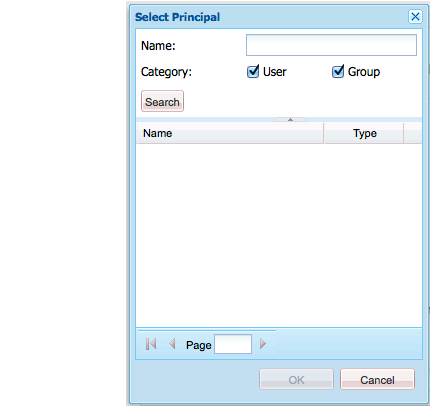

# Administração de direitos de usuário, grupo e acesso{#user-group-and-access-rights-administration}

A habilitação do acesso a um repositório CRX envolve vários tópicos:

* [Direitos](#how-access-rights-are-evaluated)  de acesso - os conceitos de como são definidos e avaliados
* [Administração](#user-administration)  do usuário - gerenciar contas individuais usadas para acesso
* [Administração](#group-administration)  de grupos - simplifique o gerenciamento de usuários formando grupos
* [Gerenciamento](#access-right-management)  de direitos de acesso — definindo políticas que controlam como esses usuários e grupos podem acessar recursos

Os elementos básicos são:

**User** AccountsO CRX autentica o acesso identificando e verificando um usuário (por essa pessoa ou por outro aplicativo) de acordo com os detalhes mantidos na conta do usuário.

No CRX, cada conta de usuário é um nó no espaço de trabalho. Uma conta de usuário CRX tem as seguintes propriedades:

* Representa um usuário do CRX.
* Ele contém um nome de usuário e uma senha.
* É aplicável a esse espaço de trabalho.
* Não pode ter subusuários. Para direitos de acesso hierárquicos, você deve usar grupos.

* Você pode especificar direitos de acesso para a conta de usuário.

   No entanto, para simplificar o gerenciamento, recomendamos que (na maioria dos casos) você atribua direitos de acesso a contas de grupo. A atribuição de direitos de acesso para cada usuário torna-se rapidamente muito difícil de gerenciar (as exceções são determinados usuários do sistema quando há apenas uma ou duas instâncias).

**Contas** de grupoAs contas de grupo são coleções de usuários e/ou outros grupos. Eles são usados para simplificar o gerenciamento, pois uma alteração nos direitos de acesso atribuídos a um grupo é automaticamente aplicada a todos os usuários desse grupo. Um usuário não precisa pertencer a nenhum grupo, mas geralmente pertence a vários.

No CRX, um grupo tem as seguintes propriedades:

* Representa um grupo de usuários com direitos de acesso comuns. Por exemplo, autores ou desenvolvedores.
* É aplicável a esse espaço de trabalho.
* Pode ter membros; podem ser usuários individuais ou outros grupos.
* O agrupamento hierárquico pode ser obtido com relações de membro. Não é possível colocar um grupo logo abaixo de outro grupo no repositório.
* Você pode definir os direitos de acesso para todos os membros do grupo.

**Access** RightsCRX usa Direitos de acesso para controlar o acesso a áreas específicas do repositório.

Isso é feito atribuindo privilégios para permitir ou negar acesso a um recurso (nó ou caminho) no repositório. Como vários privilégios podem ser atribuídos, eles devem ser avaliados para determinar qual combinação é aplicável à solicitação atual.

O CRX permite que você configure os direitos de acesso para as contas de usuário e grupos. Os mesmos princípios básicos de avaliação são então aplicados a ambos.

## Como os direitos de acesso são avaliados {#how-access-rights-are-evaluated}

>[!NOTE]
>
>O CRX implementa o controle de acesso [conforme definido por JSR-283](https://docs.adobe.com/content/docs/en/spec/jcr/2.0/16_Access_Control_Management.html).
>
>Uma instalação padrão de um repositório CRX é configurada para usar listas de controles de acesso baseadas em recursos. Esta é uma possível implementação do controle de acesso JSR-283 e uma das implementações presentes com Jackrabbit.

### Assuntos e Princípios {#subjects-and-principals}

O CRX usa dois conceitos chave ao avaliar direitos de acesso:

* Uma **principal** é uma entidade que possui direitos de acesso. As principais incluem:

   * Uma conta de usuário
   * Uma conta de grupo

      Se uma conta de usuário pertencer a um ou mais grupos, ela também será associada a cada um desses principais do grupo.

* Um **subject** é usado para representar a fonte de uma solicitação.

   É utilizado para consolidar os direitos de acesso aplicáveis a essa solicitação. Estes são retirados de:

   * O principal do usuário

      Os direitos que você atribui diretamente à conta de usuário.

   * Todos os principais grupos associados a esse usuário

      Todos os direitos atribuídos a qualquer um dos grupos aos quais o usuário pertence.
   O resultado é então usado para permitir ou negar acesso ao recurso solicitado.

#### Compilação da lista de direitos de acesso para um assunto {#compiling-the-list-of-access-rights-for-a-subject}

No CRX, o assunto depende de:

* o principal do usuário
* todos os principais do grupo associados a esse usuário

A lista dos direitos de acesso aplicáveis ao objeto é construída a partir de:

* os direitos que você atribui diretamente à conta de usuário
* além de todos os direitos atribuídos a qualquer um dos grupos aos quais o usuário pertence


>[!NOTE]
>
>* O CRX não leva em conta nenhuma hierarquia de usuário ao compilar a lista.
>* O CRX usa uma hierarquia de grupo somente quando você inclui um grupo como membro de outro grupo. Não há herança automática de permissões de grupo.
>* A ordem em que você especifica os grupos não afeta os direitos de acesso.

>


### Resolvendo Direitos de Acesso e Solicitação {#resolving-request-and-access-rights}

Quando o CRX lida com a solicitação, ele compara a solicitação de acesso do assunto com a lista do controle de acesso no nó do repositório:

Portanto, se o Linda solicitar a atualização do nó `/features` na seguinte estrutura do repositório:


### Ordem de precedência {#order-of-precedence}

Os direitos de acesso no CRX são avaliados da seguinte forma:

* Os principais de usuários sempre têm prioridade sobre os principais do grupo, independentemente de:

   * sua ordem na lista do controle de acesso
   * sua posição na hierarquia do nó

* Para um determinado principal existe (no máximo) 1 negação e 1 entrada de permissão em um determinado nó. A implementação sempre apaga entradas redundantes e garante que o mesmo privilégio não esteja listado nas entradas de permissão e negação.

>[!NOTE]
>
>Esse processo de avaliação é adequado para o controle de acesso baseado em recursos de uma instalação padrão do CRX.

A seguir, dois exemplos em que o usuário `aUser` é membro do grupo `aGroup`:

```xml
   + parentNode
     + acl
       + ace: aUser - deny - write
     + childNode
       + acl
         + ace: aGroup - allow - write
       + grandChildNode
```

Neste caso:

* `aUser` não recebe permissão de gravação em  `grandChildNode`.

```xml
   + parentNode
     + acl
       + ace: aUser - deny - write
     + childNode
       + acl
         + ace: aGroup - allow - write
         + ace: aUser - deny - write
       + grandChildNode
```

Neste caso:

* `aUser` não recebe permissão de gravação em  `grandChildNode`.
* O segundo ACE para `aUser` é redundante.

Os direitos de acesso dos principais de vários grupos são avaliados com base em sua ordem, dentro da hierarquia e dentro de uma única lista de controle de acesso.

### Práticas recomendadas     {#best-practices}

A tabela a seguir lista algumas recomendações e práticas recomendadas:

<table>
 <tbody>
  <tr>
   <td>Recomendação...</td>
   <td>Motivo...</td>
  </tr>
  <tr>
   <td><i>Usar grupos</i></td>
   <td><p>Evite atribuir direitos de acesso a cada usuário. Há várias razões para isso:</p>
    <ul>
     <li>Você tem muito mais usuários do que grupos, então os grupos simplificam a estrutura.</li>
     <li>Os grupos ajudam a fornecer uma visão geral de todas as contas.</li>
     <li>A herança é mais simples com os grupos.</li>
     <li>Os usuários vêm e vão. Grupos são de longo prazo.</li>
    </ul> </td>
  </tr>
  <tr>
   <td><i>Seja positivo</i></td>
   <td><p>Sempre use as instruções Permitir para especificar os direitos de acesso do principal do grupo (sempre que possível). Evite usar uma declaração Negar.</p> <p>Os principais do grupo são avaliados em ordem, tanto na hierarquia quanto na ordem em uma única lista de controle de acesso.</p> </td>
  </tr>
  <tr>
   <td><i>Mantenha simples</i></td>
   <td><p>O investimento em algum tempo e a reflexão ao configurar uma nova instalação serão bem reembolsados.</p> <p>A aplicação de uma estrutura clara simplificará a manutenção e a administração contínuas, garantindo que os seus atuais colegas e/ou futuros sucessores possam compreender facilmente o que está a ser implementado.</p> </td>
  </tr>
  <tr>
   <td><i>Testar</i></td>
   <td>Use uma instalação de teste para praticar e garantir que você compreenda as relações entre os vários usuários e grupos.</td>
  </tr>
  <tr>
   <td><i>Usuários / grupos padrão</i></td>
   <td>Sempre atualize os Usuários e grupos padrão imediatamente após a instalação para ajudar a evitar problemas de segurança.</td>
  </tr>
 </tbody>
</table>

## Administração do usuário {#user-administration}

Uma caixa de diálogo padrão é usada para **Administração do usuário**.

Você deve estar conectado ao espaço de trabalho apropriado e, em seguida, pode acessar a caixa de diálogo de ambos:

* o link **Administração do usuário** no console principal do CRX
* o menu **Security** do CRX Explorer


**Propriedades**

* **UserID**

   Nome curto para a conta, usado ao acessar o CRX.

* **Nome do Principal**

   Um nome de texto completo para a conta.

* **Senha**

   Necessário ao acessar o CRX com esta conta.

* **ntlmhash**

   Atribuído automaticamente para cada nova conta e atualizado quando a senha é alterada.

* É possível adicionar novas propriedades definindo um nome, tipo e valor. Clique em Salvar (símbolo de marca verde) para cada nova propriedade.

**Associação de Grupo**

Isso exibe todos os grupos aos quais a conta pertence. A coluna Herdado indica que a associação foi herdada como resultado da associação de outro grupo.

Clicar em GroupID (quando disponível) abrirá a [Administração de grupos](#group-administration) desse grupo.

**Personificadores**

Com a funcionalidade Representar, um usuário pode trabalhar em nome de outro usuário.

Isso significa que uma conta de usuário pode especificar outras contas (usuário ou grupo) que podem operar com sua conta. Em outras palavras, se o usuário B estiver autorizado a representar o usuário A, o usuário B poderá realizar ações usando os detalhes completos da conta do usuário A (incluindo ID, nome e direitos de acesso).

Isso permite que as contas do representador completem as tarefas como se estivessem usando a conta que estão representando; por exemplo, durante uma ausência ou para compartilhar uma carga excessiva em curto prazo.

Se uma conta representa outra é muito difícil de ver. Os arquivos de registro não contêm informações sobre o fato de que a representação ocorreu nos eventos. Portanto, se o usuário B estiver representando o usuário A, todos os eventos parecerão como se fossem executados pessoalmente pelo usuário A.

### Criando uma conta de usuário {#creating-a-user-account}

1. Abra a caixa de diálogo **Administração do usuário**.
1. Clique em **Criar usuário**.
1. Em seguida, você pode inserir as Propriedades:

   * **ID** do usuário usada como o nome da conta.
   * **** Senha necessária ao fazer logon.
   * **Nome** principal para fornecer um nome textual completo.
   * **Caminho intermediário, que pode ser usado** para formar uma estrutura em árvore.

1. Clique em Salvar (símbolo de marca de verificação verde).
1. A caixa de diálogo será expandida para que você possa:

   1. Configure **Propriedades**.
   1. Consulte **Associação do Grupo**.
   1. Defina **Representadores**.

>[!NOTE]
>
>Às vezes, pode-se observar uma perda de desempenho ao registrar novos usuários em instalações com um número alto de ambos:
>
>* usuários
>* grupos com muitos membros

>


### Atualização de uma conta de usuário {#updating-a-user-account}

1. Com a caixa de diálogo **Administração do usuário**, abra a visualização de lista de todas as contas.
1. Navegue pela estrutura em árvore.
1. Clique na conta necessária para abrir para edição.
1. Faça uma alteração e clique em Salvar (símbolo de marca verde) para essa entrada.
1. Clique em **Fechar** para concluir ou **Lista...** para retornar à lista de todas as contas de usuário.

### Removendo uma conta de usuário {#removing-a-user-account}

1. Com a caixa de diálogo **Administração do usuário**, abra a visualização de lista de todas as contas.
1. Navegue pela estrutura em árvore.
1. Selecione a conta necessária e clique em **Remover Utilizador**; a conta será excluída imediatamente.

>[!NOTE]
>
>Isso remove o nó desse principal do repositório.
>
>As entradas de direitos de acesso não são removidas. Isso garante a integridade histórica.

### Definindo Propriedades {#defining-properties}

Você pode definir **Propriedades** para contas novas ou existentes:

1. Abra a caixa de diálogo **Administração do usuário** para a conta apropriada.
1. Defina um nome **Propriedade**.
1. Selecione **Type** na lista suspensa.
1. Defina **Valor**.
1. Clique em Salvar (símbolo de clique verde) para a nova propriedade.

As propriedades existentes podem ser excluídas com o símbolo de lixeira.

Com exceção da Senha, as propriedades não podem ser editadas, elas devem ser excluídas e recriadas.

#### Alteração da senha {#changing-the-password}

A **Senha** é uma propriedade especial que pode ser alterada clicando no link **Alterar Senha**.

Você também pode alterar a senha para sua própria conta de usuário no menu **Security** no CRX Explorer.

### Definindo um Impersonador {#defining-an-impersonator}

Você pode definir Representadores para contas novas ou existentes:

1. Abra a caixa de diálogo **Administração do usuário** para a conta apropriada.
1. Especifique a conta a ser permitida para representar essa conta.

   Você pode usar Procurar... para selecionar uma conta existente.

1. Clique em Salvar (símbolo de marca verde) para a nova propriedade.

## Administração de grupos {#group-administration}

Uma caixa de diálogo padrão é usada para **Administração de grupos**.

Você deve estar conectado ao espaço de trabalho apropriado e, em seguida, pode acessar a caixa de diálogo de ambos:

* o link **Administração de grupos** no console principal do CRX
* o menu **Security** do CRX Explorer


**Propriedades**

* **GroupID**

   Nome abreviado para a conta do grupo.

* **Nome do Principal**

   Um nome de texto completo para a conta do grupo.

* É possível adicionar novas propriedades definindo um nome, tipo e valor. Clique em Salvar (símbolo de marca verde) para cada nova propriedade.

* **Membros**

   Você pode adicionar usuários ou outros grupos como membros deste grupo.

**Associação de Grupo**

Isso exibe todos os grupos aos quais a conta de grupo atual pertence. A coluna Herdado indica que a associação foi herdada como resultado da associação de outro grupo.

Clicar em um GroupID abrirá a caixa de diálogo para esse grupo.

**Membros**

Lista todas as contas (usuários e/ou grupos) que são membros do grupo atual.

A coluna **Herdado** indica que a associação foi herdada como resultado da associação a outro grupo.

>[!NOTE]
>
>Quando a função Proprietário, Editor ou Visualizador é atribuída a um usuário em qualquer pasta de ativo, um novo grupo é criado. O nome do grupo tem o formato `mac-default-<foldername>` para cada pasta na qual as funções são definidas.

### Criando uma Conta de Grupo {#creating-a-group-account}

1. Abra a caixa de diálogo **Administração de grupos**.
1. Clique em **Criar grupo**.
1. Em seguida, você pode inserir as Propriedades:

   * **Nome** principal para fornecer um nome textual completo.
   * **Caminho intermediário, que pode ser usado** para formar uma estrutura em árvore.

1. Clique em Salvar (símbolo de marca de verificação verde).
1. A caixa de diálogo será expandida para que você possa:

   1. Configure **Propriedades**.
   1. Consulte **Associação do Grupo**.
   1. Gerenciar **Membros**.

### Atualização de uma conta de grupo {#updating-a-group-account}

1. Com a caixa de diálogo **Administração de grupos** abra a visualização de lista de todas as contas.
1. Navegue pela estrutura em árvore.
1. Clique na conta necessária para abrir para edição.
1. Faça uma alteração e clique em Salvar (símbolo de marca verde) para essa entrada.
1. Clique em **Fechar** para concluir ou **Lista...** para voltar à lista de todas as contas de grupo.

### Removendo uma conta de grupo {#removing-a-group-account}

1. Com a caixa de diálogo **Administração de grupos** abra a visualização de lista de todas as contas.
1. Navegue pela estrutura em árvore.
1. Selecione a conta necessária e clique em **Remover Grupo**; a conta será excluída imediatamente.

>[!NOTE]
>
>Isso remove o nó desse principal do repositório.
>
>As entradas de direitos de acesso não são removidas. Isso garante a integridade histórica.

### Definindo Propriedades {#defining-properties-1}

Você pode definir Propriedades para contas novas ou existentes:

1. Abra a caixa de diálogo **Administração de grupos** para a conta apropriada.
1. Defina um nome **Propriedade**.
1. Selecione **Type** na lista suspensa.
1. Defina **Valor**.
1. Clique em Salvar (símbolo de marca verde) para a nova propriedade.

As propriedades existentes podem ser excluídas com o símbolo de lixeira.

### Membros {#members}

Você pode adicionar membros ao grupo atual:

1. Abra a caixa de diálogo **Administração de grupos** para a conta apropriada.
1. Ou:

   * Digite o nome do membro desejado (conta de usuário ou grupo).
   * Ou usar **Procurar...** para procurar e selecionar o principal (conta de usuário ou grupo) que você deseja adicionar.

1. Clique em Salvar (símbolo de marca verde) para a nova propriedade.

Ou exclua um membro existente com o símbolo de lixeira.

## Gerenciamento de direitos de acesso {#access-right-management}

Com a guia **Controle de acesso** do CRXDE Lite, é possível definir as políticas de controle de acesso e atribuir os privilégios relacionados.

Por exemplo, para **Caminho atual** selecione o recurso desejado no painel esquerdo, a guia Controle de acesso no painel inferior direito:


As políticas são categorizadas de acordo com:

* **Políticas de Controle de acesso aplicáveis**

   Estas políticas podem ser aplicadas.

   Essas são políticas que estão disponíveis para criar uma política local. Depois de selecionar e adicionar uma política aplicável, ela se torna uma política local.

* **Políticas do controle de acesso local**

   Estas são políticas de controle de acesso que você aplicou. Em seguida, você pode atualizá-los, solicitar ou removê-los.

   Uma política local substituirá quaisquer políticas herdadas do pai.

* **Políticas do controle de acesso efetivo**

   Essas são as políticas de controle de acesso que estão em vigor para quaisquer solicitações de acesso. Eles mostram as políticas agregadas derivadas tanto das políticas locais quanto de qualquer herdado do pai.

### Seleção de política {#policy-selection}

As políticas podem ser selecionadas para:

* **Caminho atual**

   Como no exemplo acima, selecione um recurso no repositório. As políticas para este &quot;caminho atual&quot; serão exibidas.

* **Repositório**

   Seleciona o controle de acesso no nível do repositório. Por exemplo, ao definir o privilégio `jcr:namespaceManagement`, que é relevante apenas para o repositório, não um nó.

* **Principal**

   Um principal registrado no repositório.

   Você pode digitar o nome **Principal** ou clicar no ícone à direita do campo para abrir a caixa de diálogo **Selecionar Principal**.

   Isso permite que você **Pesquise** por um **Usuário** ou **Grupo**. Selecione o principal necessário na lista resultante e clique em **OK** para retornar o valor à caixa de diálogo anterior.



>[!NOTE]
>
>Para simplificar o gerenciamento, recomendamos que você atribua direitos de acesso a contas de grupo, não a contas de usuário individuais.
>
>É mais fácil gerenciar alguns grupos, em vez de muitas contas de usuário.

### Privilégios {#privileges}

Os seguintes privilégios estão disponíveis para seleção ao adicionar uma entrada de controle de acesso (consulte a [API de segurança](https://docs.adobe.com/docs/en/spec/javax.jcr/javadocs/jcr-2.0/javax/jcr/security/Privilege.html) para obter detalhes completos):

<table>
 <tbody>
  <tr>
   <th><strong>Nome do privilégio</strong></th>
   <th><strong>Que controla o privilégio de...</strong></th>
  </tr>
  <tr>
   <td><code>jcr:read</code></td>
   <td>Recupere um nó e leia suas propriedades e seus valores.</td>
  </tr>
  <tr>
   <td><code>rep:write</code></td>
   <td>Este é um privilégio de agregação específico do Jackrabbit de jcr:write e jcr:nodeTypeManagement.<br /> </td>
  </tr>
  <tr>
   <td><code>jcr:all</code></td>
   <td>Este é um privilégio de agregação que contém todos os outros privilégios predefinidos.</td>
  </tr>
  <tr>
   <td><strong>Avançado </strong></td>
   <td> </td>
  </tr>
  <tr>
   <td><code>crx:replicate</code></td>
   <td>Execute a replicação de um nó.</td>
  </tr>
  <tr>
   <td><code>jcr:addChildNodes</code></td>
   <td>Crie nós secundários de um nó.</td>
  </tr>
  <tr>
   <td><code>jcr:lifecycleManagement</code></td>
   <td>Execute operações de ciclo de vida em um nó.</td>
  </tr>
  <tr>
   <td><code>jcr:lockManagement</code></td>
   <td>Bloquear e desbloquear um nó; atualize um cadeado.</td>
  </tr>
  <tr>
   <td><code>jcr:modifyAccessControl</code></td>
   <td>Modifique as políticas de controle de acesso de um nó.</td>
  </tr>
  <tr>
   <td><code>jcr:modifyProperties</code></td>
   <td>Crie, modifique e remova as propriedades de um nó.</td>
  </tr>
  <tr>
   <td><code>jcr:namespaceManagement</code></td>
   <td>Registre, cancele o registro e modifique as definições de namespace.</td>
  </tr>
  <tr>
   <td><code>jcr:nodeTypeDefinitionManagement</code></td>
   <td>Importe definições de tipo de nó para o repositório.</td>
  </tr>
  <tr>
   <td><code>jcr:nodeTypeManagement</code></td>
   <td>Adicione e remova tipos de nó de mixagem e altere o tipo de nó primário de um nó. Isso também inclui quaisquer chamadas para os métodos de importação Node.addNode e XML nos quais o tipo de mixin ou primário do novo nó é explicitamente especificado.</td>
  </tr>
  <tr>
   <td><code>jcr:readAccessControl</code></td>
   <td>Leia a política de controle de acesso de um nó.</td>
  </tr>
  <tr>
   <td><code>jcr:removeChildNodes</code></td>
   <td>Remova nós filhos de um nó.</td>
  </tr>
  <tr>
   <td><code>jcr:removeNode</code></td>
   <td>Remova um nó.</td>
  </tr>
  <tr>
   <td><code>jcr:retentionManagement</code></td>
   <td>Execute operações de gerenciamento de retenção em um nó.</td>
  </tr>
  <tr>
   <td><code>jcr:versionManagement</code></td>
   <td>Execute operações de controle de versão em um nó.</td>
  </tr>
  <tr>
   <td><code>jcr:workspaceManagement</code></td>
   <td>A criação e exclusão de espaços de trabalho por meio da API JCR.</td>
  </tr>
  <tr>
   <td><code>jcr:write</code></td>
   <td>Este é um privilégio de agregação que contém:<br /> - jcr:modifyProperties<br /> - jcr:addChildNodes<br /> - jcr:removeNode<br /> - jcr:removeChildNodes</td>
  </tr>
  <tr>
   <td><code>rep:privilegeManagement</code></td>
   <td>Registrar novo privilégio.</td>
  </tr>
 </tbody>
</table>

### Registrando novos privilégios {#registering-new-privileges}

Você também pode registrar novos privilégios:

1. Na barra de ferramentas, selecione **Ferramentas** e **Privilégios** para exibir os privilégios atualmente registrados.

   

1. Use o ícone **Registrar Privilégio** (**+**) para abrir a caixa de diálogo e definir um novo privilégio:

   

1. Clique em **OK** para salvar. O privilégio agora estará disponível para seleção.

### Adicionando uma Entrada de Controle de acesso {#adding-an-access-control-entry}

1. Selecione seu recurso e abra a guia **Controle de acesso**.

1. Para adicionar um novo **Políticas de Controle de acesso Local**, clique no ícone **+** à direita da lista **Política de Controle de acesso aplicável**:

   

1. Uma nova entrada é exibida em **Políticas de Controle de acesso Local:**

   

1. Clique no ícone **+** para adicionar uma nova entrada:

   

   >[!NOTE]
   >
   >Atualmente, uma solução alternativa é necessária para especificar uma sequência vazia.
   >
   >Para isso, você precisa usar &quot;&quot;.

1. Defina sua política de controles de acesso e clique em **OK** para salvar. Sua nova política:

   * estar listado em **Política de Controle de acesso local**
   * as alterações serão refletidas nas **Políticas de Controle de acesso eficazes**.

O CRX validará sua seleção; para um determinado principal existe (no máximo) 1 negação e 1 entrada de permissão em um determinado nó. A implementação sempre apaga entradas redundantes e garante que o mesmo privilégio não esteja listado nas entradas de permissão e negação.

### Solicitação de políticas de Controle de acesso locais {#ordering-local-access-control-policies}

A ordem na lista indica a ordem na qual as políticas são aplicadas.

1. Na tabela de **Políticas de Controle de acesso local**, selecione a entrada necessária e arraste-a para a nova posição na tabela.

   

1. As alterações serão mostradas nas tabelas para **Local** e **Políticas de Controle de acesso Efetivas**.

### Removendo uma Política de Controle de acesso {#removing-an-access-control-policy}

1. Na tabela de **Políticas de Controle de acesso local**, clique no ícone vermelho (-) à direita da entrada.
1. A entrada será removida das duas tabelas para **Local** e **Políticas de Controle de acesso Efetivas**.

### Testando uma Política de Controle de acesso {#testing-an-access-control-policy}

1. Na barra de ferramentas CRXDE Lite, selecione **Ferramentas** e **Testar Controle de acesso...**.
1. Uma nova caixa de diálogo é aberta no painel superior direito. Selecione o **Caminho** e/ou **Principal** que pretende testar.
1. Clique em **Testar** para ver os resultados da sua seleção:

   