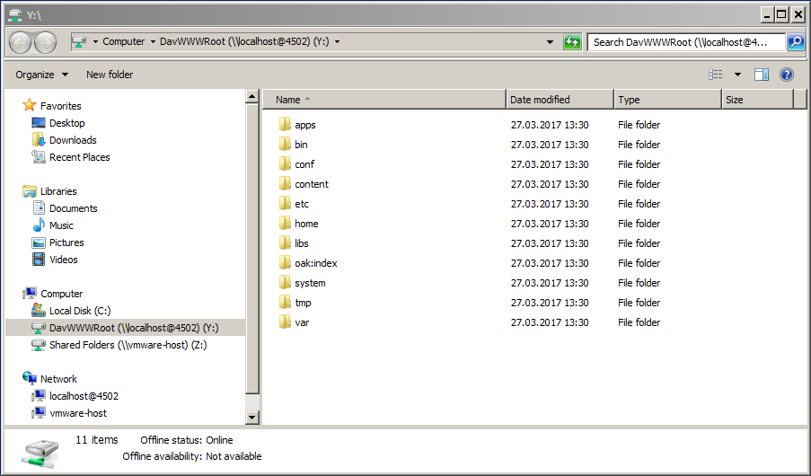

# Acesso ao WebDAV{#webdav-access}

Para se conectar ao AEM via WebDAV com o KDE:

O AEM oferece suporte a WebDAV que permite exibir e editar o conteúdo do repositório. A conexão via WebDAV fornece acesso direto ao repositório de conteúdo por meio do desktop. Os arquivos de texto e PDF adicionados ao repositório por meio da conexão WebDAV são automaticamente indexados com texto completo e podem ser pesquisados com as interfaces de pesquisa padrão e por meio das APIs Java™ padrão.

## Geral {#general}

[Instruções detalhadas por sistema operacional](/help/sites-administering/webdav-access.md#connecting-via-webdav) estão incluídas neste documento, mas, essencialmente para se conectar ao repositório usando o protocolo WebDAV, você direciona o cliente WebDAV para o seguinte local:

```xml
http://localhost:4502
```


Esta URL, quando conectada no nível do sistema operacional, fornece acesso WebDAV ao espaço de trabalho padrão ( `crx.default`). Embora seja mais simples para o usuário, ele não oferece a flexibilidade adicional de especificar nomes de espaço de trabalho, o que pode ser feito usando [URLs adicionais do WebDAV](/help/sites-administering/webdav-access.md#webdav-urls).

O AEM exibe o conteúdo do repositório da seguinte maneira:

* Um nó do tipo `nt:folder` é exibido como uma pasta. Os nós abaixo do nó `nt:folder` são exibidos como conteúdo da pasta.

* Um nó do tipo `nt:file` é exibido como um arquivo. Os nós abaixo do nó `nt:file` não são exibidos, mas formam o conteúdo do arquivo.

Quando você usa o WebDAV para criar e editar pastas e arquivos, o AEM cria e edita os nós `nt:folder` e `nt:file` necessários. Se você planeja usar o WebDAV para importar e exportar conteúdo, tente trabalhar com os tipos de nó `nt:file` e `nt:folder` o máximo possível.

>[!NOTE]
>
>Antes de configurar o WebDAV, verifique os [Requisitos Técnicos](/help/sites-deploying/technical-requirements.md#webdav-clients).

## URLs WebDAV {#webdav-urls}

O URL do servidor WebDAV tem a seguinte estrutura:

<table>
 <colgroup>
  <col width="100" />
  <col width="100" />
  <col width="100" />
  <col width="100" />
  <col width="100" />
 </colgroup>
 <tbody>
  <tr>
   <td>
    <code>
     <strong>URL Component</strong>
    </code></td>
   <td><code>https://&lt;host&gt;:&lt;port&gt;</code></td>
   <td><code>/&lt;crx-webapp-path&gt;</code></td>
   <td><code>/repository</code></td>
   <td><code>/&lt;workspace&gt;</code></td>
  </tr>
  <tr>
   <td>
    <code>
     <strong>Example</strong>
    </code></td>
   <td><code>http://localhost:4502</code></td>
   <td><code>/crx</code></td>
   <td><code>/repository</code></td>
   <td><code>/crx.default</code></td>
  </tr>
  <tr>
   <td><strong>Descrição</strong></td>
   <td>Host e porta em que o AEM é executado</td>
   <td>Caminho para o aplicativo web do repositório AEM</td>
   <td>Caminho para o qual o servlet WebDAV está mapeado</td>
   <td>Nome do espaço de trabalho</td>
  </tr>
 </tbody>
</table>

Ao alterar o elemento de espaço de trabalho no caminho, você pode mapear espaços de trabalho diferentes do padrão ( `crx.default`). Por exemplo, para mapear um espaço de trabalho chamado `staging`, use a seguinte URL:

```xml
http://localhost:4502/crx/repository/staging
```

## Conexão via WebDAV {#connecting-via-webdav}

[Como mencionado acima](/help/sites-administering/webdav-access.md#general), para se conectar ao repositório usando o protocolo WebDAV, aponte o cliente WebDAV para o local do repositório. No entanto, dependendo do sistema operacional, as etapas envolvidas na conexão do cliente são diferentes e pode haver uma configuração necessária do sistema operacional.

São fornecidas instruções sobre como conectar os seguintes sistemas operacionais:

* [Windows](/help/sites-administering/webdav-access.md#windows)
* [macOS](/help/sites-administering/webdav-access.md#macos)
* [Linux](/help/sites-administering/webdav-access.md#linux)

### Windows {#windows}

Para conectar com êxito um sistema Microsoft® Windows 7 (e superior) a uma instância AEM que não esteja protegida por SSL, a opção para estabelecer autenticação básica em uma rede não segura deve estar ativada explicitamente no Windows. Essa capacidade requer uma alteração no Registro do Windows do WebClient.

Depois que o registro é atualizado, a instância do AEM pode ser mapeada como uma unidade.

#### Configuração do Windows 7 e superior {#windows-and-greater-configuration}

Para atualizar o registro para permitir a autenticação básica em uma rede não segura:

1. Localize a seguinte subchave do Registro:

   ```xml
   HKEY_LOCAL_MACHINE\SYSTEM\CurrentControlSet\Services\WebClient\Parameters
   ```

1. Defina a subchave de entrada do Registro `BasicAuthLevel` com um valor de `2` ou superior.

   Se ele não estiver presente, adicione a subchave.

1. Reinicie o sistema para que a alteração no registro tenha efeito.

>[!NOTE]
>
>A Adobe recomenda que você crie um usuário do Windows com as mesmas credenciais do usuário do repositório, caso contrário, poderá encontrar conflitos de permissão.

#### Configuração do Windows 8 {#windows-configuration}

Para o Windows 8, altere a entrada do Registro [conforme descrito para o Windows 7 e posterior](/help/sites-administering/webdav-access.md#windows-and-greater-configuration). No entanto, antes de executar essa tarefa, a Experiência Desktop deve estar habilitada para ver a entrada do registro.

Para habilitar a Experiência Desktop, abra o **Gerenciador do Servidor**, depois os **Recursos**, depois **Adicionar Recursos** e depois a **Experiência Desktop**.

Após a reinicialização, a entrada de registro descrita para o Windows 7 e superior fica disponível. Modifique conforme descrito para o Windows 7 e superior.

#### Conectando-se no Windows {#connecting-in-windows}

Para se conectar ao AEM via WebDAV em um ambiente Windows:

1. Abra o **Windows Explorer** ou o **File Explorer** e clique em **Computador** ou **Este PC**.

   

1. Para iniciar o assistente, clique em **Mapear unidade de rede**.
1. Insira os detalhes do mapeamento:

   * **Unidade**: escolha qualquer letra disponível
   * **Pasta**: `http://localhost:4502`
   * Verificar **Conectar usando outras credenciais**

   Clique em Concluir

   

   >[!NOTE]
   >
   >Se o AEM estiver em outra porta, use esse número de porta em vez de 4502. Além disso, se você não estiver executando o repositório de conteúdo em sua máquina local, substitua `localhost` pelo respectivo nome de servidor ou endereço IP.

1. Digite o nome de usuário `admin` e a senha `admin`. A Adobe recomenda que você use a conta de administrador pré-configurada para testes.

   

1. O assistente é fechado e a unidade recém-mapeada é aberta em uma janela do Windows Explorer ou do Explorador de Arquivos.

   

O Windows agora mapeou o AEM como uma unidade via WebDAV e você pode usá-lo como qualquer outra unidade.

### macOS {#macos}

Não há etapas de configuração necessárias para se conectar por meio do WebDAV no macOS. Você pode se conectar ao servidor WebDAV.

1. Navegue até qualquer janela do **Localizador** e clique em **Ir** e **Conectar-se ao Servidor** ou pressione **Command+k**.
1. Na janela **Conectar-se ao Servidor**, digite o local do AEM:

   * `http://localhost:4502`

   >[!NOTE]
   >
   >Se o AEM estiver em outra porta, use esse número de porta em vez de 4502. Além disso, se você não estiver executando o repositório de conteúdo em sua máquina local, substitua `localhost` pelo respectivo nome de servidor ou endereço IP.

1. Quando a autenticação for solicitada, digite o nome de usuário `admin` e a senha `admin`. A Adobe recomenda que você use a conta de administrador pré-configurada para testes.

O macOS agora se conectou ao AEM pelo WebDAV e você pode usá-lo como qualquer outra pasta no Mac.

### Linux® {#linux}

A conexão via WebDAV no Linux® não requer nenhuma configuração, mas envolve algumas etapas para fazer a conexão, que varia de acordo com o ambiente de desktop.

#### GNOME {#gnome}

Para conectar-se ao AEM via WebDAV com GNOME:

1. No Nautilus (explorador de arquivos), selecione **Places** e selecione **Conectar-se ao Servidor**.
1. Na janela **Conectar ao Servidor**, selecione WebDAV (HTTP) em Tipo de Serviço.

1. Em **Servidor**, digite `http://localhost:4502/crx/repository/crx.default`

   >[!NOTE]
   >
   >Se o AEM estiver em outra porta, use esse número de porta em vez de 4502. Além disso, se você não estiver executando o repositório de conteúdo em sua máquina local, substitua `localhost` pelo respectivo nome de servidor ou endereço IP.

1. Em **Pasta**, digite `/dav`
1. Digite o nome de usuário `admin`. A Adobe recomenda que você use a conta de administrador pré-configurada para testes.
1. Deixe a porta em branco e digite qualquer nome para sua conexão.
1. Clique em **Conectar**. AEM solicita sua senha.
1. Digite a senha `admin` e clique em **Conectar**.

O GNOME já montou o AEM como um volume e você pode usá-lo como qualquer outro volume.

#### KDE {#kde}

1. Abra o assistente de Pasta de rede.
1. Selecione **WebFolder**(webdav) e clique em Próximo.
1. Em **Name**, digite um nome de conexão.
1. Em **Usuário**, digite `admin.` Adobe recomenda que você use a conta de administrador pré-configurada.
1. Em **Servidor**, digite `http://localhost:4502/crx/repository/crx.default`

   >[!NOTE]
   >
   >Se o AEM estiver em outra porta, use esse número de porta em vez de 4502. Além disso, se você não estiver executando o repositório de conteúdo em sua máquina local, substitua `localhost` pelo respectivo nome de servidor ou endereço IP

1. Em **Pasta**, digite `dav`

1. Clique em **Salvar e Conectar**.
1. Quando sua senha for solicitada, digite a senha `admin` e clique em **Conectar**.

O KDE já montou o AEM como um volume e você poderá usá-lo como qualquer outro volume.
