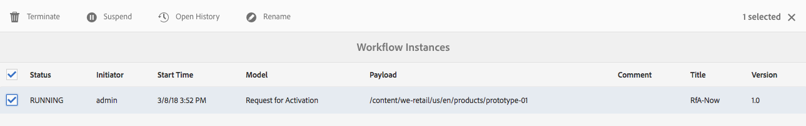

# Administração de instâncias de fluxo de trabalho{#administering-workflow-instances}

O console de fluxo de trabalho fornece várias ferramentas para administrar instâncias de fluxo de trabalho para garantir que elas estejam sendo executadas conforme esperado.

>[!NOTE]
>
>O console  JMX fornece operações adicionais de manutenção do fluxo de trabalho.

Vários consoles estão disponíveis para administrar seus fluxos de trabalho. Use a navegação  global para abrir o painel **Ferramentas** e selecione **Fluxo de trabalho**:

* **Modelos**: Gerenciar definições de fluxo de trabalho
* **Instâncias**: Exibir e gerenciar instâncias de fluxo de trabalho em execução
* **Iniciadores**: Gerenciar como os fluxos de trabalho devem ser iniciados
* **Arquivo**: Exibir histórico de fluxos de trabalho concluídos com êxito
* **Falhas**: Exibir histórico de fluxos de trabalho que foram concluídos com erros

## Monitorando o Status das Instâncias de Fluxo de Trabalho {#monitoring-the-status-of-workflow-instances}

1. Usando Navegação, selecione **Ferramentas** e, em seguida, **Fluxo de trabalho**.
1. Selecione **Instâncias** para exibir a lista de instâncias de fluxo de trabalho em andamento.

   

1. Selecione um item específico e, em seguida, **Abra o Histórico** para ver mais detalhes:

   

## Suspender, Retomar e Encerrar uma Instância de Fluxo de Trabalho {#suspending-resuming-and-terminating-a-workflow-instance}

1. Usando Navegação, selecione **Ferramentas** e, em seguida, **Fluxo de trabalho**.
1. Selecione **Instâncias** para exibir a lista de instâncias de fluxo de trabalho em andamento.

   

1. Selecione um item específico e use **Terminar**, **Suspender** ou **Retomar**, conforme apropriado; são necessários confirmação e/ou mais detalhes:

   

## Exibindo fluxos de trabalho arquivados {#viewing-archived-workflows}

1. Usando Navegação, selecione **Ferramentas** e, em seguida, **Fluxo de trabalho**.
1. Selecione **Arquivar** para exibir a lista de instâncias de fluxo de trabalho concluídas com êxito.

   

   >[!NOTE]
   >
   >O status de anulação é considerado como uma terminação bem-sucedida, pois ocorre como resultado da ação do usuário; por exemplo:
   >
   >* utilização da ação **Terminar**
   >* quando uma página sujeita a um fluxo de trabalho é (forçar) excluída, o fluxo de trabalho será encerrado

1. Selecione um item específico e, em seguida, **Abra o Histórico** para ver mais detalhes:

   

## Correção de Falhas de Instância de Fluxo de Trabalho {#fixing-workflow-instance-failures}

Quando um fluxo de trabalho falha, o AEM fornece o console **Falhas** para permitir que você investigue e execute a ação apropriada assim que a causa original for tratada:

* **Detalhes** da falha Abre uma janela para mostrar a mensagem **de** falha, a **etapa** e a pilha **de** falhas.

* **Abrir histórico** Mostra detalhes do histórico de fluxo de trabalho.

* **Etapa** de nova tentativa Executa a instância do componente Etapa de script novamente. Use o comando Repetir etapa depois de corrigir a causa do erro original. Por exemplo, repita a etapa depois de corrigir um bug no script que a Etapa do processo executa.
* **Encerrar** o fluxo de trabalho se o erro tiver causado uma situação irrevogável para o fluxo de trabalho. Por exemplo, o fluxo de trabalho pode depender de condições ambientais, como informações no repositório que não são mais válidas para a instância do fluxo de trabalho.
* **Encerrar e tentar novamente** Semelhante a **Encerrar** , exceto que uma nova instância do fluxo de trabalho é iniciada usando a carga, o título e a descrição originais.

Para investigar falhas, retome ou encerre o fluxo de trabalho depois, use as seguintes etapas:

1. Usando Navegação, selecione **Ferramentas** e, em seguida, **Fluxo de trabalho**.
1. Selecione **Falhas** para exibir a lista de instâncias de fluxo de trabalho que não foram concluídas com êxito.
1. Selecione um item específico e depois a ação apropriada:

   

## Expurgação Regular de Instâncias de Fluxo de Trabalho {#regular-purging-of-workflow-instances}

Minimizar o número de instâncias de fluxo de trabalho aumenta o desempenho do mecanismo de fluxo de trabalho, para que você possa expurgar regularmente instâncias de fluxo de trabalho concluídas ou em execução do repositório.

Configure a Configuração **de Expurgação do Fluxo de Trabalho do** Adobe Granite para expurgar as instâncias do fluxo de trabalho de acordo com sua idade e status. Você também pode expurgar instâncias de fluxo de trabalho de todos os modelos ou de um modelo específico.

Você também pode criar várias configurações do serviço para expurgar instâncias de fluxo de trabalho que atendam a critérios diferentes. Por exemplo, crie uma configuração que elimine as instâncias de um modelo de fluxo de trabalho específico quando elas estiverem em execução por muito mais tempo do que o esperado. Crie outra configuração que expurgue todos os fluxos de trabalho concluídos após um determinado número de dias para minimizar o tamanho do repositório.

Para configurar o serviço, você pode usar o Console [da](/help/sites-deploying/configuring-osgi.md#osgi-configuration-with-the-web-console) Web ou [adicionar uma configuração OSGi ao repositório](/help/sites-deploying/configuring-osgi.md#osgi-configuration-in-the-repository). A tabela a seguir descreve as propriedades necessárias para qualquer um dos métodos.

>[!NOTE]
>
>Para adicionar a configuração ao repositório, o PID do serviço é:
>
>`com.adobe.granite.workflow.purge.Scheduler`
>
>Como o serviço é de fábrica, o nome do `sling:OsgiConfig` nó requer um sufixo identificador, por exemplo:
>
>`com.adobe.granite.workflow.purge.Scheduler-myidentifier`

<table>
 <tbody>
  <tr>
   <th>Nome da propriedade (Console da Web)</th>
   <th>Nome da propriedade OSGi</th>
   <th>Descrição</th>
  </tr>
  <tr>
   <td>Nome da tarefa</td>
   <td>Scheduledpurge.name</td>
   <td>Um nome descritivo para a expurgação programada.</td>
  </tr>
  <tr>
   <td>Status do fluxo de trabalho</td>
   <td>Scheduledpurge.workflowStatus</td>
   <td>
O status das instâncias do fluxo de trabalho a serem expurgadas. Os seguintes valores são válidos:

    <ul>
     <li>CONCLUÍDO: As instâncias de fluxo de trabalho concluídas são removidas.</li>
     <li>EM EXECUÇÃO: A execução de instâncias de fluxo de trabalho é removida.</li>
    </ul> </td>
  </tr>
  <tr>
   <td>Modelos a Serem Expurgados</td>
   <td>Scheduledpurge.modelIds</td>
   <td>
A ID dos modelos de fluxo de trabalho a serem expurgados.   A ID é o caminho para o nó modelo, por exemplo: /conf/global/settings/workflow/models/dam/update_asset/jcr:content/model  Não especifique nenhum valor para expurgar instâncias de todos os modelos de fluxo de trabalho.
 
Para especificar vários modelos, clique no botão + no Console da Web. 
 </td>
  </tr>
  <tr>
   <td>Idade do fluxo de trabalho</td>
   <td>Scheduledpurge.daysell</td>
   <td>A idade das instâncias do fluxo de trabalho a serem expurgadas, em dias.</td>
  </tr>
 </tbody>
</table>

## Configuração do tamanho máximo da caixa de entrada {#setting-the-maximum-size-of-the-inbox}

Você pode definir o tamanho máximo da caixa de entrada configurando o **Adobe Granite Workflow Service**, usando o Console  Web ou [adicionar uma configuração OSGi ao repositório](/help/sites-deploying/configuring-osgi.md#osgi-configuration-in-the-repository). A tabela a seguir descreve a propriedade configurada para qualquer método.

>[!NOTE]
>
>Para adicionar a configuração ao repositório, o PID do serviço é:
>
>`com.adobe.granite.workflow.core.WorkflowSessionFactory`.

| Nome da propriedade (Console da Web) | Nome da propriedade OSGi |
|---|---|
| Tamanho Máximo da Consulta da Caixa de Entrada | granite.workflow.inboxQuerySize |

