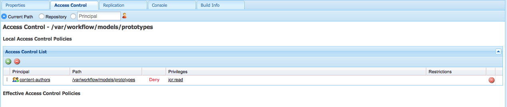

# Gerenciamento de acesso a workflows{#managing-access-to-workflows}

Configure ACLs de acordo com as contas de usuário para permitir (ou desativar) a inicialização e a participação em workflows.

## Permissões de usuário necessárias para fluxos de trabalho {#required-user-permissions-for-workflows}

As ações relativas aos fluxos de trabalho podem ser realizadas se:

* você está trabalhando com a conta `admin`
* a conta foi atribuída ao grupo padrão `workflow-users`:

   * esse grupo mantém todos os privilégios necessários para que seus usuários executem ações de workflow.
   * quando a conta está nesse grupo, ela só tem acesso aos workflows iniciados.

* a conta foi atribuída ao grupo padrão `workflow-administrators`:

   * esse grupo tem todos os privilégios necessários para que seus usuários privilegiados monitorem e administrem workflows.
   * quando a conta está nesse grupo, ela tem acesso a todos os workflows.

>[!NOTE]
>
>Estes são os requisitos mínimos. Sua conta também deve ser o participante atribuído ou um membro do grupo atribuído para executar etapas específicas.

## Configuração do acesso aos fluxos de trabalho {#configuring-access-to-workflows}

Os modelos de workflow herdam uma lista de controle de acesso (ACL) padrão para controlar como os usuários podem interagir com workflows. Para personalizar o acesso do usuário a um workflow, modifique a ACL (Access Control List, lista de controle de acesso) no repositório da pasta que contém o nó do modelo de workflow:

* [Aplicar uma ACL para o modelo de fluxo de trabalho específico a /var/workflow/models](/help/sites-administering/workflows-managing.md#apply-an-acl-for-the-specific-workflow-model-to-var-workflow-models)
* [Crie uma subpasta em /var/workflow/models e aplique a ACL a ela](/help/sites-administering/workflows-managing.md#create-a-subfolder-in-var-workflow-models-and-apply-the-acl-to-that)

>[!NOTE]
>
>Para obter informações sobre como usar o CRXDE Lite para configurar ACLs, consulte [Gerenciamento de Direitos de Acesso](/help/sites-administering/user-group-ac-admin.md#access-right-management).

### Aplicar uma ACL para o modelo de fluxo de trabalho específico a /var/workflow/models {#apply-an-acl-for-the-specific-workflow-model-to-var-workflow-models}

Se o modelo de fluxo de trabalho estiver armazenado em `/var/workflow/models`, você poderá atribuir uma ACL específica, relevante somente para esse fluxo de trabalho, na pasta:

1. Abra o CRXDE Lite no navegador da Web (por exemplo, [http://localhost:4502/crx/de](http://localhost:4502/crx/de)).
1. Na árvore do nó, selecione o nó da pasta de modelos de fluxo de trabalho:

   `/var/workflow/models`

1. Clique na guia **Controle de acesso**.
1. Na tabela **Políticas de Controle de Acesso Local** (**Lista de Controle de Acesso**), clique no ícone de adição para **Adicionar Entrada**.
1. Na caixa de diálogo **Adicionar nova entrada**, adicione um ACE com as seguintes propriedades:

   * **Entidade**: `content-authors`
   * **Tipo**: `Deny`
   * **Privilégios**: `jcr:read`
   * **rep:glob**: referência ao fluxo de trabalho específico

   

   A tabela **Lista de Controle de Acesso** agora inclui a restrição para `content-authors` no modelo de fluxo de trabalho `prototype-wfm-01`.

   

1. Clique em **Salvar tudo**.

   O fluxo de trabalho `prototype-wfm-01` não está mais disponível para membros do grupo `content-authors`.

### Crie uma subpasta em /var/workflow/models e aplique a ACL a ela {#create-a-subfolder-in-var-workflow-models-and-apply-the-acl-to-that}

Sua equipe de desenvolvimento do [pode criar os fluxos de trabalho em uma subpasta](/help/sites-developing/workflows-models.md#creating-a-new-workflow) de

`/var/workflow/models`

Comparável aos fluxos de trabalho do DAM armazenados em

`/var/workflow/models/dam/`

Em seguida, você pode adicionar uma ACL à própria pasta.

1. Abra o CRXDE Lite no navegador da Web (por exemplo, [http://localhost:4502/crx/de](http://localhost:4502/crx/de)).
1. Na árvore de nós, selecione o nó da pasta individual na pasta de modelos de fluxo de trabalho; por exemplo:

   `/var/workflow/models/prototypes`

1. Clique na guia **Controle de acesso**.
1. Na tabela **Política de Controle de Acesso Aplicável**, clique no ícone de adição para **Adicionar** uma entrada.
1. Na tabela **Políticas de Controle de Acesso Local** (**Lista de Controle de Acesso**), clique no ícone de adição para **Adicionar Entrada**.
1. Na caixa de diálogo **Adicionar nova entrada**, adicione um ACE com as seguintes propriedades:

   * **Entidade**: `content-authors`
   * **Tipo**: `Deny`
   * **Privilégios**: `jcr:read`

   >[!NOTE]
   >
   >Assim como em [Aplicar uma ACL para o modelo de fluxo de trabalho específico a /var/workflow/models](/help/sites-administering/workflows-managing.md#apply-an-acl-for-the-specific-workflow-model-to-var-workflow-models), você pode incluir um rep:glob para limitar o acesso a um fluxo de trabalho específico.

   

   A tabela **Lista de Controle de Acesso** agora inclui a restrição para `content-authors` na pasta `prototypes`.

   

1. Clique em **Salvar tudo**.

   Os modelos na pasta `prototypes` não estão mais disponíveis para membros do grupo `content-authors`.
