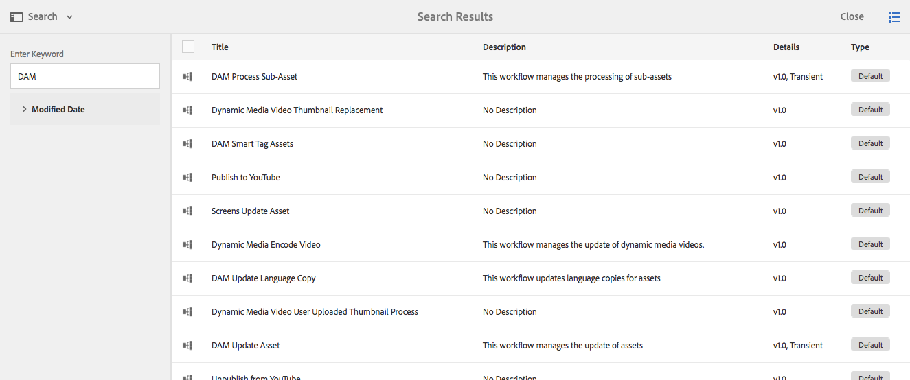
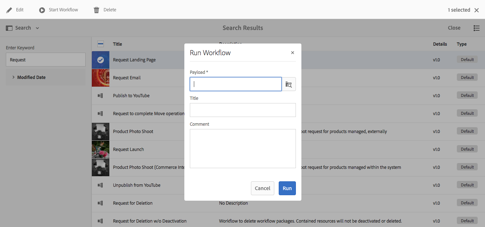

# Inicialização de workflows{#starting-workflows}

Ao administrar workflows, você pode iniciá-los usando uma variedade de métodos:

* Manualmente:

   * De um [Modelo de fluxo de trabalho](#workflow-models).
   * Uso de um pacote de fluxo de trabalho para [processamento em lote](#workflow-packages-for-batch-processing).

* Automaticamente:

   * Em resposta a alterações no nó; [uso de um Iniciador](#workflows-launchers).

>[!NOTE]
>
>Outros métodos também estão disponíveis para os autores; para obter detalhes completos, consulte:
>
>* [Aplicação de fluxos de trabalho a páginas](/help/sites-authoring/workflows-applying.md)
>* [Como aplicar fluxos de trabalho a ativos do DAM](/help/assets/assets-workflow.md)
>* [AEM Forms](https://helpx.adobe.com/aem-forms/6-2/aem-workflows-submit-process-form.html)
>* [Projetos de tradução](/help/sites-administering/tc-manage.md)
>

## Modelos do fluxo de trabalho {#workflow-models}

Você pode iniciar um workflow [baseado em um dos modelos](/help/sites-administering/workflows.md#workflow-models-and-instances) listado no console Modelos de fluxo de trabalho . As únicas informações obrigatórias são a carga, embora um título e/ou comentário também possa ser adicionado.

## Iniciadores de fluxos de trabalho {#workflows-launchers}

O Workflow Launcher monitora as alterações no repositório de conteúdo para iniciar workflows dependendo da localização e do tipo de recurso do nó alterado.

Usar o **Iniciador** é possível:

* Consulte os workflows já iniciados para nós específicos.
* Selecione um workflow a ser iniciado quando um determinado nó/tipo de nó tiver sido criado/modificado/removido.
* Remova uma relação fluxo de trabalho para nó existente.

Um iniciador pode ser criado para qualquer nó. No entanto, as alterações em determinados nós não iniciam workflows. As alterações nos nós abaixo dos seguintes caminhos não fazem com que os workflows sejam iniciados:

* `/var/workflow/instances`
* Qualquer nó da caixa de entrada do fluxo de trabalho localizado em qualquer lugar na `/home/users` ramificação
* `/tmp`
* `/var/audit`
* `/var/classes`
* `/var/eventing`
* `/var/linkchecker`
* `/var/mobile`
* `/var/statistics`

   * Exceção: Alterações nos nós abaixo `/var/statistics/tracking` *do* fazer com que workflows sejam iniciados.

Várias definições estão incluídas na instalação padrão. Eles são usados para tarefas de gerenciamento de ativos digitais e colaboração social:

## Pacotes de fluxo de trabalho para processamento em lote {#workflow-packages-for-batch-processing}

Os pacotes de fluxo de trabalho são pacotes que podem ser passados para um fluxo de trabalho como carga para processamento, permitindo que vários recursos sejam processados.

Um pacote de fluxo de trabalho:

* O contém links para um conjunto de recursos (como páginas, ativos).
* contém informações do pacote, como a data de criação, o usuário que criou o pacote e uma breve descrição.
* é definido usando um modelo de página especializado; essas páginas permitem que o usuário especifique os recursos no pacote.
* podem ser usadas várias vezes.
* O pode ser alterado pelo usuário (adicionar ou remover recursos) enquanto a instância do fluxo de trabalho estiver realmente em execução.

## Iniciar um fluxo de trabalho pelo console Modelos {#starting-a-workflow-from-the-models-console}

1. Navegue até o **Modelos** console usando **Ferramentas**, **Fluxo de trabalho**, em seguida **Modelos**.
1. Selecione o workflow (de acordo com a exibição do console); você também pode usar a opção Pesquisar (canto superior esquerdo), se necessário:

   

   >[!NOTE]
   >
   >O **[Transitório](/help/sites-developing/workflows.md#transient-workflows)** mostra workflows para os quais o histórico do workflow não será persistente.

1. Selecionar **Iniciar fluxo de trabalho** na barra de ferramentas.
1. A caixa de diálogo Executar fluxo de trabalho será aberta, permitindo especificar:

   * **Carga**

      Pode ser uma página, um nó, um ativo, um pacote, entre outros recursos.

   * **Título**

      Um título opcional para ajudar a identificar essa instância.

   * **Comentar**

      Um comentário opcional para ajudar a indicar detalhes desta instância.
   

## Criação de uma configuração do Launcher {#creating-a-launcher-configuration}

1. Navegue até o **Iniciadores de fluxo de trabalho** console usando **Ferramentas**, **Fluxo de trabalho**, em seguida **Lançadores**.
1. Selecionar **Criar**, em seguida **Adicionar Iniciador** para abrir a caixa de diálogo:

   

   * **Tipo de evento**

      O tipo de evento que iniciará o workflow:

      * Criado
      * Modificado
      * Removido
   * **Nodetype**

      O tipo de nó ao qual o iniciador do fluxo de trabalho se aplica.

   * **Caminho**

      O caminho ao qual o iniciador do fluxo de trabalho se aplica.

   * **Modo(s) de execução**

      O tipo de servidor ao qual o iniciador do fluxo de trabalho se aplica. Selecionar **Autor**, **Publicar** ou **Autor e publicação**.

   * **Condições**

      Uma lista de condições para valores de nós que, quando avaliados, determinam se o workflow é iniciado. Por exemplo, a seguinte condição faz com que o fluxo de trabalho seja iniciado quando o nó tiver um nome de propriedade com o valor User:

      name==User

   * **Recursos**

      Uma lista de recursos a serem ativados. Selecione os recursos necessários usando o seletor suspenso.

   * **Recursos desativados**

   Uma lista de recursos a serem desativados. Selecione os recursos necessários usando o seletor suspenso.

   * **Modelo de fluxo de trabalho**

      O fluxo de trabalho a ser iniciado quando o Tipo de evento ocorrer no Tipo de nó e/ou Caminho sob a condição definida.

   * **Descrição**

      Seu próprio texto para descrever e identificar a configuração do iniciador.

   * **Ativar**

      Controla se o iniciador do fluxo de trabalho está ativado:

      * Selecionar **Habilitar** para iniciar workflows quando as propriedades de configuração forem satisfeitas.
      * Selecionar **Desativar** quando o workflow não deve ser executado (nem mesmo quando as propriedades de configuração são satisfeitas).
   * **Excluir lista**

      Isso especifica qualquer evento JCR a ser excluído (ou seja, ignorado) ao determinar se um workflow deve ser acionado.

      Esta propriedade do iniciador é uma lista de itens separada por vírgulas: &quot;

      * `property-name` ignorar qualquer `jcr` evento que foi acionado no nome da propriedade especificada. &quot;
      * `event-user-data:<*someValue*>` ignora qualquer evento que contenha a variável `*<someValue*`> `user-data` definido pelo [ `ObservationManager` API](https://www.adobe.io/experience-manager/reference-materials/spec/jsr170/javadocs/jcr-2.0/javax/jcr/observation/ObservationManager.html#setUserData(java.lang.String).

      Por exemplo:

      `jcr:lastModified,dc:modified,dc:format,jcr:lastModifiedBy,imageMap,event-user-data:changedByWorkflowProcess`

      Esse recurso pode ser usado para ignorar qualquer alteração acionada por outro processo de workflow, adicionando o item de exclusão:

      `event-user-data:changedByWorkflowProcess`

1. Selecionar **Criar**, para criar o iniciador e retornar ao console.

   Quando o evento apropriado ocorrer, o iniciador será acionado e o fluxo de trabalho será iniciado.

## Gerenciamento de uma configuração do Launcher {#managing-a-launcher-configuration}

Depois de criar a configuração do iniciador, você pode usar o mesmo console para selecionar a instância e, em seguida, **Propriedades da exibição** (e editá-las) ou **Excluir**.
