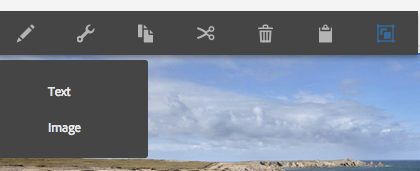

# Componentes do Adobe Campaign{#adobe-campaign-components}

Ao integrar com o Adobe Campaign, você tem componentes disponíveis para o ao trabalhar com boletins informativos e formulários. Ambos estão descritos neste documento.

>[!CAUTION]
>
>Os componentes de email do AEM foram descontinuados. Devido à natureza do email, que mescla conteúdo e estilo, os componentes de email fornecidos prontos para uso pelo AEM tornam-se de reutilização limitada para os clientes, devido à necessidade de implementar estilos personalizados em quaisquer componentes que sejam necessários para projetos.
>
>Os componentes de email podem ser implementados no nível do projeto, e os componentes de email do AEM obsoletos ilustram como isso pode ser feito. No entanto, esses componentes obsoletos não devem ser usados em projetos do.

## Componentes do informativo do Adobe Campaign {#adobe-campaign-newsletter-components}

Todos os componentes do Campaign seguem as práticas recomendadas descritas em [Práticas recomendadas para modelos de email](/help/sites-administering/best-practices-for-email-templates.md) e se baseiam na linguagem de marcação Adobe [HTL](https://helpx.adobe.com/br/experience-manager/htl/using/overview.html).

Ao abrir um boletim informativo/email configurado para integração com o Adobe Campaign, você deve ver os seguintes componentes no **Informativo do Adobe Campaign** seção:

* Cabeçalho (Campanha)
* Imagem (Campanha)
* Link (Campanha)
* Modelo de imagem do Scene7 (Campanha)
* Referência direcionada (Campaign)
* Texto e Imagem (Campanha)
* Texto e personalização (Campanha)

Uma descrição desses componentes está na seção a seguir.

Os componentes aparecem da seguinte maneira:

### Cabeçalho (Campanha) {#heading-campaign}

O componente de cabeçalho pode:

* Exibir o nome da página atual deixando o campo **Título** campo em branco.
* Exibir um texto especificado na variável **Título** campo.

Você edita o **Cabeçalho (Campanha)** componente diretamente. Deixe em branco para utilizar título da página.

Você pode configurar o seguinte:

* **Título**
Se quiser usar um nome diferente do título da página, insira-o aqui.

* **Nível do cabeçalho (1, 2, 3, 4)**
O nível do cabeçalho com base nos tamanhos dos cabeçalhos HTML 1-4.

O exemplo a seguir mostra um componente de Cabeçalho (Campanha) sendo exibido.

### Imagem (Campanha) {#image-campaign}

O componente de imagem (campanha) exibe uma imagem e o texto de acompanhamento de acordo com os parâmetros especificados.

É possível carregar uma imagem, editá-la e manipulá-la (por exemplo, cortar, girar, adicionar link/título/texto).

Você pode arrastar e soltar uma imagem da [Navegador de ativos](/help/sites-authoring/author-environment-tools.md#assetsbrowsertouchoptimizedui) diretamente no componente ou em seu [Caixa de diálogo Configurar](/help/sites-authoring/editing-content.md#editconfigurecopycutdeletepastetouchoptimizedui). Você poderá também enviar uma imagem da janela de Configuração; esta janela também controla todas as definições e manipulações da imagem:

>[!NOTE]
>
>Você deve inserir informações no **Texto Alternativo** ou a imagem não poderá ser salva.

Depois que a imagem for carregada (e não antes) você poderá usar [edição no local](/help/sites-authoring/editing-content.md#editcontenttouchoptimizedui) para cortar/girar a imagem conforme necessário:

>[!NOTE]
>
>O editor local usa o tamanho original e a proporção da imagem ao editar. Também é possível especificar propriedades de altura e largura. Quaisquer restrições de tamanho e taxa de proporção definidas nas propriedades são aplicadas quando você salva as alterações de edição.
>
>Dependendo da sua instância, as restrições mínimas e máximas também podem ser impostas pela [design da página](/help/sites-developing/designer.md); elas são desenvolvidas durante a implementação do projeto.

Várias opções adicionais estão disponíveis no modo de edição de tela cheia; por exemplo, map e zoom:

Quando uma imagem é carregada, você pode configurar o seguinte:

* **Mapa**
Para mapear uma imagem, selecione Mapear. Você pode especificar como deseja criar o mapa de imagem (retângulo, polígono etc.) e onde a área deve apontar.

* **Cortar**
Selecione Cortar para recortar uma imagem. Use o mouse para cortar a imagem.

* **Girar**
Para girar uma imagem, selecione Girar. Use repetidamente até que a imagem seja girada da maneira desejada.

* **Limpar**
Remover a imagem atual.

* Barra de zoom (apenas clássica) Para aumentar ou diminuir o zoom da imagem, use a barra deslizante abaixo da imagem (acima dos botões OK e Cancelar)
* **Título**
O título da imagem.

* **Texto Alternativo**
Um texto alternativo a ser usado ao criar conteúdo acessível.

* **Vincular a**
Crie um link para ativos ou outras páginas no seu site.

* **Descrição**
Uma descrição da imagem.

* **Tamanho**
Define a altura e a largura da imagem.

>[!NOTE]
>
>Você deve inserir informações no **Texto Alternativo** no campo **Avançado** ou a imagem não pode ser salva e você verá a seguinte mensagem de erro:
>
>`Validation failed. Verify the values of the marked fields.`
>

O exemplo a seguir mostra um componente de Imagem (Campanha) sendo exibido.

### Link (Campanha) {#link-campaign}

O componente Link (Campanha) permite adicionar um link ao seu informativo.

Você pode configurar as seguintes opções no **Exibir**, **Informações de URL** ou **Avançado** guias:

* **Legenda do link**
A legenda do link. Esse é o texto que os usuários veem.

* **Vincular ToolTip**
Adiciona mais informações sobre como usar o link.

* **LinkType**
Na lista suspensa, selecione entre um **URL personalizado** e uma **Documento adaptável**. Este campo é obrigatório. Se você selecionar URL personalizado, poderá fornecer o URL do link. Se você selecionar Documento adaptável, poderá fornecer o caminho do documento.

* **Parâmetro de URL adicional**
Adicione quaisquer parâmetros de URL adicionais. Clique em Adicionar item para adicionar vários itens.

>[!NOTE]
>
>Você deve inserir informações no **Tipo de link** no campo **Informações de URL** ou o componente não pode ser salvo e você verá a seguinte mensagem de erro:
>
>`Validation failed. Verify the values of the marked fields.`
>

O exemplo a seguir mostra um componente Link (Campanha) sendo exibido.

### Modelo de imagem do Dynamic Media Classic (Scene7) (Campanha) {#scene-image-template-campaign}

Os Modelos de imagem do Dynamic Media Classic (Scene7) são arquivos de imagem em camadas, nos quais o conteúdo e as propriedades podem ser parametrizados para fins de variabilidade. A variável **[!UICONTROL Modelo de imagem]** permite usar templates do Scene7 em boletins informativos e alterar os valores dos parâmetros do template. Além disso, você pode usar as variáveis de metadados do Adobe Campaign dentro dos parâmetros, para que cada usuário experimente a imagem de forma personalizada.

Clique em **Editar** para configurar o componente. Você pode definir as configurações descritas nesta seção. Este modelo de imagem do Scene7 é descrito detalhadamente em [Componente do modelo de imagem do Scene7](/help/assets/scene7.md#image-template).

Além disso, o painel de parâmetros lista todos os parâmetros de modelo que foram definidos para o modelo no Scene7. Para cada um desses parâmetros, você pode adaptar o valor, inserir variáveis ou redefini-las para o valor padrão.

### Referência direcionada (Campaign) {#targeted-reference-campaign}

O componente Referência direcionada (Campanha) permite criar uma referência a um parágrafo direcionado.

Neste componente, navegue até o parágrafo de destino para selecioná-lo.

Clique no ícone de pasta para navegar até o parágrafo ao qual deseja fazer referência. Quando terminar, clique na marca de seleção.

### Texto e Imagem (Campanha) {#text-image-campaign}

O componente Texto e imagem (Campanha) adiciona um bloco de texto e uma imagem.

Ao clicar para configurar o componente, você seleciona Texto ou Imagem.

Selecionar **Texto** exibe um editor em linha:

Selecionar **Imagem** exibe o editor local de imagens:

Consulte [Componente de imagem (Campanha)](#image-campaign) para obter mais informações sobre como trabalhar com imagens. Consulte [Componente de Texto e personalização (Campanha)](#text-personalization-campaign) para obter mais informações sobre como trabalhar com texto.

Assim como nos componentes Texto e personalização (Campaign) e Imagem (Campaign), você pode configurar:

* **Texto**
Insira o texto. Use a barra de ferramentas para modificar a formatação, criar listas e adicionar links.

* **Imagem**
Arraste uma imagem do localizador de conteúdo ou clique em para navegar até uma imagem. Recorte ou gire conforme necessário.

* **Propriedades da imagem** (**Propriedades avançadas da imagem**) Permite especificar o seguinte:

   * **Título**
O título do bloco; será mostrado com o mouse.

   * **Texto Alternativo**
Texto alternativo a ser mostrado se a imagem não puder ser exibida.

   * **Vincular a**
Crie um link para ativos ou outras páginas no seu site.

   * **Descrição**
Uma descrição da imagem.

   * **Tamanho**
Define a altura e a largura da imagem.

>[!NOTE]
>
>A variável **Texto Alternativo** no campo **Avançado** é necessária ou o componente não pode ser salvo e você verá a seguinte mensagem de erro:
>
>`Validation failed. Verify the values of the marked fields.`
>

O exemplo a seguir mostra um componente de Texto e imagem (Campanha) sendo exibido.

### Texto e personalização (Campanha) {#text-personalization-campaign}

O componente Texto e personalização (Campanha) permite inserir um bloco de texto usando um editor WYSIWYG, com funcionalidade fornecida pelo [Editor de Rich Text](/help/sites-authoring/rich-text-editor.md). Além disso, esse componente permite usar campos de contexto e blocos de personalização disponíveis no Adobe Campaign. Consulte também [Inserir personalização](/help/sites-authoring/campaign.md#inserting-personalization).

A seleção de ícones permite formatar o texto, incluindo características de fonte, alinhamento, links, listas e recuo. A funcionalidade é basicamente a mesma no [ambas as interfaces](/help/sites-authoring/editing-content.md), embora a aparência seja diferente:

No editor local, é possível adicionar texto, alterar a justificativa, adicionar e remover links, adicionar campos de contexto ou blocos de personalização e entrar no modo de tela cheia. Quando terminar de adicionar texto/personalização, marque a marca de seleção para salvar suas alterações (ou x para cancelar). Consulte [Inserir edição](/help/sites-authoring/editing-content.md#editcontenttouchoptimizedui) para obter mais informações.

>[!NOTE]
>
>* Os campos de personalização disponíveis dependem do modelo do Adobe Campaign ao qual o informativo está vinculado.
>* Depois de selecionar uma persona no ContextHub, os campos de personalização são substituídos automaticamente pelos dados do perfil selecionado.
>
>Consulte [Inserir personalização](/help/sites-authoring/campaign.md#inserting-personalization).

>[!NOTE]
>
>Somente os campos definidos na variável **nms:seedMember** esquema ou uma de suas extensões for levada em conta. Os atributos das tabelas vinculadas a **nms:seedMember** não estão disponíveis.

## Componentes de formulário do Adobe Campaign {#adobe-campaign-form-components}

Use os componentes do Adobe Campaign para criar um formulário que os usuários preenchem para assinar um boletim informativo, cancelar a assinatura de um boletim informativo ou atualizar seus perfis de usuário. Consulte [Criação do Adobe Campaign Forms](/help/sites-authoring/adobe-campaign-forms.md) para obter mais informações.

Cada campo de componente pode ser vinculado a um campo de banco de dados do Adobe Campaign. Os campos disponíveis diferem de acordo com o tipo de dados que contêm, conforme descrito na seção [Componentes e tipo de dados](#components-and-data-type). Se você estender o esquema de recipient no Adobe Campaign, os novos campos estarão disponíveis nos componentes cujos tipos de dados correspondem.

Ao abrir um formulário configurado para integração com o Adobe Campaign, você vê os seguintes componentes na **Adobe Campaign** seção:

* Caixa de seleção (Campanha)
* Campo de data (Campanha) e Campo de data/HTML5 (Campanha)
* Chave primária criptografada (Campanha)
* Exibição de erro (Campaign)
* Chave de reconciliação oculta (Campanha)
* Campo numérico (Campanha)
* Campo de opções (Campanha)
* Lista de verificação de assinaturas (Campanha)
* Campo de texto (Campanha)

Os componentes aparecem da seguinte maneira:

Esta seção descreve cada componente em detalhes.

### Componentes e tipo de dados {#components-and-data-type}

A tabela a seguir descreve os componentes que estão disponíveis para exibir e modificar dados de perfil do Adobe Campaign. Cada componente pode ser mapeado para um campo de perfil do Adobe Campaign para exibir seu valor e atualizar o campo quando o formulário for enviado. Os diferentes componentes só podem ser correspondidos a campos de um tipo de dados apropriado.

<table>
 <tbody>
  <tr>
   <td>
<strong>Componente</strong>
 </td>
   <td>
<strong>Tipo de dados do campo do Adobe Campaign</strong>
 </td>
   <td>
<strong>Exemplo de campo</strong>
 </td>
  </tr>
  <tr>
   <td>
Caixa de seleção (Campanha)
 </td>
   <td>
booleano
 </td>
   <td>
Não contato mais longo (por qualquer canal)
 </td>
  </tr>
  <tr>
   <td>
Campo de dados (Campanha)
 
Campo de data/HTML 5 (Campanha)
 </td>
   <td>
data
 </td>
   <td>
Data de nascimento
 </td>
  </tr>
  <tr>
   <td>
Campo numérico (Campanha)
 </td>
   <td>
numérico (byte, curto, longo, duplo)
 </td>
   <td>
Idade
 </td>
  </tr>
  <tr>
   <td>
Campo de opções (Campanha)
 </td>
   <td>
byte com valores associados
 </td>
   <td>
Sexo
 </td>
  </tr>
  <tr>
   <td>
Campo de texto (Campanha)
 </td>
   <td>
string
 </td>
   <td>
Email
 </td>
  </tr>
 </tbody>
</table>

### Configurações comuns à maioria dos componentes {#settings-common-to-most-components}

Os componentes do Adobe Campaign têm configurações comuns em todos os componentes (exceto os componentes Chave primária criptografada e Chave de reconciliação oculta).

Na maioria dos componentes, é possível configurar o seguinte:

#### Título e texto {#title-and-text}

* **Título**
Se quiser usar um nome diferente do nome do elemento, insira-o aqui.

* **Ocultar título**
Marque essa caixa de seleção se não quiser que o título fique visível.

* **Descrição**
Adicione uma descrição ao campo para fornecer mais informações aos usuários.

* **Mostrar apenas o valor**
Mostra apenas o valor, se houver um

#### Adobe Campaign {#adobe-campaign}

Você pode configurar o seguinte:

* **Mapeamento**
Selecione um campo de personalização do Adobe Campaign, se apropriado.

* **Chave de reconciliação**
Marque esta caixa de seleção se este campo fizer parte da chave de reconciliação.

#### Restrições {#constraints}

* **Obrigatório** Marque esta caixa de seleção para tornar este componente obrigatório; ou seja, os usuários devem inserir um valor.
* **Mensagem obrigatória** Opcionalmente, adicione uma mensagem informando que o campo é obrigatório.

#### Estilo {#styling}

* **CSS**
Insira as classes CSS que você deseja usar para este componente.

### Caixa de seleção (Campanha) {#checkbox-campaign}

O componente Caixa de seleção (Campanha) permite que o usuário modifique campos de perfil do Adobe Campaign que são do tipo de dados booleano. Por exemplo, você pode ter um componente Caixa de seleção (Campanha) que permite que o recipient especifique que não deseja ser contatado por meio de nenhum canal.

Você pode [definir configurações comuns à maioria dos componentes do Adobe Campaign](#settings-common-to-most-components) no componente Caixa de seleção (Campanha).

O exemplo a seguir mostra um componente Caixa de seleção (Campanha) sendo exibido.

### Campo de data (Campanha) e Campo de data/HTML 5 (Campanha) {#date-field-campaign-and-date-field-html-campaign}

Use o campo de data para permitir que os destinatários definam uma data; por exemplo, talvez você queira que os destinatários especifiquem suas datas de nascimento. O formato de data corresponde ao formato usado na instância do Adobe Campaign.

Além de [configurações comuns à maioria dos componentes do Adobe Campaign](#settings-common-to-most-components), você pode configurar o seguinte:

* **Restrições - Restrição** lista suspensa Você pode selecionar - **Nenhum** ou **Data -** para adicionar a restrição de uma data ou nenhuma restrição. Se você selecionar data, os usuários de resposta inseridos no campo deverão estar em um formato de data.

* **Mensagem de restrição** Além disso, você pode adicionar uma mensagem de restrição para que os usuários saibam como formatar corretamente suas respostas.
* **Estilo - Largura** Ajuste a largura do campo clicando ou tocando no **+** e **-** ou inserir um número.

O exemplo a seguir mostra um componente Campo de data (Campanha) com a largura ajustada sendo exibida.

### Chave primária criptografada (Campanha) {#encrypted-primary-key-campaign}

Esse componente define o nome do parâmetro de URL que conterá o identificador de um perfil do Adobe Campaign (**Identificador de recurso principal** ou **Chave primária criptografada** no Adobe Campaign Standard e 6.1, respectivamente).

Cada formulário que exibe e modifica dados de perfil do Adobe Campaign **deve** incluir um componente de Chave primária criptografada.

Você pode configurar o seguinte no componente Chave primária criptografada (Campaign):

* **Título e texto - Nome do elemento** O padrão é encryptedPK. Você só precisa alterar o nome do elemento quando ele estiver em conflito com o nome de outro elemento no formulário. Nenhum campo de formulário pode ter o mesmo nome de elemento.
* **Adobe Campaign - Parâmetro de URL** Adicione o parâmetro de URL para o EPK. Por exemplo, você pode usar o valor **epk**.

O exemplo a seguir mostra um componente de Chave primária criptografada (Campanha) que está sendo exibido.

### Exibição de erro (Campaign) {#error-display-campaign}

Esse componente permite exibir erros de backend. A manipulação de erros do formulário precisa ser definida como Encaminhar para que o componente funcione corretamente.

O exemplo a seguir mostra um componente de Exibição de erro (Campanha) sendo exibido.

### Chave de reconciliação oculta (Campanha) {#hidden-reconciliation-key-campaign}

O componente Chave de reconciliação oculta (Campanha) permite adicionar campos ocultos como parte da chave de reconciliação a um formulário.

Você pode configurar o seguinte no componente Chave de reconciliação oculta (Campanha):

* **Título e texto - Nome do elemento** O padrão é reconciliarKey. Você só precisa alterar o nome do elemento quando ele estiver em conflito com o nome de outro elemento no formulário. Nenhum campo de formulário pode ter o mesmo nome de elemento.
* **Adobe Campaign - Mapeamento** Mapeie para um campo de personalização do Adobe Campaign.

O exemplo a seguir mostra um componente Chave de reconciliação oculta (Campanha) que está sendo exibido.

### Campo numérico (Campanha) {#numeric-field-campaign}

Use o campo numérico para permitir que os recipients insiram números, por exemplo, sua idade.

Além de [configurações comuns à maioria dos componentes do Adobe Campaign](#settings-common-to-most-components), você pode configurar o seguinte:

* **Restrições - Restrição** lista suspensa Você pode selecionar - **Nenhum** ou **Numérico -** para adicionar a restrição de um número ou nenhuma restrição. Se você selecionar número, os usuários de resposta inseridos no campo deverão ser numéricos.

* **Mensagem de restrição** Além disso, você pode adicionar uma mensagem de restrição para que os usuários saibam como formatar corretamente suas respostas.
* **Estilo - Largura** Ajuste a largura do campo clicando ou tocando no **+** e **-** ou inserir um número.

O exemplo a seguir mostra um componente de Campo numérico (Campanha) com a largura configurada sendo exibida.

### Campo de opções (Campanha) {#option-field-campaign}

Essa lista suspensa permite selecionar uma opção; por exemplo, o gênero ou o status de um recipient.

Você pode [definir configurações comuns à maioria dos componentes do Adobe Campaign](#settings-common-to-most-components) no componente Campo de opções (Campanha). Para preencher a lista suspensa, selecione o campo apropriado nos campos de personalização do Adobe Campaign clicando ou tocando no símbolo da Adobe Campaign e navegando até o campo.

O exemplo a seguir mostra um componente Campo de opções (Campanha) sendo exibido.

### Lista de verificação de assinaturas (Campanha) {#subscriptions-checklist-campaign}

Use o **Lista de verificação de assinaturas (Campanha)** para modificar as assinaturas associadas a um perfil do Adobe Campaign.

Quando adicionado a um formulário, esse componente exibe todas as assinaturas disponíveis como caixas de seleção e permite que o usuário selecione as assinaturas desejadas. Quando os usuários enviam o formulário, este componente faz a assinatura do usuário ou cancela a assinatura do usuário nos serviços selecionados, dependendo do tipo de ação do formulário (**Adobe Campaign: assinar os serviços** ou **Adobe Campaign: cancelar a assinatura dos serviços**).

>[!NOTE]
>
>O componente não verifica quais serviços o usuário já assinou/cancelou a assinatura.

Você pode [definir configurações comuns à maioria dos componentes do Adobe Campaign](#settings-common-to-most-components) no componente Lista de verificação de assinaturas (Campaign). (Não há configurações do Adobe Campaign disponíveis para este componente.)

O exemplo a seguir mostra um componente Lista de verificação de assinaturas (Campanha) que está sendo exibido.

### Campo de texto (Campanha) {#text-field-campaign}

O componente Campo de texto (Campanha) que permite inserir dados do tipo string, como nome, sobrenome, endereço, endereço de email e assim por diante.

Além de [configurações comuns à maioria dos componentes do Adobe Campaign](#settings-common-to-most-components), você pode configurar o seguinte:

* **Restrições - Restrição** lista suspensa Você pode selecionar - **Nenhum,** **E-mail** ou **Nome** (sem umlauts) - para adicionar a restrição de um endereço de email, nome ou sem restrição. Se você selecionar email, os usuários de resposta inseridos no campo deverão ser um endereço de email. Se você selecionar name, ele deverá ser um nome (umlauts não são permitidos).

* **Mensagem de restrição** Além disso, você pode adicionar uma mensagem de restrição para que os usuários saibam como formatar corretamente suas respostas.
* **Estilo - Largura** Ajuste a largura do campo clicando ou tocando no **+** e **-** ou inserir um número.

O exemplo a seguir mostra um componente Campo de texto (Campanha) sendo exibido.

