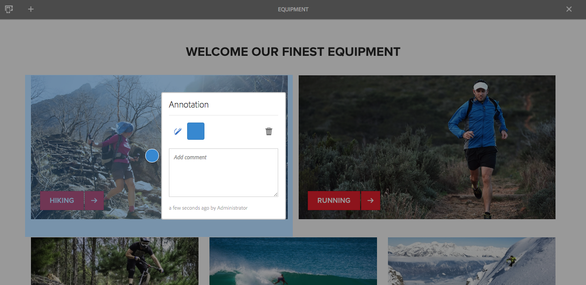
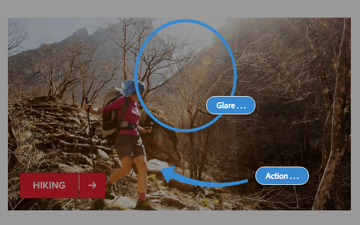

# Anotações ao editar uma página{#annotations-when-editing-a-page}

Com frequência, a adição de conteúdo às páginas do seu website está sujeita a discussões antes da publicação efetiva. Para auxiliar nesse processo, muitos componentes diretamente relacionados ao conteúdo (em oposição, por exemplo, ao layout) permitem a adição de uma anotação.

Uma anotação coloca um marcador colorido/nota adesiva na página. A anotação permite a você (ou outros usuários) deixar comentários e/ou perguntas para outros autores/revisores.

>[!NOTE]
>
>A definição de um tipo de componente individual determina se é possível adicionar uma anotação (ou não) nas instâncias desse componente.

>[!NOTE]
>
>As anotações criadas na interface do usuário clássica serão exibidas na interface do usuário habilitada para toque. No entanto, rascunhos são específicos da interface do usuário e são exibidos apenas na interface do usuário na qual foram criados.

>[!CAUTION]
>
>A exclusão de um recurso (por exemplo, parágrafo) exclui todas as anotações e rascunhos associados a ele, independentemente de sua posição na página como um todo.

>[!NOTE]
>
>Dependendo dos seus requisitos, também é possível desenvolver um fluxo de trabalho para enviar notificações quando anotações são adicionadas, atualizadas ou excluídas.

## Anotações {#annotations}

Um [modo](/help/sites-authoring/author-environment-tools.md#page-modes) é usado para criar e visualizar anotações.

>[!NOTE]
>
>Não esqueça que [comentários](/help/sites-authoring/basic-handling.md#timeline) também estão disponíveis para fornecer feedback em uma página.

>[!NOTE]
>
>É possível fazer anotações em vários recursos:
>
>* [Anotação de ativos](/help/assets/manage-assets.md#annotating)
>* [Anotação de ativos de vídeo](/help/assets/managing-video-assets.md#annotate-video-assets)

>

### Anotação em componente {#annotating-a-component}

O modo Anotar permite criar, editar, mover ou excluir anotações de seu conteúdo:

1. Você pode entrar no modo Anotar usando o ícone na barra de ferramentas (canto superior direito) ao editar uma página:

   

   Agora é possível exibir todas as anotações existentes.

   >[!NOTE]
   >
   >Para sair do modo Anotar, toque/clique no ícone Anotar (símbolo x) à direita da barra de ferramentas superior.

1. Clique/toque no ícone Adicionar anotação (símbolo de mais à esquerda da barra de ferramentas) para começar a adicionar as anotações.

   >[!NOTE]
   >
   >Para parar de adicionar as anotações (e voltar à exibição), toque/clique no ícone Cancelar (símbolo x em um círculo branco) à esquerda da barra de ferramentas superior.

1. Clique/toque no componente desejado (os componentes que podem ser anotados serão destacados com uma borda azul) para adicionar a anotação e abrir a caixa de diálogo:

   

   Aqui, você pode usar o campo e/ou ícone apropriado para:

   * Inserir o texto da anotação.
   * Criar um rascunho (linhas e formas) para realçar uma área do componente.

      O cursor se transformará em uma cruz durante a criação de um rascunho. Você pode desenhar várias linhas distintas. A linha de rascunho reflete a cor da anotação e pode ser uma seta, círculo ou forma oval.
   

   * Escolher/alterar a cor:

   

   * Excluir a anotação.

   

1. Você pode fechar a caixa de diálogo de anotação clicando/tocando fora dela. Uma exibição truncada (a primeira palavra) da anotação, junto com os rascunhos existentes, é mostrada:

   

1. Depois que terminar de editar uma anotação específica, você pode:

   * Clicar/tocar em um marcador de texto para abrir a anotação. Depois de aberta, você pode exibir o texto completo, fazer alterações ou excluir a anotação.

      * Rascunhos não podem ser excluídos independentemente da anotação.
   * Reposicionar o marcador de texto.
   * Clicar/tocar em uma linha de rascunho para selecionar esse rascunho e arrastá-lo para a posição desejada.
   * Mover ou copiar um componente

      * As anotações relacionadas e seus rascunhos também serão movidos ou copiados, e sua posição em relação ao parágrafo permanecerá a mesma.

1. Para sair do modo de Anotação e voltar ao modo usado anteriormente, toque/clique no ícone Anotar (símbolo x) à direita da barra de ferramentas superior.

>[!NOTE]
>
>As anotações não podem ser adicionadas a uma página que foi bloqueada por outro usuário.

### Indicador de anotação {#annotation-indicator}

As anotações não aparecem no modo Editar, mas o selo na parte superior direita da barra de ferramentas mostra quantas anotações existem para a página atual. O selo substitui o ícone de Anotações padrão, mas ainda funciona como um link rápido que alterna de/para o modo Anotar:

