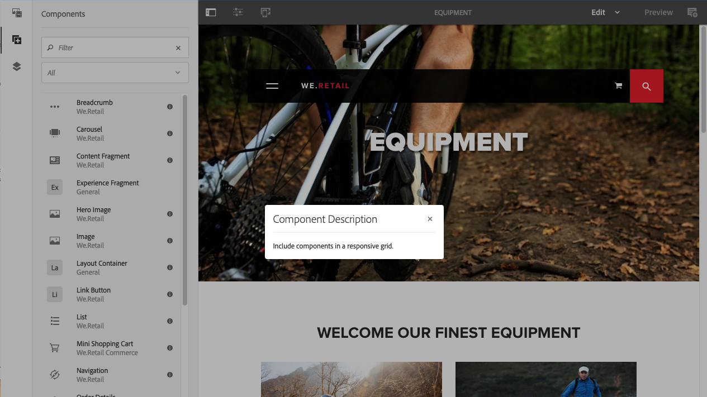
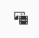

# Criação - o ambiente e as ferramentas{#authoring-the-environment-and-tools}

O ambiente de criação do AEM fornece vários mecanismos para organização e edição de conteúdo. As ferramentas fornecidas são acessadas de vários consoles e editores de página.

## Gerenciar o site {#managing-your-site}

A variável **Sites** o console permite navegar e gerenciar o site, usando a barra de cabeçalho, a barra de ferramentas, os ícones de ação (aplicáveis ao recurso selecionado), as navegações estruturais e, quando selecionados, os painéis secundários (por exemplo, linha do tempo e referências).

Por exemplo, exibição de coluna:

## Editar conteúdo da página {#editing-page-content}

É possível editar uma página com o editor de páginas. Por exemplo:

`https://localhost:4502/editor.html/content/we-retail/us/en/equipment.html`

>[!NOTE]
>
>Na primeira vez que você abre uma página para edição, uma série de slides fornece um tour pelos recursos.
>
>Se desejar, é possível ignorar o tour e repeti-lo a qualquer momento, selecionando-o no menu **Informações da página**.

## Acessar ajuda   {#accessing-help}

Ao editar uma página, a **Ajuda** pode ser acessada de:

* o [**Informações da página**](/help/sites-authoring/editing-page-properties.md#page-properties) seletor; mostra os slides de introdução (como na primeira vez que você acessa o editor).
* o [configuração](/help/sites-authoring/editing-content.md#edit-configure-copy-cut-delete-paste) para componentes específicos (usando o ponto de interrogação (?) na barra de ferramentas da caixa de diálogo); mostra a Ajuda contextual.

Mais [recursos relacionados à ajuda estão disponíveis nos consoles](/help/sites-authoring/basic-handling.md#accessing-help).

## Navegador de componentes   {#components-browser}

O navegador de componentes mostra todos os componentes que estão disponíveis para uso em sua página atual. Elas podem ser arrastadas para o local apropriado e, em seguida, editadas para adicionar o conteúdo.

O navegador de componentes é uma guia dentro do painel lateral (junto com o [navegador de ativos](/help/sites-authoring/author-environment-tools.md#assets-browser) e a [árvore de conteúdo](/help/sites-authoring/author-environment-tools.md#content-tree)). Para abrir (ou fechar) o painel lateral, use o ícone na parte superior esquerda da barra de ferramentas:

Ao abrir o painel lateral, ele desliza do lado esquerdo (selecione a variável **Componentes** se necessário). Quando aberto, é possível navegar por todos os componentes disponíveis para sua página.

A aparência e o manuseio real dependem do tipo de dispositivo que você está usando:

>[!NOTE]
>
>Um dispositivo móvel é detectado quando a largura for menor que 1024px. Esse também pode ser o caso de uma janela de desktop pequena.

* **Dispositivo móvel (por exemplo, iPad)**

  O navegador de componentes cobre completamente a página que está sendo editada.

  Para adicionar um componente à página, toque e segure o componente desejado e mova-o para a direita - o navegador de componentes fecha para mostrar a página novamente - onde você pode posicionar o componente.

  

* **Desktop**

  O navegador de componentes é aberto no lado esquerdo da janela.

  Para adicionar um componente à página, clique no componente desejado e arraste-o para o local desejado.

  

  Os componentes são representados por

   * Nome do componente
   * Grupo do componente (em cinza)
   * Ícone ou abreviação

      * Os ícones dos componentes padrão são monocromáticos.
      * As abreviações são sempre os dois primeiros caracteres do nome do componente.

  Na barra de ferramentas superior do **Componentes** navegador, você pode fazer o seguinte:

   * Filtrar componentes por nome.
   * Limitar a exibição para um grupo específico usando a seleção suspensa.

  Para obter uma descrição mais detalhada do componente, clique no ícone de informações ao lado do componente na **Componentes** navegador (se disponível). Por exemplo, para o **Contêiner de layout**:

  

  Para mais informações sobre os componentes disponíveis para você, consulte [Console de componentes](/help/sites-authoring/default-components-console.md).

## Navegador de ativos {#assets-browser}

O navegador de ativos mostra todos os [ativos](/help/assets/assets.md) disponíveis para uso direto em sua página atual.

O navegador de ativos é uma guia dentro do painel lateral juntamente com o [componentes procurar](/help/sites-authoring/author-environment-tools.md#components-browser)r e [árvore de conteúdo](/help/sites-authoring/author-environment-tools.md#content-tree). Para abrir ou fechar o painel lateral, use o ícone na parte superior esquerda da barra de ferramentas:

Quando você abre o painel lateral, ele desliza do lado esquerdo. Selecione o **Assets** se necessário.

Quando o navegador de ativos estiver aberto, você poderá navegar por todos os ativos disponíveis para sua página. A rolagem infinita é usada para expandir a lista quando necessário.

Para adicionar um ativo à sua página, selecione-o e arraste-o até o local desejado. Pode ser:

* Um componente existente do tipo apropriado.

   * Por exemplo, você pode arrastar um ativo de imagem para um componente de imagem.

* A [espaço reservado](/help/sites-authoring/editing-content.md#component-placeholder) no sistema de parágrafo para criar um componente do tipo apropriado.

   * Por exemplo, você pode arrastar um ativo de imagem para o sistema de parágrafo para criar um componente de imagem.

>[!NOTE]
>
>Isso está disponível para tipos específicos de ativos e componentes. Consulte [Inserção de um componente usando o Navegador de ativos](/help/sites-authoring/editing-content.md#inserting-a-component-using-the-assets-browser) para obter mais detalhes.

Na barra de ferramentas superior do navegador de ativos, é possível filtrar os ativos por:

* Nome
* Caminho
* Tipo de ativo, como imagens, manuscritos, documentos, vídeos, páginas, parágrafos e produtos
* Características do ativo, como Orientação (Retrato, Paisagem, Quadrado) e Estilo (Cor, Monocromático, Tons de cinza)

   * Disponível somente para certos tipos de ativos

A aparência e o manuseio real dependem do tipo de dispositivo que você está usando:

>[!NOTE]
>
>Um dispositivo móvel é detectado quando a largura é menor do que 1024px, ou seja, isso também inclui em uma janela de desktop pequena.

* **Dispositivo móvel, como o iPad**

  O navegador de arquivos cobre completamente a página que está sendo editada.

  Para adicionar um ativo à página, toque e segure o ativo necessário e mova-o para a direita: o navegador de ativos é fechado para mostrar a página novamente, onde é possível adicionar o ativo ao componente necessário.

  

* **Desktop**

  O navegador de ativos é aberto no lado esquerdo da janela.

  Para adicionar um ativo à página, clique no ativo e arraste-o para o componente ou local necessário.

  

Se precisar alterar rapidamente um ativo, você pode iniciar o [Editor de ativos](/help/assets/manage-assets.md) diretamente do navegador de ativos, clicando no ícone editar mostrado ao lado do nome do ativo.

## Árvore de conteúdo {#content-tree}

A variável **Árvore de conteúdo** fornece uma visão geral de todos os componentes na página em uma hierarquia para que você possa ver de perto como a página é composta.

A Árvore de conteúdo é uma guia dentro do painel lateral (junto com o navegador de componentes e de ativos). Para abrir ou fechar o painel lateral, use o ícone na parte superior esquerda da barra de ferramentas:

Ao abrir o painel lateral, ele desliza para abrir (do lado esquerdo). Selecione a guia **Árvore de conteúdo**, se necessário. Ao abrir, é possível ver uma representação em exibição de árvore da página ou do modelo, para que seja mais fácil entender como o conteúdo é estruturado hierarquicamente. Além disso, em uma página complexa, facilita a alternância entre componentes da página.

Uma página pode ser facilmente composta por vários componentes do mesmo tipo, portanto a árvore de conteúdo (componente) exibe o texto descritivo (em cinza) após o nome do tipo de componente (em preto). O texto descritivo vem das propriedades comuns do componente, como título ou texto.

Os tipos de componentes são mostrados no idioma do usuário, enquanto o texto de descrição do componente vem do idioma da página.

Clicar na divisa ao lado de um componente recolhe ou expande esse nível.

>[!NOTE]
>
>A Árvore de conteúdo não ficará disponível se você estiver editando uma página em um dispositivo móvel (se a largura do navegador for menor do que 1024px).

Clicar no componente realça o componente no editor de páginas. As ações disponíveis dependem do estado da página:

* Por exemplo, uma página básica:

  `https://localhost:4502/editor.html/content/we-retail/language-masters/en/equipment.html`

  

  Se o componente clicado na árvore for editável, um ícone de chave inglesa aparecerá à direita do nome. Clicar nesse ícone abre a caixa de diálogo de edição do componente.

  

* Ou uma página que faça parte de um [livecopy](/help/sites-administering/msm.md), em que os componentes são herdados de outra página; por exemplo:

  `https://localhost:4502/editor.html/content/we-retail/us/en/equipment.html`

  

## Fragmentos: navegador do conteúdo associado {#fragments-associated-content-browser}

Se a página contiver Fragmentos do conteúdo, você terá acesso à [navegador para conteúdo associado](/help/sites-authoring/content-fragments.md#using-associated-content).

## Referências {#references}

**Referências** mostrar conexões com a página selecionada:

* Blueprints
* Lançamentos
* Live copies
* Cópias de idioma
* Links de entrada
* Uso do componente de referência: conteúdo emprestado e concedido
* Referências às páginas de produtos (no console Commerce - Produtos)

Abra o console e navegue até o recurso desejado, e abra **Referências** usando:

[Selecione o recurso desejado](/help/sites-authoring/basic-handling.md#viewing-and-selecting-resources) A mostra uma lista de tipos de referências relevantes para esse recurso:

Selecione o tipo de referência apropriado para obter mais informações. Em determinadas situações, outras ações estarão disponíveis quando você selecionar uma referência específica, incluindo:

* **Links de entrada** fornece uma lista de páginas que fazem referência à página, juntamente com acesso direto a **Editar** uma dessas páginas ao selecionar um link específico.

   * Isso só pode mostrar links estáticos, não links gerados dinamicamente; por exemplo, do componente List.

* Instâncias de conteúdo emprestado e concedido usando o componente **Referência**, daqui você pode navegar até a página de referência/referenciada

* [Referências às páginas de produto](/help/commerce/cif-classic/administering/generic.md#showing-product-references) (disponível no console Commerce-Products)
* [Lançamentos](/help/sites-authoring/launches.md) O fornece acesso a inicializações relacionadas.
* As [Live Copies](/help/sites-administering/msm.md) exibem os caminhos de todas as live copies que são baseadas no recurso selecionado.
* [Blueprint](/help/sites-administering/msm-best-practices.md) O fornece detalhes e várias ações.
* [Cópias de idiomas](/help/sites-administering/tc-manage.md#creating-translation-projects-using-the-references-panel) O fornece detalhes e várias ações.

Por exemplo, você pode corrigir uma referência quebrada em um componente Referência:

## Eventos - Linha do tempo {#events-timeline}

Para os recursos adequados (por exemplo, as páginas no console **Sites** ou os ativos no console **Ativos**), a [linha do tempo pode ser usada para mostrar a atividade recente de qualquer item selecionado](/help/sites-authoring/basic-handling.md#timeline).

Abra o console e navegue até o recurso desejado, e abra **Linha do tempo** usando:

[Selecione o recurso desejado](/help/sites-authoring/basic-handling.md#viewing-and-selecting-resources), em seguida escolha **Exibir todos** ou **Atividades** para listar as ações recentes nos recursos selecionados:

## Informações da página {#page-information}

O botão Informações da página (ícone de equalizador) abre um menu que também fornece detalhes sobre a última edição e a última publicação. Dependendo das características da página, de seu site e instância, mais ou menos opções podem estar disponíveis:

* [Abrir propriedades](/help/sites-authoring/editing-page-properties.md)
* [Página de implantação](/help/sites-administering/msm.md#msm-from-the-ui)
* [Iniciar fluxo de trabalho](/help/sites-authoring/workflows-applying.md#starting-a-workflow-from-the-page-editor)
* [Bloquear página](/help/sites-authoring/editing-content.md#locking-a-page)
* [Publicar página](/help/sites-authoring/publishing-pages.md#main-pars-title-10)
* [Desfazer a publicação da página](/help/sites-authoring/publishing-pages.md#main-pars-title-5)
* [Editar modelo](/help/sites-authoring/templates.md); quando a página for baseada em um [modelo editável](/help/sites-authoring/templates.md#editable-and-static-templates)

* [Exibir como publicado](/help/sites-authoring/editing-content.md#view-as-published)
* Exibir no Admin; abre a página no [console de sites](/help/sites-authoring/basic-handling.md#viewing-and-selecting-resources)
* [Ajuda](/help/sites-authoring/basic-handling.md#accessing-help)

Por exemplo, quando apropriado, **Informações da página** O também tem as opções:

* [Promover lançamento](/help/sites-authoring/launches-promoting.md) se a página for um lançamento
* [Abrir na interface clássica](/help/sites-authoring/select-ui.md#switching-to-classic-ui-when-editing-a-page) se esta opção foi [habilitado por um administrador](/help/sites-administering/enable-classic-ui-editor.md)

Além disso, as **Informações da página** podem fornecer acesso a análises e recomendações, quando apropriado.

## Modos de página   {#page-modes}

Há vários modos ao editar uma página o que permite diversas ações:

* [Editar](/help/sites-authoring/editing-content.md) - usar esse modo ao editar o conteúdo da página.
* [Layout](/help/sites-authoring/responsive-layout.md) - permite criar e editar o layout responsivo dependendo do dispositivo (se a página for baseada em um contêiner de layout)

* [Andaime](/help/sites-authoring/scaffolding.md) : ajuda a criar um grande conjunto de páginas que compartilham estrutura, mas têm conteúdo diferente.
* [Desenvolvedor](/help/sites-developing/developer-mode.md) - permite executar várias ações (requer privilégios). Isso inclui a inspeção dos detalhes técnicos de uma página e seus componentes.

* [Design](/help/sites-authoring/default-components-designmode.md) - permite ativar/desativar componentes para uso em uma página e configurar o design do componente (se a página for baseada em um [modelo estático](/help/sites-authoring/templates.md#editable-and-static-templates)).

* [Direcionamento](/help/sites-authoring/content-targeting-touch.md): aumente a relevância do conteúdo por meio do direcionamento e da medição em todos os canais.
* [Activity Map](/help/sites-authoring/page-analytics-using.md#analyticsvisiblefromthepageeditor) - mostra os dados do Analytics para a página.

* [Timewarp](/help/sites-authoring/working-with-page-versions.md#timewarp) - permite a exibição do estado das páginas em um momento específico.
* [Status da Live Copy](/help/sites-authoring/editing-content.md#live-copy-status): permite uma visão geral rápida do status da live copy e de quais componentes são, ou não, herdados.
* [Visualização](/help/sites-authoring/editing-content.md#previewing-pages): usado para visualizar a página da forma que será exibida no ambiente de publicação ou navegar usando os links no conteúdo.

* [Anotar](/help/sites-authoring/annotations.md) - usado para adicionar ou exibir anotações na página.

Você pode acessá-los usando os ícones no canto superior direito. O ícone real é alterado para refletir o modo que você está usando no momento:

>[!NOTE]
>
>* Dependendo das características da página, alguns modos podem não estar disponíveis.
>* O acesso a alguns modos requer as permissões/privilégios apropriados.
>* O modo de desenvolvedor não está disponível em dispositivos móveis devido a restrições de espaço.
>* Existe uma [atalho de teclado](/help/sites-authoring/page-authoring-keyboard-shortcuts.md) ( `Ctrl-Shift-M`) para alternar entre **Visualizar** e o modo selecionado no momento (por exemplo, **Editar**, e **Layout**).
>

## Seleção de caminho {#path-selection}

Geralmente, durante a criação, é necessário selecionar outro recurso, como ao definir um link para outra página ou recurso ou ao selecionar uma imagem. Para selecionar facilmente um caminho, os [campos de caminho](/help/sites-authoring/author-environment-tools.md#path-fields) oferecem preenchimento automático e o [navegador de caminhos](/help/sites-authoring/author-environment-tools.md#path-browser) permite uma seleção mais robusta.

### Campos de caminho   {#path-fields}

O exemplo usado aqui para ilustrar é o componente de imagem. Para obter mais informações sobre como usar e editar componentes, consulte [Componentes para criação de página](/help/sites-authoring/default-components.md).

Agora, os campos de caminho têm funcionalidade antecipada e de preenchimento automático, para facilitar a localização de um recurso.

Clicar no botão **Abrir caixa de diálogo** no campo de caminho abre a caixa de diálogo [navegador de caminho](/help/sites-authoring/author-environment-tools.md#path-browser) para permitir opções mais detalhadas de seleção.

Como alternativa, comece a digitar no campo de caminho e o AEM oferece caminhos correspondentes à medida que você digita.

### Navegador de caminhos {#path-browser}

O navegador de caminho é organizado da mesma maneira que a [exibição de coluna](/help/sites-authoring/basic-handling.md#column-view) do console de sites, permitindo uma seleção mais detalhada dos recursos.

* Após selecionar um recurso, o botão **Selecionar** no canto superior direito da caixa de diálogo se torna ativo. Clique em para confirmar a seleção ou **Cancelar** para suspender.
* Se o contexto permite a seleção de vários recursos, selecionar um recurso também ativa o botão **Selecionar**, mas, além disso, adiciona uma contagem do número de recursos selecionados no canto superior direito da janela. Clique em **X** ao lado do número para desmarcar tudo.
* Ao navegar pela árvore, sua localização é refletida na navegação estrutural na parte superior da caixa de diálogo. Essas navegações estruturais também podem ser usadas para saltar rapidamente dentro da hierarquia de recursos.
* A qualquer momento, você pode usar o campo de pesquisa na parte superior da caixa de diálogo. Clique no **X** no campo de pesquisa para limpar a pesquisa.
* Para limitar sua pesquisa, você pode revelar as opções de filtro e filtrar seus resultados com base em um determinado caminho.

  

## Atalhos de teclado {#keyboard-shortcuts}

Vários [atalhos de teclado](/help/sites-authoring/page-authoring-keyboard-shortcuts.md) estão disponíveis.
