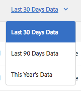
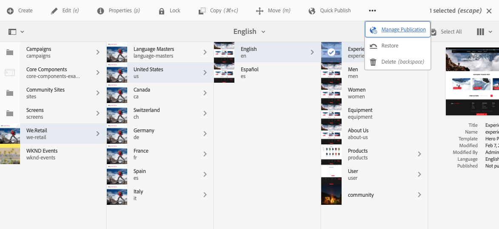
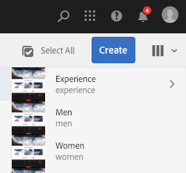
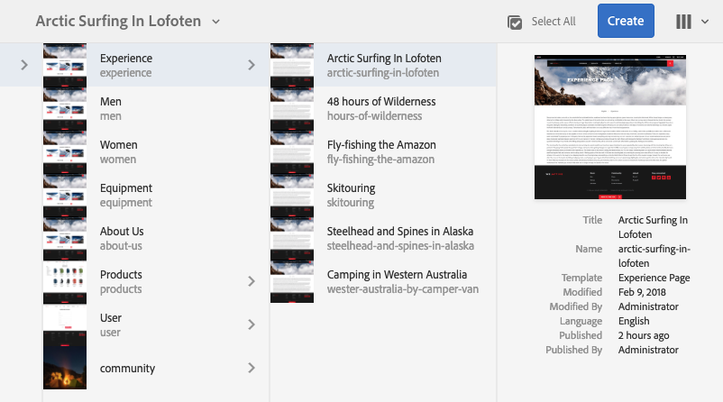
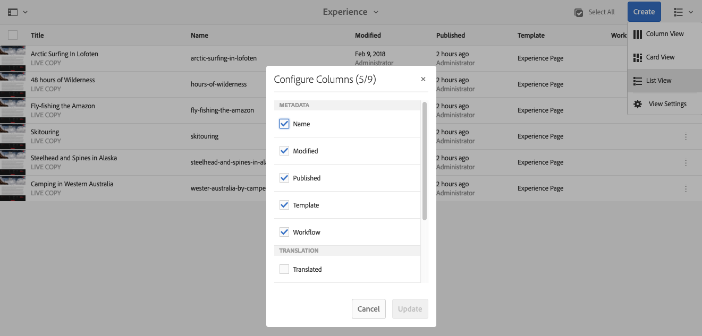
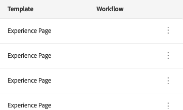

# Manuseio básico{#basic-handling}

>[!NOTE]
>
>* Esta página foi projetada para fornecer uma visão geral do manuseio básico ao usar o ambiente de autor do Adobe Experience Manager (AEM). Usa o console **Sites** como base.
>
>* Algumas funcionalidades podem ou não estar disponíveis dependendo do console. Informações específicas sobre os consoles individuais e suas funcionalidades relacionadas são abordadas com mais detalhes em outras páginas.
>* Os atalhos de teclado estão disponíveis em todo o AEM. Principalmente ao [usar consoles](/help/sites-authoring/keyboard-shortcuts.md) e [editar páginas](/help/sites-authoring/page-authoring-keyboard-shortcuts.md).
>

## Introdução {#getting-started}

### Uma interface de usuário habilitada para toque {#a-touch-enabled-ui}

A interface de usuário do AEM foi habilitada para toque. Uma interface habilitada para toque permite que você use toques para interagir com o software por meio de gestos como selecionar, tocar e segurar e deslizar o dedo. Isso contrasta com o modo como uma interface de desktop tradicional opera com ações do mouse, como clicar, clicar duas vezes, clicar com o botão direito do mouse e passar o mouse.

Como a interface do usuário do AEM é habilitada para toque, você pode usar os gestos de toque nos dispositivos de toque (por exemplo, dispositivos móveis ou tablets) e as ações do mouse em um dispositivo de desktop tradicional.

### Primeiras etapas {#first-steps}

Logo após o logon, você acessa o [painel de Navegação](#navigation-panel). Selecionar uma das opções abre o respectivo console.

>[!NOTE]
>
>Para obter uma boa compreensão do uso básico do AEM, este documento se baseia no console **Sites**.
>
>Para começar, clique em **Sites**.

### Navegação do produto   {#product-navigation}

Sempre que um usuário acessa um console pela primeira vez, um tutorial de navegação de produto é iniciado. Clique aqui para obter uma boa visão geral do manuseio básico do AEM.

Clique em **Avançar** para avançar para a próxima página da visão geral. Clique em **Fechar** ou fora da caixa de diálogo de visão geral para fechar.

A visão geral será reiniciada na próxima vez que você acessar um console a menos que visualize todos os slides ou marque a opção **Não mostrar esta mensagem novamente**.

## Navegação global {#global-navigation}

É possível navegar entre os consoles usando o painel de navegação global. É acionado como uma lista suspensa de tela cheia ao clicar no link do Adobe Experience Manager na parte superior esquerda da tela.

Você pode fechar o painel de navegação global clicando ou tocando em **Fechar** para retornar ao seu local anterior.

>[!NOTE]
>
>Ao fazer logon pela primeira vez, você verá o painel **Navegação**

A navegação global possui dois painéis, representados por ícones na margem esquerda da tela:

* **[Navegação](/help/sites-authoring/basic-handling.md#navigation-panel)** - Representado por uma bússola  
* **[Ferramentas](/help/sites-authoring/basic-handling.md#tools-panel)**: representadas por um martelo

As opções disponíveis nesses painéis estão descritas abaixo.

### Painel Navegação   {#navigation-panel}

O painel Navegação fornece acesso aos consoles do AEM:

O título da guia do navegador é atualizado para refletir sua localização à medida que você navega pelos consoles e conteúdo.

Em Navegação, os consoles disponíveis são:

<table>
 <tbody>
  <tr>
   <td><strong>Console</strong></td>
   <td><strong>Propósito</strong></td>
  </tr>
  <tr>
   <td>Assets  </td>
   <td>Esses consoles permitem importar e <a href="/help/assets/assets.md">gerenciar ativos digitais</a> como imagens, vídeos, documentos e arquivos de áudio. Esses ativos podem ser usados por um site em execução na mesma instância do AEM. </td>
  </tr>
  <tr>
   <td>Communities</td>
   <td>Este console permite criar e gerenciar <a href="/help/communities/sites-console.md">sites de comunidade</a> para <a href="/help/communities/overview.md#engagement-community">envolvimento</a> e <a href="/help/communities/overview.md#enablement-community">habilitação</a>.</td>
  </tr>
  <tr>
   <td>Commerce</td>
   <td>Isso permite gerenciar produtos, catálogos de produtos e pedidos relacionados aos sites do <a href="/help/commerce/cif-classic/administering/ecommerce.md">Commerce</a>.</td>
  </tr>
  <tr>
   <td>Fragmentos de experiência</td>
   <td>Um <a href="/help/sites-authoring/experience-fragments.md">Fragmento de experiência</a> é uma experiência independente que pode ser reutilizada em vários canais e que apresenta variações, evitando o trabalho de copiar e colar repetidamente as experiências ou partes das experiências.</td>
  </tr>
  <tr>
   <td>Forms</td>
   <td>Este console permite criar, gerenciar e processar seus <a href="/help/forms/using/introduction-aem-forms.md">formulários e documentos</a>.</td>
  </tr>
  <tr>
   <td>Personalização</td>
   <td>Este console fornece uma <a href="/help/sites-authoring/personalization.md">estrutura de ferramentas para a criação de conteúdo direcionado e a apresentação de experiências personalizadas</a>.</td>
  </tr>
  <tr>
   <td>Projetos</td>
   <td>O console <a href="/help/sites-authoring/touch-ui-managing-projects.md">Projetos fornece acesso direto aos seus projetos</a>. Projetos são painéis virtuais. Eles podem ser usados para criar uma equipe e, em seguida, conceder a essa equipe acesso a recursos, fluxos de trabalho e tarefas, permitindo que as pessoas trabalhem em uma meta comum.   </td>
  </tr>
  <tr>
   <td>Screens</td>
   <td>O <a href="https://experienceleague.adobe.com/docs/experience-manager-screens/user-guide/authoring/setting-up-projects/creating-a-screens-project.html">Screens</a> permite que você gerencie todas as suas telas direcionadas aos clientes, de qualquer tamanho e local.</td>
  </tr>
  <tr>
   <td>Sites</td>
   <td>O console Sites permite <a href="/help/sites-authoring/page-authoring.md">criar, exibir e gerenciar sites</a> em execução na sua instância do AEM. Por meio desses consoles, você pode criar, editar, copiar, mover e excluir páginas do site, iniciar fluxos de trabalho e publicar páginas.  </td>
  </tr>
 </tbody>
</table>

### Painel Ferramentas {#tools-panel}

No painel Ferramentas, cada opção no painel lateral contém uma variedade de submenus. Os [consoles Ferramentas](/help/sites-administering/tools-consoles.md) disponíveis aqui fornecem acesso a várias ferramentas e consoles especializados que ajudam a administrar seus sites, ativos digitais e outros aspectos do seu repositório de conteúdo.

## O Cabeçalho {#the-header}

O cabeçalho está sempre presente na parte superior da tela. Embora a maioria das opções no cabeçalho permaneça a mesma, independentemente de onde você esteja no sistema, algumas são específicas do contexto.

* [Navegação global](#navigatingconsolesandtools)

  Selecione o link **Adobe Experience Manager** onde você pode navegar entre consoles.

  

* [Pesquisar](/help/sites-authoring/search.md)

  

  Você também pode usar a [tecla de atalho](/help/sites-authoring/keyboard-shortcuts.md) `/` (barra) para invocar a pesquisa em qualquer console.

* [Soluções](https://business.adobe.com/)

  

* [Ajuda](#accessinghelptouchoptimizedui)

  

* [Notificações](/help/sites-authoring/inbox.md)

  

  Esse ícone é marcado com o número de notificações incompletas atribuídas no momento.

  >[!NOTE]
  >
  >O AEM pronto para uso vem pré-carregado com tarefas administrativas atribuídas ao grupo de usuários administrador. Consulte [Sua Caixa de Entrada - Tarefas administrativas predefinidas](/help/sites-authoring/inbox.md#out-of-the-box-administrative-tasks) para obter detalhes.

* [Propriedades do usuário](/help/sites-authoring/user-properties.md)

  

* [Seletor de painéis](/help/sites-authoring/basic-handling.md#rail-selector)

  

  As opções apresentadas dependem do seu console atual. Por exemplo, em **Sites**, é possível selecionar somente o conteúdo (o padrão), a linha do tempo, as referências ou o painel lateral de filtros.

  

* Navegações estruturais

  

  Aparece no meio do painel e sempre mostra a descrição do item selecionado no momento, as navegações estruturais permitem que você navegue dentro de um console específico. No console Sites, você pode navegar pelos níveis do seu site.

  Clicar no texto de navegação estrutural abre uma lista suspensa que lista os níveis da hierarquia do item selecionado no momento. Para ir para esse local, clique em uma entrada.

  

* Seleção de período do Analytics

  

  Isso está disponível somente na exibição em lista. Para obter mais informações, consulte a [exibição de lista](#list-view).

* Botão **Criar**

  

  Uma vez clicado, as opções exibidas são adequadas ao console/contexto.

* [Exibições](/help/sites-authoring/basic-handling.md#viewingandselectingyourresourcescardlistcolumn)

  O ícone de exibição está na extrema direita da barra de ferramentas do AEM. Como também indica a exibição atual, ele muda. Por exemplo, no modo de exibição padrão, e **Exibição de coluna** ele aparece da seguinte forma:

  

  Você pode alternar entre a exibição de coluna, exibição de cartão e exibição de lista. A exibição em lista mostra as configurações de exibição.

  

* Navegação pelo teclado

  Você pode navegar por um site usando apenas o teclado. Isso usa a funcionalidade padrão do navegador da tecla **TAB** (ou **OPT+TAB**) para que você possa percorrer os elementos na página que são *focalizáveis*.

  No console **Sites**, há a opção adicionada a **Pular para o conteúdo principal**. Isso se torna visível à medida que você *guia* pelas opções de cabeçalho e acelera a navegação, permitindo que você ignore os elementos padrão na barra de ferramentas (produto) e vá diretamente para o conteúdo principal.

  

## Acessar ajuda   {#accessing-help}

Há vários recursos de ajuda disponíveis:

* **Barra de ferramentas do console**

  Dependendo da sua localização, o ícone **Ajuda** abre os recursos apropriados:

  

* **Navegação**

  Na primeira vez que você navega pelo sistema, [uma série de slides apresenta a navegação no AEM](/help/sites-authoring/basic-handling.md#product-navigation).

* **Editor de página**

  Na primeira vez que você edita uma página, uma série de slides apresenta o editor de páginas.

  

  Navegue por essa visão geral como faria com a [visão geral de navegação do produto](/help/sites-authoring/basic-handling.md#product-navigation) ao acessar qualquer console pela primeira vez.

  No menu **Informações da Página**, você pode selecionar [**Ajuda**](/help/sites-authoring/author-environment-tools.md#accessing-help) para exibir isso novamente, a qualquer momento.

* **Console de ferramentas**

  No console **Ferramentas**, você também pode acessar os **Recursos** externos:

   * **Documentação**
Exibir a documentação do Gerenciamento de experiência na Web

   * **Recursos do desenvolvedor**
Recursos e downloads do desenvolvedor

  >[!NOTE]
  >
  >É possível acessar uma visão geral das teclas de atalho disponíveis a qualquer momento, usando a tecla de atalho `?` (ponto de interrogação) em um console.
  >
  >Para obter uma visão geral de todos os atalhos de teclado, consulte o seguinte:
  >
  >* [Atalhos de teclado para editar páginas](/help/sites-authoring/page-authoring-keyboard-shortcuts.md)
  >* [Atalhos de teclado para os consoles](/help/sites-authoring/keyboard-shortcuts.md)

## Barra de ferramentas de Ações {#actions-toolbar}

Sempre que um recurso é selecionado (por exemplo, uma página ou um ativo), várias ações são indicadas por ícones com texto explicativo na barra de ferramentas. Essas ações dependem do seguinte:

* Do console atual
* Do contexto atual
* Se você estiver no [modo de seleção](#navigatingandselectionmode) ou não

As ações disponíveis na barra de ferramentas mudam para refletir as ações que você pode realizar nos itens específicos selecionados.

A forma como você [seleciona um recurso](/help/sites-authoring/basic-handling.md#viewing-and-selecting-resources) depende da exibição.

Devido às restrições de espaço em algumas janelas, a barra de ferramentas pode tornar-se rapidamente maior do que o espaço disponível. Quando isso acontecer, opções adicionais serão exibidas. Clicar ou tocar nas reticências (três pontos ou **...**) abre um seletor suspenso com todas as ações restantes. Por exemplo, após selecionar uma página no console **Sites**:

>[!NOTE]
>
>Os ícones individuais disponíveis são documentados em relação ao console/recurso/cenário apropriado.

## Ações rápidas {#quick-actions}

Na [Exibição de Cartão](#cardviewquickactions), determinadas ações estão disponíveis como ícones de ação rápida e na barra de ferramentas. Os ícones de ação rápida estão disponíveis para um único item de cada vez e eliminam a necessidade de pré-seleção.

As ações rápidas são visíveis quando você passa o mouse sobre (dispositivo de desktop) um cartão de recursos. As ações rápidas disponíveis podem depender do console e do contexto. Por exemplo, estas são as ações rápidas para uma página no console **Sites**:

## Visualização e seleção de recursos {#viewing-and-selecting-resources}

Visualizar, navegar e selecionar são conceitualmente iguais em todas as exibições, mas têm pequenas variações de manuseio, dependendo da exibição usada.

É possível visualizar, navegar e selecionar (para novas ações) os recursos com qualquer uma das exibições disponíveis, que podem ser selecionadas por meio do ícone no canto superior direito:

* [Exibição de coluna](#column-view)
* [Exibição de cartão](#card-view)

* [Exibição de lista](#list-view)

>[!NOTE]
>
>Por padrão, o AEM Assets não exibe as representações originais de ativos na interface como miniaturas em nenhuma das exibições. Se você for um administrador, poderá usar sobreposições para configurar o AEM Assets e exibir representações originais como miniaturas.

### Seleção de recursos   {#selecting-resources}

Selecionar um recurso específico depende de uma combinação da exibição e do dispositivo:

<table>
 <tbody>
  <tr>
   <td> </td>
   <td>Selecionar</td>
   <td>Cancelar seleção</td>
  </tr>
  <tr>
   <td>Exibição de Coluna  </td>
   <td>
    <ul>
     <li>Área de Trabalho:  Clique na miniatura</li>
     <li>Dispositivos móveis:  Selecione a miniatura</li>
    </ul> </td>
   <td>
    <ul>
     <li>Área de Trabalho:  Clique na miniatura</li>
     <li>Dispositivos móveis:  Selecione a miniatura</li>
    </ul> </td>
  </tr>
  <tr>
   <td>Exibição de Cartão  </td>
   <td>
    <ul>
     <li>Área de Trabalho:  Passar o mouse sobre, em seguida, usar a ação rápida de marca de seleção</li>
     <li>Dispositivos móveis:  selecionam e mantêm o cartão</li>
    </ul> </td>
   <td>
    <ul>
     <li>Desktop:  Clique no cartão</li>
     <li>Dispositivos móveis:  Selecione o cartão</li>
    </ul> </td>
  </tr>
  <tr>
   <td>Exibição de lista</td>
   <td>
    <ul>
     <li>Área de Trabalho:  Clique na miniatura</li>
     <li>Dispositivos móveis:  Selecione a miniatura</li>
    </ul> </td>
   <td>
    <ul>
     <li>Área de Trabalho:  Clique na miniatura</li>
     <li>Dispositivos móveis:  Selecione a miniatura</li>
    </ul> </td>
  </tr>
 </tbody>
</table>

#### Selecionar tudo {#select-all}

É possível selecionar todos os itens em qualquer exibição clicando em **Selecionar tudo** no canto superior direito do console.

* Em **Exibição de Cartão**, todos os cartões estão selecionados.
* Na **Exibição de Lista**, todos os itens na lista são selecionados.
* Na **Exibição de Coluna**, todos os itens na coluna mais à esquerda são selecionados.

#### Desmarcar tudo {#deselecting-all}

Em todos os casos, ao selecionar itens, a contagem dos itens selecionados é exibida na parte superior direita da barra de ferramentas.

Você pode desmarcar todos os itens e sair do modo de seleção ao:

* clicando ou tocando no **X** ao lado da contagem,

* ou usando **escape**.

Em todas as visualizações, todos os itens podem ser desmarcados. Para isso, pressione a tecla Escape no teclado se você estiver usando um computador desktop.

#### Exemplo de seleção {#selecting-example}

1. Por exemplo, na exibição de cartão:

   

1. Quando você seleciona um recurso, o cabeçalho superior é coberto pela [barra de ferramentas das ações](#actionstoolbar), que fornece acesso às ações atualmente aplicáveis ao recurso selecionado.

   Para sair do modo de seleção, selecione **X** no canto superior direito, ou use **escape**.

### Exibição de coluna {#column-view}

A exibição de coluna permite uma navegação visual de uma árvore de conteúdo por uma série de colunas em cascata. Essa visualização permite visualizar e percorrer a estrutura de árvore do site.

Selecionar um recurso na coluna mais à esquerda exibe os recursos secundários em uma coluna à direita. Selecionar um recurso na coluna direita exibe os recursos secundários em outra coluna à direita e assim por diante.

* É possível navegar para cima e para baixo na árvore tocando ou clicando no nome do recurso ou na divisa à direita do nome do recurso.

   * O nome e a divisa do recurso são realçados quando tocados ou clicados.

     

   * Os filhos do recurso clicado/tocado são exibidos na coluna à direita do recurso clicado/tocado.
   * Se você clicar em um nome de recurso que não tenha filhos, seus detalhes serão exibidos na coluna final.

* Tocar ou clicar na miniatura seleciona o recurso.

   * Quando selecionada, uma marca de seleção é sobreposta à miniatura e o nome do recurso também é realçado.
   * Os detalhes do recurso selecionado são mostrados na coluna final.
   * A barra de ferramentas de ações ficará disponível.

     

  Quando uma página é selecionada na exibição de coluna, a página selecionada é exibida na coluna final junto com os seguintes detalhes:

   * Título da página
   * Nome da página (parte do URL da página)
   * Modelo no qual a página se baseia
   * Detalhes da modificação
   * Idioma da página
   * Detalhes da publicação

### Exibição de cartão {#card-view}

* A exibição de cartão mostra cartões de informação para cada item no nível atual. Eles fornecem informações como:

   * Uma representação visual do conteúdo da página.
   * O título da página.
   * Datas importantes (como a última edição e publicação).
   * A página está bloqueada, oculta ou faz parte de uma live copy.
   * Se apropriado, quando é necessário tomar medidas como parte de um fluxo de trabalho.

      * Marcadores que indicam ações necessárias podem estar relacionados a itens em sua [caixa de entrada](/help/sites-authoring/inbox.md).

* [Ações rápidas](#quick-actions) também estão disponíveis nessa visualização, como recursos de seleção e ações comuns, como “Editar”.

  

* É possível navegar para baixo na árvore tocando/clicando em cartões (com cautela para evitar as ações rápidas) ou para cima novamente usando a [navegação estrutural no cabeçalho](/help/sites-authoring/basic-handling.md#the-header).

### Exibição de lista {#list-view}

* A exibição de lista apresenta informações para cada recurso no nível atual.
* É possível navegar para baixo na árvore tocando/clicando no nome do recurso e fazer backup usando a [navegação estrutural no cabeçalho](/help/sites-authoring/basic-handling.md#the-header).

* Para selecionar facilmente todos os itens na lista, use a caixa de seleção no canto superior esquerdo da lista.

  

   * Quando todos os itens da lista forem selecionados, essa caixa de seleção aparecerá marcada.

      * Para desmarcar tudo, clique na caixa de seleção.

   * Quando apenas alguns itens são selecionados, ela aparece com um sinal de menos.

      * Para selecionar tudo, clique na caixa de seleção.
      * Para desmarcar tudo, clique novamente na caixa de seleção.

* Selecione as colunas a serem mostradas usando a opção **Configurações de Exibição**, localizada abaixo do botão Exibições. As seguintes colunas estão disponíveis para exibição:

   * **Nome**: o nome da página, que pode ser útil em um ambiente de criação multilíngue, pois faz parte do URL da página e não é alterado independentemente do idioma
   * **Modificado**: a última data de modificação e último usuário que modificou
   * **Publicado**: o status da publicação
   * **Modelo** - Modelo no qual a página se baseia
   * **Fluxo de trabalho**: o fluxo de trabalho atualmente aplicado à página. Mais informações estão disponíveis ao passar o mouse ou abrir a Linha do tempo.

   * **Análise de página**
   * **Visitantes únicos**
   * **Tempo na página**

  

  Por padrão, é exibida a coluna **Nome**, que faz parte do URL da página. Às vezes, o autor precisa acessar páginas que estão em um idioma diferente. Ver o nome da página (que geralmente é imutável) pode ser de grande ajuda se o autor não souber o idioma da página.

* Altere a ordem dos itens usando a barra vertical pontilhada na extremidade direita de cada item da lista.

  >[!NOTE]
  >
  >Alterar a ordem funciona somente em uma pasta ordenável que tenha o valor `jcr:primaryType` como `sling:OrderedFolder`.

  

  Clique na barra de seleção vertical e arraste o item para uma nova posição na lista.

  

* Você pode exibir os Dados do Analytics mostrando as colunas apropriadas usando a caixa de diálogo **Configurações de exibição**.

  Você pode filtrar os dados do Analytics dos últimos 30, 90 ou 365 dias usando as opções de filtro no lado direito do cabeçalho.

  

## Seletor de painéis {#rail-selector}

O **Seletor de painéis** está disponível no canto superior esquerdo da janela e exibe opções dependendo dos seus consoles atuais.

Por exemplo, no Sites, é possível selecionar somente conteúdo (padrão), árvore de conteúdo, linha do tempo, referências ou o painel lateral de filtro.

Se somente conteúdo for selecionado, apenas o ícone do painel será exibido. Se qualquer outra opção for selecionada, o nome da opção aparecerá ao lado do ícone do painel.

>[!NOTE]
>
>[Atalhos de teclado](/help/sites-authoring/keyboard-shortcuts.md) estão disponíveis para alternar rapidamente entre as opções de exibição do painel.

### Árvore de conteúdo {#content-tree}

A árvore de conteúdo pode ser usada para navegar rapidamente pela hierarquia do site no painel lateral e exibir muitas informações sobre as páginas na pasta atual.

Usando o painel lateral da árvore de conteúdo com uma exibição em lista ou exibição de cartões, os usuários podem ver facilmente a estrutura hierárquica do projeto. Eles podem navegar facilmente pela estrutura de conteúdo com o painel lateral da árvore de conteúdo e exibir informações detalhadas da página na exibição de lista.

>[!NOTE]
>
>Depois que uma entrada da exibição hierárquica é selecionada, as teclas de seta podem ser usadas para navegar rapidamente pela hierarquia.
>
>Consulte os [atalhos de teclado](/help/sites-authoring/keyboard-shortcuts.md) para obter mais informações.

### Linha do tempo {#timeline}

A linha do tempo pode ser usada para exibir e/ou iniciar eventos que ocorreram no recurso selecionado. Para abrir a coluna da linha do tempo, use o seletor do painel:

A coluna de linha do tempo permite:

* [Exibir vários eventos](#timelineviewevents) relacionados a um item selecionado.

   * Os tipos de eventos podem ser selecionados na lista suspensa:

      * [Comentários](#timelineaddingandviewingcomments)
      * Anotações
      * Atividades
      * [Lançamentos](/help/sites-authoring/launches.md)
      * [Versões](/help/sites-authoring/working-with-page-versions.md)
      * [Fluxos de trabalhos](/help/sites-authoring/workflows-applying.md)

         * exceto para [fluxos de trabalho transitórios](/help/sites-developing/workflows.md#transient-workflows), pois nenhuma informação de histórico é salva para eles

      * e Mostrar tudo

* [Adicionar/exibir comentários](#timelineaddingandviewingcomments) sobre o item selecionado. A caixa **Comentário** é exibida na parte inferior da lista de eventos. Digitar um comentário e Retornar registra o comentário. É exibido quando **Comentários** ou **Mostrar tudo** é selecionado.

* Os consoles específicos têm funcionalidade adicional. Por exemplo, no console Sites, é possível fazer o seguinte:

   * [Salve uma versão](/help/sites-authoring/working-with-page-versions.md#creatinganewversiontouchoptimizedui).
   * [Iniciar um fluxo de trabalho](/help/sites-authoring/workflows-applying.md#startingaworkflowfromtherail).

Essas opções são acessíveis por meio da divisa ao lado do campo **Comentário**.

### Referências {#references}

**Referências** mostram conexões com o recurso selecionado. Por exemplo, no console **Sites**, são mostradas [referências](/help/sites-authoring/author-environment-tools.md#showingpagereferences) para as páginas:

* [Blueprints](/help/sites-administering/msm.md)
* [Lançamentos](/help/sites-authoring/launches.md#launches-in-references-sites-console)
* [Live copies](/help/sites-administering/msm-livecopy-overview.md#openingthelivecopyoverviewfromreferences)
* [Cópias de idioma](/help/sites-administering/tc-prep.md#seeing-the-status-of-language-roots)
* Referência de conteúdo:

   * Links diretos de outras páginas para a página selecionada
   * Conteúdo emprestado de, concedido a ou ambos à página selecionada pelo componente Referência

### Filtro {#filter}

Isso abre um painel semelhante a [pesquisar](/help/sites-authoring/search.md), com os filtros de localização apropriados definidos, que permitem filtrar ainda mais o conteúdo que você deseja exibir.

