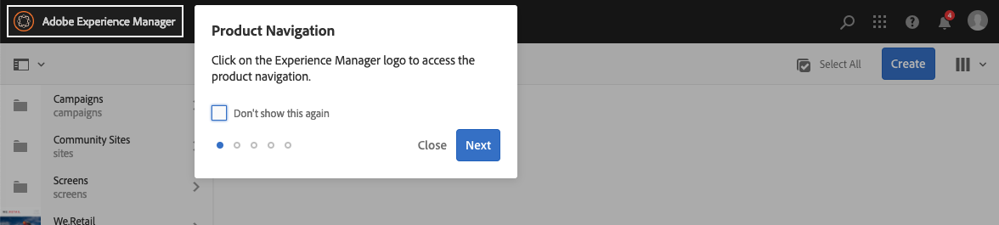

# Manuseio básico{#basic-handling}

>[!NOTE]
>
>* Esta página foi projetada para fornecer uma visão geral do manuseio básico ao usar o ambiente de autor do AEM. Usa o console **Sites** como base.
>
>* Algumas funcionalidades não estão disponíveis em todos os consoles e funcionalidades adicionais podem estar disponíveis em alguns consoles. Informações específicas sobre os consoles individuais e suas funcionalidades relacionadas serão abordadas com mais detalhes em outras páginas.
>* Os atalhos de teclado estão disponíveis em todo o AEM. Principalmente ao [usar páginas de console](/help/sites-authoring/keyboard-shortcuts.md) e [edição](/help/sites-authoring/page-authoring-keyboard-shortcuts.md).
>

## Introdução {#getting-started}

### Uma interface de usuário habilitada para toque {#a-touch-enabled-ui}

A interface de usuário do AEM foi habilitada para toque. Uma interface habilitada para toque permite que você use toques para interagir com o software por meio de gestos, como tocar, tocar e segurar e deslizar o dedo. Isso contrasta com o modo como uma interface de desktop tradicional opera com ações do mouse, como clicar, clicar duas vezes, clicar com o botão direito do mouse e passar o mouse.

Como a interface do usuário do AEM é habilitada para toque, você pode usar os gestos de toque nos dispositivos de toque (por exemplo, dispositivos móveis ou tablets) e as ações do mouse em um dispositivo de desktop tradicional.

### Primeiras etapas {#first-steps}

Logo após o logon, você acessa o [painel de Navegação](#navigation-panel). Selecionar uma das opções abre o respectivo console.

>[!NOTE]
>
>Para obter uma boa compreensão do uso básico do AEM, este documento se baseia no console de **Sites.**
>
>Clique ou toque em **Sites** para começar.

### Navegação do produto   {#product-navigation}

Sempre que um usuário acessa um console pela primeira vez, um tutorial de navegação de produto é iniciado. Reserve um minuto para clicar ou tocar para obter uma boa visão geral do manuseio básico do AEM.

Clique ou toque em **Avançar** para avançar para a próxima página da visão geral. Clique ou toque em **Fechar** ou fora da caixa de diálogo de visão geral para fechar.

A visão geral será reiniciada na próxima vez que você acessar um console a menos que visualize todos os slides ou marque a opção **Não mostrar esta mensagem novamente**.

## Navegação global {#global-navigation}

É possível navegar entre os consoles usando o painel de navegação global. É acionado como um menu suspenso de tela cheia quando você clica ou toca no link do Adobe Experience Manager na parte superior esquerda da tela.

Você pode fechar o painel de navegação global clicando ou tocando em **Fechar** para retornar ao seu local anterior.

>[!NOTE]
>
>Ao fazer logon pela primeira vez, você apresentou a **Navegação** painel.

A navegação global possui dois painéis, representados por ícones na margem esquerda da tela:

* **[Navegação](/help/sites-authoring/basic-handling.md#navigation-panel)** - Representado por uma bússola  
* **[Ferramentas](/help/sites-authoring/basic-handling.md#tools-panel)** - Representado por um martelo

As opções disponíveis nesses painéis estão descritas abaixo.

### Painel Navegação   {#navigation-panel}

O painel Navegação fornece acesso aos consoles AEM:

O título da guia do navegador será atualizado para refletir sua localização à medida que você navega pelos consoles e conteúdo.

Em Navegação, os consoles disponíveis são:

<table>
 <tbody>
  <tr>
   <td><strong>Console</strong></td>
   <td><strong>Propósito</strong></td>
  </tr>
  <tr>
   <td>Assets  </td>
   <td>Esses consoles permitem importar e <a href="/help/assets/home.md">gerenciar ativos digitais</a> como imagens, vídeos, documentos e arquivos de áudio. Esses ativos podem ser usados por um site em execução na mesma instância do AEM. </td>
  </tr>
  <tr>
   <td>Communities</td>
   <td>Esse console permite criar e gerenciar <a href="/help/communities/sites-console.md">sites da comunidade</a> para <a href="/help/communities/overview.md#engagement-community">envolvimento</a> e <a href="/help/communities/overview.md#enablement-community">habilitação</a>.</td>
  </tr>
  <tr>
   <td>Commerce</td>
   <td>Isso permite gerenciar produtos, catálogos de produtos e pedidos relacionados à sua <a href="/help/commerce/cif-classic/administering/ecommerce.md">Commerce</a> sites.</td>
  </tr>
  <tr>
   <td>Fragmentos de experiência</td>
   <td>Um <a href="/help/sites-authoring/experience-fragments.md">fragmento de experiência</a> O é uma experiência independente que pode ser reutilizada em vários canais e que apresenta variações, evitando o trabalho de copiar e colar repetidamente as experiências ou partes das experiências.</td>
  </tr>
  <tr>
   <td>Forms</td>
   <td>Esse console permite criar, gerenciar e processar seus <a href="/help/forms/home.md">formulários e documentos</a>.</td>
  </tr>
  <tr>
   <td>Personalização</td>
   <td>Esse console fornece uma <a href="/help/sites-authoring/personalization.md">estrutura de ferramentas para a criação de conteúdo direcionado e a apresentação de experiências personalizadas</a>.</td>
  </tr>
  <tr>
   <td>Projetos</td>
   <td>A variável <a href="/help/sites-authoring/touch-ui-managing-projects.md">O console de Projetos oferece acesso direto aos projetos</a>. Projetos são painéis virtuais. Eles podem ser usados para criar uma equipe e, em seguida, conceder a essa equipe acesso a recursos, fluxos de trabalho e tarefas, permitindo que as pessoas trabalhem em uma meta comum.   </td>
  </tr>
  <tr>
   <td>Screens</td>
   <td><a href="https://experienceleague.adobe.com/docs/experience-manager-screens/user-guide/authoring/setting-up-projects/creating-a-screens-project.html">Screens</a> O permitirá que você gerencie todas as suas telas voltadas para o cliente, de qualquer tamanho e em qualquer local.</td>
  </tr>
  <tr>
   <td>Sites</td>
   <td>Os consoles Sites permitem <a href="/help/sites-authoring/page-authoring.md">criar, exibir e gerenciar sites</a> em execução na instância do AEM. Por meio desses consoles, você pode criar, editar, copiar, mover e excluir páginas do site, iniciar fluxos de trabalho e publicar páginas.  </td>
  </tr>
 </tbody>
</table>

### Painel Ferramentas {#tools-panel}

No painel Ferramentas, cada opção no painel lateral contém uma variedade de submenus. A variável [Console Ferramentas](/help/sites-administering/tools-consoles.md) disponíveis aqui fornecem acesso a uma série de ferramentas e consoles especializados que ajudam a administrar seus sites, ativos digitais e outros aspectos do seu repositório de conteúdo.

## O Cabeçalho {#the-header}

O cabeçalho da está sempre presente na parte superior da tela. Embora a maioria das opções no cabeçalho permaneça a mesma, independentemente de onde você esteja no sistema, algumas são específicas do contexto.

* [Navegação global](#navigatingconsolesandtools)

  Selecione o link do **Adobe Experience Manager** para navegar entre consoles.

  

* [Pesquisar](/help/sites-authoring/search.md)

  

  Você também pode usar a [tecla de atalho](/help/sites-authoring/keyboard-shortcuts.md) `/` (barra) para invocar a pesquisa em qualquer console.

* [Soluções](https://www.adobe.com/br/experience-cloud.html)

  

* [Ajuda](#accessinghelptouchoptimizedui)

  

* [Notificações](/help/sites-authoring/inbox.md)

  

  Esse ícone exibirá o número de notificações incompletas atribuídas atualmente.

  >[!NOTE]
  >
  >O AEM pronto para uso vem pré-carregado com tarefas administrativas atribuídas ao grupo de usuários administrador. Consulte [Sua Caixa de entrada - tarefas administrativas prontas para uso](/help/sites-authoring/inbox.md#out-of-the-box-administrative-tasks) para obter detalhes.

* [Propriedades do usuário](/help/sites-authoring/user-properties.md)

  

* [Seletor de painéis](/help/sites-authoring/basic-handling.md#rail-selector)

  

  As opções apresentadas dependem do seu console atual. Por exemplo, em **Sites** você pode selecionar somente o conteúdo (o padrão), a linha do tempo, as referências ou o painel lateral de filtro.

  

* Navegações estruturais

  

  Situadas no meio do painel e sempre mostrando a descrição do item selecionado no momento, as navegações estruturais permitem que você navegue dentro de um console específico. No console Sites, você pode navegar pelos níveis do seu site.

  Basta clicar no texto da navegação estrutural para exibir uma lista suspensa que lista os níveis da hierarquia do item selecionado no momento. Clique em uma entrada para ir para esse local.

  

* Seleção de período do Analytics

  

  Isso está disponível somente na exibição em lista. Consulte [exibição de lista](#list-view) para obter mais informações.

* Botão **Criar**

  

  Uma vez clicado, as opções exibidas são adequadas ao console/contexto.

* [Exibições](/help/sites-authoring/basic-handling.md#viewingandselectingyourresourcescardlistcolumn)

  O ícone de exibição está na extrema direita da barra de ferramentas do AEM. Como também indica a exibição atual, ele muda. Por exemplo, no modo de exibição padrão, e **Exibição de coluna** ele aparece da seguinte forma:

  

  Você pode alternar entre a exibição de coluna, exibição de cartão e exibição de lista; na exibição de lista, também mostra as configurações de exibição.

  

* Navegação pelo teclado

  Você pode navegar por um site usando apenas o teclado. Usa a funcionalidade padrão do navegador do **GUIA** chave (ou **OPT+TAB**) para que você possa percorrer os elementos na página que estão *focalizável*.

  No console do **Sites** há a opção adicionada para **Ir para o conteúdo principal**. Isso se torna visível à medida que você *guia* nas opções de cabeçalho e acelera a navegação, permitindo ignorar os elementos padrão na barra de ferramentas (produto) e direcionar você diretamente ao conteúdo principal.

  

## Acessar ajuda   {#accessing-help}

Há vários recursos de ajuda disponíveis:

* **Barra de ferramentas do console**

  Dependendo da sua localização, a variável **Ajuda** O ícone abrirá os recursos apropriados:

  

* **Navegação**

  Na primeira vez que você navega pelo sistema, [uma série de slides apresenta a navegação no AEM](/help/sites-authoring/basic-handling.md#product-navigation).

* **Editor de página**

  Na primeira vez que você edita uma página, uma série de slides apresenta o editor de páginas.

  

  Navegue por essa visão geral como faria com a [visão geral de navegação do produto](/help/sites-authoring/basic-handling.md#product-navigation) ao acessar qualquer console pela primeira vez.

  No menu [**Informações da página,** é possível selecionar **Ajuda**](/help/sites-authoring/author-environment-tools.md#accessing-help) para exibir isso novamente, a qualquer momento.

* **Console de ferramentas**

  No console **Ferramentas** é possível acessar os **Recursos** externos:

   * **Documentação**
Exibir a documentação do Gerenciamento de experiência na Web

   * **Recursos do desenvolvedor**
Recursos e downloads do desenvolvedor

  >[!NOTE]
  >
  >É possível acessar uma visão geral das teclas de atalho disponíveis a qualquer momento, usando a tecla de atalho `?` (ponto de interrogação) em um console.
  >
  >Para obter uma visão geral de todos os atalhos de teclado, consulte a seguinte documentação:
  >
  >* [Atalhos de teclado para editar páginas](/help/sites-authoring/page-authoring-keyboard-shortcuts.md)
  >* [Atalhos de teclado para os consoles](/help/sites-authoring/keyboard-shortcuts.md)

## Barra de ferramentas de Ações {#actions-toolbar}

Sempre que um recurso é selecionado (por exemplo, uma página ou um ativo), várias ações são indicadas por ícones com texto explicativo na barra de ferramentas. Essas ações dependem do seguinte:

* Do console atual.
* Do contexto atual.
* Se você estiver no [modo de seleção](#navigatingandselectionmode).

A ação disponível na barra de ferramentas muda para refletir as ações que você pode realizar nos itens específicos selecionados.

A forma como você [seleciona um recurso](/help/sites-authoring/basic-handling.md#viewing-and-selecting-resources) depende da exibição.

Devido às restrições de espaço em algumas janelas, a barra de ferramentas pode tornar-se rapidamente maior do que o espaço disponível. Quando isso acontecer, opções adicionais serão exibidas. Clicar ou tocar nas reticências (três pontos ou **...**) abre um seletor suspenso que contém todas as ações restantes. Por exemplo, após selecionar uma página no console **Sites**:

>[!NOTE]
>
>Os ícones individuais disponíveis são documentados em relação ao console/recurso/cenário apropriado.

## Ações rápidas {#quick-actions}

Entrada [Exibição de cartão](#cardviewquickactions) certas ações estão disponíveis como ícones de ação rápida, bem como na barra de ferramentas. Os ícones de ação rápida estão disponíveis para um único item de cada vez e eliminam a necessidade de pré-seleção.

As ações rápidas ficam visíveis quando você passa o mouse (dispositivo de desktop) sobre um cartão de recursos. As ações rápidas disponíveis podem depender do console e do contexto. Por exemplo, estas são as ações rápidas para uma página no **Sites** console:

## Visualização e seleção de recursos {#viewing-and-selecting-resources}

Visualizar, navegar e selecionar são conceitualmente iguais em todas as exibições, mas têm pequenas variações de manuseio, dependendo da exibição usada.

É possível visualizar, navegar e selecionar (para novas ações) os recursos com qualquer uma das exibições disponíveis, que podem ser selecionadas por meio do ícone no canto superior direito:

* [Exibição de coluna](#column-view)
* [Exibição de cartão](#card-view)

* [Exibição de lista](#list-view)

>[!NOTE]
>
>Por padrão, o AEM Assets não exibe as representações originais de ativos na interface do usuário como miniaturas em nenhuma das exibições. Se você for um administrador, poderá usar sobreposições para configurar o AEM Assets e exibir representações originais como miniaturas.

### Seleção de recursos   {#selecting-resources}

Selecionar um recurso específico depende de uma combinação da exibição e do dispositivo:

<table>
 <tbody>
  <tr>
   <td> </td>
   <td>Selecionar</td>
   <td>Cancelar seleção</td>
  </tr>
  <tr>
   <td>Exibição de coluna  </td>
   <td>
    <ul>
     <li>Área de trabalho:  Clique na miniatura</li>
     <li>Dispositivo móvel:  Toque na miniatura</li>
    </ul> </td>
   <td>
    <ul>
     <li>Área de trabalho:  Clique na miniatura</li>
     <li>Dispositivo móvel:  Toque na miniatura</li>
    </ul> </td>
  </tr>
  <tr>
   <td>Exibição de cartão  </td>
   <td>
    <ul>
     <li>Área de trabalho:  Passe o mouse sobre ele e use a ação rápida da marca de seleção</li>
     <li>Dispositivo móvel:  Toque e segure o cartão</li>
    </ul> </td>
   <td>
    <ul>
     <li>Área de trabalho:  Clique no cartão</li>
     <li>Dispositivo móvel:  Toque no cartão</li>
    </ul> </td>
  </tr>
  <tr>
   <td>Exibição de lista</td>
   <td>
    <ul>
     <li>Área de trabalho:  Clique na miniatura</li>
     <li>Dispositivo móvel:  Toque na miniatura</li>
    </ul> </td>
   <td>
    <ul>
     <li>Área de trabalho:  Clique na miniatura</li>
     <li>Dispositivo móvel:  Toque na miniatura</li>
    </ul> </td>
  </tr>
 </tbody>
</table>

#### Selecionar tudo {#select-all}

Você pode selecionar todos os itens em qualquer exibição clicando no **Selecionar tudo** no canto superior direito do console.

* Entrada **Exibição de cartão** todos os cartões estão selecionados.
* Entrada **Exibição de lista** todos os itens na lista são selecionados.
* Na **Exibição de coluna**, todos os itens na coluna mais à esquerda são selecionados.

#### Desmarcar tudo {#deselecting-all}

Em todos os casos, ao selecionar itens, a contagem dos itens selecionados é exibida na parte superior direita da barra de ferramentas.

É possível desmarcar todos os itens e sair do modo de seleção ao:

* clicar ou tocar no **X** ao lado da contagem,

* ou usando **escape**.

Em todas as visualizações, todos os itens podem ser desmarcados. Para isso, pressione a tecla Escape no teclado se você estiver usando um dispositivo de desktop.

#### Exemplo de seleção {#selecting-example}

1. Por exemplo, na exibição de cartão:

   

1. Após selecionar um recurso, o cabeçalho superior é coberto pela [barra de ferramentas das ações](#actionstoolbar), que fornece acesso às ações atualmente aplicáveis ao recurso selecionado.

   Para sair do modo de seleção, selecione o **X** no canto superior direito, ou use a tecla **escape**.

### Exibição de coluna {#column-view}

A exibição de coluna permite uma navegação visual de uma árvore de conteúdo por uma série de colunas em cascata. Essa visualização permite visualizar e percorrer a estrutura de árvore do site.

Selecionar um recurso na coluna mais à esquerda exibirá os recursos secundários em uma coluna à direita. Selecionar um recurso na coluna direita exibirá os recursos secundários em outra coluna à direita e assim por diante.

* É possível navegar para cima e para baixo na árvore tocando ou clicando no nome do recurso ou na divisa à direita do nome do recurso.

   * O nome e a divisa do recurso serão realçados quando tocados ou clicados.

     

   * Os filhos do recurso clicado/tocado são exibidos na coluna à direita do recurso clicado/tocado.
   * Se você tocar ou clicar em um nome de recurso que não tenha filhos, seus detalhes serão exibidos na coluna final.

* Tocar ou clicar na miniatura seleciona o recurso.

   * Quando selecionada, uma marca de seleção será sobreposta à miniatura, e o nome do recurso também será destacado.
   * Os detalhes do recurso selecionado serão mostrados na coluna final.
   * A barra de ferramentas de ação ficará disponível.

     

  Quando uma página é selecionada na exibição de coluna, a página selecionada é exibida na coluna final junto com os seguintes detalhes:

   * Título da página
   * Nome da página (parte do URL da página)
   * Modelo no qual a página se baseia
   * Detalhes da modificação
   * Idioma da página
   * Detalhes da publicação

### Exibição de cartão {#card-view}

* A exibição de cartão exibe cartões de informações para cada item no nível atual. Elas fornecem informações como:

   * Uma representação visual do conteúdo da página.
   * O título da página.
   * Datas importantes (como a última edição/publicação).
   * Se a página estiver bloqueada, oculta ou fizer parte de uma live copy.
   * Se for o caso, quando for necessário tomar medidas como parte de um fluxo de trabalho.

      * Marcadores que indicam ações necessárias podem estar relacionados a entradas em seu [Caixa de entrada](/help/sites-authoring/inbox.md).

* [Ações rápidas](#quick-actions) também estão disponíveis nessa visualização, como seleção e ações comuns, como editar.

  

* É possível navegar para baixo na árvore tocando/clicando em cartões (com cautela para evitar as ações rápidas) ou para cima novamente usando a [navegação estrutural no cabeçalho](/help/sites-authoring/basic-handling.md#the-header).

### Exibição de lista {#list-view}

* A exibição de lista apresenta informações para cada recurso no nível atual.
* É possível navegar para baixo na árvore tocando/clicando no nome do recurso e fazer backup usando a [navegação estrutural no cabeçalho](/help/sites-authoring/basic-handling.md#the-header).

* Para selecionar facilmente todos os itens na lista, use a caixa de seleção no canto superior esquerdo da lista.

  

   * Quando todos os itens na lista forem selecionados, essa caixa de seleção aparecerá marcada.

      * Clique ou toque na caixa de seleção para desmarcar tudo.

   * Quando apenas alguns itens são selecionados, ele é exibido com um sinal de menos.

      * Clique ou toque na caixa de seleção para selecionar tudo.
      * Clique ou toque novamente na caixa de seleção para desmarcar tudo.

* Selecione as colunas a serem mostradas usando a opção **Configurações de exibição**, localizada abaixo do botão Visualizações. As seguintes colunas estão disponíveis para exibição:

   * **Nome** - Nome da página, que pode ser útil em um ambiente de criação multilíngue, pois faz parte do URL da página e não é alterado independentemente do idioma
   * **Modificado** - Última data de modificação e última modificação pelo usuário
   * **Publicado** - Status da publicação
   * **Modelo** - Modelo no qual a página se baseia
   * **Fluxo de trabalho** - Fluxo de trabalho atualmente aplicado à página. Mais informações estão disponíveis ao passar o mouse ou abrir a Linha do tempo.

   * **Análise de página**
   * **Visitantes únicos**
   * **Tempo na página**

  

  Por padrão, é exibida a coluna **Nome**, que faz parte do URL da página. Em alguns casos, o autor pode precisar acessar páginas que estão em um idioma diferente, e ver o nome da página (que geralmente é imutável) pode ser de grande ajuda se ele não souber o idioma.

* Altere a ordem dos itens usando a barra vertical pontilhada na extremidade direita de cada item da lista.

  >[!NOTE]
  >
  >Alterar a ordem funciona somente em uma pasta ordenável que tenha o valor `jcr:primaryType` como `sling:OrderedFolder`.

  

  Clique ou toque na barra de seleção vertical e arraste o item até uma nova posição na lista.

  

* Você pode exibir os Dados do Analytics mostrando as colunas apropriadas usando o **Configurações de exibição** diálogo.

  Você pode filtrar os dados do Analytics dos últimos 30, 90 ou 365 dias usando as opções de filtro no lado direito do cabeçalho.

  

## Seletor de painéis {#rail-selector}

O **Seletor de painéis** está disponível no canto superior esquerdo da janela e exibe opções dependendo dos seus consoles atuais.

Por exemplo, no Sites, é possível selecionar somente conteúdo (padrão), árvore de conteúdo, linha de tempo, referências ou o painel lateral de filtro.

Se somente conteúdo for selecionado, apenas o ícone do painel será exibido. Se qualquer outra opção for selecionada, o nome da opção aparecerá ao lado do ícone do painel.

>[!NOTE]
>
>[Atalhos de teclado](/help/sites-authoring/keyboard-shortcuts.md) estão disponíveis para alternar rapidamente entre as opções de exibição do painel.

### Árvore de conteúdo {#content-tree}

A árvore de conteúdo pode ser usada para navegar rapidamente pela hierarquia do site no painel lateral e exibir muitas informações sobre as páginas na pasta atual.

Usando o painel lateral da árvore de conteúdo em conjunto com uma exibição de lista ou exibição de cartões, os usuários podem ver facilmente a estrutura hierárquica do projeto e navegar facilmente pela estrutura de conteúdo com o painel lateral da árvore de conteúdo, bem como visualizar informações de página detalhadas na exibição de lista.

>[!NOTE]
>
>Depois que uma entrada na exibição de hierarquia é selecionada, as teclas de seta podem ser usadas para navegar rapidamente pela hierarquia.
>
>Consulte a [atalhos de teclado](/help/sites-authoring/keyboard-shortcuts.md) para obter mais informações.

### Linha do tempo {#timeline}

A linha do tempo pode ser usada para exibir e/ou iniciar eventos que ocorreram no recurso selecionado. Para abrir a coluna da linha do tempo use o seletor do painel:

A coluna de linha do tempo permite:

* [Exibir vários eventos relacionados a um item selecionado.](#timelineviewevents)

   * Os tipos de eventos podem ser selecionados na lista suspensa:

      * [Comentários](#timelineaddingandviewingcomments)
      * Anotações
      * Atividades
      * [Lançamentos](/help/sites-authoring/launches.md)
      * [Versões](/help/sites-authoring/working-with-page-versions.md)
      * [Fluxos de trabalhos](/help/sites-authoring/workflows-applying.md)

         * com exceção de [workflows transitórios](/help/sites-developing/workflows.md#transient-workflows) como nenhuma informação de histórico é salva para eles

      * e Mostrar tudo

* [Adicionar/exibir comentários sobre o item selecionado. ](#timelineaddingandviewingcomments) A caixa **Comentário** é exibida na parte inferior da lista de eventos. Inserir um comentário seguido por Retornar registrará esse comentário. Ele será mostrado quando a opção **Comentários** ou **Exibir todos** estiver selecionada.

* Os consoles específicos têm funcionalidade adicional. Por exemplo, no console Sites é possível:

   * [Salvar uma versão](/help/sites-authoring/working-with-page-versions.md#creatinganewversiontouchoptimizedui).
   * [Iniciar um fluxo de trabalho](/help/sites-authoring/workflows-applying.md#startingaworkflowfromtherail).

Essas opções podem ser acessadas por meio da divisa ao lado da **Comentário** campo.

### Referências {#references}

**Referências** mostra todas as conexões com o recurso selecionado. Por exemplo, na variável **Sites** console [referências](/help/sites-authoring/author-environment-tools.md#showingpagereferences) para páginas mostra:

* [Lançamentos](/help/sites-authoring/launches.md#launches-in-references-sites-console)
* [Live copies](/help/sites-administering/msm-livecopy-overview.md#openingthelivecopyoverviewfromreferences)
* [Cópias de idioma](/help/sites-administering/tc-prep.md#seeing-the-status-of-language-roots)
* Referência de conteúdo:

   * links de outras páginas para a página selecionada
   * conteúdo emprestado de e/ou concedido à página selecionada pelo componente Referência

### Filtro {#filter}

Isso abrirá um painel semelhante para [pesquisar](/help/sites-authoring/search.md) usando os filtros de localização apropriados já definidos, que permitem filtrar ainda mais o conteúdo que você deseja exibir.

