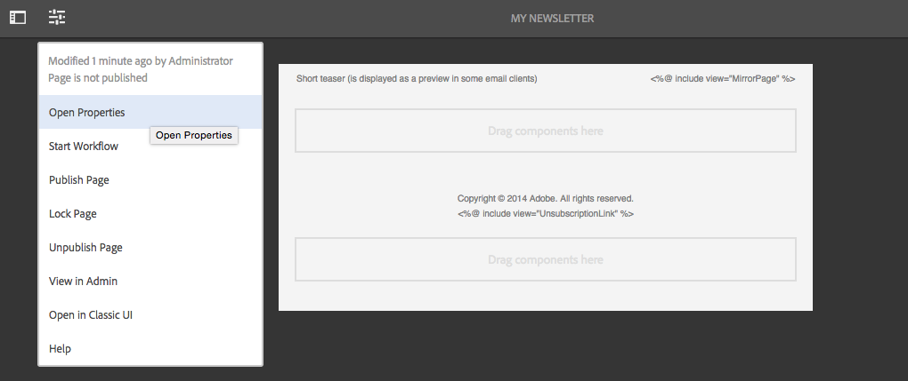
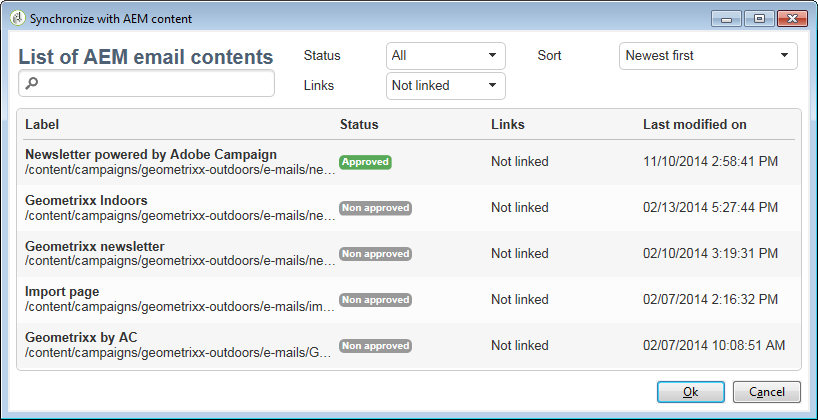

# Trabalhar com o Adobe Campaign Classic e o Adobe Campaign Standard{#working-with-adobe-campaign-classic-and-adobe-campaign-standard}

É possível criar conteúdo de email no AEM e processá-lo em emails do Adobe Campaign. Para fazer isso, é preciso:

1. Criar um novo informativo no AEM a partir de um modelo específico do Adobe Campaign.
1. Selecionar [um serviço do Adobe Campaign](#selecting-the-adobe-campaign-cloud-service-and-template) antes de editar o conteúdo para acessar todos os recursos.
1. Editar o conteúdo.
1. Validar o conteúdo.

O conteúdo pode ser sincronizado com uma entrega no Adobe Campaign. As instruções detalhadas estão descritas neste documento.

Consulte também [Criação de formulários do Adobe Campaign no AEM](/help/sites-authoring/adobe-campaign-forms.md).

>[!NOTE]
>
>Para usar essa funcionalidade, você deve configurar o AEM para se integrar com o [Adobe Campaign](/help/sites-administering/campaignonpremise.md) ou com o [Adobe Campaign Standard](/help/sites-administering/campaignstandard.md).

## Enviar conteúdo de email por meio do Adobe Campaign {#sending-email-content-via-adobe-campaign}

Depois de configurar o AEM e o Adobe Campaign, é possível criar conteúdo de email diretamente no AEM e processá-lo no Adobe Campaign.

Ao criar conteúdo Adobe Campaign no AEM, é necessário vincular a um serviço Adobe Campaign antes de editar o conteúdo para acessar toda a funcionalidade.

Há dois casos possíveis:

* O conteúdo pode ser sincronizado com uma entrega do Adobe Campaign. Isso permite usar conteúdo do AEM em uma entrega.
* (Somente Adobe Campaign Classic) O conteúdo pode ser enviado diretamente para o Adobe Campaign, que gera automaticamente uma nova entrega de email. Esse modo tem restrições.

As instruções detalhadas estão descritas neste documento.

### Criar novo conteúdo email {#creating-new-email-content}

>[!NOTE]
>
>When adding email templates, be sure to add them under **/content/campaigns** to make them available.

#### Criar novo conteúdo email {#creating-new-email-content-1}

1. In AEM select **Sites** then **Campaigns**, then browse to where your email campaigns are managed. In the following example, the path is **Sites** > **Campaigns** > **Geometrixx Outdoors** > **Email Campaigns**.

   >[!NOTE]
   >
   >[Amostras de email estão disponíveis apenas no Geometrixx](/help/sites-developing/we-retail.md). Baixe o conteúdo de amostra do Geometrixx pelo Compartilhamento de pacotes.

   

1. Selecione **Criar** e **Criar página**.
1. Selecione um dos modelos disponíveis específico do Adobe Campaign ao qual você está se conectando e clique em **Próximo**. Há três modelos disponíveis por padrão:

   * **Email** da Adobe Campaign Classic: permite que você adicione conteúdo a um modelo predefinido (duas colunas) antes de enviá-lo para a Adobe Campaign Classic para delivery.
   * **Email** da Adobe Campaign Standard: permite que você adicione conteúdo a um modelo predefinido (duas colunas) antes de enviá-lo para a Adobe Campaign Standard para delivery.

1. Fill in the **Title** and optionally the **Description** and click **Create**. O título é usado como o assunto do boletim informativo/email, a menos que você o substitua ao editar o email.

### Selecionar o modelo e o serviço de nuvem do Adobe Campaign {#selecting-the-adobe-campaign-cloud-service-and-template}

Para fazer a integração com o Adobe Campaign, é necessário adicionar um serviço de nuvem do Adobe Campaign à página. Isso fornece acesso à personalização e a outras informações do Adobe Campaign.

Além disso, também pode ser necessário selecionar o modelo do Adobe Campaign, alterar o assunto e adicionar conteúdo em texto simples para os usuários que não verão o email em HTML.

É possível selecionar o serviço de nuvem na guia **Sites** ou no email/boletim informativo depois de tê-los criado.

Selecionar o serviço de nuvem na guia **Sites** é a abordagem recomendada. Selecione o serviço de nuvem do email/boletim informativo que requer uma solução.

Na página **Sites**:

1. No AEM, selecione a página de email e clique em **Propriedades da exibição**.

   

1. Select **Edit** and then the **Cloud services** tab and scroll down to the bottom and click the + sign to add a configuration and then select **Adobe Campaign**.

   

1. Selecione a configuração que corresponde à instância do Adobe Campaign na lista suspensa e confirme clicando em **Salvar**.
1. É possível exibir o modelo aplicado ao email, clicando na guia **Adobe Campaign**. Caso deseje selecionar outro modelo, é possível acessá-lo do email ao editar.

   If you would like to apply a specific email delivery template (from Adobe Campaign), other than the default mail template, in **Properties**, select the **Adobe Campaign** tab. Digite o nome interno do modelo de entrega de email na instância relacionada do Adobe Campaign.

   O modelo selecionado determina quais campos de personalização estarão disponíveis no Adobe Campaign.

   

Na criação do boletim informativo/email, talvez não seja possível selecionar a configuração do serviço de nuvem do Adobe Campaign nas **Propriedades da página** devido a um problema de layout. É possível usar a solução descrita aqui:

1. No AEM, selecione a página do email e clique em **Editar**. Clique em **Abrir propriedades**.

   

1. Select **Cloud services** and click **+** to add a configuration. Selecione qualquer configuração visível (não importa qual). Clique ou toque no sinal de **+** para adicionar outra configuração e selecione **Adobe Campaign**.

   >[!NOTE]
   >
   >Como alternativa, é possível selecionar os serviços de nuvem em **Propriedades da exibição** na guia **Sites**.

1. Selecione a configuração que corresponde à sua instância do Adobe Campaign na lista suspensa, exclua a primeira configuração que você criou que não foi para o Adobe Campaign e, em seguida, confirme clicando na marca de seleção.
1. Continue com a etapa 4 do procedimento anterior para selecionar modelos e adicionar texto simples.

### Edição do conteúdo de email {#editing-email-content}

Para editar o conteúdo do email:

1. Abra o email e, por padrão, acesse o modo de Edição.

   

1. If you would like to change the subject of the email or add plain text for those users who will not view the email in HTML, select **Email** and add a subject and text. Selecione o ícone de página para gerar automaticamente uma versão simples do HTML. Clique na marca de seleção ao terminar.

   É possível personalizar o boletim informativo usando os campos de personalização do Adobe Campaign. Para adicionar um campo de personalização, abra o seletor de campo de personalização clicando no botão que exibe o logotipo do Adobe Campaign. Em seguida, será possível escolher de todos os campos disponíveis para esse boletim informativo.

   >[!NOTE]
   >
   >Se os campos de personalização nas propriedades do editor estiverem acinzentados, verifique sua configuração novamente.

   

1. Open the components panel on left side of screen and select **Adobe Campaign Newsletter** from the drop-down menu to find those components.

   

1. Arraste os componentes diretamente na página e edite-os de acordo. Por exemplo, é possível arrastar um componente **Texto e personalização (Campanha)** e adicionar texto personalizado.

   

   See [Adobe Campaign Components](/help/sites-authoring/adobe-campaign-components.md) for a detailed description of each component.

   

### Adicionar personalização {#inserting-personalization}

Ao editar o conteúdo, é possível inserir:

* Campos de contexto do Adobe Campaign. Esses são campos que você pode inserir no texto que serão adaptados de acordo com os dados do recipient (por exemplo, nome, sobrenome ou quaisquer dados da dimensão do público alvo).
* Blocos de personalização do Adobe Campaign. Esses são blocos de conteúdo predefinido que não estão relacionados aos dados do recipient, como o logotipo de uma marca ou o link para um mirror page.

Consulte [Componentes do Adobe Campaign](/help/sites-authoring/adobe-campaign-components.md) para obter uma descrição completa dos componentes de campanha.

>[!NOTE]
>
>* Somente os campos da dimensão de direcionamento de **Perfis** do Adobe Campaign são considerados.
>* When viewing Properties from **Sites**, you do not have access to the Adobe Campaign context fields. É possível acessá-los diretamente do email ao editar.

>

Para inserir a personalização:

1. Insert a new **Newsletter** > **Text &amp; Personalization (Campaign)** component by dragging it onto the page.

   

1. Abra o componente, clicando no ícone de Lápis. O editor local é aberto.

   

   >[!NOTE]
   >
   >**Para o Adobe Campaign Standard:**
   >
   >* Os campos de contexto disponíveis correspondem à dimensão de direcionamento **Perfis** no Adobe Campaign.
   >* See [Linking an AEM page to an Adobe Campaign email](#linking-an-aem-page-to-an-adobe-campaign-email-adobe-campaign-standard).

   >
   >**Para o Adobe Campaign Classic:**
   >
   >* Available context fields are dynamically recovered from the Adobe Campaign **nms:seedMember** schema. Os dados da extensão de destino são recuperados dinamicamente do fluxo de trabalho que contém a entrega sincronizada com o conteúdo. (See the [Synchronizing content created in AEM with a delivery from Adobe Campaign](#synchronizing-content-created-in-aem-with-a-delivery-from-adobe-campaign-classic) section).
      >
      >
   * To add or hide personalization elements, see [Managing personalization fields and blocks](/help/sites-administering/campaignonpremise.md#managing-personalization-fields-and-blocks).
   >* **Importante:** todos os campos da tabela de distribuição também devem estar na tabela de destinatários (ou na tabela de contatos correspondente).

1. Insira o texto digitando. Insira os campos de contexto ou os blocos de personalização clicando nos componentes do Adobe Campaign e selecionando-os. Quando terminar, selecione a marca de verificação.

   

   Depois de inserir os campos de contexto ou os blocos de personalização, será possível visualizar o boletim informativo e testar seus campos. See [Previewing a Newsletter](#previewing-a-newsletter).

### Visualizar um boletim informativo {#previewing-a-newsletter}

É possível visualizar como o boletim informativo será exibido, além da personalização.

1. Com o boletim informativo aberto, clique em **Visualizar** no canto superior direito do AEM. O AEM mostra a aparência do boletim informativo como os usuários o recebem.

   

   >[!NOTE]
   >
   >Se você estiver usando o Adobe Campaign Standard e o modelo de amostra, dois blocos de personalização indicando o conteúdo inicial (**&quot;&lt;%@ include view=&quot;MirrorPage&quot; %>&quot;** e **&quot;&lt;%@ include view=&quot;UnsubscriptionLink&quot; %>&quot;**) retornarão erros ao importar o conteúdo durante a entrega. É possível ajustá-los selecionando os blocos correspondentes usando o seletor de bloco de personalização.

1. Para visualizar a personalização, abra o ContextHub, clicando/tocando no ícone correspondente na barra de ferramentas. As tags do campo de personalização foram substituídas pelos dados de distribuição do perfil selecionado. Veja como as variáveis se adaptam ao alternar perfis no ContextHub.

   

1. É possível ver os dados de distribuição do Adobe Campaign que estão associados ao perfil atualmente selecionado. Para fazer isso, toque no módulo do Adobe Campaign na barra do ContextHub. Isso abre uma caixa de diálogo que exibe todos os dados de distribuição do perfil atual. Além disso, os dados ajustam-se ao alternar para um perfil diferente.

   

### Aprovação de conteúdo no AEM {#approving-content-in-aem}

Depois que o conteúdo estiver concluído, você pode iniciar o processo de aprovação. Go to the **Workflow** tab of the toolbox and select the **Approve for Adobe Campaign** workflow.

Esse fluxo de trabalho pronto para uso tem duas etapas: revisão e aprovação ou revisão e rejeição. No entanto, esse fluxo de trabalho pode ser estendido e adaptado a um processo mais complexo.

To approve content for Adobe Campaign, apply the workflow by selecting **Workflow** and selecting **Approve for Adobe Campaign** and click **Start Workflow**. Realize as etapas e aprove o conteúdo. Também é possível descartar o conteúdo selecionando **Rejeitar** em vez de **Aprovar** na última etapa do fluxo de trabalho.

Depois de aprovado, o conteúdo é exibido como aprovado no Adobe Campaign. O email pode então ser enviado.

No Adobe Campaign Standard:

No Adobe Campaign Classic

>[!NOTE]
O conteúdo não aprovado pode ser sincronizado com uma entrega no Adobe Campaign, mas a entrega não pode ser realizada. Somente conteúdo aprovado pode ser enviado por meio das entregas do Campaign.

## Vincular o AEM com o Adobe Campaign Standard e o Adobe Campaign Classic {#linking-aem-with-adobe-campaign-standard-and-adobe-campaign-classic}

A forma como você vincula ou sincroniza o AEM com o Adobe Campaign depende da utilização do Adobe Campaign Standard baseado em assinatura ou do Adobe Campaign Classic no local.

Consulte as seguintes seções para obter instruções com base em sua solução do Adobe Campaign:

* [Vincular uma página do AEM a um email do Adobe Campaign (Adobe Campaign Standard)](#linking-an-aem-page-to-an-adobe-campaign-email-adobe-campaign-standard)
* [Sincronizar o conteúdo criado no AEM com uma entrega do Adobe Campaign Classic](#synchronizing-content-created-in-aem-with-a-delivery-from-adobe-campaign-classic)

### Vincular uma página do AEM a um email do Adobe Campaign (Adobe Campaign Standard) {#linking-an-aem-page-to-an-adobe-campaign-email-adobe-campaign-standard}

O Adobe Campaign Standard permite recuperar e vincular o conteúdo criado no AEM com:

* Um email.
* Um modelo de email.

Fazer isso permite entregar o conteúdo. Será possível saber se um boletim informativo está vinculado a uma única entrega pelo código exibido na página.

>[!NOTE]
Se um boletim informativo estiver vinculado a vários delivery, o número de delivery vinculados (mas nem todas as ID são exibidas).

Para vincular uma página criada no AEM com um email do Adobe Campaign:

1. Crie um novo email baseado em um modelo de email específico do AEM. Refer to [Creating emails in Adobe Campaign Standard](https://helpx.adobe.com/br/campaign/standard/channels/using/creating-an-email.html) for more information.

   

1. Abra o bloco **Conteúdo** no painel de entrega.

   

1. Select **Link with an Adobe Experience Manager content** in the toolbar to access the list of contents available in AEM.

   >[!NOTE]
   If the **Link with an Adobe Experience Manager** option does not appear in the action bar, check that the **Content editing mode** is correctly configured set to **Adobe Experience Manager** in the email properties.

   

1. Selecione o conteúdo que deseja usar no email.

   Essa lista especificada:

   * A etiqueta do conteúdo no AEM.
   * O status de aprovação do conteúdo no AEM. Se o conteúdo não estiver aprovado, será possível sincronizá-lo, mas ele terá que ser aprovado para que a entrega seja realizada. No entanto, é possível executar algumas operações, como enviar uma comprovação ou o teste de visualização.
   * A data da última modificação de conteúdo.
   * Qualquer conteúdo já vinculado a uma entrega.

   >[!NOTE]
   Por padrão, o conteúdo que já está sincronizado com uma entrega está oculto. No entanto, é possível exibi-lo e usá-lo. Por exemplo, se quiser usar o conteúdo como um modelo para várias entregas.

   Quando o email está vinculado a um conteúdo do AEM, o conteúdo não pode ser editado no Adobe Campaign.

1. Especifique os outros parâmetros do email a partir do painel (públicos, cronograma de execução).
1. Realize a entrega do email. Durante a análise de entrega, a versão mais atualizada do conteúdo do AEM será recuperada.

   >[!NOTE]
   Se o conteúdo for atualizado no AEM enquanto estiver vinculado a um email, ele será atualizado automaticamente no Adobe Campaign durante a análise. A sincronização também pode ser executada manualmente usando a opção **Atualizar o conteúdo do Adobe Experience Manager** na barra de ações do conteúdo.
   É possível substituir o link entre um email e o conteúdo do AEM usando **Excluir o link com o conteúdo do Adobe Experience Manager** da barra de ações do conteúdo. Este botão ficará disponível apenas se um conteúdo já estiver vinculado à entrega. Para vincular um conteúdo diferente com uma entrega, você deve excluir o link de conteúdo atual para poder estabelecer um link.
   Quando o link for excluído, o conteúdo local será mantido e poderá ser editado no Adobe Campaign. Se vincular novamente o conteúdo depois de modificá-lo, todas as alterações serão perdidas.

### Sincronizar o conteúdo criado no AEM com uma entrega do Adobe Campaign Classic {#synchronizing-content-created-in-aem-with-a-delivery-from-adobe-campaign-classic}

O Adobe Campaign permite recuperar e sincronizar o conteúdo criado no AEM com:

* Uma entrega da campanha
* Uma atividade de entrega em um fluxo de trabalho de campanha
* Uma entrega recorrente
* Uma entrega contínua
* Uma entrega do Centro de mensagens
* Um modelo de entrega

No AEM, se um boletim informativo estiver vinculado a uma única entrega, o código da entrega será exibido na página.

>[!NOTE]
Se o boletim informativo estiver vinculado a vários delivery, o número de delivery vinculados (mas nem todas as ID são exibidas).
[!NOTE]
A etapa do fluxo de trabalho **Publicar no Adobe Campaign** foi descontinuada no AEM 6.1. Essa etapa fazia parte da integração do AEM 6.0 com o Adobe Campaign e não é mais necessária.

Para sincronizar o conteúdo criado no AEM com uma entrega do Adobe Campaign:

1. Create a delivery or add a delivery activity to a campaign workflow by selecting the **Email delivery with AEM content (mailAEMContent)** delivery template.

   

1. Select **Synchronize** in the toolbar to access the list of contents available in AEM.

   >[!NOTE]
   If the **Synchronize** option does not appear in the delivery&#39;s toolbar, check that the **Content editing mode** field is correctly configured in **AEM** by selecting **Properties** > **Advanced**.

   

1. Selecione o conteúdo que deseja sincronizar com a entrega.

   Essa lista especificada:

   * A etiqueta do conteúdo no AEM.
   * O status de aprovação do conteúdo no AEM. Se o conteúdo não estiver aprovado, será possível sincronizá-lo, mas ele terá que ser aprovado para que a entrega seja realizada. No entanto, é possível executar algumas operações, como enviar um BAT ou o teste de visualização.
   * A data da última modificação do conteúdo.
   * Qualquer conteúdo já vinculado a uma entrega.

   >[!NOTE]
   Por padrão, o conteúdo que já está sincronizado com uma entrega está oculto. No entanto, é possível exibi-lo e usá-lo. Por exemplo, se quiser usar o conteúdo como um modelo para várias entregas.

   

1. Especifique os outros parâmetros da entrega (destino, etc.)
1. Se necessário, inicie o processo de aprovação de entrega no Adobe Campaign. A aprovação do conteúdo no AEM é necessária, além das aprovações configuradas no Adobe Campaign (orçamento, destino, etc.). A aprovação do conteúdo no Adobe Campaign só será possível se o conteúdo estiver aprovado no AEM.
1. Realize a entrega. Durante a análise de entrega, a versão mais atualizada do conteúdo do AEM será recuperada.

   >[!NOTE]
   * Após a sincronização da entrega e do conteúdo, o conteúdo da entrega no Adobe Campaign se tornará somente leitura. O assunto e o conteúdo do email não podem mais ser modificados.
   * Se o conteúdo for atualizado no AEM enquanto estiver vinculado a uma entrega no Adobe Campaign, ele será atualizado automaticamente na entrega durante sua análise. The synchronization can also be executed manually using the **Refresh content now** button.
   * You can cancel synchronization between a delivery and AEM content using the **Desynchronize** button. Isso só estará disponível se um conteúdo já estiver sincronizado com a entrega. Para sincronizar um conteúdo diferente com uma entrega, você deve cancelar a sincronização de conteúdo atual para poder estabelecer um novo link.
   * Caso seja dessincronizado, o conteúdo local será mantido e poderá ser editado no Adobe Campaign. Se você ressincronizar o conteúdo depois de modificá-lo, perderá todas as alterações.
   * Para entregas recorrentes e contínuas, a sincronização com o conteúdo do AEM é interrompida sempre que a entrega é realizada.

